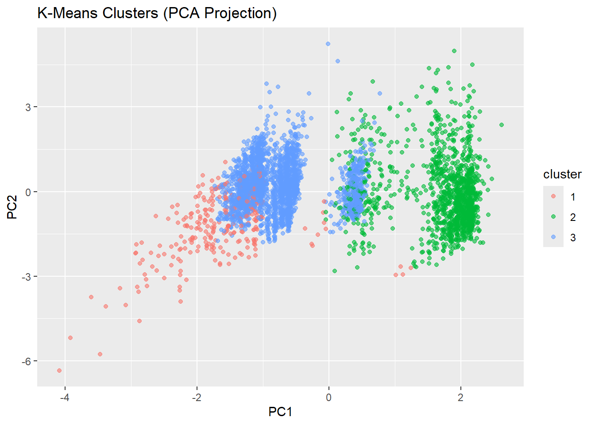
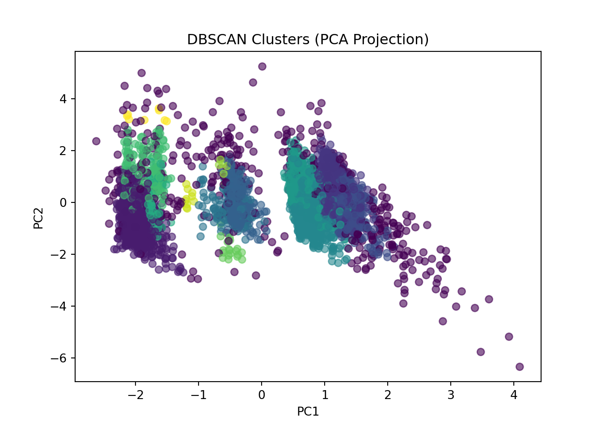

## Loading Data {.unnumbered}

We reuse the same prepared data introduced earlier.

### R: Loading Data and Creating Splits {.unnumbered}


::: {.cell}

```{.r .cell-code}
library(tidyverse)
library(dplyr)

bank <- read.csv("data/raw/bank-additional.csv", sep = ";", stringsAsFactors = FALSE)
```
:::


### Python: Loading Data and Creating Splits {.unnumbered}


::: {.cell}

```{.python .cell-code}
import pandas as pd
from sklearn.compose import ColumnTransformer

bank = pd.read_csv("data/raw/bank-additional.csv", sep=";")
```
:::


---

---

---

## From Prediction to Structure

So far in this module, most of our work has been **supervised**:

- we had a target variable,
- we trained models to predict it,
- we evaluated performance using metrics such as accuracy, precision, and recall.

Clustering changes the story.

In clustering, we do **not** predict an outcome.  
Instead, we try to discover **structure** in the data.

---

### What is clustering trying to do?

Clustering groups observations that are **similar** to each other, based on their features.

The key difference is:

> **There is no target label telling us what the “correct” cluster is.**

So we are not answering:
- “Is this prediction correct?”

We are answering questions such as:
- “Do the data naturally form groups?”
- “If we form groups, are they coherent and interpretable?”
- “Do different algorithms suggest different structures?”

This means evaluation is fundamentally different.

---

### What does “evaluation” mean in clustering?

Because we do not have ground-truth cluster labels, we cannot talk about accuracy in the same way.

Instead, we often rely on:

- **internal measures** (e.g. compactness vs separation),
- **visualisation** (e.g. PCA plots),
- **interpretability** (do the clusters make sense?),
- and stability (do clusters change a lot when we change settings?).

None of these measures are perfect.

That is an important lesson:

> **Clustering results are not “facts”. They are modelling outcomes.**

---

### Why this matters for our datasets

We are using two datasets in different ways:

- **Bank Marketing dataset** (demo):
  - we already know there *is* a target (`y`),  
  - but clustering ignores it,
  - we use it to practice clustering mechanics and interpretation.

- **Online Retail dataset** (your project):
  - clustering can be genuinely meaningful,
  - because there is no natural target,
  - and grouping customers or invoices can help discover behavioural segments.

---

### Key idea to carry forward

> **In clustering, your choices define what “similarity” means.**

That includes decisions about:

- which features to use,
- whether and how to scale them,
- which clustering algorithm to apply,
- and how to interpret the results.

In the next section, we will prepare the Bank Marketing data for clustering, paying close attention to these choices.

---

## Preparing the Data for Clustering

### Selecting Features

Clustering algorithms such as **k-means** rely on numerical distances (typically Euclidean distance).

Therefore:
- we must use **numeric variables**,
- we exclude the target variable `y`,
- and we avoid purely categorical variables for now.

For demonstration, we select a subset of numeric variables:

- `age`
- `duration`
- `campaign`
- `euribor3m`
- `cons.price.idx`
- `cons.conf.idx`

These capture:
- client characteristics,
- campaign intensity,
- economic context.

---

#### R: Selecting Numeric Variables


::: {.cell}

```{.r .cell-code}
num_vars <- c("age", "duration", "campaign",
              "euribor3m", "cons.price.idx", "cons.conf.idx")

cluster_data <- bank[, num_vars]

head(cluster_data)
```

::: {.cell-output .cell-output-stdout}

```
  age duration campaign euribor3m cons.price.idx cons.conf.idx
1  30      487        2     1.313         92.893         -46.2
2  39      346        4     4.855         93.994         -36.4
3  25      227        1     4.962         94.465         -41.8
4  38       17        3     4.959         94.465         -41.8
5  47       58        1     4.191         93.200         -42.0
6  32      128        3     0.884         94.199         -37.5
```


:::
:::


::: {.callout-note collapse="true"}

#### What this code is doing {.unnumbered}

Creates a vector of selected numeric variables.

Subsets the dataset to include only these columns.

Displays the first few rows.

#### Why this matters:

* k-means operates on numeric input.
* Including categorical variables without encoding would break distance calculations.
* Excluding `y` ensures we are not leaking outcome information.

:::

#### Python: Selecting Numeric Variables


::: {.cell}

```{.python .cell-code}
num_vars = ["age", "duration", "campaign",
            "euribor3m", "cons.price.idx", "cons.conf.idx"]

cluster_data = bank[num_vars]

cluster_data.head()
```

::: {.cell-output .cell-output-stdout}

```
   age  duration  campaign  euribor3m  cons.price.idx  cons.conf.idx
0   30       487         2      1.313          92.893          -46.2
1   39       346         4      4.855          93.994          -36.4
2   25       227         1      4.962          94.465          -41.8
3   38        17         3      4.959          94.465          -41.8
4   47        58         1      4.191          93.200          -42.0
```


:::
:::

::: {.callout-note collapse="true"}

#### Why we explicitly define variables

Even if many variables are numeric, we choose them deliberately.

Clustering is sensitive to:

* which dimensions are included,
* how many dimensions are included,
* and whether some dominate others.

Feature choice defines similarity.

:::

---

### Why Scaling Is Not Optional in Clustering

Consider the variables:

* `duration` (measured in seconds),
* `age` (measured in years),
* `cons.price.idx` (around ~93–95),
* `euribor3m` (around ~0–5).

If we compute Euclidean distance directly:

* variables with larger numerical ranges dominate,
* clustering becomes biased toward those dimensions.

This is different from decision trees:

* trees are scale-invariant,
* distance-based methods are not.

> In clustering, scaling changes geometry. Geometry determines clusters.

---

#### R: Standardising the Data


::: {.cell}

```{.r .cell-code}
cluster_scaled <- scale(cluster_data)

head(cluster_scaled)
```

::: {.cell-output .cell-output-stdout}

```
            age   duration   campaign  euribor3m cons.price.idx cons.conf.idx
[1,] -0.9806327  0.9038420 -0.2092029 -1.3315455     -1.1853037    -1.2407884
[2,] -0.1079784  0.3502577  0.5695650  0.7116120      0.7151058     0.8921608
[3,] -1.4654407 -0.1169518 -0.5985868  0.7733336      1.5280876    -0.2831377
[4,] -0.2049400 -0.9414391  0.1801811  0.7716031      1.5280876    -0.2831377
[5,]  0.6677144 -0.7804678 -0.5985868  0.3285921     -0.6553984    -0.3266673
[6,] -0.7867095 -0.5056387  0.1801811 -1.5790087      1.0689514     0.6527481
```


:::
:::


::: {.callout-note collapse="true"}

#### What `scale()` does

Subtracts the mean from each variable.

* Divides by the standard deviation.
* Produces variables with mean = 0 and standard deviation = 1.

#### Why this matters:

* All features now contribute equally to distance.
* Clustering becomes about relative patterns, not magnitude differences.

:::

#### Python: Standardising the Data


::: {.cell}

```{.python .cell-code}
from sklearn.preprocessing import StandardScaler

scaler = StandardScaler()
cluster_scaled = scaler.fit_transform(cluster_data)

cluster_scaled[:5]
```

::: {.cell-output .cell-output-stdout}

```
array([[-0.98075178,  0.90395178, -0.20922829, -1.33170721, -1.18544763,
        -1.240939  ],
       [-0.10799146,  0.35030022,  0.56963417,  0.71169841,  0.71519264,
         0.89226907],
       [-1.46561862, -0.11696598, -0.59865952,  0.77342749,  1.52827309,
        -0.28317211],
       [-0.20496483, -0.9415534 ,  0.18020294,  0.77169676,  1.52827309,
        -0.28317211],
       [ 0.66779548, -0.78056252, -0.59865952,  0.32863197, -0.655478  ,
        -0.32670697]])
```


:::
:::


::: {.callout-note collapse="true"}

#### What this code is doing

* Creates a `StandardScaler` object.
* Fits it to the data (learns mean and variance).
* Transforms the data to standardised form.

Important distinction:

* Trees did not require scaling.
* k-means and other distance-based algorithms do.

:::

### Conceptual Checkpoint

Before moving to clustering:

* We selected numeric variables intentionally.
* We excluded the target variable.
* We standardised features to avoid dominance.

These are not technical details. They are modelling decisions.

In the next section, we apply k-means, the most widely used variance-based clustering algorithm.

---

## K-Means — Clustering by Minimising Variance

We now apply the first clustering algorithm: **k-means**.

K-means is one of the simplest and most widely used clustering methods.

Its goal is:

> Partition the data into **k clusters**  
> such that within-cluster variance is minimised.

---

### Conceptual Overview

K-means works by:

1. Choosing `k` initial cluster centres.
2. Assigning each observation to the nearest centre.
3. Updating the centres to the mean of assigned points.
4. Repeating steps 2–3 until convergence.

The algorithm optimises:

> **Within-Cluster Sum of Squares (WCSS)**

That is, it tries to keep clusters compact.

Important assumptions:

- Clusters are roughly spherical.
- Distance is Euclidean.
- `k` must be chosen in advance.

---

### Fitting K-Means (k = 3)

For demonstration, we choose `k = 3`.

This choice is arbitrary for now — we will later discuss how to assess it.

---

#### R: Fitting K-Means


::: {.cell}

```{.r .cell-code}
set.seed(42)

kmeans_model <- kmeans(
  cluster_scaled,
  centers = 3,
  nstart = 20
)

kmeans_model
```

::: {.cell-output .cell-output-stdout}

```
K-means clustering with 3 clusters of sizes 276, 1338, 2505

Cluster means:
           age    duration   campaign  euribor3m cons.price.idx cons.conf.idx
1 -0.026825714 -0.36367207  2.8268633  0.7034673      0.5707471     0.2045985
2  0.010868445  0.04860004 -0.2164784 -1.4188989     -0.9058962    -0.4554342
3 -0.002849534  0.01411044 -0.1958348  0.6803711      0.4209832     0.2207193

Clustering vector:
   [1] 2 3 3 3 3 2 2 3 3 3 3 3 3 3 2 3 1 3 3 3 3 2 3 3 1 3 3 2 3 3 2 3 2 3 1 3 3
  [38] 3 2 2 2 3 2 3 2 2 3 2 3 3 2 2 3 2 2 3 1 3 3 2 2 2 2 2 2 3 2 3 3 2 3 3 2 2
  [75] 3 3 3 3 1 1 2 3 1 2 3 3 3 3 3 3 3 3 3 3 3 3 3 1 3 3 2 3 2 2 2 2 3 3 2 2 2
 [112] 3 3 3 3 3 3 3 3 2 3 2 3 2 3 3 2 3 2 3 3 2 2 3 3 2 3 2 3 3 1 3 3 2 3 2 3 3
 [149] 2 3 2 3 3 2 3 3 3 3 3 2 3 2 2 2 3 2 2 2 3 1 2 1 3 2 3 1 3 3 2 3 2 3 3 3 2
 [186] 2 3 2 3 3 3 1 1 3 2 3 3 3 2 3 2 3 3 1 2 3 3 3 3 3 3 3 3 2 2 1 2 3 3 3 3 3
 [223] 3 3 1 2 2 3 2 3 3 3 3 3 3 3 2 3 2 3 3 3 3 3 2 2 3 2 3 3 3 2 1 3 1 3 3 3 3
 [260] 3 3 3 2 3 3 3 3 3 3 3 3 3 3 3 2 3 3 3 2 3 3 3 2 3 3 3 1 3 2 3 3 2 2 1 3 2
 [297] 3 2 1 2 3 3 3 3 3 3 3 3 2 3 3 3 3 3 3 2 3 3 3 3 2 1 3 3 3 3 1 1 2 3 3 3 3
 [334] 2 2 2 3 3 2 2 2 3 3 3 3 2 1 3 3 3 1 3 3 3 3 3 3 2 2 3 3 3 3 2 1 3 2 3 3 3
 [371] 3 2 3 3 3 1 3 3 2 1 3 2 3 2 3 2 3 2 2 2 3 2 3 3 3 3 3 1 2 3 2 1 3 3 3 2 3
 [408] 3 3 3 3 3 3 3 3 3 2 1 3 3 2 3 3 2 3 2 3 1 2 3 3 2 3 3 3 3 3 3 2 3 3 2 3 3
 [445] 3 3 2 1 2 2 2 1 3 2 3 3 2 3 3 1 3 2 3 2 3 1 3 3 2 2 3 3 3 3 3 3 3 2 3 3 3
 [482] 3 3 3 1 3 2 3 3 3 2 2 3 2 2 2 3 3 3 2 3 3 2 3 3 2 1 3 3 2 3 2 2 3 2 2 3 2
 [519] 3 3 3 2 3 2 3 3 1 3 3 3 1 3 2 3 3 2 2 2 3 3 3 3 2 1 3 2 2 3 2 3 2 2 3 2 2
 [556] 3 3 3 3 3 3 3 3 3 2 3 3 3 3 3 2 2 3 3 3 3 2 3 3 2 3 3 2 2 3 1 3 3 2 2 3 3
 [593] 3 3 3 3 1 2 2 3 3 3 3 3 2 1 3 2 3 2 3 2 2 2 3 3 3 3 3 2 3 3 2 2 2 3 3 2 2
 [630] 2 3 2 3 3 2 3 3 3 3 3 3 1 3 3 2 3 3 3 3 2 2 3 3 1 3 3 2 2 2 2 2 3 3 2 3 2
 [667] 3 3 3 2 2 1 1 2 2 3 2 3 3 3 3 3 3 3 3 2 3 1 1 2 3 3 3 2 3 2 2 3 3 2 2 2 3
 [704] 2 3 2 3 3 3 3 2 3 2 1 2 2 1 3 2 3 3 2 3 3 3 3 3 1 3 3 3 3 2 2 2 1 2 2 2 3
 [741] 3 2 3 3 3 2 2 2 2 2 2 3 2 3 1 3 3 1 3 2 2 3 3 2 2 2 1 3 3 3 3 3 2 1 3 2 3
 [778] 3 3 2 2 3 2 3 2 2 3 3 3 1 3 3 2 2 2 3 2 2 2 2 3 2 2 3 3 3 3 3 2 2 3 2 3 2
 [815] 2 3 3 1 3 1 3 3 3 2 2 3 3 3 3 2 2 2 3 3 3 3 1 3 3 3 3 2 3 2 2 3 3 3 2 2 3
 [852] 2 3 3 3 3 2 3 2 3 2 2 3 2 1 3 3 3 2 2 3 3 3 3 2 2 3 3 3 3 3 3 3 3 3 3 1 3
 [889] 3 2 3 2 2 2 3 2 3 3 3 2 2 3 1 2 3 2 3 3 2 2 3 2 3 3 2 2 2 3 2 3 2 3 2 3 3
 [926] 3 2 2 3 3 3 3 3 3 2 1 2 2 2 3 3 3 1 3 3 3 3 2 3 3 3 3 2 3 2 1 2 2 3 3 3 3
 [963] 3 2 3 2 3 2 3 3 2 1 2 2 3 2 2 2 3 3 3 3 2 3 2 3 3 3 3 3 1 3 3 3 3 3 3 3 3
[1000] 3 2 3 3 1 2 3 2 3 2 3 2 2 3 3 3 3 3 3 2 2 3 2 2 3 2 3 3 2 3 3 3 3 3 1 3 2
[1037] 3 3 3 2 2 2 3 3 3 2 2 2 3 2 3 3 2 1 2 2 3 3 3 3 3 3 2 3 3 3 2 3 3 2 3 3 3
[1074] 2 2 3 3 3 3 2 2 3 1 1 3 3 2 3 2 3 1 3 3 2 2 3 2 3 2 3 3 3 3 3 3 2 2 3 2 3
[1111] 3 2 2 2 2 2 1 3 3 2 3 3 3 2 2 2 3 3 1 2 3 2 2 2 3 3 3 3 2 3 3 3 3 2 3 2 2
[1148] 1 2 3 3 2 3 1 2 3 3 3 2 3 3 1 3 2 2 3 3 3 2 2 3 3 3 2 3 3 3 3 3 3 2 2 3 3
[1185] 2 3 3 3 1 2 2 3 3 3 3 1 3 3 3 1 2 3 1 1 3 3 3 3 3 3 3 3 3 2 2 2 1 2 3 1 3
[1222] 3 3 3 3 3 2 2 1 3 3 3 3 3 2 2 3 3 3 3 3 3 3 3 1 3 2 1 2 2 2 3 2 1 3 3 3 2
[1259] 3 3 2 3 2 3 2 1 3 3 3 2 3 3 2 3 3 2 3 3 3 3 3 3 3 2 3 3 2 2 3 3 2 3 3 1 2
[1296] 3 3 3 2 3 3 3 2 1 3 2 2 2 1 3 2 1 3 2 2 3 3 3 3 3 3 3 3 2 2 2 3 3 1 3 2 3
[1333] 2 3 3 3 3 3 3 3 3 3 3 3 3 3 3 3 2 3 3 3 2 3 3 3 2 2 3 3 2 2 2 2 1 2 2 2 2
[1370] 2 3 3 3 3 3 2 3 2 3 2 3 1 3 3 3 1 1 3 3 2 3 3 3 2 2 2 3 3 3 3 2 1 2 3 3 2
[1407] 1 3 3 3 2 3 3 2 3 3 3 3 3 3 3 3 3 3 3 2 3 1 3 3 3 3 3 2 2 2 1 3 3 3 3 3 3
[1444] 3 2 1 3 3 1 2 3 3 2 3 3 3 2 1 2 2 3 3 1 3 2 2 2 3 2 2 2 3 2 3 3 3 3 3 3 3
[1481] 2 3 3 3 2 2 2 3 1 2 3 2 3 3 2 3 3 2 2 3 3 3 3 3 3 1 3 3 2 3 2 3 3 2 2 2 3
[1518] 3 3 2 3 1 3 3 3 2 2 3 3 3 3 2 2 3 3 3 3 2 3 2 2 2 3 3 2 3 3 3 3 3 3 2 3 3
[1555] 3 3 2 3 2 1 2 3 3 3 3 2 3 1 2 2 3 2 2 3 3 2 2 3 3 3 3 3 3 3 2 2 3 2 3 3 2
[1592] 2 3 2 3 3 3 3 3 2 3 3 1 3 2 3 3 2 2 2 3 2 3 3 2 2 2 3 3 3 3 3 3 3 3 3 2 3
[1629] 2 3 2 3 2 2 3 3 2 3 3 2 2 1 3 3 3 2 3 3 1 3 2 3 2 2 3 3 3 3 2 2 2 2 3 3 2
[1666] 2 3 2 3 2 3 3 2 2 3 2 3 3 3 2 2 3 3 2 2 2 2 2 3 3 2 3 3 3 2 3 3 2 2 3 3 3
[1703] 3 3 3 3 3 3 3 3 3 3 2 2 3 2 3 3 3 2 3 3 3 3 3 3 3 3 3 3 3 2 3 3 2 1 3 3 3
[1740] 3 3 3 3 3 3 2 3 3 3 3 1 2 2 3 2 2 3 3 3 3 3 3 2 3 1 3 2 3 3 2 3 3 2 3 3 3
[1777] 3 3 2 3 3 2 2 3 3 3 2 3 3 3 2 2 2 2 2 3 2 2 2 3 2 2 3 2 2 3 2 3 1 3 3 1 3
[1814] 2 3 2 1 2 3 3 1 2 3 2 2 3 3 3 1 1 3 2 3 3 3 2 2 1 3 3 1 3 2 3 2 2 2 2 1 3
[1851] 2 2 2 2 3 3 1 3 3 2 2 3 2 2 1 2 2 3 2 3 2 2 2 2 3 3 3 3 3 3 1 1 1 3 3 3 3
[1888] 2 3 3 2 2 3 3 3 3 2 2 3 3 2 3 3 3 3 3 1 3 3 3 3 3 3 3 3 1 3 3 3 3 1 2 3 2
[1925] 2 2 3 2 3 2 3 2 2 3 3 2 2 2 3 3 1 3 2 3 2 3 2 3 1 3 3 3 3 3 3 2 3 3 2 3 3
[1962] 2 3 3 3 3 2 3 2 3 3 3 1 3 3 3 2 3 3 3 3 3 3 3 2 3 2 2 3 2 3 3 2 2 2 2 3 3
[1999] 2 1 2 3 3 1 2 3 2 3 3 3 3 3 3 3 2 3 3 3 2 3 2 3 2 3 3 3 3 3 3 3 2 3 3 3 3
[2036] 2 2 2 3 3 3 2 3 3 2 2 3 2 3 3 3 2 3 2 3 2 3 2 3 3 3 3 3 3 3 3 3 3 3 3 3 2
[2073] 2 2 3 3 2 3 3 3 3 3 2 3 1 3 3 1 2 3 3 2 2 3 3 3 3 3 3 3 3 3 2 2 3 3 3 3 1
[2110] 3 3 2 2 2 2 3 3 2 3 3 3 2 2 3 3 3 3 3 3 3 2 1 3 3 2 3 3 1 2 2 2 3 2 3 2 2
[2147] 3 2 2 3 3 3 3 3 2 1 3 3 2 3 2 3 2 3 3 3 3 3 2 2 2 3 3 3 3 3 3 3 2 3 3 3 2
[2184] 3 1 3 3 2 2 3 3 3 3 3 3 3 2 3 3 2 2 3 1 1 2 3 3 3 2 3 3 2 2 2 2 3 2 2 2 2
[2221] 3 3 3 3 3 3 3 3 2 2 1 3 3 3 2 3 1 3 3 3 2 3 3 2 3 3 3 3 2 3 2 1 3 3 2 3 3
[2258] 3 2 3 3 3 2 2 2 3 3 3 3 3 2 3 2 3 2 3 2 3 2 1 2 3 2 3 3 2 3 3 3 3 3 2 2 3
[2295] 2 2 3 3 2 2 3 1 3 3 3 2 2 2 1 3 3 2 2 3 3 3 2 2 3 3 3 3 1 2 3 2 2 3 3 3 1
[2332] 3 3 3 3 3 2 1 3 3 3 3 3 3 2 2 3 3 2 3 3 1 3 3 2 3 3 1 2 3 1 3 2 2 3 2 2 3
[2369] 2 3 3 3 2 2 3 3 3 3 3 3 3 2 3 2 3 3 3 2 3 3 2 3 3 3 3 3 3 2 2 3 1 3 3 2 3
[2406] 3 2 2 3 2 3 1 3 3 2 3 3 3 3 3 3 3 3 3 2 3 1 1 2 3 3 2 2 2 3 2 2 3 3 3 3 3
[2443] 2 3 2 3 3 3 3 3 3 3 2 2 3 2 3 2 2 3 3 3 2 3 3 2 3 3 3 2 3 3 3 2 2 2 3 1 3
[2480] 1 2 3 3 2 1 1 3 2 2 3 2 3 3 2 3 3 3 3 3 3 2 3 3 3 3 3 3 2 2 3 1 3 3 2 2 3
[2517] 2 2 2 3 3 3 3 2 2 3 2 2 2 3 3 2 2 2 3 1 2 3 3 3 2 3 2 2 3 1 3 2 2 3 3 2 1
[2554] 3 2 2 3 3 3 3 3 2 3 3 3 3 3 3 1 2 3 3 2 3 2 2 3 3 2 2 2 2 1 3 3 3 3 2 3 3
[2591] 2 3 3 2 3 2 3 3 2 3 2 2 3 2 3 2 2 3 3 3 3 2 3 3 3 3 2 3 2 3 2 3 3 2 2 2 1
[2628] 2 3 2 3 3 3 3 2 2 1 2 3 3 3 3 3 3 2 3 3 2 3 3 3 3 2 3 3 3 3 3 2 3 2 2 3 3
[2665] 3 3 3 3 3 3 3 3 1 2 3 1 3 2 2 3 3 2 3 2 1 2 3 1 2 2 2 3 3 3 3 2 3 3 2 2 3
[2702] 3 3 2 2 2 3 3 3 2 3 1 3 2 2 3 2 3 3 2 3 3 1 2 2 2 3 3 3 2 3 3 3 3 3 2 2 1
[2739] 3 2 3 2 3 3 3 3 2 2 3 3 3 2 2 3 3 3 2 3 3 3 3 2 3 2 3 3 2 2 2 3 3 2 3 3 3
[2776] 3 3 2 3 3 2 3 2 3 3 3 2 3 2 2 3 3 2 3 3 2 3 2 3 3 2 1 3 3 3 3 3 3 3 3 3 2
[2813] 3 2 3 2 3 1 3 2 3 3 3 3 3 3 1 2 3 3 3 3 2 3 3 2 3 3 3 2 2 3 3 3 3 2 3 2 2
[2850] 1 2 3 3 3 3 2 3 2 2 3 2 2 2 3 3 3 3 2 3 2 2 3 3 3 2 2 3 2 3 3 2 2 3 2 3 2
[2887] 1 3 1 3 3 2 2 1 3 3 2 3 2 3 3 3 2 3 3 2 3 3 3 2 3 3 2 2 3 2 2 3 3 2 2 2 3
[2924] 2 2 2 2 3 3 2 3 2 2 2 3 3 3 3 3 2 2 3 3 3 3 3 1 3 3 3 2 2 3 3 1 3 2 3 3 3
[2961] 3 3 3 3 2 3 2 2 3 3 3 3 1 1 3 3 3 3 3 3 2 2 3 3 3 3 3 3 1 2 3 3 3 3 2 1 2
[2998] 3 2 3 1 2 2 2 3 3 1 3 3 2 3 3 1 3 2 3 3 3 3 3 2 3 3 3 3 3 1 3 3 3 2 2 3 3
[3035] 3 3 2 2 3 3 3 2 2 2 3 3 3 2 3 2 3 3 2 2 3 3 2 3 3 2 1 3 3 2 2 3 2 2 3 3 2
[3072] 2 3 2 3 3 3 2 3 2 3 3 3 3 2 3 2 3 3 2 1 3 3 3 3 2 2 3 3 3 3 3 2 3 3 3 2 2
[3109] 3 3 3 3 2 3 3 3 2 1 3 2 3 2 3 3 3 3 3 2 3 3 3 3 2 3 3 3 2 3 3 3 3 3 3 2 3
[3146] 3 3 3 3 3 3 2 3 3 3 3 3 3 2 3 2 2 3 3 3 2 3 3 3 3 2 2 3 2 3 3 3 2 1 2 3 3
[3183] 3 3 3 3 1 2 3 1 2 2 1 2 3 3 3 3 3 3 3 3 3 3 3 3 3 2 2 3 2 3 3 3 3 3 2 3 3
[3220] 3 2 1 3 3 3 2 3 1 3 3 1 3 2 3 3 3 3 3 2 2 3 1 3 2 3 3 3 2 3 3 3 2 3 3 1 3
[3257] 3 2 3 1 2 3 2 3 3 3 3 3 2 3 2 2 2 3 3 2 3 3 3 3 3 3 3 3 2 2 2 3 2 1 3 2 3
[3294] 3 3 2 2 3 2 3 3 3 2 3 3 3 3 2 2 3 3 2 3 2 3 3 3 3 3 1 3 3 2 3 3 2 2 3 2 2
[3331] 1 2 3 1 3 3 2 3 3 3 2 2 2 2 3 2 3 3 3 3 2 3 3 3 2 2 3 3 3 1 3 3 2 3 2 3 3
[3368] 2 3 2 2 2 3 3 3 2 2 3 3 3 2 3 2 3 2 3 3 2 3 2 3 3 2 3 3 2 3 3 1 3 3 3 2 2
[3405] 3 3 3 2 3 3 2 3 2 3 2 3 3 2 1 1 2 3 2 2 3 2 2 3 3 3 3 3 2 1 3 2 2 3 3 3 3
[3442] 3 2 2 1 2 3 3 1 2 3 3 3 2 3 2 3 3 3 2 2 3 2 1 3 3 3 3 3 2 3 3 1 3 3 3 3 3
[3479] 3 3 2 2 3 1 3 3 3 3 3 2 3 3 3 2 2 3 3 3 3 1 2 2 2 3 1 3 3 2 2 3 2 3 3 2 3
[3516] 3 3 3 3 2 2 3 3 3 3 3 2 3 2 2 1 3 3 3 3 3 3 3 3 1 3 3 3 3 1 3 3 2 3 2 3 3
[3553] 3 3 3 3 2 3 3 3 3 3 2 3 1 2 3 3 2 1 3 3 2 2 1 3 2 3 3 3 2 3 3 3 3 1 3 1 3
[3590] 3 3 1 3 2 2 3 2 3 2 3 3 2 1 2 2 3 1 3 3 3 3 3 1 2 3 2 2 2 2 3 1 3 1 3 3 3
[3627] 3 3 3 3 3 3 3 2 2 3 2 2 1 3 3 3 3 3 3 2 3 1 2 1 3 3 3 2 2 2 3 3 2 3 2 3 2
[3664] 3 3 3 3 3 3 3 3 3 3 2 3 3 3 3 3 3 3 2 3 2 1 3 3 2 2 3 3 3 3 2 3 3 3 2 3 2
[3701] 3 3 3 2 2 3 3 2 3 3 2 3 2 3 3 2 3 2 2 3 2 3 3 2 3 3 3 2 2 3 3 3 3 3 3 3 2
[3738] 3 3 3 2 3 3 2 2 3 3 2 3 3 2 3 3 3 3 3 2 2 3 1 3 3 3 3 1 3 2 1 3 2 2 2 2 2
[3775] 2 3 2 3 2 2 3 3 3 3 3 3 3 3 3 2 2 2 2 2 3 3 2 2 2 2 3 2 3 2 3 3 3 3 3 3 2
[3812] 3 3 2 3 3 3 2 2 1 3 1 1 2 3 3 3 3 3 3 3 3 1 3 3 3 3 3 3 3 2 1 2 3 3 3 3 3
[3849] 3 3 3 2 3 3 3 3 3 3 3 2 2 3 2 2 2 2 3 3 2 3 2 3 2 3 3 2 2 1 3 2 3 3 2 3 3
[3886] 3 3 3 3 2 2 3 2 1 1 1 3 3 3 2 3 3 2 2 3 3 3 3 3 3 3 1 1 3 2 3 3 2 2 2 3 3
[3923] 2 1 2 3 2 2 3 3 3 1 3 2 2 3 3 2 2 2 3 2 2 2 3 2 2 3 3 2 3 2 3 3 2 3 3 3 2
[3960] 3 2 2 3 2 3 3 2 3 2 2 2 3 3 2 3 2 2 3 3 2 2 2 3 2 2 3 3 3 2 3 3 3 2 3 3 3
[3997] 2 3 2 2 3 3 2 3 2 2 3 3 3 3 2 3 1 3 3 2 3 3 3 2 3 3 3 3 2 1 3 2 3 3 3 3 3
[4034] 3 2 3 3 3 2 3 3 3 3 3 3 2 2 3 2 1 2 2 3 3 2 3 2 2 3 3 3 2 1 2 1 3 2 2 3 2
[4071] 3 2 2 3 3 3 2 3 3 3 3 3 3 3 1 3 3 3 2 2 3 3 3 3 2 3 3 3 3 3 2 3 3 3 3 3 2
[4108] 1 2 2 3 2 3 3 3 3 2 3 3

Within cluster sum of squares by cluster:
[1] 1520.158 7218.786 7531.259
 (between_SS / total_SS =  34.2 %)

Available components:

[1] "cluster"      "centers"      "totss"        "withinss"     "tot.withinss"
[6] "betweenss"    "size"         "iter"         "ifault"      
```


:::
:::

::: {.callout-note collapse="true"}

#### What this code is doing

* `centers = 3` specifies the number of clusters.
* `nstart = 20` runs the algorithm 20 times with different initialisations.
* The best solution (lowest total within-cluster sum of squares) is kept.

Why this matters:

* K-means can converge to local minima.
* Multiple starts improve stability.

:::

#### Python: Fitting K-Means


::: {.cell}

```{.python .cell-code}
from sklearn.cluster import KMeans

kmeans_model = KMeans(
    n_clusters=3,
    random_state=42,
    n_init=20
)

kmeans_model.fit(cluster_scaled)
```

::: {.cell-output-display}

```{=html}
<style>#sk-container-id-1 {
  /* Definition of color scheme common for light and dark mode */
  --sklearn-color-text: #000;
  --sklearn-color-text-muted: #666;
  --sklearn-color-line: gray;
  /* Definition of color scheme for unfitted estimators */
  --sklearn-color-unfitted-level-0: #fff5e6;
  --sklearn-color-unfitted-level-1: #f6e4d2;
  --sklearn-color-unfitted-level-2: #ffe0b3;
  --sklearn-color-unfitted-level-3: chocolate;
  /* Definition of color scheme for fitted estimators */
  --sklearn-color-fitted-level-0: #f0f8ff;
  --sklearn-color-fitted-level-1: #d4ebff;
  --sklearn-color-fitted-level-2: #b3dbfd;
  --sklearn-color-fitted-level-3: cornflowerblue;
}

#sk-container-id-1.light {
  /* Specific color for light theme */
  --sklearn-color-text-on-default-background: black;
  --sklearn-color-background: white;
  --sklearn-color-border-box: black;
  --sklearn-color-icon: #696969;
}

#sk-container-id-1.dark {
  --sklearn-color-text-on-default-background: white;
  --sklearn-color-background: #111;
  --sklearn-color-border-box: white;
  --sklearn-color-icon: #878787;
}

#sk-container-id-1 {
  color: var(--sklearn-color-text);
}

#sk-container-id-1 pre {
  padding: 0;
}

#sk-container-id-1 input.sk-hidden--visually {
  border: 0;
  clip: rect(1px 1px 1px 1px);
  clip: rect(1px, 1px, 1px, 1px);
  height: 1px;
  margin: -1px;
  overflow: hidden;
  padding: 0;
  position: absolute;
  width: 1px;
}

#sk-container-id-1 div.sk-dashed-wrapped {
  border: 1px dashed var(--sklearn-color-line);
  margin: 0 0.4em 0.5em 0.4em;
  box-sizing: border-box;
  padding-bottom: 0.4em;
  background-color: var(--sklearn-color-background);
}

#sk-container-id-1 div.sk-container {
  /* jupyter's `normalize.less` sets `[hidden] { display: none; }`
     but bootstrap.min.css set `[hidden] { display: none !important; }`
     so we also need the `!important` here to be able to override the
     default hidden behavior on the sphinx rendered scikit-learn.org.
     See: https://github.com/scikit-learn/scikit-learn/issues/21755 */
  display: inline-block !important;
  position: relative;
}

#sk-container-id-1 div.sk-text-repr-fallback {
  display: none;
}

div.sk-parallel-item,
div.sk-serial,
div.sk-item {
  /* draw centered vertical line to link estimators */
  background-image: linear-gradient(var(--sklearn-color-text-on-default-background), var(--sklearn-color-text-on-default-background));
  background-size: 2px 100%;
  background-repeat: no-repeat;
  background-position: center center;
}

/* Parallel-specific style estimator block */

#sk-container-id-1 div.sk-parallel-item::after {
  content: "";
  width: 100%;
  border-bottom: 2px solid var(--sklearn-color-text-on-default-background);
  flex-grow: 1;
}

#sk-container-id-1 div.sk-parallel {
  display: flex;
  align-items: stretch;
  justify-content: center;
  background-color: var(--sklearn-color-background);
  position: relative;
}

#sk-container-id-1 div.sk-parallel-item {
  display: flex;
  flex-direction: column;
}

#sk-container-id-1 div.sk-parallel-item:first-child::after {
  align-self: flex-end;
  width: 50%;
}

#sk-container-id-1 div.sk-parallel-item:last-child::after {
  align-self: flex-start;
  width: 50%;
}

#sk-container-id-1 div.sk-parallel-item:only-child::after {
  width: 0;
}

/* Serial-specific style estimator block */

#sk-container-id-1 div.sk-serial {
  display: flex;
  flex-direction: column;
  align-items: center;
  background-color: var(--sklearn-color-background);
  padding-right: 1em;
  padding-left: 1em;
}


/* Toggleable style: style used for estimator/Pipeline/ColumnTransformer box that is
clickable and can be expanded/collapsed.
- Pipeline and ColumnTransformer use this feature and define the default style
- Estimators will overwrite some part of the style using the `sk-estimator` class
*/

/* Pipeline and ColumnTransformer style (default) */

#sk-container-id-1 div.sk-toggleable {
  /* Default theme specific background. It is overwritten whether we have a
  specific estimator or a Pipeline/ColumnTransformer */
  background-color: var(--sklearn-color-background);
}

/* Toggleable label */
#sk-container-id-1 label.sk-toggleable__label {
  cursor: pointer;
  display: flex;
  width: 100%;
  margin-bottom: 0;
  padding: 0.5em;
  box-sizing: border-box;
  text-align: center;
  align-items: center;
  justify-content: center;
  gap: 0.5em;
}

#sk-container-id-1 label.sk-toggleable__label .caption {
  font-size: 0.6rem;
  font-weight: lighter;
  color: var(--sklearn-color-text-muted);
}

#sk-container-id-1 label.sk-toggleable__label-arrow:before {
  /* Arrow on the left of the label */
  content: "▸";
  float: left;
  margin-right: 0.25em;
  color: var(--sklearn-color-icon);
}

#sk-container-id-1 label.sk-toggleable__label-arrow:hover:before {
  color: var(--sklearn-color-text);
}

/* Toggleable content - dropdown */

#sk-container-id-1 div.sk-toggleable__content {
  display: none;
  text-align: left;
  /* unfitted */
  background-color: var(--sklearn-color-unfitted-level-0);
}

#sk-container-id-1 div.sk-toggleable__content.fitted {
  /* fitted */
  background-color: var(--sklearn-color-fitted-level-0);
}

#sk-container-id-1 div.sk-toggleable__content pre {
  margin: 0.2em;
  border-radius: 0.25em;
  color: var(--sklearn-color-text);
  /* unfitted */
  background-color: var(--sklearn-color-unfitted-level-0);
}

#sk-container-id-1 div.sk-toggleable__content.fitted pre {
  /* unfitted */
  background-color: var(--sklearn-color-fitted-level-0);
}

#sk-container-id-1 input.sk-toggleable__control:checked~div.sk-toggleable__content {
  /* Expand drop-down */
  display: block;
  width: 100%;
  overflow: visible;
}

#sk-container-id-1 input.sk-toggleable__control:checked~label.sk-toggleable__label-arrow:before {
  content: "▾";
}

/* Pipeline/ColumnTransformer-specific style */

#sk-container-id-1 div.sk-label input.sk-toggleable__control:checked~label.sk-toggleable__label {
  color: var(--sklearn-color-text);
  background-color: var(--sklearn-color-unfitted-level-2);
}

#sk-container-id-1 div.sk-label.fitted input.sk-toggleable__control:checked~label.sk-toggleable__label {
  background-color: var(--sklearn-color-fitted-level-2);
}

/* Estimator-specific style */

/* Colorize estimator box */
#sk-container-id-1 div.sk-estimator input.sk-toggleable__control:checked~label.sk-toggleable__label {
  /* unfitted */
  background-color: var(--sklearn-color-unfitted-level-2);
}

#sk-container-id-1 div.sk-estimator.fitted input.sk-toggleable__control:checked~label.sk-toggleable__label {
  /* fitted */
  background-color: var(--sklearn-color-fitted-level-2);
}

#sk-container-id-1 div.sk-label label.sk-toggleable__label,
#sk-container-id-1 div.sk-label label {
  /* The background is the default theme color */
  color: var(--sklearn-color-text-on-default-background);
}

/* On hover, darken the color of the background */
#sk-container-id-1 div.sk-label:hover label.sk-toggleable__label {
  color: var(--sklearn-color-text);
  background-color: var(--sklearn-color-unfitted-level-2);
}

/* Label box, darken color on hover, fitted */
#sk-container-id-1 div.sk-label.fitted:hover label.sk-toggleable__label.fitted {
  color: var(--sklearn-color-text);
  background-color: var(--sklearn-color-fitted-level-2);
}

/* Estimator label */

#sk-container-id-1 div.sk-label label {
  font-family: monospace;
  font-weight: bold;
  line-height: 1.2em;
}

#sk-container-id-1 div.sk-label-container {
  text-align: center;
}

/* Estimator-specific */
#sk-container-id-1 div.sk-estimator {
  font-family: monospace;
  border: 1px dotted var(--sklearn-color-border-box);
  border-radius: 0.25em;
  box-sizing: border-box;
  margin-bottom: 0.5em;
  /* unfitted */
  background-color: var(--sklearn-color-unfitted-level-0);
}

#sk-container-id-1 div.sk-estimator.fitted {
  /* fitted */
  background-color: var(--sklearn-color-fitted-level-0);
}

/* on hover */
#sk-container-id-1 div.sk-estimator:hover {
  /* unfitted */
  background-color: var(--sklearn-color-unfitted-level-2);
}

#sk-container-id-1 div.sk-estimator.fitted:hover {
  /* fitted */
  background-color: var(--sklearn-color-fitted-level-2);
}

/* Specification for estimator info (e.g. "i" and "?") */

/* Common style for "i" and "?" */

.sk-estimator-doc-link,
a:link.sk-estimator-doc-link,
a:visited.sk-estimator-doc-link {
  float: right;
  font-size: smaller;
  line-height: 1em;
  font-family: monospace;
  background-color: var(--sklearn-color-unfitted-level-0);
  border-radius: 1em;
  height: 1em;
  width: 1em;
  text-decoration: none !important;
  margin-left: 0.5em;
  text-align: center;
  /* unfitted */
  border: var(--sklearn-color-unfitted-level-3) 1pt solid;
  color: var(--sklearn-color-unfitted-level-3);
}

.sk-estimator-doc-link.fitted,
a:link.sk-estimator-doc-link.fitted,
a:visited.sk-estimator-doc-link.fitted {
  /* fitted */
  background-color: var(--sklearn-color-fitted-level-0);
  border: var(--sklearn-color-fitted-level-3) 1pt solid;
  color: var(--sklearn-color-fitted-level-3);
}

/* On hover */
div.sk-estimator:hover .sk-estimator-doc-link:hover,
.sk-estimator-doc-link:hover,
div.sk-label-container:hover .sk-estimator-doc-link:hover,
.sk-estimator-doc-link:hover {
  /* unfitted */
  background-color: var(--sklearn-color-unfitted-level-3);
  border: var(--sklearn-color-fitted-level-0) 1pt solid;
  color: var(--sklearn-color-unfitted-level-0);
  text-decoration: none;
}

div.sk-estimator.fitted:hover .sk-estimator-doc-link.fitted:hover,
.sk-estimator-doc-link.fitted:hover,
div.sk-label-container:hover .sk-estimator-doc-link.fitted:hover,
.sk-estimator-doc-link.fitted:hover {
  /* fitted */
  background-color: var(--sklearn-color-fitted-level-3);
  border: var(--sklearn-color-fitted-level-0) 1pt solid;
  color: var(--sklearn-color-fitted-level-0);
  text-decoration: none;
}

/* Span, style for the box shown on hovering the info icon */
.sk-estimator-doc-link span {
  display: none;
  z-index: 9999;
  position: relative;
  font-weight: normal;
  right: .2ex;
  padding: .5ex;
  margin: .5ex;
  width: min-content;
  min-width: 20ex;
  max-width: 50ex;
  color: var(--sklearn-color-text);
  box-shadow: 2pt 2pt 4pt #999;
  /* unfitted */
  background: var(--sklearn-color-unfitted-level-0);
  border: .5pt solid var(--sklearn-color-unfitted-level-3);
}

.sk-estimator-doc-link.fitted span {
  /* fitted */
  background: var(--sklearn-color-fitted-level-0);
  border: var(--sklearn-color-fitted-level-3);
}

.sk-estimator-doc-link:hover span {
  display: block;
}

/* "?"-specific style due to the `<a>` HTML tag */

#sk-container-id-1 a.estimator_doc_link {
  float: right;
  font-size: 1rem;
  line-height: 1em;
  font-family: monospace;
  background-color: var(--sklearn-color-unfitted-level-0);
  border-radius: 1rem;
  height: 1rem;
  width: 1rem;
  text-decoration: none;
  /* unfitted */
  color: var(--sklearn-color-unfitted-level-1);
  border: var(--sklearn-color-unfitted-level-1) 1pt solid;
}

#sk-container-id-1 a.estimator_doc_link.fitted {
  /* fitted */
  background-color: var(--sklearn-color-fitted-level-0);
  border: var(--sklearn-color-fitted-level-1) 1pt solid;
  color: var(--sklearn-color-fitted-level-1);
}

/* On hover */
#sk-container-id-1 a.estimator_doc_link:hover {
  /* unfitted */
  background-color: var(--sklearn-color-unfitted-level-3);
  color: var(--sklearn-color-background);
  text-decoration: none;
}

#sk-container-id-1 a.estimator_doc_link.fitted:hover {
  /* fitted */
  background-color: var(--sklearn-color-fitted-level-3);
}

.estimator-table {
    font-family: monospace;
}

.estimator-table summary {
    padding: .5rem;
    cursor: pointer;
}

.estimator-table summary::marker {
    font-size: 0.7rem;
}

.estimator-table details[open] {
    padding-left: 0.1rem;
    padding-right: 0.1rem;
    padding-bottom: 0.3rem;
}

.estimator-table .parameters-table {
    margin-left: auto !important;
    margin-right: auto !important;
    margin-top: 0;
}

.estimator-table .parameters-table tr:nth-child(odd) {
    background-color: #fff;
}

.estimator-table .parameters-table tr:nth-child(even) {
    background-color: #f6f6f6;
}

.estimator-table .parameters-table tr:hover {
    background-color: #e0e0e0;
}

.estimator-table table td {
    border: 1px solid rgba(106, 105, 104, 0.232);
}

/*
    `table td`is set in notebook with right text-align.
    We need to overwrite it.
*/
.estimator-table table td.param {
    text-align: left;
    position: relative;
    padding: 0;
}

.user-set td {
    color:rgb(255, 94, 0);
    text-align: left !important;
}

.user-set td.value {
    color:rgb(255, 94, 0);
    background-color: transparent;
}

.default td {
    color: black;
    text-align: left !important;
}

.user-set td i,
.default td i {
    color: black;
}

/*
    Styles for parameter documentation links
    We need styling for visited so jupyter doesn't overwrite it
*/
a.param-doc-link,
a.param-doc-link:link,
a.param-doc-link:visited {
    text-decoration: underline dashed;
    text-underline-offset: .3em;
    color: inherit;
    display: block;
    padding: .5em;
}

/* "hack" to make the entire area of the cell containing the link clickable */
a.param-doc-link::before {
    position: absolute;
    content: "";
    inset: 0;
}

.param-doc-description {
    display: none;
    position: absolute;
    z-index: 9999;
    left: 0;
    padding: .5ex;
    margin-left: 1.5em;
    color: var(--sklearn-color-text);
    box-shadow: .3em .3em .4em #999;
    width: max-content;
    text-align: left;
    max-height: 10em;
    overflow-y: auto;

    /* unfitted */
    background: var(--sklearn-color-unfitted-level-0);
    border: thin solid var(--sklearn-color-unfitted-level-3);
}

/* Fitted state for parameter tooltips */
.fitted .param-doc-description {
    /* fitted */
    background: var(--sklearn-color-fitted-level-0);
    border: thin solid var(--sklearn-color-fitted-level-3);
}

.param-doc-link:hover .param-doc-description {
    display: block;
}

.copy-paste-icon {
    background-image: url(data:image/svg+xml;base64,PHN2ZyB4bWxucz0iaHR0cDovL3d3dy53My5vcmcvMjAwMC9zdmciIHZpZXdCb3g9IjAgMCA0NDggNTEyIj48IS0tIUZvbnQgQXdlc29tZSBGcmVlIDYuNy4yIGJ5IEBmb250YXdlc29tZSAtIGh0dHBzOi8vZm9udGF3ZXNvbWUuY29tIExpY2Vuc2UgLSBodHRwczovL2ZvbnRhd2Vzb21lLmNvbS9saWNlbnNlL2ZyZWUgQ29weXJpZ2h0IDIwMjUgRm9udGljb25zLCBJbmMuLS0+PHBhdGggZD0iTTIwOCAwTDMzMi4xIDBjMTIuNyAwIDI0LjkgNS4xIDMzLjkgMTQuMWw2Ny45IDY3LjljOSA5IDE0LjEgMjEuMiAxNC4xIDMzLjlMNDQ4IDMzNmMwIDI2LjUtMjEuNSA0OC00OCA0OGwtMTkyIDBjLTI2LjUgMC00OC0yMS41LTQ4LTQ4bDAtMjg4YzAtMjYuNSAyMS41LTQ4IDQ4LTQ4ek00OCAxMjhsODAgMCAwIDY0LTY0IDAgMCAyNTYgMTkyIDAgMC0zMiA2NCAwIDAgNDhjMCAyNi41LTIxLjUgNDgtNDggNDhMNDggNTEyYy0yNi41IDAtNDgtMjEuNS00OC00OEwwIDE3NmMwLTI2LjUgMjEuNS00OCA0OC00OHoiLz48L3N2Zz4=);
    background-repeat: no-repeat;
    background-size: 14px 14px;
    background-position: 0;
    display: inline-block;
    width: 14px;
    height: 14px;
    cursor: pointer;
}
</style><body><div id="sk-container-id-1" class="sk-top-container"><div class="sk-text-repr-fallback"><pre>KMeans(n_clusters=3, n_init=20, random_state=42)</pre><b>In a Jupyter environment, please rerun this cell to show the HTML representation or trust the notebook. <br />On GitHub, the HTML representation is unable to render, please try loading this page with nbviewer.org.</b></div><div class="sk-container" hidden><div class="sk-item"><div class="sk-estimator fitted sk-toggleable"><input class="sk-toggleable__control sk-hidden--visually" id="sk-estimator-id-1" type="checkbox" checked><label for="sk-estimator-id-1" class="sk-toggleable__label fitted sk-toggleable__label-arrow"><div><div>KMeans</div></div><div><a class="sk-estimator-doc-link fitted" rel="noreferrer" target="_blank" href="https://scikit-learn.org/1.8/modules/generated/sklearn.cluster.KMeans.html">?<span>Documentation for KMeans</span></a><span class="sk-estimator-doc-link fitted">i<span>Fitted</span></span></div></label><div class="sk-toggleable__content fitted" data-param-prefix="">
        <div class="estimator-table">
            <details>
                <summary>Parameters</summary>
                <table class="parameters-table">
                  <tbody>
                    
        <tr class="user-set">
            <td><i class="copy-paste-icon"
                 onclick="copyToClipboard('n_clusters',
                          this.parentElement.nextElementSibling)"
            ></i></td>
            <td class="param">
        <a class="param-doc-link"
            rel="noreferrer" target="_blank" href="https://scikit-learn.org/1.8/modules/generated/sklearn.cluster.KMeans.html#:~:text=n_clusters,-int%2C%20default%3D8">
            n_clusters
            <span class="param-doc-description">n_clusters: int, default=8<br><br>The number of clusters to form as well as the number of<br>centroids to generate.<br><br>For an example of how to choose an optimal value for `n_clusters` refer to<br>:ref:`sphx_glr_auto_examples_cluster_plot_kmeans_silhouette_analysis.py`.</span>
        </a>
    </td>
            <td class="value">3</td>
        </tr>
    

        <tr class="default">
            <td><i class="copy-paste-icon"
                 onclick="copyToClipboard('init',
                          this.parentElement.nextElementSibling)"
            ></i></td>
            <td class="param">
        <a class="param-doc-link"
            rel="noreferrer" target="_blank" href="https://scikit-learn.org/1.8/modules/generated/sklearn.cluster.KMeans.html#:~:text=init,-%7B%27k-means%2B%2B%27%2C%20%27random%27%7D%2C%20callable%20or%20array-like%20of%20shape%20%20%20%20%20%20%20%20%20%20%20%20%20%28n_clusters%2C%20n_features%29%2C%20default%3D%27k-means%2B%2B%27">
            init
            <span class="param-doc-description">init: {'k-means++', 'random'}, callable or array-like of shape             (n_clusters, n_features), default='k-means++'<br><br>Method for initialization:<br><br>* 'k-means++' : selects initial cluster centroids using sampling             based on an empirical probability distribution of the points'             contribution to the overall inertia. This technique speeds up             convergence. The algorithm implemented is "greedy k-means++". It             differs from the vanilla k-means++ by making several trials at             each sampling step and choosing the best centroid among them.<br><br>* 'random': choose `n_clusters` observations (rows) at random from         data for the initial centroids.<br><br>* If an array is passed, it should be of shape (n_clusters, n_features)        and gives the initial centers.<br><br>* If a callable is passed, it should take arguments X, n_clusters and a        random state and return an initialization.<br><br>For an example of how to use the different `init` strategies, see<br>:ref:`sphx_glr_auto_examples_cluster_plot_kmeans_digits.py`.<br><br>For an evaluation of the impact of initialization, see the example<br>:ref:`sphx_glr_auto_examples_cluster_plot_kmeans_stability_low_dim_dense.py`.</span>
        </a>
    </td>
            <td class="value">&#x27;k-means++&#x27;</td>
        </tr>
    

        <tr class="user-set">
            <td><i class="copy-paste-icon"
                 onclick="copyToClipboard('n_init',
                          this.parentElement.nextElementSibling)"
            ></i></td>
            <td class="param">
        <a class="param-doc-link"
            rel="noreferrer" target="_blank" href="https://scikit-learn.org/1.8/modules/generated/sklearn.cluster.KMeans.html#:~:text=n_init,-%27auto%27%20or%20int%2C%20default%3D%27auto%27">
            n_init
            <span class="param-doc-description">n_init: 'auto' or int, default='auto'<br><br>Number of times the k-means algorithm is run with different centroid<br>seeds. The final results is the best output of `n_init` consecutive runs<br>in terms of inertia. Several runs are recommended for sparse<br>high-dimensional problems (see :ref:`kmeans_sparse_high_dim`).<br><br>When `n_init='auto'`, the number of runs depends on the value of init:<br>10 if using `init='random'` or `init` is a callable;<br>1 if using `init='k-means++'` or `init` is an array-like.<br><br>.. versionadded:: 1.2<br>   Added 'auto' option for `n_init`.<br><br>.. versionchanged:: 1.4<br>   Default value for `n_init` changed to `'auto'`.</span>
        </a>
    </td>
            <td class="value">20</td>
        </tr>
    

        <tr class="default">
            <td><i class="copy-paste-icon"
                 onclick="copyToClipboard('max_iter',
                          this.parentElement.nextElementSibling)"
            ></i></td>
            <td class="param">
        <a class="param-doc-link"
            rel="noreferrer" target="_blank" href="https://scikit-learn.org/1.8/modules/generated/sklearn.cluster.KMeans.html#:~:text=max_iter,-int%2C%20default%3D300">
            max_iter
            <span class="param-doc-description">max_iter: int, default=300<br><br>Maximum number of iterations of the k-means algorithm for a<br>single run.</span>
        </a>
    </td>
            <td class="value">300</td>
        </tr>
    

        <tr class="default">
            <td><i class="copy-paste-icon"
                 onclick="copyToClipboard('tol',
                          this.parentElement.nextElementSibling)"
            ></i></td>
            <td class="param">
        <a class="param-doc-link"
            rel="noreferrer" target="_blank" href="https://scikit-learn.org/1.8/modules/generated/sklearn.cluster.KMeans.html#:~:text=tol,-float%2C%20default%3D1e-4">
            tol
            <span class="param-doc-description">tol: float, default=1e-4<br><br>Relative tolerance with regards to Frobenius norm of the difference<br>in the cluster centers of two consecutive iterations to declare<br>convergence.</span>
        </a>
    </td>
            <td class="value">0.0001</td>
        </tr>
    

        <tr class="default">
            <td><i class="copy-paste-icon"
                 onclick="copyToClipboard('verbose',
                          this.parentElement.nextElementSibling)"
            ></i></td>
            <td class="param">
        <a class="param-doc-link"
            rel="noreferrer" target="_blank" href="https://scikit-learn.org/1.8/modules/generated/sklearn.cluster.KMeans.html#:~:text=verbose,-int%2C%20default%3D0">
            verbose
            <span class="param-doc-description">verbose: int, default=0<br><br>Verbosity mode.</span>
        </a>
    </td>
            <td class="value">0</td>
        </tr>
    

        <tr class="user-set">
            <td><i class="copy-paste-icon"
                 onclick="copyToClipboard('random_state',
                          this.parentElement.nextElementSibling)"
            ></i></td>
            <td class="param">
        <a class="param-doc-link"
            rel="noreferrer" target="_blank" href="https://scikit-learn.org/1.8/modules/generated/sklearn.cluster.KMeans.html#:~:text=random_state,-int%2C%20RandomState%20instance%20or%20None%2C%20default%3DNone">
            random_state
            <span class="param-doc-description">random_state: int, RandomState instance or None, default=None<br><br>Determines random number generation for centroid initialization. Use<br>an int to make the randomness deterministic.<br>See :term:`Glossary <random_state>`.</span>
        </a>
    </td>
            <td class="value">42</td>
        </tr>
    

        <tr class="default">
            <td><i class="copy-paste-icon"
                 onclick="copyToClipboard('copy_x',
                          this.parentElement.nextElementSibling)"
            ></i></td>
            <td class="param">
        <a class="param-doc-link"
            rel="noreferrer" target="_blank" href="https://scikit-learn.org/1.8/modules/generated/sklearn.cluster.KMeans.html#:~:text=copy_x,-bool%2C%20default%3DTrue">
            copy_x
            <span class="param-doc-description">copy_x: bool, default=True<br><br>When pre-computing distances it is more numerically accurate to center<br>the data first. If copy_x is True (default), then the original data is<br>not modified. If False, the original data is modified, and put back<br>before the function returns, but small numerical differences may be<br>introduced by subtracting and then adding the data mean. Note that if<br>the original data is not C-contiguous, a copy will be made even if<br>copy_x is False. If the original data is sparse, but not in CSR format,<br>a copy will be made even if copy_x is False.</span>
        </a>
    </td>
            <td class="value">True</td>
        </tr>
    

        <tr class="default">
            <td><i class="copy-paste-icon"
                 onclick="copyToClipboard('algorithm',
                          this.parentElement.nextElementSibling)"
            ></i></td>
            <td class="param">
        <a class="param-doc-link"
            rel="noreferrer" target="_blank" href="https://scikit-learn.org/1.8/modules/generated/sklearn.cluster.KMeans.html#:~:text=algorithm,-%7B%22lloyd%22%2C%20%22elkan%22%7D%2C%20default%3D%22lloyd%22">
            algorithm
            <span class="param-doc-description">algorithm: {"lloyd", "elkan"}, default="lloyd"<br><br>K-means algorithm to use. The classical EM-style algorithm is `"lloyd"`.<br>The `"elkan"` variation can be more efficient on some datasets with<br>well-defined clusters, by using the triangle inequality. However it's<br>more memory intensive due to the allocation of an extra array of shape<br>`(n_samples, n_clusters)`.<br><br>.. versionchanged:: 0.18<br>    Added Elkan algorithm<br><br>.. versionchanged:: 1.1<br>    Renamed "full" to "lloyd", and deprecated "auto" and "full".<br>    Changed "auto" to use "lloyd" instead of "elkan".</span>
        </a>
    </td>
            <td class="value">&#x27;lloyd&#x27;</td>
        </tr>
    
                  </tbody>
                </table>
            </details>
        </div>
    </div></div></div></div></div><script>function copyToClipboard(text, element) {
    // Get the parameter prefix from the closest toggleable content
    const toggleableContent = element.closest('.sk-toggleable__content');
    const paramPrefix = toggleableContent ? toggleableContent.dataset.paramPrefix : '';
    const fullParamName = paramPrefix ? `${paramPrefix}${text}` : text;

    const originalStyle = element.style;
    const computedStyle = window.getComputedStyle(element);
    const originalWidth = computedStyle.width;
    const originalHTML = element.innerHTML.replace('Copied!', '');

    navigator.clipboard.writeText(fullParamName)
        .then(() => {
            element.style.width = originalWidth;
            element.style.color = 'green';
            element.innerHTML = "Copied!";

            setTimeout(() => {
                element.innerHTML = originalHTML;
                element.style = originalStyle;
            }, 2000);
        })
        .catch(err => {
            console.error('Failed to copy:', err);
            element.style.color = 'red';
            element.innerHTML = "Failed!";
            setTimeout(() => {
                element.innerHTML = originalHTML;
                element.style = originalStyle;
            }, 2000);
        });
    return false;
}

document.querySelectorAll('.copy-paste-icon').forEach(function(element) {
    const toggleableContent = element.closest('.sk-toggleable__content');
    const paramPrefix = toggleableContent ? toggleableContent.dataset.paramPrefix : '';
    const paramName = element.parentElement.nextElementSibling
        .textContent.trim().split(' ')[0];
    const fullParamName = paramPrefix ? `${paramPrefix}${paramName}` : paramName;

    element.setAttribute('title', fullParamName);
});


/**
 * Adapted from Skrub
 * https://github.com/skrub-data/skrub/blob/403466d1d5d4dc76a7ef569b3f8228db59a31dc3/skrub/_reporting/_data/templates/report.js#L789
 * @returns "light" or "dark"
 */
function detectTheme(element) {
    const body = document.querySelector('body');

    // Check VSCode theme
    const themeKindAttr = body.getAttribute('data-vscode-theme-kind');
    const themeNameAttr = body.getAttribute('data-vscode-theme-name');

    if (themeKindAttr && themeNameAttr) {
        const themeKind = themeKindAttr.toLowerCase();
        const themeName = themeNameAttr.toLowerCase();

        if (themeKind.includes("dark") || themeName.includes("dark")) {
            return "dark";
        }
        if (themeKind.includes("light") || themeName.includes("light")) {
            return "light";
        }
    }

    // Check Jupyter theme
    if (body.getAttribute('data-jp-theme-light') === 'false') {
        return 'dark';
    } else if (body.getAttribute('data-jp-theme-light') === 'true') {
        return 'light';
    }

    // Guess based on a parent element's color
    const color = window.getComputedStyle(element.parentNode, null).getPropertyValue('color');
    const match = color.match(/^rgb\s*\(\s*(\d+)\s*,\s*(\d+)\s*,\s*(\d+)\s*\)\s*$/i);
    if (match) {
        const [r, g, b] = [
            parseFloat(match[1]),
            parseFloat(match[2]),
            parseFloat(match[3])
        ];

        // https://en.wikipedia.org/wiki/HSL_and_HSV#Lightness
        const luma = 0.299 * r + 0.587 * g + 0.114 * b;

        if (luma > 180) {
            // If the text is very bright we have a dark theme
            return 'dark';
        }
        if (luma < 75) {
            // If the text is very dark we have a light theme
            return 'light';
        }
        // Otherwise fall back to the next heuristic.
    }

    // Fallback to system preference
    return window.matchMedia('(prefers-color-scheme: dark)').matches ? 'dark' : 'light';
}


function forceTheme(elementId) {
    const estimatorElement = document.querySelector(`#${elementId}`);
    if (estimatorElement === null) {
        console.error(`Element with id ${elementId} not found.`);
    } else {
        const theme = detectTheme(estimatorElement);
        estimatorElement.classList.add(theme);
    }
}

forceTheme('sk-container-id-1');</script></body>
```

:::
:::


::: {.callout-note collapse="true"}

#### What this code is doing

* `n_clusters=3` sets the number of clusters.
* `n_init=20` runs the algorithm multiple times.
* `random_state=42` ensures reproducibility.

Like in R, multiple initialisations reduce instability.

:::


### Inspecting Cluster Sizes

Understanding cluster size distribution is important. Very small clusters may indicate:

* outliers,
* instability,
* or over-segmentation.

#### R: Cluster Sizes


::: {.cell}

```{.r .cell-code}
table(kmeans_model$cluster)
```

::: {.cell-output .cell-output-stdout}

```

   1    2    3 
 276 1338 2505 
```


:::
:::


#### Python: Cluster Sizes


::: {.cell}

```{.python .cell-code}
import numpy as np

np.bincount(kmeans_model.labels_)
```

::: {.cell-output .cell-output-stdout}

```
array([1339, 2575,  205])
```


:::
:::


### Interpretation questions:

* Are clusters roughly balanced?
* Does one cluster dominate?
* Does any cluster appear unusually small?

Remember:

> K-means always assigns every point to a cluster. There is no notion of “noise”.

### Interpreting Cluster Centres

Cluster centres represent the mean feature values of each cluster (in scaled space).

To interpret them meaningfully, we often transform them back to the original scale.

#### R: Viewing Cluster Centres


::: {.cell}

```{.r .cell-code}
centers_scaled <- kmeans_model$centers
centers_scaled
```

::: {.cell-output .cell-output-stdout}

```
           age    duration   campaign  euribor3m cons.price.idx cons.conf.idx
1 -0.026825714 -0.36367207  2.8268633  0.7034673      0.5707471     0.2045985
2  0.010868445  0.04860004 -0.2164784 -1.4188989     -0.9058962    -0.4554342
3 -0.002849534  0.01411044 -0.1958348  0.6803711      0.4209832     0.2207193
```


:::
:::


#### Python: Viewing Cluster Centres


::: {.cell}

```{.python .cell-code}
centers_scaled = kmeans_model.cluster_centers_
centers_scaled
```

::: {.cell-output .cell-output-stdout}

```
array([[ 0.01092584,  0.04860545, -0.21504503, -1.41918557, -0.90451047,
        -0.45511692],
       [-0.00518086,  0.00384999, -0.15296871,  0.6819459 ,  0.42452036,
         0.22023456],
       [-0.00628769, -0.36583623,  3.32604742,  0.703799  ,  0.57560773,
         0.20632959]])
```


:::
:::


If we want to convert back to original scale (Python example):


::: {.cell}

```{.python .cell-code}
centers_original = scaler.inverse_transform(centers_scaled)
centers_original
```

::: {.cell-output .cell-output-stdout}

```
array([[ 40.22628827, 269.1665422 ,   1.98506348,   1.16136669,
         93.05574085, -42.58991785],
       [ 40.06019417, 257.76854369,   2.14446602,   4.80342757,
         93.82561981, -39.48733981],
       [ 40.04878049, 163.6195122 ,  11.07804878,   4.84130732,
         93.91314146, -39.55121951]])
```


:::
:::


### How to Interpret Centres

Each row corresponds to a cluster. For each cluster, ask:

* Is average duration higher or lower?
* Is campaign intensity different?
* Are economic indicators different?

These differences describe structural patterns in the data.

But be careful:

> Clusters do not imply causation.
> They reflect geometric grouping under Euclidean distance.

### Conceptual Checkpoint

At this stage:

* We have grouped clients into 3 clusters.
* The grouping is based purely on numeric similarity.
* The target variable y has not influenced clustering.

Next, we must ask:

* Is 3 a reasonable choice for `k`?
* And how do we evaluate cluster quality?

---


## Evaluating Clusters — Heuristics, Not Truth

Unlike supervised learning, clustering does not have a natural “accuracy”.

There is no ground truth telling us:
- whether cluster 1 is correct,
- whether cluster 2 is meaningful,
- or whether 3 clusters are better than 4.

Instead, we use **heuristics** — quantitative signals that help us reason about structure.

Two common tools:

1. The **Elbow Method** (based on variance)
2. The **Silhouette Score** (based on cohesion and separation)

These are guides — not proofs.

---

###  The Elbow Method (Within-Cluster Sum of Squares)

K-means minimises **Within-Cluster Sum of Squares (WCSS)**.

As we increase `k`:
- WCSS always decreases,
- because more clusters mean tighter grouping.

The question is:

> At what point does adding more clusters produce diminishing returns?

---

#### R: Computing WCSS for Multiple k


::: {.cell}

```{.r .cell-code}
set.seed(42)

wcss <- sapply(1:8, function(k) {
  kmeans(cluster_scaled, centers = k, nstart = 10)$tot.withinss
})

plot(1:8, wcss, type = "b",
     xlab = "Number of Clusters (k)",
     ylab = "Total Within-Cluster Sum of Squares",
     main = "Elbow Method")
```

::: {.cell-output-display}
{width=672}
:::
:::


---

### Python: Computing WCSS for Multiple k


::: {.cell}

```{.python .cell-code}
import matplotlib.pyplot as plt

wcss = []

for k in range(1, 9):
    km = KMeans(n_clusters=k, random_state=42, n_init=10)
    km.fit(cluster_scaled)
    wcss.append(km.inertia_)
```

::: {.cell-output-display}

```{=html}
<style>#sk-container-id-2 {
  /* Definition of color scheme common for light and dark mode */
  --sklearn-color-text: #000;
  --sklearn-color-text-muted: #666;
  --sklearn-color-line: gray;
  /* Definition of color scheme for unfitted estimators */
  --sklearn-color-unfitted-level-0: #fff5e6;
  --sklearn-color-unfitted-level-1: #f6e4d2;
  --sklearn-color-unfitted-level-2: #ffe0b3;
  --sklearn-color-unfitted-level-3: chocolate;
  /* Definition of color scheme for fitted estimators */
  --sklearn-color-fitted-level-0: #f0f8ff;
  --sklearn-color-fitted-level-1: #d4ebff;
  --sklearn-color-fitted-level-2: #b3dbfd;
  --sklearn-color-fitted-level-3: cornflowerblue;
}

#sk-container-id-2.light {
  /* Specific color for light theme */
  --sklearn-color-text-on-default-background: black;
  --sklearn-color-background: white;
  --sklearn-color-border-box: black;
  --sklearn-color-icon: #696969;
}

#sk-container-id-2.dark {
  --sklearn-color-text-on-default-background: white;
  --sklearn-color-background: #111;
  --sklearn-color-border-box: white;
  --sklearn-color-icon: #878787;
}

#sk-container-id-2 {
  color: var(--sklearn-color-text);
}

#sk-container-id-2 pre {
  padding: 0;
}

#sk-container-id-2 input.sk-hidden--visually {
  border: 0;
  clip: rect(1px 1px 1px 1px);
  clip: rect(1px, 1px, 1px, 1px);
  height: 1px;
  margin: -1px;
  overflow: hidden;
  padding: 0;
  position: absolute;
  width: 1px;
}

#sk-container-id-2 div.sk-dashed-wrapped {
  border: 1px dashed var(--sklearn-color-line);
  margin: 0 0.4em 0.5em 0.4em;
  box-sizing: border-box;
  padding-bottom: 0.4em;
  background-color: var(--sklearn-color-background);
}

#sk-container-id-2 div.sk-container {
  /* jupyter's `normalize.less` sets `[hidden] { display: none; }`
     but bootstrap.min.css set `[hidden] { display: none !important; }`
     so we also need the `!important` here to be able to override the
     default hidden behavior on the sphinx rendered scikit-learn.org.
     See: https://github.com/scikit-learn/scikit-learn/issues/21755 */
  display: inline-block !important;
  position: relative;
}

#sk-container-id-2 div.sk-text-repr-fallback {
  display: none;
}

div.sk-parallel-item,
div.sk-serial,
div.sk-item {
  /* draw centered vertical line to link estimators */
  background-image: linear-gradient(var(--sklearn-color-text-on-default-background), var(--sklearn-color-text-on-default-background));
  background-size: 2px 100%;
  background-repeat: no-repeat;
  background-position: center center;
}

/* Parallel-specific style estimator block */

#sk-container-id-2 div.sk-parallel-item::after {
  content: "";
  width: 100%;
  border-bottom: 2px solid var(--sklearn-color-text-on-default-background);
  flex-grow: 1;
}

#sk-container-id-2 div.sk-parallel {
  display: flex;
  align-items: stretch;
  justify-content: center;
  background-color: var(--sklearn-color-background);
  position: relative;
}

#sk-container-id-2 div.sk-parallel-item {
  display: flex;
  flex-direction: column;
}

#sk-container-id-2 div.sk-parallel-item:first-child::after {
  align-self: flex-end;
  width: 50%;
}

#sk-container-id-2 div.sk-parallel-item:last-child::after {
  align-self: flex-start;
  width: 50%;
}

#sk-container-id-2 div.sk-parallel-item:only-child::after {
  width: 0;
}

/* Serial-specific style estimator block */

#sk-container-id-2 div.sk-serial {
  display: flex;
  flex-direction: column;
  align-items: center;
  background-color: var(--sklearn-color-background);
  padding-right: 1em;
  padding-left: 1em;
}


/* Toggleable style: style used for estimator/Pipeline/ColumnTransformer box that is
clickable and can be expanded/collapsed.
- Pipeline and ColumnTransformer use this feature and define the default style
- Estimators will overwrite some part of the style using the `sk-estimator` class
*/

/* Pipeline and ColumnTransformer style (default) */

#sk-container-id-2 div.sk-toggleable {
  /* Default theme specific background. It is overwritten whether we have a
  specific estimator or a Pipeline/ColumnTransformer */
  background-color: var(--sklearn-color-background);
}

/* Toggleable label */
#sk-container-id-2 label.sk-toggleable__label {
  cursor: pointer;
  display: flex;
  width: 100%;
  margin-bottom: 0;
  padding: 0.5em;
  box-sizing: border-box;
  text-align: center;
  align-items: center;
  justify-content: center;
  gap: 0.5em;
}

#sk-container-id-2 label.sk-toggleable__label .caption {
  font-size: 0.6rem;
  font-weight: lighter;
  color: var(--sklearn-color-text-muted);
}

#sk-container-id-2 label.sk-toggleable__label-arrow:before {
  /* Arrow on the left of the label */
  content: "▸";
  float: left;
  margin-right: 0.25em;
  color: var(--sklearn-color-icon);
}

#sk-container-id-2 label.sk-toggleable__label-arrow:hover:before {
  color: var(--sklearn-color-text);
}

/* Toggleable content - dropdown */

#sk-container-id-2 div.sk-toggleable__content {
  display: none;
  text-align: left;
  /* unfitted */
  background-color: var(--sklearn-color-unfitted-level-0);
}

#sk-container-id-2 div.sk-toggleable__content.fitted {
  /* fitted */
  background-color: var(--sklearn-color-fitted-level-0);
}

#sk-container-id-2 div.sk-toggleable__content pre {
  margin: 0.2em;
  border-radius: 0.25em;
  color: var(--sklearn-color-text);
  /* unfitted */
  background-color: var(--sklearn-color-unfitted-level-0);
}

#sk-container-id-2 div.sk-toggleable__content.fitted pre {
  /* unfitted */
  background-color: var(--sklearn-color-fitted-level-0);
}

#sk-container-id-2 input.sk-toggleable__control:checked~div.sk-toggleable__content {
  /* Expand drop-down */
  display: block;
  width: 100%;
  overflow: visible;
}

#sk-container-id-2 input.sk-toggleable__control:checked~label.sk-toggleable__label-arrow:before {
  content: "▾";
}

/* Pipeline/ColumnTransformer-specific style */

#sk-container-id-2 div.sk-label input.sk-toggleable__control:checked~label.sk-toggleable__label {
  color: var(--sklearn-color-text);
  background-color: var(--sklearn-color-unfitted-level-2);
}

#sk-container-id-2 div.sk-label.fitted input.sk-toggleable__control:checked~label.sk-toggleable__label {
  background-color: var(--sklearn-color-fitted-level-2);
}

/* Estimator-specific style */

/* Colorize estimator box */
#sk-container-id-2 div.sk-estimator input.sk-toggleable__control:checked~label.sk-toggleable__label {
  /* unfitted */
  background-color: var(--sklearn-color-unfitted-level-2);
}

#sk-container-id-2 div.sk-estimator.fitted input.sk-toggleable__control:checked~label.sk-toggleable__label {
  /* fitted */
  background-color: var(--sklearn-color-fitted-level-2);
}

#sk-container-id-2 div.sk-label label.sk-toggleable__label,
#sk-container-id-2 div.sk-label label {
  /* The background is the default theme color */
  color: var(--sklearn-color-text-on-default-background);
}

/* On hover, darken the color of the background */
#sk-container-id-2 div.sk-label:hover label.sk-toggleable__label {
  color: var(--sklearn-color-text);
  background-color: var(--sklearn-color-unfitted-level-2);
}

/* Label box, darken color on hover, fitted */
#sk-container-id-2 div.sk-label.fitted:hover label.sk-toggleable__label.fitted {
  color: var(--sklearn-color-text);
  background-color: var(--sklearn-color-fitted-level-2);
}

/* Estimator label */

#sk-container-id-2 div.sk-label label {
  font-family: monospace;
  font-weight: bold;
  line-height: 1.2em;
}

#sk-container-id-2 div.sk-label-container {
  text-align: center;
}

/* Estimator-specific */
#sk-container-id-2 div.sk-estimator {
  font-family: monospace;
  border: 1px dotted var(--sklearn-color-border-box);
  border-radius: 0.25em;
  box-sizing: border-box;
  margin-bottom: 0.5em;
  /* unfitted */
  background-color: var(--sklearn-color-unfitted-level-0);
}

#sk-container-id-2 div.sk-estimator.fitted {
  /* fitted */
  background-color: var(--sklearn-color-fitted-level-0);
}

/* on hover */
#sk-container-id-2 div.sk-estimator:hover {
  /* unfitted */
  background-color: var(--sklearn-color-unfitted-level-2);
}

#sk-container-id-2 div.sk-estimator.fitted:hover {
  /* fitted */
  background-color: var(--sklearn-color-fitted-level-2);
}

/* Specification for estimator info (e.g. "i" and "?") */

/* Common style for "i" and "?" */

.sk-estimator-doc-link,
a:link.sk-estimator-doc-link,
a:visited.sk-estimator-doc-link {
  float: right;
  font-size: smaller;
  line-height: 1em;
  font-family: monospace;
  background-color: var(--sklearn-color-unfitted-level-0);
  border-radius: 1em;
  height: 1em;
  width: 1em;
  text-decoration: none !important;
  margin-left: 0.5em;
  text-align: center;
  /* unfitted */
  border: var(--sklearn-color-unfitted-level-3) 1pt solid;
  color: var(--sklearn-color-unfitted-level-3);
}

.sk-estimator-doc-link.fitted,
a:link.sk-estimator-doc-link.fitted,
a:visited.sk-estimator-doc-link.fitted {
  /* fitted */
  background-color: var(--sklearn-color-fitted-level-0);
  border: var(--sklearn-color-fitted-level-3) 1pt solid;
  color: var(--sklearn-color-fitted-level-3);
}

/* On hover */
div.sk-estimator:hover .sk-estimator-doc-link:hover,
.sk-estimator-doc-link:hover,
div.sk-label-container:hover .sk-estimator-doc-link:hover,
.sk-estimator-doc-link:hover {
  /* unfitted */
  background-color: var(--sklearn-color-unfitted-level-3);
  border: var(--sklearn-color-fitted-level-0) 1pt solid;
  color: var(--sklearn-color-unfitted-level-0);
  text-decoration: none;
}

div.sk-estimator.fitted:hover .sk-estimator-doc-link.fitted:hover,
.sk-estimator-doc-link.fitted:hover,
div.sk-label-container:hover .sk-estimator-doc-link.fitted:hover,
.sk-estimator-doc-link.fitted:hover {
  /* fitted */
  background-color: var(--sklearn-color-fitted-level-3);
  border: var(--sklearn-color-fitted-level-0) 1pt solid;
  color: var(--sklearn-color-fitted-level-0);
  text-decoration: none;
}

/* Span, style for the box shown on hovering the info icon */
.sk-estimator-doc-link span {
  display: none;
  z-index: 9999;
  position: relative;
  font-weight: normal;
  right: .2ex;
  padding: .5ex;
  margin: .5ex;
  width: min-content;
  min-width: 20ex;
  max-width: 50ex;
  color: var(--sklearn-color-text);
  box-shadow: 2pt 2pt 4pt #999;
  /* unfitted */
  background: var(--sklearn-color-unfitted-level-0);
  border: .5pt solid var(--sklearn-color-unfitted-level-3);
}

.sk-estimator-doc-link.fitted span {
  /* fitted */
  background: var(--sklearn-color-fitted-level-0);
  border: var(--sklearn-color-fitted-level-3);
}

.sk-estimator-doc-link:hover span {
  display: block;
}

/* "?"-specific style due to the `<a>` HTML tag */

#sk-container-id-2 a.estimator_doc_link {
  float: right;
  font-size: 1rem;
  line-height: 1em;
  font-family: monospace;
  background-color: var(--sklearn-color-unfitted-level-0);
  border-radius: 1rem;
  height: 1rem;
  width: 1rem;
  text-decoration: none;
  /* unfitted */
  color: var(--sklearn-color-unfitted-level-1);
  border: var(--sklearn-color-unfitted-level-1) 1pt solid;
}

#sk-container-id-2 a.estimator_doc_link.fitted {
  /* fitted */
  background-color: var(--sklearn-color-fitted-level-0);
  border: var(--sklearn-color-fitted-level-1) 1pt solid;
  color: var(--sklearn-color-fitted-level-1);
}

/* On hover */
#sk-container-id-2 a.estimator_doc_link:hover {
  /* unfitted */
  background-color: var(--sklearn-color-unfitted-level-3);
  color: var(--sklearn-color-background);
  text-decoration: none;
}

#sk-container-id-2 a.estimator_doc_link.fitted:hover {
  /* fitted */
  background-color: var(--sklearn-color-fitted-level-3);
}

.estimator-table {
    font-family: monospace;
}

.estimator-table summary {
    padding: .5rem;
    cursor: pointer;
}

.estimator-table summary::marker {
    font-size: 0.7rem;
}

.estimator-table details[open] {
    padding-left: 0.1rem;
    padding-right: 0.1rem;
    padding-bottom: 0.3rem;
}

.estimator-table .parameters-table {
    margin-left: auto !important;
    margin-right: auto !important;
    margin-top: 0;
}

.estimator-table .parameters-table tr:nth-child(odd) {
    background-color: #fff;
}

.estimator-table .parameters-table tr:nth-child(even) {
    background-color: #f6f6f6;
}

.estimator-table .parameters-table tr:hover {
    background-color: #e0e0e0;
}

.estimator-table table td {
    border: 1px solid rgba(106, 105, 104, 0.232);
}

/*
    `table td`is set in notebook with right text-align.
    We need to overwrite it.
*/
.estimator-table table td.param {
    text-align: left;
    position: relative;
    padding: 0;
}

.user-set td {
    color:rgb(255, 94, 0);
    text-align: left !important;
}

.user-set td.value {
    color:rgb(255, 94, 0);
    background-color: transparent;
}

.default td {
    color: black;
    text-align: left !important;
}

.user-set td i,
.default td i {
    color: black;
}

/*
    Styles for parameter documentation links
    We need styling for visited so jupyter doesn't overwrite it
*/
a.param-doc-link,
a.param-doc-link:link,
a.param-doc-link:visited {
    text-decoration: underline dashed;
    text-underline-offset: .3em;
    color: inherit;
    display: block;
    padding: .5em;
}

/* "hack" to make the entire area of the cell containing the link clickable */
a.param-doc-link::before {
    position: absolute;
    content: "";
    inset: 0;
}

.param-doc-description {
    display: none;
    position: absolute;
    z-index: 9999;
    left: 0;
    padding: .5ex;
    margin-left: 1.5em;
    color: var(--sklearn-color-text);
    box-shadow: .3em .3em .4em #999;
    width: max-content;
    text-align: left;
    max-height: 10em;
    overflow-y: auto;

    /* unfitted */
    background: var(--sklearn-color-unfitted-level-0);
    border: thin solid var(--sklearn-color-unfitted-level-3);
}

/* Fitted state for parameter tooltips */
.fitted .param-doc-description {
    /* fitted */
    background: var(--sklearn-color-fitted-level-0);
    border: thin solid var(--sklearn-color-fitted-level-3);
}

.param-doc-link:hover .param-doc-description {
    display: block;
}

.copy-paste-icon {
    background-image: url(data:image/svg+xml;base64,PHN2ZyB4bWxucz0iaHR0cDovL3d3dy53My5vcmcvMjAwMC9zdmciIHZpZXdCb3g9IjAgMCA0NDggNTEyIj48IS0tIUZvbnQgQXdlc29tZSBGcmVlIDYuNy4yIGJ5IEBmb250YXdlc29tZSAtIGh0dHBzOi8vZm9udGF3ZXNvbWUuY29tIExpY2Vuc2UgLSBodHRwczovL2ZvbnRhd2Vzb21lLmNvbS9saWNlbnNlL2ZyZWUgQ29weXJpZ2h0IDIwMjUgRm9udGljb25zLCBJbmMuLS0+PHBhdGggZD0iTTIwOCAwTDMzMi4xIDBjMTIuNyAwIDI0LjkgNS4xIDMzLjkgMTQuMWw2Ny45IDY3LjljOSA5IDE0LjEgMjEuMiAxNC4xIDMzLjlMNDQ4IDMzNmMwIDI2LjUtMjEuNSA0OC00OCA0OGwtMTkyIDBjLTI2LjUgMC00OC0yMS41LTQ4LTQ4bDAtMjg4YzAtMjYuNSAyMS41LTQ4IDQ4LTQ4ek00OCAxMjhsODAgMCAwIDY0LTY0IDAgMCAyNTYgMTkyIDAgMC0zMiA2NCAwIDAgNDhjMCAyNi41LTIxLjUgNDgtNDggNDhMNDggNTEyYy0yNi41IDAtNDgtMjEuNS00OC00OEwwIDE3NmMwLTI2LjUgMjEuNS00OCA0OC00OHoiLz48L3N2Zz4=);
    background-repeat: no-repeat;
    background-size: 14px 14px;
    background-position: 0;
    display: inline-block;
    width: 14px;
    height: 14px;
    cursor: pointer;
}
</style><body><div id="sk-container-id-2" class="sk-top-container"><div class="sk-text-repr-fallback"><pre>KMeans(n_init=10, random_state=42)</pre><b>In a Jupyter environment, please rerun this cell to show the HTML representation or trust the notebook. <br />On GitHub, the HTML representation is unable to render, please try loading this page with nbviewer.org.</b></div><div class="sk-container" hidden><div class="sk-item"><div class="sk-estimator fitted sk-toggleable"><input class="sk-toggleable__control sk-hidden--visually" id="sk-estimator-id-2" type="checkbox" checked><label for="sk-estimator-id-2" class="sk-toggleable__label fitted sk-toggleable__label-arrow"><div><div>KMeans</div></div><div><a class="sk-estimator-doc-link fitted" rel="noreferrer" target="_blank" href="https://scikit-learn.org/1.8/modules/generated/sklearn.cluster.KMeans.html">?<span>Documentation for KMeans</span></a><span class="sk-estimator-doc-link fitted">i<span>Fitted</span></span></div></label><div class="sk-toggleable__content fitted" data-param-prefix="">
        <div class="estimator-table">
            <details>
                <summary>Parameters</summary>
                <table class="parameters-table">
                  <tbody>
                    
        <tr class="default">
            <td><i class="copy-paste-icon"
                 onclick="copyToClipboard('n_clusters',
                          this.parentElement.nextElementSibling)"
            ></i></td>
            <td class="param">
        <a class="param-doc-link"
            rel="noreferrer" target="_blank" href="https://scikit-learn.org/1.8/modules/generated/sklearn.cluster.KMeans.html#:~:text=n_clusters,-int%2C%20default%3D8">
            n_clusters
            <span class="param-doc-description">n_clusters: int, default=8<br><br>The number of clusters to form as well as the number of<br>centroids to generate.<br><br>For an example of how to choose an optimal value for `n_clusters` refer to<br>:ref:`sphx_glr_auto_examples_cluster_plot_kmeans_silhouette_analysis.py`.</span>
        </a>
    </td>
            <td class="value">8</td>
        </tr>
    

        <tr class="default">
            <td><i class="copy-paste-icon"
                 onclick="copyToClipboard('init',
                          this.parentElement.nextElementSibling)"
            ></i></td>
            <td class="param">
        <a class="param-doc-link"
            rel="noreferrer" target="_blank" href="https://scikit-learn.org/1.8/modules/generated/sklearn.cluster.KMeans.html#:~:text=init,-%7B%27k-means%2B%2B%27%2C%20%27random%27%7D%2C%20callable%20or%20array-like%20of%20shape%20%20%20%20%20%20%20%20%20%20%20%20%20%28n_clusters%2C%20n_features%29%2C%20default%3D%27k-means%2B%2B%27">
            init
            <span class="param-doc-description">init: {'k-means++', 'random'}, callable or array-like of shape             (n_clusters, n_features), default='k-means++'<br><br>Method for initialization:<br><br>* 'k-means++' : selects initial cluster centroids using sampling             based on an empirical probability distribution of the points'             contribution to the overall inertia. This technique speeds up             convergence. The algorithm implemented is "greedy k-means++". It             differs from the vanilla k-means++ by making several trials at             each sampling step and choosing the best centroid among them.<br><br>* 'random': choose `n_clusters` observations (rows) at random from         data for the initial centroids.<br><br>* If an array is passed, it should be of shape (n_clusters, n_features)        and gives the initial centers.<br><br>* If a callable is passed, it should take arguments X, n_clusters and a        random state and return an initialization.<br><br>For an example of how to use the different `init` strategies, see<br>:ref:`sphx_glr_auto_examples_cluster_plot_kmeans_digits.py`.<br><br>For an evaluation of the impact of initialization, see the example<br>:ref:`sphx_glr_auto_examples_cluster_plot_kmeans_stability_low_dim_dense.py`.</span>
        </a>
    </td>
            <td class="value">&#x27;k-means++&#x27;</td>
        </tr>
    

        <tr class="user-set">
            <td><i class="copy-paste-icon"
                 onclick="copyToClipboard('n_init',
                          this.parentElement.nextElementSibling)"
            ></i></td>
            <td class="param">
        <a class="param-doc-link"
            rel="noreferrer" target="_blank" href="https://scikit-learn.org/1.8/modules/generated/sklearn.cluster.KMeans.html#:~:text=n_init,-%27auto%27%20or%20int%2C%20default%3D%27auto%27">
            n_init
            <span class="param-doc-description">n_init: 'auto' or int, default='auto'<br><br>Number of times the k-means algorithm is run with different centroid<br>seeds. The final results is the best output of `n_init` consecutive runs<br>in terms of inertia. Several runs are recommended for sparse<br>high-dimensional problems (see :ref:`kmeans_sparse_high_dim`).<br><br>When `n_init='auto'`, the number of runs depends on the value of init:<br>10 if using `init='random'` or `init` is a callable;<br>1 if using `init='k-means++'` or `init` is an array-like.<br><br>.. versionadded:: 1.2<br>   Added 'auto' option for `n_init`.<br><br>.. versionchanged:: 1.4<br>   Default value for `n_init` changed to `'auto'`.</span>
        </a>
    </td>
            <td class="value">10</td>
        </tr>
    

        <tr class="default">
            <td><i class="copy-paste-icon"
                 onclick="copyToClipboard('max_iter',
                          this.parentElement.nextElementSibling)"
            ></i></td>
            <td class="param">
        <a class="param-doc-link"
            rel="noreferrer" target="_blank" href="https://scikit-learn.org/1.8/modules/generated/sklearn.cluster.KMeans.html#:~:text=max_iter,-int%2C%20default%3D300">
            max_iter
            <span class="param-doc-description">max_iter: int, default=300<br><br>Maximum number of iterations of the k-means algorithm for a<br>single run.</span>
        </a>
    </td>
            <td class="value">300</td>
        </tr>
    

        <tr class="default">
            <td><i class="copy-paste-icon"
                 onclick="copyToClipboard('tol',
                          this.parentElement.nextElementSibling)"
            ></i></td>
            <td class="param">
        <a class="param-doc-link"
            rel="noreferrer" target="_blank" href="https://scikit-learn.org/1.8/modules/generated/sklearn.cluster.KMeans.html#:~:text=tol,-float%2C%20default%3D1e-4">
            tol
            <span class="param-doc-description">tol: float, default=1e-4<br><br>Relative tolerance with regards to Frobenius norm of the difference<br>in the cluster centers of two consecutive iterations to declare<br>convergence.</span>
        </a>
    </td>
            <td class="value">0.0001</td>
        </tr>
    

        <tr class="default">
            <td><i class="copy-paste-icon"
                 onclick="copyToClipboard('verbose',
                          this.parentElement.nextElementSibling)"
            ></i></td>
            <td class="param">
        <a class="param-doc-link"
            rel="noreferrer" target="_blank" href="https://scikit-learn.org/1.8/modules/generated/sklearn.cluster.KMeans.html#:~:text=verbose,-int%2C%20default%3D0">
            verbose
            <span class="param-doc-description">verbose: int, default=0<br><br>Verbosity mode.</span>
        </a>
    </td>
            <td class="value">0</td>
        </tr>
    

        <tr class="user-set">
            <td><i class="copy-paste-icon"
                 onclick="copyToClipboard('random_state',
                          this.parentElement.nextElementSibling)"
            ></i></td>
            <td class="param">
        <a class="param-doc-link"
            rel="noreferrer" target="_blank" href="https://scikit-learn.org/1.8/modules/generated/sklearn.cluster.KMeans.html#:~:text=random_state,-int%2C%20RandomState%20instance%20or%20None%2C%20default%3DNone">
            random_state
            <span class="param-doc-description">random_state: int, RandomState instance or None, default=None<br><br>Determines random number generation for centroid initialization. Use<br>an int to make the randomness deterministic.<br>See :term:`Glossary <random_state>`.</span>
        </a>
    </td>
            <td class="value">42</td>
        </tr>
    

        <tr class="default">
            <td><i class="copy-paste-icon"
                 onclick="copyToClipboard('copy_x',
                          this.parentElement.nextElementSibling)"
            ></i></td>
            <td class="param">
        <a class="param-doc-link"
            rel="noreferrer" target="_blank" href="https://scikit-learn.org/1.8/modules/generated/sklearn.cluster.KMeans.html#:~:text=copy_x,-bool%2C%20default%3DTrue">
            copy_x
            <span class="param-doc-description">copy_x: bool, default=True<br><br>When pre-computing distances it is more numerically accurate to center<br>the data first. If copy_x is True (default), then the original data is<br>not modified. If False, the original data is modified, and put back<br>before the function returns, but small numerical differences may be<br>introduced by subtracting and then adding the data mean. Note that if<br>the original data is not C-contiguous, a copy will be made even if<br>copy_x is False. If the original data is sparse, but not in CSR format,<br>a copy will be made even if copy_x is False.</span>
        </a>
    </td>
            <td class="value">True</td>
        </tr>
    

        <tr class="default">
            <td><i class="copy-paste-icon"
                 onclick="copyToClipboard('algorithm',
                          this.parentElement.nextElementSibling)"
            ></i></td>
            <td class="param">
        <a class="param-doc-link"
            rel="noreferrer" target="_blank" href="https://scikit-learn.org/1.8/modules/generated/sklearn.cluster.KMeans.html#:~:text=algorithm,-%7B%22lloyd%22%2C%20%22elkan%22%7D%2C%20default%3D%22lloyd%22">
            algorithm
            <span class="param-doc-description">algorithm: {"lloyd", "elkan"}, default="lloyd"<br><br>K-means algorithm to use. The classical EM-style algorithm is `"lloyd"`.<br>The `"elkan"` variation can be more efficient on some datasets with<br>well-defined clusters, by using the triangle inequality. However it's<br>more memory intensive due to the allocation of an extra array of shape<br>`(n_samples, n_clusters)`.<br><br>.. versionchanged:: 0.18<br>    Added Elkan algorithm<br><br>.. versionchanged:: 1.1<br>    Renamed "full" to "lloyd", and deprecated "auto" and "full".<br>    Changed "auto" to use "lloyd" instead of "elkan".</span>
        </a>
    </td>
            <td class="value">&#x27;lloyd&#x27;</td>
        </tr>
    
                  </tbody>
                </table>
            </details>
        </div>
    </div></div></div></div></div><script>function copyToClipboard(text, element) {
    // Get the parameter prefix from the closest toggleable content
    const toggleableContent = element.closest('.sk-toggleable__content');
    const paramPrefix = toggleableContent ? toggleableContent.dataset.paramPrefix : '';
    const fullParamName = paramPrefix ? `${paramPrefix}${text}` : text;

    const originalStyle = element.style;
    const computedStyle = window.getComputedStyle(element);
    const originalWidth = computedStyle.width;
    const originalHTML = element.innerHTML.replace('Copied!', '');

    navigator.clipboard.writeText(fullParamName)
        .then(() => {
            element.style.width = originalWidth;
            element.style.color = 'green';
            element.innerHTML = "Copied!";

            setTimeout(() => {
                element.innerHTML = originalHTML;
                element.style = originalStyle;
            }, 2000);
        })
        .catch(err => {
            console.error('Failed to copy:', err);
            element.style.color = 'red';
            element.innerHTML = "Failed!";
            setTimeout(() => {
                element.innerHTML = originalHTML;
                element.style = originalStyle;
            }, 2000);
        });
    return false;
}

document.querySelectorAll('.copy-paste-icon').forEach(function(element) {
    const toggleableContent = element.closest('.sk-toggleable__content');
    const paramPrefix = toggleableContent ? toggleableContent.dataset.paramPrefix : '';
    const paramName = element.parentElement.nextElementSibling
        .textContent.trim().split(' ')[0];
    const fullParamName = paramPrefix ? `${paramPrefix}${paramName}` : paramName;

    element.setAttribute('title', fullParamName);
});


/**
 * Adapted from Skrub
 * https://github.com/skrub-data/skrub/blob/403466d1d5d4dc76a7ef569b3f8228db59a31dc3/skrub/_reporting/_data/templates/report.js#L789
 * @returns "light" or "dark"
 */
function detectTheme(element) {
    const body = document.querySelector('body');

    // Check VSCode theme
    const themeKindAttr = body.getAttribute('data-vscode-theme-kind');
    const themeNameAttr = body.getAttribute('data-vscode-theme-name');

    if (themeKindAttr && themeNameAttr) {
        const themeKind = themeKindAttr.toLowerCase();
        const themeName = themeNameAttr.toLowerCase();

        if (themeKind.includes("dark") || themeName.includes("dark")) {
            return "dark";
        }
        if (themeKind.includes("light") || themeName.includes("light")) {
            return "light";
        }
    }

    // Check Jupyter theme
    if (body.getAttribute('data-jp-theme-light') === 'false') {
        return 'dark';
    } else if (body.getAttribute('data-jp-theme-light') === 'true') {
        return 'light';
    }

    // Guess based on a parent element's color
    const color = window.getComputedStyle(element.parentNode, null).getPropertyValue('color');
    const match = color.match(/^rgb\s*\(\s*(\d+)\s*,\s*(\d+)\s*,\s*(\d+)\s*\)\s*$/i);
    if (match) {
        const [r, g, b] = [
            parseFloat(match[1]),
            parseFloat(match[2]),
            parseFloat(match[3])
        ];

        // https://en.wikipedia.org/wiki/HSL_and_HSV#Lightness
        const luma = 0.299 * r + 0.587 * g + 0.114 * b;

        if (luma > 180) {
            // If the text is very bright we have a dark theme
            return 'dark';
        }
        if (luma < 75) {
            // If the text is very dark we have a light theme
            return 'light';
        }
        // Otherwise fall back to the next heuristic.
    }

    // Fallback to system preference
    return window.matchMedia('(prefers-color-scheme: dark)').matches ? 'dark' : 'light';
}


function forceTheme(elementId) {
    const estimatorElement = document.querySelector(`#${elementId}`);
    if (estimatorElement === null) {
        console.error(`Element with id ${elementId} not found.`);
    } else {
        const theme = detectTheme(estimatorElement);
        estimatorElement.classList.add(theme);
    }
}

forceTheme('sk-container-id-2');</script></body>
```

:::

```{.python .cell-code}
plt.plot(range(1, 9), wcss, marker='o')
plt.xlabel("Number of Clusters (k)")
plt.ylabel("Within-Cluster Sum of Squares")
plt.title("Elbow Method")
plt.show()
```

::: {.cell-output-display}
{width=672}
:::
:::


::: {.callout-note collapse="true"}

### What we are looking for

* A visible “bend” in the curve.
* After the bend, improvements become smaller.

Important:

* Sometimes the elbow is clear.
* Often it is ambiguous.
* There is rarely a mathematically perfect answer.

:::

---

### Silhouette Score

The silhouette score measures:

* how close each point is to its own cluster (cohesion),
* compared to other clusters (separation).

Values range from:

* **-1 to 1**

Interpretation:

* Close to 1 → well-clustered
* Around 0 → overlapping clusters
* Negative → likely misclassification

---

### R: Silhouette Score


::: {.cell}

```{.r .cell-code}
library(cluster)

sil <- silhouette(kmeans_model$cluster, dist(cluster_scaled))
mean(sil[, 3])
```

::: {.cell-output .cell-output-stdout}

```
[1] 0.3134489
```


:::
:::


---

### Python: Silhouette Score


::: {.cell}

```{.python .cell-code}
from sklearn.metrics import silhouette_score

silhouette_score(cluster_scaled, kmeans_model.labels_)
```

::: {.cell-output .cell-output-stdout}

```
0.3254343764809788
```


:::
:::


::: {.callout-note collapse="true"}

### Important limitation

A higher silhouette score does not guarantee meaningful clusters.

It only measures geometric separation.

Interpretability still requires domain reasoning.

:::

---

### What These Measures Do — and Do Not — Tell Us

These tools:

✔ Help compare different values of `k`
✔ Provide quantitative structure signals
✔ Encourage systematic reasoning

But they do **not**:

✘ Guarantee real-world meaning
✘ Reveal causality
✘ Ensure stability across samples

Clustering always involves interpretation.

---

### Conceptual Checkpoint

At this stage, we have:

* Fit k-means
* Explored cluster sizes
* Compared multiple `k` values
* Measured silhouette score

We now turn to visualisation.

High-dimensional structure is hard to see directly.

In the next section, we use **Principal Component Analysis (PCA)** to visualise cluster structure in two dimensions.

---

## PCA — Visualising High-Dimensional Structure

Clustering was performed in a **6-dimensional space**.

Humans cannot visualise 6 dimensions directly.

To understand cluster structure visually, we use:

> **Principal Component Analysis (PCA)**

PCA reduces dimensionality while preserving as much variance as possible.

Important:

> PCA preserves variance — not cluster separation.

It is a visualisation tool, not a clustering method.

---

### What PCA Does (Conceptually)

PCA:

1. Finds directions of maximum variance.
2. Projects data onto those directions.
3. Orders components by explained variance.

The first two components often capture a large share of total variance.

But:

- High variance does not necessarily mean good cluster separation.
- PCA can distort cluster shapes.

---

### Fitting PCA

We reduce the data to **2 principal components** for visualisation.

---

#### R: PCA


::: {.cell}

```{.r .cell-code}
pca_model <- prcomp(cluster_scaled)

pca_2d <- as.data.frame(pca_model$x[, 1:2])
pca_2d$cluster <- as.factor(kmeans_model$cluster)

head(pca_2d)
```

::: {.cell-output .cell-output-stdout}

```
         PC1        PC2 cluster
1  2.1090102 -0.7802576       2
2 -1.3076674  0.2523743       3
3 -1.2311398 -0.9839661       3
4 -1.4955434 -0.7993800       3
5  0.3845918  0.2691867       3
6  0.1508732 -0.5905222       2
```


:::
:::


---

#### Python: PCA


::: {.cell}

```{.python .cell-code}
from sklearn.decomposition import PCA

pca_model = PCA(n_components=2)
pca_2d = pca_model.fit_transform(cluster_scaled)

import pandas as pd
pca_df = pd.DataFrame(pca_2d, columns=["PC1", "PC2"])
pca_df["cluster"] = kmeans_model.labels_

pca_df.head()
```

::: {.cell-output .cell-output-stdout}

```
        PC1       PC2  cluster
0 -2.109266 -0.780352        0
1  1.307826  0.252405        1
2  1.231289 -0.984086        1
3  1.495725 -0.799477        1
4 -0.384638  0.269219        1
```


:::
:::


::: {.callout-note collapse="true"}

#### What this code is doing

* Computes principal components.
* Extracts the first two components.
* Attaches cluster labels for visualisation.

Why this matters:

* We can now plot clusters in 2D.
* This does not change the clustering — it only changes the view.

:::

---

### Plotting Clusters in PCA Space

---

#### R: Plotting


::: {.cell}

```{.r .cell-code}
library(ggplot2)

ggplot(pca_2d, aes(x = PC1, y = PC2, color = cluster)) +
  geom_point(alpha = 0.6) +
  labs(title = "K-Means Clusters (PCA Projection)")
```

::: {.cell-output-display}
{width=672}
:::
:::


---

#### Python: Plotting


::: {.cell}

```{.python .cell-code}
import matplotlib.pyplot as plt

plt.scatter(pca_df["PC1"], pca_df["PC2"],
            c=pca_df["cluster"], cmap="viridis", alpha=0.6)

plt.xlabel("PC1")
plt.ylabel("PC2")
plt.title("K-Means Clusters (PCA Projection)")
plt.show()
```

::: {.cell-output-display}
{width=672}
:::
:::


---

### Interpreting the Visualisation

When looking at the plot, ask:

* Are clusters well-separated?
* Do they overlap heavily?
* Is separation mostly along PC1 or PC2?
* Does one cluster appear more dispersed?

But remember:

> PCA shows structure in reduced space.
> It may hide or distort higher-dimensional geometry.

Clusters that appear overlapping in 2D may be well-separated in 6D.

---

### Conceptual Checkpoint

So far we have:

* Applied k-means
* Evaluated using elbow and silhouette
* Visualised structure using PCA

Now we ask a deeper question:

> What if clusters are not spherical?
> What if structure is density-based rather than variance-based?

In the next section, we explore **DBSCAN**, a density-based clustering algorithm.

---

## DBSCAN — Density-Based Clustering

So far, we used **k-means**, which:

- requires specifying the number of clusters `k`,
- assumes clusters are roughly spherical,
- assigns every point to a cluster.

But what if:

- clusters are irregularly shaped?
- some points are noise?
- density matters more than distance to a centre?

This leads us to **DBSCAN**.

---

### Conceptual Overview

DBSCAN stands for:

> **Density-Based Spatial Clustering of Applications with Noise**

Instead of minimising variance, DBSCAN:

- groups points that are densely packed,
- marks sparse points as noise,
- does not require choosing `k`.

It relies on two key parameters:

- `eps` → neighbourhood radius
- `minPts` / `min_samples` → minimum points to form a dense region

---

### Conceptual Differences: K-Means vs DBSCAN

| K-Means | DBSCAN |
|----------|----------|
| Must choose `k` | No need for `k` |
| Assumes spherical clusters | Can find arbitrary shapes |
| Every point assigned | Some points labelled as noise |
| Based on variance | Based on density |

---

### Applying DBSCAN

We use the same **scaled data**.

This keeps comparison fair.

---

#### R: DBSCAN


::: {.cell}

```{.r .cell-code}
library(dbscan)

db_model <- dbscan(cluster_scaled, eps = 0.8, minPts = 10)

table(db_model$cluster)
```

::: {.cell-output .cell-output-stdout}

```

  0   1   2   3   4   5   6   7   8   9  10  11  12  13 
455 773 699 371 364  99 608 483  64 158  19   8  10   8 
```


:::
:::


::: {.callout-note collapse="true"}

### What this code is doing

* `eps` defines the radius of neighbourhood.
* `minPts` defines how many points are required to form a dense region.
* Points that do not meet density requirements are labelled as 0 (noise).

Why this matters:

* DBSCAN does not force every point into a cluster.
* Parameter choice strongly influences results.

:::

---

#### Python: DBSCAN


::: {.cell}

```{.python .cell-code}
from sklearn.cluster import DBSCAN

db_model = DBSCAN(eps=0.8, min_samples=10)
db_labels = db_model.fit_predict(cluster_scaled)

import numpy as np
np.unique(db_labels, return_counts=True)
```

::: {.cell-output .cell-output-stdout}

```
(array([-1,  0,  1,  2,  3,  4,  5,  6,  7,  8,  9, 10, 11, 12]), array([456, 773, 699, 371, 363,  99, 608, 483,  64, 158,  19,   8,  10,
         8]))
```


:::
:::


::: {.callout-note collapse="true"}

### What to notice

* Cluster labels include `-1` for noise points.
* Number of clusters emerges from the data.
* Small changes in `eps` can dramatically change results.

:::

---

### Visualising DBSCAN Results (PCA Projection)

We again use PCA for 2D visualisation.

---

#### R: PCA Plot with DBSCAN


::: {.cell}

```{.r .cell-code}
pca_2d$db_cluster <- as.factor(db_model$cluster)

ggplot(pca_2d, aes(x = PC1, y = PC2, color = db_cluster)) +
  geom_point(alpha = 0.6) +
  labs(title = "DBSCAN Clusters (PCA Projection)")
```

::: {.cell-output-display}
{width=672}
:::
:::


---

#### Python: PCA Plot with DBSCAN


::: {.cell}

```{.python .cell-code}
pca_df["db_cluster"] = db_labels

plt.scatter(pca_df["PC1"], pca_df["PC2"],
            c=pca_df["db_cluster"], cmap="viridis", alpha=0.6)

plt.xlabel("PC1")
plt.ylabel("PC2")
plt.title("DBSCAN Clusters (PCA Projection)")
plt.show()
```

::: {.cell-output-display}
{width=672}
:::
:::


---

### Interpreting DBSCAN Output

Key questions:

* How many clusters were found?
* How many points were labelled as noise?
* Are clusters shaped differently than k-means clusters?

Important:

> DBSCAN does not try to minimise variance.
> It tries to detect dense regions.

This means:

* Results may differ substantially from k-means.
* There is no single “correct” clustering.

---

### Conceptual Checkpoint

At this point, we have seen:

* Variance-based clustering (k-means)
* Density-based clustering (DBSCAN)
* Dimensional projection (PCA)

The natural question is:

> Can we build clusters without fixing parameters like `k` or `eps` in advance?

In the next section, we explore **hierarchical clustering**, which builds a tree of possible groupings.

---

## Hierarchical Clustering — Building a Tree of Structure

So far:

- **k-means** required choosing `k`,
- **DBSCAN** required choosing `eps` and `minPts`.

Both methods require parameter decisions *before* clustering.

Hierarchical clustering takes a different approach:

> It builds a hierarchy of clusters first,  
> and allows us to decide the number of clusters later.

---

### Conceptual Overview

Hierarchical clustering works in one of two ways:

- **Agglomerative** (bottom-up):
  - Start with each point as its own cluster.
  - Merge the closest clusters step by step.

- **Divisive** (top-down):
  - Start with one large cluster.
  - Split recursively.

We use **agglomerative clustering**, which is most common.

---

### Linkage Methods

When merging clusters, we must define distance between clusters.

Common choices:

- **Single linkage** → minimum distance
- **Complete linkage** → maximum distance
- **Average linkage** → average distance
- **Ward’s method** → minimises variance increase

We use **Ward’s method**, because it is consistent with variance-based reasoning (similar spirit to k-means).

---

### Computing Hierarchical Clustering

We use the same scaled data for consistency.

---

#### R: Hierarchical Clustering


::: {.cell}

```{.r .cell-code}
dist_matrix <- dist(cluster_scaled)

hc_model <- hclust(dist_matrix, method = "ward.D2")

plot(hc_model, labels = FALSE,
     main = "Hierarchical Clustering Dendrogram")
```

::: {.cell-output-display}
{width=672}
:::
:::


::: {.callout-note collapse="true"}

#### What this code is doing

* Computes pairwise distances.
* Applies hierarchical clustering using Ward’s method.
* Produces a dendrogram.

Why this matters:

* The dendrogram shows nested cluster structure.
* We do not fix the number of clusters upfront.

:::

---

#### Python: Hierarchical Clustering


::: {.cell}

```{.python .cell-code}
from scipy.cluster.hierarchy import linkage, dendrogram
import matplotlib.pyplot as plt

linked = linkage(cluster_scaled, method='ward')

plt.figure(figsize=(8,5))
dendrogram(linked, no_labels=True)
```

::: {.cell-output .cell-output-stdout}

```
{'icoord': [[15.0, 15.0, 25.0, 25.0], [5.0, 5.0, 20.0, 20.0], [45.0, 45.0, 55.0, 55.0], [35.0, 35.0, 50.0, 50.0], [65.0, 65.0, 75.0, 75.0], [42.5, 42.5, 70.0, 70.0], [12.5, 12.5, 56.25, 56.25], [85.0, 85.0, 95.0, 95.0], [105.0, 105.0, 115.0, 115.0], [90.0, 90.0, 110.0, 110.0], [125.0, 125.0, 135.0, 135.0], [155.0, 155.0, 165.0, 165.0], [145.0, 145.0, 160.0, 160.0], [130.0, 130.0, 152.5, 152.5], [100.0, 100.0, 141.25, 141.25], [205.0, 205.0, 215.0, 215.0], [195.0, 195.0, 210.0, 210.0], [185.0, 185.0, 202.5, 202.5], [225.0, 225.0, 235.0, 235.0], [245.0, 245.0, 255.0, 255.0], [230.0, 230.0, 250.0, 250.0], [193.75, 193.75, 240.0, 240.0], [175.0, 175.0, 216.875, 216.875], [120.625, 120.625, 195.9375, 195.9375], [34.375, 34.375, 158.28125, 158.28125], [265.0, 265.0, 275.0, 275.0], [295.0, 295.0, 305.0, 305.0], [285.0, 285.0, 300.0, 300.0], [270.0, 270.0, 292.5, 292.5], [315.0, 315.0, 325.0, 325.0], [365.0, 365.0, 375.0, 375.0], [355.0, 355.0, 370.0, 370.0], [345.0, 345.0, 362.5, 362.5], [335.0, 335.0, 353.75, 353.75], [320.0, 320.0, 344.375, 344.375], [281.25, 281.25, 332.1875, 332.1875], [385.0, 385.0, 395.0, 395.0], [415.0, 415.0, 425.0, 425.0], [435.0, 435.0, 445.0, 445.0], [420.0, 420.0, 440.0, 440.0], [405.0, 405.0, 430.0, 430.0], [390.0, 390.0, 417.5, 417.5], [455.0, 455.0, 465.0, 465.0], [485.0, 485.0, 495.0, 495.0], [475.0, 475.0, 490.0, 490.0], [460.0, 460.0, 482.5, 482.5], [505.0, 505.0, 515.0, 515.0], [525.0, 525.0, 535.0, 535.0], [510.0, 510.0, 530.0, 530.0], [545.0, 545.0, 555.0, 555.0], [565.0, 565.0, 575.0, 575.0], [550.0, 550.0, 570.0, 570.0], [520.0, 520.0, 560.0, 560.0], [471.25, 471.25, 540.0, 540.0], [403.75, 403.75, 505.625, 505.625], [306.71875, 306.71875, 454.6875, 454.6875], [595.0, 595.0, 605.0, 605.0], [585.0, 585.0, 600.0, 600.0], [615.0, 615.0, 625.0, 625.0], [592.5, 592.5, 620.0, 620.0], [645.0, 645.0, 655.0, 655.0], [635.0, 635.0, 650.0, 650.0], [675.0, 675.0, 685.0, 685.0], [665.0, 665.0, 680.0, 680.0], [642.5, 642.5, 672.5, 672.5], [705.0, 705.0, 715.0, 715.0], [695.0, 695.0, 710.0, 710.0], [735.0, 735.0, 745.0, 745.0], [725.0, 725.0, 740.0, 740.0], [702.5, 702.5, 732.5, 732.5], [657.5, 657.5, 717.5, 717.5], [606.25, 606.25, 687.5, 687.5], [765.0, 765.0, 775.0, 775.0], [755.0, 755.0, 770.0, 770.0], [805.0, 805.0, 815.0, 815.0], [795.0, 795.0, 810.0, 810.0], [785.0, 785.0, 802.5, 802.5], [762.5, 762.5, 793.75, 793.75], [835.0, 835.0, 845.0, 845.0], [825.0, 825.0, 840.0, 840.0], [865.0, 865.0, 875.0, 875.0], [855.0, 855.0, 870.0, 870.0], [832.5, 832.5, 862.5, 862.5], [885.0, 885.0, 895.0, 895.0], [905.0, 905.0, 915.0, 915.0], [925.0, 925.0, 935.0, 935.0], [910.0, 910.0, 930.0, 930.0], [945.0, 945.0, 955.0, 955.0], [920.0, 920.0, 950.0, 950.0], [890.0, 890.0, 935.0, 935.0], [847.5, 847.5, 912.5, 912.5], [778.125, 778.125, 880.0, 880.0], [646.875, 646.875, 829.0625, 829.0625], [380.703125, 380.703125, 737.96875, 737.96875], [96.328125, 96.328125, 559.3359375, 559.3359375], [975.0, 975.0, 985.0, 985.0], [965.0, 965.0, 980.0, 980.0], [995.0, 995.0, 1005.0, 1005.0], [972.5, 972.5, 1000.0, 1000.0], [1035.0, 1035.0, 1045.0, 1045.0], [1025.0, 1025.0, 1040.0, 1040.0], [1015.0, 1015.0, 1032.5, 1032.5], [986.25, 986.25, 1023.75, 1023.75], [1055.0, 1055.0, 1065.0, 1065.0], [1075.0, 1075.0, 1085.0, 1085.0], [1095.0, 1095.0, 1105.0, 1105.0], [1080.0, 1080.0, 1100.0, 1100.0], [1060.0, 1060.0, 1090.0, 1090.0], [1125.0, 1125.0, 1135.0, 1135.0], [1115.0, 1115.0, 1130.0, 1130.0], [1145.0, 1145.0, 1155.0, 1155.0], [1122.5, 1122.5, 1150.0, 1150.0], [1165.0, 1165.0, 1175.0, 1175.0], [1185.0, 1185.0, 1195.0, 1195.0], [1170.0, 1170.0, 1190.0, 1190.0], [1136.25, 1136.25, 1180.0, 1180.0], [1075.0, 1075.0, 1158.125, 1158.125], [1205.0, 1205.0, 1215.0, 1215.0], [1225.0, 1225.0, 1235.0, 1235.0], [1245.0, 1245.0, 1255.0, 1255.0], [1230.0, 1230.0, 1250.0, 1250.0], [1265.0, 1265.0, 1275.0, 1275.0], [1240.0, 1240.0, 1270.0, 1270.0], [1210.0, 1210.0, 1255.0, 1255.0], [1295.0, 1295.0, 1305.0, 1305.0], [1285.0, 1285.0, 1300.0, 1300.0], [1315.0, 1315.0, 1325.0, 1325.0], [1345.0, 1345.0, 1355.0, 1355.0], [1335.0, 1335.0, 1350.0, 1350.0], [1320.0, 1320.0, 1342.5, 1342.5], [1375.0, 1375.0, 1385.0, 1385.0], [1365.0, 1365.0, 1380.0, 1380.0], [1395.0, 1395.0, 1405.0, 1405.0], [1372.5, 1372.5, 1400.0, 1400.0], [1331.25, 1331.25, 1386.25, 1386.25], [1292.5, 1292.5, 1358.75, 1358.75], [1232.5, 1232.5, 1325.625, 1325.625], [1116.5625, 1116.5625, 1279.0625, 1279.0625], [1005.0, 1005.0, 1197.8125, 1197.8125], [327.83203125, 327.83203125, 1101.40625, 1101.40625], [1415.0, 1415.0, 1425.0, 1425.0], [1435.0, 1435.0, 1445.0, 1445.0], [1420.0, 1420.0, 1440.0, 1440.0], [1455.0, 1455.0, 1465.0, 1465.0], [1475.0, 1475.0, 1485.0, 1485.0], [1460.0, 1460.0, 1480.0, 1480.0], [1505.0, 1505.0, 1515.0, 1515.0], [1495.0, 1495.0, 1510.0, 1510.0], [1470.0, 1470.0, 1502.5, 1502.5], [1430.0, 1430.0, 1486.25, 1486.25], [1545.0, 1545.0, 1555.0, 1555.0], [1535.0, 1535.0, 1550.0, 1550.0], [1525.0, 1525.0, 1542.5, 1542.5], [1585.0, 1585.0, 1595.0, 1595.0], [1575.0, 1575.0, 1590.0, 1590.0], [1565.0, 1565.0, 1582.5, 1582.5], [1533.75, 1533.75, 1573.75, 1573.75], [1625.0, 1625.0, 1635.0, 1635.0], [1615.0, 1615.0, 1630.0, 1630.0], [1605.0, 1605.0, 1622.5, 1622.5], [1645.0, 1645.0, 1655.0, 1655.0], [1665.0, 1665.0, 1675.0, 1675.0], [1650.0, 1650.0, 1670.0, 1670.0], [1695.0, 1695.0, 1705.0, 1705.0], [1685.0, 1685.0, 1700.0, 1700.0], [1660.0, 1660.0, 1692.5, 1692.5], [1613.75, 1613.75, 1676.25, 1676.25], [1553.75, 1553.75, 1645.0, 1645.0], [1725.0, 1725.0, 1735.0, 1735.0], [1715.0, 1715.0, 1730.0, 1730.0], [1755.0, 1755.0, 1765.0, 1765.0], [1745.0, 1745.0, 1760.0, 1760.0], [1805.0, 1805.0, 1815.0, 1815.0], [1795.0, 1795.0, 1810.0, 1810.0], [1785.0, 1785.0, 1802.5, 1802.5], [1775.0, 1775.0, 1793.75, 1793.75], [1752.5, 1752.5, 1784.375, 1784.375], [1722.5, 1722.5, 1768.4375, 1768.4375], [1835.0, 1835.0, 1845.0, 1845.0], [1825.0, 1825.0, 1840.0, 1840.0], [1865.0, 1865.0, 1875.0, 1875.0], [1855.0, 1855.0, 1870.0, 1870.0], [1832.5, 1832.5, 1862.5, 1862.5], [1745.46875, 1745.46875, 1847.5, 1847.5], [1599.375, 1599.375, 1796.484375, 1796.484375], [1458.125, 1458.125, 1697.9296875, 1697.9296875], [1885.0, 1885.0, 1895.0, 1895.0], [1925.0, 1925.0, 1935.0, 1935.0], [1915.0, 1915.0, 1930.0, 1930.0], [1905.0, 1905.0, 1922.5, 1922.5], [1890.0, 1890.0, 1913.75, 1913.75], [1945.0, 1945.0, 1955.0, 1955.0], [1975.0, 1975.0, 1985.0, 1985.0], [1965.0, 1965.0, 1980.0, 1980.0], [1950.0, 1950.0, 1972.5, 1972.5], [1901.875, 1901.875, 1961.25, 1961.25], [1995.0, 1995.0, 2005.0, 2005.0], [2015.0, 2015.0, 2025.0, 2025.0], [2035.0, 2035.0, 2045.0, 2045.0], [2020.0, 2020.0, 2040.0, 2040.0], [2000.0, 2000.0, 2030.0, 2030.0], [2075.0, 2075.0, 2085.0, 2085.0], [2065.0, 2065.0, 2080.0, 2080.0], [2055.0, 2055.0, 2072.5, 2072.5], [2115.0, 2115.0, 2125.0, 2125.0], [2105.0, 2105.0, 2120.0, 2120.0], [2095.0, 2095.0, 2112.5, 2112.5], [2135.0, 2135.0, 2145.0, 2145.0], [2155.0, 2155.0, 2165.0, 2165.0], [2175.0, 2175.0, 2185.0, 2185.0], [2160.0, 2160.0, 2180.0, 2180.0], [2195.0, 2195.0, 2205.0, 2205.0], [2170.0, 2170.0, 2200.0, 2200.0], [2140.0, 2140.0, 2185.0, 2185.0], [2103.75, 2103.75, 2162.5, 2162.5], [2063.75, 2063.75, 2133.125, 2133.125], [2015.0, 2015.0, 2098.4375, 2098.4375], [2215.0, 2215.0, 2225.0, 2225.0], [2265.0, 2265.0, 2275.0, 2275.0], [2255.0, 2255.0, 2270.0, 2270.0], [2245.0, 2245.0, 2262.5, 2262.5], [2235.0, 2235.0, 2253.75, 2253.75], [2220.0, 2220.0, 2244.375, 2244.375], [2285.0, 2285.0, 2295.0, 2295.0], [2305.0, 2305.0, 2315.0, 2315.0], [2290.0, 2290.0, 2310.0, 2310.0], [2232.1875, 2232.1875, 2300.0, 2300.0], [2325.0, 2325.0, 2335.0, 2335.0], [2345.0, 2345.0, 2355.0, 2355.0], [2330.0, 2330.0, 2350.0, 2350.0], [2395.0, 2395.0, 2405.0, 2405.0], [2385.0, 2385.0, 2400.0, 2400.0], [2375.0, 2375.0, 2392.5, 2392.5], [2365.0, 2365.0, 2383.75, 2383.75], [2435.0, 2435.0, 2445.0, 2445.0], [2425.0, 2425.0, 2440.0, 2440.0], [2415.0, 2415.0, 2432.5, 2432.5], [2374.375, 2374.375, 2423.75, 2423.75], [2340.0, 2340.0, 2399.0625, 2399.0625], [2266.09375, 2266.09375, 2369.53125, 2369.53125], [2475.0, 2475.0, 2485.0, 2485.0], [2465.0, 2465.0, 2480.0, 2480.0], [2455.0, 2455.0, 2472.5, 2472.5], [2505.0, 2505.0, 2515.0, 2515.0], [2495.0, 2495.0, 2510.0, 2510.0], [2463.75, 2463.75, 2502.5, 2502.5], [2535.0, 2535.0, 2545.0, 2545.0], [2525.0, 2525.0, 2540.0, 2540.0], [2575.0, 2575.0, 2585.0, 2585.0], [2565.0, 2565.0, 2580.0, 2580.0], [2555.0, 2555.0, 2572.5, 2572.5], [2532.5, 2532.5, 2563.75, 2563.75], [2483.125, 2483.125, 2548.125, 2548.125], [2317.8125, 2317.8125, 2515.625, 2515.625], [2056.71875, 2056.71875, 2416.71875, 2416.71875], [1931.5625, 1931.5625, 2236.71875, 2236.71875], [1578.02734375, 1578.02734375, 2084.140625, 2084.140625], [2605.0, 2605.0, 2615.0, 2615.0], [2595.0, 2595.0, 2610.0, 2610.0], [2635.0, 2635.0, 2645.0, 2645.0], [2625.0, 2625.0, 2640.0, 2640.0], [2602.5, 2602.5, 2632.5, 2632.5], [2655.0, 2655.0, 2665.0, 2665.0], [2685.0, 2685.0, 2695.0, 2695.0], [2675.0, 2675.0, 2690.0, 2690.0], [2660.0, 2660.0, 2682.5, 2682.5], [2715.0, 2715.0, 2725.0, 2725.0], [2705.0, 2705.0, 2720.0, 2720.0], [2735.0, 2735.0, 2745.0, 2745.0], [2755.0, 2755.0, 2765.0, 2765.0], [2740.0, 2740.0, 2760.0, 2760.0], [2712.5, 2712.5, 2750.0, 2750.0], [2671.25, 2671.25, 2731.25, 2731.25], [2617.5, 2617.5, 2701.25, 2701.25], [2785.0, 2785.0, 2795.0, 2795.0], [2775.0, 2775.0, 2790.0, 2790.0], [2805.0, 2805.0, 2815.0, 2815.0], [2825.0, 2825.0, 2835.0, 2835.0], [2810.0, 2810.0, 2830.0, 2830.0], [2782.5, 2782.5, 2820.0, 2820.0], [2865.0, 2865.0, 2875.0, 2875.0], [2855.0, 2855.0, 2870.0, 2870.0], [2845.0, 2845.0, 2862.5, 2862.5], [2885.0, 2885.0, 2895.0, 2895.0], [2853.75, 2853.75, 2890.0, 2890.0], [2801.25, 2801.25, 2871.875, 2871.875], [2925.0, 2925.0, 2935.0, 2935.0], [2915.0, 2915.0, 2930.0, 2930.0], [2905.0, 2905.0, 2922.5, 2922.5], [2955.0, 2955.0, 2965.0, 2965.0], [2945.0, 2945.0, 2960.0, 2960.0], [2975.0, 2975.0, 2985.0, 2985.0], [2952.5, 2952.5, 2980.0, 2980.0], [2913.75, 2913.75, 2966.25, 2966.25], [2995.0, 2995.0, 3005.0, 3005.0], [3025.0, 3025.0, 3035.0, 3035.0], [3015.0, 3015.0, 3030.0, 3030.0], [3000.0, 3000.0, 3022.5, 3022.5], [3045.0, 3045.0, 3055.0, 3055.0], [3065.0, 3065.0, 3075.0, 3075.0], [3085.0, 3085.0, 3095.0, 3095.0], [3070.0, 3070.0, 3090.0, 3090.0], [3115.0, 3115.0, 3125.0, 3125.0], [3105.0, 3105.0, 3120.0, 3120.0], [3135.0, 3135.0, 3145.0, 3145.0], [3112.5, 3112.5, 3140.0, 3140.0], [3080.0, 3080.0, 3126.25, 3126.25], [3050.0, 3050.0, 3103.125, 3103.125], [3011.25, 3011.25, 3076.5625, 3076.5625], [2940.0, 2940.0, 3043.90625, 3043.90625], [2836.5625, 2836.5625, 2991.953125, 2991.953125], [2659.375, 2659.375, 2914.2578125, 2914.2578125], [3165.0, 3165.0, 3175.0, 3175.0], [3155.0, 3155.0, 3170.0, 3170.0], [3185.0, 3185.0, 3195.0, 3195.0], [3215.0, 3215.0, 3225.0, 3225.0], [3205.0, 3205.0, 3220.0, 3220.0], [3190.0, 3190.0, 3212.5, 3212.5], [3162.5, 3162.5, 3201.25, 3201.25], [3255.0, 3255.0, 3265.0, 3265.0], [3245.0, 3245.0, 3260.0, 3260.0], [3235.0, 3235.0, 3252.5, 3252.5], [3285.0, 3285.0, 3295.0, 3295.0], [3275.0, 3275.0, 3290.0, 3290.0], [3305.0, 3305.0, 3315.0, 3315.0], [3325.0, 3325.0, 3335.0, 3335.0], [3310.0, 3310.0, 3330.0, 3330.0], [3282.5, 3282.5, 3320.0, 3320.0], [3243.75, 3243.75, 3301.25, 3301.25], [3181.875, 3181.875, 3272.5, 3272.5], [3355.0, 3355.0, 3365.0, 3365.0], [3345.0, 3345.0, 3360.0, 3360.0], [3385.0, 3385.0, 3395.0, 3395.0], [3375.0, 3375.0, 3390.0, 3390.0], [3352.5, 3352.5, 3382.5, 3382.5], [3405.0, 3405.0, 3415.0, 3415.0], [3435.0, 3435.0, 3445.0, 3445.0], [3425.0, 3425.0, 3440.0, 3440.0], [3465.0, 3465.0, 3475.0, 3475.0], [3455.0, 3455.0, 3470.0, 3470.0], [3485.0, 3485.0, 3495.0, 3495.0], [3505.0, 3505.0, 3515.0, 3515.0], [3490.0, 3490.0, 3510.0, 3510.0], [3462.5, 3462.5, 3500.0, 3500.0], [3432.5, 3432.5, 3481.25, 3481.25], [3410.0, 3410.0, 3456.875, 3456.875], [3367.5, 3367.5, 3433.4375, 3433.4375], [3535.0, 3535.0, 3545.0, 3545.0], [3525.0, 3525.0, 3540.0, 3540.0], [3555.0, 3555.0, 3565.0, 3565.0], [3532.5, 3532.5, 3560.0, 3560.0], [3575.0, 3575.0, 3585.0, 3585.0], [3605.0, 3605.0, 3615.0, 3615.0], [3595.0, 3595.0, 3610.0, 3610.0], [3580.0, 3580.0, 3602.5, 3602.5], [3625.0, 3625.0, 3635.0, 3635.0], [3655.0, 3655.0, 3665.0, 3665.0], [3645.0, 3645.0, 3660.0, 3660.0], [3630.0, 3630.0, 3652.5, 3652.5], [3591.25, 3591.25, 3641.25, 3641.25], [3546.25, 3546.25, 3616.25, 3616.25], [3685.0, 3685.0, 3695.0, 3695.0], [3675.0, 3675.0, 3690.0, 3690.0], [3715.0, 3715.0, 3725.0, 3725.0], [3705.0, 3705.0, 3720.0, 3720.0], [3745.0, 3745.0, 3755.0, 3755.0], [3735.0, 3735.0, 3750.0, 3750.0], [3712.5, 3712.5, 3742.5, 3742.5], [3682.5, 3682.5, 3727.5, 3727.5], [3765.0, 3765.0, 3775.0, 3775.0], [3785.0, 3785.0, 3795.0, 3795.0], [3770.0, 3770.0, 3790.0, 3790.0], [3805.0, 3805.0, 3815.0, 3815.0], [3825.0, 3825.0, 3835.0, 3835.0], [3810.0, 3810.0, 3830.0, 3830.0], [3865.0, 3865.0, 3875.0, 3875.0], [3855.0, 3855.0, 3870.0, 3870.0], [3845.0, 3845.0, 3862.5, 3862.5], [3820.0, 3820.0, 3853.75, 3853.75], [3780.0, 3780.0, 3836.875, 3836.875], [3705.0, 3705.0, 3808.4375, 3808.4375], [3581.25, 3581.25, 3756.71875, 3756.71875], [3400.46875, 3400.46875, 3668.984375, 3668.984375], [3227.1875, 3227.1875, 3534.7265625, 3534.7265625], [2786.81640625, 2786.81640625, 3380.95703125, 3380.95703125], [3905.0, 3905.0, 3915.0, 3915.0], [3895.0, 3895.0, 3910.0, 3910.0], [3885.0, 3885.0, 3902.5, 3902.5], [3925.0, 3925.0, 3935.0, 3935.0], [3945.0, 3945.0, 3955.0, 3955.0], [3965.0, 3965.0, 3975.0, 3975.0], [3985.0, 3985.0, 3995.0, 3995.0], [3970.0, 3970.0, 3990.0, 3990.0], [3950.0, 3950.0, 3980.0, 3980.0], [3930.0, 3930.0, 3965.0, 3965.0], [3893.75, 3893.75, 3947.5, 3947.5], [4015.0, 4015.0, 4025.0, 4025.0], [4005.0, 4005.0, 4020.0, 4020.0], [4035.0, 4035.0, 4045.0, 4045.0], [4055.0, 4055.0, 4065.0, 4065.0], [4040.0, 4040.0, 4060.0, 4060.0], [4012.5, 4012.5, 4050.0, 4050.0], [4085.0, 4085.0, 4095.0, 4095.0], [4075.0, 4075.0, 4090.0, 4090.0], [4105.0, 4105.0, 4115.0, 4115.0], [4145.0, 4145.0, 4155.0, 4155.0], [4135.0, 4135.0, 4150.0, 4150.0], [4125.0, 4125.0, 4142.5, 4142.5], [4110.0, 4110.0, 4133.75, 4133.75], [4082.5, 4082.5, 4121.875, 4121.875], [4031.25, 4031.25, 4102.1875, 4102.1875], [3920.625, 3920.625, 4066.71875, 4066.71875], [4165.0, 4165.0, 4175.0, 4175.0], [4185.0, 4185.0, 4195.0, 4195.0], [4205.0, 4205.0, 4215.0, 4215.0], [4190.0, 4190.0, 4210.0, 4210.0], [4170.0, 4170.0, 4200.0, 4200.0], [4225.0, 4225.0, 4235.0, 4235.0], [4255.0, 4255.0, 4265.0, 4265.0], [4245.0, 4245.0, 4260.0, 4260.0], [4230.0, 4230.0, 4252.5, 4252.5], [4185.0, 4185.0, 4241.25, 4241.25], [4275.0, 4275.0, 4285.0, 4285.0], [4295.0, 4295.0, 4305.0, 4305.0], [4280.0, 4280.0, 4300.0, 4300.0], [4315.0, 4315.0, 4325.0, 4325.0], [4335.0, 4335.0, 4345.0, 4345.0], [4320.0, 4320.0, 4340.0, 4340.0], [4290.0, 4290.0, 4330.0, 4330.0], [4365.0, 4365.0, 4375.0, 4375.0], [4355.0, 4355.0, 4370.0, 4370.0], [4395.0, 4395.0, 4405.0, 4405.0], [4385.0, 4385.0, 4400.0, 4400.0], [4362.5, 4362.5, 4392.5, 4392.5], [4310.0, 4310.0, 4377.5, 4377.5], [4213.125, 4213.125, 4343.75, 4343.75], [4415.0, 4415.0, 4425.0, 4425.0], [4435.0, 4435.0, 4445.0, 4445.0], [4420.0, 4420.0, 4440.0, 4440.0], [4465.0, 4465.0, 4475.0, 4475.0], [4455.0, 4455.0, 4470.0, 4470.0], [4485.0, 4485.0, 4495.0, 4495.0], [4505.0, 4505.0, 4515.0, 4515.0], [4490.0, 4490.0, 4510.0, 4510.0], [4462.5, 4462.5, 4500.0, 4500.0], [4430.0, 4430.0, 4481.25, 4481.25], [4535.0, 4535.0, 4545.0, 4545.0], [4525.0, 4525.0, 4540.0, 4540.0], [4555.0, 4555.0, 4565.0, 4565.0], [4585.0, 4585.0, 4595.0, 4595.0], [4575.0, 4575.0, 4590.0, 4590.0], [4560.0, 4560.0, 4582.5, 4582.5], [4532.5, 4532.5, 4571.25, 4571.25], [4455.625, 4455.625, 4551.875, 4551.875], [4615.0, 4615.0, 4625.0, 4625.0], [4605.0, 4605.0, 4620.0, 4620.0], [4645.0, 4645.0, 4655.0, 4655.0], [4635.0, 4635.0, 4650.0, 4650.0], [4665.0, 4665.0, 4675.0, 4675.0], [4695.0, 4695.0, 4705.0, 4705.0], [4685.0, 4685.0, 4700.0, 4700.0], [4670.0, 4670.0, 4692.5, 4692.5], [4642.5, 4642.5, 4681.25, 4681.25], [4612.5, 4612.5, 4661.875, 4661.875], [4725.0, 4725.0, 4735.0, 4735.0], [4715.0, 4715.0, 4730.0, 4730.0], [4765.0, 4765.0, 4775.0, 4775.0], [4755.0, 4755.0, 4770.0, 4770.0], [4745.0, 4745.0, 4762.5, 4762.5], [4722.5, 4722.5, 4753.75, 4753.75], [4795.0, 4795.0, 4805.0, 4805.0], [4785.0, 4785.0, 4800.0, 4800.0], [4815.0, 4815.0, 4825.0, 4825.0], [4792.5, 4792.5, 4820.0, 4820.0], [4845.0, 4845.0, 4855.0, 4855.0], [4835.0, 4835.0, 4850.0, 4850.0], [4865.0, 4865.0, 4875.0, 4875.0], [4895.0, 4895.0, 4905.0, 4905.0], [4885.0, 4885.0, 4900.0, 4900.0], [4870.0, 4870.0, 4892.5, 4892.5], [4842.5, 4842.5, 4881.25, 4881.25], [4806.25, 4806.25, 4861.875, 4861.875], [4738.125, 4738.125, 4834.0625, 4834.0625], [4637.1875, 4637.1875, 4786.09375, 4786.09375], [4503.75, 4503.75, 4711.640625, 4711.640625], [4278.4375, 4278.4375, 4607.6953125, 4607.6953125], [3993.671875, 3993.671875, 4443.06640625, 4443.06640625], [4925.0, 4925.0, 4935.0, 4935.0], [4915.0, 4915.0, 4930.0, 4930.0], [4945.0, 4945.0, 4955.0, 4955.0], [4965.0, 4965.0, 4975.0, 4975.0], [4950.0, 4950.0, 4970.0, 4970.0], [4922.5, 4922.5, 4960.0, 4960.0], [4995.0, 4995.0, 5005.0, 5005.0], [5015.0, 5015.0, 5025.0, 5025.0], [5000.0, 5000.0, 5020.0, 5020.0], [4985.0, 4985.0, 5010.0, 5010.0], [5045.0, 5045.0, 5055.0, 5055.0], [5035.0, 5035.0, 5050.0, 5050.0], [5065.0, 5065.0, 5075.0, 5075.0], [5095.0, 5095.0, 5105.0, 5105.0], [5085.0, 5085.0, 5100.0, 5100.0], [5070.0, 5070.0, 5092.5, 5092.5], [5042.5, 5042.5, 5081.25, 5081.25], [4997.5, 4997.5, 5061.875, 5061.875], [4941.25, 4941.25, 5029.6875, 5029.6875], [5125.0, 5125.0, 5135.0, 5135.0], [5115.0, 5115.0, 5130.0, 5130.0], [5155.0, 5155.0, 5165.0, 5165.0], [5145.0, 5145.0, 5160.0, 5160.0], [5175.0, 5175.0, 5185.0, 5185.0], [5152.5, 5152.5, 5180.0, 5180.0], [5122.5, 5122.5, 5166.25, 5166.25], [5215.0, 5215.0, 5225.0, 5225.0], [5205.0, 5205.0, 5220.0, 5220.0], [5195.0, 5195.0, 5212.5, 5212.5], [5245.0, 5245.0, 5255.0, 5255.0], [5235.0, 5235.0, 5250.0, 5250.0], [5275.0, 5275.0, 5285.0, 5285.0], [5265.0, 5265.0, 5280.0, 5280.0], [5242.5, 5242.5, 5272.5, 5272.5], [5203.75, 5203.75, 5257.5, 5257.5], [5144.375, 5144.375, 5230.625, 5230.625], [4985.46875, 4985.46875, 5187.5, 5187.5], [5315.0, 5315.0, 5325.0, 5325.0], [5305.0, 5305.0, 5320.0, 5320.0], [5295.0, 5295.0, 5312.5, 5312.5], [5355.0, 5355.0, 5365.0, 5365.0], [5345.0, 5345.0, 5360.0, 5360.0], [5335.0, 5335.0, 5352.5, 5352.5], [5375.0, 5375.0, 5385.0, 5385.0], [5395.0, 5395.0, 5405.0, 5405.0], [5380.0, 5380.0, 5400.0, 5400.0], [5343.75, 5343.75, 5390.0, 5390.0], [5303.75, 5303.75, 5366.875, 5366.875], [5425.0, 5425.0, 5435.0, 5435.0], [5415.0, 5415.0, 5430.0, 5430.0], [5445.0, 5445.0, 5455.0, 5455.0], [5485.0, 5485.0, 5495.0, 5495.0], [5475.0, 5475.0, 5490.0, 5490.0], [5465.0, 5465.0, 5482.5, 5482.5], [5450.0, 5450.0, 5473.75, 5473.75], [5422.5, 5422.5, 5461.875, 5461.875], [5515.0, 5515.0, 5525.0, 5525.0], [5505.0, 5505.0, 5520.0, 5520.0], [5535.0, 5535.0, 5545.0, 5545.0], [5555.0, 5555.0, 5565.0, 5565.0], [5540.0, 5540.0, 5560.0, 5560.0], [5512.5, 5512.5, 5550.0, 5550.0], [5595.0, 5595.0, 5605.0, 5605.0], [5585.0, 5585.0, 5600.0, 5600.0], [5575.0, 5575.0, 5592.5, 5592.5], [5531.25, 5531.25, 5583.75, 5583.75], [5442.1875, 5442.1875, 5557.5, 5557.5], [5335.3125, 5335.3125, 5499.84375, 5499.84375], [5625.0, 5625.0, 5635.0, 5635.0], [5615.0, 5615.0, 5630.0, 5630.0], [5665.0, 5665.0, 5675.0, 5675.0], [5655.0, 5655.0, 5670.0, 5670.0], [5645.0, 5645.0, 5662.5, 5662.5], [5685.0, 5685.0, 5695.0, 5695.0], [5653.75, 5653.75, 5690.0, 5690.0], [5622.5, 5622.5, 5671.875, 5671.875], [5705.0, 5705.0, 5715.0, 5715.0], [5735.0, 5735.0, 5745.0, 5745.0], [5725.0, 5725.0, 5740.0, 5740.0], [5710.0, 5710.0, 5732.5, 5732.5], [5775.0, 5775.0, 5785.0, 5785.0], [5765.0, 5765.0, 5780.0, 5780.0], [5755.0, 5755.0, 5772.5, 5772.5], [5805.0, 5805.0, 5815.0, 5815.0], [5795.0, 5795.0, 5810.0, 5810.0], [5763.75, 5763.75, 5802.5, 5802.5], [5721.25, 5721.25, 5783.125, 5783.125], [5825.0, 5825.0, 5835.0, 5835.0], [5855.0, 5855.0, 5865.0, 5865.0], [5845.0, 5845.0, 5860.0, 5860.0], [5905.0, 5905.0, 5915.0, 5915.0], [5895.0, 5895.0, 5910.0, 5910.0], [5885.0, 5885.0, 5902.5, 5902.5], [5875.0, 5875.0, 5893.75, 5893.75], [5852.5, 5852.5, 5884.375, 5884.375], [5830.0, 5830.0, 5868.4375, 5868.4375], [5925.0, 5925.0, 5935.0, 5935.0], [5965.0, 5965.0, 5975.0, 5975.0], [5955.0, 5955.0, 5970.0, 5970.0], [5945.0, 5945.0, 5962.5, 5962.5], [5930.0, 5930.0, 5953.75, 5953.75], [5849.21875, 5849.21875, 5941.875, 5941.875], [5752.1875, 5752.1875, 5895.546875, 5895.546875], [5647.1875, 5647.1875, 5823.8671875, 5823.8671875], [5417.578125, 5417.578125, 5735.52734375, 5735.52734375], [5086.484375, 5086.484375, 5576.552734375, 5576.552734375], [4218.369140625, 4218.369140625, 5331.5185546875, 5331.5185546875], [3083.88671875, 3083.88671875, 4774.94384765625, 4774.94384765625], [1831.083984375, 1831.083984375, 3929.415283203125, 3929.415283203125], [6015.0, 6015.0, 6025.0, 6025.0], [6005.0, 6005.0, 6020.0, 6020.0], [6035.0, 6035.0, 6045.0, 6045.0], [6012.5, 6012.5, 6040.0, 6040.0], [5995.0, 5995.0, 6026.25, 6026.25], [5985.0, 5985.0, 6010.625, 6010.625], [6065.0, 6065.0, 6075.0, 6075.0], [6055.0, 6055.0, 6070.0, 6070.0], [6095.0, 6095.0, 6105.0, 6105.0], [6085.0, 6085.0, 6100.0, 6100.0], [6062.5, 6062.5, 6092.5, 6092.5], [5997.8125, 5997.8125, 6077.5, 6077.5], [6125.0, 6125.0, 6135.0, 6135.0], [6115.0, 6115.0, 6130.0, 6130.0], [6145.0, 6145.0, 6155.0, 6155.0], [6122.5, 6122.5, 6150.0, 6150.0], [6175.0, 6175.0, 6185.0, 6185.0], [6165.0, 6165.0, 6180.0, 6180.0], [6195.0, 6195.0, 6205.0, 6205.0], [6215.0, 6215.0, 6225.0, 6225.0], [6200.0, 6200.0, 6220.0, 6220.0], [6172.5, 6172.5, 6210.0, 6210.0], [6136.25, 6136.25, 6191.25, 6191.25], [6037.65625, 6037.65625, 6163.75, 6163.75], [6245.0, 6245.0, 6255.0, 6255.0], [6235.0, 6235.0, 6250.0, 6250.0], [6275.0, 6275.0, 6285.0, 6285.0], [6265.0, 6265.0, 6280.0, 6280.0], [6242.5, 6242.5, 6272.5, 6272.5], [6305.0, 6305.0, 6315.0, 6315.0], [6295.0, 6295.0, 6310.0, 6310.0], [6335.0, 6335.0, 6345.0, 6345.0], [6325.0, 6325.0, 6340.0, 6340.0], [6302.5, 6302.5, 6332.5, 6332.5], [6257.5, 6257.5, 6317.5, 6317.5], [6365.0, 6365.0, 6375.0, 6375.0], [6355.0, 6355.0, 6370.0, 6370.0], [6385.0, 6385.0, 6395.0, 6395.0], [6425.0, 6425.0, 6435.0, 6435.0], [6415.0, 6415.0, 6430.0, 6430.0], [6405.0, 6405.0, 6422.5, 6422.5], [6390.0, 6390.0, 6413.75, 6413.75], [6362.5, 6362.5, 6401.875, 6401.875], [6455.0, 6455.0, 6465.0, 6465.0], [6445.0, 6445.0, 6460.0, 6460.0], [6475.0, 6475.0, 6485.0, 6485.0], [6495.0, 6495.0, 6505.0, 6505.0], [6515.0, 6515.0, 6525.0, 6525.0], [6500.0, 6500.0, 6520.0, 6520.0], [6480.0, 6480.0, 6510.0, 6510.0], [6452.5, 6452.5, 6495.0, 6495.0], [6382.1875, 6382.1875, 6473.75, 6473.75], [6287.5, 6287.5, 6427.96875, 6427.96875], [6100.703125, 6100.703125, 6357.734375, 6357.734375], [6555.0, 6555.0, 6565.0, 6565.0], [6545.0, 6545.0, 6560.0, 6560.0], [6535.0, 6535.0, 6552.5, 6552.5], [6575.0, 6575.0, 6585.0, 6585.0], [6595.0, 6595.0, 6605.0, 6605.0], [6580.0, 6580.0, 6600.0, 6600.0], [6615.0, 6615.0, 6625.0, 6625.0], [6635.0, 6635.0, 6645.0, 6645.0], [6655.0, 6655.0, 6665.0, 6665.0], [6640.0, 6640.0, 6660.0, 6660.0], [6620.0, 6620.0, 6650.0, 6650.0], [6590.0, 6590.0, 6635.0, 6635.0], [6543.75, 6543.75, 6612.5, 6612.5], [6695.0, 6695.0, 6705.0, 6705.0], [6685.0, 6685.0, 6700.0, 6700.0], [6675.0, 6675.0, 6692.5, 6692.5], [6715.0, 6715.0, 6725.0, 6725.0], [6735.0, 6735.0, 6745.0, 6745.0], [6720.0, 6720.0, 6740.0, 6740.0], [6683.75, 6683.75, 6730.0, 6730.0], [6765.0, 6765.0, 6775.0, 6775.0], [6755.0, 6755.0, 6770.0, 6770.0], [6785.0, 6785.0, 6795.0, 6795.0], [6805.0, 6805.0, 6815.0, 6815.0], [6790.0, 6790.0, 6810.0, 6810.0], [6762.5, 6762.5, 6800.0, 6800.0], [6706.875, 6706.875, 6781.25, 6781.25], [6578.125, 6578.125, 6744.0625, 6744.0625], [6845.0, 6845.0, 6855.0, 6855.0], [6835.0, 6835.0, 6850.0, 6850.0], [6825.0, 6825.0, 6842.5, 6842.5], [6865.0, 6865.0, 6875.0, 6875.0], [6885.0, 6885.0, 6895.0, 6895.0], [6905.0, 6905.0, 6915.0, 6915.0], [6890.0, 6890.0, 6910.0, 6910.0], [6870.0, 6870.0, 6900.0, 6900.0], [6833.75, 6833.75, 6885.0, 6885.0], [6925.0, 6925.0, 6935.0, 6935.0], [6955.0, 6955.0, 6965.0, 6965.0], [6945.0, 6945.0, 6960.0, 6960.0], [6975.0, 6975.0, 6985.0, 6985.0], [6952.5, 6952.5, 6980.0, 6980.0], [6930.0, 6930.0, 6966.25, 6966.25], [6995.0, 6995.0, 7005.0, 7005.0], [7025.0, 7025.0, 7035.0, 7035.0], [7015.0, 7015.0, 7030.0, 7030.0], [7000.0, 7000.0, 7022.5, 7022.5], [6948.125, 6948.125, 7011.25, 7011.25], [7055.0, 7055.0, 7065.0, 7065.0], [7045.0, 7045.0, 7060.0, 7060.0], [7075.0, 7075.0, 7085.0, 7085.0], [7095.0, 7095.0, 7105.0, 7105.0], [7115.0, 7115.0, 7125.0, 7125.0], [7100.0, 7100.0, 7120.0, 7120.0], [7080.0, 7080.0, 7110.0, 7110.0], [7052.5, 7052.5, 7095.0, 7095.0], [6979.6875, 6979.6875, 7073.75, 7073.75], [6859.375, 6859.375, 7026.71875, 7026.71875], [6661.09375, 6661.09375, 6943.046875, 6943.046875], [7135.0, 7135.0, 7145.0, 7145.0], [7175.0, 7175.0, 7185.0, 7185.0], [7165.0, 7165.0, 7180.0, 7180.0], [7155.0, 7155.0, 7172.5, 7172.5], [7140.0, 7140.0, 7163.75, 7163.75], [7205.0, 7205.0, 7215.0, 7215.0], [7195.0, 7195.0, 7210.0, 7210.0], [7225.0, 7225.0, 7235.0, 7235.0], [7245.0, 7245.0, 7255.0, 7255.0], [7265.0, 7265.0, 7275.0, 7275.0], [7250.0, 7250.0, 7270.0, 7270.0], [7230.0, 7230.0, 7260.0, 7260.0], [7202.5, 7202.5, 7245.0, 7245.0], [7151.875, 7151.875, 7223.75, 7223.75], [7285.0, 7285.0, 7295.0, 7295.0], [7315.0, 7315.0, 7325.0, 7325.0], [7305.0, 7305.0, 7320.0, 7320.0], [7290.0, 7290.0, 7312.5, 7312.5], [7365.0, 7365.0, 7375.0, 7375.0], [7355.0, 7355.0, 7370.0, 7370.0], [7345.0, 7345.0, 7362.5, 7362.5], [7335.0, 7335.0, 7353.75, 7353.75], [7301.25, 7301.25, 7344.375, 7344.375], [7395.0, 7395.0, 7405.0, 7405.0], [7385.0, 7385.0, 7400.0, 7400.0], [7425.0, 7425.0, 7435.0, 7435.0], [7415.0, 7415.0, 7430.0, 7430.0], [7445.0, 7445.0, 7455.0, 7455.0], [7465.0, 7465.0, 7475.0, 7475.0], [7450.0, 7450.0, 7470.0, 7470.0], [7422.5, 7422.5, 7460.0, 7460.0], [7392.5, 7392.5, 7441.25, 7441.25], [7485.0, 7485.0, 7495.0, 7495.0], [7416.875, 7416.875, 7490.0, 7490.0], [7322.8125, 7322.8125, 7453.4375, 7453.4375], [7187.8125, 7187.8125, 7388.125, 7388.125], [7505.0, 7505.0, 7515.0, 7515.0], [7535.0, 7535.0, 7545.0, 7545.0], [7525.0, 7525.0, 7540.0, 7540.0], [7565.0, 7565.0, 7575.0, 7575.0], [7555.0, 7555.0, 7570.0, 7570.0], [7532.5, 7532.5, 7562.5, 7562.5], [7510.0, 7510.0, 7547.5, 7547.5], [7595.0, 7595.0, 7605.0, 7605.0], [7585.0, 7585.0, 7600.0, 7600.0], [7625.0, 7625.0, 7635.0, 7635.0], [7615.0, 7615.0, 7630.0, 7630.0], [7645.0, 7645.0, 7655.0, 7655.0], [7622.5, 7622.5, 7650.0, 7650.0], [7592.5, 7592.5, 7636.25, 7636.25], [7528.75, 7528.75, 7614.375, 7614.375], [7665.0, 7665.0, 7675.0, 7675.0], [7685.0, 7685.0, 7695.0, 7695.0], [7670.0, 7670.0, 7690.0, 7690.0], [7715.0, 7715.0, 7725.0, 7725.0], [7705.0, 7705.0, 7720.0, 7720.0], [7735.0, 7735.0, 7745.0, 7745.0], [7712.5, 7712.5, 7740.0, 7740.0], [7680.0, 7680.0, 7726.25, 7726.25], [7765.0, 7765.0, 7775.0, 7775.0], [7755.0, 7755.0, 7770.0, 7770.0], [7785.0, 7785.0, 7795.0, 7795.0], [7815.0, 7815.0, 7825.0, 7825.0], [7805.0, 7805.0, 7820.0, 7820.0], [7790.0, 7790.0, 7812.5, 7812.5], [7762.5, 7762.5, 7801.25, 7801.25], [7845.0, 7845.0, 7855.0, 7855.0], [7835.0, 7835.0, 7850.0, 7850.0], [7875.0, 7875.0, 7885.0, 7885.0], [7865.0, 7865.0, 7880.0, 7880.0], [7842.5, 7842.5, 7872.5, 7872.5], [7781.875, 7781.875, 7857.5, 7857.5], [7703.125, 7703.125, 7819.6875, 7819.6875], [7571.5625, 7571.5625, 7761.40625, 7761.40625], [7287.96875, 7287.96875, 7666.484375, 7666.484375], [6802.0703125, 6802.0703125, 7477.2265625, 7477.2265625], [6229.21875, 6229.21875, 7139.6484375, 7139.6484375], [7915.0, 7915.0, 7925.0, 7925.0], [7905.0, 7905.0, 7920.0, 7920.0], [7895.0, 7895.0, 7912.5, 7912.5], [7935.0, 7935.0, 7945.0, 7945.0], [7965.0, 7965.0, 7975.0, 7975.0], [7955.0, 7955.0, 7970.0, 7970.0], [7940.0, 7940.0, 7962.5, 7962.5], [7985.0, 7985.0, 7995.0, 7995.0], [7951.25, 7951.25, 7990.0, 7990.0], [7903.75, 7903.75, 7970.625, 7970.625], [8015.0, 8015.0, 8025.0, 8025.0], [8005.0, 8005.0, 8020.0, 8020.0], [8035.0, 8035.0, 8045.0, 8045.0], [8055.0, 8055.0, 8065.0, 8065.0], [8040.0, 8040.0, 8060.0, 8060.0], [8085.0, 8085.0, 8095.0, 8095.0], [8075.0, 8075.0, 8090.0, 8090.0], [8050.0, 8050.0, 8082.5, 8082.5], [8012.5, 8012.5, 8066.25, 8066.25], [8115.0, 8115.0, 8125.0, 8125.0], [8105.0, 8105.0, 8120.0, 8120.0], [8145.0, 8145.0, 8155.0, 8155.0], [8135.0, 8135.0, 8150.0, 8150.0], [8112.5, 8112.5, 8142.5, 8142.5], [8175.0, 8175.0, 8185.0, 8185.0], [8165.0, 8165.0, 8180.0, 8180.0], [8195.0, 8195.0, 8205.0, 8205.0], [8215.0, 8215.0, 8225.0, 8225.0], [8200.0, 8200.0, 8220.0, 8220.0], [8172.5, 8172.5, 8210.0, 8210.0], [8127.5, 8127.5, 8191.25, 8191.25], [8039.375, 8039.375, 8159.375, 8159.375], [7937.1875, 7937.1875, 8099.375, 8099.375], [8235.0, 8235.0, 8245.0, 8245.0], [8275.0, 8275.0, 8285.0, 8285.0], [8265.0, 8265.0, 8280.0, 8280.0], [8255.0, 8255.0, 8272.5, 8272.5], [8240.0, 8240.0, 8263.75, 8263.75], [8305.0, 8305.0, 8315.0, 8315.0], [8295.0, 8295.0, 8310.0, 8310.0], [8325.0, 8325.0, 8335.0, 8335.0], [8345.0, 8345.0, 8355.0, 8355.0], [8330.0, 8330.0, 8350.0, 8350.0], [8302.5, 8302.5, 8340.0, 8340.0], [8365.0, 8365.0, 8375.0, 8375.0], [8385.0, 8385.0, 8395.0, 8395.0], [8370.0, 8370.0, 8390.0, 8390.0], [8321.25, 8321.25, 8380.0, 8380.0], [8251.875, 8251.875, 8350.625, 8350.625], [8415.0, 8415.0, 8425.0, 8425.0], [8405.0, 8405.0, 8420.0, 8420.0], [8435.0, 8435.0, 8445.0, 8445.0], [8465.0, 8465.0, 8475.0, 8475.0], [8455.0, 8455.0, 8470.0, 8470.0], [8440.0, 8440.0, 8462.5, 8462.5], [8412.5, 8412.5, 8451.25, 8451.25], [8495.0, 8495.0, 8505.0, 8505.0], [8485.0, 8485.0, 8500.0, 8500.0], [8515.0, 8515.0, 8525.0, 8525.0], [8535.0, 8535.0, 8545.0, 8545.0], [8520.0, 8520.0, 8540.0, 8540.0], [8555.0, 8555.0, 8565.0, 8565.0], [8595.0, 8595.0, 8605.0, 8605.0], [8585.0, 8585.0, 8600.0, 8600.0], [8635.0, 8635.0, 8645.0, 8645.0], [8625.0, 8625.0, 8640.0, 8640.0], [8615.0, 8615.0, 8632.5, 8632.5], [8592.5, 8592.5, 8623.75, 8623.75], [8575.0, 8575.0, 8608.125, 8608.125], [8560.0, 8560.0, 8591.5625, 8591.5625], [8530.0, 8530.0, 8575.78125, 8575.78125], [8492.5, 8492.5, 8552.890625, 8552.890625], [8431.875, 8431.875, 8522.6953125, 8522.6953125], [8655.0, 8655.0, 8665.0, 8665.0], [8675.0, 8675.0, 8685.0, 8685.0], [8660.0, 8660.0, 8680.0, 8680.0], [8695.0, 8695.0, 8705.0, 8705.0], [8715.0, 8715.0, 8725.0, 8725.0], [8755.0, 8755.0, 8765.0, 8765.0], [8745.0, 8745.0, 8760.0, 8760.0], [8735.0, 8735.0, 8752.5, 8752.5], [8720.0, 8720.0, 8743.75, 8743.75], [8700.0, 8700.0, 8731.875, 8731.875], [8670.0, 8670.0, 8715.9375, 8715.9375], [8785.0, 8785.0, 8795.0, 8795.0], [8775.0, 8775.0, 8790.0, 8790.0], [8805.0, 8805.0, 8815.0, 8815.0], [8782.5, 8782.5, 8810.0, 8810.0], [8845.0, 8845.0, 8855.0, 8855.0], [8835.0, 8835.0, 8850.0, 8850.0], [8825.0, 8825.0, 8842.5, 8842.5], [8875.0, 8875.0, 8885.0, 8885.0], [8865.0, 8865.0, 8880.0, 8880.0], [8833.75, 8833.75, 8872.5, 8872.5], [8796.25, 8796.25, 8853.125, 8853.125], [8692.96875, 8692.96875, 8824.6875, 8824.6875], [8477.28515625, 8477.28515625, 8758.828125, 8758.828125], [8301.25, 8301.25, 8618.056640625, 8618.056640625], [8895.0, 8895.0, 8905.0, 8905.0], [8925.0, 8925.0, 8935.0, 8935.0], [8915.0, 8915.0, 8930.0, 8930.0], [8900.0, 8900.0, 8922.5, 8922.5], [8945.0, 8945.0, 8955.0, 8955.0], [8975.0, 8975.0, 8985.0, 8985.0], [8965.0, 8965.0, 8980.0, 8980.0], [9015.0, 9015.0, 9025.0, 9025.0], [9005.0, 9005.0, 9020.0, 9020.0], [8995.0, 8995.0, 9012.5, 9012.5], [8972.5, 8972.5, 9003.75, 9003.75], [8950.0, 8950.0, 8988.125, 8988.125], [8911.25, 8911.25, 8969.0625, 8969.0625], [9055.0, 9055.0, 9065.0, 9065.0], [9045.0, 9045.0, 9060.0, 9060.0], [9035.0, 9035.0, 9052.5, 9052.5], [9075.0, 9075.0, 9085.0, 9085.0], [9095.0, 9095.0, 9105.0, 9105.0], [9080.0, 9080.0, 9100.0, 9100.0], [9043.75, 9043.75, 9090.0, 9090.0], [9135.0, 9135.0, 9145.0, 9145.0], [9125.0, 9125.0, 9140.0, 9140.0], [9115.0, 9115.0, 9132.5, 9132.5], [9066.875, 9066.875, 9123.75, 9123.75], [8940.15625, 8940.15625, 9095.3125, 9095.3125], [8459.6533203125, 8459.6533203125, 9017.734375, 9017.734375], [8018.28125, 8018.28125, 8738.69384765625, 8738.69384765625], [9155.0, 9155.0, 9165.0, 9165.0], [9175.0, 9175.0, 9185.0, 9185.0], [9160.0, 9160.0, 9180.0, 9180.0], [9195.0, 9195.0, 9205.0, 9205.0], [9170.0, 9170.0, 9200.0, 9200.0], [9235.0, 9235.0, 9245.0, 9245.0], [9225.0, 9225.0, 9240.0, 9240.0], [9215.0, 9215.0, 9232.5, 9232.5], [9255.0, 9255.0, 9265.0, 9265.0], [9223.75, 9223.75, 9260.0, 9260.0], [9285.0, 9285.0, 9295.0, 9295.0], [9305.0, 9305.0, 9315.0, 9315.0], [9290.0, 9290.0, 9310.0, 9310.0], [9275.0, 9275.0, 9300.0, 9300.0], [9241.875, 9241.875, 9287.5, 9287.5], [9185.0, 9185.0, 9264.6875, 9264.6875], [9345.0, 9345.0, 9355.0, 9355.0], [9335.0, 9335.0, 9350.0, 9350.0], [9325.0, 9325.0, 9342.5, 9342.5], [9385.0, 9385.0, 9395.0, 9395.0], [9375.0, 9375.0, 9390.0, 9390.0], [9365.0, 9365.0, 9382.5, 9382.5], [9415.0, 9415.0, 9425.0, 9425.0], [9455.0, 9455.0, 9465.0, 9465.0], [9445.0, 9445.0, 9460.0, 9460.0], [9435.0, 9435.0, 9452.5, 9452.5], [9420.0, 9420.0, 9443.75, 9443.75], [9405.0, 9405.0, 9431.875, 9431.875], [9373.75, 9373.75, 9418.4375, 9418.4375], [9333.75, 9333.75, 9396.09375, 9396.09375], [9485.0, 9485.0, 9495.0, 9495.0], [9475.0, 9475.0, 9490.0, 9490.0], [9505.0, 9505.0, 9515.0, 9515.0], [9545.0, 9545.0, 9555.0, 9555.0], [9535.0, 9535.0, 9550.0, 9550.0], [9525.0, 9525.0, 9542.5, 9542.5], [9510.0, 9510.0, 9533.75, 9533.75], [9482.5, 9482.5, 9521.875, 9521.875], [9575.0, 9575.0, 9585.0, 9585.0], [9565.0, 9565.0, 9580.0, 9580.0], [9595.0, 9595.0, 9605.0, 9605.0], [9625.0, 9625.0, 9635.0, 9635.0], [9615.0, 9615.0, 9630.0, 9630.0], [9655.0, 9655.0, 9665.0, 9665.0], [9645.0, 9645.0, 9660.0, 9660.0], [9622.5, 9622.5, 9652.5, 9652.5], [9600.0, 9600.0, 9637.5, 9637.5], [9572.5, 9572.5, 9618.75, 9618.75], [9675.0, 9675.0, 9685.0, 9685.0], [9705.0, 9705.0, 9715.0, 9715.0], [9695.0, 9695.0, 9710.0, 9710.0], [9680.0, 9680.0, 9702.5, 9702.5], [9725.0, 9725.0, 9735.0, 9735.0], [9755.0, 9755.0, 9765.0, 9765.0], [9745.0, 9745.0, 9760.0, 9760.0], [9730.0, 9730.0, 9752.5, 9752.5], [9691.25, 9691.25, 9741.25, 9741.25], [9595.625, 9595.625, 9716.25, 9716.25], [9502.1875, 9502.1875, 9655.9375, 9655.9375], [9364.921875, 9364.921875, 9579.0625, 9579.0625], [9224.84375, 9224.84375, 9471.9921875, 9471.9921875], [9795.0, 9795.0, 9805.0, 9805.0], [9785.0, 9785.0, 9800.0, 9800.0], [9775.0, 9775.0, 9792.5, 9792.5], [9815.0, 9815.0, 9825.0, 9825.0], [9855.0, 9855.0, 9865.0, 9865.0], [9845.0, 9845.0, 9860.0, 9860.0], [9835.0, 9835.0, 9852.5, 9852.5], [9820.0, 9820.0, 9843.75, 9843.75], [9875.0, 9875.0, 9885.0, 9885.0], [9895.0, 9895.0, 9905.0, 9905.0], [9880.0, 9880.0, 9900.0, 9900.0], [9831.875, 9831.875, 9890.0, 9890.0], [9783.75, 9783.75, 9860.9375, 9860.9375], [9915.0, 9915.0, 9925.0, 9925.0], [9945.0, 9945.0, 9955.0, 9955.0], [9935.0, 9935.0, 9950.0, 9950.0], [9920.0, 9920.0, 9942.5, 9942.5], [9965.0, 9965.0, 9975.0, 9975.0], [9995.0, 9995.0, 10005.0, 10005.0], [9985.0, 9985.0, 10000.0, 10000.0], [10025.0, 10025.0, 10035.0, 10035.0], [10015.0, 10015.0, 10030.0, 10030.0], [9992.5, 9992.5, 10022.5, 10022.5], [9970.0, 9970.0, 10007.5, 10007.5], [9931.25, 9931.25, 9988.75, 9988.75], [10065.0, 10065.0, 10075.0, 10075.0], [10055.0, 10055.0, 10070.0, 10070.0], [10045.0, 10045.0, 10062.5, 10062.5], [10105.0, 10105.0, 10115.0, 10115.0], [10095.0, 10095.0, 10110.0, 10110.0], [10085.0, 10085.0, 10102.5, 10102.5], [10053.75, 10053.75, 10093.75, 10093.75], [10135.0, 10135.0, 10145.0, 10145.0], [10125.0, 10125.0, 10140.0, 10140.0], [10155.0, 10155.0, 10165.0, 10165.0], [10185.0, 10185.0, 10195.0, 10195.0], [10175.0, 10175.0, 10190.0, 10190.0], [10160.0, 10160.0, 10182.5, 10182.5], [10132.5, 10132.5, 10171.25, 10171.25], [10205.0, 10205.0, 10215.0, 10215.0], [10235.0, 10235.0, 10245.0, 10245.0], [10225.0, 10225.0, 10240.0, 10240.0], [10210.0, 10210.0, 10232.5, 10232.5], [10151.875, 10151.875, 10221.25, 10221.25], [10073.75, 10073.75, 10186.5625, 10186.5625], [10265.0, 10265.0, 10275.0, 10275.0], [10255.0, 10255.0, 10270.0, 10270.0], [10285.0, 10285.0, 10295.0, 10295.0], [10315.0, 10315.0, 10325.0, 10325.0], [10305.0, 10305.0, 10320.0, 10320.0], [10290.0, 10290.0, 10312.5, 10312.5], [10262.5, 10262.5, 10301.25, 10301.25], [10365.0, 10365.0, 10375.0, 10375.0], [10355.0, 10355.0, 10370.0, 10370.0], [10345.0, 10345.0, 10362.5, 10362.5], [10335.0, 10335.0, 10353.75, 10353.75], [10385.0, 10385.0, 10395.0, 10395.0], [10405.0, 10405.0, 10415.0, 10415.0], [10390.0, 10390.0, 10410.0, 10410.0], [10344.375, 10344.375, 10400.0, 10400.0], [10435.0, 10435.0, 10445.0, 10445.0], [10425.0, 10425.0, 10440.0, 10440.0], [10455.0, 10455.0, 10465.0, 10465.0], [10432.5, 10432.5, 10460.0, 10460.0], [10485.0, 10485.0, 10495.0, 10495.0], [10475.0, 10475.0, 10490.0, 10490.0], [10446.25, 10446.25, 10482.5, 10482.5], [10372.1875, 10372.1875, 10464.375, 10464.375], [10281.875, 10281.875, 10418.28125, 10418.28125], [10130.15625, 10130.15625, 10350.078125, 10350.078125], [9960.0, 9960.0, 10240.1171875, 10240.1171875], [9822.34375, 9822.34375, 10100.05859375, 10100.05859375], [9348.41796875, 9348.41796875, 9961.201171875, 9961.201171875], [8378.487548828125, 8378.487548828125, 9654.8095703125, 9654.8095703125], [6684.43359375, 6684.43359375, 9016.648559570312, 9016.648559570312], [10505.0, 10505.0, 10515.0, 10515.0], [10535.0, 10535.0, 10545.0, 10545.0], [10565.0, 10565.0, 10575.0, 10575.0], [10555.0, 10555.0, 10570.0, 10570.0], [10540.0, 10540.0, 10562.5, 10562.5], [10525.0, 10525.0, 10551.25, 10551.25], [10510.0, 10510.0, 10538.125, 10538.125], [10585.0, 10585.0, 10595.0, 10595.0], [10605.0, 10605.0, 10615.0, 10615.0], [10625.0, 10625.0, 10635.0, 10635.0], [10610.0, 10610.0, 10630.0, 10630.0], [10590.0, 10590.0, 10620.0, 10620.0], [10524.0625, 10524.0625, 10605.0, 10605.0], [10645.0, 10645.0, 10655.0, 10655.0], [10675.0, 10675.0, 10685.0, 10685.0], [10665.0, 10665.0, 10680.0, 10680.0], [10650.0, 10650.0, 10672.5, 10672.5], [10725.0, 10725.0, 10735.0, 10735.0], [10715.0, 10715.0, 10730.0, 10730.0], [10705.0, 10705.0, 10722.5, 10722.5], [10695.0, 10695.0, 10713.75, 10713.75], [10661.25, 10661.25, 10704.375, 10704.375], [10755.0, 10755.0, 10765.0, 10765.0], [10745.0, 10745.0, 10760.0, 10760.0], [10785.0, 10785.0, 10795.0, 10795.0], [10775.0, 10775.0, 10790.0, 10790.0], [10752.5, 10752.5, 10782.5, 10782.5], [10682.8125, 10682.8125, 10767.5, 10767.5], [10564.53125, 10564.53125, 10725.15625, 10725.15625], [10815.0, 10815.0, 10825.0, 10825.0], [10805.0, 10805.0, 10820.0, 10820.0], [10835.0, 10835.0, 10845.0, 10845.0], [10865.0, 10865.0, 10875.0, 10875.0], [10855.0, 10855.0, 10870.0, 10870.0], [10840.0, 10840.0, 10862.5, 10862.5], [10885.0, 10885.0, 10895.0, 10895.0], [10905.0, 10905.0, 10915.0, 10915.0], [10890.0, 10890.0, 10910.0, 10910.0], [10851.25, 10851.25, 10900.0, 10900.0], [10812.5, 10812.5, 10875.625, 10875.625], [10935.0, 10935.0, 10945.0, 10945.0], [10925.0, 10925.0, 10940.0, 10940.0], [10965.0, 10965.0, 10975.0, 10975.0], [10955.0, 10955.0, 10970.0, 10970.0], [10995.0, 10995.0, 11005.0, 11005.0], [11015.0, 11015.0, 11025.0, 11025.0], [11000.0, 11000.0, 11020.0, 11020.0], [10985.0, 10985.0, 11010.0, 11010.0], [10962.5, 10962.5, 10997.5, 10997.5], [10932.5, 10932.5, 10980.0, 10980.0], [11055.0, 11055.0, 11065.0, 11065.0], [11045.0, 11045.0, 11060.0, 11060.0], [11075.0, 11075.0, 11085.0, 11085.0], [11105.0, 11105.0, 11115.0, 11115.0], [11095.0, 11095.0, 11110.0, 11110.0], [11080.0, 11080.0, 11102.5, 11102.5], [11052.5, 11052.5, 11091.25, 11091.25], [11035.0, 11035.0, 11071.875, 11071.875], [10956.25, 10956.25, 11053.4375, 11053.4375], [10844.0625, 10844.0625, 11004.84375, 11004.84375], [10644.84375, 10644.84375, 10924.453125, 10924.453125], [11125.0, 11125.0, 11135.0, 11135.0], [11145.0, 11145.0, 11155.0, 11155.0], [11185.0, 11185.0, 11195.0, 11195.0], [11175.0, 11175.0, 11190.0, 11190.0], [11165.0, 11165.0, 11182.5, 11182.5], [11150.0, 11150.0, 11173.75, 11173.75], [11130.0, 11130.0, 11161.875, 11161.875], [11205.0, 11205.0, 11215.0, 11215.0], [11225.0, 11225.0, 11235.0, 11235.0], [11255.0, 11255.0, 11265.0, 11265.0], [11245.0, 11245.0, 11260.0, 11260.0], [11230.0, 11230.0, 11252.5, 11252.5], [11275.0, 11275.0, 11285.0, 11285.0], [11241.25, 11241.25, 11280.0, 11280.0], [11210.0, 11210.0, 11260.625, 11260.625], [11145.9375, 11145.9375, 11235.3125, 11235.3125], [11305.0, 11305.0, 11315.0, 11315.0], [11295.0, 11295.0, 11310.0, 11310.0], [11335.0, 11335.0, 11345.0, 11345.0], [11365.0, 11365.0, 11375.0, 11375.0], [11355.0, 11355.0, 11370.0, 11370.0], [11340.0, 11340.0, 11362.5, 11362.5], [11325.0, 11325.0, 11351.25, 11351.25], [11302.5, 11302.5, 11338.125, 11338.125], [11190.625, 11190.625, 11320.3125, 11320.3125], [11395.0, 11395.0, 11405.0, 11405.0], [11385.0, 11385.0, 11400.0, 11400.0], [11415.0, 11415.0, 11425.0, 11425.0], [11392.5, 11392.5, 11420.0, 11420.0], [11445.0, 11445.0, 11455.0, 11455.0], [11435.0, 11435.0, 11450.0, 11450.0], [11406.25, 11406.25, 11442.5, 11442.5], [11465.0, 11465.0, 11475.0, 11475.0], [11485.0, 11485.0, 11495.0, 11495.0], [11525.0, 11525.0, 11535.0, 11535.0], [11515.0, 11515.0, 11530.0, 11530.0], [11505.0, 11505.0, 11522.5, 11522.5], [11490.0, 11490.0, 11513.75, 11513.75], [11470.0, 11470.0, 11501.875, 11501.875], [11424.375, 11424.375, 11485.9375, 11485.9375], [11555.0, 11555.0, 11565.0, 11565.0], [11545.0, 11545.0, 11560.0, 11560.0], [11575.0, 11575.0, 11585.0, 11585.0], [11605.0, 11605.0, 11615.0, 11615.0], [11595.0, 11595.0, 11610.0, 11610.0], [11580.0, 11580.0, 11602.5, 11602.5], [11635.0, 11635.0, 11645.0, 11645.0], [11625.0, 11625.0, 11640.0, 11640.0], [11591.25, 11591.25, 11632.5, 11632.5], [11552.5, 11552.5, 11611.875, 11611.875], [11455.15625, 11455.15625, 11582.1875, 11582.1875], [11255.46875, 11255.46875, 11518.671875, 11518.671875], [11685.0, 11685.0, 11695.0, 11695.0], [11675.0, 11675.0, 11690.0, 11690.0], [11665.0, 11665.0, 11682.5, 11682.5], [11655.0, 11655.0, 11673.75, 11673.75], [11705.0, 11705.0, 11715.0, 11715.0], [11725.0, 11725.0, 11735.0, 11735.0], [11755.0, 11755.0, 11765.0, 11765.0], [11745.0, 11745.0, 11760.0, 11760.0], [11730.0, 11730.0, 11752.5, 11752.5], [11710.0, 11710.0, 11741.25, 11741.25], [11785.0, 11785.0, 11795.0, 11795.0], [11775.0, 11775.0, 11790.0, 11790.0], [11815.0, 11815.0, 11825.0, 11825.0], [11805.0, 11805.0, 11820.0, 11820.0], [11782.5, 11782.5, 11812.5, 11812.5], [11725.625, 11725.625, 11797.5, 11797.5], [11664.375, 11664.375, 11761.5625, 11761.5625], [11835.0, 11835.0, 11845.0, 11845.0], [11865.0, 11865.0, 11875.0, 11875.0], [11855.0, 11855.0, 11870.0, 11870.0], [11840.0, 11840.0, 11862.5, 11862.5], [11885.0, 11885.0, 11895.0, 11895.0], [11905.0, 11905.0, 11915.0, 11915.0], [11890.0, 11890.0, 11910.0, 11910.0], [11851.25, 11851.25, 11900.0, 11900.0], [11712.96875, 11712.96875, 11875.625, 11875.625], [11925.0, 11925.0, 11935.0, 11935.0], [11945.0, 11945.0, 11955.0, 11955.0], [11930.0, 11930.0, 11950.0, 11950.0], [11975.0, 11975.0, 11985.0, 11985.0], [11965.0, 11965.0, 11980.0, 11980.0], [12015.0, 12015.0, 12025.0, 12025.0], [12005.0, 12005.0, 12020.0, 12020.0], [11995.0, 11995.0, 12012.5, 12012.5], [11972.5, 11972.5, 12003.75, 12003.75], [11940.0, 11940.0, 11988.125, 11988.125], [12045.0, 12045.0, 12055.0, 12055.0], [12035.0, 12035.0, 12050.0, 12050.0], [12065.0, 12065.0, 12075.0, 12075.0], [12042.5, 12042.5, 12070.0, 12070.0], [12105.0, 12105.0, 12115.0, 12115.0], [12095.0, 12095.0, 12110.0, 12110.0], [12085.0, 12085.0, 12102.5, 12102.5], [12056.25, 12056.25, 12093.75, 12093.75], [11964.0625, 11964.0625, 12075.0, 12075.0], [11794.296875, 11794.296875, 12019.53125, 12019.53125], [11387.0703125, 11387.0703125, 11906.9140625, 11906.9140625], [10784.6484375, 10784.6484375, 11646.9921875, 11646.9921875], [12125.0, 12125.0, 12135.0, 12135.0], [12155.0, 12155.0, 12165.0, 12165.0], [12145.0, 12145.0, 12160.0, 12160.0], [12130.0, 12130.0, 12152.5, 12152.5], [12185.0, 12185.0, 12195.0, 12195.0], [12175.0, 12175.0, 12190.0, 12190.0], [12215.0, 12215.0, 12225.0, 12225.0], [12245.0, 12245.0, 12255.0, 12255.0], [12235.0, 12235.0, 12250.0, 12250.0], [12220.0, 12220.0, 12242.5, 12242.5], [12205.0, 12205.0, 12231.25, 12231.25], [12182.5, 12182.5, 12218.125, 12218.125], [12141.25, 12141.25, 12200.3125, 12200.3125], [12265.0, 12265.0, 12275.0, 12275.0], [12295.0, 12295.0, 12305.0, 12305.0], [12285.0, 12285.0, 12300.0, 12300.0], [12270.0, 12270.0, 12292.5, 12292.5], [12315.0, 12315.0, 12325.0, 12325.0], [12335.0, 12335.0, 12345.0, 12345.0], [12320.0, 12320.0, 12340.0, 12340.0], [12281.25, 12281.25, 12330.0, 12330.0], [12355.0, 12355.0, 12365.0, 12365.0], [12375.0, 12375.0, 12385.0, 12385.0], [12415.0, 12415.0, 12425.0, 12425.0], [12405.0, 12405.0, 12420.0, 12420.0], [12395.0, 12395.0, 12412.5, 12412.5], [12380.0, 12380.0, 12403.75, 12403.75], [12360.0, 12360.0, 12391.875, 12391.875], [12305.625, 12305.625, 12375.9375, 12375.9375], [12170.78125, 12170.78125, 12340.78125, 12340.78125], [12435.0, 12435.0, 12445.0, 12445.0], [12465.0, 12465.0, 12475.0, 12475.0], [12455.0, 12455.0, 12470.0, 12470.0], [12485.0, 12485.0, 12495.0, 12495.0], [12462.5, 12462.5, 12490.0, 12490.0], [12440.0, 12440.0, 12476.25, 12476.25], [12515.0, 12515.0, 12525.0, 12525.0], [12535.0, 12535.0, 12545.0, 12545.0], [12520.0, 12520.0, 12540.0, 12540.0], [12505.0, 12505.0, 12530.0, 12530.0], [12458.125, 12458.125, 12517.5, 12517.5], [12565.0, 12565.0, 12575.0, 12575.0], [12555.0, 12555.0, 12570.0, 12570.0], [12595.0, 12595.0, 12605.0, 12605.0], [12585.0, 12585.0, 12600.0, 12600.0], [12562.5, 12562.5, 12592.5, 12592.5], [12625.0, 12625.0, 12635.0, 12635.0], [12615.0, 12615.0, 12630.0, 12630.0], [12655.0, 12655.0, 12665.0, 12665.0], [12645.0, 12645.0, 12660.0, 12660.0], [12622.5, 12622.5, 12652.5, 12652.5], [12577.5, 12577.5, 12637.5, 12637.5], [12675.0, 12675.0, 12685.0, 12685.0], [12705.0, 12705.0, 12715.0, 12715.0], [12695.0, 12695.0, 12710.0, 12710.0], [12735.0, 12735.0, 12745.0, 12745.0], [12725.0, 12725.0, 12740.0, 12740.0], [12702.5, 12702.5, 12732.5, 12732.5], [12680.0, 12680.0, 12717.5, 12717.5], [12607.5, 12607.5, 12698.75, 12698.75], [12755.0, 12755.0, 12765.0, 12765.0], [12795.0, 12795.0, 12805.0, 12805.0], [12785.0, 12785.0, 12800.0, 12800.0], [12775.0, 12775.0, 12792.5, 12792.5], [12760.0, 12760.0, 12783.75, 12783.75], [12815.0, 12815.0, 12825.0, 12825.0], [12835.0, 12835.0, 12845.0, 12845.0], [12855.0, 12855.0, 12865.0, 12865.0], [12840.0, 12840.0, 12860.0, 12860.0], [12820.0, 12820.0, 12850.0, 12850.0], [12885.0, 12885.0, 12895.0, 12895.0], [12875.0, 12875.0, 12890.0, 12890.0], [12915.0, 12915.0, 12925.0, 12925.0], [12905.0, 12905.0, 12920.0, 12920.0], [12945.0, 12945.0, 12955.0, 12955.0], [12935.0, 12935.0, 12950.0, 12950.0], [12912.5, 12912.5, 12942.5, 12942.5], [12882.5, 12882.5, 12927.5, 12927.5], [12835.0, 12835.0, 12905.0, 12905.0], [12771.875, 12771.875, 12870.0, 12870.0], [12653.125, 12653.125, 12820.9375, 12820.9375], [12487.8125, 12487.8125, 12737.03125, 12737.03125], [12255.78125, 12255.78125, 12612.421875, 12612.421875], [11215.8203125, 11215.8203125, 12434.1015625, 12434.1015625], [7850.541076660156, 7850.541076660156, 11824.9609375, 11824.9609375], [12965.0, 12965.0, 12975.0, 12975.0], [12985.0, 12985.0, 12995.0, 12995.0], [12970.0, 12970.0, 12990.0, 12990.0], [13005.0, 13005.0, 13015.0, 13015.0], [13035.0, 13035.0, 13045.0, 13045.0], [13025.0, 13025.0, 13040.0, 13040.0], [13010.0, 13010.0, 13032.5, 13032.5], [12980.0, 12980.0, 13021.25, 13021.25], [13065.0, 13065.0, 13075.0, 13075.0], [13085.0, 13085.0, 13095.0, 13095.0], [13070.0, 13070.0, 13090.0, 13090.0], [13055.0, 13055.0, 13080.0, 13080.0], [13105.0, 13105.0, 13115.0, 13115.0], [13125.0, 13125.0, 13135.0, 13135.0], [13145.0, 13145.0, 13155.0, 13155.0], [13165.0, 13165.0, 13175.0, 13175.0], [13150.0, 13150.0, 13170.0, 13170.0], [13130.0, 13130.0, 13160.0, 13160.0], [13110.0, 13110.0, 13145.0, 13145.0], [13067.5, 13067.5, 13127.5, 13127.5], [13185.0, 13185.0, 13195.0, 13195.0], [13205.0, 13205.0, 13215.0, 13215.0], [13190.0, 13190.0, 13210.0, 13210.0], [13245.0, 13245.0, 13255.0, 13255.0], [13235.0, 13235.0, 13250.0, 13250.0], [13225.0, 13225.0, 13242.5, 13242.5], [13200.0, 13200.0, 13233.75, 13233.75], [13097.5, 13097.5, 13216.875, 13216.875], [13000.625, 13000.625, 13157.1875, 13157.1875], [13265.0, 13265.0, 13275.0, 13275.0], [13285.0, 13285.0, 13295.0, 13295.0], [13270.0, 13270.0, 13290.0, 13290.0], [13315.0, 13315.0, 13325.0, 13325.0], [13305.0, 13305.0, 13320.0, 13320.0], [13345.0, 13345.0, 13355.0, 13355.0], [13335.0, 13335.0, 13350.0, 13350.0], [13312.5, 13312.5, 13342.5, 13342.5], [13280.0, 13280.0, 13327.5, 13327.5], [13365.0, 13365.0, 13375.0, 13375.0], [13385.0, 13385.0, 13395.0, 13395.0], [13405.0, 13405.0, 13415.0, 13415.0], [13390.0, 13390.0, 13410.0, 13410.0], [13370.0, 13370.0, 13400.0, 13400.0], [13435.0, 13435.0, 13445.0, 13445.0], [13425.0, 13425.0, 13440.0, 13440.0], [13455.0, 13455.0, 13465.0, 13465.0], [13432.5, 13432.5, 13460.0, 13460.0], [13385.0, 13385.0, 13446.25, 13446.25], [13303.75, 13303.75, 13415.625, 13415.625], [13078.90625, 13078.90625, 13359.6875, 13359.6875], [13475.0, 13475.0, 13485.0, 13485.0], [13505.0, 13505.0, 13515.0, 13515.0], [13495.0, 13495.0, 13510.0, 13510.0], [13480.0, 13480.0, 13502.5, 13502.5], [13545.0, 13545.0, 13555.0, 13555.0], [13535.0, 13535.0, 13550.0, 13550.0], [13525.0, 13525.0, 13542.5, 13542.5], [13491.25, 13491.25, 13533.75, 13533.75], [13565.0, 13565.0, 13575.0, 13575.0], [13585.0, 13585.0, 13595.0, 13595.0], [13570.0, 13570.0, 13590.0, 13590.0], [13615.0, 13615.0, 13625.0, 13625.0], [13605.0, 13605.0, 13620.0, 13620.0], [13635.0, 13635.0, 13645.0, 13645.0], [13675.0, 13675.0, 13685.0, 13685.0], [13665.0, 13665.0, 13680.0, 13680.0], [13655.0, 13655.0, 13672.5, 13672.5], [13640.0, 13640.0, 13663.75, 13663.75], [13612.5, 13612.5, 13651.875, 13651.875], [13580.0, 13580.0, 13632.1875, 13632.1875], [13512.5, 13512.5, 13606.09375, 13606.09375], [13705.0, 13705.0, 13715.0, 13715.0], [13695.0, 13695.0, 13710.0, 13710.0], [13725.0, 13725.0, 13735.0, 13735.0], [13745.0, 13745.0, 13755.0, 13755.0], [13765.0, 13765.0, 13775.0, 13775.0], [13750.0, 13750.0, 13770.0, 13770.0], [13730.0, 13730.0, 13760.0, 13760.0], [13702.5, 13702.5, 13745.0, 13745.0], [13795.0, 13795.0, 13805.0, 13805.0], [13785.0, 13785.0, 13800.0, 13800.0], [13815.0, 13815.0, 13825.0, 13825.0], [13835.0, 13835.0, 13845.0, 13845.0], [13820.0, 13820.0, 13840.0, 13840.0], [13792.5, 13792.5, 13830.0, 13830.0], [13855.0, 13855.0, 13865.0, 13865.0], [13885.0, 13885.0, 13895.0, 13895.0], [13875.0, 13875.0, 13890.0, 13890.0], [13860.0, 13860.0, 13882.5, 13882.5], [13811.25, 13811.25, 13871.25, 13871.25], [13905.0, 13905.0, 13915.0, 13915.0], [13945.0, 13945.0, 13955.0, 13955.0], [13935.0, 13935.0, 13950.0, 13950.0], [13925.0, 13925.0, 13942.5, 13942.5], [13910.0, 13910.0, 13933.75, 13933.75], [13975.0, 13975.0, 13985.0, 13985.0], [13965.0, 13965.0, 13980.0, 13980.0], [13995.0, 13995.0, 14005.0, 14005.0], [14015.0, 14015.0, 14025.0, 14025.0], [14000.0, 14000.0, 14020.0, 14020.0], [13972.5, 13972.5, 14010.0, 14010.0], [13921.875, 13921.875, 13991.25, 13991.25], [13841.25, 13841.25, 13956.5625, 13956.5625], [13723.75, 13723.75, 13898.90625, 13898.90625], [13559.296875, 13559.296875, 13811.328125, 13811.328125], [14045.0, 14045.0, 14055.0, 14055.0], [14035.0, 14035.0, 14050.0, 14050.0], [14085.0, 14085.0, 14095.0, 14095.0], [14075.0, 14075.0, 14090.0, 14090.0], [14065.0, 14065.0, 14082.5, 14082.5], [14105.0, 14105.0, 14115.0, 14115.0], [14125.0, 14125.0, 14135.0, 14135.0], [14110.0, 14110.0, 14130.0, 14130.0], [14073.75, 14073.75, 14120.0, 14120.0], [14042.5, 14042.5, 14096.875, 14096.875], [14145.0, 14145.0, 14155.0, 14155.0], [14165.0, 14165.0, 14175.0, 14175.0], [14150.0, 14150.0, 14170.0, 14170.0], [14185.0, 14185.0, 14195.0, 14195.0], [14205.0, 14205.0, 14215.0, 14215.0], [14190.0, 14190.0, 14210.0, 14210.0], [14235.0, 14235.0, 14245.0, 14245.0], [14225.0, 14225.0, 14240.0, 14240.0], [14200.0, 14200.0, 14232.5, 14232.5], [14160.0, 14160.0, 14216.25, 14216.25], [14265.0, 14265.0, 14275.0, 14275.0], [14255.0, 14255.0, 14270.0, 14270.0], [14285.0, 14285.0, 14295.0, 14295.0], [14315.0, 14315.0, 14325.0, 14325.0], [14305.0, 14305.0, 14320.0, 14320.0], [14290.0, 14290.0, 14312.5, 14312.5], [14262.5, 14262.5, 14301.25, 14301.25], [14345.0, 14345.0, 14355.0, 14355.0], [14335.0, 14335.0, 14350.0, 14350.0], [14385.0, 14385.0, 14395.0, 14395.0], [14375.0, 14375.0, 14390.0, 14390.0], [14365.0, 14365.0, 14382.5, 14382.5], [14342.5, 14342.5, 14373.75, 14373.75], [14281.875, 14281.875, 14358.125, 14358.125], [14188.125, 14188.125, 14320.0, 14320.0], [14069.6875, 14069.6875, 14254.0625, 14254.0625], [14415.0, 14415.0, 14425.0, 14425.0], [14405.0, 14405.0, 14420.0, 14420.0], [14445.0, 14445.0, 14455.0, 14455.0], [14435.0, 14435.0, 14450.0, 14450.0], [14412.5, 14412.5, 14442.5, 14442.5], [14475.0, 14475.0, 14485.0, 14485.0], [14465.0, 14465.0, 14480.0, 14480.0], [14495.0, 14495.0, 14505.0, 14505.0], [14472.5, 14472.5, 14500.0, 14500.0], [14525.0, 14525.0, 14535.0, 14535.0], [14515.0, 14515.0, 14530.0, 14530.0], [14545.0, 14545.0, 14555.0, 14555.0], [14565.0, 14565.0, 14575.0, 14575.0], [14595.0, 14595.0, 14605.0, 14605.0], [14585.0, 14585.0, 14600.0, 14600.0], [14570.0, 14570.0, 14592.5, 14592.5], [14550.0, 14550.0, 14581.25, 14581.25], [14522.5, 14522.5, 14565.625, 14565.625], [14486.25, 14486.25, 14544.0625, 14544.0625], [14427.5, 14427.5, 14515.15625, 14515.15625], [14615.0, 14615.0, 14625.0, 14625.0], [14645.0, 14645.0, 14655.0, 14655.0], [14635.0, 14635.0, 14650.0, 14650.0], [14620.0, 14620.0, 14642.5, 14642.5], [14685.0, 14685.0, 14695.0, 14695.0], [14675.0, 14675.0, 14690.0, 14690.0], [14665.0, 14665.0, 14682.5, 14682.5], [14715.0, 14715.0, 14725.0, 14725.0], [14735.0, 14735.0, 14745.0, 14745.0], [14720.0, 14720.0, 14740.0, 14740.0], [14705.0, 14705.0, 14730.0, 14730.0], [14673.75, 14673.75, 14717.5, 14717.5], [14631.25, 14631.25, 14695.625, 14695.625], [14755.0, 14755.0, 14765.0, 14765.0], [14795.0, 14795.0, 14805.0, 14805.0], [14785.0, 14785.0, 14800.0, 14800.0], [14775.0, 14775.0, 14792.5, 14792.5], [14760.0, 14760.0, 14783.75, 14783.75], [14815.0, 14815.0, 14825.0, 14825.0], [14835.0, 14835.0, 14845.0, 14845.0], [14820.0, 14820.0, 14840.0, 14840.0], [14865.0, 14865.0, 14875.0, 14875.0], [14855.0, 14855.0, 14870.0, 14870.0], [14830.0, 14830.0, 14862.5, 14862.5], [14771.875, 14771.875, 14846.25, 14846.25], [14663.4375, 14663.4375, 14809.0625, 14809.0625], [14471.328125, 14471.328125, 14736.25, 14736.25], [14161.875, 14161.875, 14603.7890625, 14603.7890625], [13685.3125, 13685.3125, 14382.83203125, 14382.83203125], [13219.296875, 13219.296875, 14034.072265625, 14034.072265625], [14895.0, 14895.0, 14905.0, 14905.0], [14885.0, 14885.0, 14900.0, 14900.0], [14915.0, 14915.0, 14925.0, 14925.0], [14935.0, 14935.0, 14945.0, 14945.0], [14920.0, 14920.0, 14940.0, 14940.0], [14892.5, 14892.5, 14930.0, 14930.0], [14975.0, 14975.0, 14985.0, 14985.0], [14965.0, 14965.0, 14980.0, 14980.0], [14955.0, 14955.0, 14972.5, 14972.5], [14995.0, 14995.0, 15005.0, 15005.0], [15015.0, 15015.0, 15025.0, 15025.0], [15000.0, 15000.0, 15020.0, 15020.0], [15045.0, 15045.0, 15055.0, 15055.0], [15035.0, 15035.0, 15050.0, 15050.0], [15010.0, 15010.0, 15042.5, 15042.5], [14963.75, 14963.75, 15026.25, 15026.25], [15065.0, 15065.0, 15075.0, 15075.0], [15085.0, 15085.0, 15095.0, 15095.0], [15070.0, 15070.0, 15090.0, 15090.0], [15135.0, 15135.0, 15145.0, 15145.0], [15125.0, 15125.0, 15140.0, 15140.0], [15115.0, 15115.0, 15132.5, 15132.5], [15105.0, 15105.0, 15123.75, 15123.75], [15080.0, 15080.0, 15114.375, 15114.375], [14995.0, 14995.0, 15097.1875, 15097.1875], [14911.25, 14911.25, 15046.09375, 15046.09375], [15185.0, 15185.0, 15195.0, 15195.0], [15175.0, 15175.0, 15190.0, 15190.0], [15165.0, 15165.0, 15182.5, 15182.5], [15155.0, 15155.0, 15173.75, 15173.75], [15205.0, 15205.0, 15215.0, 15215.0], [15225.0, 15225.0, 15235.0, 15235.0], [15210.0, 15210.0, 15230.0, 15230.0], [15255.0, 15255.0, 15265.0, 15265.0], [15245.0, 15245.0, 15260.0, 15260.0], [15275.0, 15275.0, 15285.0, 15285.0], [15252.5, 15252.5, 15280.0, 15280.0], [15220.0, 15220.0, 15266.25, 15266.25], [15164.375, 15164.375, 15243.125, 15243.125], [15295.0, 15295.0, 15305.0, 15305.0], [15315.0, 15315.0, 15325.0, 15325.0], [15335.0, 15335.0, 15345.0, 15345.0], [15320.0, 15320.0, 15340.0, 15340.0], [15300.0, 15300.0, 15330.0, 15330.0], [15385.0, 15385.0, 15395.0, 15395.0], [15375.0, 15375.0, 15390.0, 15390.0], [15365.0, 15365.0, 15382.5, 15382.5], [15355.0, 15355.0, 15373.75, 15373.75], [15415.0, 15415.0, 15425.0, 15425.0], [15405.0, 15405.0, 15420.0, 15420.0], [15364.375, 15364.375, 15412.5, 15412.5], [15315.0, 15315.0, 15388.4375, 15388.4375], [15203.75, 15203.75, 15351.71875, 15351.71875], [15445.0, 15445.0, 15455.0, 15455.0], [15435.0, 15435.0, 15450.0, 15450.0], [15465.0, 15465.0, 15475.0, 15475.0], [15485.0, 15485.0, 15495.0, 15495.0], [15470.0, 15470.0, 15490.0, 15490.0], [15442.5, 15442.5, 15480.0, 15480.0], [15505.0, 15505.0, 15515.0, 15515.0], [15525.0, 15525.0, 15535.0, 15535.0], [15510.0, 15510.0, 15530.0, 15530.0], [15555.0, 15555.0, 15565.0, 15565.0], [15545.0, 15545.0, 15560.0, 15560.0], [15520.0, 15520.0, 15552.5, 15552.5], [15575.0, 15575.0, 15585.0, 15585.0], [15615.0, 15615.0, 15625.0, 15625.0], [15605.0, 15605.0, 15620.0, 15620.0], [15595.0, 15595.0, 15612.5, 15612.5], [15580.0, 15580.0, 15603.75, 15603.75], [15655.0, 15655.0, 15665.0, 15665.0], [15645.0, 15645.0, 15660.0, 15660.0], [15635.0, 15635.0, 15652.5, 15652.5], [15591.875, 15591.875, 15643.75, 15643.75], [15536.25, 15536.25, 15617.8125, 15617.8125], [15461.25, 15461.25, 15577.03125, 15577.03125], [15685.0, 15685.0, 15695.0, 15695.0], [15675.0, 15675.0, 15690.0, 15690.0], [15705.0, 15705.0, 15715.0, 15715.0], [15725.0, 15725.0, 15735.0, 15735.0], [15710.0, 15710.0, 15730.0, 15730.0], [15682.5, 15682.5, 15720.0, 15720.0], [15775.0, 15775.0, 15785.0, 15785.0], [15765.0, 15765.0, 15780.0, 15780.0], [15755.0, 15755.0, 15772.5, 15772.5], [15745.0, 15745.0, 15763.75, 15763.75], [15805.0, 15805.0, 15815.0, 15815.0], [15795.0, 15795.0, 15810.0, 15810.0], [15825.0, 15825.0, 15835.0, 15835.0], [15845.0, 15845.0, 15855.0, 15855.0], [15830.0, 15830.0, 15850.0, 15850.0], [15802.5, 15802.5, 15840.0, 15840.0], [15754.375, 15754.375, 15821.25, 15821.25], [15701.25, 15701.25, 15787.8125, 15787.8125], [15895.0, 15895.0, 15905.0, 15905.0], [15885.0, 15885.0, 15900.0, 15900.0], [15915.0, 15915.0, 15925.0, 15925.0], [15892.5, 15892.5, 15920.0, 15920.0], [15875.0, 15875.0, 15906.25, 15906.25], [15935.0, 15935.0, 15945.0, 15945.0], [15955.0, 15955.0, 15965.0, 15965.0], [15975.0, 15975.0, 15985.0, 15985.0], [15960.0, 15960.0, 15980.0, 15980.0], [15940.0, 15940.0, 15970.0, 15970.0], [15890.625, 15890.625, 15955.0, 15955.0], [15865.0, 15865.0, 15922.8125, 15922.8125], [15744.53125, 15744.53125, 15893.90625, 15893.90625], [15519.140625, 15519.140625, 15819.21875, 15819.21875], [15277.734375, 15277.734375, 15669.1796875, 15669.1796875], [14978.671875, 14978.671875, 15473.45703125, 15473.45703125], [16005.0, 16005.0, 16015.0, 16015.0], [15995.0, 15995.0, 16010.0, 16010.0], [16035.0, 16035.0, 16045.0, 16045.0], [16025.0, 16025.0, 16040.0, 16040.0], [16065.0, 16065.0, 16075.0, 16075.0], [16055.0, 16055.0, 16070.0, 16070.0], [16085.0, 16085.0, 16095.0, 16095.0], [16062.5, 16062.5, 16090.0, 16090.0], [16032.5, 16032.5, 16076.25, 16076.25], [16002.5, 16002.5, 16054.375, 16054.375], [16105.0, 16105.0, 16115.0, 16115.0], [16135.0, 16135.0, 16145.0, 16145.0], [16125.0, 16125.0, 16140.0, 16140.0], [16110.0, 16110.0, 16132.5, 16132.5], [16165.0, 16165.0, 16175.0, 16175.0], [16155.0, 16155.0, 16170.0, 16170.0], [16195.0, 16195.0, 16205.0, 16205.0], [16185.0, 16185.0, 16200.0, 16200.0], [16225.0, 16225.0, 16235.0, 16235.0], [16215.0, 16215.0, 16230.0, 16230.0], [16192.5, 16192.5, 16222.5, 16222.5], [16162.5, 16162.5, 16207.5, 16207.5], [16121.25, 16121.25, 16185.0, 16185.0], [16245.0, 16245.0, 16255.0, 16255.0], [16275.0, 16275.0, 16285.0, 16285.0], [16265.0, 16265.0, 16280.0, 16280.0], [16250.0, 16250.0, 16272.5, 16272.5], [16305.0, 16305.0, 16315.0, 16315.0], [16295.0, 16295.0, 16310.0, 16310.0], [16335.0, 16335.0, 16345.0, 16345.0], [16325.0, 16325.0, 16340.0, 16340.0], [16302.5, 16302.5, 16332.5, 16332.5], [16261.25, 16261.25, 16317.5, 16317.5], [16153.125, 16153.125, 16289.375, 16289.375], [16028.4375, 16028.4375, 16221.25, 16221.25], [16355.0, 16355.0, 16365.0, 16365.0], [16385.0, 16385.0, 16395.0, 16395.0], [16375.0, 16375.0, 16390.0, 16390.0], [16415.0, 16415.0, 16425.0, 16425.0], [16405.0, 16405.0, 16420.0, 16420.0], [16382.5, 16382.5, 16412.5, 16412.5], [16360.0, 16360.0, 16397.5, 16397.5], [16435.0, 16435.0, 16445.0, 16445.0], [16455.0, 16455.0, 16465.0, 16465.0], [16475.0, 16475.0, 16485.0, 16485.0], [16460.0, 16460.0, 16480.0, 16480.0], [16440.0, 16440.0, 16470.0, 16470.0], [16515.0, 16515.0, 16525.0, 16525.0], [16505.0, 16505.0, 16520.0, 16520.0], [16495.0, 16495.0, 16512.5, 16512.5], [16455.0, 16455.0, 16503.75, 16503.75], [16378.75, 16378.75, 16479.375, 16479.375], [16545.0, 16545.0, 16555.0, 16555.0], [16535.0, 16535.0, 16550.0, 16550.0], [16565.0, 16565.0, 16575.0, 16575.0], [16542.5, 16542.5, 16570.0, 16570.0], [16585.0, 16585.0, 16595.0, 16595.0], [16615.0, 16615.0, 16625.0, 16625.0], [16605.0, 16605.0, 16620.0, 16620.0], [16590.0, 16590.0, 16612.5, 16612.5], [16556.25, 16556.25, 16601.25, 16601.25], [16665.0, 16665.0, 16675.0, 16675.0], [16655.0, 16655.0, 16670.0, 16670.0], [16645.0, 16645.0, 16662.5, 16662.5], [16635.0, 16635.0, 16653.75, 16653.75], [16685.0, 16685.0, 16695.0, 16695.0], [16705.0, 16705.0, 16715.0, 16715.0], [16725.0, 16725.0, 16735.0, 16735.0], [16710.0, 16710.0, 16730.0, 16730.0], [16690.0, 16690.0, 16720.0, 16720.0], [16745.0, 16745.0, 16755.0, 16755.0], [16775.0, 16775.0, 16785.0, 16785.0], [16765.0, 16765.0, 16780.0, 16780.0], [16750.0, 16750.0, 16772.5, 16772.5], [16705.0, 16705.0, 16761.25, 16761.25], [16644.375, 16644.375, 16733.125, 16733.125], [16578.75, 16578.75, 16688.75, 16688.75], [16429.0625, 16429.0625, 16633.75, 16633.75], [16795.0, 16795.0, 16805.0, 16805.0], [16825.0, 16825.0, 16835.0, 16835.0], [16815.0, 16815.0, 16830.0, 16830.0], [16800.0, 16800.0, 16822.5, 16822.5], [16845.0, 16845.0, 16855.0, 16855.0], [16885.0, 16885.0, 16895.0, 16895.0], [16875.0, 16875.0, 16890.0, 16890.0], [16865.0, 16865.0, 16882.5, 16882.5], [16850.0, 16850.0, 16873.75, 16873.75], [16811.25, 16811.25, 16861.875, 16861.875], [16905.0, 16905.0, 16915.0, 16915.0], [16925.0, 16925.0, 16935.0, 16935.0], [16910.0, 16910.0, 16930.0, 16930.0], [16955.0, 16955.0, 16965.0, 16965.0], [16945.0, 16945.0, 16960.0, 16960.0], [16975.0, 16975.0, 16985.0, 16985.0], [16995.0, 16995.0, 17005.0, 17005.0], [16980.0, 16980.0, 17000.0, 17000.0], [16952.5, 16952.5, 16990.0, 16990.0], [16920.0, 16920.0, 16971.25, 16971.25], [17015.0, 17015.0, 17025.0, 17025.0], [17035.0, 17035.0, 17045.0, 17045.0], [17020.0, 17020.0, 17040.0, 17040.0], [17065.0, 17065.0, 17075.0, 17075.0], [17055.0, 17055.0, 17070.0, 17070.0], [17030.0, 17030.0, 17062.5, 17062.5], [16945.625, 16945.625, 17046.25, 17046.25], [16836.5625, 16836.5625, 16995.9375, 16995.9375], [16531.40625, 16531.40625, 16916.25, 16916.25], [16124.84375, 16124.84375, 16723.828125, 16723.828125], [15226.064453125, 15226.064453125, 16424.3359375, 16424.3359375], [17105.0, 17105.0, 17115.0, 17115.0], [17095.0, 17095.0, 17110.0, 17110.0], [17085.0, 17085.0, 17102.5, 17102.5], [17135.0, 17135.0, 17145.0, 17145.0], [17155.0, 17155.0, 17165.0, 17165.0], [17140.0, 17140.0, 17160.0, 17160.0], [17125.0, 17125.0, 17150.0, 17150.0], [17093.75, 17093.75, 17137.5, 17137.5], [17195.0, 17195.0, 17205.0, 17205.0], [17185.0, 17185.0, 17200.0, 17200.0], [17175.0, 17175.0, 17192.5, 17192.5], [17215.0, 17215.0, 17225.0, 17225.0], [17245.0, 17245.0, 17255.0, 17255.0], [17235.0, 17235.0, 17250.0, 17250.0], [17220.0, 17220.0, 17242.5, 17242.5], [17265.0, 17265.0, 17275.0, 17275.0], [17295.0, 17295.0, 17305.0, 17305.0], [17285.0, 17285.0, 17300.0, 17300.0], [17270.0, 17270.0, 17292.5, 17292.5], [17231.25, 17231.25, 17281.25, 17281.25], [17183.75, 17183.75, 17256.25, 17256.25], [17115.625, 17115.625, 17220.0, 17220.0], [17335.0, 17335.0, 17345.0, 17345.0], [17325.0, 17325.0, 17340.0, 17340.0], [17315.0, 17315.0, 17332.5, 17332.5], [17365.0, 17365.0, 17375.0, 17375.0], [17385.0, 17385.0, 17395.0, 17395.0], [17370.0, 17370.0, 17390.0, 17390.0], [17355.0, 17355.0, 17380.0, 17380.0], [17323.75, 17323.75, 17367.5, 17367.5], [17425.0, 17425.0, 17435.0, 17435.0], [17415.0, 17415.0, 17430.0, 17430.0], [17405.0, 17405.0, 17422.5, 17422.5], [17445.0, 17445.0, 17455.0, 17455.0], [17475.0, 17475.0, 17485.0, 17485.0], [17465.0, 17465.0, 17480.0, 17480.0], [17495.0, 17495.0, 17505.0, 17505.0], [17472.5, 17472.5, 17500.0, 17500.0], [17450.0, 17450.0, 17486.25, 17486.25], [17413.75, 17413.75, 17468.125, 17468.125], [17345.625, 17345.625, 17440.9375, 17440.9375], [17167.8125, 17167.8125, 17393.28125, 17393.28125], [17535.0, 17535.0, 17545.0, 17545.0], [17525.0, 17525.0, 17540.0, 17540.0], [17515.0, 17515.0, 17532.5, 17532.5], [17555.0, 17555.0, 17565.0, 17565.0], [17605.0, 17605.0, 17615.0, 17615.0], [17595.0, 17595.0, 17610.0, 17610.0], [17585.0, 17585.0, 17602.5, 17602.5], [17575.0, 17575.0, 17593.75, 17593.75], [17560.0, 17560.0, 17584.375, 17584.375], [17523.75, 17523.75, 17572.1875, 17572.1875], [17635.0, 17635.0, 17645.0, 17645.0], [17625.0, 17625.0, 17640.0, 17640.0], [17665.0, 17665.0, 17675.0, 17675.0], [17655.0, 17655.0, 17670.0, 17670.0], [17685.0, 17685.0, 17695.0, 17695.0], [17715.0, 17715.0, 17725.0, 17725.0], [17705.0, 17705.0, 17720.0, 17720.0], [17690.0, 17690.0, 17712.5, 17712.5], [17662.5, 17662.5, 17701.25, 17701.25], [17632.5, 17632.5, 17681.875, 17681.875], [17547.96875, 17547.96875, 17657.1875, 17657.1875], [17735.0, 17735.0, 17745.0, 17745.0], [17755.0, 17755.0, 17765.0, 17765.0], [17775.0, 17775.0, 17785.0, 17785.0], [17760.0, 17760.0, 17780.0, 17780.0], [17740.0, 17740.0, 17770.0, 17770.0], [17805.0, 17805.0, 17815.0, 17815.0], [17795.0, 17795.0, 17810.0, 17810.0], [17825.0, 17825.0, 17835.0, 17835.0], [17802.5, 17802.5, 17830.0, 17830.0], [17855.0, 17855.0, 17865.0, 17865.0], [17875.0, 17875.0, 17885.0, 17885.0], [17860.0, 17860.0, 17880.0, 17880.0], [17845.0, 17845.0, 17870.0, 17870.0], [17905.0, 17905.0, 17915.0, 17915.0], [17895.0, 17895.0, 17910.0, 17910.0], [17857.5, 17857.5, 17902.5, 17902.5], [17816.25, 17816.25, 17880.0, 17880.0], [17755.0, 17755.0, 17848.125, 17848.125], [17935.0, 17935.0, 17945.0, 17945.0], [17925.0, 17925.0, 17940.0, 17940.0], [17965.0, 17965.0, 17975.0, 17975.0], [17955.0, 17955.0, 17970.0, 17970.0], [18015.0, 18015.0, 18025.0, 18025.0], [18005.0, 18005.0, 18020.0, 18020.0], [17995.0, 17995.0, 18012.5, 18012.5], [17985.0, 17985.0, 18003.75, 18003.75], [18035.0, 18035.0, 18045.0, 18045.0], [18055.0, 18055.0, 18065.0, 18065.0], [18040.0, 18040.0, 18060.0, 18060.0], [17994.375, 17994.375, 18050.0, 18050.0], [17962.5, 17962.5, 18022.1875, 18022.1875], [17932.5, 17932.5, 17992.34375, 17992.34375], [17801.5625, 17801.5625, 17962.421875, 17962.421875], [17602.578125, 17602.578125, 17881.9921875, 17881.9921875], [17280.546875, 17280.546875, 17742.28515625, 17742.28515625], [18085.0, 18085.0, 18095.0, 18095.0], [18075.0, 18075.0, 18090.0, 18090.0], [18115.0, 18115.0, 18125.0, 18125.0], [18105.0, 18105.0, 18120.0, 18120.0], [18082.5, 18082.5, 18112.5, 18112.5], [18135.0, 18135.0, 18145.0, 18145.0], [18165.0, 18165.0, 18175.0, 18175.0], [18155.0, 18155.0, 18170.0, 18170.0], [18140.0, 18140.0, 18162.5, 18162.5], [18097.5, 18097.5, 18151.25, 18151.25], [18205.0, 18205.0, 18215.0, 18215.0], [18195.0, 18195.0, 18210.0, 18210.0], [18185.0, 18185.0, 18202.5, 18202.5], [18225.0, 18225.0, 18235.0, 18235.0], [18193.75, 18193.75, 18230.0, 18230.0], [18245.0, 18245.0, 18255.0, 18255.0], [18265.0, 18265.0, 18275.0, 18275.0], [18285.0, 18285.0, 18295.0, 18295.0], [18270.0, 18270.0, 18290.0, 18290.0], [18250.0, 18250.0, 18280.0, 18280.0], [18211.875, 18211.875, 18265.0, 18265.0], [18124.375, 18124.375, 18238.4375, 18238.4375], [18315.0, 18315.0, 18325.0, 18325.0], [18305.0, 18305.0, 18320.0, 18320.0], [18335.0, 18335.0, 18345.0, 18345.0], [18355.0, 18355.0, 18365.0, 18365.0], [18340.0, 18340.0, 18360.0, 18360.0], [18312.5, 18312.5, 18350.0, 18350.0], [18385.0, 18385.0, 18395.0, 18395.0], [18375.0, 18375.0, 18390.0, 18390.0], [18425.0, 18425.0, 18435.0, 18435.0], [18415.0, 18415.0, 18430.0, 18430.0], [18405.0, 18405.0, 18422.5, 18422.5], [18455.0, 18455.0, 18465.0, 18465.0], [18445.0, 18445.0, 18460.0, 18460.0], [18413.75, 18413.75, 18452.5, 18452.5], [18382.5, 18382.5, 18433.125, 18433.125], [18331.25, 18331.25, 18407.8125, 18407.8125], [18495.0, 18495.0, 18505.0, 18505.0], [18485.0, 18485.0, 18500.0, 18500.0], [18475.0, 18475.0, 18492.5, 18492.5], [18525.0, 18525.0, 18535.0, 18535.0], [18515.0, 18515.0, 18530.0, 18530.0], [18545.0, 18545.0, 18555.0, 18555.0], [18522.5, 18522.5, 18550.0, 18550.0], [18575.0, 18575.0, 18585.0, 18585.0], [18565.0, 18565.0, 18580.0, 18580.0], [18595.0, 18595.0, 18605.0, 18605.0], [18625.0, 18625.0, 18635.0, 18635.0], [18615.0, 18615.0, 18630.0, 18630.0], [18600.0, 18600.0, 18622.5, 18622.5], [18572.5, 18572.5, 18611.25, 18611.25], [18536.25, 18536.25, 18591.875, 18591.875], [18483.75, 18483.75, 18564.0625, 18564.0625], [18665.0, 18665.0, 18675.0, 18675.0], [18655.0, 18655.0, 18670.0, 18670.0], [18645.0, 18645.0, 18662.5, 18662.5], [18705.0, 18705.0, 18715.0, 18715.0], [18695.0, 18695.0, 18710.0, 18710.0], [18685.0, 18685.0, 18702.5, 18702.5], [18653.75, 18653.75, 18693.75, 18693.75], [18735.0, 18735.0, 18745.0, 18745.0], [18755.0, 18755.0, 18765.0, 18765.0], [18740.0, 18740.0, 18760.0, 18760.0], [18725.0, 18725.0, 18750.0, 18750.0], [18795.0, 18795.0, 18805.0, 18805.0], [18785.0, 18785.0, 18800.0, 18800.0], [18775.0, 18775.0, 18792.5, 18792.5], [18737.5, 18737.5, 18783.75, 18783.75], [18673.75, 18673.75, 18760.625, 18760.625], [18523.90625, 18523.90625, 18717.1875, 18717.1875], [18369.53125, 18369.53125, 18620.546875, 18620.546875], [18181.40625, 18181.40625, 18495.0390625, 18495.0390625], [17511.416015625, 17511.416015625, 18338.22265625, 18338.22265625], [18815.0, 18815.0, 18825.0, 18825.0], [18835.0, 18835.0, 18845.0, 18845.0], [18855.0, 18855.0, 18865.0, 18865.0], [18840.0, 18840.0, 18860.0, 18860.0], [18820.0, 18820.0, 18850.0, 18850.0], [18895.0, 18895.0, 18905.0, 18905.0], [18885.0, 18885.0, 18900.0, 18900.0], [18875.0, 18875.0, 18892.5, 18892.5], [18835.0, 18835.0, 18883.75, 18883.75], [18915.0, 18915.0, 18925.0, 18925.0], [18935.0, 18935.0, 18945.0, 18945.0], [18955.0, 18955.0, 18965.0, 18965.0], [18940.0, 18940.0, 18960.0, 18960.0], [18920.0, 18920.0, 18950.0, 18950.0], [18985.0, 18985.0, 18995.0, 18995.0], [18975.0, 18975.0, 18990.0, 18990.0], [19005.0, 19005.0, 19015.0, 19015.0], [19045.0, 19045.0, 19055.0, 19055.0], [19035.0, 19035.0, 19050.0, 19050.0], [19025.0, 19025.0, 19042.5, 19042.5], [19010.0, 19010.0, 19033.75, 19033.75], [18982.5, 18982.5, 19021.875, 19021.875], [18935.0, 18935.0, 19002.1875, 19002.1875], [18859.375, 18859.375, 18968.59375, 18968.59375], [19065.0, 19065.0, 19075.0, 19075.0], [19115.0, 19115.0, 19125.0, 19125.0], [19105.0, 19105.0, 19120.0, 19120.0], [19095.0, 19095.0, 19112.5, 19112.5], [19085.0, 19085.0, 19103.75, 19103.75], [19070.0, 19070.0, 19094.375, 19094.375], [19135.0, 19135.0, 19145.0, 19145.0], [19165.0, 19165.0, 19175.0, 19175.0], [19155.0, 19155.0, 19170.0, 19170.0], [19140.0, 19140.0, 19162.5, 19162.5], [19082.1875, 19082.1875, 19151.25, 19151.25], [19195.0, 19195.0, 19205.0, 19205.0], [19185.0, 19185.0, 19200.0, 19200.0], [19215.0, 19215.0, 19225.0, 19225.0], [19245.0, 19245.0, 19255.0, 19255.0], [19235.0, 19235.0, 19250.0, 19250.0], [19220.0, 19220.0, 19242.5, 19242.5], [19192.5, 19192.5, 19231.25, 19231.25], [19285.0, 19285.0, 19295.0, 19295.0], [19275.0, 19275.0, 19290.0, 19290.0], [19265.0, 19265.0, 19282.5, 19282.5], [19305.0, 19305.0, 19315.0, 19315.0], [19335.0, 19335.0, 19345.0, 19345.0], [19325.0, 19325.0, 19340.0, 19340.0], [19310.0, 19310.0, 19332.5, 19332.5], [19273.75, 19273.75, 19321.25, 19321.25], [19355.0, 19355.0, 19365.0, 19365.0], [19395.0, 19395.0, 19405.0, 19405.0], [19385.0, 19385.0, 19400.0, 19400.0], [19375.0, 19375.0, 19392.5, 19392.5], [19360.0, 19360.0, 19383.75, 19383.75], [19445.0, 19445.0, 19455.0, 19455.0], [19435.0, 19435.0, 19450.0, 19450.0], [19425.0, 19425.0, 19442.5, 19442.5], [19415.0, 19415.0, 19433.75, 19433.75], [19371.875, 19371.875, 19424.375, 19424.375], [19297.5, 19297.5, 19398.125, 19398.125], [19211.875, 19211.875, 19347.8125, 19347.8125], [19116.71875, 19116.71875, 19279.84375, 19279.84375], [18913.984375, 18913.984375, 19198.28125, 19198.28125], [19475.0, 19475.0, 19485.0, 19485.0], [19465.0, 19465.0, 19480.0, 19480.0], [19505.0, 19505.0, 19515.0, 19515.0], [19495.0, 19495.0, 19510.0, 19510.0], [19472.5, 19472.5, 19502.5, 19502.5], [19525.0, 19525.0, 19535.0, 19535.0], [19555.0, 19555.0, 19565.0, 19565.0], [19545.0, 19545.0, 19560.0, 19560.0], [19530.0, 19530.0, 19552.5, 19552.5], [19585.0, 19585.0, 19595.0, 19595.0], [19575.0, 19575.0, 19590.0, 19590.0], [19605.0, 19605.0, 19615.0, 19615.0], [19625.0, 19625.0, 19635.0, 19635.0], [19610.0, 19610.0, 19630.0, 19630.0], [19582.5, 19582.5, 19620.0, 19620.0], [19541.25, 19541.25, 19601.25, 19601.25], [19487.5, 19487.5, 19571.25, 19571.25], [19645.0, 19645.0, 19655.0, 19655.0], [19675.0, 19675.0, 19685.0, 19685.0], [19665.0, 19665.0, 19680.0, 19680.0], [19715.0, 19715.0, 19725.0, 19725.0], [19705.0, 19705.0, 19720.0, 19720.0], [19695.0, 19695.0, 19712.5, 19712.5], [19672.5, 19672.5, 19703.75, 19703.75], [19650.0, 19650.0, 19688.125, 19688.125], [19735.0, 19735.0, 19745.0, 19745.0], [19765.0, 19765.0, 19775.0, 19775.0], [19755.0, 19755.0, 19770.0, 19770.0], [19805.0, 19805.0, 19815.0, 19815.0], [19795.0, 19795.0, 19810.0, 19810.0], [19785.0, 19785.0, 19802.5, 19802.5], [19762.5, 19762.5, 19793.75, 19793.75], [19740.0, 19740.0, 19778.125, 19778.125], [19835.0, 19835.0, 19845.0, 19845.0], [19825.0, 19825.0, 19840.0, 19840.0], [19855.0, 19855.0, 19865.0, 19865.0], [19832.5, 19832.5, 19860.0, 19860.0], [19759.0625, 19759.0625, 19846.25, 19846.25], [19669.0625, 19669.0625, 19802.65625, 19802.65625], [19529.375, 19529.375, 19735.859375, 19735.859375], [19885.0, 19885.0, 19895.0, 19895.0], [19875.0, 19875.0, 19890.0, 19890.0], [19915.0, 19915.0, 19925.0, 19925.0], [19905.0, 19905.0, 19920.0, 19920.0], [19882.5, 19882.5, 19912.5, 19912.5], [19935.0, 19935.0, 19945.0, 19945.0], [19965.0, 19965.0, 19975.0, 19975.0], [19955.0, 19955.0, 19970.0, 19970.0], [19940.0, 19940.0, 19962.5, 19962.5], [19897.5, 19897.5, 19951.25, 19951.25], [20015.0, 20015.0, 20025.0, 20025.0], [20005.0, 20005.0, 20020.0, 20020.0], [19995.0, 19995.0, 20012.5, 20012.5], [19985.0, 19985.0, 20003.75, 20003.75], [20035.0, 20035.0, 20045.0, 20045.0], [20065.0, 20065.0, 20075.0, 20075.0], [20055.0, 20055.0, 20070.0, 20070.0], [20040.0, 20040.0, 20062.5, 20062.5], [19994.375, 19994.375, 20051.25, 20051.25], [19924.375, 19924.375, 20022.8125, 20022.8125], [20085.0, 20085.0, 20095.0, 20095.0], [20105.0, 20105.0, 20115.0, 20115.0], [20090.0, 20090.0, 20110.0, 20110.0], [20125.0, 20125.0, 20135.0, 20135.0], [20145.0, 20145.0, 20155.0, 20155.0], [20130.0, 20130.0, 20150.0, 20150.0], [20100.0, 20100.0, 20140.0, 20140.0], [20175.0, 20175.0, 20185.0, 20185.0], [20165.0, 20165.0, 20180.0, 20180.0], [20195.0, 20195.0, 20205.0, 20205.0], [20225.0, 20225.0, 20235.0, 20235.0], [20215.0, 20215.0, 20230.0, 20230.0], [20200.0, 20200.0, 20222.5, 20222.5], [20172.5, 20172.5, 20211.25, 20211.25], [20245.0, 20245.0, 20255.0, 20255.0], [20275.0, 20275.0, 20285.0, 20285.0], [20265.0, 20265.0, 20280.0, 20280.0], [20250.0, 20250.0, 20272.5, 20272.5], [20295.0, 20295.0, 20305.0, 20305.0], [20325.0, 20325.0, 20335.0, 20335.0], [20315.0, 20315.0, 20330.0, 20330.0], [20300.0, 20300.0, 20322.5, 20322.5], [20261.25, 20261.25, 20311.25, 20311.25], [20191.875, 20191.875, 20286.25, 20286.25], [20120.0, 20120.0, 20239.0625, 20239.0625], [19973.59375, 19973.59375, 20179.53125, 20179.53125], [19632.6171875, 19632.6171875, 20076.5625, 20076.5625], [20345.0, 20345.0, 20355.0, 20355.0], [20375.0, 20375.0, 20385.0, 20385.0], [20365.0, 20365.0, 20380.0, 20380.0], [20395.0, 20395.0, 20405.0, 20405.0], [20372.5, 20372.5, 20400.0, 20400.0], [20350.0, 20350.0, 20386.25, 20386.25], [20425.0, 20425.0, 20435.0, 20435.0], [20415.0, 20415.0, 20430.0, 20430.0], [20445.0, 20445.0, 20455.0, 20455.0], [20422.5, 20422.5, 20450.0, 20450.0], [20465.0, 20465.0, 20475.0, 20475.0], [20505.0, 20505.0, 20515.0, 20515.0], [20495.0, 20495.0, 20510.0, 20510.0], [20485.0, 20485.0, 20502.5, 20502.5], [20470.0, 20470.0, 20493.75, 20493.75], [20436.25, 20436.25, 20481.875, 20481.875], [20368.125, 20368.125, 20459.0625, 20459.0625], [20525.0, 20525.0, 20535.0, 20535.0], [20545.0, 20545.0, 20555.0, 20555.0], [20530.0, 20530.0, 20550.0, 20550.0], [20565.0, 20565.0, 20575.0, 20575.0], [20595.0, 20595.0, 20605.0, 20605.0], [20585.0, 20585.0, 20600.0, 20600.0], [20570.0, 20570.0, 20592.5, 20592.5], [20540.0, 20540.0, 20581.25, 20581.25], [20615.0, 20615.0, 20625.0, 20625.0], [20655.0, 20655.0, 20665.0, 20665.0], [20645.0, 20645.0, 20660.0, 20660.0], [20635.0, 20635.0, 20652.5, 20652.5], [20675.0, 20675.0, 20685.0, 20685.0], [20643.75, 20643.75, 20680.0, 20680.0], [20620.0, 20620.0, 20661.875, 20661.875], [20705.0, 20705.0, 20715.0, 20715.0], [20695.0, 20695.0, 20710.0, 20710.0], [20725.0, 20725.0, 20735.0, 20735.0], [20702.5, 20702.5, 20730.0, 20730.0], [20755.0, 20755.0, 20765.0, 20765.0], [20745.0, 20745.0, 20760.0, 20760.0], [20716.25, 20716.25, 20752.5, 20752.5], [20640.9375, 20640.9375, 20734.375, 20734.375], [20560.625, 20560.625, 20687.65625, 20687.65625], [20413.59375, 20413.59375, 20624.140625, 20624.140625], [19854.58984375, 19854.58984375, 20518.8671875, 20518.8671875], [19056.1328125, 19056.1328125, 20186.728515625, 20186.728515625], [17924.8193359375, 17924.8193359375, 19621.4306640625, 19621.4306640625], [15825.2001953125, 15825.2001953125, 18773.125, 18773.125], [13626.6845703125, 13626.6845703125, 17299.16259765625, 17299.16259765625], [20775.0, 20775.0, 20785.0, 20785.0], [20795.0, 20795.0, 20805.0, 20805.0], [20780.0, 20780.0, 20800.0, 20800.0], [20815.0, 20815.0, 20825.0, 20825.0], [20835.0, 20835.0, 20845.0, 20845.0], [20865.0, 20865.0, 20875.0, 20875.0], [20855.0, 20855.0, 20870.0, 20870.0], [20840.0, 20840.0, 20862.5, 20862.5], [20820.0, 20820.0, 20851.25, 20851.25], [20790.0, 20790.0, 20835.625, 20835.625], [20895.0, 20895.0, 20905.0, 20905.0], [20915.0, 20915.0, 20925.0, 20925.0], [20935.0, 20935.0, 20945.0, 20945.0], [20920.0, 20920.0, 20940.0, 20940.0], [20900.0, 20900.0, 20930.0, 20930.0], [20885.0, 20885.0, 20915.0, 20915.0], [20955.0, 20955.0, 20965.0, 20965.0], [21005.0, 21005.0, 21015.0, 21015.0], [20995.0, 20995.0, 21010.0, 21010.0], [20985.0, 20985.0, 21002.5, 21002.5], [20975.0, 20975.0, 20993.75, 20993.75], [20960.0, 20960.0, 20984.375, 20984.375], [21025.0, 21025.0, 21035.0, 21035.0], [21065.0, 21065.0, 21075.0, 21075.0], [21055.0, 21055.0, 21070.0, 21070.0], [21045.0, 21045.0, 21062.5, 21062.5], [21030.0, 21030.0, 21053.75, 21053.75], [20972.1875, 20972.1875, 21041.875, 21041.875], [20900.0, 20900.0, 21007.03125, 21007.03125], [20812.8125, 20812.8125, 20953.515625, 20953.515625], [21095.0, 21095.0, 21105.0, 21105.0], [21085.0, 21085.0, 21100.0, 21100.0], [21115.0, 21115.0, 21125.0, 21125.0], [21092.5, 21092.5, 21120.0, 21120.0], [21145.0, 21145.0, 21155.0, 21155.0], [21135.0, 21135.0, 21150.0, 21150.0], [21165.0, 21165.0, 21175.0, 21175.0], [21142.5, 21142.5, 21170.0, 21170.0], [21185.0, 21185.0, 21195.0, 21195.0], [21205.0, 21205.0, 21215.0, 21215.0], [21190.0, 21190.0, 21210.0, 21210.0], [21156.25, 21156.25, 21200.0, 21200.0], [21235.0, 21235.0, 21245.0, 21245.0], [21275.0, 21275.0, 21285.0, 21285.0], [21265.0, 21265.0, 21280.0, 21280.0], [21255.0, 21255.0, 21272.5, 21272.5], [21240.0, 21240.0, 21263.75, 21263.75], [21225.0, 21225.0, 21251.875, 21251.875], [21178.125, 21178.125, 21238.4375, 21238.4375], [21106.25, 21106.25, 21208.28125, 21208.28125], [21295.0, 21295.0, 21305.0, 21305.0], [21315.0, 21315.0, 21325.0, 21325.0], [21300.0, 21300.0, 21320.0, 21320.0], [21335.0, 21335.0, 21345.0, 21345.0], [21355.0, 21355.0, 21365.0, 21365.0], [21340.0, 21340.0, 21360.0, 21360.0], [21310.0, 21310.0, 21350.0, 21350.0], [21385.0, 21385.0, 21395.0, 21395.0], [21375.0, 21375.0, 21390.0, 21390.0], [21415.0, 21415.0, 21425.0, 21425.0], [21405.0, 21405.0, 21420.0, 21420.0], [21435.0, 21435.0, 21445.0, 21445.0], [21455.0, 21455.0, 21465.0, 21465.0], [21440.0, 21440.0, 21460.0, 21460.0], [21412.5, 21412.5, 21450.0, 21450.0], [21382.5, 21382.5, 21431.25, 21431.25], [21495.0, 21495.0, 21505.0, 21505.0], [21485.0, 21485.0, 21500.0, 21500.0], [21475.0, 21475.0, 21492.5, 21492.5], [21525.0, 21525.0, 21535.0, 21535.0], [21515.0, 21515.0, 21530.0, 21530.0], [21483.75, 21483.75, 21522.5, 21522.5], [21555.0, 21555.0, 21565.0, 21565.0], [21545.0, 21545.0, 21560.0, 21560.0], [21585.0, 21585.0, 21595.0, 21595.0], [21575.0, 21575.0, 21590.0, 21590.0], [21615.0, 21615.0, 21625.0, 21625.0], [21605.0, 21605.0, 21620.0, 21620.0], [21582.5, 21582.5, 21612.5, 21612.5], [21552.5, 21552.5, 21597.5, 21597.5], [21503.125, 21503.125, 21575.0, 21575.0], [21406.875, 21406.875, 21539.0625, 21539.0625], [21330.0, 21330.0, 21472.96875, 21472.96875], [21157.265625, 21157.265625, 21401.484375, 21401.484375], [20883.1640625, 20883.1640625, 21279.375, 21279.375], [21635.0, 21635.0, 21645.0, 21645.0], [21655.0, 21655.0, 21665.0, 21665.0], [21640.0, 21640.0, 21660.0, 21660.0], [21695.0, 21695.0, 21705.0, 21705.0], [21685.0, 21685.0, 21700.0, 21700.0], [21675.0, 21675.0, 21692.5, 21692.5], [21650.0, 21650.0, 21683.75, 21683.75], [21715.0, 21715.0, 21725.0, 21725.0], [21735.0, 21735.0, 21745.0, 21745.0], [21765.0, 21765.0, 21775.0, 21775.0], [21755.0, 21755.0, 21770.0, 21770.0], [21740.0, 21740.0, 21762.5, 21762.5], [21720.0, 21720.0, 21751.25, 21751.25], [21666.875, 21666.875, 21735.625, 21735.625], [21785.0, 21785.0, 21795.0, 21795.0], [21805.0, 21805.0, 21815.0, 21815.0], [21790.0, 21790.0, 21810.0, 21810.0], [21825.0, 21825.0, 21835.0, 21835.0], [21845.0, 21845.0, 21855.0, 21855.0], [21830.0, 21830.0, 21850.0, 21850.0], [21875.0, 21875.0, 21885.0, 21885.0], [21865.0, 21865.0, 21880.0, 21880.0], [21840.0, 21840.0, 21872.5, 21872.5], [21800.0, 21800.0, 21856.25, 21856.25], [21905.0, 21905.0, 21915.0, 21915.0], [21895.0, 21895.0, 21910.0, 21910.0], [21935.0, 21935.0, 21945.0, 21945.0], [21925.0, 21925.0, 21940.0, 21940.0], [21902.5, 21902.5, 21932.5, 21932.5], [21955.0, 21955.0, 21965.0, 21965.0], [21995.0, 21995.0, 22005.0, 22005.0], [21985.0, 21985.0, 22000.0, 22000.0], [21975.0, 21975.0, 21992.5, 21992.5], [21960.0, 21960.0, 21983.75, 21983.75], [21917.5, 21917.5, 21971.875, 21971.875], [21828.125, 21828.125, 21944.6875, 21944.6875], [21701.25, 21701.25, 21886.40625, 21886.40625], [22025.0, 22025.0, 22035.0, 22035.0], [22015.0, 22015.0, 22030.0, 22030.0], [22055.0, 22055.0, 22065.0, 22065.0], [22045.0, 22045.0, 22060.0, 22060.0], [22085.0, 22085.0, 22095.0, 22095.0], [22075.0, 22075.0, 22090.0, 22090.0], [22052.5, 22052.5, 22082.5, 22082.5], [22022.5, 22022.5, 22067.5, 22067.5], [22125.0, 22125.0, 22135.0, 22135.0], [22115.0, 22115.0, 22130.0, 22130.0], [22105.0, 22105.0, 22122.5, 22122.5], [22145.0, 22145.0, 22155.0, 22155.0], [22175.0, 22175.0, 22185.0, 22185.0], [22165.0, 22165.0, 22180.0, 22180.0], [22150.0, 22150.0, 22172.5, 22172.5], [22113.75, 22113.75, 22161.25, 22161.25], [22045.0, 22045.0, 22137.5, 22137.5], [22195.0, 22195.0, 22205.0, 22205.0], [22215.0, 22215.0, 22225.0, 22225.0], [22245.0, 22245.0, 22255.0, 22255.0], [22235.0, 22235.0, 22250.0, 22250.0], [22220.0, 22220.0, 22242.5, 22242.5], [22200.0, 22200.0, 22231.25, 22231.25], [22265.0, 22265.0, 22275.0, 22275.0], [22305.0, 22305.0, 22315.0, 22315.0], [22295.0, 22295.0, 22310.0, 22310.0], [22285.0, 22285.0, 22302.5, 22302.5], [22325.0, 22325.0, 22335.0, 22335.0], [22345.0, 22345.0, 22355.0, 22355.0], [22330.0, 22330.0, 22350.0, 22350.0], [22293.75, 22293.75, 22340.0, 22340.0], [22270.0, 22270.0, 22316.875, 22316.875], [22365.0, 22365.0, 22375.0, 22375.0], [22385.0, 22385.0, 22395.0, 22395.0], [22415.0, 22415.0, 22425.0, 22425.0], [22405.0, 22405.0, 22420.0, 22420.0], [22390.0, 22390.0, 22412.5, 22412.5], [22370.0, 22370.0, 22401.25, 22401.25], [22293.4375, 22293.4375, 22385.625, 22385.625], [22445.0, 22445.0, 22455.0, 22455.0], [22435.0, 22435.0, 22450.0, 22450.0], [22475.0, 22475.0, 22485.0, 22485.0], [22465.0, 22465.0, 22480.0, 22480.0], [22505.0, 22505.0, 22515.0, 22515.0], [22495.0, 22495.0, 22510.0, 22510.0], [22525.0, 22525.0, 22535.0, 22535.0], [22502.5, 22502.5, 22530.0, 22530.0], [22472.5, 22472.5, 22516.25, 22516.25], [22442.5, 22442.5, 22494.375, 22494.375], [22575.0, 22575.0, 22585.0, 22585.0], [22565.0, 22565.0, 22580.0, 22580.0], [22555.0, 22555.0, 22572.5, 22572.5], [22545.0, 22545.0, 22563.75, 22563.75], [22468.4375, 22468.4375, 22554.375, 22554.375], [22339.53125, 22339.53125, 22511.40625, 22511.40625], [22215.625, 22215.625, 22425.46875, 22425.46875], [22091.25, 22091.25, 22320.546875, 22320.546875], [21793.828125, 21793.828125, 22205.8984375, 22205.8984375], [21081.26953125, 21081.26953125, 21999.86328125, 21999.86328125], [22595.0, 22595.0, 22605.0, 22605.0], [22625.0, 22625.0, 22635.0, 22635.0], [22615.0, 22615.0, 22630.0, 22630.0], [22600.0, 22600.0, 22622.5, 22622.5], [22665.0, 22665.0, 22675.0, 22675.0], [22655.0, 22655.0, 22670.0, 22670.0], [22685.0, 22685.0, 22695.0, 22695.0], [22662.5, 22662.5, 22690.0, 22690.0], [22645.0, 22645.0, 22676.25, 22676.25], [22611.25, 22611.25, 22660.625, 22660.625], [22735.0, 22735.0, 22745.0, 22745.0], [22725.0, 22725.0, 22740.0, 22740.0], [22715.0, 22715.0, 22732.5, 22732.5], [22705.0, 22705.0, 22723.75, 22723.75], [22765.0, 22765.0, 22775.0, 22775.0], [22755.0, 22755.0, 22770.0, 22770.0], [22785.0, 22785.0, 22795.0, 22795.0], [22762.5, 22762.5, 22790.0, 22790.0], [22714.375, 22714.375, 22776.25, 22776.25], [22825.0, 22825.0, 22835.0, 22835.0], [22815.0, 22815.0, 22830.0, 22830.0], [22805.0, 22805.0, 22822.5, 22822.5], [22845.0, 22845.0, 22855.0, 22855.0], [22813.75, 22813.75, 22850.0, 22850.0], [22875.0, 22875.0, 22885.0, 22885.0], [22865.0, 22865.0, 22880.0, 22880.0], [22905.0, 22905.0, 22915.0, 22915.0], [22895.0, 22895.0, 22910.0, 22910.0], [22872.5, 22872.5, 22902.5, 22902.5], [22925.0, 22925.0, 22935.0, 22935.0], [22955.0, 22955.0, 22965.0, 22965.0], [22945.0, 22945.0, 22960.0, 22960.0], [22930.0, 22930.0, 22952.5, 22952.5], [22995.0, 22995.0, 23005.0, 23005.0], [22985.0, 22985.0, 23000.0, 23000.0], [22975.0, 22975.0, 22992.5, 22992.5], [22941.25, 22941.25, 22983.75, 22983.75], [22887.5, 22887.5, 22962.5, 22962.5], [22831.875, 22831.875, 22925.0, 22925.0], [22745.3125, 22745.3125, 22878.4375, 22878.4375], [22635.9375, 22635.9375, 22811.875, 22811.875], [23015.0, 23015.0, 23025.0, 23025.0], [23035.0, 23035.0, 23045.0, 23045.0], [23055.0, 23055.0, 23065.0, 23065.0], [23040.0, 23040.0, 23060.0, 23060.0], [23020.0, 23020.0, 23050.0, 23050.0], [23095.0, 23095.0, 23105.0, 23105.0], [23085.0, 23085.0, 23100.0, 23100.0], [23075.0, 23075.0, 23092.5, 23092.5], [23125.0, 23125.0, 23135.0, 23135.0], [23115.0, 23115.0, 23130.0, 23130.0], [23165.0, 23165.0, 23175.0, 23175.0], [23155.0, 23155.0, 23170.0, 23170.0], [23145.0, 23145.0, 23162.5, 23162.5], [23122.5, 23122.5, 23153.75, 23153.75], [23083.75, 23083.75, 23138.125, 23138.125], [23035.0, 23035.0, 23110.9375, 23110.9375], [23185.0, 23185.0, 23195.0, 23195.0], [23215.0, 23215.0, 23225.0, 23225.0], [23205.0, 23205.0, 23220.0, 23220.0], [23190.0, 23190.0, 23212.5, 23212.5], [23235.0, 23235.0, 23245.0, 23245.0], [23255.0, 23255.0, 23265.0, 23265.0], [23275.0, 23275.0, 23285.0, 23285.0], [23260.0, 23260.0, 23280.0, 23280.0], [23240.0, 23240.0, 23270.0, 23270.0], [23201.25, 23201.25, 23255.0, 23255.0], [23305.0, 23305.0, 23315.0, 23315.0], [23295.0, 23295.0, 23310.0, 23310.0], [23335.0, 23335.0, 23345.0, 23345.0], [23325.0, 23325.0, 23340.0, 23340.0], [23355.0, 23355.0, 23365.0, 23365.0], [23375.0, 23375.0, 23385.0, 23385.0], [23360.0, 23360.0, 23380.0, 23380.0], [23332.5, 23332.5, 23370.0, 23370.0], [23395.0, 23395.0, 23405.0, 23405.0], [23415.0, 23415.0, 23425.0, 23425.0], [23400.0, 23400.0, 23420.0, 23420.0], [23351.25, 23351.25, 23410.0, 23410.0], [23302.5, 23302.5, 23380.625, 23380.625], [23228.125, 23228.125, 23341.5625, 23341.5625], [23455.0, 23455.0, 23465.0, 23465.0], [23445.0, 23445.0, 23460.0, 23460.0], [23435.0, 23435.0, 23452.5, 23452.5], [23475.0, 23475.0, 23485.0, 23485.0], [23505.0, 23505.0, 23515.0, 23515.0], [23495.0, 23495.0, 23510.0, 23510.0], [23525.0, 23525.0, 23535.0, 23535.0], [23555.0, 23555.0, 23565.0, 23565.0], [23545.0, 23545.0, 23560.0, 23560.0], [23530.0, 23530.0, 23552.5, 23552.5], [23502.5, 23502.5, 23541.25, 23541.25], [23575.0, 23575.0, 23585.0, 23585.0], [23595.0, 23595.0, 23605.0, 23605.0], [23580.0, 23580.0, 23600.0, 23600.0], [23521.875, 23521.875, 23590.0, 23590.0], [23480.0, 23480.0, 23555.9375, 23555.9375], [23443.75, 23443.75, 23517.96875, 23517.96875], [23625.0, 23625.0, 23635.0, 23635.0], [23645.0, 23645.0, 23655.0, 23655.0], [23630.0, 23630.0, 23650.0, 23650.0], [23615.0, 23615.0, 23640.0, 23640.0], [23675.0, 23675.0, 23685.0, 23685.0], [23665.0, 23665.0, 23680.0, 23680.0], [23695.0, 23695.0, 23705.0, 23705.0], [23715.0, 23715.0, 23725.0, 23725.0], [23700.0, 23700.0, 23720.0, 23720.0], [23672.5, 23672.5, 23710.0, 23710.0], [23735.0, 23735.0, 23745.0, 23745.0], [23765.0, 23765.0, 23775.0, 23775.0], [23795.0, 23795.0, 23805.0, 23805.0], [23785.0, 23785.0, 23800.0, 23800.0], [23770.0, 23770.0, 23792.5, 23792.5], [23755.0, 23755.0, 23781.25, 23781.25], [23740.0, 23740.0, 23768.125, 23768.125], [23691.25, 23691.25, 23754.0625, 23754.0625], [23627.5, 23627.5, 23722.65625, 23722.65625], [23480.859375, 23480.859375, 23675.078125, 23675.078125], [23284.84375, 23284.84375, 23577.96875, 23577.96875], [23072.96875, 23072.96875, 23431.40625, 23431.40625], [22723.90625, 22723.90625, 23252.1875, 23252.1875], [21540.56640625, 21540.56640625, 22988.046875, 22988.046875], [23815.0, 23815.0, 23825.0, 23825.0], [23835.0, 23835.0, 23845.0, 23845.0], [23820.0, 23820.0, 23840.0, 23840.0], [23855.0, 23855.0, 23865.0, 23865.0], [23875.0, 23875.0, 23885.0, 23885.0], [23895.0, 23895.0, 23905.0, 23905.0], [23880.0, 23880.0, 23900.0, 23900.0], [23860.0, 23860.0, 23890.0, 23890.0], [23830.0, 23830.0, 23875.0, 23875.0], [23925.0, 23925.0, 23935.0, 23935.0], [23915.0, 23915.0, 23930.0, 23930.0], [23945.0, 23945.0, 23955.0, 23955.0], [23975.0, 23975.0, 23985.0, 23985.0], [23965.0, 23965.0, 23980.0, 23980.0], [23950.0, 23950.0, 23972.5, 23972.5], [23922.5, 23922.5, 23961.25, 23961.25], [23852.5, 23852.5, 23941.875, 23941.875], [23995.0, 23995.0, 24005.0, 24005.0], [24015.0, 24015.0, 24025.0, 24025.0], [24055.0, 24055.0, 24065.0, 24065.0], [24045.0, 24045.0, 24060.0, 24060.0], [24035.0, 24035.0, 24052.5, 24052.5], [24020.0, 24020.0, 24043.75, 24043.75], [24000.0, 24000.0, 24031.875, 24031.875], [24075.0, 24075.0, 24085.0, 24085.0], [24105.0, 24105.0, 24115.0, 24115.0], [24095.0, 24095.0, 24110.0, 24110.0], [24080.0, 24080.0, 24102.5, 24102.5], [24125.0, 24125.0, 24135.0, 24135.0], [24155.0, 24155.0, 24165.0, 24165.0], [24145.0, 24145.0, 24160.0, 24160.0], [24130.0, 24130.0, 24152.5, 24152.5], [24091.25, 24091.25, 24141.25, 24141.25], [24015.9375, 24015.9375, 24116.25, 24116.25], [23897.1875, 23897.1875, 24066.09375, 24066.09375], [24185.0, 24185.0, 24195.0, 24195.0], [24175.0, 24175.0, 24190.0, 24190.0], [24205.0, 24205.0, 24215.0, 24215.0], [24225.0, 24225.0, 24235.0, 24235.0], [24245.0, 24245.0, 24255.0, 24255.0], [24230.0, 24230.0, 24250.0, 24250.0], [24210.0, 24210.0, 24240.0, 24240.0], [24182.5, 24182.5, 24225.0, 24225.0], [24265.0, 24265.0, 24275.0, 24275.0], [24285.0, 24285.0, 24295.0, 24295.0], [24305.0, 24305.0, 24315.0, 24315.0], [24290.0, 24290.0, 24310.0, 24310.0], [24270.0, 24270.0, 24300.0, 24300.0], [24335.0, 24335.0, 24345.0, 24345.0], [24325.0, 24325.0, 24340.0, 24340.0], [24365.0, 24365.0, 24375.0, 24375.0], [24355.0, 24355.0, 24370.0, 24370.0], [24332.5, 24332.5, 24362.5, 24362.5], [24285.0, 24285.0, 24347.5, 24347.5], [24395.0, 24395.0, 24405.0, 24405.0], [24385.0, 24385.0, 24400.0, 24400.0], [24415.0, 24415.0, 24425.0, 24425.0], [24435.0, 24435.0, 24445.0, 24445.0], [24420.0, 24420.0, 24440.0, 24440.0], [24392.5, 24392.5, 24430.0, 24430.0], [24465.0, 24465.0, 24475.0, 24475.0], [24455.0, 24455.0, 24470.0, 24470.0], [24485.0, 24485.0, 24495.0, 24495.0], [24505.0, 24505.0, 24515.0, 24515.0], [24525.0, 24525.0, 24535.0, 24535.0], [24510.0, 24510.0, 24530.0, 24530.0], [24490.0, 24490.0, 24520.0, 24520.0], [24462.5, 24462.5, 24505.0, 24505.0], [24411.25, 24411.25, 24483.75, 24483.75], [24316.25, 24316.25, 24447.5, 24447.5], [24203.75, 24203.75, 24381.875, 24381.875], [24545.0, 24545.0, 24555.0, 24555.0], [24575.0, 24575.0, 24585.0, 24585.0], [24565.0, 24565.0, 24580.0, 24580.0], [24550.0, 24550.0, 24572.5, 24572.5], [24615.0, 24615.0, 24625.0, 24625.0], [24605.0, 24605.0, 24620.0, 24620.0], [24595.0, 24595.0, 24612.5, 24612.5], [24645.0, 24645.0, 24655.0, 24655.0], [24635.0, 24635.0, 24650.0, 24650.0], [24603.75, 24603.75, 24642.5, 24642.5], [24561.25, 24561.25, 24623.125, 24623.125], [24675.0, 24675.0, 24685.0, 24685.0], [24665.0, 24665.0, 24680.0, 24680.0], [24695.0, 24695.0, 24705.0, 24705.0], [24672.5, 24672.5, 24700.0, 24700.0], [24735.0, 24735.0, 24745.0, 24745.0], [24725.0, 24725.0, 24740.0, 24740.0], [24715.0, 24715.0, 24732.5, 24732.5], [24765.0, 24765.0, 24775.0, 24775.0], [24755.0, 24755.0, 24770.0, 24770.0], [24795.0, 24795.0, 24805.0, 24805.0], [24785.0, 24785.0, 24800.0, 24800.0], [24815.0, 24815.0, 24825.0, 24825.0], [24792.5, 24792.5, 24820.0, 24820.0], [24762.5, 24762.5, 24806.25, 24806.25], [24723.75, 24723.75, 24784.375, 24784.375], [24686.25, 24686.25, 24754.0625, 24754.0625], [24845.0, 24845.0, 24855.0, 24855.0], [24865.0, 24865.0, 24875.0, 24875.0], [24850.0, 24850.0, 24870.0, 24870.0], [24885.0, 24885.0, 24895.0, 24895.0], [24860.0, 24860.0, 24890.0, 24890.0], [24835.0, 24835.0, 24875.0, 24875.0], [24905.0, 24905.0, 24915.0, 24915.0], [24925.0, 24925.0, 24935.0, 24935.0], [24910.0, 24910.0, 24930.0, 24930.0], [24855.0, 24855.0, 24920.0, 24920.0], [24955.0, 24955.0, 24965.0, 24965.0], [24945.0, 24945.0, 24960.0, 24960.0], [24975.0, 24975.0, 24985.0, 24985.0], [24995.0, 24995.0, 25005.0, 25005.0], [24980.0, 24980.0, 25000.0, 25000.0], [24952.5, 24952.5, 24990.0, 24990.0], [25015.0, 25015.0, 25025.0, 25025.0], [25035.0, 25035.0, 25045.0, 25045.0], [25055.0, 25055.0, 25065.0, 25065.0], [25040.0, 25040.0, 25060.0, 25060.0], [25020.0, 25020.0, 25050.0, 25050.0], [24971.25, 24971.25, 25035.0, 25035.0], [24887.5, 24887.5, 25003.125, 25003.125], [24720.15625, 24720.15625, 24945.3125, 24945.3125], [24592.1875, 24592.1875, 24832.734375, 24832.734375], [24292.8125, 24292.8125, 24712.4609375, 24712.4609375], [23981.640625, 23981.640625, 24502.63671875, 24502.63671875], [25085.0, 25085.0, 25095.0, 25095.0], [25075.0, 25075.0, 25090.0, 25090.0], [25105.0, 25105.0, 25115.0, 25115.0], [25082.5, 25082.5, 25110.0, 25110.0], [25145.0, 25145.0, 25155.0, 25155.0], [25135.0, 25135.0, 25150.0, 25150.0], [25125.0, 25125.0, 25142.5, 25142.5], [25165.0, 25165.0, 25175.0, 25175.0], [25195.0, 25195.0, 25205.0, 25205.0], [25185.0, 25185.0, 25200.0, 25200.0], [25170.0, 25170.0, 25192.5, 25192.5], [25133.75, 25133.75, 25181.25, 25181.25], [25096.25, 25096.25, 25157.5, 25157.5], [25225.0, 25225.0, 25235.0, 25235.0], [25215.0, 25215.0, 25230.0, 25230.0], [25245.0, 25245.0, 25255.0, 25255.0], [25275.0, 25275.0, 25285.0, 25285.0], [25265.0, 25265.0, 25280.0, 25280.0], [25250.0, 25250.0, 25272.5, 25272.5], [25222.5, 25222.5, 25261.25, 25261.25], [25126.875, 25126.875, 25241.875, 25241.875], [25295.0, 25295.0, 25305.0, 25305.0], [25325.0, 25325.0, 25335.0, 25335.0], [25315.0, 25315.0, 25330.0, 25330.0], [25300.0, 25300.0, 25322.5, 25322.5], [25345.0, 25345.0, 25355.0, 25355.0], [25375.0, 25375.0, 25385.0, 25385.0], [25365.0, 25365.0, 25380.0, 25380.0], [25350.0, 25350.0, 25372.5, 25372.5], [25395.0, 25395.0, 25405.0, 25405.0], [25415.0, 25415.0, 25425.0, 25425.0], [25400.0, 25400.0, 25420.0, 25420.0], [25361.25, 25361.25, 25410.0, 25410.0], [25311.25, 25311.25, 25385.625, 25385.625], [25445.0, 25445.0, 25455.0, 25455.0], [25435.0, 25435.0, 25450.0, 25450.0], [25465.0, 25465.0, 25475.0, 25475.0], [25485.0, 25485.0, 25495.0, 25495.0], [25470.0, 25470.0, 25490.0, 25490.0], [25442.5, 25442.5, 25480.0, 25480.0], [25505.0, 25505.0, 25515.0, 25515.0], [25545.0, 25545.0, 25555.0, 25555.0], [25535.0, 25535.0, 25550.0, 25550.0], [25525.0, 25525.0, 25542.5, 25542.5], [25510.0, 25510.0, 25533.75, 25533.75], [25575.0, 25575.0, 25585.0, 25585.0], [25565.0, 25565.0, 25580.0, 25580.0], [25605.0, 25605.0, 25615.0, 25615.0], [25595.0, 25595.0, 25610.0, 25610.0], [25625.0, 25625.0, 25635.0, 25635.0], [25602.5, 25602.5, 25630.0, 25630.0], [25572.5, 25572.5, 25616.25, 25616.25], [25521.875, 25521.875, 25594.375, 25594.375], [25461.25, 25461.25, 25558.125, 25558.125], [25655.0, 25655.0, 25665.0, 25665.0], [25645.0, 25645.0, 25660.0, 25660.0], [25675.0, 25675.0, 25685.0, 25685.0], [25652.5, 25652.5, 25680.0, 25680.0], [25695.0, 25695.0, 25705.0, 25705.0], [25715.0, 25715.0, 25725.0, 25725.0], [25700.0, 25700.0, 25720.0, 25720.0], [25745.0, 25745.0, 25755.0, 25755.0], [25765.0, 25765.0, 25775.0, 25775.0], [25750.0, 25750.0, 25770.0, 25770.0], [25735.0, 25735.0, 25760.0, 25760.0], [25785.0, 25785.0, 25795.0, 25795.0], [25805.0, 25805.0, 25815.0, 25815.0], [25835.0, 25835.0, 25845.0, 25845.0], [25825.0, 25825.0, 25840.0, 25840.0], [25810.0, 25810.0, 25832.5, 25832.5], [25790.0, 25790.0, 25821.25, 25821.25], [25747.5, 25747.5, 25805.625, 25805.625], [25710.0, 25710.0, 25776.5625, 25776.5625], [25666.25, 25666.25, 25743.28125, 25743.28125], [25509.6875, 25509.6875, 25704.765625, 25704.765625], [25348.4375, 25348.4375, 25607.2265625, 25607.2265625], [25184.375, 25184.375, 25477.83203125, 25477.83203125], [25865.0, 25865.0, 25875.0, 25875.0], [25855.0, 25855.0, 25870.0, 25870.0], [25895.0, 25895.0, 25905.0, 25905.0], [25885.0, 25885.0, 25900.0, 25900.0], [25915.0, 25915.0, 25925.0, 25925.0], [25892.5, 25892.5, 25920.0, 25920.0], [25862.5, 25862.5, 25906.25, 25906.25], [25955.0, 25955.0, 25965.0, 25965.0], [25945.0, 25945.0, 25960.0, 25960.0], [25935.0, 25935.0, 25952.5, 25952.5], [25975.0, 25975.0, 25985.0, 25985.0], [25943.75, 25943.75, 25980.0, 25980.0], [25995.0, 25995.0, 26005.0, 26005.0], [26015.0, 26015.0, 26025.0, 26025.0], [26045.0, 26045.0, 26055.0, 26055.0], [26035.0, 26035.0, 26050.0, 26050.0], [26020.0, 26020.0, 26042.5, 26042.5], [26000.0, 26000.0, 26031.25, 26031.25], [25961.875, 25961.875, 26015.625, 26015.625], [26075.0, 26075.0, 26085.0, 26085.0], [26065.0, 26065.0, 26080.0, 26080.0], [26095.0, 26095.0, 26105.0, 26105.0], [26125.0, 26125.0, 26135.0, 26135.0], [26115.0, 26115.0, 26130.0, 26130.0], [26100.0, 26100.0, 26122.5, 26122.5], [26072.5, 26072.5, 26111.25, 26111.25], [25988.75, 25988.75, 26091.875, 26091.875], [25884.375, 25884.375, 26040.3125, 26040.3125], [26155.0, 26155.0, 26165.0, 26165.0], [26145.0, 26145.0, 26160.0, 26160.0], [26185.0, 26185.0, 26195.0, 26195.0], [26175.0, 26175.0, 26190.0, 26190.0], [26205.0, 26205.0, 26215.0, 26215.0], [26182.5, 26182.5, 26210.0, 26210.0], [26152.5, 26152.5, 26196.25, 26196.25], [26235.0, 26235.0, 26245.0, 26245.0], [26225.0, 26225.0, 26240.0, 26240.0], [26255.0, 26255.0, 26265.0, 26265.0], [26275.0, 26275.0, 26285.0, 26285.0], [26260.0, 26260.0, 26280.0, 26280.0], [26305.0, 26305.0, 26315.0, 26315.0], [26295.0, 26295.0, 26310.0, 26310.0], [26270.0, 26270.0, 26302.5, 26302.5], [26232.5, 26232.5, 26286.25, 26286.25], [26325.0, 26325.0, 26335.0, 26335.0], [26345.0, 26345.0, 26355.0, 26355.0], [26365.0, 26365.0, 26375.0, 26375.0], [26350.0, 26350.0, 26370.0, 26370.0], [26330.0, 26330.0, 26360.0, 26360.0], [26395.0, 26395.0, 26405.0, 26405.0], [26385.0, 26385.0, 26400.0, 26400.0], [26425.0, 26425.0, 26435.0, 26435.0], [26415.0, 26415.0, 26430.0, 26430.0], [26392.5, 26392.5, 26422.5, 26422.5], [26455.0, 26455.0, 26465.0, 26465.0], [26445.0, 26445.0, 26460.0, 26460.0], [26475.0, 26475.0, 26485.0, 26485.0], [26505.0, 26505.0, 26515.0, 26515.0], [26495.0, 26495.0, 26510.0, 26510.0], [26480.0, 26480.0, 26502.5, 26502.5], [26452.5, 26452.5, 26491.25, 26491.25], [26407.5, 26407.5, 26471.875, 26471.875], [26345.0, 26345.0, 26439.6875, 26439.6875], [26259.375, 26259.375, 26392.34375, 26392.34375], [26174.375, 26174.375, 26325.859375, 26325.859375], [25962.34375, 25962.34375, 26250.1171875, 26250.1171875], [26535.0, 26535.0, 26545.0, 26545.0], [26525.0, 26525.0, 26540.0, 26540.0], [26565.0, 26565.0, 26575.0, 26575.0], [26555.0, 26555.0, 26570.0, 26570.0], [26585.0, 26585.0, 26595.0, 26595.0], [26562.5, 26562.5, 26590.0, 26590.0], [26615.0, 26615.0, 26625.0, 26625.0], [26605.0, 26605.0, 26620.0, 26620.0], [26576.25, 26576.25, 26612.5, 26612.5], [26532.5, 26532.5, 26594.375, 26594.375], [26655.0, 26655.0, 26665.0, 26665.0], [26645.0, 26645.0, 26660.0, 26660.0], [26635.0, 26635.0, 26652.5, 26652.5], [26675.0, 26675.0, 26685.0, 26685.0], [26705.0, 26705.0, 26715.0, 26715.0], [26695.0, 26695.0, 26710.0, 26710.0], [26680.0, 26680.0, 26702.5, 26702.5], [26643.75, 26643.75, 26691.25, 26691.25], [26563.4375, 26563.4375, 26667.5, 26667.5], [26735.0, 26735.0, 26745.0, 26745.0], [26725.0, 26725.0, 26740.0, 26740.0], [26765.0, 26765.0, 26775.0, 26775.0], [26785.0, 26785.0, 26795.0, 26795.0], [26770.0, 26770.0, 26790.0, 26790.0], [26755.0, 26755.0, 26780.0, 26780.0], [26732.5, 26732.5, 26767.5, 26767.5], [26825.0, 26825.0, 26835.0, 26835.0], [26815.0, 26815.0, 26830.0, 26830.0], [26805.0, 26805.0, 26822.5, 26822.5], [26855.0, 26855.0, 26865.0, 26865.0], [26845.0, 26845.0, 26860.0, 26860.0], [26875.0, 26875.0, 26885.0, 26885.0], [26852.5, 26852.5, 26880.0, 26880.0], [26813.75, 26813.75, 26866.25, 26866.25], [26895.0, 26895.0, 26905.0, 26905.0], [26925.0, 26925.0, 26935.0, 26935.0], [26915.0, 26915.0, 26930.0, 26930.0], [26900.0, 26900.0, 26922.5, 26922.5], [26955.0, 26955.0, 26965.0, 26965.0], [26945.0, 26945.0, 26960.0, 26960.0], [26975.0, 26975.0, 26985.0, 26985.0], [26952.5, 26952.5, 26980.0, 26980.0], [26911.25, 26911.25, 26966.25, 26966.25], [26995.0, 26995.0, 27005.0, 27005.0], [27035.0, 27035.0, 27045.0, 27045.0], [27025.0, 27025.0, 27040.0, 27040.0], [27015.0, 27015.0, 27032.5, 27032.5], [27000.0, 27000.0, 27023.75, 27023.75], [26938.75, 26938.75, 27011.875, 27011.875], [26840.0, 26840.0, 26975.3125, 26975.3125], [26750.0, 26750.0, 26907.65625, 26907.65625], [26615.46875, 26615.46875, 26828.828125, 26828.828125], [26106.23046875, 26106.23046875, 26722.1484375, 26722.1484375], [25331.103515625, 25331.103515625, 26414.189453125, 26414.189453125], [24242.138671875, 24242.138671875, 25872.646484375, 25872.646484375], [22264.306640625, 22264.306640625, 25057.392578125, 25057.392578125], [15462.923583984375, 15462.923583984375, 23660.849609375, 23660.849609375], [9837.751007080078, 9837.751007080078, 19561.886596679688, 19561.886596679688], [2880.2496337890625, 2880.2496337890625, 14699.818801879883, 14699.818801879883], [714.619140625, 714.619140625, 8790.034217834473, 8790.034217834473], [27075.0, 27075.0, 27085.0, 27085.0], [27065.0, 27065.0, 27080.0, 27080.0], [27055.0, 27055.0, 27072.5, 27072.5], [27095.0, 27095.0, 27105.0, 27105.0], [27063.75, 27063.75, 27100.0, 27100.0], [27115.0, 27115.0, 27125.0, 27125.0], [27135.0, 27135.0, 27145.0, 27145.0], [27120.0, 27120.0, 27140.0, 27140.0], [27155.0, 27155.0, 27165.0, 27165.0], [27175.0, 27175.0, 27185.0, 27185.0], [27195.0, 27195.0, 27205.0, 27205.0], [27215.0, 27215.0, 27225.0, 27225.0], [27200.0, 27200.0, 27220.0, 27220.0], [27180.0, 27180.0, 27210.0, 27210.0], [27160.0, 27160.0, 27195.0, 27195.0], [27235.0, 27235.0, 27245.0, 27245.0], [27255.0, 27255.0, 27265.0, 27265.0], [27275.0, 27275.0, 27285.0, 27285.0], [27260.0, 27260.0, 27280.0, 27280.0], [27240.0, 27240.0, 27270.0, 27270.0], [27177.5, 27177.5, 27255.0, 27255.0], [27130.0, 27130.0, 27216.25, 27216.25], [27305.0, 27305.0, 27315.0, 27315.0], [27325.0, 27325.0, 27335.0, 27335.0], [27310.0, 27310.0, 27330.0, 27330.0], [27295.0, 27295.0, 27320.0, 27320.0], [27355.0, 27355.0, 27365.0, 27365.0], [27345.0, 27345.0, 27360.0, 27360.0], [27375.0, 27375.0, 27385.0, 27385.0], [27405.0, 27405.0, 27415.0, 27415.0], [27395.0, 27395.0, 27410.0, 27410.0], [27380.0, 27380.0, 27402.5, 27402.5], [27352.5, 27352.5, 27391.25, 27391.25], [27307.5, 27307.5, 27371.875, 27371.875], [27435.0, 27435.0, 27445.0, 27445.0], [27425.0, 27425.0, 27440.0, 27440.0], [27455.0, 27455.0, 27465.0, 27465.0], [27475.0, 27475.0, 27485.0, 27485.0], [27460.0, 27460.0, 27480.0, 27480.0], [27432.5, 27432.5, 27470.0, 27470.0], [27495.0, 27495.0, 27505.0, 27505.0], [27515.0, 27515.0, 27525.0, 27525.0], [27500.0, 27500.0, 27520.0, 27520.0], [27545.0, 27545.0, 27555.0, 27555.0], [27535.0, 27535.0, 27550.0, 27550.0], [27565.0, 27565.0, 27575.0, 27575.0], [27585.0, 27585.0, 27595.0, 27595.0], [27570.0, 27570.0, 27590.0, 27590.0], [27542.5, 27542.5, 27580.0, 27580.0], [27510.0, 27510.0, 27561.25, 27561.25], [27451.25, 27451.25, 27535.625, 27535.625], [27339.6875, 27339.6875, 27493.4375, 27493.4375], [27173.125, 27173.125, 27416.5625, 27416.5625], [27081.875, 27081.875, 27294.84375, 27294.84375], [27615.0, 27615.0, 27625.0, 27625.0], [27605.0, 27605.0, 27620.0, 27620.0], [27635.0, 27635.0, 27645.0, 27645.0], [27655.0, 27655.0, 27665.0, 27665.0], [27640.0, 27640.0, 27660.0, 27660.0], [27675.0, 27675.0, 27685.0, 27685.0], [27695.0, 27695.0, 27705.0, 27705.0], [27725.0, 27725.0, 27735.0, 27735.0], [27715.0, 27715.0, 27730.0, 27730.0], [27700.0, 27700.0, 27722.5, 27722.5], [27680.0, 27680.0, 27711.25, 27711.25], [27650.0, 27650.0, 27695.625, 27695.625], [27612.5, 27612.5, 27672.8125, 27672.8125], [27745.0, 27745.0, 27755.0, 27755.0], [27775.0, 27775.0, 27785.0, 27785.0], [27765.0, 27765.0, 27780.0, 27780.0], [27750.0, 27750.0, 27772.5, 27772.5], [27795.0, 27795.0, 27805.0, 27805.0], [27815.0, 27815.0, 27825.0, 27825.0], [27800.0, 27800.0, 27820.0, 27820.0], [27845.0, 27845.0, 27855.0, 27855.0], [27835.0, 27835.0, 27850.0, 27850.0], [27865.0, 27865.0, 27875.0, 27875.0], [27842.5, 27842.5, 27870.0, 27870.0], [27810.0, 27810.0, 27856.25, 27856.25], [27761.25, 27761.25, 27833.125, 27833.125], [27885.0, 27885.0, 27895.0, 27895.0], [27905.0, 27905.0, 27915.0, 27915.0], [27890.0, 27890.0, 27910.0, 27910.0], [27925.0, 27925.0, 27935.0, 27935.0], [27985.0, 27985.0, 27995.0, 27995.0], [27975.0, 27975.0, 27990.0, 27990.0], [27965.0, 27965.0, 27982.5, 27982.5], [27955.0, 27955.0, 27973.75, 27973.75], [27945.0, 27945.0, 27964.375, 27964.375], [27930.0, 27930.0, 27954.6875, 27954.6875], [27900.0, 27900.0, 27942.34375, 27942.34375], [27797.1875, 27797.1875, 27921.171875, 27921.171875], [28015.0, 28015.0, 28025.0, 28025.0], [28005.0, 28005.0, 28020.0, 28020.0], [28055.0, 28055.0, 28065.0, 28065.0], [28045.0, 28045.0, 28060.0, 28060.0], [28035.0, 28035.0, 28052.5, 28052.5], [28012.5, 28012.5, 28043.75, 28043.75], [28075.0, 28075.0, 28085.0, 28085.0], [28115.0, 28115.0, 28125.0, 28125.0], [28105.0, 28105.0, 28120.0, 28120.0], [28095.0, 28095.0, 28112.5, 28112.5], [28080.0, 28080.0, 28103.75, 28103.75], [28028.125, 28028.125, 28091.875, 28091.875], [28145.0, 28145.0, 28155.0, 28155.0], [28135.0, 28135.0, 28150.0, 28150.0], [28165.0, 28165.0, 28175.0, 28175.0], [28185.0, 28185.0, 28195.0, 28195.0], [28170.0, 28170.0, 28190.0, 28190.0], [28142.5, 28142.5, 28180.0, 28180.0], [28215.0, 28215.0, 28225.0, 28225.0], [28205.0, 28205.0, 28220.0, 28220.0], [28245.0, 28245.0, 28255.0, 28255.0], [28275.0, 28275.0, 28285.0, 28285.0], [28265.0, 28265.0, 28280.0, 28280.0], [28250.0, 28250.0, 28272.5, 28272.5], [28235.0, 28235.0, 28261.25, 28261.25], [28212.5, 28212.5, 28248.125, 28248.125], [28161.25, 28161.25, 28230.3125, 28230.3125], [28060.0, 28060.0, 28195.78125, 28195.78125], [27859.1796875, 27859.1796875, 28127.890625, 28127.890625], [27642.65625, 27642.65625, 27993.53515625, 27993.53515625], [27188.359375, 27188.359375, 27818.095703125, 27818.095703125], [28305.0, 28305.0, 28315.0, 28315.0], [28295.0, 28295.0, 28310.0, 28310.0], [28335.0, 28335.0, 28345.0, 28345.0], [28325.0, 28325.0, 28340.0, 28340.0], [28365.0, 28365.0, 28375.0, 28375.0], [28355.0, 28355.0, 28370.0, 28370.0], [28332.5, 28332.5, 28362.5, 28362.5], [28395.0, 28395.0, 28405.0, 28405.0], [28385.0, 28385.0, 28400.0, 28400.0], [28415.0, 28415.0, 28425.0, 28425.0], [28392.5, 28392.5, 28420.0, 28420.0], [28435.0, 28435.0, 28445.0, 28445.0], [28406.25, 28406.25, 28440.0, 28440.0], [28347.5, 28347.5, 28423.125, 28423.125], [28302.5, 28302.5, 28385.3125, 28385.3125], [28455.0, 28455.0, 28465.0, 28465.0], [28475.0, 28475.0, 28485.0, 28485.0], [28460.0, 28460.0, 28480.0, 28480.0], [28515.0, 28515.0, 28525.0, 28525.0], [28505.0, 28505.0, 28520.0, 28520.0], [28495.0, 28495.0, 28512.5, 28512.5], [28470.0, 28470.0, 28503.75, 28503.75], [28545.0, 28545.0, 28555.0, 28555.0], [28535.0, 28535.0, 28550.0, 28550.0], [28486.875, 28486.875, 28542.5, 28542.5], [28343.90625, 28343.90625, 28514.6875, 28514.6875], [28575.0, 28575.0, 28585.0, 28585.0], [28595.0, 28595.0, 28605.0, 28605.0], [28580.0, 28580.0, 28600.0, 28600.0], [28565.0, 28565.0, 28590.0, 28590.0], [28635.0, 28635.0, 28645.0, 28645.0], [28625.0, 28625.0, 28640.0, 28640.0], [28615.0, 28615.0, 28632.5, 28632.5], [28675.0, 28675.0, 28685.0, 28685.0], [28665.0, 28665.0, 28680.0, 28680.0], [28655.0, 28655.0, 28672.5, 28672.5], [28623.75, 28623.75, 28663.75, 28663.75], [28577.5, 28577.5, 28643.75, 28643.75], [28705.0, 28705.0, 28715.0, 28715.0], [28695.0, 28695.0, 28710.0, 28710.0], [28735.0, 28735.0, 28745.0, 28745.0], [28725.0, 28725.0, 28740.0, 28740.0], [28702.5, 28702.5, 28732.5, 28732.5], [28765.0, 28765.0, 28775.0, 28775.0], [28755.0, 28755.0, 28770.0, 28770.0], [28785.0, 28785.0, 28795.0, 28795.0], [28762.5, 28762.5, 28790.0, 28790.0], [28717.5, 28717.5, 28776.25, 28776.25], [28815.0, 28815.0, 28825.0, 28825.0], [28805.0, 28805.0, 28820.0, 28820.0], [28845.0, 28845.0, 28855.0, 28855.0], [28835.0, 28835.0, 28850.0, 28850.0], [28812.5, 28812.5, 28842.5, 28842.5], [28865.0, 28865.0, 28875.0, 28875.0], [28885.0, 28885.0, 28895.0, 28895.0], [28870.0, 28870.0, 28890.0, 28890.0], [28827.5, 28827.5, 28880.0, 28880.0], [28905.0, 28905.0, 28915.0, 28915.0], [28925.0, 28925.0, 28935.0, 28935.0], [28945.0, 28945.0, 28955.0, 28955.0], [28930.0, 28930.0, 28950.0, 28950.0], [28910.0, 28910.0, 28940.0, 28940.0], [28853.75, 28853.75, 28925.0, 28925.0], [28746.875, 28746.875, 28889.375, 28889.375], [28965.0, 28965.0, 28975.0, 28975.0], [28985.0, 28985.0, 28995.0, 28995.0], [29015.0, 29015.0, 29025.0, 29025.0], [29005.0, 29005.0, 29020.0, 29020.0], [28990.0, 28990.0, 29012.5, 29012.5], [28970.0, 28970.0, 29001.25, 29001.25], [29045.0, 29045.0, 29055.0, 29055.0], [29035.0, 29035.0, 29050.0, 29050.0], [29065.0, 29065.0, 29075.0, 29075.0], [29085.0, 29085.0, 29095.0, 29095.0], [29105.0, 29105.0, 29115.0, 29115.0], [29090.0, 29090.0, 29110.0, 29110.0], [29070.0, 29070.0, 29100.0, 29100.0], [29042.5, 29042.5, 29085.0, 29085.0], [28985.625, 28985.625, 29063.75, 29063.75], [28818.125, 28818.125, 29024.6875, 29024.6875], [28610.625, 28610.625, 28921.40625, 28921.40625], [28429.296875, 28429.296875, 28766.015625, 28766.015625], [27503.2275390625, 27503.2275390625, 28597.65625, 28597.65625], [29135.0, 29135.0, 29145.0, 29145.0], [29125.0, 29125.0, 29140.0, 29140.0], [29165.0, 29165.0, 29175.0, 29175.0], [29155.0, 29155.0, 29170.0, 29170.0], [29185.0, 29185.0, 29195.0, 29195.0], [29162.5, 29162.5, 29190.0, 29190.0], [29132.5, 29132.5, 29176.25, 29176.25], [29225.0, 29225.0, 29235.0, 29235.0], [29215.0, 29215.0, 29230.0, 29230.0], [29205.0, 29205.0, 29222.5, 29222.5], [29154.375, 29154.375, 29213.75, 29213.75], [29275.0, 29275.0, 29285.0, 29285.0], [29265.0, 29265.0, 29280.0, 29280.0], [29255.0, 29255.0, 29272.5, 29272.5], [29245.0, 29245.0, 29263.75, 29263.75], [29305.0, 29305.0, 29315.0, 29315.0], [29295.0, 29295.0, 29310.0, 29310.0], [29254.375, 29254.375, 29302.5, 29302.5], [29325.0, 29325.0, 29335.0, 29335.0], [29345.0, 29345.0, 29355.0, 29355.0], [29330.0, 29330.0, 29350.0, 29350.0], [29375.0, 29375.0, 29385.0, 29385.0], [29365.0, 29365.0, 29380.0, 29380.0], [29395.0, 29395.0, 29405.0, 29405.0], [29415.0, 29415.0, 29425.0, 29425.0], [29400.0, 29400.0, 29420.0, 29420.0], [29372.5, 29372.5, 29410.0, 29410.0], [29455.0, 29455.0, 29465.0, 29465.0], [29445.0, 29445.0, 29460.0, 29460.0], [29435.0, 29435.0, 29452.5, 29452.5], [29391.25, 29391.25, 29443.75, 29443.75], [29340.0, 29340.0, 29417.5, 29417.5], [29278.4375, 29278.4375, 29378.75, 29378.75], [29184.0625, 29184.0625, 29328.59375, 29328.59375], [29485.0, 29485.0, 29495.0, 29495.0], [29475.0, 29475.0, 29490.0, 29490.0], [29525.0, 29525.0, 29535.0, 29535.0], [29515.0, 29515.0, 29530.0, 29530.0], [29505.0, 29505.0, 29522.5, 29522.5], [29482.5, 29482.5, 29513.75, 29513.75], [29555.0, 29555.0, 29565.0, 29565.0], [29545.0, 29545.0, 29560.0, 29560.0], [29575.0, 29575.0, 29585.0, 29585.0], [29595.0, 29595.0, 29605.0, 29605.0], [29615.0, 29615.0, 29625.0, 29625.0], [29600.0, 29600.0, 29620.0, 29620.0], [29580.0, 29580.0, 29610.0, 29610.0], [29552.5, 29552.5, 29595.0, 29595.0], [29498.125, 29498.125, 29573.75, 29573.75], [29256.328125, 29256.328125, 29535.9375, 29535.9375], [29665.0, 29665.0, 29675.0, 29675.0], [29655.0, 29655.0, 29670.0, 29670.0], [29645.0, 29645.0, 29662.5, 29662.5], [29635.0, 29635.0, 29653.75, 29653.75], [29695.0, 29695.0, 29705.0, 29705.0], [29725.0, 29725.0, 29735.0, 29735.0], [29715.0, 29715.0, 29730.0, 29730.0], [29700.0, 29700.0, 29722.5, 29722.5], [29685.0, 29685.0, 29711.25, 29711.25], [29644.375, 29644.375, 29698.125, 29698.125], [29755.0, 29755.0, 29765.0, 29765.0], [29745.0, 29745.0, 29760.0, 29760.0], [29805.0, 29805.0, 29815.0, 29815.0], [29795.0, 29795.0, 29810.0, 29810.0], [29785.0, 29785.0, 29802.5, 29802.5], [29775.0, 29775.0, 29793.75, 29793.75], [29752.5, 29752.5, 29784.375, 29784.375], [29671.25, 29671.25, 29768.4375, 29768.4375], [29825.0, 29825.0, 29835.0, 29835.0], [29845.0, 29845.0, 29855.0, 29855.0], [29830.0, 29830.0, 29850.0, 29850.0], [29885.0, 29885.0, 29895.0, 29895.0], [29875.0, 29875.0, 29890.0, 29890.0], [29865.0, 29865.0, 29882.5, 29882.5], [29905.0, 29905.0, 29915.0, 29915.0], [29925.0, 29925.0, 29935.0, 29935.0], [29910.0, 29910.0, 29930.0, 29930.0], [29873.75, 29873.75, 29920.0, 29920.0], [29840.0, 29840.0, 29896.875, 29896.875], [29955.0, 29955.0, 29965.0, 29965.0], [29945.0, 29945.0, 29960.0, 29960.0], [29975.0, 29975.0, 29985.0, 29985.0], [30005.0, 30005.0, 30015.0, 30015.0], [29995.0, 29995.0, 30010.0, 30010.0], [29980.0, 29980.0, 30002.5, 30002.5], [29952.5, 29952.5, 29991.25, 29991.25], [30025.0, 30025.0, 30035.0, 30035.0], [30045.0, 30045.0, 30055.0, 30055.0], [30030.0, 30030.0, 30050.0, 30050.0], [30075.0, 30075.0, 30085.0, 30085.0], [30065.0, 30065.0, 30080.0, 30080.0], [30040.0, 30040.0, 30072.5, 30072.5], [29971.875, 29971.875, 30056.25, 30056.25], [29868.4375, 29868.4375, 30014.0625, 30014.0625], [30105.0, 30105.0, 30115.0, 30115.0], [30095.0, 30095.0, 30110.0, 30110.0], [30135.0, 30135.0, 30145.0, 30145.0], [30125.0, 30125.0, 30140.0, 30140.0], [30165.0, 30165.0, 30175.0, 30175.0], [30155.0, 30155.0, 30170.0, 30170.0], [30195.0, 30195.0, 30205.0, 30205.0], [30185.0, 30185.0, 30200.0, 30200.0], [30162.5, 30162.5, 30192.5, 30192.5], [30132.5, 30132.5, 30177.5, 30177.5], [30102.5, 30102.5, 30155.0, 30155.0], [30225.0, 30225.0, 30235.0, 30235.0], [30215.0, 30215.0, 30230.0, 30230.0], [30255.0, 30255.0, 30265.0, 30265.0], [30245.0, 30245.0, 30260.0, 30260.0], [30222.5, 30222.5, 30252.5, 30252.5], [30128.75, 30128.75, 30237.5, 30237.5], [29941.25, 29941.25, 30183.125, 30183.125], [29719.84375, 29719.84375, 30062.1875, 30062.1875], [30285.0, 30285.0, 30295.0, 30295.0], [30275.0, 30275.0, 30290.0, 30290.0], [30305.0, 30305.0, 30315.0, 30315.0], [30325.0, 30325.0, 30335.0, 30335.0], [30355.0, 30355.0, 30365.0, 30365.0], [30345.0, 30345.0, 30360.0, 30360.0], [30330.0, 30330.0, 30352.5, 30352.5], [30310.0, 30310.0, 30341.25, 30341.25], [30375.0, 30375.0, 30385.0, 30385.0], [30325.625, 30325.625, 30380.0, 30380.0], [30282.5, 30282.5, 30352.8125, 30352.8125], [29891.015625, 29891.015625, 30317.65625, 30317.65625], [29396.1328125, 29396.1328125, 30104.3359375, 30104.3359375], [30395.0, 30395.0, 30405.0, 30405.0], [30415.0, 30415.0, 30425.0, 30425.0], [30435.0, 30435.0, 30445.0, 30445.0], [30465.0, 30465.0, 30475.0, 30475.0], [30455.0, 30455.0, 30470.0, 30470.0], [30440.0, 30440.0, 30462.5, 30462.5], [30420.0, 30420.0, 30451.25, 30451.25], [30400.0, 30400.0, 30435.625, 30435.625], [30495.0, 30495.0, 30505.0, 30505.0], [30485.0, 30485.0, 30500.0, 30500.0], [30515.0, 30515.0, 30525.0, 30525.0], [30545.0, 30545.0, 30555.0, 30555.0], [30535.0, 30535.0, 30550.0, 30550.0], [30520.0, 30520.0, 30542.5, 30542.5], [30575.0, 30575.0, 30585.0, 30585.0], [30565.0, 30565.0, 30580.0, 30580.0], [30595.0, 30595.0, 30605.0, 30605.0], [30572.5, 30572.5, 30600.0, 30600.0], [30531.25, 30531.25, 30586.25, 30586.25], [30492.5, 30492.5, 30558.75, 30558.75], [30625.0, 30625.0, 30635.0, 30635.0], [30615.0, 30615.0, 30630.0, 30630.0], [30645.0, 30645.0, 30655.0, 30655.0], [30622.5, 30622.5, 30650.0, 30650.0], [30665.0, 30665.0, 30675.0, 30675.0], [30685.0, 30685.0, 30695.0, 30695.0], [30670.0, 30670.0, 30690.0, 30690.0], [30705.0, 30705.0, 30715.0, 30715.0], [30735.0, 30735.0, 30745.0, 30745.0], [30725.0, 30725.0, 30740.0, 30740.0], [30710.0, 30710.0, 30732.5, 30732.5], [30680.0, 30680.0, 30721.25, 30721.25], [30636.25, 30636.25, 30700.625, 30700.625], [30525.625, 30525.625, 30668.4375, 30668.4375], [30417.8125, 30417.8125, 30597.03125, 30597.03125], [30755.0, 30755.0, 30765.0, 30765.0], [30785.0, 30785.0, 30795.0, 30795.0], [30775.0, 30775.0, 30790.0, 30790.0], [30805.0, 30805.0, 30815.0, 30815.0], [30782.5, 30782.5, 30810.0, 30810.0], [30760.0, 30760.0, 30796.25, 30796.25], [30825.0, 30825.0, 30835.0, 30835.0], [30845.0, 30845.0, 30855.0, 30855.0], [30830.0, 30830.0, 30850.0, 30850.0], [30778.125, 30778.125, 30840.0, 30840.0], [30865.0, 30865.0, 30875.0, 30875.0], [30895.0, 30895.0, 30905.0, 30905.0], [30885.0, 30885.0, 30900.0, 30900.0], [30870.0, 30870.0, 30892.5, 30892.5], [30915.0, 30915.0, 30925.0, 30925.0], [30935.0, 30935.0, 30945.0, 30945.0], [30955.0, 30955.0, 30965.0, 30965.0], [30940.0, 30940.0, 30960.0, 30960.0], [30920.0, 30920.0, 30950.0, 30950.0], [30975.0, 30975.0, 30985.0, 30985.0], [31005.0, 31005.0, 31015.0, 31015.0], [30995.0, 30995.0, 31010.0, 31010.0], [30980.0, 30980.0, 31002.5, 31002.5], [31035.0, 31035.0, 31045.0, 31045.0], [31025.0, 31025.0, 31040.0, 31040.0], [31055.0, 31055.0, 31065.0, 31065.0], [31075.0, 31075.0, 31085.0, 31085.0], [31060.0, 31060.0, 31080.0, 31080.0], [31032.5, 31032.5, 31070.0, 31070.0], [30991.25, 30991.25, 31051.25, 31051.25], [30935.0, 30935.0, 31021.25, 31021.25], [30881.25, 30881.25, 30978.125, 30978.125], [30809.0625, 30809.0625, 30929.6875, 30929.6875], [30507.421875, 30507.421875, 30869.375, 30869.375], [31105.0, 31105.0, 31115.0, 31115.0], [31095.0, 31095.0, 31110.0, 31110.0], [31125.0, 31125.0, 31135.0, 31135.0], [31145.0, 31145.0, 31155.0, 31155.0], [31130.0, 31130.0, 31150.0, 31150.0], [31102.5, 31102.5, 31140.0, 31140.0], [31175.0, 31175.0, 31185.0, 31185.0], [31165.0, 31165.0, 31180.0, 31180.0], [31205.0, 31205.0, 31215.0, 31215.0], [31195.0, 31195.0, 31210.0, 31210.0], [31172.5, 31172.5, 31202.5, 31202.5], [31121.25, 31121.25, 31187.5, 31187.5], [31245.0, 31245.0, 31255.0, 31255.0], [31235.0, 31235.0, 31250.0, 31250.0], [31225.0, 31225.0, 31242.5, 31242.5], [31275.0, 31275.0, 31285.0, 31285.0], [31265.0, 31265.0, 31280.0, 31280.0], [31295.0, 31295.0, 31305.0, 31305.0], [31272.5, 31272.5, 31300.0, 31300.0], [31315.0, 31315.0, 31325.0, 31325.0], [31335.0, 31335.0, 31345.0, 31345.0], [31365.0, 31365.0, 31375.0, 31375.0], [31355.0, 31355.0, 31370.0, 31370.0], [31340.0, 31340.0, 31362.5, 31362.5], [31320.0, 31320.0, 31351.25, 31351.25], [31286.25, 31286.25, 31335.625, 31335.625], [31233.75, 31233.75, 31310.9375, 31310.9375], [31385.0, 31385.0, 31395.0, 31395.0], [31405.0, 31405.0, 31415.0, 31415.0], [31435.0, 31435.0, 31445.0, 31445.0], [31425.0, 31425.0, 31440.0, 31440.0], [31465.0, 31465.0, 31475.0, 31475.0], [31455.0, 31455.0, 31470.0, 31470.0], [31432.5, 31432.5, 31462.5, 31462.5], [31410.0, 31410.0, 31447.5, 31447.5], [31485.0, 31485.0, 31495.0, 31495.0], [31515.0, 31515.0, 31525.0, 31525.0], [31505.0, 31505.0, 31520.0, 31520.0], [31490.0, 31490.0, 31512.5, 31512.5], [31428.75, 31428.75, 31501.25, 31501.25], [31390.0, 31390.0, 31465.0, 31465.0], [31545.0, 31545.0, 31555.0, 31555.0], [31535.0, 31535.0, 31550.0, 31550.0], [31575.0, 31575.0, 31585.0, 31585.0], [31565.0, 31565.0, 31580.0, 31580.0], [31595.0, 31595.0, 31605.0, 31605.0], [31615.0, 31615.0, 31625.0, 31625.0], [31600.0, 31600.0, 31620.0, 31620.0], [31635.0, 31635.0, 31645.0, 31645.0], [31665.0, 31665.0, 31675.0, 31675.0], [31655.0, 31655.0, 31670.0, 31670.0], [31640.0, 31640.0, 31662.5, 31662.5], [31705.0, 31705.0, 31715.0, 31715.0], [31695.0, 31695.0, 31710.0, 31710.0], [31685.0, 31685.0, 31702.5, 31702.5], [31651.25, 31651.25, 31693.75, 31693.75], [31610.0, 31610.0, 31672.5, 31672.5], [31572.5, 31572.5, 31641.25, 31641.25], [31542.5, 31542.5, 31606.875, 31606.875], [31725.0, 31725.0, 31735.0, 31735.0], [31765.0, 31765.0, 31775.0, 31775.0], [31755.0, 31755.0, 31770.0, 31770.0], [31745.0, 31745.0, 31762.5, 31762.5], [31730.0, 31730.0, 31753.75, 31753.75], [31795.0, 31795.0, 31805.0, 31805.0], [31785.0, 31785.0, 31800.0, 31800.0], [31825.0, 31825.0, 31835.0, 31835.0], [31815.0, 31815.0, 31830.0, 31830.0], [31792.5, 31792.5, 31822.5, 31822.5], [31855.0, 31855.0, 31865.0, 31865.0], [31845.0, 31845.0, 31860.0, 31860.0], [31885.0, 31885.0, 31895.0, 31895.0], [31875.0, 31875.0, 31890.0, 31890.0], [31852.5, 31852.5, 31882.5, 31882.5], [31807.5, 31807.5, 31867.5, 31867.5], [31925.0, 31925.0, 31935.0, 31935.0], [31915.0, 31915.0, 31930.0, 31930.0], [31905.0, 31905.0, 31922.5, 31922.5], [31955.0, 31955.0, 31965.0, 31965.0], [31945.0, 31945.0, 31960.0, 31960.0], [31913.75, 31913.75, 31952.5, 31952.5], [31975.0, 31975.0, 31985.0, 31985.0], [31995.0, 31995.0, 32005.0, 32005.0], [32015.0, 32015.0, 32025.0, 32025.0], [32000.0, 32000.0, 32020.0, 32020.0], [31980.0, 31980.0, 32010.0, 32010.0], [32045.0, 32045.0, 32055.0, 32055.0], [32035.0, 32035.0, 32050.0, 32050.0], [31995.0, 31995.0, 32042.5, 32042.5], [31933.125, 31933.125, 32018.75, 32018.75], [32065.0, 32065.0, 32075.0, 32075.0], [32095.0, 32095.0, 32105.0, 32105.0], [32085.0, 32085.0, 32100.0, 32100.0], [32070.0, 32070.0, 32092.5, 32092.5], [32115.0, 32115.0, 32125.0, 32125.0], [32135.0, 32135.0, 32145.0, 32145.0], [32155.0, 32155.0, 32165.0, 32165.0], [32140.0, 32140.0, 32160.0, 32160.0], [32120.0, 32120.0, 32150.0, 32150.0], [32081.25, 32081.25, 32135.0, 32135.0], [31975.9375, 31975.9375, 32108.125, 32108.125], [31837.5, 31837.5, 32042.03125, 32042.03125], [31741.875, 31741.875, 31939.765625, 31939.765625], [31574.6875, 31574.6875, 31840.8203125, 31840.8203125], [31427.5, 31427.5, 31707.75390625, 31707.75390625], [31272.34375, 31272.34375, 31567.626953125, 31567.626953125], [31154.375, 31154.375, 31419.9853515625, 31419.9853515625], [32185.0, 32185.0, 32195.0, 32195.0], [32175.0, 32175.0, 32190.0, 32190.0], [32205.0, 32205.0, 32215.0, 32215.0], [32255.0, 32255.0, 32265.0, 32265.0], [32245.0, 32245.0, 32260.0, 32260.0], [32235.0, 32235.0, 32252.5, 32252.5], [32275.0, 32275.0, 32285.0, 32285.0], [32243.75, 32243.75, 32280.0, 32280.0], [32225.0, 32225.0, 32261.875, 32261.875], [32210.0, 32210.0, 32243.4375, 32243.4375], [32182.5, 32182.5, 32226.71875, 32226.71875], [32305.0, 32305.0, 32315.0, 32315.0], [32295.0, 32295.0, 32310.0, 32310.0], [32335.0, 32335.0, 32345.0, 32345.0], [32325.0, 32325.0, 32340.0, 32340.0], [32302.5, 32302.5, 32332.5, 32332.5], [32365.0, 32365.0, 32375.0, 32375.0], [32355.0, 32355.0, 32370.0, 32370.0], [32317.5, 32317.5, 32362.5, 32362.5], [32395.0, 32395.0, 32405.0, 32405.0], [32415.0, 32415.0, 32425.0, 32425.0], [32400.0, 32400.0, 32420.0, 32420.0], [32445.0, 32445.0, 32455.0, 32455.0], [32435.0, 32435.0, 32450.0, 32450.0], [32485.0, 32485.0, 32495.0, 32495.0], [32475.0, 32475.0, 32490.0, 32490.0], [32465.0, 32465.0, 32482.5, 32482.5], [32442.5, 32442.5, 32473.75, 32473.75], [32410.0, 32410.0, 32458.125, 32458.125], [32385.0, 32385.0, 32434.0625, 32434.0625], [32340.0, 32340.0, 32409.53125, 32409.53125], [32515.0, 32515.0, 32525.0, 32525.0], [32505.0, 32505.0, 32520.0, 32520.0], [32535.0, 32535.0, 32545.0, 32545.0], [32555.0, 32555.0, 32565.0, 32565.0], [32540.0, 32540.0, 32560.0, 32560.0], [32512.5, 32512.5, 32550.0, 32550.0], [32585.0, 32585.0, 32595.0, 32595.0], [32575.0, 32575.0, 32590.0, 32590.0], [32531.25, 32531.25, 32582.5, 32582.5], [32374.765625, 32374.765625, 32556.875, 32556.875], [32204.609375, 32204.609375, 32465.8203125, 32465.8203125], [31287.18017578125, 31287.18017578125, 32335.21484375, 32335.21484375], [30688.3984375, 30688.3984375, 31811.197509765625, 31811.197509765625], [32615.0, 32615.0, 32625.0, 32625.0], [32605.0, 32605.0, 32620.0, 32620.0], [32645.0, 32645.0, 32655.0, 32655.0], [32635.0, 32635.0, 32650.0, 32650.0], [32612.5, 32612.5, 32642.5, 32642.5], [32675.0, 32675.0, 32685.0, 32685.0], [32665.0, 32665.0, 32680.0, 32680.0], [32705.0, 32705.0, 32715.0, 32715.0], [32695.0, 32695.0, 32710.0, 32710.0], [32672.5, 32672.5, 32702.5, 32702.5], [32725.0, 32725.0, 32735.0, 32735.0], [32745.0, 32745.0, 32755.0, 32755.0], [32775.0, 32775.0, 32785.0, 32785.0], [32765.0, 32765.0, 32780.0, 32780.0], [32750.0, 32750.0, 32772.5, 32772.5], [32730.0, 32730.0, 32761.25, 32761.25], [32687.5, 32687.5, 32745.625, 32745.625], [32627.5, 32627.5, 32716.5625, 32716.5625], [32795.0, 32795.0, 32805.0, 32805.0], [32825.0, 32825.0, 32835.0, 32835.0], [32815.0, 32815.0, 32830.0, 32830.0], [32800.0, 32800.0, 32822.5, 32822.5], [32855.0, 32855.0, 32865.0, 32865.0], [32845.0, 32845.0, 32860.0, 32860.0], [32875.0, 32875.0, 32885.0, 32885.0], [32905.0, 32905.0, 32915.0, 32915.0], [32895.0, 32895.0, 32910.0, 32910.0], [32880.0, 32880.0, 32902.5, 32902.5], [32935.0, 32935.0, 32945.0, 32945.0], [32925.0, 32925.0, 32940.0, 32940.0], [32891.25, 32891.25, 32932.5, 32932.5], [32852.5, 32852.5, 32911.875, 32911.875], [32811.25, 32811.25, 32882.1875, 32882.1875], [32672.03125, 32672.03125, 32846.71875, 32846.71875], [32965.0, 32965.0, 32975.0, 32975.0], [32955.0, 32955.0, 32970.0, 32970.0], [33005.0, 33005.0, 33015.0, 33015.0], [32995.0, 32995.0, 33010.0, 33010.0], [32985.0, 32985.0, 33002.5, 33002.5], [33045.0, 33045.0, 33055.0, 33055.0], [33035.0, 33035.0, 33050.0, 33050.0], [33025.0, 33025.0, 33042.5, 33042.5], [32993.75, 32993.75, 33033.75, 33033.75], [32962.5, 32962.5, 33013.75, 33013.75], [33085.0, 33085.0, 33095.0, 33095.0], [33075.0, 33075.0, 33090.0, 33090.0], [33065.0, 33065.0, 33082.5, 33082.5], [33125.0, 33125.0, 33135.0, 33135.0], [33115.0, 33115.0, 33130.0, 33130.0], [33105.0, 33105.0, 33122.5, 33122.5], [33073.75, 33073.75, 33113.75, 33113.75], [33165.0, 33165.0, 33175.0, 33175.0], [33155.0, 33155.0, 33170.0, 33170.0], [33145.0, 33145.0, 33162.5, 33162.5], [33195.0, 33195.0, 33205.0, 33205.0], [33185.0, 33185.0, 33200.0, 33200.0], [33153.75, 33153.75, 33192.5, 33192.5], [33225.0, 33225.0, 33235.0, 33235.0], [33215.0, 33215.0, 33230.0, 33230.0], [33265.0, 33265.0, 33275.0, 33275.0], [33255.0, 33255.0, 33270.0, 33270.0], [33245.0, 33245.0, 33262.5, 33262.5], [33222.5, 33222.5, 33253.75, 33253.75], [33173.125, 33173.125, 33238.125, 33238.125], [33093.75, 33093.75, 33205.625, 33205.625], [32988.125, 32988.125, 33149.6875, 33149.6875], [32759.375, 32759.375, 33068.90625, 33068.90625], [33285.0, 33285.0, 33295.0, 33295.0], [33305.0, 33305.0, 33315.0, 33315.0], [33325.0, 33325.0, 33335.0, 33335.0], [33310.0, 33310.0, 33330.0, 33330.0], [33290.0, 33290.0, 33320.0, 33320.0], [33345.0, 33345.0, 33355.0, 33355.0], [33365.0, 33365.0, 33375.0, 33375.0], [33385.0, 33385.0, 33395.0, 33395.0], [33370.0, 33370.0, 33390.0, 33390.0], [33350.0, 33350.0, 33380.0, 33380.0], [33405.0, 33405.0, 33415.0, 33415.0], [33425.0, 33425.0, 33435.0, 33435.0], [33455.0, 33455.0, 33465.0, 33465.0], [33445.0, 33445.0, 33460.0, 33460.0], [33430.0, 33430.0, 33452.5, 33452.5], [33410.0, 33410.0, 33441.25, 33441.25], [33365.0, 33365.0, 33425.625, 33425.625], [33305.0, 33305.0, 33395.3125, 33395.3125], [33475.0, 33475.0, 33485.0, 33485.0], [33495.0, 33495.0, 33505.0, 33505.0], [33480.0, 33480.0, 33500.0, 33500.0], [33515.0, 33515.0, 33525.0, 33525.0], [33535.0, 33535.0, 33545.0, 33545.0], [33520.0, 33520.0, 33540.0, 33540.0], [33565.0, 33565.0, 33575.0, 33575.0], [33555.0, 33555.0, 33570.0, 33570.0], [33530.0, 33530.0, 33562.5, 33562.5], [33490.0, 33490.0, 33546.25, 33546.25], [33585.0, 33585.0, 33595.0, 33595.0], [33605.0, 33605.0, 33615.0, 33615.0], [33625.0, 33625.0, 33635.0, 33635.0], [33610.0, 33610.0, 33630.0, 33630.0], [33590.0, 33590.0, 33620.0, 33620.0], [33518.125, 33518.125, 33605.0, 33605.0], [33350.15625, 33350.15625, 33561.5625, 33561.5625], [32914.140625, 32914.140625, 33455.859375, 33455.859375], [33645.0, 33645.0, 33655.0, 33655.0], [33675.0, 33675.0, 33685.0, 33685.0], [33715.0, 33715.0, 33725.0, 33725.0], [33705.0, 33705.0, 33720.0, 33720.0], [33695.0, 33695.0, 33712.5, 33712.5], [33680.0, 33680.0, 33703.75, 33703.75], [33665.0, 33665.0, 33691.875, 33691.875], [33650.0, 33650.0, 33678.4375, 33678.4375], [33735.0, 33735.0, 33745.0, 33745.0], [33755.0, 33755.0, 33765.0, 33765.0], [33740.0, 33740.0, 33760.0, 33760.0], [33785.0, 33785.0, 33795.0, 33795.0], [33775.0, 33775.0, 33790.0, 33790.0], [33805.0, 33805.0, 33815.0, 33815.0], [33782.5, 33782.5, 33810.0, 33810.0], [33835.0, 33835.0, 33845.0, 33845.0], [33825.0, 33825.0, 33840.0, 33840.0], [33865.0, 33865.0, 33875.0, 33875.0], [33855.0, 33855.0, 33870.0, 33870.0], [33832.5, 33832.5, 33862.5, 33862.5], [33796.25, 33796.25, 33847.5, 33847.5], [33750.0, 33750.0, 33821.875, 33821.875], [33885.0, 33885.0, 33895.0, 33895.0], [33905.0, 33905.0, 33915.0, 33915.0], [33890.0, 33890.0, 33910.0, 33910.0], [33925.0, 33925.0, 33935.0, 33935.0], [33955.0, 33955.0, 33965.0, 33965.0], [33945.0, 33945.0, 33960.0, 33960.0], [33975.0, 33975.0, 33985.0, 33985.0], [33952.5, 33952.5, 33980.0, 33980.0], [33930.0, 33930.0, 33966.25, 33966.25], [33900.0, 33900.0, 33948.125, 33948.125], [34005.0, 34005.0, 34015.0, 34015.0], [34035.0, 34035.0, 34045.0, 34045.0], [34025.0, 34025.0, 34040.0, 34040.0], [34010.0, 34010.0, 34032.5, 34032.5], [33995.0, 33995.0, 34021.25, 34021.25], [34055.0, 34055.0, 34065.0, 34065.0], [34075.0, 34075.0, 34085.0, 34085.0], [34060.0, 34060.0, 34080.0, 34080.0], [34095.0, 34095.0, 34105.0, 34105.0], [34070.0, 34070.0, 34100.0, 34100.0], [34008.125, 34008.125, 34085.0, 34085.0], [34115.0, 34115.0, 34125.0, 34125.0], [34135.0, 34135.0, 34145.0, 34145.0], [34120.0, 34120.0, 34140.0, 34140.0], [34155.0, 34155.0, 34165.0, 34165.0], [34195.0, 34195.0, 34205.0, 34205.0], [34185.0, 34185.0, 34200.0, 34200.0], [34175.0, 34175.0, 34192.5, 34192.5], [34160.0, 34160.0, 34183.75, 34183.75], [34130.0, 34130.0, 34171.875, 34171.875], [34046.5625, 34046.5625, 34150.9375, 34150.9375], [33924.0625, 33924.0625, 34098.75, 34098.75], [33785.9375, 33785.9375, 34011.40625, 34011.40625], [34225.0, 34225.0, 34235.0, 34235.0], [34245.0, 34245.0, 34255.0, 34255.0], [34230.0, 34230.0, 34250.0, 34250.0], [34215.0, 34215.0, 34240.0, 34240.0], [34265.0, 34265.0, 34275.0, 34275.0], [34227.5, 34227.5, 34270.0, 34270.0], [34285.0, 34285.0, 34295.0, 34295.0], [34305.0, 34305.0, 34315.0, 34315.0], [34325.0, 34325.0, 34335.0, 34335.0], [34365.0, 34365.0, 34375.0, 34375.0], [34355.0, 34355.0, 34370.0, 34370.0], [34345.0, 34345.0, 34362.5, 34362.5], [34330.0, 34330.0, 34353.75, 34353.75], [34310.0, 34310.0, 34341.875, 34341.875], [34290.0, 34290.0, 34325.9375, 34325.9375], [34248.75, 34248.75, 34307.96875, 34307.96875], [34395.0, 34395.0, 34405.0, 34405.0], [34385.0, 34385.0, 34400.0, 34400.0], [34425.0, 34425.0, 34435.0, 34435.0], [34415.0, 34415.0, 34430.0, 34430.0], [34455.0, 34455.0, 34465.0, 34465.0], [34445.0, 34445.0, 34460.0, 34460.0], [34422.5, 34422.5, 34452.5, 34452.5], [34392.5, 34392.5, 34437.5, 34437.5], [34278.359375, 34278.359375, 34415.0, 34415.0], [33898.671875, 33898.671875, 34346.6796875, 34346.6796875], [33664.21875, 33664.21875, 34122.67578125, 34122.67578125], [33185.0, 33185.0, 33893.447265625, 33893.447265625], [34475.0, 34475.0, 34485.0, 34485.0], [34495.0, 34495.0, 34505.0, 34505.0], [34480.0, 34480.0, 34500.0, 34500.0], [34535.0, 34535.0, 34545.0, 34545.0], [34525.0, 34525.0, 34540.0, 34540.0], [34555.0, 34555.0, 34565.0, 34565.0], [34532.5, 34532.5, 34560.0, 34560.0], [34515.0, 34515.0, 34546.25, 34546.25], [34490.0, 34490.0, 34530.625, 34530.625], [34585.0, 34585.0, 34595.0, 34595.0], [34575.0, 34575.0, 34590.0, 34590.0], [34615.0, 34615.0, 34625.0, 34625.0], [34605.0, 34605.0, 34620.0, 34620.0], [34582.5, 34582.5, 34612.5, 34612.5], [34635.0, 34635.0, 34645.0, 34645.0], [34665.0, 34665.0, 34675.0, 34675.0], [34655.0, 34655.0, 34670.0, 34670.0], [34685.0, 34685.0, 34695.0, 34695.0], [34662.5, 34662.5, 34690.0, 34690.0], [34640.0, 34640.0, 34676.25, 34676.25], [34597.5, 34597.5, 34658.125, 34658.125], [34715.0, 34715.0, 34725.0, 34725.0], [34705.0, 34705.0, 34720.0, 34720.0], [34755.0, 34755.0, 34765.0, 34765.0], [34745.0, 34745.0, 34760.0, 34760.0], [34775.0, 34775.0, 34785.0, 34785.0], [34752.5, 34752.5, 34780.0, 34780.0], [34735.0, 34735.0, 34766.25, 34766.25], [34712.5, 34712.5, 34750.625, 34750.625], [34627.8125, 34627.8125, 34731.5625, 34731.5625], [34510.3125, 34510.3125, 34679.6875, 34679.6875], [34815.0, 34815.0, 34825.0, 34825.0], [34805.0, 34805.0, 34820.0, 34820.0], [34795.0, 34795.0, 34812.5, 34812.5], [34845.0, 34845.0, 34855.0, 34855.0], [34835.0, 34835.0, 34850.0, 34850.0], [34865.0, 34865.0, 34875.0, 34875.0], [34842.5, 34842.5, 34870.0, 34870.0], [34885.0, 34885.0, 34895.0, 34895.0], [34905.0, 34905.0, 34915.0, 34915.0], [34890.0, 34890.0, 34910.0, 34910.0], [34925.0, 34925.0, 34935.0, 34935.0], [34955.0, 34955.0, 34965.0, 34965.0], [34975.0, 34975.0, 34985.0, 34985.0], [34960.0, 34960.0, 34980.0, 34980.0], [34945.0, 34945.0, 34970.0, 34970.0], [34930.0, 34930.0, 34957.5, 34957.5], [34900.0, 34900.0, 34943.75, 34943.75], [34856.25, 34856.25, 34921.875, 34921.875], [34803.75, 34803.75, 34889.0625, 34889.0625], [34995.0, 34995.0, 35005.0, 35005.0], [35015.0, 35015.0, 35025.0, 35025.0], [35045.0, 35045.0, 35055.0, 35055.0], [35035.0, 35035.0, 35050.0, 35050.0], [35020.0, 35020.0, 35042.5, 35042.5], [35000.0, 35000.0, 35031.25, 35031.25], [35065.0, 35065.0, 35075.0, 35075.0], [35095.0, 35095.0, 35105.0, 35105.0], [35115.0, 35115.0, 35125.0, 35125.0], [35100.0, 35100.0, 35120.0, 35120.0], [35085.0, 35085.0, 35110.0, 35110.0], [35070.0, 35070.0, 35097.5, 35097.5], [35015.625, 35015.625, 35083.75, 35083.75], [35155.0, 35155.0, 35165.0, 35165.0], [35145.0, 35145.0, 35160.0, 35160.0], [35135.0, 35135.0, 35152.5, 35152.5], [35185.0, 35185.0, 35195.0, 35195.0], [35205.0, 35205.0, 35215.0, 35215.0], [35190.0, 35190.0, 35210.0, 35210.0], [35175.0, 35175.0, 35200.0, 35200.0], [35235.0, 35235.0, 35245.0, 35245.0], [35225.0, 35225.0, 35240.0, 35240.0], [35187.5, 35187.5, 35232.5, 35232.5], [35143.75, 35143.75, 35210.0, 35210.0], [35265.0, 35265.0, 35275.0, 35275.0], [35255.0, 35255.0, 35270.0, 35270.0], [35295.0, 35295.0, 35305.0, 35305.0], [35315.0, 35315.0, 35325.0, 35325.0], [35335.0, 35335.0, 35345.0, 35345.0], [35320.0, 35320.0, 35340.0, 35340.0], [35300.0, 35300.0, 35330.0, 35330.0], [35285.0, 35285.0, 35315.0, 35315.0], [35262.5, 35262.5, 35300.0, 35300.0], [35176.875, 35176.875, 35281.25, 35281.25], [35049.6875, 35049.6875, 35229.0625, 35229.0625], [34846.40625, 34846.40625, 35139.375, 35139.375], [35375.0, 35375.0, 35385.0, 35385.0], [35365.0, 35365.0, 35380.0, 35380.0], [35355.0, 35355.0, 35372.5, 35372.5], [35395.0, 35395.0, 35405.0, 35405.0], [35425.0, 35425.0, 35435.0, 35435.0], [35415.0, 35415.0, 35430.0, 35430.0], [35445.0, 35445.0, 35455.0, 35455.0], [35475.0, 35475.0, 35485.0, 35485.0], [35465.0, 35465.0, 35480.0, 35480.0], [35450.0, 35450.0, 35472.5, 35472.5], [35422.5, 35422.5, 35461.25, 35461.25], [35400.0, 35400.0, 35441.875, 35441.875], [35363.75, 35363.75, 35420.9375, 35420.9375], [35505.0, 35505.0, 35515.0, 35515.0], [35495.0, 35495.0, 35510.0, 35510.0], [35535.0, 35535.0, 35545.0, 35545.0], [35525.0, 35525.0, 35540.0, 35540.0], [35502.5, 35502.5, 35532.5, 35532.5], [35555.0, 35555.0, 35565.0, 35565.0], [35575.0, 35575.0, 35585.0, 35585.0], [35605.0, 35605.0, 35615.0, 35615.0], [35595.0, 35595.0, 35610.0, 35610.0], [35580.0, 35580.0, 35602.5, 35602.5], [35560.0, 35560.0, 35591.25, 35591.25], [35517.5, 35517.5, 35575.625, 35575.625], [35625.0, 35625.0, 35635.0, 35635.0], [35675.0, 35675.0, 35685.0, 35685.0], [35665.0, 35665.0, 35680.0, 35680.0], [35655.0, 35655.0, 35672.5, 35672.5], [35645.0, 35645.0, 35663.75, 35663.75], [35695.0, 35695.0, 35705.0, 35705.0], [35725.0, 35725.0, 35735.0, 35735.0], [35715.0, 35715.0, 35730.0, 35730.0], [35700.0, 35700.0, 35722.5, 35722.5], [35654.375, 35654.375, 35711.25, 35711.25], [35630.0, 35630.0, 35682.8125, 35682.8125], [35546.5625, 35546.5625, 35656.40625, 35656.40625], [35392.34375, 35392.34375, 35601.484375, 35601.484375], [34992.890625, 34992.890625, 35496.9140625, 35496.9140625], [34595.0, 34595.0, 35244.90234375, 35244.90234375], [35755.0, 35755.0, 35765.0, 35765.0], [35745.0, 35745.0, 35760.0, 35760.0], [35785.0, 35785.0, 35795.0, 35795.0], [35775.0, 35775.0, 35790.0, 35790.0], [35815.0, 35815.0, 35825.0, 35825.0], [35805.0, 35805.0, 35820.0, 35820.0], [35835.0, 35835.0, 35845.0, 35845.0], [35812.5, 35812.5, 35840.0, 35840.0], [35782.5, 35782.5, 35826.25, 35826.25], [35752.5, 35752.5, 35804.375, 35804.375], [35855.0, 35855.0, 35865.0, 35865.0], [35875.0, 35875.0, 35885.0, 35885.0], [35895.0, 35895.0, 35905.0, 35905.0], [35880.0, 35880.0, 35900.0, 35900.0], [35860.0, 35860.0, 35890.0, 35890.0], [35925.0, 35925.0, 35935.0, 35935.0], [35915.0, 35915.0, 35930.0, 35930.0], [35945.0, 35945.0, 35955.0, 35955.0], [35985.0, 35985.0, 35995.0, 35995.0], [35975.0, 35975.0, 35990.0, 35990.0], [35965.0, 35965.0, 35982.5, 35982.5], [36005.0, 36005.0, 36015.0, 36015.0], [36025.0, 36025.0, 36035.0, 36035.0], [36010.0, 36010.0, 36030.0, 36030.0], [35973.75, 35973.75, 36020.0, 36020.0], [35950.0, 35950.0, 35996.875, 35996.875], [35922.5, 35922.5, 35973.4375, 35973.4375], [35875.0, 35875.0, 35947.96875, 35947.96875], [35778.4375, 35778.4375, 35911.484375, 35911.484375], [36055.0, 36055.0, 36065.0, 36065.0], [36045.0, 36045.0, 36060.0, 36060.0], [36085.0, 36085.0, 36095.0, 36095.0], [36075.0, 36075.0, 36090.0, 36090.0], [36052.5, 36052.5, 36082.5, 36082.5], [36115.0, 36115.0, 36125.0, 36125.0], [36105.0, 36105.0, 36120.0, 36120.0], [36135.0, 36135.0, 36145.0, 36145.0], [36155.0, 36155.0, 36165.0, 36165.0], [36175.0, 36175.0, 36185.0, 36185.0], [36160.0, 36160.0, 36180.0, 36180.0], [36140.0, 36140.0, 36170.0, 36170.0], [36112.5, 36112.5, 36155.0, 36155.0], [36067.5, 36067.5, 36133.75, 36133.75], [36215.0, 36215.0, 36225.0, 36225.0], [36205.0, 36205.0, 36220.0, 36220.0], [36195.0, 36195.0, 36212.5, 36212.5], [36100.625, 36100.625, 36203.75, 36203.75], [35844.9609375, 35844.9609375, 36152.1875, 36152.1875], [36235.0, 36235.0, 36245.0, 36245.0], [36265.0, 36265.0, 36275.0, 36275.0], [36255.0, 36255.0, 36270.0, 36270.0], [36240.0, 36240.0, 36262.5, 36262.5], [36295.0, 36295.0, 36305.0, 36305.0], [36285.0, 36285.0, 36300.0, 36300.0], [36251.25, 36251.25, 36292.5, 36292.5], [36325.0, 36325.0, 36335.0, 36335.0], [36315.0, 36315.0, 36330.0, 36330.0], [36355.0, 36355.0, 36365.0, 36365.0], [36345.0, 36345.0, 36360.0, 36360.0], [36322.5, 36322.5, 36352.5, 36352.5], [36375.0, 36375.0, 36385.0, 36385.0], [36395.0, 36395.0, 36405.0, 36405.0], [36380.0, 36380.0, 36400.0, 36400.0], [36337.5, 36337.5, 36390.0, 36390.0], [36271.875, 36271.875, 36363.75, 36363.75], [36435.0, 36435.0, 36445.0, 36445.0], [36425.0, 36425.0, 36440.0, 36440.0], [36415.0, 36415.0, 36432.5, 36432.5], [36485.0, 36485.0, 36495.0, 36495.0], [36475.0, 36475.0, 36490.0, 36490.0], [36465.0, 36465.0, 36482.5, 36482.5], [36455.0, 36455.0, 36473.75, 36473.75], [36423.75, 36423.75, 36464.375, 36464.375], [36505.0, 36505.0, 36515.0, 36515.0], [36525.0, 36525.0, 36535.0, 36535.0], [36510.0, 36510.0, 36530.0, 36530.0], [36555.0, 36555.0, 36565.0, 36565.0], [36545.0, 36545.0, 36560.0, 36560.0], [36585.0, 36585.0, 36595.0, 36595.0], [36575.0, 36575.0, 36590.0, 36590.0], [36552.5, 36552.5, 36582.5, 36582.5], [36605.0, 36605.0, 36615.0, 36615.0], [36635.0, 36635.0, 36645.0, 36645.0], [36625.0, 36625.0, 36640.0, 36640.0], [36610.0, 36610.0, 36632.5, 36632.5], [36567.5, 36567.5, 36621.25, 36621.25], [36520.0, 36520.0, 36594.375, 36594.375], [36444.0625, 36444.0625, 36557.1875, 36557.1875], [36665.0, 36665.0, 36675.0, 36675.0], [36655.0, 36655.0, 36670.0, 36670.0], [36685.0, 36685.0, 36695.0, 36695.0], [36705.0, 36705.0, 36715.0, 36715.0], [36725.0, 36725.0, 36735.0, 36735.0], [36710.0, 36710.0, 36730.0, 36730.0], [36690.0, 36690.0, 36720.0, 36720.0], [36662.5, 36662.5, 36705.0, 36705.0], [36755.0, 36755.0, 36765.0, 36765.0], [36745.0, 36745.0, 36760.0, 36760.0], [36775.0, 36775.0, 36785.0, 36785.0], [36795.0, 36795.0, 36805.0, 36805.0], [36815.0, 36815.0, 36825.0, 36825.0], [36800.0, 36800.0, 36820.0, 36820.0], [36780.0, 36780.0, 36810.0, 36810.0], [36845.0, 36845.0, 36855.0, 36855.0], [36835.0, 36835.0, 36850.0, 36850.0], [36875.0, 36875.0, 36885.0, 36885.0], [36865.0, 36865.0, 36880.0, 36880.0], [36842.5, 36842.5, 36872.5, 36872.5], [36795.0, 36795.0, 36857.5, 36857.5], [36752.5, 36752.5, 36826.25, 36826.25], [36895.0, 36895.0, 36905.0, 36905.0], [36915.0, 36915.0, 36925.0, 36925.0], [36900.0, 36900.0, 36920.0, 36920.0], [36945.0, 36945.0, 36955.0, 36955.0], [36935.0, 36935.0, 36950.0, 36950.0], [36975.0, 36975.0, 36985.0, 36985.0], [36965.0, 36965.0, 36980.0, 36980.0], [37005.0, 37005.0, 37015.0, 37015.0], [36995.0, 36995.0, 37010.0, 37010.0], [36972.5, 36972.5, 37002.5, 37002.5], [36942.5, 36942.5, 36987.5, 36987.5], [36910.0, 36910.0, 36965.0, 36965.0], [36789.375, 36789.375, 36937.5, 36937.5], [36683.75, 36683.75, 36863.4375, 36863.4375], [36500.625, 36500.625, 36773.59375, 36773.59375], [36317.8125, 36317.8125, 36637.109375, 36637.109375], [37035.0, 37035.0, 37045.0, 37045.0], [37065.0, 37065.0, 37075.0, 37075.0], [37055.0, 37055.0, 37070.0, 37070.0], [37040.0, 37040.0, 37062.5, 37062.5], [37025.0, 37025.0, 37051.25, 37051.25], [37105.0, 37105.0, 37115.0, 37115.0], [37095.0, 37095.0, 37110.0, 37110.0], [37085.0, 37085.0, 37102.5, 37102.5], [37038.125, 37038.125, 37093.75, 37093.75], [37125.0, 37125.0, 37135.0, 37135.0], [37155.0, 37155.0, 37165.0, 37165.0], [37175.0, 37175.0, 37185.0, 37185.0], [37160.0, 37160.0, 37180.0, 37180.0], [37145.0, 37145.0, 37170.0, 37170.0], [37130.0, 37130.0, 37157.5, 37157.5], [37195.0, 37195.0, 37205.0, 37205.0], [37225.0, 37225.0, 37235.0, 37235.0], [37215.0, 37215.0, 37230.0, 37230.0], [37200.0, 37200.0, 37222.5, 37222.5], [37143.75, 37143.75, 37211.25, 37211.25], [37255.0, 37255.0, 37265.0, 37265.0], [37245.0, 37245.0, 37260.0, 37260.0], [37275.0, 37275.0, 37285.0, 37285.0], [37252.5, 37252.5, 37280.0, 37280.0], [37295.0, 37295.0, 37305.0, 37305.0], [37335.0, 37335.0, 37345.0, 37345.0], [37325.0, 37325.0, 37340.0, 37340.0], [37315.0, 37315.0, 37332.5, 37332.5], [37300.0, 37300.0, 37323.75, 37323.75], [37266.25, 37266.25, 37311.875, 37311.875], [37365.0, 37365.0, 37375.0, 37375.0], [37355.0, 37355.0, 37370.0, 37370.0], [37405.0, 37405.0, 37415.0, 37415.0], [37395.0, 37395.0, 37410.0, 37410.0], [37385.0, 37385.0, 37402.5, 37402.5], [37445.0, 37445.0, 37455.0, 37455.0], [37435.0, 37435.0, 37450.0, 37450.0], [37425.0, 37425.0, 37442.5, 37442.5], [37393.75, 37393.75, 37433.75, 37433.75], [37475.0, 37475.0, 37485.0, 37485.0], [37465.0, 37465.0, 37480.0, 37480.0], [37505.0, 37505.0, 37515.0, 37515.0], [37495.0, 37495.0, 37510.0, 37510.0], [37535.0, 37535.0, 37545.0, 37545.0], [37525.0, 37525.0, 37540.0, 37540.0], [37565.0, 37565.0, 37575.0, 37575.0], [37555.0, 37555.0, 37570.0, 37570.0], [37532.5, 37532.5, 37562.5, 37562.5], [37502.5, 37502.5, 37547.5, 37547.5], [37472.5, 37472.5, 37525.0, 37525.0], [37413.75, 37413.75, 37498.75, 37498.75], [37362.5, 37362.5, 37456.25, 37456.25], [37289.0625, 37289.0625, 37409.375, 37409.375], [37177.5, 37177.5, 37349.21875, 37349.21875], [37065.9375, 37065.9375, 37263.359375, 37263.359375], [36477.4609375, 36477.4609375, 37164.6484375, 37164.6484375], [35998.57421875, 35998.57421875, 36821.0546875, 36821.0546875], [37585.0, 37585.0, 37595.0, 37595.0], [37605.0, 37605.0, 37615.0, 37615.0], [37625.0, 37625.0, 37635.0, 37635.0], [37645.0, 37645.0, 37655.0, 37655.0], [37630.0, 37630.0, 37650.0, 37650.0], [37610.0, 37610.0, 37640.0, 37640.0], [37590.0, 37590.0, 37625.0, 37625.0], [37665.0, 37665.0, 37675.0, 37675.0], [37685.0, 37685.0, 37695.0, 37695.0], [37705.0, 37705.0, 37715.0, 37715.0], [37690.0, 37690.0, 37710.0, 37710.0], [37670.0, 37670.0, 37700.0, 37700.0], [37725.0, 37725.0, 37735.0, 37735.0], [37745.0, 37745.0, 37755.0, 37755.0], [37775.0, 37775.0, 37785.0, 37785.0], [37765.0, 37765.0, 37780.0, 37780.0], [37750.0, 37750.0, 37772.5, 37772.5], [37730.0, 37730.0, 37761.25, 37761.25], [37685.0, 37685.0, 37745.625, 37745.625], [37607.5, 37607.5, 37715.3125, 37715.3125], [37805.0, 37805.0, 37815.0, 37815.0], [37795.0, 37795.0, 37810.0, 37810.0], [37825.0, 37825.0, 37835.0, 37835.0], [37855.0, 37855.0, 37865.0, 37865.0], [37845.0, 37845.0, 37860.0, 37860.0], [37830.0, 37830.0, 37852.5, 37852.5], [37802.5, 37802.5, 37841.25, 37841.25], [37875.0, 37875.0, 37885.0, 37885.0], [37915.0, 37915.0, 37925.0, 37925.0], [37905.0, 37905.0, 37920.0, 37920.0], [37895.0, 37895.0, 37912.5, 37912.5], [37880.0, 37880.0, 37903.75, 37903.75], [37935.0, 37935.0, 37945.0, 37945.0], [37965.0, 37965.0, 37975.0, 37975.0], [37955.0, 37955.0, 37970.0, 37970.0], [37940.0, 37940.0, 37962.5, 37962.5], [37891.875, 37891.875, 37951.25, 37951.25], [37821.875, 37821.875, 37921.5625, 37921.5625], [38005.0, 38005.0, 38015.0, 38015.0], [37995.0, 37995.0, 38010.0, 38010.0], [37985.0, 37985.0, 38002.5, 38002.5], [38035.0, 38035.0, 38045.0, 38045.0], [38025.0, 38025.0, 38040.0, 38040.0], [37993.75, 37993.75, 38032.5, 38032.5], [38065.0, 38065.0, 38075.0, 38075.0], [38055.0, 38055.0, 38070.0, 38070.0], [38085.0, 38085.0, 38095.0, 38095.0], [38062.5, 38062.5, 38090.0, 38090.0], [38115.0, 38115.0, 38125.0, 38125.0], [38105.0, 38105.0, 38120.0, 38120.0], [38076.25, 38076.25, 38112.5, 38112.5], [38013.125, 38013.125, 38094.375, 38094.375], [37871.71875, 37871.71875, 38053.75, 38053.75], [37661.40625, 37661.40625, 37962.734375, 37962.734375], [38155.0, 38155.0, 38165.0, 38165.0], [38145.0, 38145.0, 38160.0, 38160.0], [38175.0, 38175.0, 38185.0, 38185.0], [38205.0, 38205.0, 38215.0, 38215.0], [38195.0, 38195.0, 38210.0, 38210.0], [38180.0, 38180.0, 38202.5, 38202.5], [38152.5, 38152.5, 38191.25, 38191.25], [38225.0, 38225.0, 38235.0, 38235.0], [38255.0, 38255.0, 38265.0, 38265.0], [38245.0, 38245.0, 38260.0, 38260.0], [38285.0, 38285.0, 38295.0, 38295.0], [38275.0, 38275.0, 38290.0, 38290.0], [38252.5, 38252.5, 38282.5, 38282.5], [38230.0, 38230.0, 38267.5, 38267.5], [38315.0, 38315.0, 38325.0, 38325.0], [38305.0, 38305.0, 38320.0, 38320.0], [38335.0, 38335.0, 38345.0, 38345.0], [38365.0, 38365.0, 38375.0, 38375.0], [38355.0, 38355.0, 38370.0, 38370.0], [38340.0, 38340.0, 38362.5, 38362.5], [38312.5, 38312.5, 38351.25, 38351.25], [38395.0, 38395.0, 38405.0, 38405.0], [38385.0, 38385.0, 38400.0, 38400.0], [38415.0, 38415.0, 38425.0, 38425.0], [38392.5, 38392.5, 38420.0, 38420.0], [38435.0, 38435.0, 38445.0, 38445.0], [38465.0, 38465.0, 38475.0, 38475.0], [38455.0, 38455.0, 38470.0, 38470.0], [38485.0, 38485.0, 38495.0, 38495.0], [38462.5, 38462.5, 38490.0, 38490.0], [38440.0, 38440.0, 38476.25, 38476.25], [38406.25, 38406.25, 38458.125, 38458.125], [38331.875, 38331.875, 38432.1875, 38432.1875], [38248.75, 38248.75, 38382.03125, 38382.03125], [38171.875, 38171.875, 38315.390625, 38315.390625], [38135.0, 38135.0, 38243.6328125, 38243.6328125], [38515.0, 38515.0, 38525.0, 38525.0], [38505.0, 38505.0, 38520.0, 38520.0], [38545.0, 38545.0, 38555.0, 38555.0], [38535.0, 38535.0, 38550.0, 38550.0], [38575.0, 38575.0, 38585.0, 38585.0], [38565.0, 38565.0, 38580.0, 38580.0], [38542.5, 38542.5, 38572.5, 38572.5], [38512.5, 38512.5, 38557.5, 38557.5], [38595.0, 38595.0, 38605.0, 38605.0], [38625.0, 38625.0, 38635.0, 38635.0], [38615.0, 38615.0, 38630.0, 38630.0], [38600.0, 38600.0, 38622.5, 38622.5], [38655.0, 38655.0, 38665.0, 38665.0], [38645.0, 38645.0, 38660.0, 38660.0], [38611.25, 38611.25, 38652.5, 38652.5], [38685.0, 38685.0, 38695.0, 38695.0], [38675.0, 38675.0, 38690.0, 38690.0], [38725.0, 38725.0, 38735.0, 38735.0], [38715.0, 38715.0, 38730.0, 38730.0], [38705.0, 38705.0, 38722.5, 38722.5], [38755.0, 38755.0, 38765.0, 38765.0], [38745.0, 38745.0, 38760.0, 38760.0], [38785.0, 38785.0, 38795.0, 38795.0], [38775.0, 38775.0, 38790.0, 38790.0], [38752.5, 38752.5, 38782.5, 38782.5], [38713.75, 38713.75, 38767.5, 38767.5], [38682.5, 38682.5, 38740.625, 38740.625], [38631.875, 38631.875, 38711.5625, 38711.5625], [38805.0, 38805.0, 38815.0, 38815.0], [38835.0, 38835.0, 38845.0, 38845.0], [38825.0, 38825.0, 38840.0, 38840.0], [38810.0, 38810.0, 38832.5, 38832.5], [38865.0, 38865.0, 38875.0, 38875.0], [38855.0, 38855.0, 38870.0, 38870.0], [38895.0, 38895.0, 38905.0, 38905.0], [38885.0, 38885.0, 38900.0, 38900.0], [38915.0, 38915.0, 38925.0, 38925.0], [38892.5, 38892.5, 38920.0, 38920.0], [38955.0, 38955.0, 38965.0, 38965.0], [38945.0, 38945.0, 38960.0, 38960.0], [38935.0, 38935.0, 38952.5, 38952.5], [38985.0, 38985.0, 38995.0, 38995.0], [38975.0, 38975.0, 38990.0, 38990.0], [39005.0, 39005.0, 39015.0, 39015.0], [38982.5, 38982.5, 39010.0, 39010.0], [38943.75, 38943.75, 38996.25, 38996.25], [38906.25, 38906.25, 38970.0, 38970.0], [38862.5, 38862.5, 38938.125, 38938.125], [38821.25, 38821.25, 38900.3125, 38900.3125], [38671.71875, 38671.71875, 38860.78125, 38860.78125], [38535.0, 38535.0, 38766.25, 38766.25], [38189.31640625, 38189.31640625, 38650.625, 38650.625], [37812.0703125, 37812.0703125, 38419.970703125, 38419.970703125], [39025.0, 39025.0, 39035.0, 39035.0], [39055.0, 39055.0, 39065.0, 39065.0], [39045.0, 39045.0, 39060.0, 39060.0], [39095.0, 39095.0, 39105.0, 39105.0], [39085.0, 39085.0, 39100.0, 39100.0], [39075.0, 39075.0, 39092.5, 39092.5], [39115.0, 39115.0, 39125.0, 39125.0], [39135.0, 39135.0, 39145.0, 39145.0], [39165.0, 39165.0, 39175.0, 39175.0], [39155.0, 39155.0, 39170.0, 39170.0], [39140.0, 39140.0, 39162.5, 39162.5], [39120.0, 39120.0, 39151.25, 39151.25], [39083.75, 39083.75, 39135.625, 39135.625], [39052.5, 39052.5, 39109.6875, 39109.6875], [39030.0, 39030.0, 39081.09375, 39081.09375], [39205.0, 39205.0, 39215.0, 39215.0], [39195.0, 39195.0, 39210.0, 39210.0], [39225.0, 39225.0, 39235.0, 39235.0], [39202.5, 39202.5, 39230.0, 39230.0], [39185.0, 39185.0, 39216.25, 39216.25], [39255.0, 39255.0, 39265.0, 39265.0], [39275.0, 39275.0, 39285.0, 39285.0], [39260.0, 39260.0, 39280.0, 39280.0], [39245.0, 39245.0, 39270.0, 39270.0], [39295.0, 39295.0, 39305.0, 39305.0], [39315.0, 39315.0, 39325.0, 39325.0], [39300.0, 39300.0, 39320.0, 39320.0], [39355.0, 39355.0, 39365.0, 39365.0], [39345.0, 39345.0, 39360.0, 39360.0], [39335.0, 39335.0, 39352.5, 39352.5], [39375.0, 39375.0, 39385.0, 39385.0], [39343.75, 39343.75, 39380.0, 39380.0], [39310.0, 39310.0, 39361.875, 39361.875], [39257.5, 39257.5, 39335.9375, 39335.9375], [39200.625, 39200.625, 39296.71875, 39296.71875], [39055.546875, 39055.546875, 39248.671875, 39248.671875], [39405.0, 39405.0, 39415.0, 39415.0], [39435.0, 39435.0, 39445.0, 39445.0], [39425.0, 39425.0, 39440.0, 39440.0], [39410.0, 39410.0, 39432.5, 39432.5], [39465.0, 39465.0, 39475.0, 39475.0], [39455.0, 39455.0, 39470.0, 39470.0], [39485.0, 39485.0, 39495.0, 39495.0], [39505.0, 39505.0, 39515.0, 39515.0], [39535.0, 39535.0, 39545.0, 39545.0], [39525.0, 39525.0, 39540.0, 39540.0], [39510.0, 39510.0, 39532.5, 39532.5], [39490.0, 39490.0, 39521.25, 39521.25], [39462.5, 39462.5, 39505.625, 39505.625], [39421.25, 39421.25, 39484.0625, 39484.0625], [39395.0, 39395.0, 39452.65625, 39452.65625], [39565.0, 39565.0, 39575.0, 39575.0], [39555.0, 39555.0, 39570.0, 39570.0], [39595.0, 39595.0, 39605.0, 39605.0], [39615.0, 39615.0, 39625.0, 39625.0], [39600.0, 39600.0, 39620.0, 39620.0], [39585.0, 39585.0, 39610.0, 39610.0], [39562.5, 39562.5, 39597.5, 39597.5], [39655.0, 39655.0, 39665.0, 39665.0], [39645.0, 39645.0, 39660.0, 39660.0], [39635.0, 39635.0, 39652.5, 39652.5], [39675.0, 39675.0, 39685.0, 39685.0], [39705.0, 39705.0, 39715.0, 39715.0], [39695.0, 39695.0, 39710.0, 39710.0], [39680.0, 39680.0, 39702.5, 39702.5], [39735.0, 39735.0, 39745.0, 39745.0], [39725.0, 39725.0, 39740.0, 39740.0], [39755.0, 39755.0, 39765.0, 39765.0], [39785.0, 39785.0, 39795.0, 39795.0], [39775.0, 39775.0, 39790.0, 39790.0], [39760.0, 39760.0, 39782.5, 39782.5], [39732.5, 39732.5, 39771.25, 39771.25], [39691.25, 39691.25, 39751.875, 39751.875], [39643.75, 39643.75, 39721.5625, 39721.5625], [39580.0, 39580.0, 39682.65625, 39682.65625], [39423.828125, 39423.828125, 39631.328125, 39631.328125], [39805.0, 39805.0, 39815.0, 39815.0], [39845.0, 39845.0, 39855.0, 39855.0], [39835.0, 39835.0, 39850.0, 39850.0], [39825.0, 39825.0, 39842.5, 39842.5], [39810.0, 39810.0, 39833.75, 39833.75], [39875.0, 39875.0, 39885.0, 39885.0], [39865.0, 39865.0, 39880.0, 39880.0], [39895.0, 39895.0, 39905.0, 39905.0], [39915.0, 39915.0, 39925.0, 39925.0], [39935.0, 39935.0, 39945.0, 39945.0], [39920.0, 39920.0, 39940.0, 39940.0], [39900.0, 39900.0, 39930.0, 39930.0], [39872.5, 39872.5, 39915.0, 39915.0], [39955.0, 39955.0, 39965.0, 39965.0], [39985.0, 39985.0, 39995.0, 39995.0], [39975.0, 39975.0, 39990.0, 39990.0], [40005.0, 40005.0, 40015.0, 40015.0], [39982.5, 39982.5, 40010.0, 40010.0], [39960.0, 39960.0, 39996.25, 39996.25], [40025.0, 40025.0, 40035.0, 40035.0], [40055.0, 40055.0, 40065.0, 40065.0], [40045.0, 40045.0, 40060.0, 40060.0], [40030.0, 40030.0, 40052.5, 40052.5], [40085.0, 40085.0, 40095.0, 40095.0], [40075.0, 40075.0, 40090.0, 40090.0], [40105.0, 40105.0, 40115.0, 40115.0], [40145.0, 40145.0, 40155.0, 40155.0], [40135.0, 40135.0, 40150.0, 40150.0], [40125.0, 40125.0, 40142.5, 40142.5], [40110.0, 40110.0, 40133.75, 40133.75], [40082.5, 40082.5, 40121.875, 40121.875], [40041.25, 40041.25, 40102.1875, 40102.1875], [39978.125, 39978.125, 40071.71875, 40071.71875], [39893.75, 39893.75, 40024.921875, 40024.921875], [39821.875, 39821.875, 39959.3359375, 39959.3359375], [39527.578125, 39527.578125, 39890.60546875, 39890.60546875], [40165.0, 40165.0, 40175.0, 40175.0], [40195.0, 40195.0, 40205.0, 40205.0], [40215.0, 40215.0, 40225.0, 40225.0], [40200.0, 40200.0, 40220.0, 40220.0], [40185.0, 40185.0, 40210.0, 40210.0], [40170.0, 40170.0, 40197.5, 40197.5], [40265.0, 40265.0, 40275.0, 40275.0], [40255.0, 40255.0, 40270.0, 40270.0], [40245.0, 40245.0, 40262.5, 40262.5], [40235.0, 40235.0, 40253.75, 40253.75], [40285.0, 40285.0, 40295.0, 40295.0], [40305.0, 40305.0, 40315.0, 40315.0], [40290.0, 40290.0, 40310.0, 40310.0], [40335.0, 40335.0, 40345.0, 40345.0], [40325.0, 40325.0, 40340.0, 40340.0], [40300.0, 40300.0, 40332.5, 40332.5], [40244.375, 40244.375, 40316.25, 40316.25], [40183.75, 40183.75, 40280.3125, 40280.3125], [40365.0, 40365.0, 40375.0, 40375.0], [40355.0, 40355.0, 40370.0, 40370.0], [40395.0, 40395.0, 40405.0, 40405.0], [40385.0, 40385.0, 40400.0, 40400.0], [40362.5, 40362.5, 40392.5, 40392.5], [40415.0, 40415.0, 40425.0, 40425.0], [40445.0, 40445.0, 40455.0, 40455.0], [40435.0, 40435.0, 40450.0, 40450.0], [40485.0, 40485.0, 40495.0, 40495.0], [40475.0, 40475.0, 40490.0, 40490.0], [40465.0, 40465.0, 40482.5, 40482.5], [40442.5, 40442.5, 40473.75, 40473.75], [40420.0, 40420.0, 40458.125, 40458.125], [40377.5, 40377.5, 40439.0625, 40439.0625], [40525.0, 40525.0, 40535.0, 40535.0], [40515.0, 40515.0, 40530.0, 40530.0], [40505.0, 40505.0, 40522.5, 40522.5], [40565.0, 40565.0, 40575.0, 40575.0], [40555.0, 40555.0, 40570.0, 40570.0], [40545.0, 40545.0, 40562.5, 40562.5], [40513.75, 40513.75, 40553.75, 40553.75], [40408.28125, 40408.28125, 40533.75, 40533.75], [40232.03125, 40232.03125, 40471.015625, 40471.015625], [40585.0, 40585.0, 40595.0, 40595.0], [40605.0, 40605.0, 40615.0, 40615.0], [40590.0, 40590.0, 40610.0, 40610.0], [40635.0, 40635.0, 40645.0, 40645.0], [40625.0, 40625.0, 40640.0, 40640.0], [40655.0, 40655.0, 40665.0, 40665.0], [40675.0, 40675.0, 40685.0, 40685.0], [40660.0, 40660.0, 40680.0, 40680.0], [40705.0, 40705.0, 40715.0, 40715.0], [40695.0, 40695.0, 40710.0, 40710.0], [40735.0, 40735.0, 40745.0, 40745.0], [40725.0, 40725.0, 40740.0, 40740.0], [40702.5, 40702.5, 40732.5, 40732.5], [40670.0, 40670.0, 40717.5, 40717.5], [40632.5, 40632.5, 40693.75, 40693.75], [40600.0, 40600.0, 40663.125, 40663.125], [40755.0, 40755.0, 40765.0, 40765.0], [40775.0, 40775.0, 40785.0, 40785.0], [40795.0, 40795.0, 40805.0, 40805.0], [40780.0, 40780.0, 40800.0, 40800.0], [40760.0, 40760.0, 40790.0, 40790.0], [40815.0, 40815.0, 40825.0, 40825.0], [40845.0, 40845.0, 40855.0, 40855.0], [40835.0, 40835.0, 40850.0, 40850.0], [40820.0, 40820.0, 40842.5, 40842.5], [40775.0, 40775.0, 40831.25, 40831.25], [40865.0, 40865.0, 40875.0, 40875.0], [40895.0, 40895.0, 40905.0, 40905.0], [40885.0, 40885.0, 40900.0, 40900.0], [40870.0, 40870.0, 40892.5, 40892.5], [40915.0, 40915.0, 40925.0, 40925.0], [40945.0, 40945.0, 40955.0, 40955.0], [40935.0, 40935.0, 40950.0, 40950.0], [40920.0, 40920.0, 40942.5, 40942.5], [40975.0, 40975.0, 40985.0, 40985.0], [40965.0, 40965.0, 40980.0, 40980.0], [41005.0, 41005.0, 41015.0, 41015.0], [40995.0, 40995.0, 41010.0, 41010.0], [40972.5, 40972.5, 41002.5, 41002.5], [40931.25, 40931.25, 40987.5, 40987.5], [40881.25, 40881.25, 40959.375, 40959.375], [41035.0, 41035.0, 41045.0, 41045.0], [41025.0, 41025.0, 41040.0, 41040.0], [41075.0, 41075.0, 41085.0, 41085.0], [41065.0, 41065.0, 41080.0, 41080.0], [41055.0, 41055.0, 41072.5, 41072.5], [41032.5, 41032.5, 41063.75, 41063.75], [41095.0, 41095.0, 41105.0, 41105.0], [41125.0, 41125.0, 41135.0, 41135.0], [41115.0, 41115.0, 41130.0, 41130.0], [41145.0, 41145.0, 41155.0, 41155.0], [41175.0, 41175.0, 41185.0, 41185.0], [41165.0, 41165.0, 41180.0, 41180.0], [41150.0, 41150.0, 41172.5, 41172.5], [41122.5, 41122.5, 41161.25, 41161.25], [41100.0, 41100.0, 41141.875, 41141.875], [41048.125, 41048.125, 41120.9375, 41120.9375], [40920.3125, 40920.3125, 41084.53125, 41084.53125], [40803.125, 40803.125, 41002.421875, 41002.421875], [40631.5625, 40631.5625, 40902.7734375, 40902.7734375], [40351.5234375, 40351.5234375, 40767.16796875, 40767.16796875], [39709.091796875, 39709.091796875, 40559.345703125, 40559.345703125], [39152.109375, 39152.109375, 40134.21875, 40134.21875], [38116.0205078125, 38116.0205078125, 39643.1640625, 39643.1640625], [36409.814453125, 36409.814453125, 38879.59228515625, 38879.59228515625], [34919.951171875, 34919.951171875, 37644.703369140625, 37644.703369140625], [33539.2236328125, 33539.2236328125, 36282.32727050781, 36282.32727050781], [31249.797973632812, 31249.797973632812, 34910.775451660156, 34910.775451660156], [29750.234375, 29750.234375, 33080.286712646484, 33080.286712646484], [28050.44189453125, 28050.44189453125, 31415.260543823242, 31415.260543823242], [4752.326679229736, 4752.326679229736, 29732.851219177246, 29732.851219177246]], 'dcoord': [[0.0, np.float64(1.332827180085384), np.float64(1.332827180085384), 0.0], [0.0, np.float64(2.300003511604436), np.float64(2.300003511604436), np.float64(1.332827180085384)], [0.0, np.float64(0.19132330242163503), np.float64(0.19132330242163503), 0.0], [0.0, np.float64(0.45541124088103135), np.float64(0.45541124088103135), np.float64(0.19132330242163503)], [0.0, np.float64(2.1754628972582726), np.float64(2.1754628972582726), 0.0], [np.float64(0.45541124088103135), np.float64(2.851921281945317), np.float64(2.851921281945317), np.float64(2.1754628972582726)], [np.float64(2.300003511604436), np.float64(3.4801549909445324), np.float64(3.4801549909445324), np.float64(2.851921281945317)], [0.0, np.float64(0.35889137954967815), np.float64(0.35889137954967815), 0.0], [0.0, np.float64(0.5536527547436327), np.float64(0.5536527547436327), 0.0], [np.float64(0.35889137954967815), np.float64(1.1882928485112556), np.float64(1.1882928485112556), np.float64(0.5536527547436327)], [0.0, np.float64(0.8194241555164071), np.float64(0.8194241555164071), 0.0], [0.0, np.float64(0.8070627550510859), np.float64(0.8070627550510859), 0.0], [0.0, np.float64(1.7296162013225536), np.float64(1.7296162013225536), np.float64(0.8070627550510859)], [np.float64(0.8194241555164071), np.float64(1.8317760519650685), np.float64(1.8317760519650685), np.float64(1.7296162013225536)], [np.float64(1.1882928485112556), np.float64(2.8429214616226455), np.float64(2.8429214616226455), np.float64(1.8317760519650685)], [0.0, np.float64(0.5188025445398539), np.float64(0.5188025445398539), 0.0], [0.0, np.float64(0.6622035749640788), np.float64(0.6622035749640788), np.float64(0.5188025445398539)], [0.0, np.float64(1.165703492550759), np.float64(1.165703492550759), np.float64(0.6622035749640788)], [0.0, np.float64(0.7846796411689602), np.float64(0.7846796411689602), 0.0], [0.0, np.float64(1.3783613378419077), np.float64(1.3783613378419077), 0.0], [np.float64(0.7846796411689602), np.float64(1.5383656042967426), np.float64(1.5383656042967426), np.float64(1.3783613378419077)], [np.float64(1.165703492550759), np.float64(2.4112115934445493), np.float64(2.4112115934445493), np.float64(1.5383656042967426)], [0.0, np.float64(3.694290865097808), np.float64(3.694290865097808), np.float64(2.4112115934445493)], [np.float64(2.8429214616226455), np.float64(5.460124628200424), np.float64(5.460124628200424), np.float64(3.694290865097808)], [np.float64(3.4801549909445324), np.float64(7.366095259822931), np.float64(7.366095259822931), np.float64(5.460124628200424)], [0.0, np.float64(0.44155013394918863), np.float64(0.44155013394918863), 0.0], [0.0, np.float64(0.1352998204621649), np.float64(0.1352998204621649), 0.0], [0.0, np.float64(0.5777174436829771), np.float64(0.5777174436829771), np.float64(0.1352998204621649)], [np.float64(0.44155013394918863), np.float64(0.9901206343328506), np.float64(0.9901206343328506), np.float64(0.5777174436829771)], [0.0, np.float64(0.137986356563688), np.float64(0.137986356563688), 0.0], [0.0, np.float64(0.10321358693725792), np.float64(0.10321358693725792), 0.0], [0.0, np.float64(0.2634217002116545), np.float64(0.2634217002116545), np.float64(0.10321358693725792)], [0.0, np.float64(0.5488996312797982), np.float64(0.5488996312797982), np.float64(0.2634217002116545)], [0.0, np.float64(0.7009082624336214), np.float64(0.7009082624336214), np.float64(0.5488996312797982)], [np.float64(0.137986356563688), np.float64(1.4804386795209903), np.float64(1.4804386795209903), np.float64(0.7009082624336214)], [np.float64(0.9901206343328506), np.float64(2.012995393235949), np.float64(2.012995393235949), np.float64(1.4804386795209903)], [0.0, np.float64(0.784516752349878), np.float64(0.784516752349878), 0.0], [0.0, np.float64(0.41970482067221826), np.float64(0.41970482067221826), 0.0], [0.0, np.float64(0.6537907439903017), np.float64(0.6537907439903017), 0.0], [np.float64(0.41970482067221826), np.float64(0.7152844565949621), np.float64(0.7152844565949621), np.float64(0.6537907439903017)], [0.0, np.float64(1.1729587092223133), np.float64(1.1729587092223133), np.float64(0.7152844565949621)], [np.float64(0.784516752349878), np.float64(1.7523186963499837), np.float64(1.7523186963499837), np.float64(1.1729587092223133)], [0.0, np.float64(0.5285216489443803), np.float64(0.5285216489443803), 0.0], [0.0, np.float64(0.782678937446186), np.float64(0.782678937446186), 0.0], [0.0, np.float64(0.9175127409940446), np.float64(0.9175127409940446), np.float64(0.782678937446186)], [np.float64(0.5285216489443803), np.float64(1.5405637678688917), np.float64(1.5405637678688917), np.float64(0.9175127409940446)], [0.0, np.float64(0.40287640117827284), np.float64(0.40287640117827284), 0.0], [0.0, np.float64(0.4850099170049976), np.float64(0.4850099170049976), 0.0], [np.float64(0.40287640117827284), np.float64(0.8692860831983579), np.float64(0.8692860831983579), np.float64(0.4850099170049976)], [0.0, np.float64(0.09769303798462388), np.float64(0.09769303798462388), 0.0], [0.0, np.float64(0.536556231687686), np.float64(0.536556231687686), 0.0], [np.float64(0.09769303798462388), np.float64(1.033404606245736), np.float64(1.033404606245736), np.float64(0.536556231687686)], [np.float64(0.8692860831983579), np.float64(1.7718009987883727), np.float64(1.7718009987883727), np.float64(1.033404606245736)], [np.float64(1.5405637678688917), np.float64(2.3028335806714972), np.float64(2.3028335806714972), np.float64(1.7718009987883727)], [np.float64(1.7523186963499837), np.float64(3.7972536977898086), np.float64(3.7972536977898086), np.float64(2.3028335806714972)], [np.float64(2.012995393235949), np.float64(5.223318738676012), np.float64(5.223318738676012), np.float64(3.7972536977898086)], [0.0, np.float64(0.1295985693419599), np.float64(0.1295985693419599), 0.0], [0.0, np.float64(0.4498197857598022), np.float64(0.4498197857598022), np.float64(0.1295985693419599)], [0.0, np.float64(0.5287731354224828), np.float64(0.5287731354224828), 0.0], [np.float64(0.4498197857598022), np.float64(1.113513554968963), np.float64(1.113513554968963), np.float64(0.5287731354224828)], [0.0, np.float64(0.12990220637975622), np.float64(0.12990220637975622), 0.0], [0.0, np.float64(0.48769303857498353), np.float64(0.48769303857498353), np.float64(0.12990220637975622)], [0.0, np.float64(0.195905975428898), np.float64(0.195905975428898), 0.0], [0.0, np.float64(0.5389061236228709), np.float64(0.5389061236228709), np.float64(0.195905975428898)], [np.float64(0.48769303857498353), np.float64(0.8860490564970618), np.float64(0.8860490564970618), np.float64(0.5389061236228709)], [0.0, np.float64(0.4014002866210551), np.float64(0.4014002866210551), 0.0], [0.0, np.float64(0.6853040210053495), np.float64(0.6853040210053495), np.float64(0.4014002866210551)], [0.0, np.float64(0.40260575649669195), np.float64(0.40260575649669195), 0.0], [0.0, np.float64(0.8961025053059536), np.float64(0.8961025053059536), np.float64(0.40260575649669195)], [np.float64(0.6853040210053495), np.float64(1.2310287521985754), np.float64(1.2310287521985754), np.float64(0.8961025053059536)], [np.float64(0.8860490564970618), np.float64(1.9698126726193241), np.float64(1.9698126726193241), np.float64(1.2310287521985754)], [np.float64(1.113513554968963), np.float64(2.7687601040526237), np.float64(2.7687601040526237), np.float64(1.9698126726193241)], [0.0, np.float64(0.6505351158039552), np.float64(0.6505351158039552), 0.0], [0.0, np.float64(0.902460511600615), np.float64(0.902460511600615), np.float64(0.6505351158039552)], [0.0, np.float64(0.23673897724572063), np.float64(0.23673897724572063), 0.0], [0.0, np.float64(0.4917063684392683), np.float64(0.4917063684392683), np.float64(0.23673897724572063)], [0.0, np.float64(1.10661993515577), np.float64(1.10661993515577), np.float64(0.4917063684392683)], [np.float64(0.902460511600615), np.float64(1.6166547568227503), np.float64(1.6166547568227503), np.float64(1.10661993515577)], [0.0, np.float64(0.1986989602492669), np.float64(0.1986989602492669), 0.0], [0.0, np.float64(0.4634150343507409), np.float64(0.4634150343507409), np.float64(0.1986989602492669)], [0.0, np.float64(0.1374324472896406), np.float64(0.1374324472896406), 0.0], [0.0, np.float64(0.7187081365440657), np.float64(0.7187081365440657), np.float64(0.1374324472896406)], [np.float64(0.4634150343507409), np.float64(1.5245218813695773), np.float64(1.5245218813695773), np.float64(0.7187081365440657)], [0.0, np.float64(0.4734754942288636), np.float64(0.4734754942288636), 0.0], [0.0, np.float64(0.06282570808115862), np.float64(0.06282570808115862), 0.0], [0.0, np.float64(0.06282835679784972), np.float64(0.06282835679784972), 0.0], [np.float64(0.06282570808115862), np.float64(0.28992728243894406), np.float64(0.28992728243894406), np.float64(0.06282835679784972)], [0.0, np.float64(0.39069994332872127), np.float64(0.39069994332872127), 0.0], [np.float64(0.28992728243894406), np.float64(0.8487375418855021), np.float64(0.8487375418855021), np.float64(0.39069994332872127)], [np.float64(0.4734754942288636), np.float64(1.9578275035756996), np.float64(1.9578275035756996), np.float64(0.8487375418855021)], [np.float64(1.5245218813695773), np.float64(2.3492422748294057), np.float64(2.3492422748294057), np.float64(1.9578275035756996)], [np.float64(1.6166547568227503), np.float64(3.0336095641290752), np.float64(3.0336095641290752), np.float64(2.3492422748294057)], [np.float64(2.7687601040526237), np.float64(5.964741725079594), np.float64(5.964741725079594), np.float64(3.0336095641290752)], [np.float64(5.223318738676012), np.float64(9.45533622105027), np.float64(9.45533622105027), np.float64(5.964741725079594)], [np.float64(7.366095259822931), np.float64(14.843919748941852), np.float64(14.843919748941852), np.float64(9.45533622105027)], [0.0, np.float64(0.6102918453196392), np.float64(0.6102918453196392), 0.0], [0.0, np.float64(1.383101656668952), np.float64(1.383101656668952), np.float64(0.6102918453196392)], [0.0, np.float64(1.5295892121247305), np.float64(1.5295892121247305), 0.0], [np.float64(1.383101656668952), np.float64(2.238387389507842), np.float64(2.238387389507842), np.float64(1.5295892121247305)], [0.0, np.float64(1.2992853840365477), np.float64(1.2992853840365477), 0.0], [0.0, np.float64(2.840887559923451), np.float64(2.840887559923451), np.float64(1.2992853840365477)], [0.0, np.float64(3.3118493515990095), np.float64(3.3118493515990095), np.float64(2.840887559923451)], [np.float64(2.238387389507842), np.float64(6.11902829715812), np.float64(6.11902829715812), np.float64(3.3118493515990095)], [0.0, np.float64(1.2314941662628638), np.float64(1.2314941662628638), 0.0], [0.0, np.float64(0.4080154501282041), np.float64(0.4080154501282041), 0.0], [0.0, np.float64(0.5373705274850801), np.float64(0.5373705274850801), 0.0], [np.float64(0.4080154501282041), np.float64(1.3199850843878285), np.float64(1.3199850843878285), np.float64(0.5373705274850801)], [np.float64(1.2314941662628638), np.float64(2.3641192656902295), np.float64(2.3641192656902295), np.float64(1.3199850843878285)], [0.0, np.float64(0.4673672252790775), np.float64(0.4673672252790775), 0.0], [0.0, np.float64(0.5782229128804621), np.float64(0.5782229128804621), np.float64(0.4673672252790775)], [0.0, np.float64(0.7771501466869615), np.float64(0.7771501466869615), 0.0], [np.float64(0.5782229128804621), np.float64(1.6381689955235639), np.float64(1.6381689955235639), np.float64(0.7771501466869615)], [0.0, np.float64(0.14532567903290972), np.float64(0.14532567903290972), 0.0], [0.0, np.float64(1.535329509729177), np.float64(1.535329509729177), 0.0], [np.float64(0.14532567903290972), np.float64(1.9679628653407264), np.float64(1.9679628653407264), np.float64(1.535329509729177)], [np.float64(1.6381689955235639), np.float64(2.981806698667656), np.float64(2.981806698667656), np.float64(1.9679628653407264)], [np.float64(2.3641192656902295), np.float64(3.938993876255341), np.float64(3.938993876255341), np.float64(2.981806698667656)], [0.0, np.float64(1.1000069440342655), np.float64(1.1000069440342655), 0.0], [0.0, np.float64(0.2154608148626781), np.float64(0.2154608148626781), 0.0], [0.0, np.float64(0.4677978701229487), np.float64(0.4677978701229487), 0.0], [np.float64(0.2154608148626781), np.float64(0.5726079472820684), np.float64(0.5726079472820684), np.float64(0.4677978701229487)], [0.0, np.float64(0.5886069525576357), np.float64(0.5886069525576357), 0.0], [np.float64(0.5726079472820684), np.float64(1.3175010585961433), np.float64(1.3175010585961433), np.float64(0.5886069525576357)], [np.float64(1.1000069440342655), np.float64(1.9566417299260161), np.float64(1.9566417299260161), np.float64(1.3175010585961433)], [0.0, np.float64(0.5532390265879928), np.float64(0.5532390265879928), 0.0], [0.0, np.float64(0.8405797398203756), np.float64(0.8405797398203756), np.float64(0.5532390265879928)], [0.0, np.float64(0.201561659891879), np.float64(0.201561659891879), 0.0], [0.0, np.float64(0.19400164297666925), np.float64(0.19400164297666925), 0.0], [0.0, np.float64(0.5104799198533567), np.float64(0.5104799198533567), np.float64(0.19400164297666925)], [np.float64(0.201561659891879), np.float64(1.0306884373664675), np.float64(1.0306884373664675), np.float64(0.5104799198533567)], [0.0, np.float64(0.41639070610344203), np.float64(0.41639070610344203), 0.0], [0.0, np.float64(0.5473798144681544), np.float64(0.5473798144681544), np.float64(0.41639070610344203)], [0.0, np.float64(1.2717572668539634), np.float64(1.2717572668539634), 0.0], [np.float64(0.5473798144681544), np.float64(1.828819637478569), np.float64(1.828819637478569), np.float64(1.2717572668539634)], [np.float64(1.0306884373664675), np.float64(2.0714128928743882), np.float64(2.0714128928743882), np.float64(1.828819637478569)], [np.float64(0.8405797398203756), np.float64(2.9529015062871125), np.float64(2.9529015062871125), np.float64(2.0714128928743882)], [np.float64(1.9566417299260161), np.float64(5.328882623856002), np.float64(5.328882623856002), np.float64(2.9529015062871125)], [np.float64(3.938993876255341), np.float64(8.796561836000567), np.float64(8.796561836000567), np.float64(5.328882623856002)], [np.float64(6.11902829715812), np.float64(16.11864622506161), np.float64(16.11864622506161), np.float64(8.796561836000567)], [np.float64(14.843919748941852), np.float64(24.856812760246513), np.float64(24.856812760246513), np.float64(16.11864622506161)], [0.0, np.float64(0.4006730846947037), np.float64(0.4006730846947037), 0.0], [0.0, np.float64(0.6975799667584536), np.float64(0.6975799667584536), 0.0], [np.float64(0.4006730846947037), np.float64(1.1134820956883804), np.float64(1.1134820956883804), np.float64(0.6975799667584536)], [0.0, np.float64(0.5500034720171328), np.float64(0.5500034720171328), 0.0], [0.0, np.float64(0.6110755323670375), np.float64(0.6110755323670375), 0.0], [np.float64(0.5500034720171328), np.float64(0.9866890725320682), np.float64(0.9866890725320682), np.float64(0.6110755323670375)], [0.0, np.float64(0.685240895112979), np.float64(0.685240895112979), 0.0], [0.0, np.float64(1.1423794313148037), np.float64(1.1423794313148037), np.float64(0.685240895112979)], [np.float64(0.9866890725320682), np.float64(1.726560518961356), np.float64(1.726560518961356), np.float64(1.1423794313148037)], [np.float64(1.1134820956883804), np.float64(2.0647237280791204), np.float64(2.0647237280791204), np.float64(1.726560518961356)], [0.0, np.float64(0.09894252399424631), np.float64(0.09894252399424631), 0.0], [0.0, np.float64(0.20138686810470638), np.float64(0.20138686810470638), np.float64(0.09894252399424631)], [0.0, np.float64(0.31055211061876514), np.float64(0.31055211061876514), np.float64(0.20138686810470638)], [0.0, np.float64(0.19398877582830085), np.float64(0.19398877582830085), 0.0], [0.0, np.float64(0.29924929393904093), np.float64(0.29924929393904093), np.float64(0.19398877582830085)], [0.0, np.float64(0.5090686344371238), np.float64(0.5090686344371238), np.float64(0.29924929393904093)], [np.float64(0.31055211061876514), np.float64(0.7699350544322878), np.float64(0.7699350544322878), np.float64(0.5090686344371238)], [0.0, np.float64(0.355119448268866), np.float64(0.355119448268866), 0.0], [0.0, np.float64(0.5261250937189713), np.float64(0.5261250937189713), np.float64(0.355119448268866)], [0.0, np.float64(0.9128014618914868), np.float64(0.9128014618914868), np.float64(0.5261250937189713)], [0.0, np.float64(0.00785321351014484), np.float64(0.00785321351014484), 0.0], [0.0, np.float64(0.282716274980718), np.float64(0.282716274980718), 0.0], [np.float64(0.00785321351014484), np.float64(0.6157417108309923), np.float64(0.6157417108309923), np.float64(0.282716274980718)], [0.0, np.float64(0.4458904295629166), np.float64(0.4458904295629166), 0.0], [0.0, np.float64(0.9788845025064833), np.float64(0.9788845025064833), np.float64(0.4458904295629166)], [np.float64(0.6157417108309923), np.float64(1.351162327189432), np.float64(1.351162327189432), np.float64(0.9788845025064833)], [np.float64(0.9128014618914868), np.float64(1.611921211670669), np.float64(1.611921211670669), np.float64(1.351162327189432)], [np.float64(0.7699350544322878), np.float64(2.482602164267069), np.float64(2.482602164267069), np.float64(1.611921211670669)], [0.0, np.float64(0.09768792762981682), np.float64(0.09768792762981682), 0.0], [0.0, np.float64(0.7511122436022144), np.float64(0.7511122436022144), np.float64(0.09768792762981682)], [0.0, np.float64(0.19493877424893596), np.float64(0.19493877424893596), 0.0], [0.0, np.float64(0.47908987113447205), np.float64(0.47908987113447205), np.float64(0.19493877424893596)], [0.0, np.float64(0.011779820265217233), np.float64(0.011779820265217233), 0.0], [0.0, np.float64(0.12761473995383738), np.float64(0.12761473995383738), np.float64(0.011779820265217233)], [0.0, np.float64(0.2992141521691641), np.float64(0.2992141521691641), np.float64(0.12761473995383738)], [0.0, np.float64(0.5794114040967546), np.float64(0.5794114040967546), np.float64(0.2992141521691641)], [np.float64(0.47908987113447205), np.float64(0.7846977489849046), np.float64(0.7846977489849046), np.float64(0.5794114040967546)], [np.float64(0.7511122436022144), np.float64(1.401517847395262), np.float64(1.401517847395262), np.float64(0.7846977489849046)], [0.0, np.float64(0.40287640117827284), np.float64(0.40287640117827284), 0.0], [0.0, np.float64(0.7197486555663818), np.float64(0.7197486555663818), np.float64(0.40287640117827284)], [0.0, np.float64(0.20155835743102712), np.float64(0.20155835743102712), 0.0], [0.0, np.float64(1.0422169996732833), np.float64(1.0422169996732833), np.float64(0.20155835743102712)], [np.float64(0.7197486555663818), np.float64(1.622662205910915), np.float64(1.622662205910915), np.float64(1.0422169996732833)], [np.float64(1.401517847395262), np.float64(3.1162245548273266), np.float64(3.1162245548273266), np.float64(1.622662205910915)], [np.float64(2.482602164267069), np.float64(4.3716350337012315), np.float64(4.3716350337012315), np.float64(3.1162245548273266)], [np.float64(2.0647237280791204), np.float64(5.3232844648052495), np.float64(5.3232844648052495), np.float64(4.3716350337012315)], [0.0, np.float64(0.08943840717688739), np.float64(0.08943840717688739), 0.0], [0.0, np.float64(0.10783963101339374), np.float64(0.10783963101339374), 0.0], [0.0, np.float64(0.4830990677618531), np.float64(0.4830990677618531), np.float64(0.10783963101339374)], [0.0, np.float64(0.8238530205189853), np.float64(0.8238530205189853), np.float64(0.4830990677618531)], [np.float64(0.08943840717688739), np.float64(1.8854401102228373), np.float64(1.8854401102228373), np.float64(0.8238530205189853)], [0.0, np.float64(0.7528311835795376), np.float64(0.7528311835795376), 0.0], [0.0, np.float64(0.43388780392319115), np.float64(0.43388780392319115), 0.0], [0.0, np.float64(1.6982185021083553), np.float64(1.6982185021083553), np.float64(0.43388780392319115)], [np.float64(0.7528311835795376), np.float64(2.5390687206974754), np.float64(2.5390687206974754), np.float64(1.6982185021083553)], [np.float64(1.8854401102228373), np.float64(4.135603094115587), np.float64(4.135603094115587), np.float64(2.5390687206974754)], [0.0, np.float64(0.4693928613559323), np.float64(0.4693928613559323), 0.0], [0.0, np.float64(0.20517791374507052), np.float64(0.20517791374507052), 0.0], [0.0, np.float64(0.3986629795340056), np.float64(0.3986629795340056), 0.0], [np.float64(0.20517791374507052), np.float64(0.5844624687743127), np.float64(0.5844624687743127), np.float64(0.3986629795340056)], [np.float64(0.4693928613559323), np.float64(1.1362608862349597), np.float64(1.1362608862349597), np.float64(0.5844624687743127)], [0.0, np.float64(0.19430414569410265), np.float64(0.19430414569410265), 0.0], [0.0, np.float64(0.37558839650087383), np.float64(0.37558839650087383), np.float64(0.19430414569410265)], [0.0, np.float64(0.5990775488182081), np.float64(0.5990775488182081), np.float64(0.37558839650087383)], [0.0, np.float64(0.13192066894708837), np.float64(0.13192066894708837), 0.0], [0.0, np.float64(0.25322829953526205), np.float64(0.25322829953526205), np.float64(0.13192066894708837)], [0.0, np.float64(0.5152230266213884), np.float64(0.5152230266213884), np.float64(0.25322829953526205)], [0.0, np.float64(0.2294429185338308), np.float64(0.2294429185338308), 0.0], [0.0, np.float64(0.12000281439405483), np.float64(0.12000281439405483), 0.0], [0.0, np.float64(0.17124783390336443), np.float64(0.17124783390336443), 0.0], [np.float64(0.12000281439405483), np.float64(0.33964319644885194), np.float64(0.33964319644885194), np.float64(0.17124783390336443)], [0.0, np.float64(0.3898758411784896), np.float64(0.3898758411784896), 0.0], [np.float64(0.33964319644885194), np.float64(0.6219978183675168), np.float64(0.6219978183675168), np.float64(0.3898758411784896)], [np.float64(0.2294429185338308), np.float64(0.8204215655769624), np.float64(0.8204215655769624), np.float64(0.6219978183675168)], [np.float64(0.5152230266213884), np.float64(1.1924069284047947), np.float64(1.1924069284047947), np.float64(0.8204215655769624)], [np.float64(0.5990775488182081), np.float64(1.5679979934258772), np.float64(1.5679979934258772), np.float64(1.1924069284047947)], [np.float64(1.1362608862349597), np.float64(2.2990606845182047), np.float64(2.2990606845182047), np.float64(1.5679979934258772)], [0.0, np.float64(0.12729340575099646), np.float64(0.12729340575099646), 0.0], [0.0, np.float64(0.05497552165627076), np.float64(0.05497552165627076), 0.0], [0.0, np.float64(0.22849433000941016), np.float64(0.22849433000941016), np.float64(0.05497552165627076)], [0.0, np.float64(0.31190789504518057), np.float64(0.31190789504518057), np.float64(0.22849433000941016)], [0.0, np.float64(0.40488803115404587), np.float64(0.40488803115404587), np.float64(0.31190789504518057)], [np.float64(0.12729340575099646), np.float64(0.5957288690356493), np.float64(0.5957288690356493), np.float64(0.40488803115404587)], [0.0, np.float64(0.09823709109522852), np.float64(0.09823709109522852), 0.0], [0.0, np.float64(0.2913580621060527), np.float64(0.2913580621060527), 0.0], [np.float64(0.09823709109522852), np.float64(0.6541303920478575), np.float64(0.6541303920478575), np.float64(0.2913580621060527)], [np.float64(0.5957288690356493), np.float64(0.7600622111568982), np.float64(0.7600622111568982), np.float64(0.6541303920478575)], [0.0, np.float64(0.19430414569410243), np.float64(0.19430414569410243), 0.0], [0.0, np.float64(0.32500626741303734), np.float64(0.32500626741303734), 0.0], [np.float64(0.19430414569410243), np.float64(0.7394792996434928), np.float64(0.7394792996434928), np.float64(0.32500626741303734)], [0.0, np.float64(0.08245874185652069), np.float64(0.08245874185652069), 0.0], [0.0, np.float64(0.1120001285670675), np.float64(0.1120001285670675), np.float64(0.08245874185652069)], [0.0, np.float64(0.17536703047563346), np.float64(0.17536703047563346), np.float64(0.1120001285670675)], [0.0, np.float64(0.3863152627488878), np.float64(0.3863152627488878), np.float64(0.17536703047563346)], [0.0, np.float64(0.09979591024210765), np.float64(0.09979591024210765), 0.0], [0.0, np.float64(0.2026396062199272), np.float64(0.2026396062199272), np.float64(0.09979591024210765)], [0.0, np.float64(0.6011699412008503), np.float64(0.6011699412008503), np.float64(0.2026396062199272)], [np.float64(0.3863152627488878), np.float64(0.9617930561608843), np.float64(0.9617930561608843), np.float64(0.6011699412008503)], [np.float64(0.7394792996434928), np.float64(1.352174472859176), np.float64(1.352174472859176), np.float64(0.9617930561608843)], [np.float64(0.7600622111568982), np.float64(2.027576797643673), np.float64(2.027576797643673), np.float64(1.352174472859176)], [0.0, np.float64(0.10321358693725788), np.float64(0.10321358693725788), 0.0], [0.0, np.float64(0.18774309767133915), np.float64(0.18774309767133915), np.float64(0.10321358693725788)], [0.0, np.float64(0.3648602672801437), np.float64(0.3648602672801437), np.float64(0.18774309767133915)], [0.0, np.float64(0.267009882584791), np.float64(0.267009882584791), 0.0], [0.0, np.float64(0.46700777698903034), np.float64(0.46700777698903034), np.float64(0.267009882584791)], [np.float64(0.3648602672801437), np.float64(0.7936929534308873), np.float64(0.7936929534308873), np.float64(0.46700777698903034)], [0.0, np.float64(0.34040087171758326), np.float64(0.34040087171758326), 0.0], [0.0, np.float64(0.4585716241406389), np.float64(0.4585716241406389), np.float64(0.34040087171758326)], [0.0, np.float64(0.09729083810690739), np.float64(0.09729083810690739), 0.0], [0.0, np.float64(0.2161369159418857), np.float64(0.2161369159418857), np.float64(0.09729083810690739)], [0.0, np.float64(0.49750604782733665), np.float64(0.49750604782733665), np.float64(0.2161369159418857)], [np.float64(0.4585716241406389), np.float64(1.1946671120722678), np.float64(1.1946671120722678), np.float64(0.49750604782733665)], [np.float64(0.7936929534308873), np.float64(2.4671538087545914), np.float64(2.4671538087545914), np.float64(1.1946671120722678)], [np.float64(2.027576797643673), np.float64(3.2443783071162646), np.float64(3.2443783071162646), np.float64(2.4671538087545914)], [np.float64(2.2990606845182047), np.float64(5.352528091984141), np.float64(5.352528091984141), np.float64(3.2443783071162646)], [np.float64(4.135603094115587), np.float64(5.912145992763153), np.float64(5.912145992763153), np.float64(5.352528091984141)], [np.float64(5.3232844648052495), np.float64(13.25655561814906), np.float64(13.25655561814906), np.float64(5.912145992763153)], [0.0, np.float64(0.1879447471170191), np.float64(0.1879447471170191), 0.0], [0.0, np.float64(0.3927063428059535), np.float64(0.3927063428059535), np.float64(0.1879447471170191)], [0.0, np.float64(0.2935631574517579), np.float64(0.2935631574517579), 0.0], [0.0, np.float64(0.3956192559633718), np.float64(0.3956192559633718), np.float64(0.2935631574517579)], [np.float64(0.3927063428059535), np.float64(0.8217774636618278), np.float64(0.8217774636618278), np.float64(0.3956192559633718)], [0.0, np.float64(0.08710564799312046), np.float64(0.08710564799312046), 0.0], [0.0, np.float64(0.25681376018210694), np.float64(0.25681376018210694), 0.0], [0.0, np.float64(0.2928282709379051), np.float64(0.2928282709379051), np.float64(0.25681376018210694)], [np.float64(0.08710564799312046), np.float64(0.6994936318526944), np.float64(0.6994936318526944), np.float64(0.2928282709379051)], [0.0, np.float64(0.06282835679784977), np.float64(0.06282835679784977), 0.0], [0.0, np.float64(0.15302358701358243), np.float64(0.15302358701358243), np.float64(0.06282835679784977)], [0.0, np.float64(0.09706826389653869), np.float64(0.09706826389653869), 0.0], [0.0, np.float64(0.39308447260017815), np.float64(0.39308447260017815), 0.0], [np.float64(0.09706826389653869), np.float64(0.5932543125571449), np.float64(0.5932543125571449), np.float64(0.39308447260017815)], [np.float64(0.15302358701358243), np.float64(0.99596505135117), np.float64(0.99596505135117), np.float64(0.5932543125571449)], [np.float64(0.6994936318526944), np.float64(1.3098910433633448), np.float64(1.3098910433633448), np.float64(0.99596505135117)], [np.float64(0.8217774636618278), np.float64(1.919535705865929), np.float64(1.919535705865929), np.float64(1.3098910433633448)], [0.0, np.float64(0.14925120110756165), np.float64(0.14925120110756165), 0.0], [0.0, np.float64(0.3400599924007231), np.float64(0.3400599924007231), np.float64(0.14925120110756165)], [0.0, np.float64(0.11500702471413339), np.float64(0.11500702471413339), 0.0], [0.0, np.float64(0.2051683807545042), np.float64(0.2051683807545042), 0.0], [np.float64(0.11500702471413339), np.float64(0.4056663381275736), np.float64(0.4056663381275736), np.float64(0.2051683807545042)], [np.float64(0.3400599924007231), np.float64(0.5509681489237891), np.float64(0.5509681489237891), np.float64(0.4056663381275736)], [0.0, np.float64(0.07531912366435459), np.float64(0.07531912366435459), 0.0], [0.0, np.float64(0.1842802409123359), np.float64(0.1842802409123359), np.float64(0.07531912366435459)], [0.0, np.float64(0.2501836991658003), np.float64(0.2501836991658003), np.float64(0.1842802409123359)], [0.0, np.float64(0.39739624548866), np.float64(0.39739624548866), 0.0], [np.float64(0.2501836991658003), np.float64(0.5602845920504164), np.float64(0.5602845920504164), np.float64(0.39739624548866)], [np.float64(0.5509681489237891), np.float64(1.0303764345250013), np.float64(1.0303764345250013), np.float64(0.5602845920504164)], [0.0, np.float64(0.10079349188786235), np.float64(0.10079349188786235), 0.0], [0.0, np.float64(0.28562071642922415), np.float64(0.28562071642922415), np.float64(0.10079349188786235)], [0.0, np.float64(0.4615396127023179), np.float64(0.4615396127023179), np.float64(0.28562071642922415)], [0.0, np.float64(0.17669730397825867), np.float64(0.17669730397825867), 0.0], [0.0, np.float64(0.23703264320820422), np.float64(0.23703264320820422), np.float64(0.17669730397825867)], [0.0, np.float64(0.2423617472726603), np.float64(0.2423617472726603), 0.0], [np.float64(0.23703264320820422), np.float64(0.6457673275027578), np.float64(0.6457673275027578), np.float64(0.2423617472726603)], [np.float64(0.4615396127023179), np.float64(0.8798022807826421), np.float64(0.8798022807826421), np.float64(0.6457673275027578)], [0.0, np.float64(0.15872128219846057), np.float64(0.15872128219846057), 0.0], [0.0, np.float64(0.04724625107217909), np.float64(0.04724625107217909), 0.0], [0.0, np.float64(0.18327918190120124), np.float64(0.18327918190120124), np.float64(0.04724625107217909)], [np.float64(0.15872128219846057), np.float64(0.2933434215772305), np.float64(0.2933434215772305), np.float64(0.18327918190120124)], [0.0, np.float64(0.17795441454618685), np.float64(0.17795441454618685), 0.0], [0.0, np.float64(0.1033151117487117), np.float64(0.1033151117487117), 0.0], [0.0, np.float64(0.11864729518329835), np.float64(0.11864729518329835), 0.0], [np.float64(0.1033151117487117), np.float64(0.16428206633090167), np.float64(0.16428206633090167), np.float64(0.11864729518329835)], [0.0, np.float64(0.003926606755072504), np.float64(0.003926606755072504), 0.0], [0.0, np.float64(0.01201918446974644), np.float64(0.01201918446974644), np.float64(0.003926606755072504)], [0.0, np.float64(0.11194996608393026), np.float64(0.11194996608393026), 0.0], [np.float64(0.01201918446974644), np.float64(0.16842048436359303), np.float64(0.16842048436359303), np.float64(0.11194996608393026)], [np.float64(0.16428206633090167), np.float64(0.45071423134867517), np.float64(0.45071423134867517), np.float64(0.16842048436359303)], [np.float64(0.17795441454618685), np.float64(0.529635806282623), np.float64(0.529635806282623), np.float64(0.45071423134867517)], [np.float64(0.2933434215772305), np.float64(1.24628319046514), np.float64(1.24628319046514), np.float64(0.529635806282623)], [np.float64(0.8798022807826421), np.float64(2.1891367770853396), np.float64(2.1891367770853396), np.float64(1.24628319046514)], [np.float64(1.0303764345250013), np.float64(3.109545617634088), np.float64(3.109545617634088), np.float64(2.1891367770853396)], [np.float64(1.919535705865929), np.float64(3.884621731345041), np.float64(3.884621731345041), np.float64(3.109545617634088)], [0.0, np.float64(0.1525786707413288), np.float64(0.1525786707413288), 0.0], [0.0, np.float64(0.28808116447498855), np.float64(0.28808116447498855), np.float64(0.1525786707413288)], [0.0, np.float64(0.09979591024210753), np.float64(0.09979591024210753), 0.0], [0.0, np.float64(0.11147260739072912), np.float64(0.11147260739072912), 0.0], [0.0, np.float64(0.2835862505443007), np.float64(0.2835862505443007), np.float64(0.11147260739072912)], [np.float64(0.09979591024210753), np.float64(0.4302397217620678), np.float64(0.4302397217620678), np.float64(0.2835862505443007)], [np.float64(0.28808116447498855), np.float64(0.8774701021644272), np.float64(0.8774701021644272), np.float64(0.4302397217620678)], [0.0, np.float64(0.059037381513318735), np.float64(0.059037381513318735), 0.0], [0.0, np.float64(0.3359959282389986), np.float64(0.3359959282389986), np.float64(0.059037381513318735)], [0.0, np.float64(0.43993991077274575), np.float64(0.43993991077274575), np.float64(0.3359959282389986)], [0.0, np.float64(0.2704520075426103), np.float64(0.2704520075426103), 0.0], [0.0, np.float64(0.3488792794389306), np.float64(0.3488792794389306), np.float64(0.2704520075426103)], [0.0, np.float64(0.3531822257701451), np.float64(0.3531822257701451), 0.0], [0.0, np.float64(0.39296360984487866), np.float64(0.39296360984487866), 0.0], [np.float64(0.3531822257701451), np.float64(0.5771167234769493), np.float64(0.5771167234769493), np.float64(0.39296360984487866)], [np.float64(0.3488792794389306), np.float64(0.8548343531731669), np.float64(0.8548343531731669), np.float64(0.5771167234769493)], [np.float64(0.43993991077274575), np.float64(1.5664008949582404), np.float64(1.5664008949582404), np.float64(0.8548343531731669)], [np.float64(0.8774701021644272), np.float64(2.0853720075075564), np.float64(2.0853720075075564), np.float64(1.5664008949582404)], [0.0, np.float64(0.2038718660149284), np.float64(0.2038718660149284), 0.0], [0.0, np.float64(0.383977810351166), np.float64(0.383977810351166), np.float64(0.2038718660149284)], [0.0, np.float64(0.20927162900094365), np.float64(0.20927162900094365), 0.0], [0.0, np.float64(0.399633953115041), np.float64(0.399633953115041), np.float64(0.20927162900094365)], [np.float64(0.383977810351166), np.float64(0.7570203546089894), np.float64(0.7570203546089894), np.float64(0.399633953115041)], [0.0, np.float64(0.14045300108079017), np.float64(0.14045300108079017), 0.0], [0.0, np.float64(0.12987145757969287), np.float64(0.12987145757969287), 0.0], [0.0, np.float64(0.19534973303879208), np.float64(0.19534973303879208), np.float64(0.12987145757969287)], [0.0, np.float64(0.04319267430579665), np.float64(0.04319267430579665), 0.0], [0.0, np.float64(0.1246865106873574), np.float64(0.1246865106873574), np.float64(0.04319267430579665)], [0.0, np.float64(0.051058926261658505), np.float64(0.051058926261658505), 0.0], [0.0, np.float64(0.09823709109522852), np.float64(0.09823709109522852), 0.0], [np.float64(0.051058926261658505), np.float64(0.21397309376466056), np.float64(0.21397309376466056), np.float64(0.09823709109522852)], [np.float64(0.1246865106873574), np.float64(0.32409931232307776), np.float64(0.32409931232307776), np.float64(0.21397309376466056)], [np.float64(0.19534973303879208), np.float64(0.4566840977051394), np.float64(0.4566840977051394), np.float64(0.32409931232307776)], [np.float64(0.14045300108079017), np.float64(1.051063142496603), np.float64(1.051063142496603), np.float64(0.4566840977051394)], [np.float64(0.7570203546089894), np.float64(1.7729024516583813), np.float64(1.7729024516583813), np.float64(1.051063142496603)], [0.0, np.float64(0.10193430048851702), np.float64(0.10193430048851702), 0.0], [0.0, np.float64(0.30034691438574124), np.float64(0.30034691438574124), np.float64(0.10193430048851702)], [0.0, np.float64(0.3509702401578055), np.float64(0.3509702401578055), 0.0], [np.float64(0.30034691438574124), np.float64(0.7040547073262785), np.float64(0.7040547073262785), np.float64(0.3509702401578055)], [0.0, np.float64(0.12173027771801838), np.float64(0.12173027771801838), 0.0], [0.0, np.float64(0.09894252399424627), np.float64(0.09894252399424627), 0.0], [0.0, np.float64(0.16834781393231882), np.float64(0.16834781393231882), np.float64(0.09894252399424627)], [np.float64(0.12173027771801838), np.float64(0.2625859857000507), np.float64(0.2625859857000507), np.float64(0.16834781393231882)], [0.0, np.float64(0.22103897771784814), np.float64(0.22103897771784814), 0.0], [0.0, np.float64(0.16820377597184089), np.float64(0.16820377597184089), 0.0], [0.0, np.float64(0.3504537742256875), np.float64(0.3504537742256875), np.float64(0.16820377597184089)], [np.float64(0.22103897771784814), np.float64(0.6349817426802072), np.float64(0.6349817426802072), np.float64(0.3504537742256875)], [np.float64(0.2625859857000507), np.float64(0.7462252907800623), np.float64(0.7462252907800623), np.float64(0.6349817426802072)], [np.float64(0.7040547073262785), np.float64(1.3061658838198025), np.float64(1.3061658838198025), np.float64(0.7462252907800623)], [0.0, np.float64(0.027486247285506915), np.float64(0.027486247285506915), 0.0], [0.0, np.float64(0.14735678535778604), np.float64(0.14735678535778604), np.float64(0.027486247285506915)], [0.0, np.float64(0.04711928106086899), np.float64(0.04711928106086899), 0.0], [0.0, np.float64(0.11523439128460901), np.float64(0.11523439128460901), np.float64(0.04711928106086899)], [0.0, np.float64(0.09816686407658975), np.float64(0.09816686407658975), 0.0], [0.0, np.float64(0.14552632311045888), np.float64(0.14552632311045888), np.float64(0.09816686407658975)], [np.float64(0.11523439128460901), np.float64(0.36157476284339346), np.float64(0.36157476284339346), np.float64(0.14552632311045888)], [np.float64(0.14735678535778604), np.float64(0.45211853634028154), np.float64(0.45211853634028154), np.float64(0.36157476284339346)], [0.0, np.float64(0.004291111601850452), np.float64(0.004291111601850452), 0.0], [0.0, np.float64(0.11001912977464036), np.float64(0.11001912977464036), 0.0], [np.float64(0.004291111601850452), np.float64(0.2858753123610904), np.float64(0.2858753123610904), np.float64(0.11001912977464036)], [0.0, np.float64(0.03141815113901024), np.float64(0.03141815113901024), 0.0], [0.0, np.float64(0.03534416941089942), np.float64(0.03534416941089942), 0.0], [np.float64(0.03141815113901024), np.float64(0.13739377903295874), np.float64(0.13739377903295874), np.float64(0.03534416941089942)], [0.0, np.float64(0.09031379797223428), np.float64(0.09031379797223428), 0.0], [0.0, np.float64(0.14269172962908758), np.float64(0.14269172962908758), np.float64(0.09031379797223428)], [0.0, np.float64(0.24549875380998876), np.float64(0.24549875380998876), np.float64(0.14269172962908758)], [np.float64(0.13739377903295874), np.float64(0.4824016728496374), np.float64(0.4824016728496374), np.float64(0.24549875380998876)], [np.float64(0.2858753123610904), np.float64(0.7449081593985529), np.float64(0.7449081593985529), np.float64(0.4824016728496374)], [np.float64(0.45211853634028154), np.float64(1.320972628775361), np.float64(1.320972628775361), np.float64(0.7449081593985529)], [np.float64(1.3061658838198025), np.float64(2.3704797675180354), np.float64(2.3704797675180354), np.float64(1.320972628775361)], [np.float64(1.7729024516583813), np.float64(2.8114496423423816), np.float64(2.8114496423423816), np.float64(2.3704797675180354)], [np.float64(2.0853720075075564), np.float64(5.5241383219427815), np.float64(5.5241383219427815), np.float64(2.8114496423423816)], [np.float64(3.884621731345041), np.float64(8.161276128054904), np.float64(8.161276128054904), np.float64(5.5241383219427815)], [0.0, np.float64(0.11773290551574635), np.float64(0.11773290551574635), 0.0], [0.0, np.float64(0.2922468861713904), np.float64(0.2922468861713904), np.float64(0.11773290551574635)], [0.0, np.float64(0.6813439971951681), np.float64(0.6813439971951681), np.float64(0.2922468861713904)], [0.0, np.float64(0.2547734295593591), np.float64(0.2547734295593591), 0.0], [0.0, np.float64(0.12004718142089145), np.float64(0.12004718142089145), 0.0], [0.0, np.float64(0.10194899221794142), np.float64(0.10194899221794142), 0.0], [0.0, np.float64(0.10209177563188279), np.float64(0.10209177563188279), 0.0], [np.float64(0.10194899221794142), np.float64(0.22188126033167996), np.float64(0.22188126033167996), np.float64(0.10209177563188279)], [np.float64(0.12004718142089145), np.float64(0.45698900345927873), np.float64(0.45698900345927873), np.float64(0.22188126033167996)], [np.float64(0.2547734295593591), np.float64(0.7684501058547935), np.float64(0.7684501058547935), np.float64(0.45698900345927873)], [np.float64(0.6813439971951681), np.float64(1.2585062543298011), np.float64(1.2585062543298011), np.float64(0.7684501058547935)], [0.0, np.float64(0.14141551579712566), np.float64(0.14141551579712566), 0.0], [0.0, np.float64(0.3251878155668384), np.float64(0.3251878155668384), np.float64(0.14141551579712566)], [0.0, np.float64(0.19241151498892242), np.float64(0.19241151498892242), 0.0], [0.0, np.float64(0.20501015625507404), np.float64(0.20501015625507404), 0.0], [np.float64(0.19241151498892242), np.float64(0.5373088219729827), np.float64(0.5373088219729827), np.float64(0.20501015625507404)], [np.float64(0.3251878155668384), np.float64(0.779493050091334), np.float64(0.779493050091334), np.float64(0.5373088219729827)], [0.0, np.float64(0.19959182048421506), np.float64(0.19959182048421506), 0.0], [0.0, np.float64(0.4496993086652896), np.float64(0.4496993086652896), np.float64(0.19959182048421506)], [0.0, np.float64(0.16492656496881217), np.float64(0.16492656496881217), 0.0], [0.0, np.float64(0.09423856212173792), np.float64(0.09423856212173792), 0.0], [0.0, np.float64(0.22619704111370026), np.float64(0.22619704111370026), np.float64(0.09423856212173792)], [0.0, np.float64(0.3115981997034014), np.float64(0.3115981997034014), np.float64(0.22619704111370026)], [np.float64(0.16492656496881217), np.float64(0.6639096727930037), np.float64(0.6639096727930037), np.float64(0.3115981997034014)], [np.float64(0.4496993086652896), np.float64(1.0956877346294158), np.float64(1.0956877346294158), np.float64(0.6639096727930037)], [np.float64(0.779493050091334), np.float64(1.7803573973741063), np.float64(1.7803573973741063), np.float64(1.0956877346294158)], [np.float64(1.2585062543298011), np.float64(1.9826040732339996), np.float64(1.9826040732339996), np.float64(1.7803573973741063)], [0.0, np.float64(0.13799721010184154), np.float64(0.13799721010184154), 0.0], [0.0, np.float64(0.0432080825976162), np.float64(0.0432080825976162), 0.0], [0.0, np.float64(0.1272920984416113), np.float64(0.1272920984416113), 0.0], [np.float64(0.0432080825976162), np.float64(0.254553951901988), np.float64(0.254553951901988), np.float64(0.1272920984416113)], [np.float64(0.13799721010184154), np.float64(0.46983081214553707), np.float64(0.46983081214553707), np.float64(0.254553951901988)], [0.0, np.float64(0.4311943903130003), np.float64(0.4311943903130003), 0.0], [0.0, np.float64(0.20848993470824745), np.float64(0.20848993470824745), 0.0], [0.0, np.float64(0.5385883540272901), np.float64(0.5385883540272901), np.float64(0.20848993470824745)], [np.float64(0.4311943903130003), np.float64(0.7563515554831332), np.float64(0.7563515554831332), np.float64(0.5385883540272901)], [np.float64(0.46983081214553707), np.float64(0.8614145930054063), np.float64(0.8614145930054063), np.float64(0.7563515554831332)], [0.0, np.float64(0.01970917079420297), np.float64(0.01970917079420297), 0.0], [0.0, np.float64(0.09979424271485722), np.float64(0.09979424271485722), 0.0], [np.float64(0.01970917079420297), np.float64(0.1827267124988775), np.float64(0.1827267124988775), np.float64(0.09979424271485722)], [0.0, np.float64(0.09816516887681037), np.float64(0.09816516887681037), 0.0], [0.0, np.float64(0.10321358693725811), np.float64(0.10321358693725811), 0.0], [np.float64(0.09816516887681037), np.float64(0.32386696496666323), np.float64(0.32386696496666323), np.float64(0.10321358693725811)], [np.float64(0.1827267124988775), np.float64(0.5167357166584038), np.float64(0.5167357166584038), np.float64(0.32386696496666323)], [0.0, np.float64(0.01621727870736217), np.float64(0.01621727870736217), 0.0], [0.0, np.float64(0.13858052409652333), np.float64(0.13858052409652333), np.float64(0.01621727870736217)], [0.0, np.float64(0.09729254854079737), np.float64(0.09729254854079737), 0.0], [0.0, np.float64(0.18674362388167917), np.float64(0.18674362388167917), np.float64(0.09729254854079737)], [np.float64(0.13858052409652333), np.float64(0.5633173988584347), np.float64(0.5633173988584347), np.float64(0.18674362388167917)], [np.float64(0.5167357166584038), np.float64(1.1365975212385782), np.float64(1.1365975212385782), np.float64(0.5633173988584347)], [np.float64(0.8614145930054063), np.float64(1.7111020862789916), np.float64(1.7111020862789916), np.float64(1.1365975212385782)], [0.0, np.float64(0.10781648151753355), np.float64(0.10781648151753355), 0.0], [0.0, np.float64(0.16500703124742835), np.float64(0.16500703124742835), 0.0], [np.float64(0.10781648151753355), np.float64(0.29433510669476537), np.float64(0.29433510669476537), np.float64(0.16500703124742835)], [0.0, np.float64(0.003968760842874128), np.float64(0.003968760842874128), 0.0], [0.0, np.float64(0.1199745175030862), np.float64(0.1199745175030862), np.float64(0.003968760842874128)], [0.0, np.float64(0.03928301603713536), np.float64(0.03928301603713536), 0.0], [0.0, np.float64(0.09824386675476503), np.float64(0.09824386675476503), 0.0], [np.float64(0.03928301603713536), np.float64(0.21308112228664486), np.float64(0.21308112228664486), np.float64(0.09824386675476503)], [np.float64(0.1199745175030862), np.float64(0.4556174183742597), np.float64(0.4556174183742597), np.float64(0.21308112228664486)], [np.float64(0.29433510669476537), np.float64(0.6509258611693642), np.float64(0.6509258611693642), np.float64(0.4556174183742597)], [0.0, np.float64(0.09979424271485741), np.float64(0.09979424271485741), 0.0], [0.0, np.float64(0.17955847689958215), np.float64(0.17955847689958215), np.float64(0.09979424271485741)], [0.0, np.float64(0.09825233567209882), np.float64(0.09825233567209882), 0.0], [0.0, np.float64(0.07070010859595745), np.float64(0.07070010859595745), 0.0], [0.0, np.float64(0.13856130955849064), np.float64(0.13856130955849064), np.float64(0.07070010859595745)], [np.float64(0.09825233567209882), np.float64(0.2065159388185832), np.float64(0.2065159388185832), np.float64(0.13856130955849064)], [np.float64(0.17955847689958215), np.float64(0.7592415018759641), np.float64(0.7592415018759641), np.float64(0.2065159388185832)], [np.float64(0.6509258611693642), np.float64(1.251984522083566), np.float64(1.251984522083566), np.float64(0.7592415018759641)], [0.0, np.float64(0.03141815113901029), np.float64(0.03141815113901029), 0.0], [0.0, np.float64(0.23684956841012822), np.float64(0.23684956841012822), np.float64(0.03141815113901029)], [0.0, np.float64(0.04713340573063826), np.float64(0.04713340573063826), 0.0], [0.0, np.float64(0.11640345587721568), np.float64(0.11640345587721568), np.float64(0.04713340573063826)], [0.0, np.float64(0.11773997261454769), np.float64(0.11773997261454769), 0.0], [0.0, np.float64(0.027510453975095293), np.float64(0.027510453975095293), 0.0], [0.0, np.float64(0.18871477645274543), np.float64(0.18871477645274543), np.float64(0.027510453975095293)], [np.float64(0.11773997261454769), np.float64(0.3313228286123702), np.float64(0.3313228286123702), np.float64(0.18871477645274543)], [np.float64(0.11640345587721568), np.float64(0.5334258433324447), np.float64(0.5334258433324447), np.float64(0.3313228286123702)], [np.float64(0.23684956841012822), np.float64(0.6151247737607723), np.float64(0.6151247737607723), np.float64(0.5334258433324447)], [0.0, np.float64(0.06283630227802048), np.float64(0.06283630227802048), 0.0], [0.0, np.float64(0.12260922468340037), np.float64(0.12260922468340037), np.float64(0.06283630227802048)], [0.0, np.float64(0.03930419136769751), np.float64(0.03930419136769751), 0.0], [0.0, np.float64(0.12449797703494009), np.float64(0.12449797703494009), np.float64(0.03930419136769751)], [0.0, np.float64(0.19595599088777613), np.float64(0.19595599088777613), np.float64(0.12449797703494009)], [np.float64(0.12260922468340037), np.float64(0.3158409223915439), np.float64(0.3158409223915439), np.float64(0.19595599088777613)], [0.0, np.float64(0.031412854040579336), np.float64(0.031412854040579336), 0.0], [0.0, np.float64(0.05442496897281575), np.float64(0.05442496897281575), np.float64(0.031412854040579336)], [0.0, np.float64(0.11559794723821755), np.float64(0.11559794723821755), 0.0], [np.float64(0.05442496897281575), np.float64(0.3406945313797818), np.float64(0.3406945313797818), np.float64(0.11559794723821755)], [0.0, np.float64(0.01574875035739305), np.float64(0.01574875035739305), 0.0], [0.0, np.float64(0.11638820575394816), np.float64(0.11638820575394816), np.float64(0.01574875035739305)], [0.0, np.float64(0.09425445341703072), np.float64(0.09425445341703072), 0.0], [0.0, np.float64(0.004554491509728452), np.float64(0.004554491509728452), 0.0], [0.0, np.float64(0.11579054483481172), np.float64(0.11579054483481172), np.float64(0.004554491509728452)], [np.float64(0.09425445341703072), np.float64(0.24203795704174036), np.float64(0.24203795704174036), np.float64(0.11579054483481172)], [np.float64(0.11638820575394816), np.float64(0.41795023779505225), np.float64(0.41795023779505225), np.float64(0.24203795704174036)], [np.float64(0.3406945313797818), np.float64(0.6369391893190888), np.float64(0.6369391893190888), np.float64(0.41795023779505225)], [np.float64(0.3158409223915439), np.float64(1.2836737998059178), np.float64(1.2836737998059178), np.float64(0.6369391893190888)], [np.float64(0.6151247737607723), np.float64(1.7422879867625007), np.float64(1.7422879867625007), np.float64(1.2836737998059178)], [np.float64(1.251984522083566), np.float64(2.5397983150562897), np.float64(2.5397983150562897), np.float64(1.7422879867625007)], [np.float64(1.7111020862789916), np.float64(3.3912305958543145), np.float64(3.3912305958543145), np.float64(2.5397983150562897)], [np.float64(1.9826040732339996), np.float64(4.994177521456468), np.float64(4.994177521456468), np.float64(3.3912305958543145)], [0.0, np.float64(0.1947138731348872), np.float64(0.1947138731348872), 0.0], [0.0, np.float64(0.3155915701025422), np.float64(0.3155915701025422), np.float64(0.1947138731348872)], [0.0, np.float64(0.19714008815500123), np.float64(0.19714008815500123), 0.0], [0.0, np.float64(0.3251821191820775), np.float64(0.3251821191820775), 0.0], [np.float64(0.19714008815500123), np.float64(0.5199844892542712), np.float64(0.5199844892542712), np.float64(0.3251821191820775)], [np.float64(0.3155915701025422), np.float64(0.7862825174545853), np.float64(0.7862825174545853), np.float64(0.5199844892542712)], [0.0, np.float64(0.07853425409088112), np.float64(0.07853425409088112), 0.0], [0.0, np.float64(0.09894084208421237), np.float64(0.09894084208421237), 0.0], [np.float64(0.07853425409088112), np.float64(0.284919455009539), np.float64(0.284919455009539), np.float64(0.09894084208421237)], [0.0, np.float64(0.45168214944724133), np.float64(0.45168214944724133), np.float64(0.284919455009539)], [0.0, np.float64(0.11346483879248653), np.float64(0.11346483879248653), 0.0], [0.0, np.float64(0.20939360323972397), np.float64(0.20939360323972397), np.float64(0.11346483879248653)], [0.0, np.float64(0.17144735225958088), np.float64(0.17144735225958088), 0.0], [0.0, np.float64(0.1379911804638146), np.float64(0.1379911804638146), 0.0], [0.0, np.float64(0.19420621341955455), np.float64(0.19420621341955455), np.float64(0.1379911804638146)], [np.float64(0.17144735225958088), np.float64(0.4464095160615775), np.float64(0.4464095160615775), np.float64(0.19420621341955455)], [np.float64(0.20939360323972397), np.float64(0.8721939692096167), np.float64(0.8721939692096167), np.float64(0.4464095160615775)], [np.float64(0.45168214944724133), np.float64(0.9930052933717922), np.float64(0.9930052933717922), np.float64(0.8721939692096167)], [np.float64(0.7862825174545853), np.float64(1.97878874911481), np.float64(1.97878874911481), np.float64(0.9930052933717922)], [0.0, np.float64(0.3137848359348404), np.float64(0.3137848359348404), 0.0], [0.0, np.float64(0.5570093789949044), np.float64(0.5570093789949044), np.float64(0.3137848359348404)], [0.0, np.float64(0.19495926096016172), np.float64(0.19495926096016172), 0.0], [0.0, np.float64(0.3089209567039745), np.float64(0.3089209567039745), np.float64(0.19495926096016172)], [0.0, np.float64(0.42788629029726816), np.float64(0.42788629029726816), 0.0], [np.float64(0.3089209567039745), np.float64(0.898278527828318), np.float64(0.898278527828318), np.float64(0.42788629029726816)], [np.float64(0.5570093789949044), np.float64(1.1454457290348021), np.float64(1.1454457290348021), np.float64(0.898278527828318)], [0.0, np.float64(0.16184755500873982), np.float64(0.16184755500873982), 0.0], [0.0, np.float64(0.29330736574313), np.float64(0.29330736574313), np.float64(0.16184755500873982)], [0.0, np.float64(0.31987843798657506), np.float64(0.31987843798657506), np.float64(0.29330736574313)], [0.0, np.float64(0.03927030535808172), np.float64(0.03927030535808172), 0.0], [0.0, np.float64(0.1979448505548609), np.float64(0.1979448505548609), np.float64(0.03927030535808172)], [0.0, np.float64(0.35542335795875696), np.float64(0.35542335795875696), 0.0], [0.0, np.float64(0.48215887121550244), np.float64(0.48215887121550244), np.float64(0.35542335795875696)], [np.float64(0.1979448505548609), np.float64(0.7292374455416425), np.float64(0.7292374455416425), np.float64(0.48215887121550244)], [np.float64(0.31987843798657506), np.float64(1.341951256392297), np.float64(1.341951256392297), np.float64(0.7292374455416425)], [np.float64(1.1454457290348021), np.float64(2.542429891655054), np.float64(2.542429891655054), np.float64(1.341951256392297)], [np.float64(1.97878874911481), np.float64(3.5047768990689874), np.float64(3.5047768990689874), np.float64(2.542429891655054)], [0.0, np.float64(0.12729340575099643), np.float64(0.12729340575099643), 0.0], [0.0, np.float64(0.17047329414327722), np.float64(0.17047329414327722), np.float64(0.12729340575099643)], [0.0, np.float64(0.2501149068321775), np.float64(0.2501149068321775), np.float64(0.17047329414327722)], [0.0, np.float64(0.0), np.float64(0.0), 0.0], [0.0, np.float64(0.07710483715190099), np.float64(0.07710483715190099), np.float64(0.0)], [0.0, np.float64(0.15184002661648666), np.float64(0.15184002661648666), np.float64(0.07710483715190099)], [0.0, np.float64(0.06282835679784977), np.float64(0.06282835679784977), 0.0], [0.0, np.float64(0.12238521000277854), np.float64(0.12238521000277854), 0.0], [np.float64(0.06282835679784977), np.float64(0.24663640121486727), np.float64(0.24663640121486727), np.float64(0.12238521000277854)], [np.float64(0.15184002661648666), np.float64(0.48876341545855734), np.float64(0.48876341545855734), np.float64(0.24663640121486727)], [np.float64(0.2501149068321775), np.float64(0.5598808173176996), np.float64(0.5598808173176996), np.float64(0.48876341545855734)], [0.0, np.float64(0.11147111453855975), np.float64(0.11147111453855975), 0.0], [0.0, np.float64(0.18547992710995695), np.float64(0.18547992710995695), np.float64(0.11147111453855975)], [0.0, np.float64(0.043208082597616194), np.float64(0.043208082597616194), 0.0], [0.0, np.float64(0.047151055617703067), np.float64(0.047151055617703067), 0.0], [0.0, np.float64(0.0952436957024276), np.float64(0.0952436957024276), np.float64(0.047151055617703067)], [0.0, np.float64(0.11965206066078501), np.float64(0.11965206066078501), np.float64(0.0952436957024276)], [np.float64(0.043208082597616194), np.float64(0.21297704203120435), np.float64(0.21297704203120435), np.float64(0.11965206066078501)], [np.float64(0.18547992710995695), np.float64(0.4563673069011617), np.float64(0.4563673069011617), np.float64(0.21297704203120435)], [0.0, np.float64(0.019633033775362074), np.float64(0.019633033775362074), 0.0], [0.0, np.float64(0.0839223291758653), np.float64(0.0839223291758653), np.float64(0.019633033775362074)], [0.0, np.float64(0.01574875035739306), np.float64(0.01574875035739306), 0.0], [0.0, np.float64(0.08247690286820226), np.float64(0.08247690286820226), 0.0], [np.float64(0.01574875035739306), np.float64(0.15904464431577123), np.float64(0.15904464431577123), np.float64(0.08247690286820226)], [np.float64(0.0839223291758653), np.float64(0.2695383367618938), np.float64(0.2695383367618938), np.float64(0.15904464431577123)], [0.0, np.float64(0.09822617763760812), np.float64(0.09822617763760812), 0.0], [0.0, np.float64(0.19982585974323783), np.float64(0.19982585974323783), np.float64(0.09822617763760812)], [0.0, np.float64(0.2800214882795189), np.float64(0.2800214882795189), np.float64(0.19982585974323783)], [np.float64(0.2695383367618938), np.float64(0.5491401669326504), np.float64(0.5491401669326504), np.float64(0.2800214882795189)], [np.float64(0.4563673069011617), np.float64(0.9551218747950121), np.float64(0.9551218747950121), np.float64(0.5491401669326504)], [np.float64(0.5598808173176996), np.float64(1.520709602568352), np.float64(1.520709602568352), np.float64(0.9551218747950121)], [0.0, np.float64(0.04328888615060895), np.float64(0.04328888615060895), 0.0], [0.0, np.float64(0.1923728265892462), np.float64(0.1923728265892462), np.float64(0.04328888615060895)], [0.0, np.float64(0.02749230095606743), np.float64(0.02749230095606743), 0.0], [0.0, np.float64(0.11255189659564344), np.float64(0.11255189659564344), np.float64(0.02749230095606743)], [0.0, np.float64(0.21207710969899635), np.float64(0.21207710969899635), np.float64(0.11255189659564344)], [0.0, np.float64(0.22959748120528253), np.float64(0.22959748120528253), 0.0], [np.float64(0.21207710969899635), np.float64(0.5682206281534012), np.float64(0.5682206281534012), np.float64(0.22959748120528253)], [np.float64(0.1923728265892462), np.float64(0.7874413090328075), np.float64(0.7874413090328075), np.float64(0.5682206281534012)], [0.0, np.float64(0.1273038637427766), np.float64(0.1273038637427766), 0.0], [0.0, np.float64(0.01574875035739306), np.float64(0.01574875035739306), 0.0], [0.0, np.float64(0.213148932218931), np.float64(0.213148932218931), np.float64(0.01574875035739306)], [np.float64(0.1273038637427766), np.float64(0.577531814320614), np.float64(0.577531814320614), np.float64(0.213148932218931)], [0.0, np.float64(0.10615762493007819), np.float64(0.10615762493007819), 0.0], [0.0, np.float64(0.14499968939848226), np.float64(0.14499968939848226), np.float64(0.10615762493007819)], [0.0, np.float64(0.20333166493025867), np.float64(0.20333166493025867), np.float64(0.14499968939848226)], [0.0, np.float64(0.14080801713964367), np.float64(0.14080801713964367), 0.0], [0.0, np.float64(0.2915923113292318), np.float64(0.2915923113292318), np.float64(0.14080801713964367)], [np.float64(0.20333166493025867), np.float64(0.6071161576521549), np.float64(0.6071161576521549), np.float64(0.2915923113292318)], [np.float64(0.577531814320614), np.float64(0.96709230901273), np.float64(0.96709230901273), np.float64(0.6071161576521549)], [0.0, np.float64(0.09768622411880504), np.float64(0.09768622411880504), 0.0], [0.0, np.float64(0.0023076291520104375), np.float64(0.0023076291520104375), 0.0], [0.0, np.float64(0.022758190127074793), np.float64(0.022758190127074793), np.float64(0.0023076291520104375)], [0.0, np.float64(0.0017307218640080224), np.float64(0.0017307218640080224), 0.0], [0.0, np.float64(0.027222674653455813), np.float64(0.027222674653455813), np.float64(0.0017307218640080224)], [0.0, np.float64(0.038531080905133464), np.float64(0.038531080905133464), np.float64(0.027222674653455813)], [0.0, np.float64(0.10431589731220267), np.float64(0.10431589731220267), np.float64(0.038531080905133464)], [np.float64(0.022758190127074793), np.float64(0.29625379779733557), np.float64(0.29625379779733557), np.float64(0.10431589731220267)], [np.float64(0.09768622411880504), np.float64(0.4328303963067725), np.float64(0.4328303963067725), np.float64(0.29625379779733557)], [0.0, np.float64(0.13352457188204894), np.float64(0.13352457188204894), 0.0], [0.0, np.float64(0.09424032795354444), np.float64(0.09424032795354444), 0.0], [0.0, np.float64(0.13108267154448658), np.float64(0.13108267154448658), np.float64(0.09424032795354444)], [0.0, np.float64(0.26231087182928997), np.float64(0.26231087182928997), np.float64(0.13108267154448658)], [np.float64(0.13352457188204894), np.float64(0.6206354833964414), np.float64(0.6206354833964414), np.float64(0.26231087182928997)], [np.float64(0.4328303963067725), np.float64(1.2976701829652124), np.float64(1.2976701829652124), np.float64(0.6206354833964414)], [np.float64(0.96709230901273), np.float64(1.559056518438831), np.float64(1.559056518438831), np.float64(1.2976701829652124)], [np.float64(0.7874413090328075), np.float64(2.1695958373431194), np.float64(2.1695958373431194), np.float64(1.559056518438831)], [np.float64(1.520709602568352), np.float64(3.993959297243478), np.float64(3.993959297243478), np.float64(2.1695958373431194)], [np.float64(3.5047768990689874), np.float64(7.940989973543941), np.float64(7.940989973543941), np.float64(3.993959297243478)], [np.float64(4.994177521456468), np.float64(10.165771567473847), np.float64(10.165771567473847), np.float64(7.940989973543941)], [np.float64(8.161276128054904), np.float64(19.482325363190014), np.float64(19.482325363190014), np.float64(10.165771567473847)], [np.float64(13.25655561814906), np.float64(21.891650930807188), np.float64(21.891650930807188), np.float64(19.482325363190014)], [0.0, np.float64(0.011779820265217289), np.float64(0.011779820265217289), 0.0], [0.0, np.float64(0.03856248906341726), np.float64(0.03856248906341726), np.float64(0.011779820265217289)], [0.0, np.float64(0.09816516887681032), np.float64(0.09816516887681032), 0.0], [np.float64(0.03856248906341726), np.float64(0.15436551897238618), np.float64(0.15436551897238618), np.float64(0.09816516887681032)], [0.0, np.float64(0.2210119007173618), np.float64(0.2210119007173618), np.float64(0.15436551897238618)], [0.0, np.float64(0.3232405228456948), np.float64(0.3232405228456948), np.float64(0.2210119007173618)], [0.0, np.float64(0.04319652689401741), np.float64(0.04319652689401741), 0.0], [0.0, np.float64(0.1709868741834006), np.float64(0.1709868741834006), np.float64(0.04319652689401741)], [0.0, np.float64(0.06282835679784975), np.float64(0.06282835679784975), 0.0], [0.0, np.float64(0.2858318216374808), np.float64(0.2858318216374808), np.float64(0.06282835679784975)], [np.float64(0.1709868741834006), np.float64(0.4674457609451698), np.float64(0.4674457609451698), np.float64(0.2858318216374808)], [np.float64(0.3232405228456948), np.float64(0.9894120171040726), np.float64(0.9894120171040726), np.float64(0.4674457609451698)], [0.0, np.float64(0.10962589762688377), np.float64(0.10962589762688377), 0.0], [0.0, np.float64(0.13668334141053254), np.float64(0.13668334141053254), np.float64(0.10962589762688377)], [0.0, np.float64(0.2084899347082475), np.float64(0.2084899347082475), 0.0], [np.float64(0.13668334141053254), np.float64(0.6645406690080445), np.float64(0.6645406690080445), np.float64(0.2084899347082475)], [0.0, np.float64(0.09706826389653869), np.float64(0.09706826389653869), 0.0], [0.0, np.float64(0.39617309045477045), np.float64(0.39617309045477045), np.float64(0.09706826389653869)], [0.0, np.float64(0.21917664187162791), np.float64(0.21917664187162791), 0.0], [0.0, np.float64(0.42304807570740866), np.float64(0.42304807570740866), 0.0], [np.float64(0.21917664187162791), np.float64(0.5907255271824625), np.float64(0.5907255271824625), np.float64(0.42304807570740866)], [np.float64(0.39617309045477045), np.float64(0.7840616063486819), np.float64(0.7840616063486819), np.float64(0.5907255271824625)], [np.float64(0.6645406690080445), np.float64(1.548067557900897), np.float64(1.548067557900897), np.float64(0.7840616063486819)], [np.float64(0.9894120171040726), np.float64(1.782528570890914), np.float64(1.782528570890914), np.float64(1.548067557900897)], [0.0, np.float64(0.20386860097703408), np.float64(0.20386860097703408), 0.0], [0.0, np.float64(0.3408470043470756), np.float64(0.3408470043470756), np.float64(0.20386860097703408)], [0.0, np.float64(0.2015902857676186), np.float64(0.2015902857676186), 0.0], [0.0, np.float64(0.37377804129091674), np.float64(0.37377804129091674), np.float64(0.2015902857676186)], [np.float64(0.3408470043470756), np.float64(0.7091858411219155), np.float64(0.7091858411219155), np.float64(0.37377804129091674)], [0.0, np.float64(0.15314201008976888), np.float64(0.15314201008976888), 0.0], [0.0, np.float64(0.22487791129341284), np.float64(0.22487791129341284), np.float64(0.15314201008976888)], [0.0, np.float64(0.2968225262526373), np.float64(0.2968225262526373), 0.0], [0.0, np.float64(0.46258714852921473), np.float64(0.46258714852921473), np.float64(0.2968225262526373)], [np.float64(0.22487791129341284), np.float64(0.8303325700774009), np.float64(0.8303325700774009), np.float64(0.46258714852921473)], [np.float64(0.7091858411219155), np.float64(1.0697035074242867), np.float64(1.0697035074242867), np.float64(0.8303325700774009)], [0.0, np.float64(0.1945893730817499), np.float64(0.1945893730817499), 0.0], [0.0, np.float64(0.299249293939041), np.float64(0.299249293939041), np.float64(0.1945893730817499)], [0.0, np.float64(0.15257867074132883), np.float64(0.15257867074132883), 0.0], [0.0, np.float64(0.1272934057509965), np.float64(0.1272934057509965), 0.0], [0.0, np.float64(0.15342222728262034), np.float64(0.15342222728262034), np.float64(0.1272934057509965)], [0.0, np.float64(0.42475213315408855), np.float64(0.42475213315408855), np.float64(0.15342222728262034)], [np.float64(0.15257867074132883), np.float64(0.6083298103393809), np.float64(0.6083298103393809), np.float64(0.42475213315408855)], [np.float64(0.299249293939041), np.float64(0.7884895311159407), np.float64(0.7884895311159407), np.float64(0.6083298103393809)], [0.0, np.float64(0.18065707492729016), np.float64(0.18065707492729016), 0.0], [0.0, np.float64(0.35312648365748184), np.float64(0.35312648365748184), np.float64(0.18065707492729016)], [0.0, np.float64(0.24234526777430998), np.float64(0.24234526777430998), 0.0], [0.0, np.float64(0.09031932556339411), np.float64(0.09031932556339411), 0.0], [0.0, np.float64(0.18455051748840356), np.float64(0.18455051748840356), 0.0], [np.float64(0.09031932556339411), np.float64(0.32091458273064594), np.float64(0.32091458273064594), np.float64(0.18455051748840356)], [np.float64(0.24234526777430998), np.float64(0.7327767632330018), np.float64(0.7327767632330018), np.float64(0.32091458273064594)], [np.float64(0.35312648365748184), np.float64(1.1681573537420913), np.float64(1.1681573537420913), np.float64(0.7327767632330018)], [np.float64(0.7884895311159407), np.float64(2.0638404864095596), np.float64(2.0638404864095596), np.float64(1.1681573537420913)], [np.float64(1.0697035074242867), np.float64(2.8336129379650727), np.float64(2.8336129379650727), np.float64(2.0638404864095596)], [np.float64(1.782528570890914), np.float64(4.285052542837364), np.float64(4.285052542837364), np.float64(2.8336129379650727)], [0.0, np.float64(0.03941834158840595), np.float64(0.03941834158840595), 0.0], [0.0, np.float64(0.11772055620127883), np.float64(0.11772055620127883), np.float64(0.03941834158840595)], [0.0, np.float64(0.2101952837074201), np.float64(0.2101952837074201), np.float64(0.11772055620127883)], [0.0, np.float64(0.006059608058432318), np.float64(0.006059608058432318), 0.0], [0.0, np.float64(0.02362312553608966), np.float64(0.02362312553608966), 0.0], [np.float64(0.006059608058432318), np.float64(0.17139117078435417), np.float64(0.17139117078435417), np.float64(0.02362312553608966)], [0.0, np.float64(0.09424032795354449), np.float64(0.09424032795354449), 0.0], [0.0, np.float64(0.04319652689401739), np.float64(0.04319652689401739), 0.0], [0.0, np.float64(0.10321358693725798), np.float64(0.10321358693725798), 0.0], [np.float64(0.04319652689401739), np.float64(0.15483771462334256), np.float64(0.15483771462334256), np.float64(0.10321358693725798)], [np.float64(0.09424032795354449), np.float64(0.3002131848453836), np.float64(0.3002131848453836), np.float64(0.15483771462334256)], [np.float64(0.17139117078435417), np.float64(0.4374472911655327), np.float64(0.4374472911655327), np.float64(0.3002131848453836)], [np.float64(0.2101952837074201), np.float64(0.6606418256260991), np.float64(0.6606418256260991), np.float64(0.4374472911655327)], [0.0, np.float64(0.0431965268940175), np.float64(0.0431965268940175), 0.0], [0.0, np.float64(0.11703669161980576), np.float64(0.11703669161980576), np.float64(0.0431965268940175)], [0.0, np.float64(0.16297420791530293), np.float64(0.16297420791530293), np.float64(0.11703669161980576)], [0.0, np.float64(0.09705454796008517), np.float64(0.09705454796008517), 0.0], [0.0, np.float64(0.1335058761478318), np.float64(0.1335058761478318), 0.0], [np.float64(0.09705454796008517), np.float64(0.24663100337968324), np.float64(0.24663100337968324), np.float64(0.1335058761478318)], [np.float64(0.16297420791530293), np.float64(0.4826225247509373), np.float64(0.4826225247509373), np.float64(0.24663100337968324)], [0.0, np.float64(0.14368389926895425), np.float64(0.14368389926895425), 0.0], [0.0, np.float64(0.21471329994036034), np.float64(0.21471329994036034), np.float64(0.14368389926895425)], [0.0, np.float64(0.0970596916633951), np.float64(0.0970596916633951), 0.0], [0.0, np.float64(0.09979591024210757), np.float64(0.09979591024210757), 0.0], [np.float64(0.0970596916633951), np.float64(0.24934507784606363), np.float64(0.24934507784606363), np.float64(0.09979591024210757)], [np.float64(0.21471329994036034), np.float64(0.5410217054075098), np.float64(0.5410217054075098), np.float64(0.24934507784606363)], [np.float64(0.4826225247509373), np.float64(0.9278855982766776), np.float64(0.9278855982766776), np.float64(0.5410217054075098)], [np.float64(0.6606418256260991), np.float64(1.9015713437911632), np.float64(1.9015713437911632), np.float64(0.9278855982766776)], [0.0, np.float64(0.09774753181166058), np.float64(0.09774753181166058), 0.0], [0.0, np.float64(0.1963206721367511), np.float64(0.1963206721367511), np.float64(0.09774753181166058)], [0.0, np.float64(0.2772107621625213), np.float64(0.2772107621625213), np.float64(0.1963206721367511)], [0.0, np.float64(0.019633033775362074), np.float64(0.019633033775362074), 0.0], [0.0, np.float64(0.07854061071616346), np.float64(0.07854061071616346), 0.0], [0.0, np.float64(0.10615762493007824), np.float64(0.10615762493007824), 0.0], [np.float64(0.07854061071616346), np.float64(0.24663235284955462), np.float64(0.24663235284955462), np.float64(0.10615762493007824)], [np.float64(0.019633033775362074), np.float64(0.5370869371972434), np.float64(0.5370869371972434), np.float64(0.24663235284955462)], [np.float64(0.2772107621625213), np.float64(0.8690176314088763), np.float64(0.8690176314088763), np.float64(0.5370869371972434)], [0.0, np.float64(0.10995104331254146), np.float64(0.10995104331254146), 0.0], [0.0, np.float64(0.007874375178696505), np.float64(0.007874375178696505), 0.0], [0.0, np.float64(0.04987571645856471), np.float64(0.04987571645856471), np.float64(0.007874375178696505)], [0.0, np.float64(0.09818042462111913), np.float64(0.09818042462111913), 0.0], [np.float64(0.04987571645856471), np.float64(0.17524577950251463), np.float64(0.17524577950251463), np.float64(0.09818042462111913)], [np.float64(0.10995104331254146), np.float64(0.23781099372199702), np.float64(0.23781099372199702), np.float64(0.17524577950251463)], [0.0, np.float64(0.1380165031733344), np.float64(0.1380165031733344), 0.0], [0.0, np.float64(0.035344169410899406), np.float64(0.035344169410899406), 0.0], [0.0, np.float64(0.21083592232289805), np.float64(0.21083592232289805), np.float64(0.035344169410899406)], [np.float64(0.1380165031733344), np.float64(0.4063488885726331), np.float64(0.4063488885726331), np.float64(0.21083592232289805)], [np.float64(0.23781099372199702), np.float64(0.7352171421592085), np.float64(0.7352171421592085), np.float64(0.4063488885726331)], [0.0, np.float64(0.09834544562950073), np.float64(0.09834544562950073), 0.0], [0.0, np.float64(0.12645254228203845), np.float64(0.12645254228203845), np.float64(0.09834544562950073)], [0.0, np.float64(0.12478566938042056), np.float64(0.12478566938042056), 0.0], [0.0, np.float64(0.10462309066370351), np.float64(0.10462309066370351), 0.0], [0.0, np.float64(0.160990876957969), np.float64(0.160990876957969), 0.0], [np.float64(0.10462309066370351), np.float64(0.32118500900374486), np.float64(0.32118500900374486), np.float64(0.160990876957969)], [np.float64(0.12478566938042056), np.float64(0.5813804228780007), np.float64(0.5813804228780007), np.float64(0.32118500900374486)], [np.float64(0.12645254228203845), np.float64(0.7780211184577989), np.float64(0.7780211184577989), np.float64(0.5813804228780007)], [np.float64(0.7352171421592085), np.float64(1.3878116886082443), np.float64(1.3878116886082443), np.float64(0.7780211184577989)], [np.float64(0.8690176314088763), np.float64(2.064490915785536), np.float64(2.064490915785536), np.float64(1.3878116886082443)], [np.float64(1.9015713437911632), np.float64(2.639055428992207), np.float64(2.639055428992207), np.float64(2.064490915785536)], [0.0, np.float64(0.1374506089411906), np.float64(0.1374506089411906), 0.0], [0.0, np.float64(0.05120538000880627), np.float64(0.05120538000880627), 0.0], [0.0, np.float64(0.12761343593629393), np.float64(0.12761343593629393), np.float64(0.05120538000880627)], [0.0, np.float64(0.22419368671249), np.float64(0.22419368671249), np.float64(0.12761343593629393)], [np.float64(0.1374506089411906), np.float64(0.3514323769928077), np.float64(0.3514323769928077), np.float64(0.22419368671249)], [0.0, np.float64(0.1325257669188513), np.float64(0.1325257669188513), 0.0], [0.0, np.float64(0.19196605884000412), np.float64(0.19196605884000412), np.float64(0.1325257669188513)], [0.0, np.float64(0.09823709109522857), np.float64(0.09823709109522857), 0.0], [0.0, np.float64(0.035358291494403504), np.float64(0.035358291494403504), 0.0], [0.0, np.float64(0.11554611119811647), np.float64(0.11554611119811647), 0.0], [np.float64(0.035358291494403504), np.float64(0.20348391710960806), np.float64(0.20348391710960806), np.float64(0.11554611119811647)], [np.float64(0.09823709109522857), np.float64(0.277214636055702), np.float64(0.277214636055702), np.float64(0.20348391710960806)], [np.float64(0.19196605884000412), np.float64(0.6516589810281807), np.float64(0.6516589810281807), np.float64(0.277214636055702)], [np.float64(0.3514323769928077), np.float64(0.9264249377310261), np.float64(0.9264249377310261), np.float64(0.6516589810281807)], [0.0, np.float64(0.1248056713975927), np.float64(0.1248056713975927), 0.0], [0.0, np.float64(0.07070010859595745), np.float64(0.07070010859595745), 0.0], [0.0, np.float64(0.1265416931846626), np.float64(0.1265416931846626), np.float64(0.07070010859595745)], [np.float64(0.1248056713975927), np.float64(0.2501291000235604), np.float64(0.2501291000235604), np.float64(0.1265416931846626)], [0.0, np.float64(0.011793938591487354), np.float64(0.011793938591487354), 0.0], [0.0, np.float64(0.034007043187353224), np.float64(0.034007043187353224), np.float64(0.011793938591487354)], [0.0, np.float64(0.12484440037691279), np.float64(0.12484440037691279), np.float64(0.034007043187353224)], [0.0, np.float64(0.3552873523985378), np.float64(0.3552873523985378), np.float64(0.12484440037691279)], [np.float64(0.2501291000235604), np.float64(0.5251299328713508), np.float64(0.5251299328713508), np.float64(0.3552873523985378)], [0.0, np.float64(0.02748624728550686), np.float64(0.02748624728550686), 0.0], [0.0, np.float64(0.22594411740775325), np.float64(0.22594411740775325), np.float64(0.02748624728550686)], [0.0, np.float64(0.031545014652849736), np.float64(0.031545014652849736), 0.0], [0.0, np.float64(0.11428636476393737), np.float64(0.11428636476393737), np.float64(0.031545014652849736)], [0.0, np.float64(0.019641508018567688), np.float64(0.019641508018567688), 0.0], [0.0, np.float64(0.09980091265668689), np.float64(0.09980091265668689), 0.0], [np.float64(0.019641508018567688), np.float64(0.16743800441179568), np.float64(0.16743800441179568), np.float64(0.09980091265668689)], [np.float64(0.11428636476393737), np.float64(0.29190808807546853), np.float64(0.29190808807546853), np.float64(0.16743800441179568)], [np.float64(0.22594411740775325), np.float64(0.48669445890720336), np.float64(0.48669445890720336), np.float64(0.29190808807546853)], [0.0, np.float64(0.5280023318393997), np.float64(0.5280023318393997), 0.0], [np.float64(0.48669445890720336), np.float64(1.0396706385022032), np.float64(1.0396706385022032), np.float64(0.5280023318393997)], [np.float64(0.5251299328713508), np.float64(1.2074353901706631), np.float64(1.2074353901706631), np.float64(1.0396706385022032)], [np.float64(0.9264249377310261), np.float64(1.692334593868026), np.float64(1.692334593868026), np.float64(1.2074353901706631)], [0.0, np.float64(0.19537585525963355), np.float64(0.19537585525963355), 0.0], [0.0, np.float64(0.07853425409088115), np.float64(0.07853425409088115), 0.0], [0.0, np.float64(0.12450510566462812), np.float64(0.12450510566462812), np.float64(0.07853425409088115)], [0.0, np.float64(0.14081747145489368), np.float64(0.14081747145489368), 0.0], [0.0, np.float64(0.19308771121534965), np.float64(0.19308771121534965), np.float64(0.14081747145489368)], [np.float64(0.12450510566462812), np.float64(0.3504569398406727), np.float64(0.3504569398406727), np.float64(0.19308771121534965)], [np.float64(0.19537585525963355), np.float64(0.4410650222543874), np.float64(0.4410650222543874), np.float64(0.3504569398406727)], [0.0, np.float64(0.051058926261658394), np.float64(0.051058926261658394), 0.0], [0.0, np.float64(0.2757958324170918), np.float64(0.2757958324170918), np.float64(0.051058926261658394)], [0.0, np.float64(0.051058926261658505), np.float64(0.051058926261658505), 0.0], [0.0, np.float64(0.11254943235712697), np.float64(0.11254943235712697), np.float64(0.051058926261658505)], [0.0, np.float64(0.14086473351306855), np.float64(0.14086473351306855), 0.0], [np.float64(0.11254943235712697), np.float64(0.365523646746099), np.float64(0.365523646746099), np.float64(0.14086473351306855)], [np.float64(0.2757958324170918), np.float64(0.811765550870312), np.float64(0.811765550870312), np.float64(0.365523646746099)], [np.float64(0.4410650222543874), np.float64(1.2580369094425798), np.float64(1.2580369094425798), np.float64(0.811765550870312)], [0.0, np.float64(0.12177401536416668), np.float64(0.12177401536416668), 0.0], [0.0, np.float64(0.15563983693293051), np.float64(0.15563983693293051), 0.0], [np.float64(0.12177401536416668), np.float64(0.30224115588451383), np.float64(0.30224115588451383), np.float64(0.15563983693293051)], [0.0, np.float64(0.10209340563273243), np.float64(0.10209340563273243), 0.0], [0.0, np.float64(0.11197569630720938), np.float64(0.11197569630720938), np.float64(0.10209340563273243)], [0.0, np.float64(0.13352457188204897), np.float64(0.13352457188204897), 0.0], [np.float64(0.11197569630720938), np.float64(0.4017730046716748), np.float64(0.4017730046716748), np.float64(0.13352457188204897)], [np.float64(0.30224115588451383), np.float64(0.714183944606886), np.float64(0.714183944606886), np.float64(0.4017730046716748)], [0.0, np.float64(0.04713340573063826), np.float64(0.04713340573063826), 0.0], [0.0, np.float64(0.11209863281961852), np.float64(0.11209863281961852), np.float64(0.04713340573063826)], [0.0, np.float64(0.1079136760286413), np.float64(0.1079136760286413), 0.0], [0.0, np.float64(0.07068127601655592), np.float64(0.07068127601655592), 0.0], [0.0, np.float64(0.1244944125670249), np.float64(0.1244944125670249), np.float64(0.07068127601655592)], [np.float64(0.1079136760286413), np.float64(0.24699170680890495), np.float64(0.24699170680890495), np.float64(0.1244944125670249)], [np.float64(0.11209863281961852), np.float64(0.29167084365905965), np.float64(0.29167084365905965), np.float64(0.24699170680890495)], [0.0, np.float64(0.02358787718297457), np.float64(0.02358787718297457), 0.0], [0.0, np.float64(0.11427811330046987), np.float64(0.11427811330046987), np.float64(0.02358787718297457)], [0.0, np.float64(0.14660059636491632), np.float64(0.14660059636491632), 0.0], [0.0, np.float64(0.18878537019814975), np.float64(0.18878537019814975), np.float64(0.14660059636491632)], [np.float64(0.11427811330046987), np.float64(0.346870837508065), np.float64(0.346870837508065), np.float64(0.18878537019814975)], [np.float64(0.29167084365905965), np.float64(0.7780191590647563), np.float64(0.7780191590647563), np.float64(0.346870837508065)], [np.float64(0.714183944606886), np.float64(1.3057346816428992), np.float64(1.3057346816428992), np.float64(0.7780191590647563)], [np.float64(1.2580369094425798), np.float64(2.1723299416605943), np.float64(2.1723299416605943), np.float64(1.3057346816428992)], [np.float64(1.692334593868026), np.float64(4.528286210660124), np.float64(4.528286210660124), np.float64(2.1723299416605943)], [np.float64(2.639055428992207), np.float64(5.880915265960229), np.float64(5.880915265960229), np.float64(4.528286210660124)], [np.float64(4.285052542837364), np.float64(8.145426428259679), np.float64(8.145426428259679), np.float64(5.880915265960229)], [0.0, np.float64(0.14960800834829402), np.float64(0.14960800834829402), 0.0], [0.0, np.float64(0.19891822696097736), np.float64(0.19891822696097736), np.float64(0.14960800834829402)], [0.0, np.float64(0.36582863435079577), np.float64(0.36582863435079577), np.float64(0.19891822696097736)], [0.0, np.float64(0.21548784539261726), np.float64(0.21548784539261726), 0.0], [0.0, np.float64(0.13251572103444215), np.float64(0.13251572103444215), 0.0], [0.0, np.float64(0.22252823874085922), np.float64(0.22252823874085922), np.float64(0.13251572103444215)], [np.float64(0.21548784539261726), np.float64(0.32332181678083544), np.float64(0.32332181678083544), np.float64(0.22252823874085922)], [0.0, np.float64(0.3670826505049876), np.float64(0.3670826505049876), 0.0], [np.float64(0.32332181678083544), np.float64(0.751651076688395), np.float64(0.751651076688395), np.float64(0.3670826505049876)], [np.float64(0.36582863435079577), np.float64(1.198148417860936), np.float64(1.198148417860936), np.float64(0.751651076688395)], [0.0, np.float64(0.0433311516852349), np.float64(0.0433311516852349), 0.0], [0.0, np.float64(0.2632772706682579), np.float64(0.2632772706682579), np.float64(0.0433311516852349)], [0.0, np.float64(0.06569752823338242), np.float64(0.06569752823338242), 0.0], [0.0, np.float64(0.1116741776050185), np.float64(0.1116741776050185), 0.0], [np.float64(0.06569752823338242), np.float64(0.25110206827750403), np.float64(0.25110206827750403), np.float64(0.1116741776050185)], [0.0, np.float64(0.14921551771663488), np.float64(0.14921551771663488), 0.0], [0.0, np.float64(0.3410894289299571), np.float64(0.3410894289299571), np.float64(0.14921551771663488)], [np.float64(0.25110206827750403), np.float64(0.6305717974888991), np.float64(0.6305717974888991), np.float64(0.3410894289299571)], [np.float64(0.2632772706682579), np.float64(0.8950017338217227), np.float64(0.8950017338217227), np.float64(0.6305717974888991)], [0.0, np.float64(0.0808479552225611), np.float64(0.0808479552225611), 0.0], [0.0, np.float64(0.1545469504390355), np.float64(0.1545469504390355), np.float64(0.0808479552225611)], [0.0, np.float64(0.11345897211824688), np.float64(0.11345897211824688), 0.0], [0.0, np.float64(0.2039106692206259), np.float64(0.2039106692206259), np.float64(0.11345897211824688)], [np.float64(0.1545469504390355), np.float64(0.4967417227740416), np.float64(0.4967417227740416), np.float64(0.2039106692206259)], [0.0, np.float64(0.05497249457101383), np.float64(0.05497249457101383), 0.0], [0.0, np.float64(0.07586097122127271), np.float64(0.07586097122127271), np.float64(0.05497249457101383)], [0.0, np.float64(0.11561666009678745), np.float64(0.11561666009678745), 0.0], [0.0, np.float64(0.12957802291738973), np.float64(0.12957802291738973), 0.0], [np.float64(0.11561666009678745), np.float64(0.3173027967942325), np.float64(0.3173027967942325), np.float64(0.12957802291738973)], [np.float64(0.07586097122127271), np.float64(0.6053745315528408), np.float64(0.6053745315528408), np.float64(0.3173027967942325)], [np.float64(0.4967417227740416), np.float64(1.0002648476848708), np.float64(1.0002648476848708), np.float64(0.6053745315528408)], [np.float64(0.8950017338217227), np.float64(1.7606077619528102), np.float64(1.7606077619528102), np.float64(1.0002648476848708)], [np.float64(1.198148417860936), np.float64(2.5028955516652003), np.float64(2.5028955516652003), np.float64(1.7606077619528102)], [0.0, np.float64(0.11385345668911853), np.float64(0.11385345668911853), 0.0], [0.0, np.float64(0.060347404791413255), np.float64(0.060347404791413255), 0.0], [0.0, np.float64(0.1200426048415622), np.float64(0.1200426048415622), np.float64(0.060347404791413255)], [0.0, np.float64(0.32116843029092684), np.float64(0.32116843029092684), np.float64(0.1200426048415622)], [np.float64(0.11385345668911853), np.float64(0.4384333039253877), np.float64(0.4384333039253877), np.float64(0.32116843029092684)], [0.0, np.float64(0.09609674276603135), np.float64(0.09609674276603135), 0.0], [0.0, np.float64(0.17090612261782548), np.float64(0.17090612261782548), np.float64(0.09609674276603135)], [0.0, np.float64(0.10334249024467598), np.float64(0.10334249024467598), 0.0], [0.0, np.float64(0.1325257669188513), np.float64(0.1325257669188513), 0.0], [np.float64(0.10334249024467598), np.float64(0.22768863766936848), np.float64(0.22768863766936848), np.float64(0.1325257669188513)], [np.float64(0.17090612261782548), np.float64(0.2962949349933603), np.float64(0.2962949349933603), np.float64(0.22768863766936848)], [0.0, np.float64(0.06234593945194981), np.float64(0.06234593945194981), 0.0], [0.0, np.float64(0.12310552247502354), np.float64(0.12310552247502354), 0.0], [np.float64(0.06234593945194981), np.float64(0.3434118014936557), np.float64(0.3434118014936557), np.float64(0.12310552247502354)], [np.float64(0.2962949349933603), np.float64(0.673840529608571), np.float64(0.673840529608571), np.float64(0.3434118014936557)], [np.float64(0.4384333039253877), np.float64(0.859327179646195), np.float64(0.859327179646195), np.float64(0.673840529608571)], [0.0, np.float64(0.08246075994422607), np.float64(0.08246075994422607), 0.0], [0.0, np.float64(0.11255978179635992), np.float64(0.11255978179635992), np.float64(0.08246075994422607)], [0.0, np.float64(0.10782111181432662), np.float64(0.10782111181432662), 0.0], [0.0, np.float64(0.011779820265217289), np.float64(0.011779820265217289), 0.0], [0.0, np.float64(0.11473582058334854), np.float64(0.11473582058334854), np.float64(0.011779820265217289)], [np.float64(0.10782111181432662), np.float64(0.26074938808074477), np.float64(0.26074938808074477), np.float64(0.11473582058334854)], [np.float64(0.11255978179635992), np.float64(0.6324389622112291), np.float64(0.6324389622112291), np.float64(0.26074938808074477)], [0.0, np.float64(0.10193593300746424), np.float64(0.10193593300746424), 0.0], [0.0, np.float64(0.14709690208340928), np.float64(0.14709690208340928), np.float64(0.10193593300746424)], [0.0, np.float64(0.09894084208421237), np.float64(0.09894084208421237), 0.0], [0.0, np.float64(0.17087427237977418), np.float64(0.17087427237977418), 0.0], [np.float64(0.09894084208421237), np.float64(0.3078672035875947), np.float64(0.3078672035875947), np.float64(0.17087427237977418)], [0.0, np.float64(0.13799118046381462), np.float64(0.13799118046381462), 0.0], [0.0, np.float64(0.05437125711307755), np.float64(0.05437125711307755), 0.0], [0.0, np.float64(0.09000739611034864), np.float64(0.09000739611034864), np.float64(0.05437125711307755)], [0.0, np.float64(0.03927030535808172), np.float64(0.03927030535808172), 0.0], [0.0, np.float64(0.07288230061002028), np.float64(0.07288230061002028), np.float64(0.03927030535808172)], [0.0, np.float64(0.157669340245404), np.float64(0.157669340245404), np.float64(0.07288230061002028)], [np.float64(0.09000739611034864), np.float64(0.22989027429473957), np.float64(0.22989027429473957), np.float64(0.157669340245404)], [0.0, np.float64(0.276404229651505), np.float64(0.276404229651505), np.float64(0.22989027429473957)], [np.float64(0.13799118046381462), np.float64(0.37080533773929214), np.float64(0.37080533773929214), np.float64(0.276404229651505)], [np.float64(0.3078672035875947), np.float64(0.6508012819147676), np.float64(0.6508012819147676), np.float64(0.37080533773929214)], [np.float64(0.14709690208340928), np.float64(1.0012237010820926), np.float64(1.0012237010820926), np.float64(0.6508012819147676)], [np.float64(0.6324389622112291), np.float64(1.2481333211567829), np.float64(1.2481333211567829), np.float64(1.0012237010820926)], [0.0, np.float64(0.07460775885831741), np.float64(0.07460775885831741), 0.0], [0.0, np.float64(0.09706826389653875), np.float64(0.09706826389653875), 0.0], [np.float64(0.07460775885831741), np.float64(0.22788176522762107), np.float64(0.22788176522762107), np.float64(0.09706826389653875)], [0.0, np.float64(0.09709568995682195), np.float64(0.09709568995682195), 0.0], [0.0, np.float64(0.07271529670118825), np.float64(0.07271529670118825), 0.0], [0.0, np.float64(0.02356670286531918), np.float64(0.02356670286531918), 0.0], [0.0, np.float64(0.04081872672961181), np.float64(0.04081872672961181), np.float64(0.02356670286531918)], [0.0, np.float64(0.1086790292504491), np.float64(0.1086790292504491), np.float64(0.04081872672961181)], [np.float64(0.07271529670118825), np.float64(0.21124892253196234), np.float64(0.21124892253196234), np.float64(0.1086790292504491)], [np.float64(0.09709568995682195), np.float64(0.32101098925936977), np.float64(0.32101098925936977), np.float64(0.21124892253196234)], [np.float64(0.22788176522762107), np.float64(0.44408906551950456), np.float64(0.44408906551950456), np.float64(0.32101098925936977)], [0.0, np.float64(0.06267042969712426), np.float64(0.06267042969712426), 0.0], [0.0, np.float64(0.11380077116404884), np.float64(0.11380077116404884), np.float64(0.06267042969712426)], [0.0, np.float64(0.11533129797923189), np.float64(0.11533129797923189), 0.0], [np.float64(0.11380077116404884), np.float64(0.30174924832751815), np.float64(0.30174924832751815), np.float64(0.11533129797923189)], [0.0, np.float64(0.03216665617846569), np.float64(0.03216665617846569), 0.0], [0.0, np.float64(0.12681602550690732), np.float64(0.12681602550690732), np.float64(0.03216665617846569)], [0.0, np.float64(0.17799142017351935), np.float64(0.17799142017351935), np.float64(0.12681602550690732)], [0.0, np.float64(0.10994650271590964), np.float64(0.10994650271590964), 0.0], [0.0, np.float64(0.18547017806642926), np.float64(0.18547017806642926), np.float64(0.10994650271590964)], [np.float64(0.17799142017351935), np.float64(0.37931828780305477), np.float64(0.37931828780305477), np.float64(0.18547017806642926)], [np.float64(0.30174924832751815), np.float64(0.7778934449295318), np.float64(0.7778934449295318), np.float64(0.37931828780305477)], [np.float64(0.44408906551950456), np.float64(1.444218769330385), np.float64(1.444218769330385), np.float64(0.7778934449295318)], [np.float64(1.2481333211567829), np.float64(2.15491712293343), np.float64(2.15491712293343), np.float64(1.444218769330385)], [np.float64(0.859327179646195), np.float64(2.2547612126545524), np.float64(2.2547612126545524), np.float64(2.15491712293343)], [0.0, np.float64(0.0954364270236454), np.float64(0.0954364270236454), 0.0], [0.0, np.float64(0.13605861170888134), np.float64(0.13605861170888134), 0.0], [0.0, np.float64(0.1549190878141822), np.float64(0.1549190878141822), np.float64(0.13605861170888134)], [np.float64(0.0954364270236454), np.float64(0.3125124796956911), np.float64(0.3125124796956911), np.float64(0.1549190878141822)], [0.0, np.float64(0.13121108849032548), np.float64(0.13121108849032548), 0.0], [0.0, np.float64(0.1280775044774684), np.float64(0.1280775044774684), 0.0], [0.0, np.float64(0.179058532935874), np.float64(0.179058532935874), np.float64(0.1280775044774684)], [0.0, np.float64(0.09816516887681037), np.float64(0.09816516887681037), 0.0], [0.0, np.float64(0.1170267381036353), np.float64(0.1170267381036353), np.float64(0.09816516887681037)], [0.0, np.float64(0.32961701711194463), np.float64(0.32961701711194463), np.float64(0.1170267381036353)], [np.float64(0.179058532935874), np.float64(0.4570339350787817), np.float64(0.4570339350787817), np.float64(0.32961701711194463)], [np.float64(0.13121108849032548), np.float64(0.7378378557039083), np.float64(0.7378378557039083), np.float64(0.4570339350787817)], [np.float64(0.3125124796956911), np.float64(1.0165796329849954), np.float64(1.0165796329849954), np.float64(0.7378378557039083)], [0.0, np.float64(0.1197360808505266), np.float64(0.1197360808505266), 0.0], [0.0, np.float64(0.28322096994518786), np.float64(0.28322096994518786), np.float64(0.1197360808505266)], [0.0, np.float64(0.3642343253127988), np.float64(0.3642343253127988), np.float64(0.28322096994518786)], [0.0, np.float64(0.1046787460313162), np.float64(0.1046787460313162), 0.0], [0.0, np.float64(0.12481767106934195), np.float64(0.12481767106934195), 0.0], [np.float64(0.1046787460313162), np.float64(0.44979808768162766), np.float64(0.44979808768162766), np.float64(0.12481767106934195)], [np.float64(0.3642343253127988), np.float64(0.8007769891350418), np.float64(0.8007769891350418), np.float64(0.44979808768162766)], [0.0, np.float64(0.29519343949292054), np.float64(0.29519343949292054), 0.0], [0.0, np.float64(0.5021602357348245), np.float64(0.5021602357348245), np.float64(0.29519343949292054)], [0.0, np.float64(0.949338743686451), np.float64(0.949338743686451), np.float64(0.5021602357348245)], [np.float64(0.8007769891350418), np.float64(1.828019061654992), np.float64(1.828019061654992), np.float64(0.949338743686451)], [np.float64(1.0165796329849954), np.float64(2.2689760560498193), np.float64(2.2689760560498193), np.float64(1.828019061654992)], [np.float64(2.2547612126545524), np.float64(4.468359386758014), np.float64(4.468359386758014), np.float64(2.2689760560498193)], [np.float64(2.5028955516652003), np.float64(6.212082414690849), np.float64(6.212082414690849), np.float64(4.468359386758014)], [0.0, np.float64(0.06001203588150256), np.float64(0.06001203588150256), 0.0], [0.0, np.float64(0.09257269349473951), np.float64(0.09257269349473951), 0.0], [np.float64(0.06001203588150256), np.float64(0.15251754332328757), np.float64(0.15251754332328757), np.float64(0.09257269349473951)], [0.0, np.float64(0.23544847592348822), np.float64(0.23544847592348822), 0.0], [np.float64(0.15251754332328757), np.float64(0.3990786614917376), np.float64(0.3990786614917376), np.float64(0.23544847592348822)], [0.0, np.float64(0.10193430048851702), np.float64(0.10193430048851702), 0.0], [0.0, np.float64(0.14709501656810525), np.float64(0.14709501656810525), np.float64(0.10193430048851702)], [0.0, np.float64(0.1868515063500492), np.float64(0.1868515063500492), np.float64(0.14709501656810525)], [0.0, np.float64(0.32859338951225725), np.float64(0.32859338951225725), 0.0], [np.float64(0.1868515063500492), np.float64(0.6655603087472792), np.float64(0.6655603087472792), np.float64(0.32859338951225725)], [0.0, np.float64(0.07461444999407087), np.float64(0.07461444999407087), 0.0], [0.0, np.float64(0.20780195992890685), np.float64(0.20780195992890685), 0.0], [np.float64(0.07461444999407087), np.float64(0.39900152964158164), np.float64(0.39900152964158164), np.float64(0.20780195992890685)], [0.0, np.float64(0.6812650616356459), np.float64(0.6812650616356459), np.float64(0.39900152964158164)], [np.float64(0.6655603087472792), np.float64(1.064001144502919), np.float64(1.064001144502919), np.float64(0.6812650616356459)], [np.float64(0.3990786614917376), np.float64(1.2857708694860377), np.float64(1.2857708694860377), np.float64(1.064001144502919)], [0.0, np.float64(0.01570642702028968), np.float64(0.01570642702028968), 0.0], [0.0, np.float64(0.1499626419873695), np.float64(0.1499626419873695), np.float64(0.01570642702028968)], [0.0, np.float64(0.47872570558171307), np.float64(0.47872570558171307), np.float64(0.1499626419873695)], [0.0, np.float64(0.06217189912555693), np.float64(0.06217189912555693), 0.0], [0.0, np.float64(0.22307324675040638), np.float64(0.22307324675040638), np.float64(0.06217189912555693)], [0.0, np.float64(0.28217358159858785), np.float64(0.28217358159858785), np.float64(0.22307324675040638)], [0.0, np.float64(0.11700528537632561), np.float64(0.11700528537632561), 0.0], [0.0, np.float64(0.07114794293363723), np.float64(0.07114794293363723), 0.0], [0.0, np.float64(0.11994698119141264), np.float64(0.11994698119141264), np.float64(0.07114794293363723)], [0.0, np.float64(0.16954852530374295), np.float64(0.16954852530374295), np.float64(0.11994698119141264)], [np.float64(0.11700528537632561), np.float64(0.29217677143736537), np.float64(0.29217677143736537), np.float64(0.16954852530374295)], [0.0, np.float64(0.43465026891562936), np.float64(0.43465026891562936), np.float64(0.29217677143736537)], [np.float64(0.28217358159858785), np.float64(0.8906418585120081), np.float64(0.8906418585120081), np.float64(0.43465026891562936)], [np.float64(0.47872570558171307), np.float64(1.4692494590310703), np.float64(1.4692494590310703), np.float64(0.8906418585120081)], [0.0, np.float64(0.1200040153790752), np.float64(0.1200040153790752), 0.0], [0.0, np.float64(0.19665656399070044), np.float64(0.19665656399070044), np.float64(0.1200040153790752)], [0.0, np.float64(0.03141815113901029), np.float64(0.03141815113901029), 0.0], [0.0, np.float64(0.008582223203700725), np.float64(0.008582223203700725), 0.0], [0.0, np.float64(0.11348331223767956), np.float64(0.11348331223767956), np.float64(0.008582223203700725)], [0.0, np.float64(0.15386136631779246), np.float64(0.15386136631779246), np.float64(0.11348331223767956)], [np.float64(0.03141815113901029), np.float64(0.30227522804394796), np.float64(0.30227522804394796), np.float64(0.15386136631779246)], [np.float64(0.19665656399070044), np.float64(0.8940706089330063), np.float64(0.8940706089330063), np.float64(0.30227522804394796)], [0.0, np.float64(0.1046230906637035), np.float64(0.1046230906637035), 0.0], [0.0, np.float64(0.19089264103790035), np.float64(0.19089264103790035), np.float64(0.1046230906637035)], [0.0, np.float64(0.19588558772991235), np.float64(0.19588558772991235), 0.0], [0.0, np.float64(0.019666908839477377), np.float64(0.019666908839477377), 0.0], [0.0, np.float64(0.09295051327054221), np.float64(0.09295051327054221), np.float64(0.019666908839477377)], [0.0, np.float64(0.05104588781594138), np.float64(0.05104588781594138), 0.0], [0.0, np.float64(0.1156184008191859), np.float64(0.1156184008191859), np.float64(0.05104588781594138)], [np.float64(0.09295051327054221), np.float64(0.21471433332214007), np.float64(0.21471433332214007), np.float64(0.1156184008191859)], [np.float64(0.19588558772991235), np.float64(0.3855834317045019), np.float64(0.3855834317045019), np.float64(0.21471433332214007)], [np.float64(0.19089264103790035), np.float64(0.49350336030408853), np.float64(0.49350336030408853), np.float64(0.3855834317045019)], [0.0, np.float64(0.11346483879248644), np.float64(0.11346483879248644), 0.0], [0.0, np.float64(0.04712281262522556), np.float64(0.04712281262522556), 0.0], [0.0, np.float64(0.13364088439497962), np.float64(0.13364088439497962), np.float64(0.04712281262522556)], [np.float64(0.11346483879248644), np.float64(0.2630025475382132), np.float64(0.2630025475382132), np.float64(0.13364088439497962)], [0.0, np.float64(0.12478967004033824), np.float64(0.12478967004033824), 0.0], [0.0, np.float64(0.07069037763368347), np.float64(0.07069037763368347), 0.0], [0.0, np.float64(0.18787311836953702), np.float64(0.18787311836953702), np.float64(0.07069037763368347)], [np.float64(0.12478967004033824), np.float64(0.2838890532830087), np.float64(0.2838890532830087), np.float64(0.18787311836953702)], [np.float64(0.2630025475382132), np.float64(0.6935763538014613), np.float64(0.6935763538014613), np.float64(0.2838890532830087)], [np.float64(0.49350336030408853), np.float64(1.1369307146340608), np.float64(1.1369307146340608), np.float64(0.6935763538014613)], [np.float64(0.8940706089330063), np.float64(1.5714185283085875), np.float64(1.5714185283085875), np.float64(1.1369307146340608)], [np.float64(1.4692494590310703), np.float64(2.64889398003697), np.float64(2.64889398003697), np.float64(1.5714185283085875)], [np.float64(1.2857708694860377), np.float64(3.5026048296829417), np.float64(3.5026048296829417), np.float64(2.64889398003697)], [0.0, np.float64(0.2406124116331949), np.float64(0.2406124116331949), 0.0], [0.0, np.float64(0.44292745952844365), np.float64(0.44292745952844365), np.float64(0.2406124116331949)], [0.0, np.float64(0.5899457624252842), np.float64(0.5899457624252842), np.float64(0.44292745952844365)], [0.0, np.float64(0.25459007973769526), np.float64(0.25459007973769526), 0.0], [0.0, np.float64(0.08943840717688782), np.float64(0.08943840717688782), 0.0], [0.0, np.float64(0.16015559364410822), np.float64(0.16015559364410822), np.float64(0.08943840717688782)], [0.0, np.float64(0.4216142367885418), np.float64(0.4216142367885418), np.float64(0.16015559364410822)], [np.float64(0.25459007973769526), np.float64(0.6487666154966486), np.float64(0.6487666154966486), np.float64(0.4216142367885418)], [0.0, np.float64(0.20684403988305122), np.float64(0.20684403988305122), 0.0], [0.0, np.float64(0.4201708404801371), np.float64(0.4201708404801371), 0.0], [np.float64(0.20684403988305122), np.float64(0.7481049177196796), np.float64(0.7481049177196796), np.float64(0.4201708404801371)], [np.float64(0.6487666154966486), np.float64(1.351906578655887), np.float64(1.351906578655887), np.float64(0.7481049177196796)], [np.float64(0.5899457624252842), np.float64(2.0551826273986333), np.float64(2.0551826273986333), np.float64(1.351906578655887)], [0.0, np.float64(0.20500934453266004), np.float64(0.20500934453266004), 0.0], [0.0, np.float64(0.2910283701024501), np.float64(0.2910283701024501), 0.0], [0.0, np.float64(0.5278925096553801), np.float64(0.5278925096553801), np.float64(0.2910283701024501)], [np.float64(0.20500934453266004), np.float64(0.7654866683310257), np.float64(0.7654866683310257), np.float64(0.5278925096553801)], [0.0, np.float64(0.1531166879030513), np.float64(0.1531166879030513), 0.0], [0.0, np.float64(0.12120787347136484), np.float64(0.12120787347136484), 0.0], [0.0, np.float64(0.4550427115132278), np.float64(0.4550427115132278), np.float64(0.12120787347136484)], [0.0, np.float64(0.1177368086888102), np.float64(0.1177368086888102), 0.0], [0.0, np.float64(0.46480037828842935), np.float64(0.46480037828842935), np.float64(0.1177368086888102)], [np.float64(0.4550427115132278), np.float64(0.7639450117248107), np.float64(0.7639450117248107), np.float64(0.46480037828842935)], [np.float64(0.1531166879030513), np.float64(0.9069984950046907), np.float64(0.9069984950046907), np.float64(0.7639450117248107)], [np.float64(0.7654866683310257), np.float64(1.7997647063536266), np.float64(1.7997647063536266), np.float64(0.9069984950046907)], [0.0, np.float64(0.06392155709125143), np.float64(0.06392155709125143), 0.0], [0.0, np.float64(0.10978145855539416), np.float64(0.10978145855539416), np.float64(0.06392155709125143)], [0.0, np.float64(0.1450560140145597), np.float64(0.1450560140145597), np.float64(0.10978145855539416)], [0.0, np.float64(0.09894756955281347), np.float64(0.09894756955281347), 0.0], [0.0, np.float64(0.15341029555460597), np.float64(0.15341029555460597), np.float64(0.09894756955281347)], [0.0, np.float64(0.3676687179337685), np.float64(0.3676687179337685), np.float64(0.15341029555460597)], [np.float64(0.1450560140145597), np.float64(0.7620722012127804), np.float64(0.7620722012127804), np.float64(0.3676687179337685)], [0.0, np.float64(0.023566702865319155), np.float64(0.023566702865319155), 0.0], [0.0, np.float64(0.138676556852206), np.float64(0.138676556852206), np.float64(0.023566702865319155)], [0.0, np.float64(0.09424032795354445), np.float64(0.09424032795354445), 0.0], [0.0, np.float64(0.0661845893364427), np.float64(0.0661845893364427), 0.0], [0.0, np.float64(0.18175424550983652), np.float64(0.18175424550983652), np.float64(0.0661845893364427)], [np.float64(0.09424032795354445), np.float64(0.2958968228363635), np.float64(0.2958968228363635), np.float64(0.18175424550983652)], [np.float64(0.138676556852206), np.float64(0.41049278544387907), np.float64(0.41049278544387907), np.float64(0.2958968228363635)], [0.0, np.float64(0.23770362731025804), np.float64(0.23770362731025804), 0.0], [0.0, np.float64(0.13522231187899492), np.float64(0.13522231187899492), 0.0], [0.0, np.float64(0.3023011569213603), np.float64(0.3023011569213603), np.float64(0.13522231187899492)], [np.float64(0.23770362731025804), np.float64(0.5057525279598094), np.float64(0.5057525279598094), np.float64(0.3023011569213603)], [np.float64(0.41049278544387907), np.float64(1.0102278447842437), np.float64(1.0102278447842437), np.float64(0.5057525279598094)], [np.float64(0.7620722012127804), np.float64(2.041774315925563), np.float64(2.041774315925563), np.float64(1.0102278447842437)], [0.0, np.float64(0.26510763145526), np.float64(0.26510763145526), 0.0], [0.0, np.float64(0.46785081905204345), np.float64(0.46785081905204345), np.float64(0.26510763145526)], [0.0, np.float64(0.20533114632310745), np.float64(0.20533114632310745), 0.0], [0.0, np.float64(0.12278764028465937), np.float64(0.12278764028465937), 0.0], [0.0, np.float64(0.28940969247838366), np.float64(0.28940969247838366), np.float64(0.12278764028465937)], [np.float64(0.20533114632310745), np.float64(0.771355570133445), np.float64(0.771355570133445), np.float64(0.28940969247838366)], [np.float64(0.46785081905204345), np.float64(1.0701209121971016), np.float64(1.0701209121971016), np.float64(0.771355570133445)], [0.0, np.float64(0.07853425409088112), np.float64(0.07853425409088112), 0.0], [0.0, np.float64(0.13478326078644184), np.float64(0.13478326078644184), np.float64(0.07853425409088112)], [0.0, np.float64(0.1536516575167446), np.float64(0.1536516575167446), np.float64(0.13478326078644184)], [0.0, np.float64(0.2745893063790868), np.float64(0.2745893063790868), np.float64(0.1536516575167446)], [0.0, np.float64(0.11659128211784714), np.float64(0.11659128211784714), 0.0], [0.0, np.float64(0.20127145891269557), np.float64(0.20127145891269557), 0.0], [np.float64(0.11659128211784714), np.float64(0.49345833193849997), np.float64(0.49345833193849997), np.float64(0.20127145891269557)], [np.float64(0.2745893063790868), np.float64(0.7065050551225049), np.float64(0.7065050551225049), np.float64(0.49345833193849997)], [0.0, np.float64(0.011779820265217233), np.float64(0.011779820265217233), 0.0], [0.0, np.float64(0.09546905036093238), np.float64(0.09546905036093238), np.float64(0.011779820265217233)], [0.0, np.float64(0.09698023254861964), np.float64(0.09698023254861964), 0.0], [np.float64(0.09546905036093238), np.float64(0.33025259056688766), np.float64(0.33025259056688766), np.float64(0.09698023254861964)], [0.0, np.float64(0.28981453115002465), np.float64(0.28981453115002465), 0.0], [0.0, np.float64(0.45382794756520817), np.float64(0.45382794756520817), np.float64(0.28981453115002465)], [np.float64(0.33025259056688766), np.float64(0.8764605516340073), np.float64(0.8764605516340073), np.float64(0.45382794756520817)], [np.float64(0.7065050551225049), np.float64(1.4355785229671327), np.float64(1.4355785229671327), np.float64(0.8764605516340073)], [np.float64(1.0701209121971016), np.float64(2.1108817827394932), np.float64(2.1108817827394932), np.float64(1.4355785229671327)], [np.float64(2.041774315925563), np.float64(3.059091837891638), np.float64(3.059091837891638), np.float64(2.1108817827394932)], [np.float64(1.7997647063536266), np.float64(3.7087777145735377), np.float64(3.7087777145735377), np.float64(3.059091837891638)], [np.float64(2.0551826273986333), np.float64(4.6669376846592785), np.float64(4.6669376846592785), np.float64(3.7087777145735377)], [np.float64(3.5026048296829417), np.float64(8.225875967185576), np.float64(8.225875967185576), np.float64(4.6669376846592785)], [np.float64(6.212082414690849), np.float64(10.994979055039265), np.float64(10.994979055039265), np.float64(8.225875967185576)], [np.float64(8.145426428259679), np.float64(15.748974039953348), np.float64(15.748974039953348), np.float64(10.994979055039265)], [0.0, np.float64(0.11777812762048004), np.float64(0.11777812762048004), 0.0], [0.0, np.float64(0.0039687608428740475), np.float64(0.0039687608428740475), 0.0], [0.0, np.float64(0.019641508018567688), np.float64(0.019641508018567688), 0.0], [0.0, np.float64(0.034137285190612175), np.float64(0.034137285190612175), np.float64(0.019641508018567688)], [np.float64(0.0039687608428740475), np.float64(0.0761447002652754), np.float64(0.0761447002652754), np.float64(0.034137285190612175)], [0.0, np.float64(0.16434662378794326), np.float64(0.16434662378794326), np.float64(0.0761447002652754)], [np.float64(0.11777812762048004), np.float64(0.2693346966065791), np.float64(0.2693346966065791), np.float64(0.16434662378794326)], [0.0, np.float64(0.09705283333173505), np.float64(0.09705283333173505), 0.0], [0.0, np.float64(0.07068833882179883), np.float64(0.07068833882179883), 0.0], [0.0, np.float64(0.09031932556339423), np.float64(0.09031932556339423), 0.0], [np.float64(0.07068833882179883), np.float64(0.1385210377714833), np.float64(0.1385210377714833), np.float64(0.09031932556339423)], [np.float64(0.09705283333173505), np.float64(0.3172097879999518), np.float64(0.3172097879999518), np.float64(0.1385210377714833)], [np.float64(0.2693346966065791), np.float64(0.6917523837432716), np.float64(0.6917523837432716), np.float64(0.3172097879999518)], [0.0, np.float64(0.011793938591487245), np.float64(0.011793938591487245), 0.0], [0.0, np.float64(0.031418151139010184), np.float64(0.031418151139010184), 0.0], [0.0, np.float64(0.11771537284881564), np.float64(0.11771537284881564), np.float64(0.031418151139010184)], [np.float64(0.011793938591487245), np.float64(0.2037405681537567), np.float64(0.2037405681537567), np.float64(0.11771537284881564)], [0.0, np.float64(0.004092618805212882), np.float64(0.004092618805212882), 0.0], [0.0, np.float64(0.11108434588510017), np.float64(0.11108434588510017), np.float64(0.004092618805212882)], [0.0, np.float64(0.2315816128682363), np.float64(0.2315816128682363), np.float64(0.11108434588510017)], [0.0, np.float64(0.3068588950972747), np.float64(0.3068588950972747), np.float64(0.2315816128682363)], [np.float64(0.2037405681537567), np.float64(0.4265725346518069), np.float64(0.4265725346518069), np.float64(0.3068588950972747)], [0.0, np.float64(0.06676228594102443), np.float64(0.06676228594102443), 0.0], [0.0, np.float64(0.16549434581814967), np.float64(0.16549434581814967), np.float64(0.06676228594102443)], [0.0, np.float64(0.113873057279461), np.float64(0.113873057279461), 0.0], [0.0, np.float64(0.2561916424083116), np.float64(0.2561916424083116), np.float64(0.113873057279461)], [np.float64(0.16549434581814967), np.float64(0.5039704338958826), np.float64(0.5039704338958826), np.float64(0.2561916424083116)], [np.float64(0.4265725346518069), np.float64(0.7387857714661233), np.float64(0.7387857714661233), np.float64(0.5039704338958826)], [np.float64(0.6917523837432716), np.float64(1.4728924930977936), np.float64(1.4728924930977936), np.float64(0.7387857714661233)], [0.0, np.float64(0.020633164554123323), np.float64(0.020633164554123323), 0.0], [0.0, np.float64(0.11199864274633291), np.float64(0.11199864274633291), np.float64(0.020633164554123323)], [0.0, np.float64(0.10958794130754637), np.float64(0.10958794130754637), 0.0], [0.0, np.float64(0.09894756955281343), np.float64(0.09894756955281343), 0.0], [0.0, np.float64(0.14084232265003288), np.float64(0.14084232265003288), np.float64(0.09894756955281343)], [np.float64(0.10958794130754637), np.float64(0.2781244367577395), np.float64(0.2781244367577395), np.float64(0.14084232265003288)], [0.0, np.float64(0.09894252399424627), np.float64(0.09894252399424627), 0.0], [0.0, np.float64(0.09982091980809954), np.float64(0.09982091980809954), 0.0], [np.float64(0.09894252399424627), np.float64(0.34104849147677185), np.float64(0.34104849147677185), np.float64(0.09982091980809954)], [np.float64(0.2781244367577395), np.float64(0.45715878320909814), np.float64(0.45715878320909814), np.float64(0.34104849147677185)], [np.float64(0.11199864274633291), np.float64(0.7436808556916346), np.float64(0.7436808556916346), np.float64(0.45715878320909814)], [0.0, np.float64(0.015969107683820344), np.float64(0.015969107683820344), 0.0], [0.0, np.float64(0.04537112442242639), np.float64(0.04537112442242639), np.float64(0.015969107683820344)], [0.0, np.float64(0.08246681391102802), np.float64(0.08246681391102802), 0.0], [0.0, np.float64(0.13468207315043323), np.float64(0.13468207315043323), np.float64(0.08246681391102802)], [0.0, np.float64(0.011793938591487309), np.float64(0.011793938591487309), 0.0], [0.0, np.float64(0.023735568507980934), np.float64(0.023735568507980934), 0.0], [np.float64(0.011793938591487309), np.float64(0.1083123389991678), np.float64(0.1083123389991678), np.float64(0.023735568507980934)], [0.0, np.float64(0.14423048438616157), np.float64(0.14423048438616157), np.float64(0.1083123389991678)], [np.float64(0.13468207315043323), np.float64(0.357463706745453), np.float64(0.357463706745453), np.float64(0.14423048438616157)], [np.float64(0.04537112442242639), np.float64(0.5546712059196997), np.float64(0.5546712059196997), np.float64(0.357463706745453)], [0.0, np.float64(0.08246075994422607), np.float64(0.08246075994422607), 0.0], [0.0, np.float64(0.12167595462129926), np.float64(0.12167595462129926), np.float64(0.08246075994422607)], [0.0, np.float64(0.05889910132608622), np.float64(0.05889910132608622), 0.0], [0.0, np.float64(0.03926606755072415), np.float64(0.03926606755072415), 0.0], [0.0, np.float64(0.09527339369088722), np.float64(0.09527339369088722), np.float64(0.03926606755072415)], [np.float64(0.05889910132608622), np.float64(0.20378839041929567), np.float64(0.20378839041929567), np.float64(0.09527339369088722)], [np.float64(0.12167595462129926), np.float64(0.2630440470542558), np.float64(0.2630440470542558), np.float64(0.20378839041929567)], [0.0, np.float64(0.7374533300277715), np.float64(0.7374533300277715), np.float64(0.2630440470542558)], [np.float64(0.5546712059196997), np.float64(1.0971829294180548), np.float64(1.0971829294180548), np.float64(0.7374533300277715)], [np.float64(0.7436808556916346), np.float64(2.2555772349197865), np.float64(2.2555772349197865), np.float64(1.0971829294180548)], [np.float64(1.4728924930977936), np.float64(3.2692668618534837), np.float64(3.2692668618534837), np.float64(2.2555772349197865)], [0.0, np.float64(0.28407588789108695), np.float64(0.28407588789108695), 0.0], [0.0, np.float64(0.04325427454009407), np.float64(0.04325427454009407), 0.0], [0.0, np.float64(0.09423856212173796), np.float64(0.09423856212173796), 0.0], [0.0, np.float64(0.11641679809633308), np.float64(0.11641679809633308), np.float64(0.09423856212173796)], [0.0, np.float64(0.18612223987596654), np.float64(0.18612223987596654), np.float64(0.11641679809633308)], [np.float64(0.04325427454009407), np.float64(0.37057474191339584), np.float64(0.37057474191339584), np.float64(0.18612223987596654)], [np.float64(0.28407588789108695), np.float64(0.5597634489508144), np.float64(0.5597634489508144), np.float64(0.37057474191339584)], [0.0, np.float64(0.019768185741936943), np.float64(0.019768185741936943), 0.0], [0.0, np.float64(0.027492300956067382), np.float64(0.027492300956067382), 0.0], [0.0, np.float64(0.058901926615684844), np.float64(0.058901926615684844), 0.0], [0.0, np.float64(0.11116870456407593), np.float64(0.11116870456407593), np.float64(0.058901926615684844)], [np.float64(0.027492300956067382), np.float64(0.15064747972413892), np.float64(0.15064747972413892), np.float64(0.11116870456407593)], [0.0, np.float64(0.19396818661550663), np.float64(0.19396818661550663), 0.0], [np.float64(0.15064747972413892), np.float64(0.40551723629605574), np.float64(0.40551723629605574), np.float64(0.19396818661550663)], [np.float64(0.019768185741936943), np.float64(0.7820941890768708), np.float64(0.7820941890768708), np.float64(0.40551723629605574)], [np.float64(0.5597634489508144), np.float64(1.114550461031649), np.float64(1.114550461031649), np.float64(0.7820941890768708)], [0.0, np.float64(0.19647757010784897), np.float64(0.19647757010784897), 0.0], [0.0, np.float64(0.45787137840583547), np.float64(0.45787137840583547), np.float64(0.19647757010784897)], [0.0, np.float64(0.03926606755072415), np.float64(0.03926606755072415), 0.0], [0.0, np.float64(0.10617173225000012), np.float64(0.10617173225000012), 0.0], [0.0, np.float64(0.18576166228261143), np.float64(0.18576166228261143), np.float64(0.10617173225000012)], [np.float64(0.03926606755072415), np.float64(0.2818529864339836), np.float64(0.2818529864339836), np.float64(0.18576166228261143)], [0.0, np.float64(0.5202283243895325), np.float64(0.5202283243895325), np.float64(0.2818529864339836)], [np.float64(0.45787137840583547), np.float64(1.1180214163020126), np.float64(1.1180214163020126), np.float64(0.5202283243895325)], [np.float64(1.114550461031649), np.float64(1.6828361925884858), np.float64(1.6828361925884858), np.float64(1.1180214163020126)], [0.0, np.float64(0.02356670286531916), np.float64(0.02356670286531916), 0.0], [0.0, np.float64(0.09068171038746359), np.float64(0.09068171038746359), np.float64(0.02356670286531916)], [0.0, np.float64(0.10994650271590962), np.float64(0.10994650271590962), 0.0], [np.float64(0.09068171038746359), np.float64(0.1567137684776319), np.float64(0.1567137684776319), np.float64(0.10994650271590962)], [0.0, np.float64(0.03141285404057932), np.float64(0.03141285404057932), 0.0], [0.0, np.float64(0.25971881659738716), np.float64(0.25971881659738716), np.float64(0.03141285404057932)], [np.float64(0.1567137684776319), np.float64(0.44737918617392325), np.float64(0.44737918617392325), np.float64(0.25971881659738716)], [0.0, np.float64(0.15258848633943972), np.float64(0.15258848633943972), 0.0], [0.0, np.float64(0.10785351832590105), np.float64(0.10785351832590105), 0.0], [0.0, np.float64(0.019641508018567688), np.float64(0.019641508018567688), 0.0], [0.0, np.float64(0.1276655862487014), np.float64(0.1276655862487014), np.float64(0.019641508018567688)], [0.0, np.float64(0.2577279775823501), np.float64(0.2577279775823501), np.float64(0.1276655862487014)], [np.float64(0.10785351832590105), np.float64(0.3514257476203894), np.float64(0.3514257476203894), np.float64(0.2577279775823501)], [np.float64(0.15258848633943972), np.float64(0.46152948976736613), np.float64(0.46152948976736613), np.float64(0.3514257476203894)], [np.float64(0.44737918617392325), np.float64(0.8724163219470418), np.float64(0.8724163219470418), np.float64(0.46152948976736613)], [0.0, np.float64(0.22692087763049096), np.float64(0.22692087763049096), 0.0], [0.0, np.float64(0.37753312860082355), np.float64(0.37753312860082355), np.float64(0.22692087763049096)], [0.0, np.float64(0.09817194950029516), np.float64(0.09817194950029516), 0.0], [0.0, np.float64(0.0969750846306797), np.float64(0.0969750846306797), 0.0], [0.0, np.float64(0.15129649030964318), np.float64(0.15129649030964318), np.float64(0.0969750846306797)], [np.float64(0.09817194950029516), np.float64(0.20590249563034752), np.float64(0.20590249563034752), np.float64(0.15129649030964318)], [0.0, np.float64(0.1217466811766682), np.float64(0.1217466811766682), 0.0], [0.0, np.float64(0.22897022527795324), np.float64(0.22897022527795324), np.float64(0.1217466811766682)], [np.float64(0.20590249563034752), np.float64(0.5671414318827699), np.float64(0.5671414318827699), np.float64(0.22897022527795324)], [np.float64(0.37753312860082355), np.float64(1.1853546501964847), np.float64(1.1853546501964847), np.float64(0.5671414318827699)], [np.float64(0.8724163219470418), np.float64(1.937467411509341), np.float64(1.937467411509341), np.float64(1.1853546501964847)], [np.float64(1.6828361925884858), np.float64(2.8697297603016287), np.float64(2.8697297603016287), np.float64(1.937467411509341)], [0.0, np.float64(0.03550857758358707), np.float64(0.03550857758358707), 0.0], [0.0, np.float64(0.1147261509485726), np.float64(0.1147261509485726), np.float64(0.03550857758358707)], [0.0, np.float64(0.12050416171858776), np.float64(0.12050416171858776), np.float64(0.1147261509485726)], [0.0, np.float64(0.1980852495018094), np.float64(0.1980852495018094), np.float64(0.12050416171858776)], [0.0, np.float64(0.09768792762981686), np.float64(0.09768792762981686), 0.0], [0.0, np.float64(0.02749230095606739), np.float64(0.02749230095606739), 0.0], [0.0, np.float64(0.04713340573063826), np.float64(0.04713340573063826), 0.0], [0.0, np.float64(0.13344776239068581), np.float64(0.13344776239068581), np.float64(0.04713340573063826)], [np.float64(0.02749230095606739), np.float64(0.19023712680197838), np.float64(0.19023712680197838), np.float64(0.13344776239068581)], [np.float64(0.09768792762981686), np.float64(0.3083785236106265), np.float64(0.3083785236106265), np.float64(0.19023712680197838)], [0.0, np.float64(0.0023076291520104375), np.float64(0.0023076291520104375), 0.0], [0.0, np.float64(0.009165460563930538), np.float64(0.009165460563930538), np.float64(0.0023076291520104375)], [0.0, np.float64(0.031418151139010184), np.float64(0.031418151139010184), 0.0], [0.0, np.float64(0.15869506858771024), np.float64(0.15869506858771024), np.float64(0.031418151139010184)], [np.float64(0.009165460563930538), np.float64(0.39660884172161426), np.float64(0.39660884172161426), np.float64(0.15869506858771024)], [np.float64(0.3083785236106265), np.float64(0.614097212001422), np.float64(0.614097212001422), np.float64(0.39660884172161426)], [np.float64(0.1980852495018094), np.float64(0.7445400094275244), np.float64(0.7445400094275244), np.float64(0.614097212001422)], [0.0, np.float64(0.10080834987796962), np.float64(0.10080834987796962), 0.0], [0.0, np.float64(0.06292099163698223), np.float64(0.06292099163698223), 0.0], [0.0, np.float64(0.11424704362233654), np.float64(0.11424704362233654), np.float64(0.06292099163698223)], [np.float64(0.10080834987796962), np.float64(0.2557075633618754), np.float64(0.2557075633618754), np.float64(0.11424704362233654)], [0.0, np.float64(0.10964259424470238), np.float64(0.10964259424470238), 0.0], [0.0, np.float64(0.11147260739072912), np.float64(0.11147260739072912), 0.0], [np.float64(0.10964259424470238), np.float64(0.2693311590220946), np.float64(0.2693311590220946), np.float64(0.11147260739072912)], [np.float64(0.2557075633618754), np.float64(0.8087848404068768), np.float64(0.8087848404068768), np.float64(0.2693311590220946)], [np.float64(0.7445400094275244), np.float64(1.39920890294803), np.float64(1.39920890294803), np.float64(0.8087848404068768)], [0.0, np.float64(0.0977015546486335), np.float64(0.0977015546486335), 0.0], [0.0, np.float64(0.13743123642753463), np.float64(0.13743123642753463), 0.0], [np.float64(0.0977015546486335), np.float64(0.21169595028401636), np.float64(0.21169595028401636), np.float64(0.13743123642753463)], [0.0, np.float64(0.07068833882179883), np.float64(0.07068833882179883), 0.0], [0.0, np.float64(0.15616259031400323), np.float64(0.15616259031400323), np.float64(0.07068833882179883)], [0.0, np.float64(0.06295536414657253), np.float64(0.06295536414657253), 0.0], [0.0, np.float64(0.13344152718320557), np.float64(0.13344152718320557), np.float64(0.06295536414657253)], [0.0, np.float64(0.32776956935600254), np.float64(0.32776956935600254), np.float64(0.13344152718320557)], [np.float64(0.15616259031400323), np.float64(0.45654464094074765), np.float64(0.45654464094074765), np.float64(0.32776956935600254)], [np.float64(0.21169595028401636), np.float64(0.7190405294861462), np.float64(0.7190405294861462), np.float64(0.45654464094074765)], [0.0, np.float64(0.09705741855230397), np.float64(0.09705741855230397), 0.0], [0.0, np.float64(0.19536336235494728), np.float64(0.19536336235494728), np.float64(0.09705741855230397)], [0.0, np.float64(0.2932017602952197), np.float64(0.2932017602952197), 0.0], [np.float64(0.19536336235494728), np.float64(0.36362748361805114), np.float64(0.36362748361805114), np.float64(0.2932017602952197)], [0.0, np.float64(0.016083328089232903), np.float64(0.016083328089232903), 0.0], [0.0, np.float64(0.23836622306558547), np.float64(0.23836622306558547), np.float64(0.016083328089232903)], [0.0, np.float64(0.4949226092091922), np.float64(0.4949226092091922), np.float64(0.23836622306558547)], [np.float64(0.36362748361805114), np.float64(0.8970030569686499), np.float64(0.8970030569686499), np.float64(0.4949226092091922)], [np.float64(0.7190405294861462), np.float64(1.5084799134682898), np.float64(1.5084799134682898), np.float64(0.8970030569686499)], [np.float64(1.39920890294803), np.float64(3.1044121641353564), np.float64(3.1044121641353564), np.float64(1.5084799134682898)], [np.float64(2.8697297603016287), np.float64(4.8307296686124515), np.float64(4.8307296686124515), np.float64(3.1044121641353564)], [np.float64(3.2692668618534837), np.float64(5.192921478957868), np.float64(5.192921478957868), np.float64(4.8307296686124515)], [0.0, np.float64(0.4435475715671335), np.float64(0.4435475715671335), 0.0], [0.0, np.float64(0.2932153815349227), np.float64(0.2932153815349227), 0.0], [0.0, np.float64(0.5241358958532056), np.float64(0.5241358958532056), np.float64(0.2932153815349227)], [np.float64(0.4435475715671335), np.float64(0.8265706307280953), np.float64(0.8265706307280953), np.float64(0.5241358958532056)], [0.0, np.float64(0.30580290146555106), np.float64(0.30580290146555106), 0.0], [0.0, np.float64(0.45498646772799123), np.float64(0.45498646772799123), np.float64(0.30580290146555106)], [0.0, np.float64(0.10615919250264721), np.float64(0.10615919250264721), 0.0], [0.0, np.float64(0.09844184847484959), np.float64(0.09844184847484959), 0.0], [0.0, np.float64(0.18480709717263627), np.float64(0.18480709717263627), np.float64(0.09844184847484959)], [np.float64(0.10615919250264721), np.float64(0.4153810461454807), np.float64(0.4153810461454807), np.float64(0.18480709717263627)], [0.0, np.float64(0.5270757483027095), np.float64(0.5270757483027095), np.float64(0.4153810461454807)], [np.float64(0.45498646772799123), np.float64(1.2988286952150694), np.float64(1.2988286952150694), np.float64(0.5270757483027095)], [np.float64(0.8265706307280953), np.float64(1.842387288502759), np.float64(1.842387288502759), np.float64(1.2988286952150694)], [0.0, np.float64(0.342106746886184), np.float64(0.342106746886184), 0.0], [0.0, np.float64(0.25477604223614414), np.float64(0.25477604223614414), 0.0], [0.0, np.float64(0.4612362221921473), np.float64(0.4612362221921473), np.float64(0.25477604223614414)], [np.float64(0.342106746886184), np.float64(0.7693815118348027), np.float64(0.7693815118348027), np.float64(0.4612362221921473)], [0.0, np.float64(0.09894084208421247), np.float64(0.09894084208421247), 0.0], [0.0, np.float64(0.5113591894188435), np.float64(0.5113591894188435), 0.0], [np.float64(0.09894084208421247), np.float64(0.9666103124284132), np.float64(0.9666103124284132), np.float64(0.5113591894188435)], [np.float64(0.7693815118348027), np.float64(1.3269667984343472), np.float64(1.3269667984343472), np.float64(0.9666103124284132)], [0.0, np.float64(0.558349738760815), np.float64(0.558349738760815), 0.0], [0.0, np.float64(0.3145499850334956), np.float64(0.3145499850334956), 0.0], [0.0, np.float64(0.1618475550087399), np.float64(0.1618475550087399), 0.0], [0.0, np.float64(0.3157168665428331), np.float64(0.3157168665428331), np.float64(0.1618475550087399)], [0.0, np.float64(0.6166925505843267), np.float64(0.6166925505843267), np.float64(0.3157168665428331)], [np.float64(0.3145499850334956), np.float64(1.0412669790282574), np.float64(1.0412669790282574), np.float64(0.6166925505843267)], [np.float64(0.558349738760815), np.float64(1.3737565002463377), np.float64(1.3737565002463377), np.float64(1.0412669790282574)], [np.float64(1.3269667984343472), np.float64(2.4530785764229237), np.float64(2.4530785764229237), np.float64(1.3737565002463377)], [np.float64(1.842387288502759), np.float64(3.8403893948808543), np.float64(3.8403893948808543), np.float64(2.4530785764229237)], [0.0, np.float64(0.4028764011782728), np.float64(0.4028764011782728), 0.0], [0.0, np.float64(0.10146363632129783), np.float64(0.10146363632129783), 0.0], [0.0, np.float64(0.2869007563746535), np.float64(0.2869007563746535), np.float64(0.10146363632129783)], [0.0, np.float64(0.39365002663088267), np.float64(0.39365002663088267), 0.0], [np.float64(0.2869007563746535), np.float64(0.6208363850061724), np.float64(0.6208363850061724), np.float64(0.39365002663088267)], [np.float64(0.4028764011782728), np.float64(0.9363335012266708), np.float64(0.9363335012266708), np.float64(0.6208363850061724)], [0.0, np.float64(0.15639031483306312), np.float64(0.15639031483306312), 0.0], [0.0, np.float64(0.4977832063886281), np.float64(0.4977832063886281), 0.0], [np.float64(0.15639031483306312), np.float64(0.9335703759670955), np.float64(0.9335703759670955), np.float64(0.4977832063886281)], [0.0, np.float64(1.5834363895617634), np.float64(1.5834363895617634), np.float64(0.9335703759670955)], [np.float64(0.9363335012266708), np.float64(3.179307902405304), np.float64(3.179307902405304), np.float64(1.5834363895617634)], [0.0, np.float64(0.05497552165627076), np.float64(0.05497552165627076), 0.0], [0.0, np.float64(0.12258071918155208), np.float64(0.12258071918155208), np.float64(0.05497552165627076)], [0.0, np.float64(0.10781493804107904), np.float64(0.10781493804107904), 0.0], [0.0, np.float64(0.14709954176423168), np.float64(0.14709954176423168), np.float64(0.10781493804107904)], [np.float64(0.12258071918155208), np.float64(0.27994797430736934), np.float64(0.27994797430736934), np.float64(0.14709954176423168)], [0.0, np.float64(0.02748624728550697), np.float64(0.02748624728550697), 0.0], [0.0, np.float64(0.11219935030500729), np.float64(0.11219935030500729), np.float64(0.02748624728550697)], [0.0, np.float64(0.09037826550024518), np.float64(0.09037826550024518), 0.0], [0.0, np.float64(0.16760749318950757), np.float64(0.16760749318950757), np.float64(0.09037826550024518)], [np.float64(0.11219935030500729), np.float64(0.5591671414649674), np.float64(0.5591671414649674), np.float64(0.16760749318950757)], [np.float64(0.27994797430736934), np.float64(0.8598910958717234), np.float64(0.8598910958717234), np.float64(0.5591671414649674)], [0.0, np.float64(0.024007441994850852), np.float64(0.024007441994850852), 0.0], [0.0, np.float64(0.05498460191213488), np.float64(0.05498460191213488), 0.0], [0.0, np.float64(0.24879271892156665), np.float64(0.24879271892156665), np.float64(0.05498460191213488)], [0.0, np.float64(0.1924071905887032), np.float64(0.1924071905887032), 0.0], [0.0, np.float64(0.3902959220510125), np.float64(0.3902959220510125), np.float64(0.1924071905887032)], [np.float64(0.24879271892156665), np.float64(0.5819315920612655), np.float64(0.5819315920612655), np.float64(0.3902959220510125)], [np.float64(0.024007441994850852), np.float64(0.8761968720624116), np.float64(0.8761968720624116), np.float64(0.5819315920612655)], [np.float64(0.8598910958717234), np.float64(1.5221677249478367), np.float64(1.5221677249478367), np.float64(0.8761968720624116)], [0.0, np.float64(0.5131813801304475), np.float64(0.5131813801304475), 0.0], [0.0, np.float64(0.22296088907328235), np.float64(0.22296088907328235), 0.0], [0.0, np.float64(0.49348457029202686), np.float64(0.49348457029202686), np.float64(0.22296088907328235)], [0.0, np.float64(0.8966446578079696), np.float64(0.8966446578079696), np.float64(0.49348457029202686)], [np.float64(0.5131813801304475), np.float64(1.0838430035563498), np.float64(1.0838430035563498), np.float64(0.8966446578079696)], [0.0, np.float64(0.4028780534037968), np.float64(0.4028780534037968), 0.0], [0.0, np.float64(0.07468578480891873), np.float64(0.07468578480891873), 0.0], [0.0, np.float64(0.09894252399424629), np.float64(0.09894252399424629), 0.0], [np.float64(0.07468578480891873), np.float64(0.49815651333284966), np.float64(0.49815651333284966), np.float64(0.09894252399424629)], [np.float64(0.4028780534037968), np.float64(0.7603477874705371), np.float64(0.7603477874705371), np.float64(0.49815651333284966)], [0.0, np.float64(0.323446872100027), np.float64(0.323446872100027), 0.0], [0.0, np.float64(0.4832053334279479), np.float64(0.4832053334279479), np.float64(0.323446872100027)], [0.0, np.float64(0.004092618805212882), np.float64(0.004092618805212882), 0.0], [0.0, np.float64(0.21122019142524875), np.float64(0.21122019142524875), np.float64(0.004092618805212882)], [0.0, np.float64(0.1682037759718409), np.float64(0.1682037759718409), 0.0], [0.0, np.float64(0.2806813520733175), np.float64(0.2806813520733175), np.float64(0.1682037759718409)], [np.float64(0.21122019142524875), np.float64(0.5697684643991738), np.float64(0.5697684643991738), np.float64(0.2806813520733175)], [np.float64(0.4832053334279479), np.float64(1.2381587360526194), np.float64(1.2381587360526194), np.float64(0.5697684643991738)], [np.float64(0.7603477874705371), np.float64(1.7032324067793858), np.float64(1.7032324067793858), np.float64(1.2381587360526194)], [np.float64(1.0838430035563498), np.float64(2.343356361883364), np.float64(2.343356361883364), np.float64(1.7032324067793858)], [np.float64(1.5221677249478367), np.float64(3.8386521782019205), np.float64(3.8386521782019205), np.float64(2.343356361883364)], [np.float64(3.179307902405304), np.float64(6.387167627601571), np.float64(6.387167627601571), np.float64(3.8386521782019205)], [np.float64(3.8403893948808543), np.float64(7.289196106865636), np.float64(7.289196106865636), np.float64(6.387167627601571)], [np.float64(5.192921478957868), np.float64(16.36783710726505), np.float64(16.36783710726505), np.float64(7.289196106865636)], [np.float64(15.748974039953348), np.float64(19.673677192990322), np.float64(19.673677192990322), np.float64(16.36783710726505)], [0.0, np.float64(0.04712281262522554), np.float64(0.04712281262522554), 0.0], [0.0, np.float64(0.10209340563273243), np.float64(0.10209340563273243), 0.0], [np.float64(0.04712281262522554), np.float64(0.14415687022187518), np.float64(0.14415687022187518), np.float64(0.10209340563273243)], [0.0, np.float64(0.09771347673116842), np.float64(0.09771347673116842), 0.0], [0.0, np.float64(0.007874375178696547), np.float64(0.007874375178696547), 0.0], [0.0, np.float64(0.13856130955849064), np.float64(0.13856130955849064), np.float64(0.007874375178696547)], [np.float64(0.09771347673116842), np.float64(0.23916654247047234), np.float64(0.23916654247047234), np.float64(0.13856130955849064)], [np.float64(0.14415687022187518), np.float64(0.3266694879164765), np.float64(0.3266694879164765), np.float64(0.23916654247047234)], [0.0, np.float64(0.003926606755072393), np.float64(0.003926606755072393), 0.0], [0.0, np.float64(0.019843804214370604), np.float64(0.019843804214370604), 0.0], [np.float64(0.003926606755072393), np.float64(0.10551524732837932), np.float64(0.10551524732837932), np.float64(0.019843804214370604)], [0.0, np.float64(0.12356452037031056), np.float64(0.12356452037031056), np.float64(0.10551524732837932)], [0.0, np.float64(0.09823709109522856), np.float64(0.09823709109522856), 0.0], [0.0, np.float64(0.13523215670117733), np.float64(0.13523215670117733), 0.0], [0.0, np.float64(0.031418151139010295), np.float64(0.031418151139010295), 0.0], [0.0, np.float64(0.07067892159130346), np.float64(0.07067892159130346), 0.0], [np.float64(0.031418151139010295), np.float64(0.16649197553400952), np.float64(0.16649197553400952), np.float64(0.07067892159130346)], [np.float64(0.13523215670117733), np.float64(0.2725201710817201), np.float64(0.2725201710817201), np.float64(0.16649197553400952)], [np.float64(0.09823709109522856), np.float64(0.39903549805916344), np.float64(0.39903549805916344), np.float64(0.2725201710817201)], [np.float64(0.12356452037031056), np.float64(0.4837424722789825), np.float64(0.4837424722789825), np.float64(0.39903549805916344)], [0.0, np.float64(0.05890192661568478), np.float64(0.05890192661568478), 0.0], [0.0, np.float64(0.07462560055378077), np.float64(0.07462560055378077), 0.0], [np.float64(0.05890192661568478), np.float64(0.13814918300583168), np.float64(0.13814918300583168), np.float64(0.07462560055378077)], [0.0, np.float64(0.09428269799515927), np.float64(0.09428269799515927), 0.0], [0.0, np.float64(0.11207141358532759), np.float64(0.11207141358532759), np.float64(0.09428269799515927)], [0.0, np.float64(0.19326122134270007), np.float64(0.19326122134270007), np.float64(0.11207141358532759)], [np.float64(0.13814918300583168), np.float64(0.6509159211125406), np.float64(0.6509159211125406), np.float64(0.19326122134270007)], [np.float64(0.4837424722789825), np.float64(0.9605106140455287), np.float64(0.9605106140455287), np.float64(0.6509159211125406)], [np.float64(0.3266694879164765), np.float64(1.2181738745021464), np.float64(1.2181738745021464), np.float64(0.9605106140455287)], [0.0, np.float64(0.09729254854079737), np.float64(0.09729254854079737), 0.0], [0.0, np.float64(0.12729340575099643), np.float64(0.12729340575099643), 0.0], [np.float64(0.09729254854079737), np.float64(0.28161936016897277), np.float64(0.28161936016897277), np.float64(0.12729340575099643)], [0.0, np.float64(0.015801495116419848), np.float64(0.015801495116419848), 0.0], [0.0, np.float64(0.11280276138542013), np.float64(0.11280276138542013), np.float64(0.015801495116419848)], [0.0, np.float64(0.18459239009112172), np.float64(0.18459239009112172), 0.0], [0.0, np.float64(0.28517952659730533), np.float64(0.28517952659730533), np.float64(0.18459239009112172)], [np.float64(0.11280276138542013), np.float64(0.5604924662586873), np.float64(0.5604924662586873), np.float64(0.28517952659730533)], [np.float64(0.28161936016897277), np.float64(0.6396383887116063), np.float64(0.6396383887116063), np.float64(0.5604924662586873)], [0.0, np.float64(0.08246075994422603), np.float64(0.08246075994422603), 0.0], [0.0, np.float64(0.10781648151753367), np.float64(0.10781648151753367), 0.0], [0.0, np.float64(0.10994498914202763), np.float64(0.10994498914202763), 0.0], [np.float64(0.10781648151753367), np.float64(0.25455297129652843), np.float64(0.25455297129652843), np.float64(0.10994498914202763)], [np.float64(0.08246075994422603), np.float64(0.30408792951107727), np.float64(0.30408792951107727), np.float64(0.25455297129652843)], [0.0, np.float64(0.13350587614783177), np.float64(0.13350587614783177), 0.0], [0.0, np.float64(0.2243633488768305), np.float64(0.2243633488768305), np.float64(0.13350587614783177)], [0.0, np.float64(0.26570503197374795), np.float64(0.26570503197374795), 0.0], [np.float64(0.2243633488768305), np.float64(0.33170863599925726), np.float64(0.33170863599925726), np.float64(0.26570503197374795)], [np.float64(0.30408792951107727), np.float64(0.8561290431503212), np.float64(0.8561290431503212), np.float64(0.33170863599925726)], [np.float64(0.6396383887116063), np.float64(1.5227315456674813), np.float64(1.5227315456674813), np.float64(0.8561290431503212)], [np.float64(1.2181738745021464), np.float64(3.033947490232518), np.float64(3.033947490232518), np.float64(1.5227315456674813)], [0.0, np.float64(0.016370475220851822), np.float64(0.016370475220851822), 0.0], [0.0, np.float64(0.01964150801856767), np.float64(0.01964150801856767), 0.0], [0.0, np.float64(0.09295349708656551), np.float64(0.09295349708656551), np.float64(0.01964150801856767)], [np.float64(0.016370475220851822), np.float64(0.14803223594693907), np.float64(0.14803223594693907), np.float64(0.09295349708656551)], [0.0, np.float64(0.01574875035739305), np.float64(0.01574875035739305), 0.0], [0.0, np.float64(0.03632745145928983), np.float64(0.03632745145928983), np.float64(0.01574875035739305)], [0.0, np.float64(0.1569498874806024), np.float64(0.1569498874806024), np.float64(0.03632745145928983)], [np.float64(0.14803223594693907), np.float64(0.310384053183833), np.float64(0.310384053183833), np.float64(0.1569498874806024)], [0.0, np.float64(0.003968760842874128), np.float64(0.003968760842874128), 0.0], [0.0, np.float64(0.10781648151753363), np.float64(0.10781648151753363), 0.0], [np.float64(0.003968760842874128), np.float64(0.1376835000847759), np.float64(0.1376835000847759), np.float64(0.10781648151753363)], [0.0, np.float64(0.07464120853888359), np.float64(0.07464120853888359), 0.0], [0.0, np.float64(0.13220891453298134), np.float64(0.13220891453298134), np.float64(0.07464120853888359)], [0.0, np.float64(0.027540682417300316), np.float64(0.027540682417300316), 0.0], [0.0, np.float64(0.047151055617703067), np.float64(0.047151055617703067), 0.0], [0.0, np.float64(0.10883006158466266), np.float64(0.10883006158466266), np.float64(0.047151055617703067)], [0.0, np.float64(0.13895909258677408), np.float64(0.13895909258677408), np.float64(0.10883006158466266)], [np.float64(0.027540682417300316), np.float64(0.22199854684307121), np.float64(0.22199854684307121), np.float64(0.13895909258677408)], [np.float64(0.13220891453298134), np.float64(0.4240454252391542), np.float64(0.4240454252391542), np.float64(0.22199854684307121)], [np.float64(0.1376835000847759), np.float64(0.4748323383252371), np.float64(0.4748323383252371), np.float64(0.4240454252391542)], [np.float64(0.310384053183833), np.float64(0.895611601478255), np.float64(0.895611601478255), np.float64(0.4748323383252371)], [0.0, np.float64(0.14081747145489373), np.float64(0.14081747145489373), 0.0], [0.0, np.float64(0.24719733574745814), np.float64(0.24719733574745814), np.float64(0.14081747145489373)], [0.0, np.float64(0.161896900894417), np.float64(0.161896900894417), 0.0], [0.0, np.float64(0.03927030535808173), np.float64(0.03927030535808173), 0.0], [0.0, np.float64(0.08255757014041108), np.float64(0.08255757014041108), 0.0], [np.float64(0.03927030535808173), np.float64(0.2774452668725582), np.float64(0.2774452668725582), np.float64(0.08255757014041108)], [np.float64(0.161896900894417), np.float64(0.4321231661311564), np.float64(0.4321231661311564), np.float64(0.2774452668725582)], [np.float64(0.24719733574745814), np.float64(0.8697730278268812), np.float64(0.8697730278268812), np.float64(0.4321231661311564)], [0.0, np.float64(0.04333115168523497), np.float64(0.04333115168523497), 0.0], [0.0, np.float64(0.09303402394540897), np.float64(0.09303402394540897), np.float64(0.04333115168523497)], [0.0, np.float64(0.043208082597616146), np.float64(0.043208082597616146), 0.0], [0.0, np.float64(0.10321842371646524), np.float64(0.10321842371646524), 0.0], [np.float64(0.043208082597616146), np.float64(0.14010509125009993), np.float64(0.14010509125009993), np.float64(0.10321842371646524)], [np.float64(0.09303402394540897), np.float64(0.22446317320680037), np.float64(0.22446317320680037), np.float64(0.14010509125009993)], [0.0, np.float64(0.0785321351014483), np.float64(0.0785321351014483), 0.0], [0.0, np.float64(0.0432080825976162), np.float64(0.0432080825976162), 0.0], [0.0, np.float64(0.16551445537522186), np.float64(0.16551445537522186), np.float64(0.0432080825976162)], [np.float64(0.0785321351014483), np.float64(0.32340243668337326), np.float64(0.32340243668337326), np.float64(0.16551445537522186)], [np.float64(0.22446317320680037), np.float64(0.45917797824482603), np.float64(0.45917797824482603), np.float64(0.32340243668337326)], [0.0, np.float64(0.043208082597616194), np.float64(0.043208082597616194), 0.0], [0.0, np.float64(0.03141815113901023), np.float64(0.03141815113901023), 0.0], [0.0, np.float64(0.05894365522454375), np.float64(0.05894365522454375), np.float64(0.03141815113901023)], [0.0, np.float64(0.1381361326887755), np.float64(0.1381361326887755), np.float64(0.05894365522454375)], [np.float64(0.043208082597616194), np.float64(0.33552731107858685), np.float64(0.33552731107858685), np.float64(0.1381361326887755)], [0.0, np.float64(0.10193593300746427), np.float64(0.10193593300746427), 0.0], [0.0, np.float64(0.16895520474559744), np.float64(0.16895520474559744), np.float64(0.10193593300746427)], [0.0, np.float64(0.09424562525045112), np.float64(0.09424562525045112), 0.0], [0.0, np.float64(0.1078149380410791), np.float64(0.1078149380410791), 0.0], [np.float64(0.09424562525045112), np.float64(0.24511031630376925), np.float64(0.24511031630376925), np.float64(0.1078149380410791)], [np.float64(0.16895520474559744), np.float64(0.3642344978063292), np.float64(0.3642344978063292), np.float64(0.24511031630376925)], [np.float64(0.33552731107858685), np.float64(0.9534260572525179), np.float64(0.9534260572525179), np.float64(0.3642344978063292)], [np.float64(0.45917797824482603), np.float64(1.2303206095351737), np.float64(1.2303206095351737), np.float64(0.9534260572525179)], [np.float64(0.8697730278268812), np.float64(2.0143193295937842), np.float64(2.0143193295937842), np.float64(1.2303206095351737)], [np.float64(0.895611601478255), np.float64(2.7379984079622592), np.float64(2.7379984079622592), np.float64(2.0143193295937842)], [0.0, np.float64(0.10615919250264728), np.float64(0.10615919250264728), 0.0], [0.0, np.float64(0.15764329073420172), np.float64(0.15764329073420172), np.float64(0.10615919250264728)], [0.0, np.float64(0.00785321351014484), np.float64(0.00785321351014484), 0.0], [0.0, np.float64(0.036272439472685804), np.float64(0.036272439472685804), np.float64(0.00785321351014484)], [0.0, np.float64(0.07870405560549694), np.float64(0.07870405560549694), np.float64(0.036272439472685804)], [0.0, np.float64(0.06677474772820836), np.float64(0.06677474772820836), 0.0], [0.0, np.float64(0.10462309066370355), np.float64(0.10462309066370355), 0.0], [np.float64(0.06677474772820836), np.float64(0.24361314901631462), np.float64(0.24361314901631462), np.float64(0.10462309066370355)], [np.float64(0.07870405560549694), np.float64(0.42242259443624114), np.float64(0.42242259443624114), np.float64(0.24361314901631462)], [np.float64(0.15764329073420172), np.float64(0.5672626988426445), np.float64(0.5672626988426445), np.float64(0.42242259443624114)], [0.0, np.float64(0.03927030535808174), np.float64(0.03927030535808174), 0.0], [0.0, np.float64(0.07067892159130346), np.float64(0.07067892159130346), 0.0], [np.float64(0.03927030535808174), np.float64(0.15247389330837233), np.float64(0.15247389330837233), np.float64(0.07067892159130346)], [0.0, np.float64(0.035339460795651735), np.float64(0.035339460795651735), 0.0], [0.0, np.float64(0.09031195536666554), np.float64(0.09031195536666554), 0.0], [np.float64(0.035339460795651735), np.float64(0.13994488651253834), np.float64(0.13994488651253834), np.float64(0.09031195536666554)], [0.0, np.float64(0.08650854908018811), np.float64(0.08650854908018811), 0.0], [0.0, np.float64(0.15615264414903668), np.float64(0.15615264414903668), np.float64(0.08650854908018811)], [np.float64(0.13994488651253834), np.float64(0.39896012305523276), np.float64(0.39896012305523276), np.float64(0.15615264414903668)], [np.float64(0.15247389330837233), np.float64(0.6034199538841075), np.float64(0.6034199538841075), np.float64(0.39896012305523276)], [0.0, np.float64(0.004291111601850272), np.float64(0.004291111601850272), 0.0], [0.0, np.float64(0.061217897170999534), np.float64(0.061217897170999534), np.float64(0.004291111601850272)], [0.0, np.float64(0.03146049581849111), np.float64(0.03146049581849111), 0.0], [0.0, np.float64(0.01966690883947729), np.float64(0.01966690883947729), 0.0], [0.0, np.float64(0.07482376889617093), np.float64(0.07482376889617093), np.float64(0.01966690883947729)], [np.float64(0.03146049581849111), np.float64(0.14599565240519768), np.float64(0.14599565240519768), np.float64(0.07482376889617093)], [np.float64(0.061217897170999534), np.float64(0.2388015081196358), np.float64(0.2388015081196358), np.float64(0.14599565240519768)], [0.0, np.float64(0.03141285404057936), np.float64(0.03141285404057936), 0.0], [0.0, np.float64(0.11208477658087256), np.float64(0.11208477658087256), np.float64(0.03141285404057936)], [0.0, np.float64(0.015801495116419876), np.float64(0.015801495116419876), 0.0], [0.0, np.float64(0.045371124422426405), np.float64(0.045371124422426405), np.float64(0.015801495116419876)], [0.0, np.float64(0.11984827711679061), np.float64(0.11984827711679061), np.float64(0.045371124422426405)], [np.float64(0.11208477658087256), np.float64(0.23918860029138478), np.float64(0.23918860029138478), np.float64(0.11984827711679061)], [np.float64(0.2388015081196358), np.float64(0.6419428875638236), np.float64(0.6419428875638236), np.float64(0.23918860029138478)], [np.float64(0.6034199538841075), np.float64(1.348348926550443), np.float64(1.348348926550443), np.float64(0.6419428875638236)], [np.float64(0.5672626988426445), np.float64(1.5424167826916162), np.float64(1.5424167826916162), np.float64(1.348348926550443)], [0.0, np.float64(0.031434037078468646), np.float64(0.031434037078468646), 0.0], [0.0, np.float64(0.12654125482769757), np.float64(0.12654125482769757), np.float64(0.031434037078468646)], [0.0, np.float64(0.0005769072880028592), np.float64(0.0005769072880028592), 0.0], [0.0, np.float64(0.14127940299258146), np.float64(0.14127940299258146), np.float64(0.0005769072880028592)], [np.float64(0.12654125482769757), np.float64(0.4823798511400229), np.float64(0.4823798511400229), np.float64(0.14127940299258146)], [0.0, np.float64(0.09424562525045113), np.float64(0.09424562525045113), 0.0], [0.0, np.float64(0.13101113618889615), np.float64(0.13101113618889615), np.float64(0.09424562525045113)], [0.0, np.float64(0.15313766344782417), np.float64(0.15313766344782417), 0.0], [np.float64(0.13101113618889615), np.float64(0.4680963226047021), np.float64(0.4680963226047021), np.float64(0.15313766344782417)], [0.0, np.float64(0.11554755140212387), np.float64(0.11554755140212387), 0.0], [0.0, np.float64(0.185480226173541), np.float64(0.185480226173541), np.float64(0.11554755140212387)], [0.0, np.float64(0.05502090795019062), np.float64(0.05502090795019062), 0.0], [0.0, np.float64(0.09817194950029515), np.float64(0.09817194950029515), 0.0], [0.0, np.float64(0.027510453975095328), np.float64(0.027510453975095328), 0.0], [0.0, np.float64(0.11702673810363533), np.float64(0.11702673810363533), np.float64(0.027510453975095328)], [np.float64(0.09817194950029515), np.float64(0.22761412623379865), np.float64(0.22761412623379865), np.float64(0.11702673810363533)], [np.float64(0.05502090795019062), np.float64(0.33404917933496947), np.float64(0.33404917933496947), np.float64(0.22761412623379865)], [np.float64(0.185480226173541), np.float64(0.5546616617068635), np.float64(0.5546616617068635), np.float64(0.33404917933496947)], [np.float64(0.4680963226047021), np.float64(0.7957350270524152), np.float64(0.7957350270524152), np.float64(0.5546616617068635)], [np.float64(0.4823798511400229), np.float64(1.1718652933885128), np.float64(1.1718652933885128), np.float64(0.7957350270524152)], [0.0, np.float64(0.09697336859730388), np.float64(0.09697336859730388), 0.0], [0.0, np.float64(0.05497552165627074), np.float64(0.05497552165627074), 0.0], [0.0, np.float64(0.11788589882976071), np.float64(0.11788589882976071), np.float64(0.05497552165627074)], [np.float64(0.09697336859730388), np.float64(0.2696129472280455), np.float64(0.2696129472280455), np.float64(0.11788589882976071)], [0.0, np.float64(0.027492300956067438), np.float64(0.027492300956067438), 0.0], [0.0, np.float64(0.11200260489115674), np.float64(0.11200260489115674), np.float64(0.027492300956067438)], [0.0, np.float64(0.17447358018612347), np.float64(0.17447358018612347), np.float64(0.11200260489115674)], [0.0, np.float64(0.011793938591487285), np.float64(0.011793938591487285), 0.0], [0.0, np.float64(0.043196526894017415), np.float64(0.043196526894017415), 0.0], [np.float64(0.011793938591487285), np.float64(0.137143479896986), np.float64(0.137143479896986), np.float64(0.043196526894017415)], [0.0, np.float64(0.17733168505466945), np.float64(0.17733168505466945), np.float64(0.137143479896986)], [np.float64(0.17447358018612347), np.float64(0.416621914574361), np.float64(0.416621914574361), np.float64(0.17733168505466945)], [np.float64(0.2696129472280455), np.float64(0.6720635086447886), np.float64(0.6720635086447886), np.float64(0.416621914574361)], [0.0, np.float64(0.15874644295598614), np.float64(0.15874644295598614), 0.0], [0.0, np.float64(0.05104914773957178), np.float64(0.05104914773957178), 0.0], [0.0, np.float64(0.11218204528939255), np.float64(0.11218204528939255), np.float64(0.05104914773957178)], [0.0, np.float64(0.2668970496046758), np.float64(0.2668970496046758), np.float64(0.11218204528939255)], [np.float64(0.15874644295598614), np.float64(0.32110335160417336), np.float64(0.32110335160417336), np.float64(0.2668970496046758)], [0.0, np.float64(0.020044058824327107), np.float64(0.020044058824327107), 0.0], [0.0, np.float64(0.04715105561770301), np.float64(0.04715105561770301), 0.0], [np.float64(0.020044058824327107), np.float64(0.13853305066112645), np.float64(0.13853305066112645), np.float64(0.04715105561770301)], [0.0, np.float64(0.03141285404057931), np.float64(0.03141285404057931), 0.0], [0.0, np.float64(0.15614553935760067), np.float64(0.15614553935760067), np.float64(0.03141285404057931)], [np.float64(0.13853305066112645), np.float64(0.32933069481417127), np.float64(0.32933069481417127), np.float64(0.15614553935760067)], [np.float64(0.32110335160417336), np.float64(0.800707272236306), np.float64(0.800707272236306), np.float64(0.32933069481417127)], [np.float64(0.6720635086447886), np.float64(1.469488168841391), np.float64(1.469488168841391), np.float64(0.800707272236306)], [np.float64(1.1718652933885128), np.float64(2.445918608976136), np.float64(2.445918608976136), np.float64(1.469488168841391)], [np.float64(1.5424167826916162), np.float64(3.7998825136276633), np.float64(3.7998825136276633), np.float64(2.445918608976136)], [np.float64(2.7379984079622592), np.float64(4.548126574006711), np.float64(4.548126574006711), np.float64(3.7998825136276633)], [np.float64(3.033947490232518), np.float64(6.242660602219896), np.float64(6.242660602219896), np.float64(4.548126574006711)], [0.0, np.float64(0.10321842371646531), np.float64(0.10321842371646531), 0.0], [0.0, np.float64(0.17472734858590158), np.float64(0.17472734858590158), np.float64(0.10321842371646531)], [0.0, np.float64(0.047151055617702976), np.float64(0.047151055617702976), 0.0], [0.0, np.float64(0.09729254854079743), np.float64(0.09729254854079743), 0.0], [np.float64(0.047151055617702976), np.float64(0.2451157476268822), np.float64(0.2451157476268822), np.float64(0.09729254854079743)], [np.float64(0.17472734858590158), np.float64(0.6236455360895659), np.float64(0.6236455360895659), np.float64(0.2451157476268822)], [0.0, np.float64(0.03534416941089939), np.float64(0.03534416941089939), 0.0], [0.0, np.float64(0.11218600095687165), np.float64(0.11218600095687165), np.float64(0.03534416941089939)], [0.0, np.float64(0.14036079791425377), np.float64(0.14036079791425377), np.float64(0.11218600095687165)], [0.0, np.float64(0.015748750357393024), np.float64(0.015748750357393024), 0.0], [0.0, np.float64(0.01966690883947729), np.float64(0.01966690883947729), 0.0], [np.float64(0.015748750357393024), np.float64(0.09717855922476135), np.float64(0.09717855922476135), np.float64(0.01966690883947729)], [0.0, np.float64(0.02381256505724468), np.float64(0.02381256505724468), 0.0], [0.0, np.float64(0.11773374915962719), np.float64(0.11773374915962719), np.float64(0.02381256505724468)], [np.float64(0.09717855922476135), np.float64(0.23981933226965985), np.float64(0.23981933226965985), np.float64(0.11773374915962719)], [np.float64(0.14036079791425377), np.float64(0.3324300789710968), np.float64(0.3324300789710968), np.float64(0.23981933226965985)], [0.0, np.float64(0.04319267430579654), np.float64(0.04319267430579654), 0.0], [0.0, np.float64(0.04711928106086896), np.float64(0.04711928106086896), 0.0], [np.float64(0.04319267430579654), np.float64(0.1490236764159816), np.float64(0.1490236764159816), np.float64(0.04711928106086896)], [0.0, np.float64(0.051205380008806214), np.float64(0.051205380008806214), 0.0], [0.0, np.float64(0.09749640580807475), np.float64(0.09749640580807475), np.float64(0.051205380008806214)], [0.0, np.float64(0.12058573420959182), np.float64(0.12058573420959182), np.float64(0.09749640580807475)], [0.0, np.float64(0.19999250899414822), np.float64(0.19999250899414822), np.float64(0.12058573420959182)], [np.float64(0.1490236764159816), np.float64(0.3701854863481661), np.float64(0.3701854863481661), np.float64(0.19999250899414822)], [np.float64(0.3324300789710968), np.float64(0.6907791154708999), np.float64(0.6907791154708999), np.float64(0.3701854863481661)], [np.float64(0.6236455360895659), np.float64(1.345013313660783), np.float64(1.345013313660783), np.float64(0.6907791154708999)], [0.0, np.float64(0.007874375178696547), np.float64(0.007874375178696547), 0.0], [0.0, np.float64(0.018212522701413478), np.float64(0.018212522701413478), np.float64(0.007874375178696547)], [0.0, np.float64(0.11221831366765803), np.float64(0.11221831366765803), np.float64(0.018212522701413478)], [0.0, np.float64(0.12973092996531196), np.float64(0.12973092996531196), np.float64(0.11221831366765803)], [0.0, np.float64(0.023559640530434578), np.float64(0.023559640530434578), 0.0], [0.0, np.float64(0.08641616519523229), np.float64(0.08641616519523229), 0.0], [np.float64(0.023559640530434578), np.float64(0.1372631323101243), np.float64(0.1372631323101243), np.float64(0.08641616519523229)], [0.0, np.float64(0.03535829149440354), np.float64(0.03535829149440354), 0.0], [0.0, np.float64(0.09295767426809394), np.float64(0.09295767426809394), np.float64(0.03535829149440354)], [0.0, np.float64(0.17467609576820045), np.float64(0.17467609576820045), 0.0], [np.float64(0.09295767426809394), np.float64(0.3123084967557879), np.float64(0.3123084967557879), np.float64(0.17467609576820045)], [np.float64(0.1372631323101243), np.float64(0.3635799182034374), np.float64(0.3635799182034374), np.float64(0.3123084967557879)], [np.float64(0.12973092996531196), np.float64(0.4753014104109039), np.float64(0.4753014104109039), np.float64(0.3635799182034374)], [0.0, np.float64(0.09698881180465661), np.float64(0.09698881180465661), 0.0], [0.0, np.float64(0.02758294658195974), np.float64(0.02758294658195974), 0.0], [0.0, np.float64(0.07471474512283688), np.float64(0.07471474512283688), 0.0], [np.float64(0.02758294658195974), np.float64(0.13992407539689378), np.float64(0.13992407539689378), np.float64(0.07471474512283688)], [np.float64(0.09698881180465661), np.float64(0.25920200393887244), np.float64(0.25920200393887244), np.float64(0.13992407539689378)], [0.0, np.float64(0.03927030535808173), np.float64(0.03927030535808173), 0.0], [0.0, np.float64(0.0680312112160197), np.float64(0.0680312112160197), np.float64(0.03927030535808173)], [0.0, np.float64(0.12023097810590629), np.float64(0.12023097810590629), np.float64(0.0680312112160197)], [0.0, np.float64(0.12267114202886058), np.float64(0.12267114202886058), np.float64(0.12023097810590629)], [0.0, np.float64(0.0977015546486336), np.float64(0.0977015546486336), 0.0], [0.0, np.float64(0.14500007195284195), np.float64(0.14500007195284195), np.float64(0.0977015546486336)], [np.float64(0.12267114202886058), np.float64(0.352230893883366), np.float64(0.352230893883366), np.float64(0.14500007195284195)], [np.float64(0.25920200393887244), np.float64(0.716423638410088), np.float64(0.716423638410088), np.float64(0.352230893883366)], [np.float64(0.4753014104109039), np.float64(1.0111173683858181), np.float64(1.0111173683858181), np.float64(0.716423638410088)], [0.0, np.float64(0.023559640530434467), np.float64(0.023559640530434467), 0.0], [0.0, np.float64(0.12258026665982402), np.float64(0.12258026665982402), np.float64(0.023559640530434467)], [0.0, np.float64(0.019843804214370604), np.float64(0.019843804214370604), 0.0], [0.0, np.float64(0.09825233567209887), np.float64(0.09825233567209887), 0.0], [np.float64(0.019843804214370604), np.float64(0.152372916740398), np.float64(0.152372916740398), np.float64(0.09825233567209887)], [np.float64(0.12258026665982402), np.float64(0.23893831963787568), np.float64(0.23893831963787568), np.float64(0.152372916740398)], [0.0, np.float64(0.019633033775362074), np.float64(0.019633033775362074), 0.0], [0.0, np.float64(0.03926606755072415), np.float64(0.03926606755072415), 0.0], [np.float64(0.019633033775362074), np.float64(0.09162913104263125), np.float64(0.09162913104263125), np.float64(0.03926606755072415)], [0.0, np.float64(0.007874375178696491), np.float64(0.007874375178696491), 0.0], [0.0, np.float64(0.12249603604061277), np.float64(0.12249603604061277), np.float64(0.007874375178696491)], [np.float64(0.09162913104263125), np.float64(0.19052676508470642), np.float64(0.19052676508470642), np.float64(0.12249603604061277)], [0.0, np.float64(0.015875043371496478), np.float64(0.015875043371496478), 0.0], [0.0, np.float64(0.007874375178696602), np.float64(0.007874375178696602), 0.0], [0.0, np.float64(0.027206368554146307), np.float64(0.027206368554146307), np.float64(0.007874375178696602)], [0.0, np.float64(0.05770957842400384), np.float64(0.05770957842400384), np.float64(0.027206368554146307)], [np.float64(0.015875043371496478), np.float64(0.18528146796002898), np.float64(0.18528146796002898), np.float64(0.05770957842400384)], [0.0, np.float64(0.06675480775205826), np.float64(0.06675480775205826), 0.0], [0.0, np.float64(0.151487727393006), np.float64(0.151487727393006), np.float64(0.06675480775205826)], [0.0, np.float64(0.21247675632239413), np.float64(0.21247675632239413), np.float64(0.151487727393006)], [np.float64(0.18528146796002898), np.float64(0.4502350124762821), np.float64(0.4502350124762821), np.float64(0.21247675632239413)], [np.float64(0.19052676508470642), np.float64(0.5304250378981676), np.float64(0.5304250378981676), np.float64(0.4502350124762821)], [np.float64(0.23893831963787568), np.float64(0.9928414275831662), np.float64(0.9928414275831662), np.float64(0.5304250378981676)], [0.0, np.float64(0.003968760842874128), np.float64(0.003968760842874128), 0.0], [0.0, np.float64(0.06121064783724477), np.float64(0.06121064783724477), np.float64(0.003968760842874128)], [0.0, np.float64(0.035344169410899406), np.float64(0.035344169410899406), 0.0], [0.0, np.float64(0.06675231483623101), np.float64(0.06675231483623101), 0.0], [np.float64(0.035344169410899406), np.float64(0.13992883249620636), np.float64(0.13992883249620636), np.float64(0.06675231483623101)], [np.float64(0.06121064783724477), np.float64(0.2702218068956934), np.float64(0.2702218068956934), np.float64(0.13992883249620636)], [0.0, np.float64(0.011779820265217289), np.float64(0.011779820265217289), 0.0], [0.0, np.float64(0.04761223721074284), np.float64(0.04761223721074284), np.float64(0.011779820265217289)], [0.0, np.float64(0.12022820988547159), np.float64(0.12022820988547159), np.float64(0.04761223721074284)], [0.0, np.float64(0.14416816651828343), np.float64(0.14416816651828343), np.float64(0.12022820988547159)], [0.0, np.float64(0.003968760842874128), np.float64(0.003968760842874128), 0.0], [0.0, np.float64(0.08841469860507363), np.float64(0.08841469860507363), np.float64(0.003968760842874128)], [0.0, np.float64(0.003968760842874128), np.float64(0.003968760842874128), 0.0], [0.0, np.float64(0.023559640530434467), np.float64(0.023559640530434467), 0.0], [np.float64(0.003968760842874128), np.float64(0.15275329198694942), np.float64(0.15275329198694942), np.float64(0.023559640530434467)], [np.float64(0.08841469860507363), np.float64(0.17980817389112655), np.float64(0.17980817389112655), np.float64(0.15275329198694942)], [np.float64(0.14416816651828343), np.float64(0.42029881680330433), np.float64(0.42029881680330433), np.float64(0.17980817389112655)], [np.float64(0.2702218068956934), np.float64(0.5742021254075939), np.float64(0.5742021254075939), np.float64(0.42029881680330433)], [0.0, np.float64(0.004872247026038971), np.float64(0.004872247026038971), 0.0], [0.0, np.float64(0.029488291807021942), np.float64(0.029488291807021942), np.float64(0.004872247026038971)], [0.0, np.float64(0.051075219638179084), np.float64(0.051075219638179084), 0.0], [np.float64(0.029488291807021942), np.float64(0.15122188155939129), np.float64(0.15122188155939129), np.float64(0.051075219638179084)], [0.0, np.float64(0.19024429966342593), np.float64(0.19024429966342593), np.float64(0.15122188155939129)], [0.0, np.float64(0.07067892159130351), np.float64(0.07067892159130351), 0.0], [0.0, np.float64(0.0005769072880023041), np.float64(0.0005769072880023041), 0.0], [0.0, np.float64(0.007874375178696602), np.float64(0.007874375178696602), 0.0], [np.float64(0.0005769072880023041), np.float64(0.10551130443569391), np.float64(0.10551130443569391), np.float64(0.007874375178696602)], [np.float64(0.07067892159130351), np.float64(0.19408591379852175), np.float64(0.19408591379852175), np.float64(0.10551130443569391)], [np.float64(0.19024429966342593), np.float64(0.475217989188527), np.float64(0.475217989188527), np.float64(0.19408591379852175)], [0.0, np.float64(1.0143506002126128), np.float64(1.0143506002126128), np.float64(0.475217989188527)], [np.float64(0.5742021254075939), np.float64(1.111686292349224), np.float64(1.111686292349224), np.float64(1.0143506002126128)], [np.float64(0.9928414275831662), np.float64(1.8304037438220775), np.float64(1.8304037438220775), np.float64(1.111686292349224)], [np.float64(1.0111173683858181), np.float64(2.7061031343991533), np.float64(2.7061031343991533), np.float64(1.8304037438220775)], [np.float64(1.345013313660783), np.float64(3.019959196100114), np.float64(3.019959196100114), np.float64(2.7061031343991533)], [0.0, np.float64(0.04320808259761614), np.float64(0.04320808259761614), 0.0], [0.0, np.float64(0.15148003761738724), np.float64(0.15148003761738724), np.float64(0.04320808259761614)], [0.0, np.float64(0.10616389508147758), np.float64(0.10616389508147758), 0.0], [0.0, np.float64(0.2622208665439489), np.float64(0.2622208665439489), np.float64(0.10616389508147758)], [0.0, np.float64(0.03545698858900976), np.float64(0.03545698858900976), 0.0], [0.0, np.float64(0.11582742639358906), np.float64(0.11582742639358906), np.float64(0.03545698858900976)], [0.0, np.float64(0.12235121199624649), np.float64(0.12235121199624649), 0.0], [np.float64(0.11582742639358906), np.float64(0.2759138208769963), np.float64(0.2759138208769963), np.float64(0.12235121199624649)], [np.float64(0.2622208665439489), np.float64(0.5447111335727873), np.float64(0.5447111335727873), np.float64(0.2759138208769963)], [np.float64(0.15148003761738724), np.float64(0.9253226647686149), np.float64(0.9253226647686149), np.float64(0.5447111335727873)], [0.0, np.float64(0.20780115911196473), np.float64(0.20780115911196473), 0.0], [0.0, np.float64(0.15872128219846052), np.float64(0.15872128219846052), 0.0], [0.0, np.float64(0.3073802155851365), np.float64(0.3073802155851365), np.float64(0.15872128219846052)], [np.float64(0.20780115911196473), np.float64(0.43332375997336314), np.float64(0.43332375997336314), np.float64(0.3073802155851365)], [0.0, np.float64(0.007937521685748246), np.float64(0.007937521685748246), 0.0], [0.0, np.float64(0.15933431277135587), np.float64(0.15933431277135587), np.float64(0.007937521685748246)], [0.0, np.float64(0.10209340563273253), np.float64(0.10209340563273253), 0.0], [0.0, np.float64(0.27336120404772546), np.float64(0.27336120404772546), np.float64(0.10209340563273253)], [0.0, np.float64(0.13798756255452954), np.float64(0.13798756255452954), 0.0], [0.0, np.float64(0.3216498946101845), np.float64(0.3216498946101845), np.float64(0.13798756255452954)], [np.float64(0.27336120404772546), np.float64(0.655484074680372), np.float64(0.655484074680372), np.float64(0.3216498946101845)], [np.float64(0.15933431277135587), np.float64(0.8239218608987863), np.float64(0.8239218608987863), np.float64(0.655484074680372)], [np.float64(0.43332375997336314), np.float64(1.105869124316216), np.float64(1.105869124316216), np.float64(0.8239218608987863)], [0.0, np.float64(0.23770922786590692), np.float64(0.23770922786590692), 0.0], [0.0, np.float64(0.12235665231210863), np.float64(0.12235665231210863), 0.0], [0.0, np.float64(0.3933857228282607), np.float64(0.3933857228282607), np.float64(0.12235665231210863)], [np.float64(0.23770922786590692), np.float64(0.611772481877508), np.float64(0.611772481877508), np.float64(0.3933857228282607)], [0.0, np.float64(0.12235665231210871), np.float64(0.12235665231210871), 0.0], [0.0, np.float64(0.24894930605066581), np.float64(0.24894930605066581), np.float64(0.12235665231210871)], [0.0, np.float64(0.19635152679040863), np.float64(0.19635152679040863), 0.0], [0.0, np.float64(0.3362050014640396), np.float64(0.3362050014640396), np.float64(0.19635152679040863)], [np.float64(0.24894930605066581), np.float64(0.7126308244472712), np.float64(0.7126308244472712), np.float64(0.3362050014640396)], [np.float64(0.611772481877508), np.float64(1.4043955215364088), np.float64(1.4043955215364088), np.float64(0.7126308244472712)], [np.float64(1.105869124316216), np.float64(2.1903153756551172), np.float64(2.1903153756551172), np.float64(1.4043955215364088)], [np.float64(0.9253226647686149), np.float64(2.3009672562244616), np.float64(2.3009672562244616), np.float64(2.1903153756551172)], [0.0, np.float64(0.11387159589710004), np.float64(0.11387159589710004), 0.0], [0.0, np.float64(0.0589104016714907), np.float64(0.0589104016714907), 0.0], [0.0, np.float64(0.13990977991811254), np.float64(0.13990977991811254), np.float64(0.0589104016714907)], [0.0, np.float64(0.10616389508147754), np.float64(0.10616389508147754), 0.0], [0.0, np.float64(0.17877955415409022), np.float64(0.17877955415409022), np.float64(0.10616389508147754)], [np.float64(0.13990977991811254), np.float64(0.3882922682885675), np.float64(0.3882922682885675), np.float64(0.17877955415409022)], [np.float64(0.11387159589710004), np.float64(0.5808554380928124), np.float64(0.5808554380928124), np.float64(0.3882922682885675)], [0.0, np.float64(0.12000974782320278), np.float64(0.12000974782320278), 0.0], [0.0, np.float64(0.019768185741936926), np.float64(0.019768185741936926), 0.0], [0.0, np.float64(0.05889910132608622), np.float64(0.05889910132608622), 0.0], [np.float64(0.019768185741936926), np.float64(0.1459660544678447), np.float64(0.1459660544678447), np.float64(0.05889910132608622)], [np.float64(0.12000974782320278), np.float64(0.2052073668707918), np.float64(0.2052073668707918), np.float64(0.1459660544678447)], [0.0, np.float64(0.09825233567209887), np.float64(0.09825233567209887), 0.0], [0.0, np.float64(0.17256398710066276), np.float64(0.17256398710066276), np.float64(0.09825233567209887)], [0.0, np.float64(0.24859307230427152), np.float64(0.24859307230427152), np.float64(0.17256398710066276)], [np.float64(0.2052073668707918), np.float64(0.7598382165091493), np.float64(0.7598382165091493), np.float64(0.24859307230427152)], [np.float64(0.5808554380928124), np.float64(1.1669030241664102), np.float64(1.1669030241664102), np.float64(0.7598382165091493)], [0.0, np.float64(0.011793938591487326), np.float64(0.011793938591487326), 0.0], [0.0, np.float64(0.03400704318735322), np.float64(0.03400704318735322), np.float64(0.011793938591487326)], [0.0, np.float64(0.10783963101339376), np.float64(0.10783963101339376), 0.0], [np.float64(0.03400704318735322), np.float64(0.142982167655357), np.float64(0.142982167655357), np.float64(0.10783963101339376)], [0.0, np.float64(0.0982438667547651), np.float64(0.0982438667547651), 0.0], [0.0, np.float64(0.03141815113901029), np.float64(0.03141815113901029), 0.0], [0.0, np.float64(0.13101155958990215), np.float64(0.13101155958990215), np.float64(0.03141815113901029)], [np.float64(0.0982438667547651), np.float64(0.25066834875666244), np.float64(0.25066834875666244), np.float64(0.13101155958990215)], [np.float64(0.142982167655357), np.float64(0.43447238389323817), np.float64(0.43447238389323817), np.float64(0.25066834875666244)], [0.0, np.float64(0.035344169410899406), np.float64(0.035344169410899406), 0.0], [0.0, np.float64(0.08841469860507362), np.float64(0.08841469860507362), np.float64(0.035344169410899406)], [0.0, np.float64(0.13204915305516515), np.float64(0.13204915305516515), np.float64(0.08841469860507362)], [0.0, np.float64(0.16277148682945045), np.float64(0.16277148682945045), np.float64(0.13204915305516515)], [0.0, np.float64(0.11773997261454763), np.float64(0.11773997261454763), 0.0], [0.0, np.float64(0.03930419136769751), np.float64(0.03930419136769751), 0.0], [0.0, np.float64(0.07855120394852444), np.float64(0.07855120394852444), 0.0], [np.float64(0.03930419136769751), np.float64(0.18366597667436374), np.float64(0.18366597667436374), np.float64(0.07855120394852444)], [np.float64(0.11773997261454763), np.float64(0.2185973860347561), np.float64(0.2185973860347561), np.float64(0.18366597667436374)], [0.0, np.float64(0.0017307218640075783), np.float64(0.0017307218640075783), 0.0], [0.0, np.float64(0.007874375178696602), np.float64(0.007874375178696602), 0.0], [0.0, np.float64(0.027206368554146307), np.float64(0.027206368554146307), np.float64(0.007874375178696602)], [np.float64(0.0017307218640075783), np.float64(0.3034633680825295), np.float64(0.3034633680825295), np.float64(0.027206368554146307)], [np.float64(0.2185973860347561), np.float64(0.40938308502686627), np.float64(0.40938308502686627), np.float64(0.3034633680825295)], [np.float64(0.16277148682945045), np.float64(0.8147310765671765), np.float64(0.8147310765671765), np.float64(0.40938308502686627)], [np.float64(0.43447238389323817), np.float64(1.281336672670316), np.float64(1.281336672670316), np.float64(0.8147310765671765)], [np.float64(1.1669030241664102), np.float64(1.9836357794522717), np.float64(1.9836357794522717), np.float64(1.281336672670316)], [0.0, np.float64(0.12958315982895063), np.float64(0.12958315982895063), 0.0], [0.0, np.float64(0.10462786228382182), np.float64(0.10462786228382182), 0.0], [0.0, np.float64(0.19851802785974612), np.float64(0.19851802785974612), np.float64(0.10462786228382182)], [np.float64(0.12958315982895063), np.float64(0.35055114719603386), np.float64(0.35055114719603386), np.float64(0.19851802785974612)], [0.0, np.float64(0.23326834642121405), np.float64(0.23326834642121405), 0.0], [0.0, np.float64(0.09034143254594648), np.float64(0.09034143254594648), 0.0], [0.0, np.float64(0.14553204055514524), np.float64(0.14553204055514524), np.float64(0.09034143254594648)], [0.0, np.float64(0.4306134214461359), np.float64(0.4306134214461359), np.float64(0.14553204055514524)], [np.float64(0.23326834642121405), np.float64(0.47400713003077427), np.float64(0.47400713003077427), np.float64(0.4306134214461359)], [np.float64(0.35055114719603386), np.float64(1.0328987411609856), np.float64(1.0328987411609856), np.float64(0.47400713003077427)], [0.0, np.float64(0.0785321351014483), np.float64(0.0785321351014483), 0.0], [0.0, np.float64(0.09980091265668686), np.float64(0.09980091265668686), 0.0], [np.float64(0.0785321351014483), np.float64(0.20601278005477772), np.float64(0.20601278005477772), np.float64(0.09980091265668686)], [0.0, np.float64(0.01574875035739294), np.float64(0.01574875035739294), 0.0], [0.0, np.float64(0.12080833911627974), np.float64(0.12080833911627974), np.float64(0.01574875035739294)], [0.0, np.float64(0.082460759944226), np.float64(0.082460759944226), 0.0], [0.0, np.float64(0.10601995201831396), np.float64(0.10601995201831396), 0.0], [np.float64(0.082460759944226), np.float64(0.13759969816551396), np.float64(0.13759969816551396), np.float64(0.10601995201831396)], [np.float64(0.12080833911627974), np.float64(0.2550249890292642), np.float64(0.2550249890292642), np.float64(0.13759969816551396)], [np.float64(0.20601278005477772), np.float64(0.48416179697665135), np.float64(0.48416179697665135), np.float64(0.2550249890292642)], [0.0, np.float64(0.005632629895311595), np.float64(0.005632629895311595), 0.0], [0.0, np.float64(0.0863853486115932), np.float64(0.0863853486115932), 0.0], [np.float64(0.005632629895311595), np.float64(0.14903540104194754), np.float64(0.14903540104194754), np.float64(0.0863853486115932)], [0.0, np.float64(0.13251948833033936), np.float64(0.13251948833033936), 0.0], [0.0, np.float64(0.18387160671261196), np.float64(0.18387160671261196), np.float64(0.13251948833033936)], [np.float64(0.14903540104194754), np.float64(0.5133437479647597), np.float64(0.5133437479647597), np.float64(0.18387160671261196)], [np.float64(0.48416179697665135), np.float64(1.280882048359604), np.float64(1.280882048359604), np.float64(0.5133437479647597)], [np.float64(1.0328987411609856), np.float64(2.0543703879806974), np.float64(2.0543703879806974), np.float64(1.280882048359604)], [np.float64(1.9836357794522717), np.float64(2.8534178356912987), np.float64(2.8534178356912987), np.float64(2.0543703879806974)], [np.float64(2.3009672562244616), np.float64(4.988131978496745), np.float64(4.988131978496745), np.float64(2.8534178356912987)], [np.float64(3.019959196100114), np.float64(9.345916313338073), np.float64(9.345916313338073), np.float64(4.988131978496745)], [0.0, np.float64(0.01580149511641982), np.float64(0.01580149511641982), 0.0], [0.0, np.float64(0.04081872672961181), np.float64(0.04081872672961181), np.float64(0.01580149511641982)], [0.0, np.float64(0.14418757873923885), np.float64(0.14418757873923885), np.float64(0.04081872672961181)], [0.0, np.float64(0.007874375178696505), np.float64(0.007874375178696505), 0.0], [0.0, np.float64(0.1217917792963001), np.float64(0.1217917792963001), 0.0], [np.float64(0.007874375178696505), np.float64(0.1378636545220329), np.float64(0.1378636545220329), np.float64(0.1217917792963001)], [0.0, np.float64(0.18785711034759178), np.float64(0.18785711034759178), np.float64(0.1378636545220329)], [np.float64(0.14418757873923885), np.float64(0.5774703865716421), np.float64(0.5774703865716421), np.float64(0.18785711034759178)], [0.0, np.float64(0.03535829149440353), np.float64(0.03535829149440353), 0.0], [0.0, np.float64(0.11200012856706762), np.float64(0.11200012856706762), np.float64(0.03535829149440353)], [0.0, np.float64(0.1673900916377268), np.float64(0.1673900916377268), np.float64(0.11200012856706762)], [0.0, np.float64(0.06282835679784983), np.float64(0.06282835679784983), 0.0], [0.0, np.float64(0.00403835101601846), np.float64(0.00403835101601846), 0.0], [0.0, np.float64(0.08622492080533833), np.float64(0.08622492080533833), np.float64(0.00403835101601846)], [np.float64(0.06282835679784983), np.float64(0.16792550444956497), np.float64(0.16792550444956497), np.float64(0.08622492080533833)], [0.0, np.float64(0.09731820144170192), np.float64(0.09731820144170192), 0.0], [0.0, np.float64(0.00403835101601846), np.float64(0.00403835101601846), 0.0], [0.0, np.float64(0.12260243826029618), np.float64(0.12260243826029618), np.float64(0.00403835101601846)], [np.float64(0.09731820144170192), np.float64(0.2122094499132046), np.float64(0.2122094499132046), np.float64(0.12260243826029618)], [np.float64(0.16792550444956497), np.float64(0.3473135339444145), np.float64(0.3473135339444145), np.float64(0.2122094499132046)], [np.float64(0.1673900916377268), np.float64(0.6152035032934792), np.float64(0.6152035032934792), np.float64(0.3473135339444145)], [np.float64(0.5774703865716421), np.float64(0.960428503771731), np.float64(0.960428503771731), np.float64(0.6152035032934792)], [0.0, np.float64(0.05104588781594144), np.float64(0.05104588781594144), 0.0], [0.0, np.float64(0.1298487289381849), np.float64(0.1298487289381849), np.float64(0.05104588781594144)], [0.0, np.float64(0.29766960594296904), np.float64(0.29766960594296904), np.float64(0.1298487289381849)], [0.0, np.float64(0.011793938591487278), np.float64(0.011793938591487278), 0.0], [0.0, np.float64(0.0667548077520583), np.float64(0.0667548077520583), 0.0], [np.float64(0.011793938591487278), np.float64(0.13882891055274943), np.float64(0.13882891055274943), np.float64(0.0667548077520583)], [0.0, np.float64(0.3526324171471727), np.float64(0.3526324171471727), np.float64(0.13882891055274943)], [np.float64(0.29766960594296904), np.float64(0.6115226388320743), np.float64(0.6115226388320743), np.float64(0.3526324171471727)], [0.0, np.float64(0.003461443728016156), np.float64(0.003461443728016156), 0.0], [0.0, np.float64(0.14998483400734558), np.float64(0.14998483400734558), np.float64(0.003461443728016156)], [0.0, np.float64(0.394342644664099), np.float64(0.394342644664099), np.float64(0.14998483400734558)], [0.0, np.float64(0.15314201008976885), np.float64(0.15314201008976885), 0.0], [0.0, np.float64(0.02030799346955536), np.float64(0.02030799346955536), 0.0], [0.0, np.float64(0.16552015263887668), np.float64(0.16552015263887668), np.float64(0.02030799346955536)], [0.0, np.float64(0.2005526174183992), np.float64(0.2005526174183992), 0.0], [np.float64(0.16552015263887668), np.float64(0.34561237917212295), np.float64(0.34561237917212295), np.float64(0.2005526174183992)], [np.float64(0.15314201008976885), np.float64(0.49623410975779136), np.float64(0.49623410975779136), np.float64(0.34561237917212295)], [np.float64(0.394342644664099), np.float64(1.0846487565927176), np.float64(1.0846487565927176), np.float64(0.49623410975779136)], [np.float64(0.6115226388320743), np.float64(1.2855063909215907), np.float64(1.2855063909215907), np.float64(1.0846487565927176)], [np.float64(0.960428503771731), np.float64(1.874135512339309), np.float64(1.874135512339309), np.float64(1.2855063909215907)], [0.0, np.float64(0.012127848776868299), np.float64(0.012127848776868299), 0.0], [0.0, np.float64(0.0702849548229696), np.float64(0.0702849548229696), np.float64(0.012127848776868299)], [0.0, np.float64(0.12187243198901816), np.float64(0.12187243198901816), np.float64(0.0702849548229696)], [0.0, np.float64(0.007853213510144785), np.float64(0.007853213510144785), 0.0], [0.0, np.float64(0.004092618805212882), np.float64(0.004092618805212882), 0.0], [0.0, np.float64(0.015883168008049998), np.float64(0.015883168008049998), np.float64(0.004092618805212882)], [0.0, np.float64(0.0849609426860805), np.float64(0.0849609426860805), np.float64(0.015883168008049998)], [0.0, np.float64(0.13479599140399187), np.float64(0.13479599140399187), np.float64(0.0849609426860805)], [np.float64(0.007853213510144785), np.float64(0.21674235247664572), np.float64(0.21674235247664572), np.float64(0.13479599140399187)], [np.float64(0.12187243198901816), np.float64(0.3827957171744116), np.float64(0.3827957171744116), np.float64(0.21674235247664572)], [0.0, np.float64(0.06282835679784972), np.float64(0.06282835679784972), 0.0], [0.0, np.float64(0.11425141330636096), np.float64(0.11425141330636096), np.float64(0.06282835679784972)], [0.0, np.float64(0.06282570808115862), np.float64(0.06282570808115862), 0.0], [0.0, np.float64(0.11345202489759149), np.float64(0.11345202489759149), np.float64(0.06282570808115862)], [0.0, np.float64(0.09834544562950073), np.float64(0.09834544562950073), 0.0], [0.0, np.float64(0.03926606755072415), np.float64(0.03926606755072415), 0.0], [0.0, np.float64(0.13157025312777978), np.float64(0.13157025312777978), np.float64(0.03926606755072415)], [np.float64(0.09834544562950073), np.float64(0.20675884811223436), np.float64(0.20675884811223436), np.float64(0.13157025312777978)], [np.float64(0.11345202489759149), np.float64(0.2911533614990909), np.float64(0.2911533614990909), np.float64(0.20675884811223436)], [np.float64(0.11425141330636096), np.float64(0.4057816273093215), np.float64(0.4057816273093215), np.float64(0.2911533614990909)], [np.float64(0.3827957171744116), np.float64(1.0057322198511198), np.float64(1.0057322198511198), np.float64(0.4057816273093215)], [0.0, np.float64(0.10994650271590961), np.float64(0.10994650271590961), 0.0], [0.0, np.float64(0.0005769072880023041), np.float64(0.0005769072880023041), 0.0], [0.0, np.float64(0.03533946079565173), np.float64(0.03533946079565173), 0.0], [np.float64(0.0005769072880023041), np.float64(0.13939969006382438), np.float64(0.13939969006382438), np.float64(0.03533946079565173)], [np.float64(0.10994650271590961), np.float64(0.24733558650144505), np.float64(0.24733558650144505), np.float64(0.13939969006382438)], [0.0, np.float64(0.01574875035739303), np.float64(0.01574875035739303), 0.0], [0.0, np.float64(0.04081193144733301), np.float64(0.04081193144733301), np.float64(0.01574875035739303)], [0.0, np.float64(0.11148454948843477), np.float64(0.11148454948843477), 0.0], [np.float64(0.04081193144733301), np.float64(0.22567515278735778), np.float64(0.22567515278735778), np.float64(0.11148454948843477)], [0.0, np.float64(0.0011538145760052743), np.float64(0.0011538145760052743), 0.0], [0.0, np.float64(0.004092618805212882), np.float64(0.004092618805212882), 0.0], [np.float64(0.0011538145760052743), np.float64(0.030585390842605108), np.float64(0.030585390842605108), np.float64(0.004092618805212882)], [0.0, np.float64(0.07822723117754006), np.float64(0.07822723117754006), np.float64(0.030585390842605108)], [0.0, np.float64(0.023559640530434522), np.float64(0.023559640530434522), 0.0], [0.0, np.float64(0.12451000636078619), np.float64(0.12451000636078619), np.float64(0.023559640530434522)], [np.float64(0.07822723117754006), np.float64(0.25398161605172154), np.float64(0.25398161605172154), np.float64(0.12451000636078619)], [np.float64(0.22567515278735778), np.float64(0.6696197973848034), np.float64(0.6696197973848034), np.float64(0.25398161605172154)], [np.float64(0.24733558650144505), np.float64(0.7058086231653414), np.float64(0.7058086231653414), np.float64(0.6696197973848034)], [0.0, np.float64(0.16107458225067947), np.float64(0.16107458225067947), 0.0], [0.0, np.float64(0.34229995012475556), np.float64(0.34229995012475556), np.float64(0.16107458225067947)], [0.0, np.float64(0.10079514288380936), np.float64(0.10079514288380936), 0.0], [0.0, np.float64(0.1704186198248276), np.float64(0.1704186198248276), np.float64(0.10079514288380936)], [0.0, np.float64(0.011793938591487299), np.float64(0.011793938591487299), 0.0], [0.0, np.float64(0.05667666540012047), np.float64(0.05667666540012047), np.float64(0.011793938591487299)], [0.0, np.float64(0.12938578421835062), np.float64(0.12938578421835062), np.float64(0.05667666540012047)], [0.0, np.float64(0.2010851735892271), np.float64(0.2010851735892271), np.float64(0.12938578421835062)], [0.0, np.float64(0.00836621257856177), np.float64(0.00836621257856177), 0.0], [0.0, np.float64(0.113552802534072), np.float64(0.113552802534072), 0.0], [np.float64(0.00836621257856177), np.float64(0.20797648378859734), np.float64(0.20797648378859734), np.float64(0.113552802534072)], [np.float64(0.2010851735892271), np.float64(0.4526219389878398), np.float64(0.4526219389878398), np.float64(0.20797648378859734)], [np.float64(0.1704186198248276), np.float64(0.7394204040962977), np.float64(0.7394204040962977), np.float64(0.4526219389878398)], [np.float64(0.34229995012475556), np.float64(1.0300798493165546), np.float64(1.0300798493165546), np.float64(0.7394204040962977)], [np.float64(0.7058086231653414), np.float64(1.9743809693711554), np.float64(1.9743809693711554), np.float64(1.0300798493165546)], [np.float64(1.0057322198511198), np.float64(2.945182296765755), np.float64(2.945182296765755), np.float64(1.9743809693711554)], [np.float64(1.874135512339309), np.float64(3.5967636934961247), np.float64(3.5967636934961247), np.float64(2.945182296765755)], [0.0, np.float64(0.04320808259761614), np.float64(0.04320808259761614), 0.0], [0.0, np.float64(0.11842935103080472), np.float64(0.11842935103080472), np.float64(0.04320808259761614)], [0.0, np.float64(0.09729767966205703), np.float64(0.09729767966205703), 0.0], [0.0, np.float64(0.3931984981956664), np.float64(0.3931984981956664), np.float64(0.09729767966205703)], [np.float64(0.11842935103080472), np.float64(0.6982189493033085), np.float64(0.6982189493033085), np.float64(0.3931984981956664)], [0.0, np.float64(0.3718943445574798), np.float64(0.3718943445574798), 0.0], [0.0, np.float64(0.12988170798856005), np.float64(0.12988170798856005), 0.0], [0.0, np.float64(0.4148469097762317), np.float64(0.4148469097762317), np.float64(0.12988170798856005)], [np.float64(0.3718943445574798), np.float64(0.771676505496081), np.float64(0.771676505496081), np.float64(0.4148469097762317)], [np.float64(0.6982189493033085), np.float64(0.9219310439894487), np.float64(0.9219310439894487), np.float64(0.771676505496081)], [0.0, np.float64(0.09708026375129382), np.float64(0.09708026375129382), 0.0], [0.0, np.float64(0.14919238980046798), np.float64(0.14919238980046798), np.float64(0.09708026375129382)], [0.0, np.float64(0.25620251361579693), np.float64(0.25620251361579693), np.float64(0.14919238980046798)], [0.0, np.float64(0.33961549990879986), np.float64(0.33961549990879986), 0.0], [np.float64(0.25620251361579693), np.float64(0.6598237607558698), np.float64(0.6598237607558698), np.float64(0.33961549990879986)], [0.0, np.float64(0.25974291515938575), np.float64(0.25974291515938575), 0.0], [0.0, np.float64(0.10321842371646522), np.float64(0.10321842371646522), 0.0], [0.0, np.float64(0.1618557803677666), np.float64(0.1618557803677666), 0.0], [np.float64(0.10321842371646522), np.float64(0.30967784741276544), np.float64(0.30967784741276544), np.float64(0.1618557803677666)], [np.float64(0.25974291515938575), np.float64(0.68941243888568), np.float64(0.68941243888568), np.float64(0.30967784741276544)], [np.float64(0.6598237607558698), np.float64(1.475728283679854), np.float64(1.475728283679854), np.float64(0.68941243888568)], [np.float64(0.9219310439894487), np.float64(2.589707085129546), np.float64(2.589707085129546), np.float64(1.475728283679854)], [0.0, np.float64(0.008185237610425796), np.float64(0.008185237610425796), 0.0], [0.0, np.float64(0.24030491150654337), np.float64(0.24030491150654337), np.float64(0.008185237610425796)], [0.0, np.float64(0.015748750357393024), np.float64(0.015748750357393024), 0.0], [0.0, np.float64(0.07068833882179877), np.float64(0.07068833882179877), 0.0], [np.float64(0.015748750357393024), np.float64(0.3146638779430087), np.float64(0.3146638779430087), np.float64(0.07068833882179877)], [np.float64(0.24030491150654337), np.float64(0.7674032555800356), np.float64(0.7674032555800356), np.float64(0.3146638779430087)], [0.0, np.float64(0.09729254854079737), np.float64(0.09729254854079737), 0.0], [0.0, np.float64(0.18116529043275126), np.float64(0.18116529043275126), np.float64(0.09729254854079737)], [0.0, np.float64(0.07460775885831747), np.float64(0.07460775885831747), 0.0], [0.0, np.float64(0.11381937031949725), np.float64(0.11381937031949725), np.float64(0.07460775885831747)], [0.0, np.float64(0.18527832439969047), np.float64(0.18527832439969047), np.float64(0.11381937031949725)], [0.0, np.float64(0.09894084208421237), np.float64(0.09894084208421237), 0.0], [0.0, np.float64(0.2964262210634062), np.float64(0.2964262210634062), np.float64(0.09894084208421237)], [np.float64(0.18527832439969047), np.float64(0.44341635680633473), np.float64(0.44341635680633473), np.float64(0.2964262210634062)], [np.float64(0.18116529043275126), np.float64(0.9345802557819132), np.float64(0.9345802557819132), np.float64(0.44341635680633473)], [np.float64(0.7674032555800356), np.float64(1.3121821243837386), np.float64(1.3121821243837386), np.float64(0.9345802557819132)], [0.0, np.float64(0.019633033775362074), np.float64(0.019633033775362074), 0.0], [0.0, np.float64(0.1744434555766786), np.float64(0.1744434555766786), np.float64(0.019633033775362074)], [0.0, np.float64(0.24102731084157106), np.float64(0.24102731084157106), np.float64(0.1744434555766786)], [0.0, np.float64(0.03927030535808172), np.float64(0.03927030535808172), 0.0], [0.0, np.float64(0.1120674538732351), np.float64(0.1120674538732351), np.float64(0.03927030535808172)], [0.0, np.float64(0.1495724100806589), np.float64(0.1495724100806589), 0.0], [np.float64(0.1120674538732351), np.float64(0.27699529643876647), np.float64(0.27699529643876647), np.float64(0.1495724100806589)], [0.0, np.float64(0.106019952018314), np.float64(0.106019952018314), 0.0], [0.0, np.float64(0.11199864274633285), np.float64(0.11199864274633285), np.float64(0.106019952018314)], [0.0, np.float64(0.04712281262522553), np.float64(0.04712281262522553), 0.0], [0.0, np.float64(0.015801495116419862), np.float64(0.015801495116419862), 0.0], [0.0, np.float64(0.09976311003148018), np.float64(0.09976311003148018), np.float64(0.015801495116419862)], [np.float64(0.04712281262522553), np.float64(0.22559601102545943), np.float64(0.22559601102545943), np.float64(0.09976311003148018)], [np.float64(0.11199864274633285), np.float64(0.3648367957651399), np.float64(0.3648367957651399), np.float64(0.22559601102545943)], [np.float64(0.27699529643876647), np.float64(0.568580920136322), np.float64(0.568580920136322), np.float64(0.3648367957651399)], [np.float64(0.24102731084157106), np.float64(1.060543430678641), np.float64(1.060543430678641), np.float64(0.568580920136322)], [0.0, np.float64(0.01580149511641982), np.float64(0.01580149511641982), 0.0], [0.0, np.float64(0.05441783405264372), np.float64(0.05441783405264372), np.float64(0.01580149511641982)], [0.0, np.float64(0.11915645500482419), np.float64(0.11915645500482419), np.float64(0.05441783405264372)], [0.0, np.float64(0.11148454948843474), np.float64(0.11148454948843474), 0.0], [0.0, np.float64(0.17655821508586542), np.float64(0.17655821508586542), np.float64(0.11148454948843474)], [0.0, np.float64(0.3700403327685652), np.float64(0.3700403327685652), np.float64(0.17655821508586542)], [np.float64(0.11915645500482419), np.float64(0.4532531694644375), np.float64(0.4532531694644375), np.float64(0.3700403327685652)], [0.0, np.float64(0.027781325900118833), np.float64(0.027781325900118833), 0.0], [0.0, np.float64(0.059000726518431905), np.float64(0.059000726518431905), 0.0], [np.float64(0.027781325900118833), np.float64(0.18325145144682653), np.float64(0.18325145144682653), np.float64(0.059000726518431905)], [0.0, np.float64(0.2471530791300325), np.float64(0.2471530791300325), np.float64(0.18325145144682653)], [0.0, np.float64(0.004291111601850293), np.float64(0.004291111601850293), 0.0], [0.0, np.float64(0.08389654729520125), np.float64(0.08389654729520125), np.float64(0.004291111601850293)], [0.0, np.float64(0.24778891089842564), np.float64(0.24778891089842564), np.float64(0.08389654729520125)], [np.float64(0.2471530791300325), np.float64(0.5427958832207677), np.float64(0.5427958832207677), np.float64(0.24778891089842564)], [np.float64(0.4532531694644375), np.float64(1.0879119499095264), np.float64(1.0879119499095264), np.float64(0.5427958832207677)], [np.float64(1.060543430678641), np.float64(1.6101498310270805), np.float64(1.6101498310270805), np.float64(1.0879119499095264)], [np.float64(1.3121821243837386), np.float64(2.7530256474976396), np.float64(2.7530256474976396), np.float64(1.6101498310270805)], [np.float64(2.589707085129546), np.float64(3.856891524659106), np.float64(3.856891524659106), np.float64(2.7530256474976396)], [np.float64(3.5967636934961247), np.float64(8.400204826957909), np.float64(8.400204826957909), np.float64(3.856891524659106)], [0.0, np.float64(0.09706826389653869), np.float64(0.09706826389653869), 0.0], [0.0, np.float64(0.1114726073907291), np.float64(0.1114726073907291), 0.0], [0.0, np.float64(0.18062391073333112), np.float64(0.18062391073333112), 0.0], [np.float64(0.1114726073907291), np.float64(0.38118882602361037), np.float64(0.38118882602361037), np.float64(0.18062391073333112)], [np.float64(0.09706826389653869), np.float64(0.4016290406015367), np.float64(0.4016290406015367), np.float64(0.38118882602361037)], [0.0, np.float64(0.015801495116419876), np.float64(0.015801495116419876), 0.0], [0.0, np.float64(0.38106756120118457), np.float64(0.38106756120118457), np.float64(0.015801495116419876)], [0.0, np.float64(0.6066759465639158), np.float64(0.6066759465639158), np.float64(0.38106756120118457)], [np.float64(0.4016290406015367), np.float64(0.8605908625579153), np.float64(0.8605908625579153), np.float64(0.6066759465639158)], [0.0, np.float64(0.13524077033270857), np.float64(0.13524077033270857), 0.0], [0.0, np.float64(0.2545868115019929), np.float64(0.2545868115019929), 0.0], [0.0, np.float64(0.3184728747902347), np.float64(0.3184728747902347), 0.0], [np.float64(0.2545868115019929), np.float64(0.6664698403670035), np.float64(0.6664698403670035), np.float64(0.3184728747902347)], [np.float64(0.13524077033270857), np.float64(0.695902954057662), np.float64(0.695902954057662), np.float64(0.6664698403670035)], [0.0, np.float64(0.12235121199624642), np.float64(0.12235121199624642), 0.0], [0.0, np.float64(0.40066089272065253), np.float64(0.40066089272065253), np.float64(0.12235121199624642)], [0.0, np.float64(0.4443350022480884), np.float64(0.4443350022480884), 0.0], [0.0, np.float64(0.16820080792055783), np.float64(0.16820080792055783), 0.0], [0.0, np.float64(0.3163547151531152), np.float64(0.3163547151531152), np.float64(0.16820080792055783)], [0.0, np.float64(0.6480715168389666), np.float64(0.6480715168389666), np.float64(0.3163547151531152)], [np.float64(0.4443350022480884), np.float64(1.0029773236814064), np.float64(1.0029773236814064), np.float64(0.6480715168389666)], [np.float64(0.40066089272065253), np.float64(1.5796504430265959), np.float64(1.5796504430265959), np.float64(1.0029773236814064)], [np.float64(0.695902954057662), np.float64(2.2085659349328304), np.float64(2.2085659349328304), np.float64(1.5796504430265959)], [np.float64(0.8605908625579153), np.float64(2.4991667663325035), np.float64(2.4991667663325035), np.float64(2.2085659349328304)], [0.0, np.float64(0.35339649152307157), np.float64(0.35339649152307157), 0.0], [0.0, np.float64(0.08640268429231254), np.float64(0.08640268429231254), 0.0], [0.0, np.float64(0.13342157256112303), np.float64(0.13342157256112303), np.float64(0.08640268429231254)], [0.0, np.float64(0.15759254323007377), np.float64(0.15759254323007377), np.float64(0.13342157256112303)], [0.0, np.float64(0.44079142750157113), np.float64(0.44079142750157113), np.float64(0.15759254323007377)], [np.float64(0.35339649152307157), np.float64(0.8003816062842228), np.float64(0.8003816062842228), np.float64(0.44079142750157113)], [0.0, np.float64(0.008185237610425835), np.float64(0.008185237610425835), 0.0], [0.0, np.float64(0.02763719125225645), np.float64(0.02763719125225645), 0.0], [0.0, np.float64(0.4065414389778692), np.float64(0.4065414389778692), np.float64(0.02763719125225645)], [np.float64(0.008185237610425835), np.float64(0.8175851035479448), np.float64(0.8175851035479448), np.float64(0.4065414389778692)], [np.float64(0.8003816062842228), np.float64(1.0587451535914718), np.float64(1.0587451535914718), np.float64(0.8175851035479448)], [0.0, np.float64(0.10466125753343669), np.float64(0.10466125753343669), 0.0], [0.0, np.float64(0.1264354331797237), np.float64(0.1264354331797237), np.float64(0.10466125753343669)], [0.0, np.float64(0.07853425409088112), np.float64(0.07853425409088112), 0.0], [0.0, np.float64(0.09768792762981682), np.float64(0.09768792762981682), 0.0], [0.0, np.float64(0.17726744498695424), np.float64(0.17726744498695424), np.float64(0.09768792762981682)], [np.float64(0.07853425409088112), np.float64(0.37420451130387444), np.float64(0.37420451130387444), np.float64(0.17726744498695424)], [np.float64(0.1264354331797237), np.float64(0.6658584831625937), np.float64(0.6658584831625937), np.float64(0.37420451130387444)], [0.0, np.float64(0.03141815113901023), np.float64(0.03141815113901023), 0.0], [0.0, np.float64(0.11234622693018875), np.float64(0.11234622693018875), np.float64(0.03141815113901023)], [0.0, np.float64(0.206833508901553), np.float64(0.206833508901553), np.float64(0.11234622693018875)], [0.0, np.float64(0.019641508018567688), np.float64(0.019641508018567688), 0.0], [0.0, np.float64(0.09032853746364519), np.float64(0.09032853746364519), 0.0], [0.0, np.float64(0.15774540759245), np.float64(0.15774540759245), np.float64(0.09032853746364519)], [np.float64(0.019641508018567688), np.float64(0.3000078807759496), np.float64(0.3000078807759496), np.float64(0.15774540759245)], [np.float64(0.206833508901553), np.float64(0.4538612590247597), np.float64(0.4538612590247597), np.float64(0.3000078807759496)], [0.0, np.float64(0.008041664044616292), np.float64(0.008041664044616292), 0.0], [0.0, np.float64(0.019633033775362074), np.float64(0.019633033775362074), 0.0], [0.0, np.float64(0.061224239633906045), np.float64(0.061224239633906045), np.float64(0.019633033775362074)], [0.0, np.float64(0.09143221246210353), np.float64(0.09143221246210353), np.float64(0.061224239633906045)], [np.float64(0.008041664044616292), np.float64(0.16017478825908715), np.float64(0.16017478825908715), np.float64(0.09143221246210353)], [0.0, np.float64(0.06676228594102443), np.float64(0.06676228594102443), 0.0], [0.0, np.float64(0.15457420604785574), np.float64(0.15457420604785574), np.float64(0.06676228594102443)], [0.0, np.float64(0.1797162085174342), np.float64(0.1797162085174342), np.float64(0.15457420604785574)], [0.0, np.float64(0.5138735671380636), np.float64(0.5138735671380636), np.float64(0.1797162085174342)], [np.float64(0.16017478825908715), np.float64(0.7049779627636145), np.float64(0.7049779627636145), np.float64(0.5138735671380636)], [np.float64(0.4538612590247597), np.float64(0.9664098056316094), np.float64(0.9664098056316094), np.float64(0.7049779627636145)], [np.float64(0.6658584831625937), np.float64(1.3540080154927965), np.float64(1.3540080154927965), np.float64(0.9664098056316094)], [np.float64(1.0587451535914718), np.float64(2.898945071562564), np.float64(2.898945071562564), np.float64(1.3540080154927965)], [np.float64(2.4991667663325035), np.float64(5.5581631012510275), np.float64(5.5581631012510275), np.float64(2.898945071562564)], [0.0, np.float64(0.023623125536089563), np.float64(0.023623125536089563), 0.0], [0.0, np.float64(0.11524449960352574), np.float64(0.11524449960352574), np.float64(0.023623125536089563)], [0.0, np.float64(0.09832006074947677), np.float64(0.09832006074947677), 0.0], [0.0, np.float64(0.3630994074182594), np.float64(0.3630994074182594), np.float64(0.09832006074947677)], [np.float64(0.11524449960352574), np.float64(0.4828636614967009), np.float64(0.4828636614967009), np.float64(0.3630994074182594)], [0.0, np.float64(0.13251948833033936), np.float64(0.13251948833033936), 0.0], [0.0, np.float64(0.07460775885831747), np.float64(0.07460775885831747), 0.0], [0.0, np.float64(0.13832116238372053), np.float64(0.13832116238372053), np.float64(0.07460775885831747)], [np.float64(0.13251948833033936), np.float64(0.2830880808996334), np.float64(0.2830880808996334), np.float64(0.13832116238372053)], [0.0, np.float64(0.11147260739072914), np.float64(0.11147260739072914), 0.0], [0.0, np.float64(0.11837391589955487), np.float64(0.11837391589955487), np.float64(0.11147260739072914)], [0.0, np.float64(0.04319652689401739), np.float64(0.04319652689401739), 0.0], [0.0, np.float64(0.09705969166339519), np.float64(0.09705969166339519), 0.0], [np.float64(0.04319652689401739), np.float64(0.18015248156972008), np.float64(0.18015248156972008), np.float64(0.09705969166339519)], [np.float64(0.11837391589955487), np.float64(0.5095894932988501), np.float64(0.5095894932988501), np.float64(0.18015248156972008)], [np.float64(0.2830880808996334), np.float64(0.7436765275401024), np.float64(0.7436765275401024), np.float64(0.5095894932988501)], [np.float64(0.4828636614967009), np.float64(1.252076266318964), np.float64(1.252076266318964), np.float64(0.7436765275401024)], [0.0, np.float64(0.19714093227886634), np.float64(0.19714093227886634), 0.0], [0.0, np.float64(0.06675480775205837), np.float64(0.06675480775205837), 0.0], [0.0, np.float64(0.15148772739300592), np.float64(0.15148772739300592), np.float64(0.06675480775205837)], [0.0, np.float64(0.0017307218640075783), np.float64(0.0017307218640075783), 0.0], [0.0, np.float64(0.07708541051360233), np.float64(0.07708541051360233), np.float64(0.0017307218640075783)], [0.0, np.float64(0.20863083028975815), np.float64(0.20863083028975815), np.float64(0.07708541051360233)], [np.float64(0.15148772739300592), np.float64(0.26747841124831234), np.float64(0.26747841124831234), np.float64(0.20863083028975815)], [np.float64(0.19714093227886634), np.float64(0.7128884239726744), np.float64(0.7128884239726744), np.float64(0.26747841124831234)], [0.0, np.float64(0.09894756955281349), np.float64(0.09894756955281349), 0.0], [0.0, np.float64(0.003968760842874063), np.float64(0.003968760842874063), 0.0], [0.0, np.float64(0.03402008982543067), np.float64(0.03402008982543067), np.float64(0.003968760842874063)], [0.0, np.float64(0.04325427454009401), np.float64(0.04325427454009401), 0.0], [0.0, np.float64(0.1347084296960276), np.float64(0.1347084296960276), np.float64(0.04325427454009401)], [0.0, np.float64(0.2507477510039651), np.float64(0.2507477510039651), np.float64(0.1347084296960276)], [np.float64(0.03402008982543067), np.float64(0.33933220709997786), np.float64(0.33933220709997786), np.float64(0.2507477510039651)], [np.float64(0.09894756955281349), np.float64(0.3674773560848237), np.float64(0.3674773560848237), np.float64(0.33933220709997786)], [0.0, np.float64(0.019666908839477297), np.float64(0.019666908839477297), 0.0], [0.0, np.float64(0.167598226226972), np.float64(0.167598226226972), np.float64(0.019666908839477297)], [0.0, np.float64(0.19648180492243927), np.float64(0.19648180492243927), 0.0], [np.float64(0.167598226226972), np.float64(0.38773111366671686), np.float64(0.38773111366671686), np.float64(0.19648180492243927)], [np.float64(0.3674773560848237), np.float64(0.994200068835263), np.float64(0.994200068835263), np.float64(0.38773111366671686)], [np.float64(0.7128884239726744), np.float64(1.353162570640337), np.float64(1.353162570640337), np.float64(0.994200068835263)], [np.float64(1.252076266318964), np.float64(2.4122252809040257), np.float64(2.4122252809040257), np.float64(1.353162570640337)], [0.0, np.float64(0.023623125536089543), np.float64(0.023623125536089543), 0.0], [0.0, np.float64(0.10429656063213225), np.float64(0.10429656063213225), np.float64(0.023623125536089543)], [0.0, np.float64(0.1134604388152455), np.float64(0.1134604388152455), 0.0], [0.0, np.float64(0.18764275159619465), np.float64(0.18764275159619465), np.float64(0.1134604388152455)], [np.float64(0.10429656063213225), np.float64(0.23405347620727068), np.float64(0.23405347620727068), np.float64(0.18764275159619465)], [0.0, np.float64(0.35889137954967815), np.float64(0.35889137954967815), 0.0], [0.0, np.float64(0.10789054242022464), np.float64(0.10789054242022464), 0.0], [0.0, np.float64(0.3759916408269258), np.float64(0.3759916408269258), np.float64(0.10789054242022464)], [np.float64(0.35889137954967815), np.float64(0.725455017956133), np.float64(0.725455017956133), np.float64(0.3759916408269258)], [np.float64(0.23405347620727068), np.float64(0.9066321606482857), np.float64(0.9066321606482857), np.float64(0.725455017956133)], [0.0, np.float64(0.01574875035739305), np.float64(0.01574875035739305), 0.0], [0.0, np.float64(0.11197718243241933), np.float64(0.11197718243241933), np.float64(0.01574875035739305)], [0.0, np.float64(0.16097523517623202), np.float64(0.16097523517623202), np.float64(0.11197718243241933)], [0.0, np.float64(0.27921089471626453), np.float64(0.27921089471626453), np.float64(0.16097523517623202)], [0.0, np.float64(0.1845896855555478), np.float64(0.1845896855555478), 0.0], [0.0, np.float64(0.275975125109059), np.float64(0.275975125109059), 0.0], [0.0, np.float64(0.39698072627621395), np.float64(0.39698072627621395), np.float64(0.275975125109059)], [np.float64(0.1845896855555478), np.float64(0.6318020062291196), np.float64(0.6318020062291196), np.float64(0.39698072627621395)], [np.float64(0.27921089471626453), np.float64(0.9099406663581016), np.float64(0.9099406663581016), np.float64(0.6318020062291196)], [np.float64(0.9066321606482857), np.float64(1.5662889214831386), np.float64(1.5662889214831386), np.float64(0.9099406663581016)], [0.0, np.float64(0.1325194883303394), np.float64(0.1325194883303394), 0.0], [0.0, np.float64(0.13806351874023087), np.float64(0.13806351874023087), 0.0], [np.float64(0.1325194883303394), np.float64(0.45434289965718194), np.float64(0.45434289965718194), np.float64(0.13806351874023087)], [0.0, np.float64(0.10193593300746422), np.float64(0.10193593300746422), 0.0], [0.0, np.float64(0.23330829276977863), np.float64(0.23330829276977863), 0.0], [np.float64(0.10193593300746422), np.float64(0.4632372051062392), np.float64(0.4632372051062392), np.float64(0.23330829276977863)], [np.float64(0.45434289965718194), np.float64(0.8468921106659086), np.float64(0.8468921106659086), np.float64(0.4632372051062392)], [0.0, np.float64(0.10463581450047173), np.float64(0.10463581450047173), 0.0], [0.0, np.float64(0.14291464938194043), np.float64(0.14291464938194043), np.float64(0.10463581450047173)], [0.0, np.float64(0.09697336859730381), np.float64(0.09697336859730381), 0.0], [0.0, np.float64(0.10193430048851705), np.float64(0.10193430048851705), 0.0], [0.0, np.float64(0.15975712983348886), np.float64(0.15975712983348886), np.float64(0.10193430048851705)], [np.float64(0.09697336859730381), np.float64(0.288288787768466), np.float64(0.288288787768466), np.float64(0.15975712983348886)], [np.float64(0.14291464938194043), np.float64(0.6696113015352136), np.float64(0.6696113015352136), np.float64(0.288288787768466)], [0.0, np.float64(0.023566702865319124), np.float64(0.023566702865319124), 0.0], [0.0, np.float64(0.10959401520202655), np.float64(0.10959401520202655), 0.0], [0.0, np.float64(0.12036618989625213), np.float64(0.12036618989625213), np.float64(0.10959401520202655)], [np.float64(0.023566702865319124), np.float64(0.35233966475497747), np.float64(0.35233966475497747), np.float64(0.12036618989625213)], [0.0, np.float64(0.14530277542427492), np.float64(0.14530277542427492), 0.0], [0.0, np.float64(0.05109802163705445), np.float64(0.05109802163705445), 0.0], [0.0, np.float64(0.2299441395268211), np.float64(0.2299441395268211), np.float64(0.05109802163705445)], [np.float64(0.14530277542427492), np.float64(0.5754079800698346), np.float64(0.5754079800698346), np.float64(0.2299441395268211)], [np.float64(0.35233966475497747), np.float64(1.053023483564331), np.float64(1.053023483564331), np.float64(0.5754079800698346)], [np.float64(0.6696113015352136), np.float64(1.3820637825563822), np.float64(1.3820637825563822), np.float64(1.053023483564331)], [np.float64(0.8468921106659086), np.float64(2.445792588577552), np.float64(2.445792588577552), np.float64(1.3820637825563822)], [np.float64(1.5662889214831386), np.float64(3.1763286931128065), np.float64(3.1763286931128065), np.float64(2.445792588577552)], [np.float64(2.4122252809040257), np.float64(4.1762057839862825), np.float64(4.1762057839862825), np.float64(3.1763286931128065)], [0.0, np.float64(0.3892295864365234), np.float64(0.3892295864365234), 0.0], [0.0, np.float64(0.11387305727946098), np.float64(0.11387305727946098), 0.0], [0.0, np.float64(0.3241933119256509), np.float64(0.3241933119256509), np.float64(0.11387305727946098)], [0.0, np.float64(0.4887711185809101), np.float64(0.4887711185809101), 0.0], [np.float64(0.3241933119256509), np.float64(0.5670147267687448), np.float64(0.5670147267687448), np.float64(0.4887711185809101)], [np.float64(0.3892295864365234), np.float64(0.9125113018727499), np.float64(0.9125113018727499), np.float64(0.5670147267687448)], [0.0, np.float64(0.1587202337470066), np.float64(0.1587202337470066), 0.0], [0.0, np.float64(0.2802682715361819), np.float64(0.2802682715361819), np.float64(0.1587202337470066)], [0.0, np.float64(0.4242026189016637), np.float64(0.4242026189016637), 0.0], [np.float64(0.2802682715361819), np.float64(0.7548924234609499), np.float64(0.7548924234609499), np.float64(0.4242026189016637)], [0.0, np.float64(0.031418151139010295), np.float64(0.031418151139010295), 0.0], [0.0, np.float64(0.11555187190644432), np.float64(0.11555187190644432), 0.0], [0.0, np.float64(0.22495752536564764), np.float64(0.22495752536564764), np.float64(0.11555187190644432)], [0.0, np.float64(0.4791665688206118), np.float64(0.4791665688206118), np.float64(0.22495752536564764)], [np.float64(0.031418151139010295), np.float64(0.9005092156907271), np.float64(0.9005092156907271), np.float64(0.4791665688206118)], [np.float64(0.7548924234609499), np.float64(1.416433445281984), np.float64(1.416433445281984), np.float64(0.9005092156907271)], [np.float64(0.9125113018727499), np.float64(2.2057752959645054), np.float64(2.2057752959645054), np.float64(1.416433445281984)], [0.0, np.float64(0.09705969166339512), np.float64(0.09705969166339512), 0.0], [0.0, np.float64(0.32055795644684293), np.float64(0.32055795644684293), 0.0], [np.float64(0.09705969166339512), np.float64(0.5312539212943177), np.float64(0.5312539212943177), np.float64(0.32055795644684293)], [0.0, np.float64(0.236747412259516), np.float64(0.236747412259516), 0.0], [0.0, np.float64(0.1767434454572891), np.float64(0.1767434454572891), 0.0], [0.0, np.float64(0.4330023743115157), np.float64(0.4330023743115157), np.float64(0.1767434454572891)], [np.float64(0.236747412259516), np.float64(0.768755744121229), np.float64(0.768755744121229), np.float64(0.4330023743115157)], [np.float64(0.5312539212943177), np.float64(0.8291381847557787), np.float64(0.8291381847557787), np.float64(0.768755744121229)], [0.0, np.float64(0.20511348377532), np.float64(0.20511348377532), 0.0], [0.0, np.float64(0.003926606755072393), np.float64(0.003926606755072393), 0.0], [0.0, np.float64(0.00680108240112861), np.float64(0.00680108240112861), np.float64(0.003926606755072393)], [0.0, np.float64(0.05792065598672561), np.float64(0.05792065598672561), np.float64(0.00680108240112861)], [0.0, np.float64(0.19812508179454327), np.float64(0.19812508179454327), 0.0], [np.float64(0.05792065598672561), np.float64(0.39610152521382336), np.float64(0.39610152521382336), np.float64(0.19812508179454327)], [np.float64(0.20511348377532), np.float64(0.5411397158251371), np.float64(0.5411397158251371), np.float64(0.39610152521382336)], [0.0, np.float64(0.10958945981272639), np.float64(0.10958945981272639), 0.0], [0.0, np.float64(0.2922349281220088), np.float64(0.2922349281220088), np.float64(0.10958945981272639)], [0.0, np.float64(0.4105170847600029), np.float64(0.4105170847600029), 0.0], [np.float64(0.2922349281220088), np.float64(0.6474782149692043), np.float64(0.6474782149692043), np.float64(0.4105170847600029)], [0.0, np.float64(0.4417232285518464), np.float64(0.4417232285518464), 0.0], [0.0, np.float64(0.8483073557363834), np.float64(0.8483073557363834), np.float64(0.4417232285518464)], [np.float64(0.6474782149692043), np.float64(0.9534588275763336), np.float64(0.9534588275763336), np.float64(0.8483073557363834)], [np.float64(0.5411397158251371), np.float64(1.5646650151758785), np.float64(1.5646650151758785), np.float64(0.9534588275763336)], [np.float64(0.8291381847557787), np.float64(2.3678618591096954), np.float64(2.3678618591096954), np.float64(1.5646650151758785)], [np.float64(2.2057752959645054), np.float64(4.714165719197842), np.float64(4.714165719197842), np.float64(2.3678618591096954)], [np.float64(4.1762057839862825), np.float64(6.693570408935306), np.float64(6.693570408935306), np.float64(4.714165719197842)], [np.float64(5.5581631012510275), np.float64(9.687983934331198), np.float64(9.687983934331198), np.float64(6.693570408935306)], [np.float64(8.400204826957909), np.float64(14.493236807616874), np.float64(14.493236807616874), np.float64(9.687983934331198)], [np.float64(9.345916313338073), np.float64(16.08045585531662), np.float64(16.08045585531662), np.float64(14.493236807616874)], [np.float64(6.242660602219896), np.float64(16.13053035180012), np.float64(16.13053035180012), np.float64(16.08045585531662)], [0.0, np.float64(0.10390417142568724), np.float64(0.10390417142568724), 0.0], [0.0, np.float64(0.13232764677324), np.float64(0.13232764677324), 0.0], [np.float64(0.10390417142568724), np.float64(0.17286507776611484), np.float64(0.17286507776611484), np.float64(0.13232764677324)], [0.0, np.float64(0.1585868215512663), np.float64(0.1585868215512663), 0.0], [0.0, np.float64(0.12386157289807231), np.float64(0.12386157289807231), 0.0], [0.0, np.float64(0.04749383219590662), np.float64(0.04749383219590662), 0.0], [0.0, np.float64(0.14110243899315825), np.float64(0.14110243899315825), np.float64(0.04749383219590662)], [np.float64(0.12386157289807231), np.float64(0.23498386963813198), np.float64(0.23498386963813198), np.float64(0.14110243899315825)], [np.float64(0.1585868215512663), np.float64(0.4327475119353955), np.float64(0.4327475119353955), np.float64(0.23498386963813198)], [np.float64(0.17286507776611484), np.float64(0.5957432674570111), np.float64(0.5957432674570111), np.float64(0.4327475119353955)], [0.0, np.float64(0.02985021404332047), np.float64(0.02985021404332047), 0.0], [0.0, np.float64(0.022271354605718118), np.float64(0.022271354605718118), 0.0], [0.0, np.float64(0.11494868052441802), np.float64(0.11494868052441802), 0.0], [np.float64(0.022271354605718118), np.float64(0.14663504947322537), np.float64(0.14663504947322537), np.float64(0.11494868052441802)], [np.float64(0.02985021404332047), np.float64(0.24389343384406456), np.float64(0.24389343384406456), np.float64(0.14663504947322537)], [0.0, np.float64(0.33496725639803226), np.float64(0.33496725639803226), np.float64(0.24389343384406456)], [0.0, np.float64(0.09943688047247962), np.float64(0.09943688047247962), 0.0], [0.0, np.float64(0.00785321351014484), np.float64(0.00785321351014484), 0.0], [0.0, np.float64(0.060009128672870296), np.float64(0.060009128672870296), np.float64(0.00785321351014484)], [0.0, np.float64(0.08900793792273336), np.float64(0.08900793792273336), np.float64(0.060009128672870296)], [0.0, np.float64(0.13043404047211749), np.float64(0.13043404047211749), np.float64(0.08900793792273336)], [np.float64(0.09943688047247962), np.float64(0.26951160844153393), np.float64(0.26951160844153393), np.float64(0.13043404047211749)], [0.0, np.float64(0.05889910132608622), np.float64(0.05889910132608622), 0.0], [0.0, np.float64(0.025383920672117644), np.float64(0.025383920672117644), 0.0], [0.0, np.float64(0.0829184001653169), np.float64(0.0829184001653169), np.float64(0.025383920672117644)], [0.0, np.float64(0.1369164147797885), np.float64(0.1369164147797885), np.float64(0.0829184001653169)], [np.float64(0.05889910132608622), np.float64(0.29714294269002056), np.float64(0.29714294269002056), np.float64(0.1369164147797885)], [np.float64(0.26951160844153393), np.float64(0.5432134426667846), np.float64(0.5432134426667846), np.float64(0.29714294269002056)], [np.float64(0.33496725639803226), np.float64(0.9663882793688283), np.float64(0.9663882793688283), np.float64(0.5432134426667846)], [np.float64(0.5957432674570111), np.float64(1.5546457681087256), np.float64(1.5546457681087256), np.float64(0.9663882793688283)], [0.0, np.float64(0.07694394938042251), np.float64(0.07694394938042251), 0.0], [0.0, np.float64(0.19425497618399273), np.float64(0.19425497618399273), np.float64(0.07694394938042251)], [0.0, np.float64(0.29439155742499556), np.float64(0.29439155742499556), 0.0], [np.float64(0.19425497618399273), np.float64(0.357142517172245), np.float64(0.357142517172245), np.float64(0.29439155742499556)], [0.0, np.float64(0.037414398545591976), np.float64(0.037414398545591976), 0.0], [0.0, np.float64(0.055202912032970536), np.float64(0.055202912032970536), np.float64(0.037414398545591976)], [0.0, np.float64(0.08682906546888526), np.float64(0.08682906546888526), 0.0], [np.float64(0.055202912032970536), np.float64(0.15563006148426387), np.float64(0.15563006148426387), np.float64(0.08682906546888526)], [0.0, np.float64(0.0671629815974706), np.float64(0.0671629815974706), 0.0], [0.0, np.float64(0.11076282902440726), np.float64(0.11076282902440726), 0.0], [np.float64(0.0671629815974706), np.float64(0.1789993245577963), np.float64(0.1789993245577963), np.float64(0.11076282902440726)], [np.float64(0.15563006148426387), np.float64(0.3426725998163838), np.float64(0.3426725998163838), np.float64(0.1789993245577963)], [0.0, np.float64(0.10520016197876814), np.float64(0.10520016197876814), 0.0], [0.0, np.float64(0.03952016281910818), np.float64(0.03952016281910818), 0.0], [0.0, np.float64(0.09535925114884516), np.float64(0.09535925114884516), np.float64(0.03952016281910818)], [0.0, np.float64(0.10991823009563911), np.float64(0.10991823009563911), np.float64(0.09535925114884516)], [np.float64(0.10520016197876814), np.float64(0.18880121533461997), np.float64(0.18880121533461997), np.float64(0.10991823009563911)], [0.0, np.float64(0.41509705676209213), np.float64(0.41509705676209213), np.float64(0.18880121533461997)], [np.float64(0.3426725998163838), np.float64(0.6440549275030522), np.float64(0.6440549275030522), np.float64(0.41509705676209213)], [np.float64(0.357142517172245), np.float64(0.9882105814868415), np.float64(0.9882105814868415), np.float64(0.6440549275030522)], [0.0, np.float64(0.19749539334885557), np.float64(0.19749539334885557), 0.0], [0.0, np.float64(0.20865212247828016), np.float64(0.20865212247828016), 0.0], [np.float64(0.19749539334885557), np.float64(0.4276231114021239), np.float64(0.4276231114021239), np.float64(0.20865212247828016)], [0.0, np.float64(0.28407354469051416), np.float64(0.28407354469051416), 0.0], [0.0, np.float64(0.3942801763100021), np.float64(0.3942801763100021), 0.0], [np.float64(0.28407354469051416), np.float64(0.6859991262226857), np.float64(0.6859991262226857), np.float64(0.3942801763100021)], [np.float64(0.4276231114021239), np.float64(0.9909672841413123), np.float64(0.9909672841413123), np.float64(0.6859991262226857)], [0.0, np.float64(0.07160723232622096), np.float64(0.07160723232622096), 0.0], [0.0, np.float64(0.11190681592577278), np.float64(0.11190681592577278), np.float64(0.07160723232622096)], [0.0, np.float64(0.04442186117620539), np.float64(0.04442186117620539), 0.0], [0.0, np.float64(0.06358241922034111), np.float64(0.06358241922034111), np.float64(0.04442186117620539)], [0.0, np.float64(0.09229676300276067), np.float64(0.09229676300276067), 0.0], [0.0, np.float64(0.10673590870965396), np.float64(0.10673590870965396), 0.0], [np.float64(0.09229676300276067), np.float64(0.21245512625019766), np.float64(0.21245512625019766), np.float64(0.10673590870965396)], [np.float64(0.06358241922034111), np.float64(0.23240107156535603), np.float64(0.23240107156535603), np.float64(0.21245512625019766)], [np.float64(0.11190681592577278), np.float64(0.46884543783863847), np.float64(0.46884543783863847), np.float64(0.23240107156535603)], [0.0, np.float64(0.019633033775362074), np.float64(0.019633033775362074), 0.0], [0.0, np.float64(0.09746013916545469), np.float64(0.09746013916545469), np.float64(0.019633033775362074)], [0.0, np.float64(0.13985614507008823), np.float64(0.13985614507008823), np.float64(0.09746013916545469)], [0.0, np.float64(0.07025999239510326), np.float64(0.07025999239510326), 0.0], [0.0, np.float64(0.19278846386921444), np.float64(0.19278846386921444), np.float64(0.07025999239510326)], [np.float64(0.13985614507008823), np.float64(0.29296626245506235), np.float64(0.29296626245506235), np.float64(0.19278846386921444)], [0.0, np.float64(0.02748624728550686), np.float64(0.02748624728550686), 0.0], [0.0, np.float64(0.12042714313562229), np.float64(0.12042714313562229), np.float64(0.02748624728550686)], [0.0, np.float64(0.019037940504087747), np.float64(0.019037940504087747), 0.0], [0.0, np.float64(0.04130996259660756), np.float64(0.04130996259660756), np.float64(0.019037940504087747)], [0.0, np.float64(0.03926606755072415), np.float64(0.03926606755072415), 0.0], [0.0, np.float64(0.1022744806301295), np.float64(0.1022744806301295), np.float64(0.03926606755072415)], [np.float64(0.04130996259660756), np.float64(0.19176682644612958), np.float64(0.19176682644612958), np.float64(0.1022744806301295)], [np.float64(0.12042714313562229), np.float64(0.561522571649998), np.float64(0.561522571649998), np.float64(0.19176682644612958)], [np.float64(0.29296626245506235), np.float64(0.8676649019901275), np.float64(0.8676649019901275), np.float64(0.561522571649998)], [np.float64(0.46884543783863847), np.float64(1.0988258827840323), np.float64(1.0988258827840323), np.float64(0.8676649019901275)], [np.float64(0.9909672841413123), np.float64(1.4589225161705688), np.float64(1.4589225161705688), np.float64(1.0988258827840323)], [np.float64(0.9882105814868415), np.float64(2.6896047231552007), np.float64(2.6896047231552007), np.float64(1.4589225161705688)], [np.float64(1.5546457681087256), np.float64(3.151434523350512), np.float64(3.151434523350512), np.float64(2.6896047231552007)], [0.0, np.float64(0.16382503370662396), np.float64(0.16382503370662396), 0.0], [0.0, np.float64(0.1807610584827431), np.float64(0.1807610584827431), 0.0], [np.float64(0.16382503370662396), np.float64(0.28035017408456525), np.float64(0.28035017408456525), np.float64(0.1807610584827431)], [0.0, np.float64(0.14250319247000715), np.float64(0.14250319247000715), 0.0], [0.0, np.float64(0.20555078259768117), np.float64(0.20555078259768117), np.float64(0.14250319247000715)], [0.0, np.float64(0.33636579595118626), np.float64(0.33636579595118626), np.float64(0.20555078259768117)], [np.float64(0.28035017408456525), np.float64(0.6432470821784085), np.float64(0.6432470821784085), np.float64(0.33636579595118626)], [0.0, np.float64(0.13519610848210054), np.float64(0.13519610848210054), 0.0], [0.0, np.float64(0.07516946647375522), np.float64(0.07516946647375522), 0.0], [0.0, np.float64(0.15716665816165748), np.float64(0.15716665816165748), 0.0], [0.0, np.float64(0.1898627190581994), np.float64(0.1898627190581994), np.float64(0.15716665816165748)], [np.float64(0.07516946647375522), np.float64(0.4874211025652005), np.float64(0.4874211025652005), np.float64(0.1898627190581994)], [np.float64(0.13519610848210054), np.float64(0.6599887612410642), np.float64(0.6599887612410642), np.float64(0.4874211025652005)], [np.float64(0.6432470821784085), np.float64(1.2707151300388928), np.float64(1.2707151300388928), np.float64(0.6599887612410642)], [0.0, np.float64(0.09729083810690745), np.float64(0.09729083810690745), 0.0], [0.0, np.float64(0.13445786638558882), np.float64(0.13445786638558882), 0.0], [np.float64(0.09729083810690745), np.float64(0.2138623664028226), np.float64(0.2138623664028226), np.float64(0.13445786638558882)], [0.0, np.float64(0.09003761371468504), np.float64(0.09003761371468504), 0.0], [0.0, np.float64(0.10193430048851705), np.float64(0.10193430048851705), 0.0], [np.float64(0.09003761371468504), np.float64(0.2101199973134702), np.float64(0.2101199973134702), np.float64(0.10193430048851705)], [0.0, np.float64(0.0997301467707189), np.float64(0.0997301467707189), 0.0], [0.0, np.float64(0.23606922943907885), np.float64(0.23606922943907885), np.float64(0.0997301467707189)], [np.float64(0.2101199973134702), np.float64(0.4579807031240342), np.float64(0.4579807031240342), np.float64(0.23606922943907885)], [np.float64(0.2138623664028226), np.float64(0.5443247294296573), np.float64(0.5443247294296573), np.float64(0.4579807031240342)], [0.0, np.float64(0.09675485303661685), np.float64(0.09675485303661685), 0.0], [0.0, np.float64(0.1516100301033089), np.float64(0.1516100301033089), np.float64(0.09675485303661685)], [0.0, np.float64(0.020594080243436615), np.float64(0.020594080243436615), 0.0], [0.0, np.float64(0.25567331270429944), np.float64(0.25567331270429944), np.float64(0.020594080243436615)], [np.float64(0.1516100301033089), np.float64(0.37936976431730274), np.float64(0.37936976431730274), np.float64(0.25567331270429944)], [0.0, np.float64(0.13232764677324005), np.float64(0.13232764677324005), 0.0], [0.0, np.float64(0.10075581080498655), np.float64(0.10075581080498655), 0.0], [0.0, np.float64(0.14543263774320353), np.float64(0.14543263774320353), np.float64(0.10075581080498655)], [0.0, np.float64(0.21743016043489688), np.float64(0.21743016043489688), np.float64(0.14543263774320353)], [np.float64(0.13232764677324005), np.float64(0.39889915889790917), np.float64(0.39889915889790917), np.float64(0.21743016043489688)], [np.float64(0.37936976431730274), np.float64(0.7950961136378825), np.float64(0.7950961136378825), np.float64(0.39889915889790917)], [np.float64(0.5443247294296573), np.float64(1.376426460910208), np.float64(1.376426460910208), np.float64(0.7950961136378825)], [np.float64(1.2707151300388928), np.float64(2.188221111441374), np.float64(2.188221111441374), np.float64(1.376426460910208)], [0.0, np.float64(0.04459506689048738), np.float64(0.04459506689048738), 0.0], [0.0, np.float64(0.07481138722500326), np.float64(0.07481138722500326), np.float64(0.04459506689048738)], [0.0, np.float64(0.02059408024343659), np.float64(0.02059408024343659), 0.0], [0.0, np.float64(0.06412299544417778), np.float64(0.06412299544417778), np.float64(0.02059408024343659)], [0.0, np.float64(0.06544798286003624), np.float64(0.06544798286003624), 0.0], [0.0, np.float64(0.1297857080856887), np.float64(0.1297857080856887), np.float64(0.06544798286003624)], [np.float64(0.06412299544417778), np.float64(0.2941641775848452), np.float64(0.2941641775848452), np.float64(0.1297857080856887)], [np.float64(0.07481138722500326), np.float64(0.3330235797786809), np.float64(0.3330235797786809), np.float64(0.2941641775848452)], [0.0, np.float64(0.04319267430579654), np.float64(0.04319267430579654), 0.0], [0.0, np.float64(0.145525941939493), np.float64(0.145525941939493), np.float64(0.04319267430579654)], [0.0, np.float64(0.18277731374159126), np.float64(0.18277731374159126), np.float64(0.145525941939493)], [0.0, np.float64(0.09768622411880487), np.float64(0.09768622411880487), 0.0], [0.0, np.float64(0.07400070913629331), np.float64(0.07400070913629331), 0.0], [0.0, np.float64(0.15058962917726648), np.float64(0.15058962917726648), np.float64(0.07400070913629331)], [np.float64(0.09768622411880487), np.float64(0.2834427852862326), np.float64(0.2834427852862326), np.float64(0.15058962917726648)], [np.float64(0.18277731374159126), np.float64(0.6020488211046925), np.float64(0.6020488211046925), np.float64(0.2834427852862326)], [np.float64(0.3330235797786809), np.float64(1.0034589763816801), np.float64(1.0034589763816801), np.float64(0.6020488211046925)], [0.0, np.float64(0.16073722664458517), np.float64(0.16073722664458517), 0.0], [0.0, np.float64(0.10839758450334504), np.float64(0.10839758450334504), 0.0], [0.0, np.float64(0.011779820265217178), np.float64(0.011779820265217178), 0.0], [0.0, np.float64(0.25178327344083884), np.float64(0.25178327344083884), np.float64(0.011779820265217178)], [np.float64(0.10839758450334504), np.float64(0.3755556873020538), np.float64(0.3755556873020538), np.float64(0.25178327344083884)], [np.float64(0.16073722664458517), np.float64(0.7183645479111246), np.float64(0.7183645479111246), np.float64(0.3755556873020538)], [0.0, np.float64(0.11147111453855965), np.float64(0.11147111453855965), 0.0], [0.0, np.float64(0.01570642702028968), np.float64(0.01570642702028968), 0.0], [0.0, np.float64(0.02849877256727311), np.float64(0.02849877256727311), np.float64(0.01570642702028968)], [0.0, np.float64(0.0729051950683137), np.float64(0.0729051950683137), np.float64(0.02849877256727311)], [0.0, np.float64(0.05918251561673267), np.float64(0.05918251561673267), 0.0], [0.0, np.float64(0.10901486519110595), np.float64(0.10901486519110595), 0.0], [np.float64(0.05918251561673267), np.float64(0.1529233100040909), np.float64(0.1529233100040909), np.float64(0.10901486519110595)], [np.float64(0.0729051950683137), np.float64(0.22994511941962661), np.float64(0.22994511941962661), np.float64(0.1529233100040909)], [np.float64(0.11147111453855965), np.float64(0.2650913269902113), np.float64(0.2650913269902113), np.float64(0.22994511941962661)], [0.0, np.float64(0.09916655222241273), np.float64(0.09916655222241273), 0.0], [0.0, np.float64(0.020594080243436615), np.float64(0.020594080243436615), 0.0], [0.0, np.float64(0.07460552834637588), np.float64(0.07460552834637588), 0.0], [0.0, np.float64(0.12550131108086332), np.float64(0.12550131108086332), np.float64(0.07460552834637588)], [np.float64(0.020594080243436615), np.float64(0.15123377960675832), np.float64(0.15123377960675832), np.float64(0.12550131108086332)], [np.float64(0.09916655222241273), np.float64(0.2884354188442227), np.float64(0.2884354188442227), np.float64(0.15123377960675832)], [np.float64(0.2650913269902113), np.float64(0.7233617895017472), np.float64(0.7233617895017472), np.float64(0.2884354188442227)], [0.0, np.float64(0.11699261804727748), np.float64(0.11699261804727748), 0.0], [0.0, np.float64(0.20786381889924355), np.float64(0.20786381889924355), np.float64(0.11699261804727748)], [0.0, np.float64(0.035404497695479493), np.float64(0.035404497695479493), 0.0], [0.0, np.float64(0.11431999472846574), np.float64(0.11431999472846574), np.float64(0.035404497695479493)], [0.0, np.float64(0.02748624728550697), np.float64(0.02748624728550697), 0.0], [0.0, np.float64(0.07744189395435119), np.float64(0.07744189395435119), np.float64(0.02748624728550697)], [0.0, np.float64(0.09697336859730377), np.float64(0.09697336859730377), 0.0], [np.float64(0.07744189395435119), np.float64(0.16077398185147443), np.float64(0.16077398185147443), np.float64(0.09697336859730377)], [np.float64(0.11431999472846574), np.float64(0.23740856380334582), np.float64(0.23740856380334582), np.float64(0.16077398185147443)], [np.float64(0.20786381889924355), np.float64(0.3233600845211159), np.float64(0.3233600845211159), np.float64(0.23740856380334582)], [0.0, np.float64(0.06282570808115873), np.float64(0.06282570808115873), 0.0], [0.0, np.float64(0.12871575597141008), np.float64(0.12871575597141008), np.float64(0.06282570808115873)], [0.0, np.float64(0.19272566162594842), np.float64(0.19272566162594842), np.float64(0.12871575597141008)], [0.0, np.float64(0.32383309249611925), np.float64(0.32383309249611925), np.float64(0.19272566162594842)], [np.float64(0.3233600845211159), np.float64(0.7977289507827089), np.float64(0.7977289507827089), np.float64(0.32383309249611925)], [np.float64(0.7233617895017472), np.float64(1.5543019311890414), np.float64(1.5543019311890414), np.float64(0.7977289507827089)], [np.float64(0.7183645479111246), np.float64(1.885427257304557), np.float64(1.885427257304557), np.float64(1.5543019311890414)], [np.float64(1.0034589763816801), np.float64(2.825445351796237), np.float64(2.825445351796237), np.float64(1.885427257304557)], [np.float64(2.188221111441374), np.float64(3.923017582387576), np.float64(3.923017582387576), np.float64(2.825445351796237)], [np.float64(3.151434523350512), np.float64(6.474707171661805), np.float64(6.474707171661805), np.float64(3.923017582387576)], [0.0, np.float64(0.40408012050176695), np.float64(0.40408012050176695), 0.0], [0.0, np.float64(0.3664581601627246), np.float64(0.3664581601627246), 0.0], [0.0, np.float64(0.5667741514036827), np.float64(0.5667741514036827), np.float64(0.3664581601627246)], [np.float64(0.40408012050176695), np.float64(1.217124943699357), np.float64(1.217124943699357), np.float64(0.5667741514036827)], [0.0, np.float64(0.21432276404415082), np.float64(0.21432276404415082), 0.0], [0.0, np.float64(0.4643587213649604), np.float64(0.4643587213649604), np.float64(0.21432276404415082)], [0.0, np.float64(0.5436532974008509), np.float64(0.5436532974008509), 0.0], [np.float64(0.4643587213649604), np.float64(1.1100537064854943), np.float64(1.1100537064854943), np.float64(0.5436532974008509)], [0.0, np.float64(1.3874696955376173), np.float64(1.3874696955376173), np.float64(1.1100537064854943)], [np.float64(1.217124943699357), np.float64(2.1222084603032982), np.float64(2.1222084603032982), np.float64(1.3874696955376173)], [0.0, np.float64(0.024886927509145923), np.float64(0.024886927509145923), 0.0], [0.0, np.float64(0.4681258509510436), np.float64(0.4681258509510436), np.float64(0.024886927509145923)], [0.0, np.float64(0.5517316431515277), np.float64(0.5517316431515277), np.float64(0.4681258509510436)], [0.0, np.float64(0.6656841804080406), np.float64(0.6656841804080406), np.float64(0.5517316431515277)], [0.0, np.float64(0.08627738717212453), np.float64(0.08627738717212453), 0.0], [0.0, np.float64(0.3110858863615105), np.float64(0.3110858863615105), np.float64(0.08627738717212453)], [0.0, np.float64(0.3869867316769119), np.float64(0.3869867316769119), 0.0], [np.float64(0.3110858863615105), np.float64(0.7673554825957984), np.float64(0.7673554825957984), np.float64(0.3869867316769119)], [np.float64(0.6656841804080406), np.float64(1.3022150237720436), np.float64(1.3022150237720436), np.float64(0.7673554825957984)], [0.0, np.float64(0.06189949366236981), np.float64(0.06189949366236981), 0.0], [0.0, np.float64(0.12217095147869883), np.float64(0.12217095147869883), np.float64(0.06189949366236981)], [0.0, np.float64(0.1829925564929491), np.float64(0.1829925564929491), np.float64(0.12217095147869883)], [0.0, np.float64(0.19588473819640528), np.float64(0.19588473819640528), 0.0], [np.float64(0.1829925564929491), np.float64(0.3294474035411754), np.float64(0.3294474035411754), np.float64(0.19588473819640528)], [0.0, np.float64(0.10321197462715244), np.float64(0.10321197462715244), 0.0], [0.0, np.float64(0.2288868911710927), np.float64(0.2288868911710927), np.float64(0.10321197462715244)], [0.0, np.float64(0.1314325285260492), np.float64(0.1314325285260492), 0.0], [0.0, np.float64(0.2828768573393335), np.float64(0.2828768573393335), np.float64(0.1314325285260492)], [np.float64(0.2288868911710927), np.float64(0.49351424442864267), np.float64(0.49351424442864267), np.float64(0.2828768573393335)], [0.0, np.float64(0.12066855102954617), np.float64(0.12066855102954617), 0.0], [0.0, np.float64(0.13931204750489162), np.float64(0.13931204750489162), 0.0], [0.0, np.float64(0.23640312169470493), np.float64(0.23640312169470493), np.float64(0.13931204750489162)], [np.float64(0.12066855102954617), np.float64(0.5471728479111962), np.float64(0.5471728479111962), np.float64(0.23640312169470493)], [0.0, np.float64(0.19900768040304684), np.float64(0.19900768040304684), 0.0], [0.0, np.float64(0.3507438902972708), np.float64(0.3507438902972708), np.float64(0.19900768040304684)], [0.0, np.float64(0.5659636853398012), np.float64(0.5659636853398012), np.float64(0.3507438902972708)], [np.float64(0.5471728479111962), np.float64(0.8424424388827984), np.float64(0.8424424388827984), np.float64(0.5659636853398012)], [np.float64(0.49351424442864267), np.float64(1.3137868983611265), np.float64(1.3137868983611265), np.float64(0.8424424388827984)], [np.float64(0.3294474035411754), np.float64(1.4919394765540508), np.float64(1.4919394765540508), np.float64(1.3137868983611265)], [np.float64(1.3022150237720436), np.float64(2.484879962513033), np.float64(2.484879962513033), np.float64(1.4919394765540508)], [np.float64(2.1222084603032982), np.float64(3.725689059125932), np.float64(3.725689059125932), np.float64(2.484879962513033)], [0.0, np.float64(0.1444245607631153), np.float64(0.1444245607631153), 0.0], [0.0, np.float64(0.09207171067211822), np.float64(0.09207171067211822), 0.0], [0.0, np.float64(0.19633033775362074), np.float64(0.19633033775362074), 0.0], [np.float64(0.09207171067211822), np.float64(0.34079441344759603), np.float64(0.34079441344759603), np.float64(0.19633033775362074)], [np.float64(0.1444245607631153), np.float64(0.6933653767411676), np.float64(0.6933653767411676), np.float64(0.34079441344759603)], [0.0, np.float64(0.12639859842686535), np.float64(0.12639859842686535), 0.0], [0.0, np.float64(0.4700848459538164), np.float64(0.4700848459538164), np.float64(0.12639859842686535)], [0.0, np.float64(0.6314444000894817), np.float64(0.6314444000894817), np.float64(0.4700848459538164)], [0.0, np.float64(0.20895434124143178), np.float64(0.20895434124143178), 0.0], [0.0, np.float64(0.3929011430176757), np.float64(0.3929011430176757), np.float64(0.20895434124143178)], [0.0, np.float64(0.22185057460150515), np.float64(0.22185057460150515), 0.0], [0.0, np.float64(0.29229864026986835), np.float64(0.29229864026986835), np.float64(0.22185057460150515)], [0.0, np.float64(0.4490876182644183), np.float64(0.4490876182644183), np.float64(0.29229864026986835)], [np.float64(0.3929011430176757), np.float64(0.848099627693463), np.float64(0.848099627693463), np.float64(0.4490876182644183)], [np.float64(0.6314444000894817), np.float64(1.1134003379164528), np.float64(1.1134003379164528), np.float64(0.848099627693463)], [np.float64(0.6933653767411676), np.float64(1.9648625912794875), np.float64(1.9648625912794875), np.float64(1.1134003379164528)], [0.0, np.float64(0.06675231483623101), np.float64(0.06675231483623101), 0.0], [0.0, np.float64(0.019633033775362074), np.float64(0.019633033775362074), 0.0], [0.0, np.float64(0.15662759479641553), np.float64(0.15662759479641553), np.float64(0.019633033775362074)], [np.float64(0.06675231483623101), np.float64(0.16672855275285176), np.float64(0.16672855275285176), np.float64(0.15662759479641553)], [0.0, np.float64(0.19900768040304678), np.float64(0.19900768040304678), 0.0], [0.0, np.float64(0.09560431084567475), np.float64(0.09560431084567475), 0.0], [0.0, np.float64(0.10708429403914925), np.float64(0.10708429403914925), 0.0], [np.float64(0.09560431084567475), np.float64(0.22452013583168087), np.float64(0.22452013583168087), np.float64(0.10708429403914925)], [np.float64(0.19900768040304678), np.float64(0.3870961846587936), np.float64(0.3870961846587936), np.float64(0.22452013583168087)], [np.float64(0.16672855275285176), np.float64(0.699321324558297), np.float64(0.699321324558297), np.float64(0.3870961846587936)], [0.0, np.float64(0.1381450814441708), np.float64(0.1381450814441708), 0.0], [0.0, np.float64(0.256856194628066), np.float64(0.256856194628066), np.float64(0.1381450814441708)], [0.0, np.float64(0.10006482521590408), np.float64(0.10006482521590408), 0.0], [0.0, np.float64(0.1405184104335927), np.float64(0.1405184104335927), np.float64(0.10006482521590408)], [0.0, np.float64(0.07775975729904615), np.float64(0.07775975729904615), 0.0], [0.0, np.float64(0.10673590870965406), np.float64(0.10673590870965406), 0.0], [np.float64(0.07775975729904615), np.float64(0.23590254194684523), np.float64(0.23590254194684523), np.float64(0.10673590870965406)], [np.float64(0.1405184104335927), np.float64(0.29237996104315583), np.float64(0.29237996104315583), np.float64(0.23590254194684523)], [0.0, np.float64(0.04114819604963145), np.float64(0.04114819604963145), 0.0], [0.0, np.float64(0.05104588781594144), np.float64(0.05104588781594144), 0.0], [np.float64(0.04114819604963145), np.float64(0.3099989189466049), np.float64(0.3099989189466049), np.float64(0.05104588781594144)], [np.float64(0.29237996104315583), np.float64(0.6040424378647733), np.float64(0.6040424378647733), np.float64(0.3099989189466049)], [np.float64(0.256856194628066), np.float64(0.9096922943477066), np.float64(0.9096922943477066), np.float64(0.6040424378647733)], [np.float64(0.699321324558297), np.float64(1.2725701031088668), np.float64(1.2725701031088668), np.float64(0.9096922943477066)], [0.0, np.float64(0.1111930904617789), np.float64(0.1111930904617789), 0.0], [0.0, np.float64(0.28539431432277873), np.float64(0.28539431432277873), np.float64(0.1111930904617789)], [0.0, np.float64(0.4526739545822044), np.float64(0.4526739545822044), np.float64(0.28539431432277873)], [0.0, np.float64(0.15584298948787), np.float64(0.15584298948787), 0.0], [0.0, np.float64(0.0), np.float64(0.0), 0.0], [0.0, np.float64(0.0847611436103151), np.float64(0.0847611436103151), np.float64(0.0)], [0.0, np.float64(0.03515805434327528), np.float64(0.03515805434327528), 0.0], [0.0, np.float64(0.059526153169985226), np.float64(0.059526153169985226), 0.0], [0.0, np.float64(0.08985562174726866), np.float64(0.08985562174726866), np.float64(0.059526153169985226)], [np.float64(0.03515805434327528), np.float64(0.13621910078194568), np.float64(0.13621910078194568), np.float64(0.08985562174726866)], [np.float64(0.0847611436103151), np.float64(0.2279381786747462), np.float64(0.2279381786747462), np.float64(0.13621910078194568)], [0.0, np.float64(0.10426503062603484), np.float64(0.10426503062603484), 0.0], [0.0, np.float64(0.12723872238543746), np.float64(0.12723872238543746), 0.0], [np.float64(0.10426503062603484), np.float64(0.26468712177029086), np.float64(0.26468712177029086), np.float64(0.12723872238543746)], [np.float64(0.2279381786747462), np.float64(0.3483323711905899), np.float64(0.3483323711905899), np.float64(0.26468712177029086)], [np.float64(0.15584298948787), np.float64(0.6106772126491251), np.float64(0.6106772126491251), np.float64(0.3483323711905899)], [np.float64(0.4526739545822044), np.float64(0.9115770728613164), np.float64(0.9115770728613164), np.float64(0.6106772126491251)], [0.0, np.float64(0.032181542183182456), np.float64(0.032181542183182456), 0.0], [0.0, np.float64(0.06039407771428649), np.float64(0.06039407771428649), 0.0], [np.float64(0.032181542183182456), np.float64(0.36083365259723055), np.float64(0.36083365259723055), np.float64(0.06039407771428649)], [0.0, np.float64(0.5667055944514346), np.float64(0.5667055944514346), np.float64(0.36083365259723055)], [0.0, np.float64(0.10321197462715258), np.float64(0.10321197462715258), 0.0], [0.0, np.float64(0.3051774294047034), np.float64(0.3051774294047034), np.float64(0.10321197462715258)], [0.0, np.float64(0.15155678856679308), np.float64(0.15155678856679308), 0.0], [0.0, np.float64(0.15283708436585086), np.float64(0.15283708436585086), 0.0], [np.float64(0.15155678856679308), np.float64(0.4361171239608523), np.float64(0.4361171239608523), np.float64(0.15283708436585086)], [np.float64(0.3051774294047034), np.float64(0.5988731410936289), np.float64(0.5988731410936289), np.float64(0.4361171239608523)], [0.0, np.float64(0.2355893214134924), np.float64(0.2355893214134924), 0.0], [0.0, np.float64(0.04464923298669605), np.float64(0.04464923298669605), 0.0], [0.0, np.float64(0.05359471728642803), np.float64(0.05359471728642803), 0.0], [0.0, np.float64(0.13510368628221883), np.float64(0.13510368628221883), np.float64(0.05359471728642803)], [np.float64(0.04464923298669605), np.float64(0.2337074816326607), np.float64(0.2337074816326607), np.float64(0.13510368628221883)], [0.0, np.float64(0.27195651063665477), np.float64(0.27195651063665477), np.float64(0.2337074816326607)], [np.float64(0.2355893214134924), np.float64(0.9133859663778716), np.float64(0.9133859663778716), np.float64(0.27195651063665477)], [np.float64(0.5988731410936289), np.float64(1.1409682289499055), np.float64(1.1409682289499055), np.float64(0.9133859663778716)], [np.float64(0.5667055944514346), np.float64(1.52894978867734), np.float64(1.52894978867734), np.float64(1.1409682289499055)], [np.float64(0.9115770728613164), np.float64(2.186729927498773), np.float64(2.186729927498773), np.float64(1.52894978867734)], [np.float64(1.2725701031088668), np.float64(2.9453036795628824), np.float64(2.9453036795628824), np.float64(2.186729927498773)], [np.float64(1.9648625912794875), np.float64(4.2725383565899415), np.float64(4.2725383565899415), np.float64(2.9453036795628824)], [np.float64(3.725689059125932), np.float64(7.6223642073776094), np.float64(7.6223642073776094), np.float64(4.2725383565899415)], [np.float64(6.474707171661805), np.float64(17.053541949262588), np.float64(17.053541949262588), np.float64(7.6223642073776094)], [0.0, np.float64(0.2119735496058469), np.float64(0.2119735496058469), 0.0], [0.0, np.float64(0.3879150641602123), np.float64(0.3879150641602123), 0.0], [np.float64(0.2119735496058469), np.float64(0.5882253244767583), np.float64(0.5882253244767583), np.float64(0.3879150641602123)], [0.0, np.float64(0.2050296366289145), np.float64(0.2050296366289145), 0.0], [0.0, np.float64(0.1978816841684248), np.float64(0.1978816841684248), 0.0], [0.0, np.float64(0.1996418396161992), np.float64(0.1996418396161992), 0.0], [np.float64(0.1978816841684248), np.float64(0.4533638385095535), np.float64(0.4533638385095535), np.float64(0.1996418396161992)], [np.float64(0.2050296366289145), np.float64(0.6914620427853695), np.float64(0.6914620427853695), np.float64(0.4533638385095535)], [np.float64(0.5882253244767583), np.float64(1.210719295873608), np.float64(1.210719295873608), np.float64(0.6914620427853695)], [0.0, np.float64(0.17795815503806492), np.float64(0.17795815503806492), 0.0], [0.0, np.float64(0.3431633544989547), np.float64(0.3431633544989547), np.float64(0.17795815503806492)], [0.0, np.float64(0.4312601380360193), np.float64(0.4312601380360193), 0.0], [0.0, np.float64(0.19430500213822066), np.float64(0.19430500213822066), 0.0], [0.0, np.float64(0.5051131349633923), np.float64(0.5051131349633923), np.float64(0.19430500213822066)], [np.float64(0.4312601380360193), np.float64(0.6243488946103016), np.float64(0.6243488946103016), np.float64(0.5051131349633923)], [np.float64(0.3431633544989547), np.float64(1.3036740876749005), np.float64(1.3036740876749005), np.float64(0.6243488946103016)], [np.float64(1.210719295873608), np.float64(3.0215441086654766), np.float64(3.0215441086654766), np.float64(1.3036740876749005)], [0.0, np.float64(0.6546231907514766), np.float64(0.6546231907514766), 0.0], [0.0, np.float64(0.3184343061512474), np.float64(0.3184343061512474), 0.0], [0.0, np.float64(0.30752456347972235), np.float64(0.30752456347972235), 0.0], [0.0, np.float64(0.4736255377631807), np.float64(0.4736255377631807), np.float64(0.30752456347972235)], [0.0, np.float64(0.538464151027684), np.float64(0.538464151027684), np.float64(0.4736255377631807)], [np.float64(0.3184343061512474), np.float64(0.9005546738617042), np.float64(0.9005546738617042), np.float64(0.538464151027684)], [np.float64(0.6546231907514766), np.float64(1.3948804442228626), np.float64(1.3948804442228626), np.float64(0.9005546738617042)], [0.0, np.float64(0.30133337717147934), np.float64(0.30133337717147934), 0.0], [0.0, np.float64(0.22604443835641522), np.float64(0.22604443835641522), 0.0], [0.0, np.float64(0.4813902230407379), np.float64(0.4813902230407379), np.float64(0.22604443835641522)], [np.float64(0.30133337717147934), np.float64(0.932541658319958), np.float64(0.932541658319958), np.float64(0.4813902230407379)], [0.0, np.float64(0.48678721774859623), np.float64(0.48678721774859623), 0.0], [0.0, np.float64(0.4065834423956892), np.float64(0.4065834423956892), 0.0], [0.0, np.float64(0.6979754576984072), np.float64(0.6979754576984072), np.float64(0.4065834423956892)], [np.float64(0.48678721774859623), np.float64(1.010618862087776), np.float64(1.010618862087776), np.float64(0.6979754576984072)], [np.float64(0.932541658319958), np.float64(1.624013499349458), np.float64(1.624013499349458), np.float64(1.010618862087776)], [np.float64(1.3948804442228626), np.float64(3.187296948428909), np.float64(3.187296948428909), np.float64(1.624013499349458)], [np.float64(3.0215441086654766), np.float64(3.7168280075845037), np.float64(3.7168280075845037), np.float64(3.187296948428909)], [0.0, np.float64(0.5174187702861114), np.float64(0.5174187702861114), 0.0], [0.0, np.float64(0.801027906408955), np.float64(0.801027906408955), np.float64(0.5174187702861114)], [0.0, np.float64(0.21737464720856237), np.float64(0.21737464720856237), 0.0], [0.0, np.float64(0.39579480057891886), np.float64(0.39579480057891886), 0.0], [0.0, np.float64(0.458671913249621), np.float64(0.458671913249621), 0.0], [np.float64(0.39579480057891886), np.float64(0.6933640102368587), np.float64(0.6933640102368587), np.float64(0.458671913249621)], [np.float64(0.21737464720856237), np.float64(1.004967305954554), np.float64(1.004967305954554), np.float64(0.6933640102368587)], [np.float64(0.801027906408955), np.float64(2.5691422251231795), np.float64(2.5691422251231795), np.float64(1.004967305954554)], [0.0, np.float64(0.21597570000921099), np.float64(0.21597570000921099), 0.0], [0.0, np.float64(0.12172617650796821), np.float64(0.12172617650796821), 0.0], [0.0, np.float64(0.22899909747450545), np.float64(0.22899909747450545), 0.0], [np.float64(0.12172617650796821), np.float64(0.44375877064606767), np.float64(0.44375877064606767), np.float64(0.22899909747450545)], [np.float64(0.21597570000921099), np.float64(0.717262196855388), np.float64(0.717262196855388), np.float64(0.44375877064606767)], [0.0, np.float64(0.2968247688099383), np.float64(0.2968247688099383), 0.0], [0.0, np.float64(0.3692611453206539), np.float64(0.3692611453206539), np.float64(0.2968247688099383)], [0.0, np.float64(0.19241756898595555), np.float64(0.19241756898595555), 0.0], [0.0, np.float64(0.48940305579495486), np.float64(0.48940305579495486), np.float64(0.19241756898595555)], [np.float64(0.3692611453206539), np.float64(0.7616918932478666), np.float64(0.7616918932478666), np.float64(0.48940305579495486)], [np.float64(0.717262196855388), np.float64(1.6009893539303888), np.float64(1.6009893539303888), np.float64(0.7616918932478666)], [0.0, np.float64(0.0353441694108994), np.float64(0.0353441694108994), 0.0], [0.0, np.float64(0.19269762256092815), np.float64(0.19269762256092815), np.float64(0.0353441694108994)], [0.0, np.float64(0.11346483879248634), np.float64(0.11346483879248634), 0.0], [0.0, np.float64(0.20928196623444376), np.float64(0.20928196623444376), 0.0], [np.float64(0.11346483879248634), np.float64(0.34288867754080177), np.float64(0.34288867754080177), np.float64(0.20928196623444376)], [np.float64(0.19269762256092815), np.float64(0.6311995680049384), np.float64(0.6311995680049384), np.float64(0.34288867754080177)], [0.0, np.float64(0.23999453472459067), np.float64(0.23999453472459067), 0.0], [0.0, np.float64(0.5336862902444917), np.float64(0.5336862902444917), np.float64(0.23999453472459067)], [0.0, np.float64(0.41051911160133114), np.float64(0.41051911160133114), 0.0], [0.0, np.float64(0.02748624728550697), np.float64(0.02748624728550697), 0.0], [0.0, np.float64(0.27303339004254806), np.float64(0.27303339004254806), 0.0], [np.float64(0.02748624728550697), np.float64(0.647323165796723), np.float64(0.647323165796723), np.float64(0.27303339004254806)], [np.float64(0.41051911160133114), np.float64(0.8340973131464061), np.float64(0.8340973131464061), np.float64(0.647323165796723)], [np.float64(0.5336862902444917), np.float64(1.1781629936617946), np.float64(1.1781629936617946), np.float64(0.8340973131464061)], [np.float64(0.6311995680049384), np.float64(1.759048077833006), np.float64(1.759048077833006), np.float64(1.1781629936617946)], [np.float64(1.6009893539303888), np.float64(2.6687343687067284), np.float64(2.6687343687067284), np.float64(1.759048077833006)], [np.float64(2.5691422251231795), np.float64(4.300114207747247), np.float64(4.300114207747247), np.float64(2.6687343687067284)], [0.0, np.float64(0.5168774936724637), np.float64(0.5168774936724637), 0.0], [0.0, np.float64(0.2620627334634438), np.float64(0.2620627334634438), 0.0], [0.0, np.float64(0.6164655957067219), np.float64(0.6164655957067219), np.float64(0.2620627334634438)], [np.float64(0.5168774936724637), np.float64(1.244984737214491), np.float64(1.244984737214491), np.float64(0.6164655957067219)], [0.0, np.float64(0.19137113486772955), np.float64(0.19137113486772955), 0.0], [0.0, np.float64(0.4162527000520384), np.float64(0.4162527000520384), np.float64(0.19137113486772955)], [0.0, np.float64(0.4775617293448371), np.float64(0.4775617293448371), np.float64(0.4162527000520384)], [0.0, np.float64(0.24392218180744557), np.float64(0.24392218180744557), 0.0], [0.0, np.float64(0.5627486919660672), np.float64(0.5627486919660672), np.float64(0.24392218180744557)], [np.float64(0.4775617293448371), np.float64(1.631132600063291), np.float64(1.631132600063291), np.float64(0.5627486919660672)], [np.float64(1.244984737214491), np.float64(2.515868114617084), np.float64(2.515868114617084), np.float64(1.631132600063291)], [0.0, np.float64(0.11554611119811642), np.float64(0.11554611119811642), 0.0], [0.0, np.float64(0.32179007945128496), np.float64(0.32179007945128496), np.float64(0.11554611119811642)], [0.0, np.float64(0.5969231469103341), np.float64(0.5969231469103341), 0.0], [np.float64(0.32179007945128496), np.float64(0.8450315600127458), np.float64(0.8450315600127458), np.float64(0.5969231469103341)], [0.0, np.float64(0.10462309066370354), np.float64(0.10462309066370354), 0.0], [0.0, np.float64(0.3287146349726754), np.float64(0.3287146349726754), np.float64(0.10462309066370354)], [0.0, np.float64(0.48448911221924207), np.float64(0.48448911221924207), np.float64(0.3287146349726754)], [0.0, np.float64(0.12000974782320284), np.float64(0.12000974782320284), 0.0], [0.0, np.float64(0.19414691985715588), np.float64(0.19414691985715588), np.float64(0.12000974782320284)], [0.0, np.float64(0.06675480775205826), np.float64(0.06675480775205826), 0.0], [0.0, np.float64(0.12167595462129942), np.float64(0.12167595462129942), np.float64(0.06675480775205826)], [0.0, np.float64(0.1609919106219777), np.float64(0.1609919106219777), 0.0], [np.float64(0.12167595462129942), np.float64(0.6132603689921644), np.float64(0.6132603689921644), np.float64(0.1609919106219777)], [np.float64(0.19414691985715588), np.float64(0.8225996412934935), np.float64(0.8225996412934935), np.float64(0.6132603689921644)], [np.float64(0.48448911221924207), np.float64(1.1080895046540844), np.float64(1.1080895046540844), np.float64(0.8225996412934935)], [np.float64(0.8450315600127458), np.float64(1.7777384334254338), np.float64(1.7777384334254338), np.float64(1.1080895046540844)], [0.0, np.float64(0.03928301603713536), np.float64(0.03928301603713536), 0.0], [0.0, np.float64(0.226044438356415), np.float64(0.226044438356415), 0.0], [np.float64(0.03928301603713536), np.float64(0.35454162637748465), np.float64(0.35454162637748465), np.float64(0.226044438356415)], [0.0, np.float64(0.5084833526718909), np.float64(0.5084833526718909), 0.0], [np.float64(0.35454162637748465), np.float64(0.6407175486023963), np.float64(0.6407175486023963), np.float64(0.5084833526718909)], [0.0, np.float64(0.7461759212305261), np.float64(0.7461759212305261), np.float64(0.6407175486023963)], [0.0, np.float64(0.11554755140212383), np.float64(0.11554755140212383), 0.0], [0.0, np.float64(0.42606731313542656), np.float64(0.42606731313542656), 0.0], [np.float64(0.11554755140212383), np.float64(0.7601959319342237), np.float64(0.7601959319342237), np.float64(0.42606731313542656)], [np.float64(0.7461759212305261), np.float64(1.1543785882361257), np.float64(1.1543785882361257), np.float64(0.7601959319342237)], [0.0, np.float64(0.11772725153125703), np.float64(0.11772725153125703), 0.0], [0.0, np.float64(0.20918891856281935), np.float64(0.20918891856281935), np.float64(0.11772725153125703)], [0.0, np.float64(0.08245874185652069), np.float64(0.08245874185652069), 0.0], [0.0, np.float64(0.1978825251288027), np.float64(0.1978825251288027), 0.0], [np.float64(0.08245874185652069), np.float64(0.2804298533271977), np.float64(0.2804298533271977), np.float64(0.1978825251288027)], [np.float64(0.20918891856281935), np.float64(0.6233902156178054), np.float64(0.6233902156178054), np.float64(0.2804298533271977)], [0.0, np.float64(0.4032414568047326), np.float64(0.4032414568047326), 0.0], [0.0, np.float64(0.1352210812258251), np.float64(0.1352210812258251), 0.0], [0.0, np.float64(0.1913189534244467), np.float64(0.1913189534244467), 0.0], [np.float64(0.1352210812258251), np.float64(0.46223186876333544), np.float64(0.46223186876333544), np.float64(0.1913189534244467)], [np.float64(0.4032414568047326), np.float64(0.7592084435788682), np.float64(0.7592084435788682), np.float64(0.46223186876333544)], [np.float64(0.6233902156178054), np.float64(1.3690423453663867), np.float64(1.3690423453663867), np.float64(0.7592084435788682)], [np.float64(1.1543785882361257), np.float64(2.1599624612842745), np.float64(2.1599624612842745), np.float64(1.3690423453663867)], [np.float64(1.7777384334254338), np.float64(3.692520438731699), np.float64(3.692520438731699), np.float64(2.1599624612842745)], [np.float64(2.515868114617084), np.float64(5.431243630840148), np.float64(5.431243630840148), np.float64(3.692520438731699)], [np.float64(4.300114207747247), np.float64(6.89682335541253), np.float64(6.89682335541253), np.float64(5.431243630840148)], [np.float64(3.7168280075845037), np.float64(11.428260395340212), np.float64(11.428260395340212), np.float64(6.89682335541253)], [0.0, np.float64(0.1779581550380647), np.float64(0.1779581550380647), 0.0], [0.0, np.float64(0.3975105008859885), np.float64(0.3975105008859885), np.float64(0.1779581550380647)], [0.0, np.float64(0.4006842956148944), np.float64(0.4006842956148944), 0.0], [np.float64(0.3975105008859885), np.float64(0.8055434922608249), np.float64(0.8055434922608249), np.float64(0.4006842956148944)], [0.0, np.float64(0.08681770216384666), np.float64(0.08681770216384666), 0.0], [0.0, np.float64(0.5170669290503701), np.float64(0.5170669290503701), np.float64(0.08681770216384666)], [0.0, np.float64(0.674425586476865), np.float64(0.674425586476865), np.float64(0.5170669290503701)], [0.0, np.float64(0.2709579766901827), np.float64(0.2709579766901827), 0.0], [0.0, np.float64(0.33320700106704354), np.float64(0.33320700106704354), 0.0], [0.0, np.float64(0.8154489631792714), np.float64(0.8154489631792714), np.float64(0.33320700106704354)], [np.float64(0.2709579766901827), np.float64(1.3443263600415474), np.float64(1.3443263600415474), np.float64(0.8154489631792714)], [np.float64(0.674425586476865), np.float64(1.8859862307816602), np.float64(1.8859862307816602), np.float64(1.3443263600415474)], [np.float64(0.8055434922608249), np.float64(2.7080917618073084), np.float64(2.7080917618073084), np.float64(1.8859862307816602)], [0.0, np.float64(0.17467609576820045), np.float64(0.17467609576820045), 0.0], [0.0, np.float64(0.4712185402104835), np.float64(0.4712185402104835), np.float64(0.17467609576820045)], [0.0, np.float64(1.032810219354779), np.float64(1.032810219354779), 0.0], [0.0, np.float64(0.4822677580773979), np.float64(0.4822677580773979), 0.0], [0.0, np.float64(1.2239913940337412), np.float64(1.2239913940337412), np.float64(0.4822677580773979)], [np.float64(1.032810219354779), np.float64(1.6231163428087858), np.float64(1.6231163428087858), np.float64(1.2239913940337412)], [np.float64(0.4712185402104835), np.float64(2.981974222374559), np.float64(2.981974222374559), np.float64(1.6231163428087858)], [np.float64(2.7080917618073084), np.float64(3.1318213311371834), np.float64(3.1318213311371834), np.float64(2.981974222374559)], [0.0, np.float64(0.10785351832590105), np.float64(0.10785351832590105), 0.0], [0.0, np.float64(0.10616389508147749), np.float64(0.10616389508147749), 0.0], [0.0, np.float64(0.5598353927930756), np.float64(0.5598353927930756), np.float64(0.10616389508147749)], [np.float64(0.10785351832590105), np.float64(1.3286021649625464), np.float64(1.3286021649625464), np.float64(0.5598353927930756)], [0.0, np.float64(0.3445195702441785), np.float64(0.3445195702441785), 0.0], [0.0, np.float64(0.26772291956750266), np.float64(0.26772291956750266), 0.0], [0.0, np.float64(0.48408142102008245), np.float64(0.48408142102008245), np.float64(0.26772291956750266)], [np.float64(0.3445195702441785), np.float64(0.705531433978088), np.float64(0.705531433978088), np.float64(0.48408142102008245)], [0.0, np.float64(0.4022640224391043), np.float64(0.4022640224391043), 0.0], [0.0, np.float64(0.5001162613777916), np.float64(0.5001162613777916), 0.0], [np.float64(0.4022640224391043), np.float64(0.9296385456611508), np.float64(0.9296385456611508), np.float64(0.5001162613777916)], [np.float64(0.705531433978088), np.float64(1.4894360413710195), np.float64(1.4894360413710195), np.float64(0.9296385456611508)], [np.float64(1.3286021649625464), np.float64(2.042395579200077), np.float64(2.042395579200077), np.float64(1.4894360413710195)], [0.0, np.float64(0.1492110566927518), np.float64(0.1492110566927518), 0.0], [0.0, np.float64(0.299934161308163), np.float64(0.299934161308163), np.float64(0.1492110566927518)], [0.0, np.float64(0.09031195536666559), np.float64(0.09031195536666559), 0.0], [0.0, np.float64(0.129871457579693), np.float64(0.129871457579693), 0.0], [np.float64(0.09031195536666559), np.float64(0.6269145185726416), np.float64(0.6269145185726416), np.float64(0.129871457579693)], [np.float64(0.299934161308163), np.float64(0.7249511057700385), np.float64(0.7249511057700385), np.float64(0.6269145185726416)], [0.0, np.float64(0.2050166499186871), np.float64(0.2050166499186871), 0.0], [0.0, np.float64(0.0589104016714907), np.float64(0.0589104016714907), 0.0], [0.0, np.float64(0.36017216538117697), np.float64(0.36017216538117697), np.float64(0.0589104016714907)], [0.0, np.float64(0.3974609363023207), np.float64(0.3974609363023207), np.float64(0.36017216538117697)], [np.float64(0.2050166499186871), np.float64(0.6628601190056491), np.float64(0.6628601190056491), np.float64(0.3974609363023207)], [0.0, np.float64(0.13525184419576308), np.float64(0.13525184419576308), 0.0], [0.0, np.float64(0.30066346199954613), np.float64(0.30066346199954613), np.float64(0.13525184419576308)], [0.0, np.float64(0.10194899221794122), np.float64(0.10194899221794122), 0.0], [0.0, np.float64(0.18548022617354099), np.float64(0.18548022617354099), np.float64(0.10194899221794122)], [0.0, np.float64(0.20511267246181922), np.float64(0.20511267246181922), 0.0], [np.float64(0.18548022617354099), np.float64(0.5066365575595866), np.float64(0.5066365575595866), np.float64(0.20511267246181922)], [np.float64(0.30066346199954613), np.float64(0.8307027208542843), np.float64(0.8307027208542843), np.float64(0.5066365575595866)], [np.float64(0.6628601190056491), np.float64(1.0551964277918466), np.float64(1.0551964277918466), np.float64(0.8307027208542843)], [np.float64(0.7249511057700385), np.float64(1.8162351782785335), np.float64(1.8162351782785335), np.float64(1.0551964277918466)], [0.0, np.float64(0.2787947295822964), np.float64(0.2787947295822964), 0.0], [0.0, np.float64(0.480714909028768), np.float64(0.480714909028768), np.float64(0.2787947295822964)], [0.0, np.float64(0.6041346958944473), np.float64(0.6041346958944473), 0.0], [np.float64(0.480714909028768), np.float64(1.025271164681122), np.float64(1.025271164681122), np.float64(0.6041346958944473)], [0.0, np.float64(0.35770471953145433), np.float64(0.35770471953145433), 0.0], [0.0, np.float64(0.4937306225135045), np.float64(0.4937306225135045), 0.0], [np.float64(0.35770471953145433), np.float64(0.7626213312505626), np.float64(0.7626213312505626), np.float64(0.4937306225135045)], [0.0, np.float64(0.09827943130343192), np.float64(0.09827943130343192), 0.0], [0.0, np.float64(0.0997959102421075), np.float64(0.0997959102421075), 0.0], [np.float64(0.09827943130343192), np.float64(0.2665581428554049), np.float64(0.2665581428554049), np.float64(0.0997959102421075)], [0.0, np.float64(0.49847791655086426), np.float64(0.49847791655086426), np.float64(0.2665581428554049)], [0.0, np.float64(0.5183149812315322), np.float64(0.5183149812315322), 0.0], [0.0, np.float64(0.31412907015985164), np.float64(0.31412907015985164), 0.0], [0.0, np.float64(0.2269296775849727), np.float64(0.2269296775849727), 0.0], [0.0, np.float64(0.32645263492881144), np.float64(0.32645263492881144), np.float64(0.2269296775849727)], [np.float64(0.31412907015985164), np.float64(0.6998675337885012), np.float64(0.6998675337885012), np.float64(0.32645263492881144)], [np.float64(0.5183149812315322), np.float64(1.062214326772719), np.float64(1.062214326772719), np.float64(0.6998675337885012)], [np.float64(0.49847791655086426), np.float64(1.7399795372125917), np.float64(1.7399795372125917), np.float64(1.062214326772719)], [np.float64(0.7626213312505626), np.float64(1.9520588851747263), np.float64(1.9520588851747263), np.float64(1.7399795372125917)], [np.float64(1.025271164681122), np.float64(2.4794426941460417), np.float64(2.4794426941460417), np.float64(1.9520588851747263)], [np.float64(1.8162351782785335), np.float64(3.895833477996528), np.float64(3.895833477996528), np.float64(2.4794426941460417)], [np.float64(2.042395579200077), np.float64(5.513523560414134), np.float64(5.513523560414134), np.float64(3.895833477996528)], [np.float64(3.1318213311371834), np.float64(7.647449438185791), np.float64(7.647449438185791), np.float64(5.513523560414134)], [0.0, np.float64(0.4477889152161676), np.float64(0.4477889152161676), 0.0], [0.0, np.float64(0.5042919023298087), np.float64(0.5042919023298087), np.float64(0.4477889152161676)], [0.0, np.float64(0.18794917419072368), np.float64(0.18794917419072368), 0.0], [0.0, np.float64(0.30645229572645816), np.float64(0.30645229572645816), np.float64(0.18794917419072368)], [0.0, np.float64(0.5258761861319993), np.float64(0.5258761861319993), 0.0], [np.float64(0.30645229572645816), np.float64(0.9936806884085061), np.float64(0.9936806884085061), np.float64(0.5258761861319993)], [np.float64(0.5042919023298087), np.float64(1.6513746943567373), np.float64(1.6513746943567373), np.float64(0.9936806884085061)], [0.0, np.float64(0.10601995201831396), np.float64(0.10601995201831396), 0.0], [0.0, np.float64(0.1577313411772968), np.float64(0.1577313411772968), np.float64(0.10601995201831396)], [0.0, np.float64(0.3027973916386763), np.float64(0.3027973916386763), np.float64(0.1577313411772968)], [0.0, np.float64(0.32369768049728603), np.float64(0.32369768049728603), 0.0], [np.float64(0.3027973916386763), np.float64(0.5651929235700169), np.float64(0.5651929235700169), np.float64(0.32369768049728603)], [0.0, np.float64(0.21074893546353551), np.float64(0.21074893546353551), 0.0], [0.0, np.float64(0.2295953068112526), np.float64(0.2295953068112526), 0.0], [0.0, np.float64(0.1352223118789949), np.float64(0.1352223118789949), 0.0], [0.0, np.float64(0.24388482024720332), np.float64(0.24388482024720332), np.float64(0.1352223118789949)], [np.float64(0.2295953068112526), np.float64(0.5431413265708915), np.float64(0.5431413265708915), np.float64(0.24388482024720332)], [np.float64(0.21074893546353551), np.float64(1.0709361276561928), np.float64(1.0709361276561928), np.float64(0.5431413265708915)], [np.float64(0.5651929235700169), np.float64(1.1929142074572934), np.float64(1.1929142074572934), np.float64(1.0709361276561928)], [0.0, np.float64(0.3914062337301716), np.float64(0.3914062337301716), 0.0], [0.0, np.float64(0.6654367315560115), np.float64(0.6654367315560115), np.float64(0.3914062337301716)], [0.0, np.float64(0.27319382385517965), np.float64(0.27319382385517965), 0.0], [0.0, np.float64(0.0973062309295506), np.float64(0.0973062309295506), 0.0], [0.0, np.float64(0.2785164783639647), np.float64(0.2785164783639647), np.float64(0.0973062309295506)], [np.float64(0.27319382385517965), np.float64(0.7341003712752695), np.float64(0.7341003712752695), np.float64(0.2785164783639647)], [np.float64(0.6654367315560115), np.float64(1.3119754945260875), np.float64(1.3119754945260875), np.float64(0.7341003712752695)], [np.float64(1.1929142074572934), np.float64(2.157275559712622), np.float64(2.157275559712622), np.float64(1.3119754945260875)], [np.float64(1.6513746943567373), np.float64(3.226033885862168), np.float64(3.226033885862168), np.float64(2.157275559712622)], [0.0, np.float64(0.23673686844531178), np.float64(0.23673686844531178), 0.0], [0.0, np.float64(0.5542870288212428), np.float64(0.5542870288212428), np.float64(0.23673686844531178)], [0.0, np.float64(0.2709512208679434), np.float64(0.2709512208679434), 0.0], [0.0, np.float64(0.34415540513993875), np.float64(0.34415540513993875), np.float64(0.2709512208679434)], [0.0, np.float64(0.5154512493572395), np.float64(0.5154512493572395), 0.0], [np.float64(0.34415540513993875), np.float64(1.2858914276047466), np.float64(1.2858914276047466), np.float64(0.5154512493572395)], [np.float64(0.5542870288212428), np.float64(1.7532869815814986), np.float64(1.7532869815814986), np.float64(1.2858914276047466)], [0.0, np.float64(0.28407881686462305), np.float64(0.28407881686462305), 0.0], [0.0, np.float64(0.583307168192178), np.float64(0.583307168192178), np.float64(0.28407881686462305)], [0.0, np.float64(0.1682008079205578), np.float64(0.1682008079205578), 0.0], [0.0, np.float64(0.2816142615300864), np.float64(0.2816142615300864), 0.0], [np.float64(0.1682008079205578), np.float64(0.3568094280006404), np.float64(0.3568094280006404), np.float64(0.2816142615300864)], [0.0, np.float64(0.2120367647739103), np.float64(0.2120367647739103), 0.0], [0.0, np.float64(0.47829128400393744), np.float64(0.47829128400393744), np.float64(0.2120367647739103)], [np.float64(0.3568094280006404), np.float64(1.029324143512488), np.float64(1.029324143512488), np.float64(0.47829128400393744)], [np.float64(0.583307168192178), np.float64(1.2451501739763278), np.float64(1.2451501739763278), np.float64(1.029324143512488)], [0.0, np.float64(0.42463089161616774), np.float64(0.42463089161616774), 0.0], [0.0, np.float64(0.1587244275112695), np.float64(0.1587244275112695), 0.0], [0.0, np.float64(0.25458485054043273), np.float64(0.25458485054043273), 0.0], [np.float64(0.1587244275112695), np.float64(0.5480707847809282), np.float64(0.5480707847809282), np.float64(0.25458485054043273)], [np.float64(0.42463089161616774), np.float64(0.7048758415546319), np.float64(0.7048758415546319), np.float64(0.5480707847809282)], [0.0, np.float64(0.14368969002411325), np.float64(0.14368969002411325), 0.0], [0.0, np.float64(0.26956128949289576), np.float64(0.26956128949289576), np.float64(0.14368969002411325)], [0.0, np.float64(0.01574875035739295), np.float64(0.01574875035739295), 0.0], [0.0, np.float64(0.35042311421240907), np.float64(0.35042311421240907), np.float64(0.01574875035739295)], [np.float64(0.26956128949289576), np.float64(1.0493172385187972), np.float64(1.0493172385187972), np.float64(0.35042311421240907)], [0.0, np.float64(0.4169559235428369), np.float64(0.4169559235428369), 0.0], [0.0, np.float64(0.5075721095337743), np.float64(0.5075721095337743), np.float64(0.4169559235428369)], [0.0, np.float64(0.45180996340673724), np.float64(0.45180996340673724), 0.0], [0.0, np.float64(0.2677229195675027), np.float64(0.2677229195675027), 0.0], [0.0, np.float64(0.6267462673259828), np.float64(0.6267462673259828), np.float64(0.2677229195675027)], [np.float64(0.45180996340673724), np.float64(0.9597737572566722), np.float64(0.9597737572566722), np.float64(0.6267462673259828)], [np.float64(0.5075721095337743), np.float64(1.1585368940060838), np.float64(1.1585368940060838), np.float64(0.9597737572566722)], [np.float64(1.0493172385187972), np.float64(1.8931101042006713), np.float64(1.8931101042006713), np.float64(1.1585368940060838)], [np.float64(0.7048758415546319), np.float64(2.4746093611035684), np.float64(2.4746093611035684), np.float64(1.8931101042006713)], [np.float64(1.2451501739763278), np.float64(2.983938204090736), np.float64(2.983938204090736), np.float64(2.4746093611035684)], [np.float64(1.7532869815814986), np.float64(3.520969543920512), np.float64(3.520969543920512), np.float64(2.983938204090736)], [np.float64(3.226033885862168), np.float64(7.2643373688979755), np.float64(7.2643373688979755), np.float64(3.520969543920512)], [0.0, np.float64(0.3933761379827002), np.float64(0.3933761379827002), 0.0], [0.0, np.float64(0.5042211319211365), np.float64(0.5042211319211365), np.float64(0.3933761379827002)], [0.0, np.float64(0.04542259143591912), np.float64(0.04542259143591912), 0.0], [0.0, np.float64(0.16268162822921128), np.float64(0.16268162822921128), np.float64(0.04542259143591912)], [0.0, np.float64(0.22604149358865797), np.float64(0.22604149358865797), 0.0], [np.float64(0.16268162822921128), np.float64(0.51114590729292), np.float64(0.51114590729292), np.float64(0.22604149358865797)], [0.0, np.float64(0.4005357706050737), np.float64(0.4005357706050737), 0.0], [0.0, np.float64(0.63578449270776), np.float64(0.63578449270776), np.float64(0.4005357706050737)], [np.float64(0.51114590729292), np.float64(1.041952792628802), np.float64(1.041952792628802), np.float64(0.63578449270776)], [np.float64(0.5042211319211365), np.float64(1.1577851902937424), np.float64(1.1577851902937424), np.float64(1.041952792628802)], [0.0, np.float64(0.16184652680946868), np.float64(0.16184652680946868), 0.0], [0.0, np.float64(0.4540859876391274), np.float64(0.4540859876391274), np.float64(0.16184652680946868)], [0.0, np.float64(0.5986486252041077), np.float64(0.5986486252041077), np.float64(0.4540859876391274)], [0.0, np.float64(0.14030173921377312), np.float64(0.14030173921377312), 0.0], [0.0, np.float64(0.3048381143905292), np.float64(0.3048381143905292), 0.0], [0.0, np.float64(0.5222190701298558), np.float64(0.5222190701298558), np.float64(0.3048381143905292)], [np.float64(0.14030173921377312), np.float64(0.9041112553148326), np.float64(0.9041112553148326), np.float64(0.5222190701298558)], [np.float64(0.5986486252041077), np.float64(1.2928600459269346), np.float64(1.2928600459269346), np.float64(0.9041112553148326)], [np.float64(1.1577851902937424), np.float64(2.882637602665292), np.float64(2.882637602665292), np.float64(1.2928600459269346)], [0.0, np.float64(0.3956098206335069), np.float64(0.3956098206335069), 0.0], [0.0, np.float64(0.5045796962757659), np.float64(0.5045796962757659), np.float64(0.3956098206335069)], [0.0, np.float64(0.3591367432255057), np.float64(0.3591367432255057), 0.0], [0.0, np.float64(0.49227009568964886), np.float64(0.49227009568964886), 0.0], [np.float64(0.3591367432255057), np.float64(0.719172650524071), np.float64(0.719172650524071), np.float64(0.49227009568964886)], [0.0, np.float64(1.6028131180938672), np.float64(1.6028131180938672), np.float64(0.719172650524071)], [np.float64(0.5045796962757659), np.float64(1.926999637613434), np.float64(1.926999637613434), np.float64(1.6028131180938672)], [0.0, np.float64(0.10643440169598439), np.float64(0.10643440169598439), 0.0], [0.0, np.float64(0.35851751902390405), np.float64(0.35851751902390405), np.float64(0.10643440169598439)], [0.0, np.float64(0.537718306506056), np.float64(0.537718306506056), np.float64(0.35851751902390405)], [0.0, np.float64(0.12987017622169844), np.float64(0.12987017622169844), 0.0], [0.0, np.float64(0.19424292045765496), np.float64(0.19424292045765496), np.float64(0.12987017622169844)], [0.0, np.float64(0.2291534525973767), np.float64(0.2291534525973767), 0.0], [np.float64(0.19424292045765496), np.float64(0.5613299556133663), np.float64(0.5613299556133663), np.float64(0.2291534525973767)], [np.float64(0.537718306506056), np.float64(1.410958002342021), np.float64(1.410958002342021), np.float64(0.5613299556133663)], [0.0, np.float64(0.12050211606760541), np.float64(0.12050211606760541), 0.0], [0.0, np.float64(0.05497249457101383), np.float64(0.05497249457101383), 0.0], [0.0, np.float64(0.1383737069420027), np.float64(0.1383737069420027), np.float64(0.05497249457101383)], [np.float64(0.12050211606760541), np.float64(0.5155419655910816), np.float64(0.5155419655910816), np.float64(0.1383737069420027)], [0.0, np.float64(0.032687299823654), np.float64(0.032687299823654), 0.0], [0.0, np.float64(0.09503532931090736), np.float64(0.09503532931090736), np.float64(0.032687299823654)], [0.0, np.float64(0.24601548678180843), np.float64(0.24601548678180843), 0.0], [np.float64(0.09503532931090736), np.float64(0.5479786056049679), np.float64(0.5479786056049679), np.float64(0.24601548678180843)], [np.float64(0.5155419655910816), np.float64(0.9997449330672492), np.float64(0.9997449330672492), np.float64(0.5479786056049679)], [0.0, np.float64(0.5114730875392707), np.float64(0.5114730875392707), 0.0], [0.0, np.float64(0.20277550893330037), np.float64(0.20277550893330037), 0.0], [0.0, np.float64(0.3462600608951193), np.float64(0.3462600608951193), np.float64(0.20277550893330037)], [0.0, np.float64(0.57348260097616), np.float64(0.57348260097616), np.float64(0.3462600608951193)], [np.float64(0.5114730875392707), np.float64(1.240369836912848), np.float64(1.240369836912848), np.float64(0.57348260097616)], [np.float64(0.9997449330672492), np.float64(1.4483990607345716), np.float64(1.4483990607345716), np.float64(1.240369836912848)], [np.float64(1.410958002342021), np.float64(2.9154158488559596), np.float64(2.9154158488559596), np.float64(1.4483990607345716)], [np.float64(1.926999637613434), np.float64(3.922911331943885), np.float64(3.922911331943885), np.float64(2.9154158488559596)], [np.float64(2.882637602665292), np.float64(7.289928156082772), np.float64(7.289928156082772), np.float64(3.922911331943885)], [np.float64(7.2643373688979755), np.float64(12.957841440291542), np.float64(12.957841440291542), np.float64(7.289928156082772)], [np.float64(7.647449438185791), np.float64(14.196737722881998), np.float64(14.196737722881998), np.float64(12.957841440291542)], [np.float64(11.428260395340212), np.float64(20.643573447376003), np.float64(20.643573447376003), np.float64(14.196737722881998)], [np.float64(17.053541949262588), np.float64(36.04458935307692), np.float64(36.04458935307692), np.float64(20.643573447376003)], [np.float64(16.13053035180012), np.float64(37.623738252822434), np.float64(37.623738252822434), np.float64(36.04458935307692)], [np.float64(19.673677192990322), np.float64(39.24316422245726), np.float64(39.24316422245726), np.float64(37.623738252822434)], [np.float64(21.891650930807188), np.float64(43.749745891025746), np.float64(43.749745891025746), np.float64(39.24316422245726)], [np.float64(24.856812760246513), np.float64(64.65919107798065), np.float64(64.65919107798065), np.float64(43.749745891025746)], [0.0, np.float64(0.6052827634609279), np.float64(0.6052827634609279), 0.0], [0.0, np.float64(0.8794996612617877), np.float64(0.8794996612617877), np.float64(0.6052827634609279)], [0.0, np.float64(1.0014287240023174), np.float64(1.0014287240023174), np.float64(0.8794996612617877)], [0.0, np.float64(1.1434294520364174), np.float64(1.1434294520364174), 0.0], [np.float64(1.0014287240023174), np.float64(2.066527280906527), np.float64(2.066527280906527), np.float64(1.1434294520364174)], [0.0, np.float64(0.40562907492727024), np.float64(0.40562907492727024), 0.0], [0.0, np.float64(0.475069886146391), np.float64(0.475069886146391), 0.0], [np.float64(0.40562907492727024), np.float64(0.9915409675770349), np.float64(0.9915409675770349), np.float64(0.475069886146391)], [0.0, np.float64(0.49666544331075196), np.float64(0.49666544331075196), 0.0], [0.0, np.float64(0.21607430252784415), np.float64(0.21607430252784415), 0.0], [0.0, np.float64(0.12771496646755562), np.float64(0.12771496646755562), 0.0], [0.0, np.float64(0.13015816388578516), np.float64(0.13015816388578516), 0.0], [np.float64(0.12771496646755562), np.float64(0.46371087935536653), np.float64(0.46371087935536653), np.float64(0.13015816388578516)], [np.float64(0.21607430252784415), np.float64(0.5574446297927734), np.float64(0.5574446297927734), np.float64(0.46371087935536653)], [np.float64(0.49666544331075196), np.float64(0.9097702829834726), np.float64(0.9097702829834726), np.float64(0.5574446297927734)], [0.0, np.float64(0.29096090243374567), np.float64(0.29096090243374567), 0.0], [0.0, np.float64(0.3043508692924079), np.float64(0.3043508692924079), 0.0], [0.0, np.float64(0.31021051689610624), np.float64(0.31021051689610624), 0.0], [np.float64(0.3043508692924079), np.float64(0.6315750222422718), np.float64(0.6315750222422718), np.float64(0.31021051689610624)], [np.float64(0.29096090243374567), np.float64(0.9960960099503462), np.float64(0.9960960099503462), np.float64(0.6315750222422718)], [np.float64(0.9097702829834726), np.float64(1.1986216993602206), np.float64(1.1986216993602206), np.float64(0.9960960099503462)], [np.float64(0.9915409675770349), np.float64(2.0746295776874972), np.float64(2.0746295776874972), np.float64(1.1986216993602206)], [0.0, np.float64(0.41052194916237894), np.float64(0.41052194916237894), 0.0], [0.0, np.float64(0.47004783472450007), np.float64(0.47004783472450007), 0.0], [np.float64(0.41052194916237894), np.float64(0.7351004188400779), np.float64(0.7351004188400779), np.float64(0.47004783472450007)], [0.0, np.float64(1.0594327270451394), np.float64(1.0594327270451394), np.float64(0.7351004188400779)], [0.0, np.float64(0.5260790552548229), np.float64(0.5260790552548229), 0.0], [0.0, np.float64(0.6703827807291282), np.float64(0.6703827807291282), np.float64(0.5260790552548229)], [0.0, np.float64(0.4608180008433221), np.float64(0.4608180008433221), 0.0], [0.0, np.float64(0.49816824379112307), np.float64(0.49816824379112307), 0.0], [0.0, np.float64(0.6747994979169275), np.float64(0.6747994979169275), np.float64(0.49816824379112307)], [np.float64(0.4608180008433221), np.float64(1.1644630559886529), np.float64(1.1644630559886529), np.float64(0.6747994979169275)], [np.float64(0.6703827807291282), np.float64(1.6069986699910905), np.float64(1.6069986699910905), np.float64(1.1644630559886529)], [np.float64(1.0594327270451394), np.float64(2.031092875437426), np.float64(2.031092875437426), np.float64(1.6069986699910905)], [0.0, np.float64(0.4200798310570209), np.float64(0.4200798310570209), 0.0], [0.0, np.float64(0.663652455418973), np.float64(0.663652455418973), np.float64(0.4200798310570209)], [0.0, np.float64(0.4491965107188977), np.float64(0.4491965107188977), 0.0], [0.0, np.float64(0.7384033198884656), np.float64(0.7384033198884656), 0.0], [np.float64(0.4491965107188977), np.float64(0.8738616417846569), np.float64(0.8738616417846569), np.float64(0.7384033198884656)], [np.float64(0.663652455418973), np.float64(0.8805072682861669), np.float64(0.8805072682861669), np.float64(0.8738616417846569)], [0.0, np.float64(0.16820080792055783), np.float64(0.16820080792055783), 0.0], [0.0, np.float64(0.29888513906864195), np.float64(0.29888513906864195), 0.0], [np.float64(0.16820080792055783), np.float64(0.417238399170424), np.float64(0.417238399170424), np.float64(0.29888513906864195)], [0.0, np.float64(0.23707729740335232), np.float64(0.23707729740335232), 0.0], [0.0, np.float64(0.6187670776840443), np.float64(0.6187670776840443), np.float64(0.23707729740335232)], [0.0, np.float64(0.2210322018900885), np.float64(0.2210322018900885), 0.0], [0.0, np.float64(0.4113596557991313), np.float64(0.4113596557991313), 0.0], [np.float64(0.2210322018900885), np.float64(0.7456525850854411), np.float64(0.7456525850854411), np.float64(0.4113596557991313)], [np.float64(0.6187670776840443), np.float64(1.1452830849025575), np.float64(1.1452830849025575), np.float64(0.7456525850854411)], [np.float64(0.417238399170424), np.float64(1.533977895535763), np.float64(1.533977895535763), np.float64(1.1452830849025575)], [np.float64(0.8805072682861669), np.float64(2.3280899220881714), np.float64(2.3280899220881714), np.float64(1.533977895535763)], [np.float64(2.031092875437426), np.float64(3.1342340208807524), np.float64(3.1342340208807524), np.float64(2.3280899220881714)], [np.float64(2.0746295776874972), np.float64(4.23352450242172), np.float64(4.23352450242172), np.float64(3.1342340208807524)], [np.float64(2.066527280906527), np.float64(5.150858764271867), np.float64(5.150858764271867), np.float64(4.23352450242172)], [0.0, np.float64(0.2731938238551797), np.float64(0.2731938238551797), 0.0], [0.0, np.float64(1.250247222706693), np.float64(1.250247222706693), np.float64(0.2731938238551797)], [0.0, np.float64(0.5738650816875007), np.float64(0.5738650816875007), 0.0], [0.0, np.float64(0.8031865411842866), np.float64(0.8031865411842866), 0.0], [np.float64(0.5738650816875007), np.float64(0.986307007657457), np.float64(0.986307007657457), np.float64(0.8031865411842866)], [0.0, np.float64(0.7368179753465186), np.float64(0.7368179753465186), 0.0], [0.0, np.float64(0.4022640224391043), np.float64(0.4022640224391043), 0.0], [0.0, np.float64(0.3554697072361509), np.float64(0.3554697072361509), 0.0], [0.0, np.float64(0.4933642870800377), np.float64(0.4933642870800377), np.float64(0.3554697072361509)], [np.float64(0.4022640224391043), np.float64(0.7865422652897999), np.float64(0.7865422652897999), np.float64(0.4933642870800377)], [np.float64(0.7368179753465186), np.float64(1.2642001591184286), np.float64(1.2642001591184286), np.float64(0.7865422652897999)], [np.float64(0.986307007657457), np.float64(1.9230259703165586), np.float64(1.9230259703165586), np.float64(1.2642001591184286)], [np.float64(1.250247222706693), np.float64(3.9382284777639076), np.float64(3.9382284777639076), np.float64(1.9230259703165586)], [0.0, np.float64(0.21897435594511588), np.float64(0.21897435594511588), 0.0], [0.0, np.float64(0.1968126852491708), np.float64(0.1968126852491708), 0.0], [0.0, np.float64(0.3662128200827945), np.float64(0.3662128200827945), np.float64(0.1968126852491708)], [np.float64(0.21897435594511588), np.float64(0.5941799782587005), np.float64(0.5941799782587005), np.float64(0.3662128200827945)], [0.0, np.float64(0.10099306645132428), np.float64(0.10099306645132428), 0.0], [0.0, np.float64(0.10194083040744316), np.float64(0.10194083040744316), 0.0], [np.float64(0.10099306645132428), np.float64(0.26342999239160547), np.float64(0.26342999239160547), np.float64(0.10194083040744316)], [0.0, np.float64(0.10203872904586835), np.float64(0.10203872904586835), 0.0], [0.0, np.float64(0.2219876481992404), np.float64(0.2219876481992404), np.float64(0.10203872904586835)], [0.0, np.float64(0.26773037841450664), np.float64(0.26773037841450664), 0.0], [np.float64(0.2219876481992404), np.float64(0.5403826103009693), np.float64(0.5403826103009693), np.float64(0.26773037841450664)], [np.float64(0.26342999239160547), np.float64(0.9185409525418349), np.float64(0.9185409525418349), np.float64(0.5403826103009693)], [np.float64(0.5941799782587005), np.float64(1.0709409678246042), np.float64(1.0709409678246042), np.float64(0.9185409525418349)], [0.0, np.float64(0.1526484568359722), np.float64(0.1526484568359722), 0.0], [0.0, np.float64(0.30712726231286), np.float64(0.30712726231286), 0.0], [np.float64(0.1526484568359722), np.float64(0.6590264190696984), np.float64(0.6590264190696984), np.float64(0.30712726231286)], [0.0, np.float64(0.098068768406936), np.float64(0.098068768406936), 0.0], [0.0, np.float64(0.17467514308224455), np.float64(0.17467514308224455), 0.0], [0.0, np.float64(0.3875840360444161), np.float64(0.3875840360444161), np.float64(0.17467514308224455)], [0.0, np.float64(0.5366241798374852), np.float64(0.5366241798374852), np.float64(0.3875840360444161)], [0.0, np.float64(0.7000763781998034), np.float64(0.7000763781998034), np.float64(0.5366241798374852)], [0.0, np.float64(0.8134375516784047), np.float64(0.8134375516784047), np.float64(0.7000763781998034)], [np.float64(0.098068768406936), np.float64(1.2188174632264195), np.float64(1.2188174632264195), np.float64(0.8134375516784047)], [np.float64(0.6590264190696984), np.float64(1.5662861708380458), np.float64(1.5662861708380458), np.float64(1.2188174632264195)], [np.float64(1.0709409678246042), np.float64(2.2209510333426272), np.float64(2.2209510333426272), np.float64(1.5662861708380458)], [0.0, np.float64(0.2296989300333442), np.float64(0.2296989300333442), 0.0], [0.0, np.float64(0.281248568760095), np.float64(0.281248568760095), np.float64(0.2296989300333442)], [0.0, np.float64(0.19405595505569564), np.float64(0.19405595505569564), 0.0], [0.0, np.float64(0.41982091483987516), np.float64(0.41982091483987516), np.float64(0.19405595505569564)], [0.0, np.float64(0.5217850085124713), np.float64(0.5217850085124713), np.float64(0.41982091483987516)], [np.float64(0.281248568760095), np.float64(0.8230552719993621), np.float64(0.8230552719993621), np.float64(0.5217850085124713)], [0.0, np.float64(0.4398962279717519), np.float64(0.4398962279717519), 0.0], [0.0, np.float64(0.11554611119811659), np.float64(0.11554611119811659), 0.0], [0.0, np.float64(0.3044934331460292), np.float64(0.3044934331460292), np.float64(0.11554611119811659)], [0.0, np.float64(0.8393492170710682), np.float64(0.8393492170710682), np.float64(0.3044934331460292)], [np.float64(0.4398962279717519), np.float64(1.1790337075838382), np.float64(1.1790337075838382), np.float64(0.8393492170710682)], [np.float64(0.8230552719993621), np.float64(2.0225940899405614), np.float64(2.0225940899405614), np.float64(1.1790337075838382)], [0.0, np.float64(0.38888706528053285), np.float64(0.38888706528053285), 0.0], [0.0, np.float64(0.5528663633678707), np.float64(0.5528663633678707), np.float64(0.38888706528053285)], [0.0, np.float64(0.34947990559430864), np.float64(0.34947990559430864), 0.0], [0.0, np.float64(0.5101328044313488), np.float64(0.5101328044313488), 0.0], [np.float64(0.34947990559430864), np.float64(0.7534372097547479), np.float64(0.7534372097547479), np.float64(0.5101328044313488)], [np.float64(0.5528663633678707), np.float64(0.9448518046833285), np.float64(0.9448518046833285), np.float64(0.7534372097547479)], [0.0, np.float64(0.1453027754242749), np.float64(0.1453027754242749), 0.0], [0.0, np.float64(0.30912828076414306), np.float64(0.30912828076414306), np.float64(0.1453027754242749)], [0.0, np.float64(0.07856603207427074), np.float64(0.07856603207427074), 0.0], [0.0, np.float64(0.22139629655789841), np.float64(0.22139629655789841), 0.0], [0.0, np.float64(0.3429792366745391), np.float64(0.3429792366745391), np.float64(0.22139629655789841)], [np.float64(0.07856603207427074), np.float64(0.3838092022418802), np.float64(0.3838092022418802), np.float64(0.3429792366745391)], [0.0, np.float64(0.8852210726883029), np.float64(0.8852210726883029), np.float64(0.3838092022418802)], [np.float64(0.30912828076414306), np.float64(1.2485231507492345), np.float64(1.2485231507492345), np.float64(0.8852210726883029)], [np.float64(0.9448518046833285), np.float64(2.32125774326506), np.float64(2.32125774326506), np.float64(1.2485231507492345)], [np.float64(2.0225940899405614), np.float64(3.533184859018658), np.float64(3.533184859018658), np.float64(2.32125774326506)], [np.float64(2.2209510333426272), np.float64(5.113965444719106), np.float64(5.113965444719106), np.float64(3.533184859018658)], [np.float64(3.9382284777639076), np.float64(6.586540638100243), np.float64(6.586540638100243), np.float64(5.113965444719106)], [np.float64(5.150858764271867), np.float64(7.624419750841471), np.float64(7.624419750841471), np.float64(6.586540638100243)], [0.0, np.float64(0.6237539182713033), np.float64(0.6237539182713033), 0.0], [0.0, np.float64(0.8619209796784686), np.float64(0.8619209796784686), np.float64(0.6237539182713033)], [0.0, np.float64(0.27597331612477305), np.float64(0.27597331612477305), 0.0], [0.0, np.float64(0.6023860830148327), np.float64(0.6023860830148327), np.float64(0.27597331612477305)], [0.0, np.float64(0.40689595112725485), np.float64(0.40689595112725485), 0.0], [0.0, np.float64(0.8026638362263532), np.float64(0.8026638362263532), np.float64(0.40689595112725485)], [np.float64(0.6023860830148327), np.float64(1.1591117892762075), np.float64(1.1591117892762075), np.float64(0.8026638362263532)], [0.0, np.float64(0.18472716806401765), np.float64(0.18472716806401765), 0.0], [0.0, np.float64(0.6349416254137802), np.float64(0.6349416254137802), np.float64(0.18472716806401765)], [0.0, np.float64(0.6786475041784782), np.float64(0.6786475041784782), 0.0], [np.float64(0.6349416254137802), np.float64(1.1085087511928091), np.float64(1.1085087511928091), np.float64(0.6786475041784782)], [0.0, np.float64(1.2711492509998175), np.float64(1.2711492509998175), 0.0], [np.float64(1.1085087511928091), np.float64(1.8975052482132613), np.float64(1.8975052482132613), np.float64(1.2711492509998175)], [np.float64(1.1591117892762075), np.float64(2.2281518206000412), np.float64(2.2281518206000412), np.float64(1.8975052482132613)], [np.float64(0.8619209796784686), np.float64(2.7043723693173063), np.float64(2.7043723693173063), np.float64(2.2281518206000412)], [0.0, np.float64(0.40427721852532267), np.float64(0.40427721852532267), 0.0], [0.0, np.float64(0.4600702826756509), np.float64(0.4600702826756509), 0.0], [np.float64(0.40427721852532267), np.float64(1.0595119357560843), np.float64(1.0595119357560843), np.float64(0.4600702826756509)], [0.0, np.float64(0.6148732456892042), np.float64(0.6148732456892042), 0.0], [0.0, np.float64(0.6870913326938055), np.float64(0.6870913326938055), np.float64(0.6148732456892042)], [0.0, np.float64(1.5768736120927134), np.float64(1.5768736120927134), np.float64(0.6870913326938055)], [np.float64(1.0595119357560843), np.float64(1.85338901258783), np.float64(1.85338901258783), np.float64(1.5768736120927134)], [0.0, np.float64(1.4454075001805793), np.float64(1.4454075001805793), 0.0], [0.0, np.float64(2.37514165536346), np.float64(2.37514165536346), np.float64(1.4454075001805793)], [np.float64(1.85338901258783), np.float64(3.9748710228689603), np.float64(3.9748710228689603), np.float64(2.37514165536346)], [np.float64(2.7043723693173063), np.float64(5.315584303204666), np.float64(5.315584303204666), np.float64(3.9748710228689603)], [0.0, np.float64(0.4382758448889427), np.float64(0.4382758448889427), 0.0], [0.0, np.float64(1.1847031436017352), np.float64(1.1847031436017352), 0.0], [np.float64(0.4382758448889427), np.float64(1.4084128260740247), np.float64(1.4084128260740247), np.float64(1.1847031436017352)], [0.0, np.float64(1.6573119570834083), np.float64(1.6573119570834083), np.float64(1.4084128260740247)], [0.0, np.float64(0.5172891000797779), np.float64(0.5172891000797779), 0.0], [0.0, np.float64(0.6642361883907171), np.float64(0.6642361883907171), np.float64(0.5172891000797779)], [0.0, np.float64(1.0366917241012266), np.float64(1.0366917241012266), np.float64(0.6642361883907171)], [0.0, np.float64(0.48593542686050495), np.float64(0.48593542686050495), 0.0], [0.0, np.float64(0.8601724241741585), np.float64(0.8601724241741585), np.float64(0.48593542686050495)], [0.0, np.float64(1.104876123584642), np.float64(1.104876123584642), np.float64(0.8601724241741585)], [np.float64(1.0366917241012266), np.float64(1.982445475043906), np.float64(1.982445475043906), np.float64(1.104876123584642)], [np.float64(1.6573119570834083), np.float64(2.612493791620723), np.float64(2.612493791620723), np.float64(1.982445475043906)], [0.0, np.float64(0.46446050725063787), np.float64(0.46446050725063787), 0.0], [0.0, np.float64(0.55695704531041), np.float64(0.55695704531041), np.float64(0.46446050725063787)], [0.0, np.float64(0.5298016267973983), np.float64(0.5298016267973983), 0.0], [0.0, np.float64(0.8174039363032165), np.float64(0.8174039363032165), np.float64(0.5298016267973983)], [np.float64(0.55695704531041), np.float64(1.087966340037978), np.float64(1.087966340037978), np.float64(0.8174039363032165)], [0.0, np.float64(0.2841725280779904), np.float64(0.2841725280779904), 0.0], [0.0, np.float64(0.5793011736126523), np.float64(0.5793011736126523), np.float64(0.2841725280779904)], [0.0, np.float64(0.6962403173072951), np.float64(0.6962403173072951), 0.0], [np.float64(0.5793011736126523), np.float64(1.5041228149217907), np.float64(1.5041228149217907), np.float64(0.6962403173072951)], [np.float64(1.087966340037978), np.float64(1.7920755135237874), np.float64(1.7920755135237874), np.float64(1.5041228149217907)], [0.0, np.float64(0.053250488830928144), np.float64(0.053250488830928144), 0.0], [0.0, np.float64(0.2299702732734133), np.float64(0.2299702732734133), np.float64(0.053250488830928144)], [0.0, np.float64(0.20395166206126789), np.float64(0.20395166206126789), 0.0], [0.0, np.float64(0.2875922048639825), np.float64(0.2875922048639825), np.float64(0.20395166206126789)], [np.float64(0.2299702732734133), np.float64(0.5482001888866191), np.float64(0.5482001888866191), np.float64(0.2875922048639825)], [0.0, np.float64(0.2693639689184356), np.float64(0.2693639689184356), 0.0], [0.0, np.float64(0.29115849999520504), np.float64(0.29115849999520504), 0.0], [np.float64(0.2693639689184356), np.float64(0.5903523484497175), np.float64(0.5903523484497175), np.float64(0.29115849999520504)], [np.float64(0.5482001888866191), np.float64(0.828339031649931), np.float64(0.828339031649931), np.float64(0.5903523484497175)], [0.0, np.float64(0.48470293765850825), np.float64(0.48470293765850825), 0.0], [0.0, np.float64(0.20600130659518964), np.float64(0.20600130659518964), 0.0], [0.0, np.float64(0.36032863447355745), np.float64(0.36032863447355745), 0.0], [np.float64(0.20600130659518964), np.float64(0.7142817313443836), np.float64(0.7142817313443836), np.float64(0.36032863447355745)], [np.float64(0.48470293765850825), np.float64(0.8600547499698448), np.float64(0.8600547499698448), np.float64(0.7142817313443836)], [np.float64(0.828339031649931), np.float64(2.215659363196812), np.float64(2.215659363196812), np.float64(0.8600547499698448)], [np.float64(1.7920755135237874), np.float64(2.241647690496361), np.float64(2.241647690496361), np.float64(2.215659363196812)], [0.0, np.float64(0.19537329999868583), np.float64(0.19537329999868583), 0.0], [0.0, np.float64(0.0908429130181728), np.float64(0.0908429130181728), 0.0], [0.0, np.float64(0.10241076001761243), np.float64(0.10241076001761243), 0.0], [0.0, np.float64(0.29019174967984324), np.float64(0.29019174967984324), np.float64(0.10241076001761243)], [np.float64(0.0908429130181728), np.float64(0.6282629071638719), np.float64(0.6282629071638719), np.float64(0.29019174967984324)], [np.float64(0.19537329999868583), np.float64(1.0123115491076093), np.float64(1.0123115491076093), np.float64(0.6282629071638719)], [0.0, np.float64(0.49180900362272867), np.float64(0.49180900362272867), 0.0], [0.0, np.float64(0.6695801380476886), np.float64(0.6695801380476886), np.float64(0.49180900362272867)], [0.0, np.float64(0.6551579548000646), np.float64(0.6551579548000646), 0.0], [0.0, np.float64(0.11419993566730385), np.float64(0.11419993566730385), 0.0], [0.0, np.float64(0.2935784624381652), np.float64(0.2935784624381652), 0.0], [np.float64(0.11419993566730385), np.float64(0.702282286516017), np.float64(0.702282286516017), np.float64(0.2935784624381652)], [np.float64(0.6551579548000646), np.float64(1.044351449454597), np.float64(1.044351449454597), np.float64(0.702282286516017)], [np.float64(0.6695801380476886), np.float64(1.4133467506371902), np.float64(1.4133467506371902), np.float64(1.044351449454597)], [np.float64(1.0123115491076093), np.float64(2.548049643522373), np.float64(2.548049643522373), np.float64(1.4133467506371902)], [np.float64(2.241647690496361), np.float64(3.998813784075401), np.float64(3.998813784075401), np.float64(2.548049643522373)], [np.float64(2.612493791620723), np.float64(5.852856435032685), np.float64(5.852856435032685), np.float64(3.998813784075401)], [np.float64(5.315584303204666), np.float64(9.756462183291019), np.float64(9.756462183291019), np.float64(5.852856435032685)], [np.float64(7.624419750841471), np.float64(25.335503988689922), np.float64(25.335503988689922), np.float64(9.756462183291019)], [0.0, np.float64(0.5475705749894902), np.float64(0.5475705749894902), 0.0], [0.0, np.float64(0.7190449469796721), np.float64(0.7190449469796721), np.float64(0.5475705749894902)], [0.0, np.float64(0.17911333544296798), np.float64(0.17911333544296798), 0.0], [0.0, np.float64(0.3216122819712407), np.float64(0.3216122819712407), np.float64(0.17911333544296798)], [0.0, np.float64(0.5575596136464406), np.float64(0.5575596136464406), 0.0], [np.float64(0.3216122819712407), np.float64(0.7216027805313023), np.float64(0.7216027805313023), np.float64(0.5575596136464406)], [np.float64(0.7190449469796721), np.float64(1.4121057280618425), np.float64(1.4121057280618425), np.float64(0.7216027805313023)], [0.0, np.float64(0.624215298984791), np.float64(0.624215298984791), 0.0], [0.0, np.float64(1.2099514396097106), np.float64(1.2099514396097106), np.float64(0.624215298984791)], [0.0, np.float64(1.846449293707456), np.float64(1.846449293707456), np.float64(1.2099514396097106)], [np.float64(1.4121057280618425), np.float64(2.394476216718403), np.float64(2.394476216718403), np.float64(1.846449293707456)], [0.0, np.float64(0.21568313676026457), np.float64(0.21568313676026457), 0.0], [0.0, np.float64(0.5630622517578128), np.float64(0.5630622517578128), np.float64(0.21568313676026457)], [0.0, np.float64(0.7342086090894112), np.float64(0.7342086090894112), np.float64(0.5630622517578128)], [0.0, np.float64(1.0158617355385138), np.float64(1.0158617355385138), np.float64(0.7342086090894112)], [0.0, np.float64(0.8885276205734416), np.float64(0.8885276205734416), 0.0], [0.0, np.float64(1.2480755213492014), np.float64(1.2480755213492014), np.float64(0.8885276205734416)], [np.float64(1.0158617355385138), np.float64(2.0147143971188197), np.float64(2.0147143971188197), np.float64(1.2480755213492014)], [0.0, np.float64(0.4503029428650505), np.float64(0.4503029428650505), 0.0], [0.0, np.float64(0.6064084448483089), np.float64(0.6064084448483089), 0.0], [np.float64(0.4503029428650505), np.float64(1.03597864068504), np.float64(1.03597864068504), np.float64(0.6064084448483089)], [0.0, np.float64(0.4183797935260726), np.float64(0.4183797935260726), 0.0], [0.0, np.float64(0.5799342030294705), np.float64(0.5799342030294705), np.float64(0.4183797935260726)], [0.0, np.float64(0.26588534513513185), np.float64(0.26588534513513185), 0.0], [0.0, np.float64(0.5491332879221501), np.float64(0.5491332879221501), 0.0], [np.float64(0.26588534513513185), np.float64(0.6513904457642585), np.float64(0.6513904457642585), np.float64(0.5491332879221501)], [np.float64(0.5799342030294705), np.float64(1.2671415533759265), np.float64(1.2671415533759265), np.float64(0.6513904457642585)], [0.0, np.float64(0.4398396251963173), np.float64(0.4398396251963173), 0.0], [0.0, np.float64(1.130216902033975), np.float64(1.130216902033975), np.float64(0.4398396251963173)], [0.0, np.float64(1.291530888611857), np.float64(1.291530888611857), np.float64(1.130216902033975)], [np.float64(1.2671415533759265), np.float64(1.7723134409973653), np.float64(1.7723134409973653), np.float64(1.291530888611857)], [np.float64(1.03597864068504), np.float64(2.853330803918422), np.float64(2.853330803918422), np.float64(1.7723134409973653)], [np.float64(2.0147143971188197), np.float64(4.32956794267774), np.float64(4.32956794267774), np.float64(2.853330803918422)], [np.float64(2.394476216718403), np.float64(7.392643672338204), np.float64(7.392643672338204), np.float64(4.32956794267774)], [0.0, np.float64(0.7878667818413362), np.float64(0.7878667818413362), 0.0], [0.0, np.float64(1.1833636596681902), np.float64(1.1833636596681902), np.float64(0.7878667818413362)], [0.0, np.float64(1.046282785145343), np.float64(1.046282785145343), 0.0], [0.0, np.float64(1.391440950109843), np.float64(1.391440950109843), np.float64(1.046282785145343)], [0.0, np.float64(1.885026987021622), np.float64(1.885026987021622), np.float64(1.391440950109843)], [np.float64(1.1833636596681902), np.float64(3.2778533161170254), np.float64(3.2778533161170254), np.float64(1.885026987021622)], [0.0, np.float64(2.144559796166631), np.float64(2.144559796166631), 0.0], [0.0, np.float64(2.619211561655441), np.float64(2.619211561655441), np.float64(2.144559796166631)], [0.0, np.float64(1.6002186825815237), np.float64(1.6002186825815237), 0.0], [0.0, np.float64(0.6880169937071918), np.float64(0.6880169937071918), 0.0], [0.0, np.float64(1.487916083329131), np.float64(1.487916083329131), 0.0], [np.float64(0.6880169937071918), np.float64(2.128398904450065), np.float64(2.128398904450065), np.float64(1.487916083329131)], [np.float64(1.6002186825815237), np.float64(3.255586208600848), np.float64(3.255586208600848), np.float64(2.128398904450065)], [np.float64(2.619211561655441), np.float64(4.273734132260102), np.float64(4.273734132260102), np.float64(3.255586208600848)], [np.float64(3.2778533161170254), np.float64(9.047882315477105), np.float64(9.047882315477105), np.float64(4.273734132260102)], [np.float64(7.392643672338204), np.float64(15.609227189492598), np.float64(15.609227189492598), np.float64(9.047882315477105)], [0.0, np.float64(0.11554755140212365), np.float64(0.11554755140212365), 0.0], [0.0, np.float64(0.30443604339346153), np.float64(0.30443604339346153), np.float64(0.11554755140212365)], [0.0, np.float64(0.49110028607246003), np.float64(0.49110028607246003), np.float64(0.30443604339346153)], [0.0, np.float64(0.7526282898624832), np.float64(0.7526282898624832), np.float64(0.49110028607246003)], [0.0, np.float64(0.530595253370457), np.float64(0.530595253370457), 0.0], [0.0, np.float64(0.4122411369767429), np.float64(0.4122411369767429), 0.0], [0.0, np.float64(0.6866363356058759), np.float64(0.6866363356058759), np.float64(0.4122411369767429)], [np.float64(0.530595253370457), np.float64(1.33776920614865), np.float64(1.33776920614865), np.float64(0.6866363356058759)], [0.0, np.float64(1.6333265234087864), np.float64(1.6333265234087864), np.float64(1.33776920614865)], [np.float64(0.7526282898624832), np.float64(2.3235153469627967), np.float64(2.3235153469627967), np.float64(1.6333265234087864)], [0.0, np.float64(0.4437069383704621), np.float64(0.4437069383704621), 0.0], [0.0, np.float64(0.825742747966915), np.float64(0.825742747966915), np.float64(0.4437069383704621)], [0.0, np.float64(0.5172179998754476), np.float64(0.5172179998754476), 0.0], [0.0, np.float64(0.8606063613214293), np.float64(0.8606063613214293), np.float64(0.5172179998754476)], [0.0, np.float64(1.0645400272277532), np.float64(1.0645400272277532), np.float64(0.8606063613214293)], [0.0, np.float64(1.2691919702443473), np.float64(1.2691919702443473), np.float64(1.0645400272277532)], [np.float64(0.825742747966915), np.float64(2.6537520497310036), np.float64(2.6537520497310036), np.float64(1.2691919702443473)], [np.float64(2.3235153469627967), np.float64(4.790393089848799), np.float64(4.790393089848799), np.float64(2.6537520497310036)], [0.0, np.float64(0.8959386241927253), np.float64(0.8959386241927253), 0.0], [0.0, np.float64(1.2293599868490586), np.float64(1.2293599868490586), 0.0], [np.float64(0.8959386241927253), np.float64(1.5118926694783306), np.float64(1.5118926694783306), np.float64(1.2293599868490586)], [0.0, np.float64(0.6220082780086497), np.float64(0.6220082780086497), 0.0], [0.0, np.float64(0.7393937107191216), np.float64(0.7393937107191216), np.float64(0.6220082780086497)], [0.0, np.float64(1.2139988729035909), np.float64(1.2139988729035909), np.float64(0.7393937107191216)], [0.0, np.float64(0.409707165235842), np.float64(0.409707165235842), 0.0], [0.0, np.float64(0.7127560566406854), np.float64(0.7127560566406854), 0.0], [np.float64(0.409707165235842), np.float64(1.728677884051381), np.float64(1.728677884051381), np.float64(0.7127560566406854)], [np.float64(1.2139988729035909), np.float64(2.1170860294457055), np.float64(2.1170860294457055), np.float64(1.728677884051381)], [np.float64(1.5118926694783306), np.float64(3.101312187463351), np.float64(3.101312187463351), np.float64(2.1170860294457055)], [0.0, np.float64(0.8219476904977844), np.float64(0.8219476904977844), 0.0], [0.0, np.float64(1.2414460675145886), np.float64(1.2414460675145886), np.float64(0.8219476904977844)], [0.0, np.float64(0.7103236037197366), np.float64(0.7103236037197366), 0.0], [0.0, np.float64(0.2730309520732957), np.float64(0.2730309520732957), 0.0], [0.0, np.float64(0.9607470743930663), np.float64(0.9607470743930663), np.float64(0.2730309520732957)], [np.float64(0.7103236037197366), np.float64(1.8768459849424604), np.float64(1.8768459849424604), np.float64(0.9607470743930663)], [np.float64(1.2414460675145886), np.float64(2.049677176943949), np.float64(2.049677176943949), np.float64(1.8768459849424604)], [0.0, np.float64(0.5736867363683114), np.float64(0.5736867363683114), 0.0], [0.0, np.float64(0.8843137070762227), np.float64(0.8843137070762227), 0.0], [np.float64(0.5736867363683114), np.float64(1.0973962258183474), np.float64(1.0973962258183474), np.float64(0.8843137070762227)], [0.0, np.float64(0.4733801302807567), np.float64(0.4733801302807567), 0.0], [0.0, np.float64(1.25246322355837), np.float64(1.25246322355837), np.float64(0.4733801302807567)], [np.float64(1.0973962258183474), np.float64(2.854545036254396), np.float64(2.854545036254396), np.float64(1.25246322355837)], [np.float64(2.049677176943949), np.float64(3.132665845640655), np.float64(3.132665845640655), np.float64(2.854545036254396)], [np.float64(3.101312187463351), np.float64(5.478316182062327), np.float64(5.478316182062327), np.float64(3.132665845640655)], [0.0, np.float64(0.13601273079548384), np.float64(0.13601273079548384), 0.0], [0.0, np.float64(0.6352057700409578), np.float64(0.6352057700409578), np.float64(0.13601273079548384)], [0.0, np.float64(0.461405024669792), np.float64(0.461405024669792), 0.0], [0.0, np.float64(0.7052275354744838), np.float64(0.7052275354744838), np.float64(0.461405024669792)], [0.0, np.float64(0.3022674324149598), np.float64(0.3022674324149598), 0.0], [0.0, np.float64(0.5068135445418402), np.float64(0.5068135445418402), np.float64(0.3022674324149598)], [0.0, np.float64(0.44400753949228944), np.float64(0.44400753949228944), 0.0], [0.0, np.float64(0.7932231620506464), np.float64(0.7932231620506464), np.float64(0.44400753949228944)], [np.float64(0.5068135445418402), np.float64(0.9121028993817661), np.float64(0.9121028993817661), np.float64(0.7932231620506464)], [np.float64(0.7052275354744838), np.float64(1.372066663139789), np.float64(1.372066663139789), np.float64(0.9121028993817661)], [np.float64(0.6352057700409578), np.float64(2.264194918736384), np.float64(2.264194918736384), np.float64(1.372066663139789)], [0.0, np.float64(1.035315797428239), np.float64(1.035315797428239), 0.0], [0.0, np.float64(1.4680025290811813), np.float64(1.4680025290811813), np.float64(1.035315797428239)], [0.0, np.float64(1.245206875021455), np.float64(1.245206875021455), 0.0], [0.0, np.float64(1.996368559682244), np.float64(1.996368559682244), np.float64(1.245206875021455)], [np.float64(1.4680025290811813), np.float64(3.541573800666753), np.float64(3.541573800666753), np.float64(1.996368559682244)], [np.float64(2.264194918736384), np.float64(6.407964882594688), np.float64(6.407964882594688), np.float64(3.541573800666753)], [np.float64(5.478316182062327), np.float64(8.296866956407841), np.float64(8.296866956407841), np.float64(6.407964882594688)], [np.float64(4.790393089848799), np.float64(9.126834836989072), np.float64(9.126834836989072), np.float64(8.296866956407841)], [0.0, np.float64(2.181004166261317), np.float64(2.181004166261317), 0.0], [0.0, np.float64(4.02197048694636), np.float64(4.02197048694636), np.float64(2.181004166261317)], [0.0, np.float64(1.4408167521596096), np.float64(1.4408167521596096), 0.0], [0.0, np.float64(1.9835268305712885), np.float64(1.9835268305712885), 0.0], [0.0, np.float64(1.3989971889349053), np.float64(1.3989971889349053), 0.0], [0.0, np.float64(2.135997318730816), np.float64(2.135997318730816), np.float64(1.3989971889349053)], [np.float64(1.9835268305712885), np.float64(2.654672538359925), np.float64(2.654672538359925), np.float64(2.135997318730816)], [np.float64(1.4408167521596096), np.float64(3.277009796115747), np.float64(3.277009796115747), np.float64(2.654672538359925)], [0.0, np.float64(4.321139611413198), np.float64(4.321139611413198), 0.0], [np.float64(3.277009796115747), np.float64(5.175220825403171), np.float64(5.175220825403171), np.float64(4.321139611413198)], [np.float64(4.02197048694636), np.float64(11.140521472214733), np.float64(11.140521472214733), np.float64(5.175220825403171)], [np.float64(9.126834836989072), np.float64(18.269389929562397), np.float64(18.269389929562397), np.float64(11.140521472214733)], [np.float64(15.609227189492598), np.float64(20.949020710738765), np.float64(20.949020710738765), np.float64(18.269389929562397)], [0.0, np.float64(0.809631562231412), np.float64(0.809631562231412), 0.0], [0.0, np.float64(0.9852718742854467), np.float64(0.9852718742854467), 0.0], [0.0, np.float64(0.4018448150146381), np.float64(0.4018448150146381), 0.0], [0.0, np.float64(0.5261808022474587), np.float64(0.5261808022474587), 0.0], [0.0, np.float64(0.7017348998003751), np.float64(0.7017348998003751), np.float64(0.5261808022474587)], [np.float64(0.4018448150146381), np.float64(1.1494058922974402), np.float64(1.1494058922974402), np.float64(0.7017348998003751)], [np.float64(0.9852718742854467), np.float64(2.06514454133791), np.float64(2.06514454133791), np.float64(1.1494058922974402)], [np.float64(0.809631562231412), np.float64(3.1548987549272276), np.float64(3.1548987549272276), np.float64(2.06514454133791)], [0.0, np.float64(0.3063322460078077), np.float64(0.3063322460078077), 0.0], [0.0, np.float64(0.7686216605619302), np.float64(0.7686216605619302), np.float64(0.3063322460078077)], [0.0, np.float64(0.3613380987802473), np.float64(0.3613380987802473), 0.0], [0.0, np.float64(0.46389159014187137), np.float64(0.46389159014187137), 0.0], [0.0, np.float64(0.6820343993401153), np.float64(0.6820343993401153), np.float64(0.46389159014187137)], [np.float64(0.3613380987802473), np.float64(0.7362900053219491), np.float64(0.7362900053219491), np.float64(0.6820343993401153)], [0.0, np.float64(0.06282570808115864), np.float64(0.06282570808115864), 0.0], [0.0, np.float64(0.5670059438389964), np.float64(0.5670059438389964), np.float64(0.06282570808115864)], [0.0, np.float64(0.6516890016798312), np.float64(0.6516890016798312), 0.0], [np.float64(0.5670059438389964), np.float64(1.0530193872684246), np.float64(1.0530193872684246), np.float64(0.6516890016798312)], [np.float64(0.7362900053219491), np.float64(1.3793096998263001), np.float64(1.3793096998263001), np.float64(1.0530193872684246)], [np.float64(0.7686216605619302), np.float64(2.1829687181333925), np.float64(2.1829687181333925), np.float64(1.3793096998263001)], [0.0, np.float64(0.10602466077296578), np.float64(0.10602466077296578), 0.0], [0.0, np.float64(0.3506237462628515), np.float64(0.3506237462628515), np.float64(0.10602466077296578)], [0.0, np.float64(0.6184927890915594), np.float64(0.6184927890915594), 0.0], [np.float64(0.3506237462628515), np.float64(1.087198748643418), np.float64(1.087198748643418), np.float64(0.6184927890915594)], [0.0, np.float64(0.2926202325630525), np.float64(0.2926202325630525), 0.0], [0.0, np.float64(0.6231351039756169), np.float64(0.6231351039756169), 0.0], [np.float64(0.2926202325630525), np.float64(0.9866296435278074), np.float64(0.9866296435278074), np.float64(0.6231351039756169)], [0.0, np.float64(0.22297880120048036), np.float64(0.22297880120048036), 0.0], [0.0, np.float64(0.3094167083481656), np.float64(0.3094167083481656), 0.0], [0.0, np.float64(0.6570368767070901), np.float64(0.6570368767070901), np.float64(0.3094167083481656)], [np.float64(0.22297880120048036), np.float64(1.1584825909176255), np.float64(1.1584825909176255), np.float64(0.6570368767070901)], [np.float64(0.9866296435278074), np.float64(1.7465879863664353), np.float64(1.7465879863664353), np.float64(1.1584825909176255)], [np.float64(1.087198748643418), np.float64(2.198080512874058), np.float64(2.198080512874058), np.float64(1.7465879863664353)], [np.float64(2.1829687181333925), np.float64(3.383264663951975), np.float64(3.383264663951975), np.float64(2.198080512874058)], [np.float64(3.1548987549272276), np.float64(5.736453754471365), np.float64(5.736453754471365), np.float64(3.383264663951975)], [0.0, np.float64(0.16504333356355858), np.float64(0.16504333356355858), 0.0], [0.0, np.float64(0.5107173710431578), np.float64(0.5107173710431578), 0.0], [0.0, np.float64(0.6050893141030106), np.float64(0.6050893141030106), np.float64(0.5107173710431578)], [0.0, np.float64(0.6802802696771771), np.float64(0.6802802696771771), 0.0], [np.float64(0.6050893141030106), np.float64(0.9036622576980816), np.float64(0.9036622576980816), np.float64(0.6802802696771771)], [np.float64(0.16504333356355858), np.float64(1.2496952584948986), np.float64(1.2496952584948986), np.float64(0.9036622576980816)], [0.0, np.float64(0.5065322714043415), np.float64(0.5065322714043415), 0.0], [0.0, np.float64(0.9112897151023455), np.float64(0.9112897151023455), 0.0], [np.float64(0.5065322714043415), np.float64(1.6097321052641913), np.float64(1.6097321052641913), np.float64(0.9112897151023455)], [np.float64(1.2496952584948986), np.float64(1.9699861756806978), np.float64(1.9699861756806978), np.float64(1.6097321052641913)], [0.0, np.float64(0.7827478820195898), np.float64(0.7827478820195898), 0.0], [0.0, np.float64(0.375982009779034), np.float64(0.375982009779034), 0.0], [0.0, np.float64(0.9006558804851286), np.float64(0.9006558804851286), np.float64(0.375982009779034)], [np.float64(0.7827478820195898), np.float64(2.5512678647943337), np.float64(2.5512678647943337), np.float64(0.9006558804851286)], [0.0, np.float64(0.9497542950115462), np.float64(0.9497542950115462), 0.0], [0.0, np.float64(0.29265719525835465), np.float64(0.29265719525835465), 0.0], [0.0, np.float64(0.5339081281260044), np.float64(0.5339081281260044), 0.0], [np.float64(0.29265719525835465), np.float64(1.3366931879571118), np.float64(1.3366931879571118), np.float64(0.5339081281260044)], [np.float64(0.9497542950115462), np.float64(1.9956362653727104), np.float64(1.9956362653727104), np.float64(1.3366931879571118)], [0.0, np.float64(0.45968862288170753), np.float64(0.45968862288170753), 0.0], [0.0, np.float64(0.6454382394764772), np.float64(0.6454382394764772), 0.0], [0.0, np.float64(0.7141937399945085), np.float64(0.7141937399945085), np.float64(0.6454382394764772)], [np.float64(0.45968862288170753), np.float64(1.1816324894454686), np.float64(1.1816324894454686), np.float64(0.7141937399945085)], [0.0, np.float64(0.4282755450198599), np.float64(0.4282755450198599), 0.0], [0.0, np.float64(0.6868855547127013), np.float64(0.6868855547127013), np.float64(0.4282755450198599)], [0.0, np.float64(0.49951745178732604), np.float64(0.49951745178732604), 0.0], [0.0, np.float64(0.6885185571220601), np.float64(0.6885185571220601), 0.0], [np.float64(0.49951745178732604), np.float64(0.866711180918944), np.float64(0.866711180918944), np.float64(0.6885185571220601)], [np.float64(0.6868855547127013), np.float64(1.5803669980232444), np.float64(1.5803669980232444), np.float64(0.866711180918944)], [np.float64(1.1816324894454686), np.float64(2.3465717600456477), np.float64(2.3465717600456477), np.float64(1.5803669980232444)], [np.float64(1.9956362653727104), np.float64(2.761951973396649), np.float64(2.761951973396649), np.float64(2.3465717600456477)], [np.float64(2.5512678647943337), np.float64(4.135111336465365), np.float64(4.135111336465365), np.float64(2.761951973396649)], [np.float64(1.9699861756806978), np.float64(5.99858853943441), np.float64(5.99858853943441), np.float64(4.135111336465365)], [np.float64(5.736453754471365), np.float64(11.904793490466465), np.float64(11.904793490466465), np.float64(5.99858853943441)], [0.0, np.float64(0.5552223159179774), np.float64(0.5552223159179774), 0.0], [0.0, np.float64(0.9150290511253629), np.float64(0.9150290511253629), np.float64(0.5552223159179774)], [0.0, np.float64(0.46845708203489844), np.float64(0.46845708203489844), 0.0], [0.0, np.float64(0.6255216986981291), np.float64(0.6255216986981291), 0.0], [np.float64(0.46845708203489844), np.float64(1.176182257986369), np.float64(1.176182257986369), np.float64(0.6255216986981291)], [np.float64(0.9150290511253629), np.float64(1.5560703838434058), np.float64(1.5560703838434058), np.float64(1.176182257986369)], [0.0, np.float64(0.9184373410007203), np.float64(0.9184373410007203), 0.0], [0.0, np.float64(1.354412034816203), np.float64(1.354412034816203), np.float64(0.9184373410007203)], [0.0, np.float64(0.7679029162838086), np.float64(0.7679029162838086), 0.0], [0.0, np.float64(1.5068529814620963), np.float64(1.5068529814620963), np.float64(0.7679029162838086)], [np.float64(1.354412034816203), np.float64(2.9100460305876354), np.float64(2.9100460305876354), np.float64(1.5068529814620963)], [np.float64(1.5560703838434058), np.float64(3.1928432759542336), np.float64(3.1928432759542336), np.float64(2.9100460305876354)], [0.0, np.float64(0.5498782170003437), np.float64(0.5498782170003437), 0.0], [0.0, np.float64(1.1215802865452764), np.float64(1.1215802865452764), np.float64(0.5498782170003437)], [0.0, np.float64(1.6217794102155743), np.float64(1.6217794102155743), np.float64(1.1215802865452764)], [0.0, np.float64(0.09463504395854916), np.float64(0.09463504395854916), 0.0], [0.0, np.float64(0.23546019537039686), np.float64(0.23546019537039686), np.float64(0.09463504395854916)], [0.0, np.float64(0.2377372286651034), np.float64(0.2377372286651034), 0.0], [np.float64(0.23546019537039686), np.float64(0.5810036297505677), np.float64(0.5810036297505677), np.float64(0.2377372286651034)], [0.0, np.float64(0.5874207121977993), np.float64(0.5874207121977993), 0.0], [0.0, np.float64(0.33263811160100065), np.float64(0.33263811160100065), 0.0], [0.0, np.float64(0.3202408151086224), np.float64(0.3202408151086224), 0.0], [0.0, np.float64(0.6824271326130973), np.float64(0.6824271326130973), np.float64(0.3202408151086224)], [np.float64(0.33263811160100065), np.float64(0.8751602704402266), np.float64(0.8751602704402266), np.float64(0.6824271326130973)], [np.float64(0.5874207121977993), np.float64(1.2516636160012167), np.float64(1.2516636160012167), np.float64(0.8751602704402266)], [np.float64(0.5810036297505677), np.float64(1.9053472166144725), np.float64(1.9053472166144725), np.float64(1.2516636160012167)], [np.float64(1.6217794102155743), np.float64(2.6956658839153143), np.float64(2.6956658839153143), np.float64(1.9053472166144725)], [0.0, np.float64(0.7124466142857936), np.float64(0.7124466142857936), 0.0], [0.0, np.float64(0.6797097012111919), np.float64(0.6797097012111919), 0.0], [0.0, np.float64(0.39614693741474205), np.float64(0.39614693741474205), 0.0], [0.0, np.float64(0.5762135588148389), np.float64(0.5762135588148389), np.float64(0.39614693741474205)], [0.0, np.float64(0.37055202963154493), np.float64(0.37055202963154493), 0.0], [0.0, np.float64(0.6504736265619504), np.float64(0.6504736265619504), np.float64(0.37055202963154493)], [np.float64(0.5762135588148389), np.float64(1.0241699632694135), np.float64(1.0241699632694135), np.float64(0.6504736265619504)], [np.float64(0.6797097012111919), np.float64(1.044583910840657), np.float64(1.044583910840657), np.float64(1.0241699632694135)], [0.0, np.float64(0.4777684006859815), np.float64(0.4777684006859815), 0.0], [0.0, np.float64(0.46624410536535493), np.float64(0.46624410536535493), 0.0], [0.0, np.float64(0.6746420695381773), np.float64(0.6746420695381773), np.float64(0.46624410536535493)], [np.float64(0.4777684006859815), np.float64(1.2293931459822316), np.float64(1.2293931459822316), np.float64(0.6746420695381773)], [np.float64(1.044583910840657), np.float64(2.0373667191679576), np.float64(2.0373667191679576), np.float64(1.2293931459822316)], [np.float64(0.7124466142857936), np.float64(2.9209825055773395), np.float64(2.9209825055773395), np.float64(2.0373667191679576)], [0.0, np.float64(0.5941297628080027), np.float64(0.5941297628080027), 0.0], [0.0, np.float64(0.704865241942643), np.float64(0.704865241942643), np.float64(0.5941297628080027)], [0.0, np.float64(0.5218025751228316), np.float64(0.5218025751228316), 0.0], [0.0, np.float64(0.7573351029136693), np.float64(0.7573351029136693), np.float64(0.5218025751228316)], [0.0, np.float64(0.4288867621033263), np.float64(0.4288867621033263), 0.0], [0.0, np.float64(0.5056191163528563), np.float64(0.5056191163528563), 0.0], [np.float64(0.4288867621033263), np.float64(0.6992847891212275), np.float64(0.6992847891212275), np.float64(0.5056191163528563)], [0.0, np.float64(0.29914982672152385), np.float64(0.29914982672152385), 0.0], [0.0, np.float64(0.10327000193240131), np.float64(0.10327000193240131), 0.0], [0.0, np.float64(0.4398030039657983), np.float64(0.4398030039657983), np.float64(0.10327000193240131)], [np.float64(0.29914982672152385), np.float64(0.5853907467628906), np.float64(0.5853907467628906), np.float64(0.4398030039657983)], [0.0, np.float64(0.22106908999520825), np.float64(0.22106908999520825), 0.0], [0.0, np.float64(0.5532701733307064), np.float64(0.5532701733307064), np.float64(0.22106908999520825)], [0.0, np.float64(0.7329431470546667), np.float64(0.7329431470546667), np.float64(0.5532701733307064)], [np.float64(0.5853907467628906), np.float64(1.1709591485145503), np.float64(1.1709591485145503), np.float64(0.7329431470546667)], [np.float64(0.6992847891212275), np.float64(1.20089107960108), np.float64(1.20089107960108), np.float64(1.1709591485145503)], [np.float64(0.7573351029136693), np.float64(1.4520552520306893), np.float64(1.4520552520306893), np.float64(1.20089107960108)], [np.float64(0.704865241942643), np.float64(1.8106650628805168), np.float64(1.8106650628805168), np.float64(1.4520552520306893)], [0.0, np.float64(0.38797682383660914), np.float64(0.38797682383660914), 0.0], [0.0, np.float64(0.25205230235193726), np.float64(0.25205230235193726), 0.0], [0.0, np.float64(0.39820471762943976), np.float64(0.39820471762943976), np.float64(0.25205230235193726)], [0.0, np.float64(0.49941042365124916), np.float64(0.49941042365124916), np.float64(0.39820471762943976)], [np.float64(0.38797682383660914), np.float64(0.9797583179117791), np.float64(0.9797583179117791), np.float64(0.49941042365124916)], [0.0, np.float64(0.3105028153646128), np.float64(0.3105028153646128), 0.0], [0.0, np.float64(0.5111198315097726), np.float64(0.5111198315097726), np.float64(0.3105028153646128)], [0.0, np.float64(0.1495957723992719), np.float64(0.1495957723992719), 0.0], [0.0, np.float64(0.5457935370289292), np.float64(0.5457935370289292), np.float64(0.1495957723992719)], [np.float64(0.5111198315097726), np.float64(1.0391454003988756), np.float64(1.0391454003988756), np.float64(0.5457935370289292)], [0.0, np.float64(0.14135784318260702), np.float64(0.14135784318260702), 0.0], [0.0, np.float64(0.6393628268658448), np.float64(0.6393628268658448), np.float64(0.14135784318260702)], [0.0, np.float64(0.4574433215597451), np.float64(0.4574433215597451), 0.0], [0.0, np.float64(0.7883700557128681), np.float64(0.7883700557128681), np.float64(0.4574433215597451)], [np.float64(0.6393628268658448), np.float64(1.3161366960439824), np.float64(1.3161366960439824), np.float64(0.7883700557128681)], [np.float64(1.0391454003988756), np.float64(1.6782637009931503), np.float64(1.6782637009931503), np.float64(1.3161366960439824)], [0.0, np.float64(0.1570642702028966), np.float64(0.1570642702028966), 0.0], [0.0, np.float64(0.2821482157012037), np.float64(0.2821482157012037), np.float64(0.1570642702028966)], [0.0, np.float64(0.3883024015111787), np.float64(0.3883024015111787), np.float64(0.2821482157012037)], [0.0, np.float64(0.15884704613242706), np.float64(0.15884704613242706), 0.0], [0.0, np.float64(0.4713500194245073), np.float64(0.4713500194245073), np.float64(0.15884704613242706)], [np.float64(0.3883024015111787), np.float64(0.8032965975987416), np.float64(0.8032965975987416), np.float64(0.4713500194245073)], [0.0, np.float64(0.32135013392281464), np.float64(0.32135013392281464), 0.0], [0.0, np.float64(0.04724625107217911), np.float64(0.04724625107217911), 0.0], [0.0, np.float64(0.15706427020289662), np.float64(0.15706427020289662), 0.0], [np.float64(0.04724625107217911), np.float64(0.5259703954449632), np.float64(0.5259703954449632), np.float64(0.15706427020289662)], [np.float64(0.32135013392281464), np.float64(0.7434621447529308), np.float64(0.7434621447529308), np.float64(0.5259703954449632)], [0.0, np.float64(0.37705356437332155), np.float64(0.37705356437332155), 0.0], [0.0, np.float64(0.7705568122727281), np.float64(0.7705568122727281), np.float64(0.37705356437332155)], [np.float64(0.7434621447529308), np.float64(1.0570321856475953), np.float64(1.0570321856475953), np.float64(0.7705568122727281)], [np.float64(0.8032965975987416), np.float64(1.4062415420091976), np.float64(1.4062415420091976), np.float64(1.0570321856475953)], [0.0, np.float64(0.42410530575601124), np.float64(0.42410530575601124), 0.0], [0.0, np.float64(0.0431926743057966), np.float64(0.0431926743057966), 0.0], [0.0, np.float64(0.5333374794617884), np.float64(0.5333374794617884), np.float64(0.0431926743057966)], [np.float64(0.42410530575601124), np.float64(0.6723390363197993), np.float64(0.6723390363197993), np.float64(0.5333374794617884)], [0.0, np.float64(0.4242167411544627), np.float64(0.4242167411544627), 0.0], [0.0, np.float64(0.36231894598290243), np.float64(0.36231894598290243), 0.0], [0.0, np.float64(0.4633926455879134), np.float64(0.4633926455879134), 0.0], [np.float64(0.36231894598290243), np.float64(0.7010671014379083), np.float64(0.7010671014379083), np.float64(0.4633926455879134)], [np.float64(0.4242167411544627), np.float64(0.9928076464743967), np.float64(0.9928076464743967), np.float64(0.7010671014379083)], [np.float64(0.6723390363197993), np.float64(1.6565056653499348), np.float64(1.6565056653499348), np.float64(0.9928076464743967)], [np.float64(1.4062415420091976), np.float64(2.454114566667047), np.float64(2.454114566667047), np.float64(1.6565056653499348)], [np.float64(1.6782637009931503), np.float64(2.7291544175563516), np.float64(2.7291544175563516), np.float64(2.454114566667047)], [np.float64(0.9797583179117791), np.float64(3.291080636930667), np.float64(3.291080636930667), np.float64(2.7291544175563516)], [np.float64(1.8106650628805168), np.float64(4.590239321948375), np.float64(4.590239321948375), np.float64(3.291080636930667)], [np.float64(2.9209825055773395), np.float64(4.764444895610798), np.float64(4.764444895610798), np.float64(4.590239321948375)], [np.float64(2.6956658839153143), np.float64(7.4298780787795575), np.float64(7.4298780787795575), np.float64(4.764444895610798)], [np.float64(3.1928432759542336), np.float64(8.397252162448096), np.float64(8.397252162448096), np.float64(7.4298780787795575)], [0.0, np.float64(0.5376446142766235), np.float64(0.5376446142766235), 0.0], [0.0, np.float64(1.8083829191363516), np.float64(1.8083829191363516), np.float64(0.5376446142766235)], [0.0, np.float64(0.41565997315574316), np.float64(0.41565997315574316), 0.0], [0.0, np.float64(0.19433497530449143), np.float64(0.19433497530449143), 0.0], [0.0, np.float64(0.480202768016691), np.float64(0.480202768016691), np.float64(0.19433497530449143)], [0.0, np.float64(0.6243433104404684), np.float64(0.6243433104404684), np.float64(0.480202768016691)], [0.0, np.float64(0.9393404975513762), np.float64(0.9393404975513762), 0.0], [np.float64(0.6243433104404684), np.float64(1.8756332401637807), np.float64(1.8756332401637807), np.float64(0.9393404975513762)], [0.0, np.float64(2.158248025655711), np.float64(2.158248025655711), np.float64(1.8756332401637807)], [np.float64(0.41565997315574316), np.float64(2.7951221364019982), np.float64(2.7951221364019982), np.float64(2.158248025655711)], [np.float64(1.8083829191363516), np.float64(4.084295027765318), np.float64(4.084295027765318), np.float64(2.7951221364019982)], [0.0, np.float64(0.3141815113901025), np.float64(0.3141815113901025), 0.0], [0.0, np.float64(0.5678983725945859), np.float64(0.5678983725945859), np.float64(0.3141815113901025)], [0.0, np.float64(0.457221185310776), np.float64(0.457221185310776), 0.0], [0.0, np.float64(0.7287150581659588), np.float64(0.7287150581659588), np.float64(0.457221185310776)], [np.float64(0.5678983725945859), np.float64(0.9931690344001812), np.float64(0.9931690344001812), np.float64(0.7287150581659588)], [0.0, np.float64(0.5995213602074211), np.float64(0.5995213602074211), 0.0], [0.0, np.float64(1.0621218510584827), np.float64(1.0621218510584827), np.float64(0.5995213602074211)], [np.float64(0.9931690344001812), np.float64(1.6807079554735107), np.float64(1.6807079554735107), np.float64(1.0621218510584827)], [0.0, np.float64(0.1408257434600736), np.float64(0.1408257434600736), 0.0], [0.0, np.float64(0.4184588712002408), np.float64(0.4184588712002408), 0.0], [np.float64(0.1408257434600736), np.float64(0.7666789415428688), np.float64(0.7666789415428688), np.float64(0.4184588712002408)], [0.0, np.float64(0.3913756053598568), np.float64(0.3913756053598568), 0.0], [0.0, np.float64(0.4701904747469398), np.float64(0.4701904747469398), np.float64(0.3913756053598568)], [0.0, np.float64(0.24232878715527623), np.float64(0.24232878715527623), 0.0], [0.0, np.float64(0.40150186927915793), np.float64(0.40150186927915793), np.float64(0.24232878715527623)], [0.0, np.float64(0.5402524298254188), np.float64(0.5402524298254188), np.float64(0.40150186927915793)], [np.float64(0.4701904747469398), np.float64(0.9596360663365447), np.float64(0.9596360663365447), np.float64(0.5402524298254188)], [np.float64(0.7666789415428688), np.float64(1.4011855691683992), np.float64(1.4011855691683992), np.float64(0.9596360663365447)], [0.0, np.float64(1.883547907134247), np.float64(1.883547907134247), np.float64(1.4011855691683992)], [np.float64(1.6807079554735107), np.float64(2.290350519652693), np.float64(2.290350519652693), np.float64(1.883547907134247)], [0.0, np.float64(0.6289315305953354), np.float64(0.6289315305953354), 0.0], [0.0, np.float64(0.8563686292099649), np.float64(0.8563686292099649), np.float64(0.6289315305953354)], [0.0, np.float64(0.4778948201089017), np.float64(0.4778948201089017), 0.0], [0.0, np.float64(0.805550547609925), np.float64(0.805550547609925), 0.0], [np.float64(0.4778948201089017), np.float64(1.062618655138492), np.float64(1.062618655138492), np.float64(0.805550547609925)], [np.float64(0.8563686292099649), np.float64(1.6987975683146646), np.float64(1.6987975683146646), np.float64(1.062618655138492)], [0.0, np.float64(0.22552600856336755), np.float64(0.22552600856336755), 0.0], [0.0, np.float64(2.445798595660985), np.float64(2.445798595660985), np.float64(0.22552600856336755)], [np.float64(1.6987975683146646), np.float64(3.0022237140785437), np.float64(3.0022237140785437), np.float64(2.445798595660985)], [np.float64(2.290350519652693), np.float64(6.157475283982639), np.float64(6.157475283982639), np.float64(3.0022237140785437)], [np.float64(4.084295027765318), np.float64(12.270820161110755), np.float64(12.270820161110755), np.float64(6.157475283982639)], [np.float64(8.397252162448096), np.float64(23.59878227418478), np.float64(23.59878227418478), np.float64(12.270820161110755)], [np.float64(11.904793490466465), np.float64(24.964528180921207), np.float64(24.964528180921207), np.float64(23.59878227418478)], [0.0, np.float64(0.11006866407482793), np.float64(0.11006866407482793), 0.0], [0.0, np.float64(0.2856207164292239), np.float64(0.2856207164292239), np.float64(0.11006866407482793)], [0.0, np.float64(0.16897370039733015), np.float64(0.16897370039733015), 0.0], [0.0, np.float64(0.29111517344891297), np.float64(0.29111517344891297), np.float64(0.16897370039733015)], [np.float64(0.2856207164292239), np.float64(0.49647889757873165), np.float64(0.49647889757873165), np.float64(0.29111517344891297)], [0.0, np.float64(0.05110886888739605), np.float64(0.05110886888739605), 0.0], [0.0, np.float64(0.07835120118670744), np.float64(0.07835120118670744), np.float64(0.05110886888739605)], [0.0, np.float64(0.12999345505570484), np.float64(0.12999345505570484), 0.0], [0.0, np.float64(0.23050007411682186), np.float64(0.23050007411682186), np.float64(0.12999345505570484)], [np.float64(0.07835120118670744), np.float64(0.2800797508187652), np.float64(0.2800797508187652), np.float64(0.23050007411682186)], [0.0, np.float64(0.09782411239630218), np.float64(0.09782411239630218), 0.0], [0.0, np.float64(0.04319267430579654), np.float64(0.04319267430579654), 0.0], [0.0, np.float64(0.06797818903349732), np.float64(0.06797818903349732), 0.0], [0.0, np.float64(0.1194694669327522), np.float64(0.1194694669327522), np.float64(0.06797818903349732)], [np.float64(0.04319267430579654), np.float64(0.20415855436564287), np.float64(0.20415855436564287), np.float64(0.1194694669327522)], [np.float64(0.09782411239630218), np.float64(0.6401567641535688), np.float64(0.6401567641535688), np.float64(0.20415855436564287)], [np.float64(0.2800797508187652), np.float64(0.877752623279951), np.float64(0.877752623279951), np.float64(0.6401567641535688)], [np.float64(0.49647889757873165), np.float64(1.156719782009725), np.float64(1.156719782009725), np.float64(0.877752623279951)], [0.0, np.float64(0.27974249970319276), np.float64(0.27974249970319276), 0.0], [0.0, np.float64(0.10012054731545442), np.float64(0.10012054731545442), 0.0], [0.0, np.float64(0.2816646959348102), np.float64(0.2816646959348102), np.float64(0.10012054731545442)], [np.float64(0.27974249970319276), np.float64(0.5795734282228816), np.float64(0.5795734282228816), np.float64(0.2816646959348102)], [0.0, np.float64(0.032583007123938544), np.float64(0.032583007123938544), 0.0], [0.0, np.float64(0.39786670908136174), np.float64(0.39786670908136174), np.float64(0.032583007123938544)], [0.0, np.float64(0.21391473915458864), np.float64(0.21391473915458864), 0.0], [0.0, np.float64(0.10240501540237179), np.float64(0.10240501540237179), 0.0], [0.0, np.float64(0.29937814350337616), np.float64(0.29937814350337616), np.float64(0.10240501540237179)], [np.float64(0.21391473915458864), np.float64(0.45501262254351516), np.float64(0.45501262254351516), np.float64(0.29937814350337616)], [0.0, np.float64(0.15565694328494442), np.float64(0.15565694328494442), 0.0], [0.0, np.float64(0.5063744396966254), np.float64(0.5063744396966254), np.float64(0.15565694328494442)], [np.float64(0.45501262254351516), np.float64(0.8037014819316392), np.float64(0.8037014819316392), np.float64(0.5063744396966254)], [np.float64(0.39786670908136174), np.float64(1.1196809920440811), np.float64(1.1196809920440811), np.float64(0.8037014819316392)], [np.float64(0.5795734282228816), np.float64(1.3573110591269306), np.float64(1.3573110591269306), np.float64(1.1196809920440811)], [np.float64(1.156719782009725), np.float64(1.565795055941643), np.float64(1.565795055941643), np.float64(1.3573110591269306)], [0.0, np.float64(0.03141285404057931), np.float64(0.03141285404057931), 0.0], [0.0, np.float64(0.1904594339475471), np.float64(0.1904594339475471), np.float64(0.03141285404057931)], [0.0, np.float64(0.0805031719827903), np.float64(0.0805031719827903), 0.0], [0.0, np.float64(0.11860867629478676), np.float64(0.11860867629478676), np.float64(0.0805031719827903)], [0.0, np.float64(0.14307873924634518), np.float64(0.14307873924634518), np.float64(0.11860867629478676)], [0.0, np.float64(0.043381048772651844), np.float64(0.043381048772651844), 0.0], [0.0, np.float64(0.11311813726837806), np.float64(0.11311813726837806), np.float64(0.043381048772651844)], [0.0, np.float64(0.16668596181706283), np.float64(0.16668596181706283), np.float64(0.11311813726837806)], [np.float64(0.14307873924634518), np.float64(0.3550713849398606), np.float64(0.3550713849398606), np.float64(0.16668596181706283)], [np.float64(0.1904594339475471), np.float64(0.9066268784732341), np.float64(0.9066268784732341), np.float64(0.3550713849398606)], [0.0, np.float64(0.17795441454618696), np.float64(0.17795441454618696), 0.0], [0.0, np.float64(0.28434619971814884), np.float64(0.28434619971814884), np.float64(0.17795441454618696)], [0.0, np.float64(0.37541637472766226), np.float64(0.37541637472766226), np.float64(0.28434619971814884)], [0.0, np.float64(0.10081990457866831), np.float64(0.10081990457866831), 0.0], [0.0, np.float64(0.17610534865537145), np.float64(0.17610534865537145), np.float64(0.10081990457866831)], [0.0, np.float64(0.4660621106103706), np.float64(0.4660621106103706), np.float64(0.17610534865537145)], [np.float64(0.37541637472766226), np.float64(0.9809852110990157), np.float64(0.9809852110990157), np.float64(0.4660621106103706)], [0.0, np.float64(0.10775087506930309), np.float64(0.10775087506930309), 0.0], [0.0, np.float64(0.20747891868237653), np.float64(0.20747891868237653), np.float64(0.10775087506930309)], [0.0, np.float64(0.27575383482078536), np.float64(0.27575383482078536), np.float64(0.20747891868237653)], [0.0, np.float64(0.2937818053685455), np.float64(0.2937818053685455), 0.0], [0.0, np.float64(0.4425845963136543), np.float64(0.4425845963136543), np.float64(0.2937818053685455)], [np.float64(0.27575383482078536), np.float64(0.7765774749703991), np.float64(0.7765774749703991), np.float64(0.4425845963136543)], [0.0, np.float64(0.11925665151990934), np.float64(0.11925665151990934), 0.0], [0.0, np.float64(0.28997055174018993), np.float64(0.28997055174018993), np.float64(0.11925665151990934)], [0.0, np.float64(0.12235121199624661), np.float64(0.12235121199624661), 0.0], [0.0, np.float64(0.22138026425078483), np.float64(0.22138026425078483), np.float64(0.12235121199624661)], [0.0, np.float64(0.3132774358672719), np.float64(0.3132774358672719), np.float64(0.22138026425078483)], [np.float64(0.28997055174018993), np.float64(0.8676402246749797), np.float64(0.8676402246749797), np.float64(0.3132774358672719)], [np.float64(0.7765774749703991), np.float64(1.1321244961293955), np.float64(1.1321244961293955), np.float64(0.8676402246749797)], [np.float64(0.9809852110990157), np.float64(1.809964906717356), np.float64(1.809964906717356), np.float64(1.1321244961293955)], [np.float64(0.9066268784732341), np.float64(2.4006846819920953), np.float64(2.4006846819920953), np.float64(1.809964906717356)], [np.float64(1.565795055941643), np.float64(4.060361719088615), np.float64(4.060361719088615), np.float64(2.4006846819920953)], [0.0, np.float64(0.14193803869643523), np.float64(0.14193803869643523), 0.0], [0.0, np.float64(0.3735339270738174), np.float64(0.3735339270738174), 0.0], [0.0, np.float64(0.40296509799669494), np.float64(0.40296509799669494), 0.0], [np.float64(0.3735339270738174), np.float64(0.6328067969658784), np.float64(0.6328067969658784), np.float64(0.40296509799669494)], [np.float64(0.14193803869643523), np.float64(0.8227911814364077), np.float64(0.8227911814364077), np.float64(0.6328067969658784)], [0.0, np.float64(0.18955562069299117), np.float64(0.18955562069299117), 0.0], [0.0, np.float64(0.11001912977464035), np.float64(0.11001912977464035), 0.0], [0.0, np.float64(0.20658189645140282), np.float64(0.20658189645140282), 0.0], [np.float64(0.11001912977464035), np.float64(0.2666845326998923), np.float64(0.2666845326998923), np.float64(0.20658189645140282)], [np.float64(0.18955562069299117), np.float64(0.4836932424387374), np.float64(0.4836932424387374), np.float64(0.2666845326998923)], [0.0, np.float64(0.31100226460818176), np.float64(0.31100226460818176), 0.0], [0.0, np.float64(0.1458377771733584), np.float64(0.1458377771733584), 0.0], [0.0, np.float64(0.11188940063294886), np.float64(0.11188940063294886), 0.0], [0.0, np.float64(0.3690973194752911), np.float64(0.3690973194752911), np.float64(0.11188940063294886)], [np.float64(0.1458377771733584), np.float64(0.621246206858325), np.float64(0.621246206858325), np.float64(0.3690973194752911)], [np.float64(0.31100226460818176), np.float64(0.744291392730684), np.float64(0.744291392730684), np.float64(0.621246206858325)], [np.float64(0.4836932424387374), np.float64(0.9583261640856285), np.float64(0.9583261640856285), np.float64(0.744291392730684)], [np.float64(0.8227911814364077), np.float64(2.24665510605159), np.float64(2.24665510605159), np.float64(0.9583261640856285)], [0.0, np.float64(0.411316097227916), np.float64(0.411316097227916), 0.0], [0.0, np.float64(0.4347363805598676), np.float64(0.4347363805598676), 0.0], [np.float64(0.411316097227916), np.float64(0.9550930936057802), np.float64(0.9550930936057802), np.float64(0.4347363805598676)], [0.0, np.float64(0.22108038104181396), np.float64(0.22108038104181396), 0.0], [0.0, np.float64(0.40840315988427023), np.float64(0.40840315988427023), 0.0], [np.float64(0.22108038104181396), np.float64(0.5816013590151078), np.float64(0.5816013590151078), np.float64(0.40840315988427023)], [0.0, np.float64(0.43184971326044314), np.float64(0.43184971326044314), 0.0], [0.0, np.float64(0.6067412021500649), np.float64(0.6067412021500649), np.float64(0.43184971326044314)], [np.float64(0.5816013590151078), np.float64(1.1782417219910908), np.float64(1.1782417219910908), np.float64(0.6067412021500649)], [np.float64(0.9550930936057802), np.float64(1.483307536607391), np.float64(1.483307536607391), np.float64(1.1782417219910908)], [0.0, np.float64(0.5538121403486823), np.float64(0.5538121403486823), 0.0], [0.0, np.float64(0.06292099163698216), np.float64(0.06292099163698216), 0.0], [0.0, np.float64(0.7081366677858927), np.float64(0.7081366677858927), 0.0], [np.float64(0.06292099163698216), np.float64(1.0416553107547242), np.float64(1.0416553107547242), np.float64(0.7081366677858927)], [np.float64(0.5538121403486823), np.float64(1.770980705221391), np.float64(1.770980705221391), np.float64(1.0416553107547242)], [np.float64(1.483307536607391), np.float64(2.4809351962770667), np.float64(2.4809351962770667), np.float64(1.770980705221391)], [np.float64(2.24665510605159), np.float64(4.297786542375248), np.float64(4.297786542375248), np.float64(2.4809351962770667)], [np.float64(4.060361719088615), np.float64(6.795153285809081), np.float64(6.795153285809081), np.float64(4.297786542375248)], [0.0, np.float64(0.6137713941667764), np.float64(0.6137713941667764), 0.0], [0.0, np.float64(0.8230011351626974), np.float64(0.8230011351626974), 0.0], [0.0, np.float64(0.5530636134062852), np.float64(0.5530636134062852), 0.0], [0.0, np.float64(0.6346231057002161), np.float64(0.6346231057002161), np.float64(0.5530636134062852)], [0.0, np.float64(1.1521838845234622), np.float64(1.1521838845234622), np.float64(0.6346231057002161)], [np.float64(0.8230011351626974), np.float64(1.4695752061503404), np.float64(1.4695752061503404), np.float64(1.1521838845234622)], [0.0, np.float64(2.6187235314352764), np.float64(2.6187235314352764), np.float64(1.4695752061503404)], [np.float64(0.6137713941667764), np.float64(4.036455248283561), np.float64(4.036455248283561), np.float64(2.6187235314352764)], [0.0, np.float64(0.34939791734511755), np.float64(0.34939791734511755), 0.0], [0.0, np.float64(0.42889546270007795), np.float64(0.42889546270007795), 0.0], [np.float64(0.34939791734511755), np.float64(0.6831878000615191), np.float64(0.6831878000615191), np.float64(0.42889546270007795)], [0.0, np.float64(0.4320660688412617), np.float64(0.4320660688412617), 0.0], [0.0, np.float64(0.5997600767757771), np.float64(0.5997600767757771), np.float64(0.4320660688412617)], [0.0, np.float64(0.6192750461296255), np.float64(0.6192750461296255), 0.0], [np.float64(0.5997600767757771), np.float64(0.7695954537114233), np.float64(0.7695954537114233), np.float64(0.6192750461296255)], [0.0, np.float64(0.19768185741936917), np.float64(0.19768185741936917), 0.0], [0.0, np.float64(0.34966797056625953), np.float64(0.34966797056625953), np.float64(0.19768185741936917)], [0.0, np.float64(0.4374309705897631), np.float64(0.4374309705897631), 0.0], [0.0, np.float64(0.6131180516304623), np.float64(0.6131180516304623), np.float64(0.4374309705897631)], [np.float64(0.34966797056625953), np.float64(1.064288463296723), np.float64(1.064288463296723), np.float64(0.6131180516304623)], [np.float64(0.7695954537114233), np.float64(1.7658348182001657), np.float64(1.7658348182001657), np.float64(1.064288463296723)], [np.float64(0.6831878000615191), np.float64(2.031254777738352), np.float64(2.031254777738352), np.float64(1.7658348182001657)], [0.0, np.float64(0.20819010560668053), np.float64(0.20819010560668053), 0.0], [0.0, np.float64(0.362684489096674), np.float64(0.362684489096674), 0.0], [np.float64(0.20819010560668053), np.float64(0.6762375910435605), np.float64(0.6762375910435605), np.float64(0.362684489096674)], [0.0, np.float64(0.2969869040516271), np.float64(0.2969869040516271), 0.0], [0.0, np.float64(0.03926606755072415), np.float64(0.03926606755072415), 0.0], [0.0, np.float64(0.12303584979574612), np.float64(0.12303584979574612), np.float64(0.03926606755072415)], [0.0, np.float64(0.2546005378100156), np.float64(0.2546005378100156), 0.0], [np.float64(0.12303584979574612), np.float64(0.6816735193093464), np.float64(0.6816735193093464), np.float64(0.2546005378100156)], [np.float64(0.2969869040516271), np.float64(0.8445700270182501), np.float64(0.8445700270182501), np.float64(0.6816735193093464)], [np.float64(0.6762375910435605), np.float64(1.1472745459772395), np.float64(1.1472745459772395), np.float64(0.8445700270182501)], [0.0, np.float64(0.09773628428223445), np.float64(0.09773628428223445), 0.0], [0.0, np.float64(0.02770334605281923), np.float64(0.02770334605281923), 0.0], [0.0, np.float64(0.2009459119900171), np.float64(0.2009459119900171), np.float64(0.02770334605281923)], [np.float64(0.09773628428223445), np.float64(0.27531411188346155), np.float64(0.27531411188346155), np.float64(0.2009459119900171)], [0.0, np.float64(0.4391326671977662), np.float64(0.4391326671977662), np.float64(0.27531411188346155)], [0.0, np.float64(0.14956795970147146), np.float64(0.14956795970147146), 0.0], [0.0, np.float64(0.16614897955586658), np.float64(0.16614897955586658), 0.0], [np.float64(0.14956795970147146), np.float64(0.44684557435246075), np.float64(0.44684557435246075), np.float64(0.16614897955586658)], [0.0, np.float64(0.5229695804267666), np.float64(0.5229695804267666), 0.0], [np.float64(0.44684557435246075), np.float64(0.7905134457238525), np.float64(0.7905134457238525), np.float64(0.5229695804267666)], [np.float64(0.4391326671977662), np.float64(0.9351398893372268), np.float64(0.9351398893372268), np.float64(0.7905134457238525)], [0.0, np.float64(0.04698924761046884), np.float64(0.04698924761046884), 0.0], [0.0, np.float64(0.176720847054497), np.float64(0.176720847054497), 0.0], [np.float64(0.04698924761046884), np.float64(0.38419366196597055), np.float64(0.38419366196597055), np.float64(0.176720847054497)], [0.0, np.float64(0.07460552834637589), np.float64(0.07460552834637589), 0.0], [0.0, np.float64(0.0995240752844586), np.float64(0.0995240752844586), 0.0], [0.0, np.float64(0.17088264374079637), np.float64(0.17088264374079637), np.float64(0.0995240752844586)], [0.0, np.float64(0.32691995771689575), np.float64(0.32691995771689575), np.float64(0.17088264374079637)], [np.float64(0.07460552834637589), np.float64(0.5799430925587578), np.float64(0.5799430925587578), np.float64(0.32691995771689575)], [np.float64(0.38419366196597055), np.float64(1.0431170271663697), np.float64(1.0431170271663697), np.float64(0.5799430925587578)], [np.float64(0.9351398893372268), np.float64(1.5551086996314203), np.float64(1.5551086996314203), np.float64(1.0431170271663697)], [np.float64(1.1472745459772395), np.float64(2.4846733161535144), np.float64(2.4846733161535144), np.float64(1.5551086996314203)], [np.float64(2.031254777738352), np.float64(3.9503527717152047), np.float64(3.9503527717152047), np.float64(2.4846733161535144)], [0.0, np.float64(0.06691167420718262), np.float64(0.06691167420718262), 0.0], [0.0, np.float64(0.18799786512090327), np.float64(0.18799786512090327), 0.0], [np.float64(0.06691167420718262), np.float64(0.39140120081806), np.float64(0.39140120081806), np.float64(0.18799786512090327)], [0.0, np.float64(0.5364518454886102), np.float64(0.5364518454886102), np.float64(0.39140120081806)], [0.0, np.float64(0.587587206901996), np.float64(0.587587206901996), 0.0], [np.float64(0.5364518454886102), np.float64(1.1276521716185084), np.float64(1.1276521716185084), np.float64(0.587587206901996)], [0.0, np.float64(0.2198899782840552), np.float64(0.2198899782840552), 0.0], [0.0, np.float64(0.4517005238317979), np.float64(0.4517005238317979), 0.0], [0.0, np.float64(0.14664145541841633), np.float64(0.14664145541841633), 0.0], [0.0, np.float64(0.127313013780886), np.float64(0.127313013780886), 0.0], [0.0, np.float64(0.35143569071056907), np.float64(0.35143569071056907), np.float64(0.127313013780886)], [0.0, np.float64(0.5732862507239087), np.float64(0.5732862507239087), np.float64(0.35143569071056907)], [np.float64(0.14664145541841633), np.float64(1.083265058454073), np.float64(1.083265058454073), np.float64(0.5732862507239087)], [np.float64(0.4517005238317979), np.float64(1.4346650514737138), np.float64(1.4346650514737138), np.float64(1.083265058454073)], [np.float64(0.2198899782840552), np.float64(1.5616781614283224), np.float64(1.5616781614283224), np.float64(1.4346650514737138)], [np.float64(1.1276521716185084), np.float64(2.3474189316045497), np.float64(2.3474189316045497), np.float64(1.5616781614283224)], [0.0, np.float64(0.6792311203801872), np.float64(0.6792311203801872), 0.0], [0.0, np.float64(1.164804358337759), np.float64(1.164804358337759), np.float64(0.6792311203801872)], [0.0, np.float64(0.22108038104181404), np.float64(0.22108038104181404), 0.0], [0.0, np.float64(0.3829873848865016), np.float64(0.3829873848865016), np.float64(0.22108038104181404)], [0.0, np.float64(0.17477038597170194), np.float64(0.17477038597170194), 0.0], [0.0, np.float64(0.9598758171257352), np.float64(0.9598758171257352), np.float64(0.17477038597170194)], [np.float64(0.3829873848865016), np.float64(1.3727941528443472), np.float64(1.3727941528443472), np.float64(0.9598758171257352)], [np.float64(1.164804358337759), np.float64(2.715037169322256), np.float64(2.715037169322256), np.float64(1.3727941528443472)], [np.float64(2.3474189316045497), np.float64(4.652016748515448), np.float64(4.652016748515448), np.float64(2.715037169322256)], [np.float64(3.9503527717152047), np.float64(7.9035189530750065), np.float64(7.9035189530750065), np.float64(4.652016748515448)], [np.float64(4.036455248283561), np.float64(8.49208464723054), np.float64(8.49208464723054), np.float64(7.9035189530750065)], [np.float64(6.795153285809081), np.float64(9.822274821920367), np.float64(9.822274821920367), np.float64(8.49208464723054)], [0.0, np.float64(0.2942362996333516), np.float64(0.2942362996333516), 0.0], [0.0, np.float64(0.4385002330332498), np.float64(0.4385002330332498), 0.0], [np.float64(0.2942362996333516), np.float64(0.8938685963855217), np.float64(0.8938685963855217), np.float64(0.4385002330332498)], [0.0, np.float64(0.01443771009520327), np.float64(0.01443771009520327), 0.0], [0.0, np.float64(0.283075626473245), np.float64(0.283075626473245), np.float64(0.01443771009520327)], [0.0, np.float64(0.3721108562928654), np.float64(0.3721108562928654), 0.0], [np.float64(0.283075626473245), np.float64(0.6261640684697831), np.float64(0.6261640684697831), np.float64(0.3721108562928654)], [0.0, np.float64(1.264312557438787), np.float64(1.264312557438787), np.float64(0.6261640684697831)], [np.float64(0.8938685963855217), np.float64(1.6907472408680735), np.float64(1.6907472408680735), np.float64(1.264312557438787)], [0.0, np.float64(0.06292099163698216), np.float64(0.06292099163698216), 0.0], [0.0, np.float64(0.12291135305258814), np.float64(0.12291135305258814), np.float64(0.06292099163698216)], [0.0, np.float64(0.2913038618975553), np.float64(0.2913038618975553), 0.0], [0.0, np.float64(0.4872976953149643), np.float64(0.4872976953149643), np.float64(0.2913038618975553)], [np.float64(0.12291135305258814), np.float64(0.764518483231641), np.float64(0.764518483231641), np.float64(0.4872976953149643)], [0.0, np.float64(0.35874222470905187), np.float64(0.35874222470905187), 0.0], [0.0, np.float64(0.11502210840177356), np.float64(0.11502210840177356), 0.0], [0.0, np.float64(0.30038515162403234), np.float64(0.30038515162403234), np.float64(0.11502210840177356)], [0.0, np.float64(0.4375283811852291), np.float64(0.4375283811852291), 0.0], [np.float64(0.30038515162403234), np.float64(0.5909324092410013), np.float64(0.5909324092410013), np.float64(0.4375283811852291)], [np.float64(0.35874222470905187), np.float64(1.0541796469488514), np.float64(1.0541796469488514), np.float64(0.5909324092410013)], [np.float64(0.764518483231641), np.float64(1.520521427660667), np.float64(1.520521427660667), np.float64(1.0541796469488514)], [0.0, np.float64(0.39202490573102905), np.float64(0.39202490573102905), 0.0], [0.0, np.float64(0.4502059491898856), np.float64(0.4502059491898856), np.float64(0.39202490573102905)], [0.0, np.float64(0.10138408572968118), np.float64(0.10138408572968118), 0.0], [0.0, np.float64(0.28481646624640156), np.float64(0.28481646624640156), np.float64(0.10138408572968118)], [0.0, np.float64(0.4132805059581652), np.float64(0.4132805059581652), 0.0], [np.float64(0.28481646624640156), np.float64(0.657879192673097), np.float64(0.657879192673097), np.float64(0.4132805059581652)], [0.0, np.float64(1.3858605326652855), np.float64(1.3858605326652855), np.float64(0.657879192673097)], [np.float64(0.4502059491898856), np.float64(1.9142064942146), np.float64(1.9142064942146), np.float64(1.3858605326652855)], [np.float64(1.520521427660667), np.float64(4.076581848210487), np.float64(4.076581848210487), np.float64(1.9142064942146)], [np.float64(1.6907472408680735), np.float64(5.1818202223811225), np.float64(5.1818202223811225), np.float64(4.076581848210487)], [0.0, np.float64(0.07038518898627091), np.float64(0.07038518898627091), 0.0], [0.0, np.float64(0.20738966281467544), np.float64(0.20738966281467544), np.float64(0.07038518898627091)], [0.0, np.float64(0.525865472925546), np.float64(0.525865472925546), np.float64(0.20738966281467544)], [0.0, np.float64(0.020168208260461506), np.float64(0.020168208260461506), 0.0], [0.0, np.float64(0.11721316950905722), np.float64(0.11721316950905722), np.float64(0.020168208260461506)], [0.0, np.float64(0.39040002140082), np.float64(0.39040002140082), 0.0], [np.float64(0.11721316950905722), np.float64(0.6635490838050864), np.float64(0.6635490838050864), np.float64(0.39040002140082)], [0.0, np.float64(0.10643429545010678), np.float64(0.10643429545010678), 0.0], [0.0, np.float64(0.2091430026133603), np.float64(0.2091430026133603), 0.0], [np.float64(0.10643429545010678), np.float64(0.3790859507024273), np.float64(0.3790859507024273), np.float64(0.2091430026133603)], [0.0, np.float64(0.11139004712115022), np.float64(0.11139004712115022), 0.0], [0.0, np.float64(0.09592053247863147), np.float64(0.09592053247863147), 0.0], [0.0, np.float64(0.12253461587428194), np.float64(0.12253461587428194), 0.0], [np.float64(0.09592053247863147), np.float64(0.2094691926524191), np.float64(0.2094691926524191), np.float64(0.12253461587428194)], [0.0, np.float64(0.34536971080088774), np.float64(0.34536971080088774), np.float64(0.2094691926524191)], [np.float64(0.11139004712115022), np.float64(0.49282693351313117), np.float64(0.49282693351313117), np.float64(0.34536971080088774)], [np.float64(0.3790859507024273), np.float64(0.7943505929945546), np.float64(0.7943505929945546), np.float64(0.49282693351313117)], [np.float64(0.6635490838050864), np.float64(1.1433726997972367), np.float64(1.1433726997972367), np.float64(0.7943505929945546)], [np.float64(0.525865472925546), np.float64(1.2835786105032956), np.float64(1.2835786105032956), np.float64(1.1433726997972367)], [0.0, np.float64(0.22943469627654045), np.float64(0.22943469627654045), 0.0], [0.0, np.float64(0.035339460795651756), np.float64(0.035339460795651756), 0.0], [0.0, np.float64(0.0974489327997609), np.float64(0.0974489327997609), 0.0], [0.0, np.float64(0.16613923574205025), np.float64(0.16613923574205025), np.float64(0.0974489327997609)], [np.float64(0.035339460795651756), np.float64(0.3566486962248861), np.float64(0.3566486962248861), np.float64(0.16613923574205025)], [np.float64(0.22943469627654045), np.float64(0.49066492550866003), np.float64(0.49066492550866003), np.float64(0.3566486962248861)], [0.0, np.float64(0.08845830449078072), np.float64(0.08845830449078072), 0.0], [0.0, np.float64(0.0477182135118227), np.float64(0.0477182135118227), 0.0], [0.0, np.float64(0.05780040227177937), np.float64(0.05780040227177937), 0.0], [np.float64(0.0477182135118227), np.float64(0.14294293085011273), np.float64(0.14294293085011273), np.float64(0.05780040227177937)], [0.0, np.float64(0.2764917582771836), np.float64(0.2764917582771836), np.float64(0.14294293085011273)], [np.float64(0.08845830449078072), np.float64(0.5045531737015043), np.float64(0.5045531737015043), np.float64(0.2764917582771836)], [np.float64(0.49066492550866003), np.float64(1.1517627460094009), np.float64(1.1517627460094009), np.float64(0.5045531737015043)], [0.0, np.float64(0.11675104766529917), np.float64(0.11675104766529917), 0.0], [0.0, np.float64(0.1432372146053018), np.float64(0.1432372146053018), np.float64(0.11675104766529917)], [0.0, np.float64(0.3088036582964998), np.float64(0.3088036582964998), np.float64(0.1432372146053018)], [0.0, np.float64(0.06746893432886002), np.float64(0.06746893432886002), 0.0], [0.0, np.float64(0.12286916839943017), np.float64(0.12286916839943017), 0.0], [np.float64(0.06746893432886002), np.float64(0.2423798545972626), np.float64(0.2423798545972626), np.float64(0.12286916839943017)], [0.0, np.float64(0.24550690930671978), np.float64(0.24550690930671978), np.float64(0.2423798545972626)], [0.0, np.float64(0.2092430001506056), np.float64(0.2092430001506056), 0.0], [0.0, np.float64(0.3870832878394456), np.float64(0.3870832878394456), np.float64(0.2092430001506056)], [np.float64(0.24550690930671978), np.float64(0.7430348738350168), np.float64(0.7430348738350168), np.float64(0.3870832878394456)], [np.float64(0.3088036582964998), np.float64(0.857170737207152), np.float64(0.857170737207152), np.float64(0.7430348738350168)], [0.0, np.float64(0.14660059636491637), np.float64(0.14660059636491637), 0.0], [0.0, np.float64(0.4887373073542596), np.float64(0.4887373073542596), np.float64(0.14660059636491637)], [0.0, np.float64(0.11452320990063153), np.float64(0.11452320990063153), 0.0], [0.0, np.float64(0.08245874185652069), np.float64(0.08245874185652069), 0.0], [0.0, np.float64(0.1197165397596575), np.float64(0.1197165397596575), 0.0], [np.float64(0.08245874185652069), np.float64(0.23836284990290274), np.float64(0.23836284990290274), np.float64(0.1197165397596575)], [np.float64(0.11452320990063153), np.float64(0.4423090840943705), np.float64(0.4423090840943705), np.float64(0.23836284990290274)], [0.0, np.float64(0.5390967962309383), np.float64(0.5390967962309383), np.float64(0.4423090840943705)], [np.float64(0.4887373073542596), np.float64(1.0054904629439407), np.float64(1.0054904629439407), np.float64(0.5390967962309383)], [np.float64(0.857170737207152), np.float64(1.2324739904473148), np.float64(1.2324739904473148), np.float64(1.0054904629439407)], [np.float64(1.1517627460094009), np.float64(1.9568484861611717), np.float64(1.9568484861611717), np.float64(1.2324739904473148)], [np.float64(1.2835786105032956), np.float64(2.572466233491005), np.float64(2.572466233491005), np.float64(1.9568484861611717)], [0.0, np.float64(0.2520583252585205), np.float64(0.2520583252585205), 0.0], [0.0, np.float64(0.9201476081918829), np.float64(0.9201476081918829), np.float64(0.2520583252585205)], [0.0, np.float64(1.0367632110935325), np.float64(1.0367632110935325), np.float64(0.9201476081918829)], [0.0, np.float64(0.40134266578279254), np.float64(0.40134266578279254), 0.0], [0.0, np.float64(0.10655817081597506), np.float64(0.10655817081597506), 0.0], [0.0, np.float64(0.19427475155634005), np.float64(0.19427475155634005), np.float64(0.10655817081597506)], [0.0, np.float64(0.2848388816522492), np.float64(0.2848388816522492), 0.0], [0.0, np.float64(0.1587202337470065), np.float64(0.1587202337470065), 0.0], [0.0, np.float64(0.44797759437986107), np.float64(0.44797759437986107), np.float64(0.1587202337470065)], [np.float64(0.2848388816522492), np.float64(0.6411685082619591), np.float64(0.6411685082619591), np.float64(0.44797759437986107)], [np.float64(0.19427475155634005), np.float64(0.7627447806561759), np.float64(0.7627447806561759), np.float64(0.6411685082619591)], [np.float64(0.40134266578279254), np.float64(1.2739878313873536), np.float64(1.2739878313873536), np.float64(0.7627447806561759)], [np.float64(1.0367632110935325), np.float64(2.0527325355253594), np.float64(2.0527325355253594), np.float64(1.2739878313873536)], [0.0, np.float64(0.03163611746507726), np.float64(0.03163611746507726), 0.0], [0.0, np.float64(0.0717224212694787), np.float64(0.0717224212694787), np.float64(0.03163611746507726)], [0.0, np.float64(0.09937048188060879), np.float64(0.09937048188060879), 0.0], [0.0, np.float64(0.2522802475727431), np.float64(0.2522802475727431), np.float64(0.09937048188060879)], [np.float64(0.0717224212694787), np.float64(0.5582269081390888), np.float64(0.5582269081390888), np.float64(0.2522802475727431)], [0.0, np.float64(0.4497096398127433), np.float64(0.4497096398127433), 0.0], [0.0, np.float64(0.2900535266975369), np.float64(0.2900535266975369), 0.0], [0.0, np.float64(0.19961849891432817), np.float64(0.19961849891432817), 0.0], [0.0, np.float64(0.4301587441896687), np.float64(0.4301587441896687), np.float64(0.19961849891432817)], [np.float64(0.2900535266975369), np.float64(0.6172926547376125), np.float64(0.6172926547376125), np.float64(0.4301587441896687)], [np.float64(0.4497096398127433), np.float64(0.7952666489836118), np.float64(0.7952666489836118), np.float64(0.6172926547376125)], [np.float64(0.5582269081390888), np.float64(0.8114414464371654), np.float64(0.8114414464371654), np.float64(0.7952666489836118)], [0.0, np.float64(0.6639525372367074), np.float64(0.6639525372367074), 0.0], [0.0, np.float64(0.07290646005342154), np.float64(0.07290646005342154), 0.0], [0.0, np.float64(0.23858138322396868), np.float64(0.23858138322396868), np.float64(0.07290646005342154)], [0.0, np.float64(0.28800798690777235), np.float64(0.28800798690777235), np.float64(0.23858138322396868)], [0.0, np.float64(0.5444501766812015), np.float64(0.5444501766812015), np.float64(0.28800798690777235)], [0.0, np.float64(0.29104037772598956), np.float64(0.29104037772598956), 0.0], [0.0, np.float64(0.2513690429155476), np.float64(0.2513690429155476), 0.0], [0.0, np.float64(0.6085916507775166), np.float64(0.6085916507775166), np.float64(0.2513690429155476)], [np.float64(0.29104037772598956), np.float64(0.6540810303852794), np.float64(0.6540810303852794), np.float64(0.6085916507775166)], [np.float64(0.5444501766812015), np.float64(1.1281256694095874), np.float64(1.1281256694095874), np.float64(0.6540810303852794)], [np.float64(0.6639525372367074), np.float64(1.6365927860002722), np.float64(1.6365927860002722), np.float64(1.1281256694095874)], [np.float64(0.8114414464371654), np.float64(2.0582452028199927), np.float64(2.0582452028199927), np.float64(1.6365927860002722)], [np.float64(2.0527325355253594), np.float64(2.7785285734769363), np.float64(2.7785285734769363), np.float64(2.0582452028199927)], [np.float64(2.572466233491005), np.float64(5.237987328135295), np.float64(5.237987328135295), np.float64(2.7785285734769363)], [np.float64(5.1818202223811225), np.float64(10.938143622986178), np.float64(10.938143622986178), np.float64(5.237987328135295)], [0.0, np.float64(0.20275899213057086), np.float64(0.20275899213057086), 0.0], [0.0, np.float64(0.32046075922806344), np.float64(0.32046075922806344), np.float64(0.20275899213057086)], [0.0, np.float64(0.11682872090413862), np.float64(0.11682872090413862), 0.0], [0.0, np.float64(0.25915556529260775), np.float64(0.25915556529260775), np.float64(0.11682872090413862)], [0.0, np.float64(0.14660059636491635), np.float64(0.14660059636491635), 0.0], [0.0, np.float64(0.3759844117496732), np.float64(0.3759844117496732), np.float64(0.14660059636491635)], [0.0, np.float64(0.3924088988564783), np.float64(0.3924088988564783), 0.0], [np.float64(0.3759844117496732), np.float64(0.7261511916683552), np.float64(0.7261511916683552), np.float64(0.3924088988564783)], [np.float64(0.25915556529260775), np.float64(0.8383088377204648), np.float64(0.8383088377204648), np.float64(0.7261511916683552)], [np.float64(0.32046075922806344), np.float64(0.9608547679046031), np.float64(0.9608547679046031), np.float64(0.8383088377204648)], [0.0, np.float64(0.4501237679760859), np.float64(0.4501237679760859), 0.0], [0.0, np.float64(0.10122672460713525), np.float64(0.10122672460713525), 0.0], [0.0, np.float64(0.21398106091314098), np.float64(0.21398106091314098), 0.0], [np.float64(0.10122672460713525), np.float64(0.5067493143054861), np.float64(0.5067493143054861), np.float64(0.21398106091314098)], [np.float64(0.4501237679760859), np.float64(0.6105542358964865), np.float64(0.6105542358964865), np.float64(0.5067493143054861)], [0.0, np.float64(0.11868490912019672), np.float64(0.11868490912019672), 0.0], [0.0, np.float64(0.2573717445801567), np.float64(0.2573717445801567), np.float64(0.11868490912019672)], [0.0, np.float64(0.20216247365824352), np.float64(0.20216247365824352), 0.0], [0.0, np.float64(0.10418353200545047), np.float64(0.10418353200545047), 0.0], [0.0, np.float64(0.12008033564357715), np.float64(0.12008033564357715), np.float64(0.10418353200545047)], [0.0, np.float64(0.24125954119504855), np.float64(0.24125954119504855), np.float64(0.12008033564357715)], [0.0, np.float64(0.18603383836260412), np.float64(0.18603383836260412), 0.0], [0.0, np.float64(0.21602235340604284), np.float64(0.21602235340604284), 0.0], [np.float64(0.18603383836260412), np.float64(0.2820672074583567), np.float64(0.2820672074583567), np.float64(0.21602235340604284)], [np.float64(0.24125954119504855), np.float64(0.5956380720963499), np.float64(0.5956380720963499), np.float64(0.2820672074583567)], [np.float64(0.20216247365824352), np.float64(0.6791706404198282), np.float64(0.6791706404198282), np.float64(0.5956380720963499)], [np.float64(0.2573717445801567), np.float64(0.8585119750242226), np.float64(0.8585119750242226), np.float64(0.6791706404198282)], [np.float64(0.6105542358964865), np.float64(1.216741451177574), np.float64(1.216741451177574), np.float64(0.8585119750242226)], [np.float64(0.9608547679046031), np.float64(2.8584334310490287), np.float64(2.8584334310490287), np.float64(1.216741451177574)], [0.0, np.float64(0.15551960585765687), np.float64(0.15551960585765687), 0.0], [0.0, np.float64(0.5027722983753572), np.float64(0.5027722983753572), np.float64(0.15551960585765687)], [0.0, np.float64(0.2918739655430609), np.float64(0.2918739655430609), 0.0], [0.0, np.float64(0.6512070459132807), np.float64(0.6512070459132807), np.float64(0.2918739655430609)], [np.float64(0.5027722983753572), np.float64(1.1914995447846548), np.float64(1.1914995447846548), np.float64(0.6512070459132807)], [0.0, np.float64(0.3778953385892622), np.float64(0.3778953385892622), 0.0], [0.0, np.float64(0.46462937060003145), np.float64(0.46462937060003145), np.float64(0.3778953385892622)], [0.0, np.float64(0.5479143533738431), np.float64(0.5479143533738431), 0.0], [0.0, np.float64(0.12415871118737436), np.float64(0.12415871118737436), 0.0], [0.0, np.float64(0.22764118246288784), np.float64(0.22764118246288784), 0.0], [np.float64(0.12415871118737436), np.float64(0.6220910108776346), np.float64(0.6220910108776346), np.float64(0.22764118246288784)], [np.float64(0.5479143533738431), np.float64(0.8093391515982916), np.float64(0.8093391515982916), np.float64(0.6220910108776346)], [np.float64(0.46462937060003145), np.float64(1.2445023060818083), np.float64(1.2445023060818083), np.float64(0.8093391515982916)], [np.float64(1.1914995447846548), np.float64(1.7074480242102843), np.float64(1.7074480242102843), np.float64(1.2445023060818083)], [0.0, np.float64(0.3461085417414205), np.float64(0.3461085417414205), 0.0], [0.0, np.float64(1.3530865092039446), np.float64(1.3530865092039446), np.float64(0.3461085417414205)], [0.0, np.float64(1.8380016352419173), np.float64(1.8380016352419173), np.float64(1.3530865092039446)], [np.float64(1.7074480242102843), np.float64(3.128140964198569), np.float64(3.128140964198569), np.float64(1.8380016352419173)], [np.float64(2.8584334310490287), np.float64(5.515592091535708), np.float64(5.515592091535708), np.float64(3.128140964198569)], [0.0, np.float64(0.21897359598718594), np.float64(0.21897359598718594), 0.0], [0.0, np.float64(0.13806351874023087), np.float64(0.13806351874023087), 0.0], [0.0, np.float64(0.33847511420502496), np.float64(0.33847511420502496), np.float64(0.13806351874023087)], [np.float64(0.21897359598718594), np.float64(0.4355389644448596), np.float64(0.4355389644448596), np.float64(0.33847511420502496)], [0.0, np.float64(0.2119806149879582), np.float64(0.2119806149879582), 0.0], [0.0, np.float64(0.5854603940565444), np.float64(0.5854603940565444), np.float64(0.2119806149879582)], [np.float64(0.4355389644448596), np.float64(0.7827301735853471), np.float64(0.7827301735853471), np.float64(0.5854603940565444)], [0.0, np.float64(0.10207967706554445), np.float64(0.10207967706554445), 0.0], [0.0, np.float64(0.14813952936852093), np.float64(0.14813952936852093), np.float64(0.10207967706554445)], [0.0, np.float64(0.11644276523190104), np.float64(0.11644276523190104), 0.0], [0.0, np.float64(0.19177078892124183), np.float64(0.19177078892124183), np.float64(0.11644276523190104)], [np.float64(0.14813952936852093), np.float64(0.5132485125833127), np.float64(0.5132485125833127), np.float64(0.19177078892124183)], [0.0, np.float64(0.39674622379129754), np.float64(0.39674622379129754), 0.0], [0.0, np.float64(0.39754339573602815), np.float64(0.39754339573602815), 0.0], [np.float64(0.39674622379129754), np.float64(0.7365991783864524), np.float64(0.7365991783864524), np.float64(0.39754339573602815)], [np.float64(0.5132485125833127), np.float64(0.9628044923159963), np.float64(0.9628044923159963), np.float64(0.7365991783864524)], [np.float64(0.7827301735853471), np.float64(1.388335821523684), np.float64(1.388335821523684), np.float64(0.9628044923159963)], [0.0, np.float64(0.17082825139414018), np.float64(0.17082825139414018), 0.0], [0.0, np.float64(0.33512054383689516), np.float64(0.33512054383689516), np.float64(0.17082825139414018)], [0.0, np.float64(0.47628900373217503), np.float64(0.47628900373217503), np.float64(0.33512054383689516)], [0.0, np.float64(0.09797262876500105), np.float64(0.09797262876500105), 0.0], [0.0, np.float64(0.18147252024349447), np.float64(0.18147252024349447), np.float64(0.09797262876500105)], [0.0, np.float64(0.30494855439724344), np.float64(0.30494855439724344), np.float64(0.18147252024349447)], [0.0, np.float64(0.528317560780202), np.float64(0.528317560780202), np.float64(0.30494855439724344)], [np.float64(0.47628900373217503), np.float64(0.5988712482429516), np.float64(0.5988712482429516), np.float64(0.528317560780202)], [0.0, np.float64(0.24097489749467563), np.float64(0.24097489749467563), 0.0], [0.0, np.float64(0.3702911920394133), np.float64(0.3702911920394133), 0.0], [np.float64(0.24097489749467563), np.float64(0.5967308709324246), np.float64(0.5967308709324246), np.float64(0.3702911920394133)], [0.0, np.float64(0.05260008098938414), np.float64(0.05260008098938414), 0.0], [0.0, np.float64(0.11453690010251878), np.float64(0.11453690010251878), np.float64(0.05260008098938414)], [0.0, np.float64(0.1009584578370908), np.float64(0.1009584578370908), 0.0], [0.0, np.float64(0.16230049689495665), np.float64(0.16230049689495665), np.float64(0.1009584578370908)], [np.float64(0.11453690010251878), np.float64(0.3394260776487328), np.float64(0.3394260776487328), np.float64(0.16230049689495665)], [0.0, np.float64(0.10943110731554839), np.float64(0.10943110731554839), 0.0], [0.0, np.float64(0.1046215000753028), np.float64(0.1046215000753028), 0.0], [0.0, np.float64(0.12676798781292886), np.float64(0.12676798781292886), np.float64(0.1046215000753028)], [np.float64(0.10943110731554839), np.float64(0.34166446148575264), np.float64(0.34166446148575264), np.float64(0.12676798781292886)], [np.float64(0.3394260776487328), np.float64(0.6824413442096492), np.float64(0.6824413442096492), np.float64(0.34166446148575264)], [np.float64(0.5967308709324246), np.float64(0.9888328494621459), np.float64(0.9888328494621459), np.float64(0.6824413442096492)], [np.float64(0.5988712482429516), np.float64(1.470217437062449), np.float64(1.470217437062449), np.float64(0.9888328494621459)], [0.0, np.float64(0.019532406985506113), np.float64(0.019532406985506113), 0.0], [0.0, np.float64(0.1377592840857857), np.float64(0.1377592840857857), np.float64(0.019532406985506113)], [0.0, np.float64(0.0706789215913034), np.float64(0.0706789215913034), 0.0], [0.0, np.float64(0.10084522086665239), np.float64(0.10084522086665239), 0.0], [0.0, np.float64(0.11760973707903463), np.float64(0.11760973707903463), 0.0], [np.float64(0.10084522086665239), np.float64(0.27778407228501106), np.float64(0.27778407228501106), np.float64(0.11760973707903463)], [np.float64(0.0706789215913034), np.float64(0.35577186165904756), np.float64(0.35577186165904756), np.float64(0.27778407228501106)], [np.float64(0.1377592840857857), np.float64(0.5701837769833245), np.float64(0.5701837769833245), np.float64(0.35577186165904756)], [0.0, np.float64(0.07067892159130347), np.float64(0.07067892159130347), 0.0], [0.0, np.float64(0.11917892266915849), np.float64(0.11917892266915849), np.float64(0.07067892159130347)], [0.0, np.float64(0.08245874185652072), np.float64(0.08245874185652072), 0.0], [0.0, np.float64(0.034450415474998344), np.float64(0.034450415474998344), 0.0], [0.0, np.float64(0.0393222737495008), np.float64(0.0393222737495008), 0.0], [np.float64(0.034450415474998344), np.float64(0.11809183759696086), np.float64(0.11809183759696086), np.float64(0.0393222737495008)], [np.float64(0.08245874185652072), np.float64(0.16083404087719705), np.float64(0.16083404087719705), np.float64(0.11809183759696086)], [0.0, np.float64(0.015706427020289626), np.float64(0.015706427020289626), 0.0], [0.0, np.float64(0.09147043659188189), np.float64(0.09147043659188189), np.float64(0.015706427020289626)], [0.0, np.float64(0.026826658992659135), np.float64(0.026826658992659135), 0.0], [0.0, np.float64(0.11484549875065639), np.float64(0.11484549875065639), np.float64(0.026826658992659135)], [np.float64(0.09147043659188189), np.float64(0.24744488649060184), np.float64(0.24744488649060184), np.float64(0.11484549875065639)], [np.float64(0.16083404087719705), np.float64(0.35753461018038507), np.float64(0.35753461018038507), np.float64(0.24744488649060184)], [np.float64(0.11917892266915849), np.float64(0.4958343537691237), np.float64(0.4958343537691237), np.float64(0.35753461018038507)], [0.0, np.float64(0.07888943633208935), np.float64(0.07888943633208935), 0.0], [0.0, np.float64(0.1245083704305514), np.float64(0.1245083704305514), 0.0], [np.float64(0.07888943633208935), np.float64(0.4898560240704072), np.float64(0.4898560240704072), np.float64(0.1245083704305514)], [0.0, np.float64(0.09754710667771875), np.float64(0.09754710667771875), 0.0], [0.0, np.float64(0.13583072222419823), np.float64(0.13583072222419823), np.float64(0.09754710667771875)], [0.0, np.float64(0.052919789917561376), np.float64(0.052919789917561376), 0.0], [0.0, np.float64(0.1293201281590409), np.float64(0.1293201281590409), np.float64(0.052919789917561376)], [0.0, np.float64(0.09832006074947684), np.float64(0.09832006074947684), 0.0], [0.0, np.float64(0.17637390251927032), np.float64(0.17637390251927032), np.float64(0.09832006074947684)], [np.float64(0.1293201281590409), np.float64(0.34571344292011613), np.float64(0.34571344292011613), np.float64(0.17637390251927032)], [np.float64(0.13583072222419823), np.float64(0.5773201699484121), np.float64(0.5773201699484121), np.float64(0.34571344292011613)], [np.float64(0.4898560240704072), np.float64(1.0887396455788194), np.float64(1.0887396455788194), np.float64(0.5773201699484121)], [np.float64(0.4958343537691237), np.float64(1.244666510285148), np.float64(1.244666510285148), np.float64(1.0887396455788194)], [np.float64(0.5701837769833245), np.float64(1.9563623079158694), np.float64(1.9563623079158694), np.float64(1.244666510285148)], [np.float64(1.470217437062449), np.float64(3.010861291654976), np.float64(3.010861291654976), np.float64(1.9563623079158694)], [np.float64(1.388335821523684), np.float64(4.201193389889369), np.float64(4.201193389889369), np.float64(3.010861291654976)], [0.0, np.float64(0.3023839433234793), np.float64(0.3023839433234793), 0.0], [0.0, np.float64(0.24755358453959123), np.float64(0.24755358453959123), 0.0], [0.0, np.float64(0.4074012564473847), np.float64(0.4074012564473847), np.float64(0.24755358453959123)], [np.float64(0.3023839433234793), np.float64(0.6351120756210249), np.float64(0.6351120756210249), np.float64(0.4074012564473847)], [0.0, np.float64(0.8128020771367591), np.float64(0.8128020771367591), np.float64(0.6351120756210249)], [0.0, np.float64(0.12987017622169852), np.float64(0.12987017622169852), 0.0], [0.0, np.float64(0.6524038460972773), np.float64(0.6524038460972773), np.float64(0.12987017622169852)], [0.0, np.float64(0.9309218154243472), np.float64(0.9309218154243472), np.float64(0.6524038460972773)], [np.float64(0.8128020771367591), np.float64(2.646806194932424), np.float64(2.646806194932424), np.float64(0.9309218154243472)], [0.0, np.float64(0.3336786213829122), np.float64(0.3336786213829122), 0.0], [0.0, np.float64(0.15392058069821576), np.float64(0.15392058069821576), 0.0], [0.0, np.float64(0.15477149399539242), np.float64(0.15477149399539242), 0.0], [np.float64(0.15392058069821576), np.float64(0.38178201824551355), np.float64(0.38178201824551355), np.float64(0.15477149399539242)], [0.0, np.float64(0.5651861429294389), np.float64(0.5651861429294389), np.float64(0.38178201824551355)], [np.float64(0.3336786213829122), np.float64(0.7632624145801381), np.float64(0.7632624145801381), np.float64(0.5651861429294389)], [0.0, np.float64(0.5502310678615432), np.float64(0.5502310678615432), 0.0], [0.0, np.float64(0.130363753552304), np.float64(0.130363753552304), 0.0], [0.0, np.float64(1.0055021175664007), np.float64(1.0055021175664007), np.float64(0.130363753552304)], [np.float64(0.5502310678615432), np.float64(1.2986903161730956), np.float64(1.2986903161730956), np.float64(1.0055021175664007)], [np.float64(0.7632624145801381), np.float64(1.8104038457141092), np.float64(1.8104038457141092), np.float64(1.2986903161730956)], [0.0, np.float64(0.12235121199624653), np.float64(0.12235121199624653), 0.0], [0.0, np.float64(0.34686939825745583), np.float64(0.34686939825745583), np.float64(0.12235121199624653)], [0.0, np.float64(0.44275971352012017), np.float64(0.44275971352012017), 0.0], [np.float64(0.34686939825745583), np.float64(0.6692141107213779), np.float64(0.6692141107213779), np.float64(0.44275971352012017)], [0.0, np.float64(0.32697556697557423), np.float64(0.32697556697557423), 0.0], [0.0, np.float64(0.12667581523916593), np.float64(0.12667581523916593), 0.0], [0.0, np.float64(0.20840533339453585), np.float64(0.20840533339453585), np.float64(0.12667581523916593)], [0.0, np.float64(0.477766844125405), np.float64(0.477766844125405), np.float64(0.20840533339453585)], [np.float64(0.32697556697557423), np.float64(0.7842249080375798), np.float64(0.7842249080375798), np.float64(0.477766844125405)], [np.float64(0.6692141107213779), np.float64(1.1596721659632387), np.float64(1.1596721659632387), np.float64(0.7842249080375798)], [0.0, np.float64(0.5174737691124396), np.float64(0.5174737691124396), 0.0], [0.0, np.float64(0.7337751244296493), np.float64(0.7337751244296493), np.float64(0.5174737691124396)], [0.0, np.float64(0.04197952354619534), np.float64(0.04197952354619534), 0.0], [0.0, np.float64(0.16013259449504805), np.float64(0.16013259449504805), np.float64(0.04197952354619534)], [0.0, np.float64(0.29375090052046304), np.float64(0.29375090052046304), np.float64(0.16013259449504805)], [0.0, np.float64(0.1261251589160539), np.float64(0.1261251589160539), 0.0], [0.0, np.float64(0.245118367461238), np.float64(0.245118367461238), np.float64(0.1261251589160539)], [0.0, np.float64(0.46537642905153903), np.float64(0.46537642905153903), np.float64(0.245118367461238)], [np.float64(0.29375090052046304), np.float64(0.6334633744026098), np.float64(0.6334633744026098), np.float64(0.46537642905153903)], [0.0, np.float64(0.30462941057389925), np.float64(0.30462941057389925), 0.0], [0.0, np.float64(0.405910525134316), np.float64(0.405910525134316), np.float64(0.30462941057389925)], [0.0, np.float64(0.20762988726404805), np.float64(0.20762988726404805), 0.0], [0.0, np.float64(0.46725577378007743), np.float64(0.46725577378007743), np.float64(0.20762988726404805)], [0.0, np.float64(0.17711214453995627), np.float64(0.17711214453995627), 0.0], [0.0, np.float64(0.46671981131585977), np.float64(0.46671981131585977), np.float64(0.17711214453995627)], [0.0, np.float64(0.2265663136282448), np.float64(0.2265663136282448), 0.0], [0.0, np.float64(0.5821126001823103), np.float64(0.5821126001823103), np.float64(0.2265663136282448)], [np.float64(0.46671981131585977), np.float64(0.7302913452985021), np.float64(0.7302913452985021), np.float64(0.5821126001823103)], [np.float64(0.46725577378007743), np.float64(0.8166292658181451), np.float64(0.8166292658181451), np.float64(0.7302913452985021)], [np.float64(0.405910525134316), np.float64(1.1539059469026622), np.float64(1.1539059469026622), np.float64(0.8166292658181451)], [np.float64(0.6334633744026098), np.float64(1.8002660637867065), np.float64(1.8002660637867065), np.float64(1.1539059469026622)], [np.float64(0.7337751244296493), np.float64(2.166571701195819), np.float64(2.166571701195819), np.float64(1.8002660637867065)], [np.float64(1.1596721659632387), np.float64(2.5855905857668557), np.float64(2.5855905857668557), np.float64(2.166571701195819)], [np.float64(1.8104038457141092), np.float64(3.655920857995933), np.float64(3.655920857995933), np.float64(2.5855905857668557)], [np.float64(2.646806194932424), np.float64(5.483151389991206), np.float64(5.483151389991206), np.float64(3.655920857995933)], [np.float64(4.201193389889369), np.float64(7.656519350129741), np.float64(7.656519350129741), np.float64(5.483151389991206)], [np.float64(5.515592091535708), np.float64(8.771241383877353), np.float64(8.771241383877353), np.float64(7.656519350129741)], [0.0, np.float64(0.13522108122582516), np.float64(0.13522108122582516), 0.0], [0.0, np.float64(0.099990111560421), np.float64(0.099990111560421), 0.0], [0.0, np.float64(0.09869556684256073), np.float64(0.09869556684256073), 0.0], [0.0, np.float64(0.1987190593088508), np.float64(0.1987190593088508), 0.0], [np.float64(0.09869556684256073), np.float64(0.3345483508740478), np.float64(0.3345483508740478), np.float64(0.1987190593088508)], [np.float64(0.099990111560421), np.float64(0.4351045303719578), np.float64(0.4351045303719578), np.float64(0.3345483508740478)], [np.float64(0.13522108122582516), np.float64(0.6513083997764885), np.float64(0.6513083997764885), np.float64(0.4351045303719578)], [0.0, np.float64(0.06282570808115864), np.float64(0.06282570808115864), 0.0], [0.0, np.float64(0.11149499777466207), np.float64(0.11149499777466207), 0.0], [0.0, np.float64(0.1752695620256031), np.float64(0.1752695620256031), 0.0], [np.float64(0.11149499777466207), np.float64(0.2831763153693181), np.float64(0.2831763153693181), np.float64(0.1752695620256031)], [np.float64(0.06282570808115864), np.float64(0.31329692611420995), np.float64(0.31329692611420995), np.float64(0.2831763153693181)], [0.0, np.float64(0.1345536822401014), np.float64(0.1345536822401014), 0.0], [0.0, np.float64(0.06675231483623106), np.float64(0.06675231483623106), 0.0], [0.0, np.float64(0.07201041819357885), np.float64(0.07201041819357885), 0.0], [0.0, np.float64(0.1151579093462045), np.float64(0.1151579093462045), np.float64(0.07201041819357885)], [np.float64(0.06675231483623106), np.float64(0.15230400000918418), np.float64(0.15230400000918418), np.float64(0.1151579093462045)], [np.float64(0.1345536822401014), np.float64(0.34499700202183153), np.float64(0.34499700202183153), np.float64(0.15230400000918418)], [np.float64(0.31329692611420995), np.float64(0.912445173334099), np.float64(0.912445173334099), np.float64(0.34499700202183153)], [np.float64(0.6513083997764885), np.float64(1.204297252426084), np.float64(1.204297252426084), np.float64(0.912445173334099)], [0.0, np.float64(0.10899796020677995), np.float64(0.10899796020677995), 0.0], [0.0, np.float64(0.17432177849808506), np.float64(0.17432177849808506), np.float64(0.10899796020677995)], [0.0, np.float64(0.03441746188673542), np.float64(0.03441746188673542), 0.0], [0.0, np.float64(0.06654484231472112), np.float64(0.06654484231472112), 0.0], [0.0, np.float64(0.12767557929260892), np.float64(0.12767557929260892), np.float64(0.06654484231472112)], [np.float64(0.03441746188673542), np.float64(0.27623814061350704), np.float64(0.27623814061350704), np.float64(0.12767557929260892)], [np.float64(0.17432177849808506), np.float64(0.5646604893136686), np.float64(0.5646604893136686), np.float64(0.27623814061350704)], [0.0, np.float64(0.061958928848428886), np.float64(0.061958928848428886), 0.0], [0.0, np.float64(0.09776966125295691), np.float64(0.09776966125295691), 0.0], [0.0, np.float64(0.1358847142915438), np.float64(0.1358847142915438), np.float64(0.09776966125295691)], [0.0, np.float64(0.20643675332728367), np.float64(0.20643675332728367), np.float64(0.1358847142915438)], [np.float64(0.061958928848428886), np.float64(0.2310611199678806), np.float64(0.2310611199678806), np.float64(0.20643675332728367)], [0.0, np.float64(0.0544805088224667), np.float64(0.0544805088224667), 0.0], [0.0, np.float64(0.0990495866748664), np.float64(0.0990495866748664), 0.0], [0.0, np.float64(0.11541768933479471), np.float64(0.11541768933479471), np.float64(0.0990495866748664)], [np.float64(0.0544805088224667), np.float64(0.3237912325457426), np.float64(0.3237912325457426), np.float64(0.11541768933479471)], [np.float64(0.2310611199678806), np.float64(0.6194496154889926), np.float64(0.6194496154889926), np.float64(0.3237912325457426)], [np.float64(0.5646604893136686), np.float64(1.1019388690276606), np.float64(1.1019388690276606), np.float64(0.6194496154889926)], [0.0, np.float64(0.10302893453245039), np.float64(0.10302893453245039), 0.0], [0.0, np.float64(0.1821414789460268), np.float64(0.1821414789460268), np.float64(0.10302893453245039)], [0.0, np.float64(0.20359321247764067), np.float64(0.20359321247764067), np.float64(0.1821414789460268)], [0.0, np.float64(0.10601469576682357), np.float64(0.10601469576682357), 0.0], [0.0, np.float64(0.287309002880811), np.float64(0.287309002880811), np.float64(0.10601469576682357)], [np.float64(0.20359321247764067), np.float64(0.685286592179376), np.float64(0.685286592179376), np.float64(0.287309002880811)], [0.0, np.float64(0.007853213510144834), np.float64(0.007853213510144834), 0.0], [0.0, np.float64(0.08627315641820829), np.float64(0.08627315641820829), np.float64(0.007853213510144834)], [0.0, np.float64(0.09849687049001614), np.float64(0.09849687049001614), 0.0], [np.float64(0.08627315641820829), np.float64(0.400555840540582), np.float64(0.400555840540582), np.float64(0.09849687049001614)], [0.0, np.float64(0.2905688998753587), np.float64(0.2905688998753587), 0.0], [0.0, np.float64(0.48664544337734256), np.float64(0.48664544337734256), np.float64(0.2905688998753587)], [np.float64(0.400555840540582), np.float64(0.7556569300283463), np.float64(0.7556569300283463), np.float64(0.48664544337734256)], [np.float64(0.685286592179376), np.float64(1.2387613823105765), np.float64(1.2387613823105765), np.float64(0.7556569300283463)], [np.float64(1.1019388690276606), np.float64(1.7627251534877926), np.float64(1.7627251534877926), np.float64(1.2387613823105765)], [np.float64(1.204297252426084), np.float64(2.333952491151375), np.float64(2.333952491151375), np.float64(1.7627251534877926)], [0.0, np.float64(0.09428269799515938), np.float64(0.09428269799515938), 0.0], [0.0, np.float64(0.30681354018745627), np.float64(0.30681354018745627), np.float64(0.09428269799515938)], [0.0, np.float64(0.10209340563273243), np.float64(0.10209340563273243), 0.0], [0.0, np.float64(0.08610941889015375), np.float64(0.08610941889015375), 0.0], [0.0, np.float64(0.19030212131817578), np.float64(0.19030212131817578), np.float64(0.08610941889015375)], [np.float64(0.10209340563273243), np.float64(0.32795054377675814), np.float64(0.32795054377675814), np.float64(0.19030212131817578)], [np.float64(0.30681354018745627), np.float64(0.7248228697673471), np.float64(0.7248228697673471), np.float64(0.32795054377675814)], [0.0, np.float64(0.05767383613625788), np.float64(0.05767383613625788), 0.0], [0.0, np.float64(0.06910653728994691), np.float64(0.06910653728994691), 0.0], [0.0, np.float64(0.11708218263218333), np.float64(0.11708218263218333), np.float64(0.06910653728994691)], [0.0, np.float64(0.04442343354386971), np.float64(0.04442343354386971), 0.0], [0.0, np.float64(0.1565397477463741), np.float64(0.1565397477463741), np.float64(0.04442343354386971)], [np.float64(0.11708218263218333), np.float64(0.22900867311328998), np.float64(0.22900867311328998), np.float64(0.1565397477463741)], [np.float64(0.05767383613625788), np.float64(0.2979857284973922), np.float64(0.2979857284973922), np.float64(0.22900867311328998)], [0.0, np.float64(0.0338799831190457), np.float64(0.0338799831190457), 0.0], [0.0, np.float64(0.07018159133591635), np.float64(0.07018159133591635), np.float64(0.0338799831190457)], [0.0, np.float64(0.03655665238809288), np.float64(0.03655665238809288), 0.0], [0.0, np.float64(0.05126337504405699), np.float64(0.05126337504405699), 0.0], [0.0, np.float64(0.13175146839360946), np.float64(0.13175146839360946), np.float64(0.05126337504405699)], [np.float64(0.03655665238809288), np.float64(0.2455760661357307), np.float64(0.2455760661357307), np.float64(0.13175146839360946)], [np.float64(0.07018159133591635), np.float64(0.3147996192520437), np.float64(0.3147996192520437), np.float64(0.2455760661357307)], [0.0, np.float64(0.021665177951043915), np.float64(0.021665177951043915), 0.0], [0.0, np.float64(0.06008448947075881), np.float64(0.06008448947075881), np.float64(0.021665177951043915)], [0.0, np.float64(0.10029074254419848), np.float64(0.10029074254419848), 0.0], [np.float64(0.06008448947075881), np.float64(0.24472485946193495), np.float64(0.24472485946193495), np.float64(0.10029074254419848)], [0.0, np.float64(0.10615762493007824), np.float64(0.10615762493007824), 0.0], [0.0, np.float64(0.01056427016341877), np.float64(0.01056427016341877), 0.0], [0.0, np.float64(0.021174379587952725), np.float64(0.021174379587952725), np.float64(0.01056427016341877)], [0.0, np.float64(0.05428160287171962), np.float64(0.05428160287171962), 0.0], [np.float64(0.021174379587952725), np.float64(0.15360527620305442), np.float64(0.15360527620305442), np.float64(0.05428160287171962)], [np.float64(0.10615762493007824), np.float64(0.24797781134705033), np.float64(0.24797781134705033), np.float64(0.15360527620305442)], [np.float64(0.24472485946193495), np.float64(0.5133370059287997), np.float64(0.5133370059287997), np.float64(0.24797781134705033)], [np.float64(0.3147996192520437), np.float64(0.7061955914441692), np.float64(0.7061955914441692), np.float64(0.5133370059287997)], [np.float64(0.2979857284973922), np.float64(1.2716208241832494), np.float64(1.2716208241832494), np.float64(0.7061955914441692)], [np.float64(0.7248228697673471), np.float64(1.665326943141528), np.float64(1.665326943141528), np.float64(1.2716208241832494)], [0.0, np.float64(1.7074171256858253), np.float64(1.7074171256858253), np.float64(1.665326943141528)], [0.0, np.float64(0.13226303505575282), np.float64(0.13226303505575282), 0.0], [0.0, np.float64(0.5760335159741975), np.float64(0.5760335159741975), np.float64(0.13226303505575282)], [0.0, np.float64(0.046753444309282605), np.float64(0.046753444309282605), 0.0], [0.0, np.float64(0.5103909975221752), np.float64(0.5103909975221752), np.float64(0.046753444309282605)], [0.0, np.float64(0.17787593783958175), np.float64(0.17787593783958175), 0.0], [0.0, np.float64(0.5335975352471048), np.float64(0.5335975352471048), np.float64(0.17787593783958175)], [np.float64(0.5103909975221752), np.float64(0.7855372389874596), np.float64(0.7855372389874596), np.float64(0.5335975352471048)], [np.float64(0.5760335159741975), np.float64(1.9226749630140776), np.float64(1.9226749630140776), np.float64(0.7855372389874596)], [0.0, np.float64(0.00785321351014484), np.float64(0.00785321351014484), 0.0], [0.0, np.float64(0.10849348079566314), np.float64(0.10849348079566314), 0.0], [0.0, np.float64(0.17270279677760456), np.float64(0.17270279677760456), np.float64(0.10849348079566314)], [np.float64(0.00785321351014484), np.float64(0.39809111659710833), np.float64(0.39809111659710833), np.float64(0.17270279677760456)], [0.0, np.float64(0.0746055283463759), np.float64(0.0746055283463759), 0.0], [0.0, np.float64(0.44819421604429555), np.float64(0.44819421604429555), np.float64(0.0746055283463759)], [np.float64(0.39809111659710833), np.float64(0.9082121134504402), np.float64(0.9082121134504402), np.float64(0.44819421604429555)], [0.0, np.float64(0.06794819639377783), np.float64(0.06794819639377783), 0.0], [0.0, np.float64(0.11690850348769934), np.float64(0.11690850348769934), np.float64(0.06794819639377783)], [0.0, np.float64(0.035339460795651756), np.float64(0.035339460795651756), 0.0], [0.0, np.float64(0.05698028743348522), np.float64(0.05698028743348522), np.float64(0.035339460795651756)], [0.0, np.float64(0.18351674535911378), np.float64(0.18351674535911378), np.float64(0.05698028743348522)], [0.0, np.float64(0.033476258080710725), np.float64(0.033476258080710725), 0.0], [0.0, np.float64(0.12016399685582405), np.float64(0.12016399685582405), np.float64(0.033476258080710725)], [0.0, np.float64(0.12763537781573472), np.float64(0.12763537781573472), 0.0], [0.0, np.float64(0.28364937325834855), np.float64(0.28364937325834855), np.float64(0.12763537781573472)], [np.float64(0.12016399685582405), np.float64(0.4466540193266607), np.float64(0.4466540193266607), np.float64(0.28364937325834855)], [np.float64(0.18351674535911378), np.float64(0.6379083048502586), np.float64(0.6379083048502586), np.float64(0.4466540193266607)], [np.float64(0.11690850348769934), np.float64(1.0467351937777956), np.float64(1.0467351937777956), np.float64(0.6379083048502586)], [np.float64(0.9082121134504402), np.float64(1.2566422730242688), np.float64(1.2566422730242688), np.float64(1.0467351937777956)], [0.0, np.float64(0.13845913988491432), np.float64(0.13845913988491432), 0.0], [0.0, np.float64(0.2181090993270533), np.float64(0.2181090993270533), 0.0], [0.0, np.float64(0.2924428320459938), np.float64(0.2924428320459938), np.float64(0.2181090993270533)], [np.float64(0.13845913988491432), np.float64(0.4831880705356736), np.float64(0.4831880705356736), np.float64(0.2924428320459938)], [0.0, np.float64(0.09823709109522853), np.float64(0.09823709109522853), 0.0], [0.0, np.float64(0.39358817150003284), np.float64(0.39358817150003284), np.float64(0.09823709109522853)], [0.0, np.float64(0.06044432625354855), np.float64(0.06044432625354855), 0.0], [0.0, np.float64(0.11385856659142057), np.float64(0.11385856659142057), np.float64(0.06044432625354855)], [0.0, np.float64(0.16184580684310823), np.float64(0.16184580684310823), 0.0], [np.float64(0.11385856659142057), np.float64(0.23214273552078948), np.float64(0.23214273552078948), np.float64(0.16184580684310823)], [0.0, np.float64(0.03083736762181755), np.float64(0.03083736762181755), 0.0], [0.0, np.float64(0.05652479686790004), np.float64(0.05652479686790004), np.float64(0.03083736762181755)], [0.0, np.float64(0.1573989149154771), np.float64(0.1573989149154771), np.float64(0.05652479686790004)], [0.0, np.float64(0.02122944019372204), np.float64(0.02122944019372204), 0.0], [0.0, np.float64(0.052349729059677434), np.float64(0.052349729059677434), np.float64(0.02122944019372204)], [0.0, np.float64(0.11786851977945133), np.float64(0.11786851977945133), 0.0], [np.float64(0.052349729059677434), np.float64(0.17117516024408902), np.float64(0.17117516024408902), np.float64(0.11786851977945133)], [np.float64(0.1573989149154771), np.float64(0.41759585389615966), np.float64(0.41759585389615966), np.float64(0.17117516024408902)], [np.float64(0.23214273552078948), np.float64(0.5361699957120543), np.float64(0.5361699957120543), np.float64(0.41759585389615966)], [np.float64(0.39358817150003284), np.float64(0.8684739097287232), np.float64(0.8684739097287232), np.float64(0.5361699957120543)], [np.float64(0.4831880705356736), np.float64(1.312080425445835), np.float64(1.312080425445835), np.float64(0.8684739097287232)], [np.float64(1.2566422730242688), np.float64(2.5367392326812728), np.float64(2.5367392326812728), np.float64(1.312080425445835)], [np.float64(1.9226749630140776), np.float64(3.3797224755832804), np.float64(3.3797224755832804), np.float64(2.5367392326812728)], [np.float64(1.7074171256858253), np.float64(3.5743086723601585), np.float64(3.5743086723601585), np.float64(3.3797224755832804)], [np.float64(2.333952491151375), np.float64(4.746319600809627), np.float64(4.746319600809627), np.float64(3.5743086723601585)], [0.0, np.float64(0.5517187145260506), np.float64(0.5517187145260506), 0.0], [0.0, np.float64(0.08246681391102799), np.float64(0.08246681391102799), 0.0], [0.0, np.float64(0.2623656755553137), np.float64(0.2623656755553137), np.float64(0.08246681391102799)], [0.0, np.float64(0.1886262794106201), np.float64(0.1886262794106201), 0.0], [0.0, np.float64(0.22575029559469326), np.float64(0.22575029559469326), np.float64(0.1886262794106201)], [0.0, np.float64(0.4201429553874659), np.float64(0.4201429553874659), np.float64(0.22575029559469326)], [0.0, np.float64(0.09711454088034265), np.float64(0.09711454088034265), 0.0], [0.0, np.float64(0.13559257577053288), np.float64(0.13559257577053288), 0.0], [0.0, np.float64(0.1408493750836739), np.float64(0.1408493750836739), 0.0], [0.0, np.float64(0.198518027859746), np.float64(0.198518027859746), np.float64(0.1408493750836739)], [np.float64(0.13559257577053288), np.float64(0.458807309643016), np.float64(0.458807309643016), np.float64(0.198518027859746)], [np.float64(0.09711454088034265), np.float64(0.7909439636972442), np.float64(0.7909439636972442), np.float64(0.458807309643016)], [np.float64(0.4201429553874659), np.float64(0.8868130705623865), np.float64(0.8868130705623865), np.float64(0.7909439636972442)], [np.float64(0.2623656755553137), np.float64(1.5768336749161718), np.float64(1.5768336749161718), np.float64(0.8868130705623865)], [np.float64(0.5517187145260506), np.float64(1.9994800861615014), np.float64(1.9994800861615014), np.float64(1.5768336749161718)], [0.0, np.float64(0.15566870281151846), np.float64(0.15566870281151846), 0.0], [0.0, np.float64(0.31112837682852107), np.float64(0.31112837682852107), np.float64(0.15566870281151846)], [0.0, np.float64(0.3175194211190126), np.float64(0.3175194211190126), 0.0], [np.float64(0.31112837682852107), np.float64(0.6280968307489778), np.float64(0.6280968307489778), np.float64(0.3175194211190126)], [0.0, np.float64(0.7522734234275336), np.float64(0.7522734234275336), np.float64(0.6280968307489778)], [0.0, np.float64(0.0011538145760052743), np.float64(0.0011538145760052743), 0.0], [0.0, np.float64(0.2909201057919113), np.float64(0.2909201057919113), 0.0], [np.float64(0.0011538145760052743), np.float64(0.5659951776116274), np.float64(0.5659951776116274), np.float64(0.2909201057919113)], [0.0, np.float64(0.6778595276313059), np.float64(0.6778595276313059), np.float64(0.5659951776116274)], [0.0, np.float64(0.19398648176881592), np.float64(0.19398648176881592), 0.0], [0.0, np.float64(0.19588473819640528), np.float64(0.19588473819640528), 0.0], [np.float64(0.19398648176881592), np.float64(0.5736739873539022), np.float64(0.5736739873539022), np.float64(0.19588473819640528)], [0.0, np.float64(0.05907964747891959), np.float64(0.05907964747891959), 0.0], [0.0, np.float64(0.16098100459275996), np.float64(0.16098100459275996), np.float64(0.05907964747891959)], [0.0, np.float64(0.3797841719631627), np.float64(0.3797841719631627), np.float64(0.16098100459275996)], [0.0, np.float64(0.38971985641425366), np.float64(0.38971985641425366), 0.0], [np.float64(0.3797841719631627), np.float64(0.5917197872403493), np.float64(0.5917197872403493), np.float64(0.38971985641425366)], [np.float64(0.5736739873539022), np.float64(0.8514829793461971), np.float64(0.8514829793461971), np.float64(0.5917197872403493)], [np.float64(0.6778595276313059), np.float64(1.4734969387918269), np.float64(1.4734969387918269), np.float64(0.8514829793461971)], [np.float64(0.7522734234275336), np.float64(2.0689498103827297), np.float64(2.0689498103827297), np.float64(1.4734969387918269)], [np.float64(1.9994800861615014), np.float64(3.759339258911251), np.float64(3.759339258911251), np.float64(2.0689498103827297)], [0.0, np.float64(0.10095845783709076), np.float64(0.10095845783709076), 0.0], [0.0, np.float64(0.09711454088034285), np.float64(0.09711454088034285), 0.0], [0.0, np.float64(0.2622284818918167), np.float64(0.2622284818918167), np.float64(0.09711454088034285)], [np.float64(0.10095845783709076), np.float64(0.4084161468677636), np.float64(0.4084161468677636), np.float64(0.2622284818918167)], [0.0, np.float64(0.08537166301449348), np.float64(0.08537166301449348), 0.0], [0.0, np.float64(0.11644395431864399), np.float64(0.11644395431864399), np.float64(0.08537166301449348)], [0.0, np.float64(0.15163153955154127), np.float64(0.15163153955154127), 0.0], [0.0, np.float64(0.053594717286428166), np.float64(0.053594717286428166), 0.0], [0.0, np.float64(0.1032342611451148), np.float64(0.1032342611451148), 0.0], [0.0, np.float64(0.12127983511360554), np.float64(0.12127983511360554), np.float64(0.1032342611451148)], [np.float64(0.053594717286428166), np.float64(0.25231420075787037), np.float64(0.25231420075787037), np.float64(0.12127983511360554)], [np.float64(0.15163153955154127), np.float64(0.42155162607426927), np.float64(0.42155162607426927), np.float64(0.25231420075787037)], [np.float64(0.11644395431864399), np.float64(0.7152997336770589), np.float64(0.7152997336770589), np.float64(0.42155162607426927)], [np.float64(0.4084161468677636), np.float64(1.0399077065839955), np.float64(1.0399077065839955), np.float64(0.7152997336770589)], [0.0, np.float64(1.1563386037032763), np.float64(1.1563386037032763), np.float64(1.0399077065839955)], [0.0, np.float64(0.11760973707903476), np.float64(0.11760973707903476), 0.0], [0.0, np.float64(0.3076576158248727), np.float64(0.3076576158248727), np.float64(0.11760973707903476)], [0.0, np.float64(0.1137065753390356), np.float64(0.1137065753390356), 0.0], [0.0, np.float64(0.12957802291738973), np.float64(0.12957802291738973), 0.0], [np.float64(0.1137065753390356), np.float64(0.30456671136346714), np.float64(0.30456671136346714), np.float64(0.12957802291738973)], [0.0, np.float64(0.4007989481655174), np.float64(0.4007989481655174), np.float64(0.30456671136346714)], [np.float64(0.3076576158248727), np.float64(0.6650955007680506), np.float64(0.6650955007680506), np.float64(0.4007989481655174)], [0.0, np.float64(0.10958794130754633), np.float64(0.10958794130754633), 0.0], [0.0, np.float64(0.1746862690714672), np.float64(0.1746862690714672), np.float64(0.10958794130754633)], [0.0, np.float64(0.38284915877630266), np.float64(0.38284915877630266), np.float64(0.1746862690714672)], [0.0, np.float64(0.10435016434758201), np.float64(0.10435016434758201), 0.0], [0.0, np.float64(0.05497249457101383), np.float64(0.05497249457101383), 0.0], [0.0, np.float64(0.1339588899483594), np.float64(0.1339588899483594), np.float64(0.05497249457101383)], [np.float64(0.10435016434758201), np.float64(0.2952015366007798), np.float64(0.2952015366007798), np.float64(0.1339588899483594)], [0.0, np.float64(0.06200091447255297), np.float64(0.06200091447255297), 0.0], [0.0, np.float64(0.13581936281061685), np.float64(0.13581936281061685), np.float64(0.06200091447255297)], [0.0, np.float64(0.035339460795651756), np.float64(0.035339460795651756), 0.0], [0.0, np.float64(0.053241173155562774), np.float64(0.053241173155562774), 0.0], [0.0, np.float64(0.11860907386875269), np.float64(0.11860907386875269), np.float64(0.053241173155562774)], [np.float64(0.035339460795651756), np.float64(0.2594622867395065), np.float64(0.2594622867395065), np.float64(0.11860907386875269)], [np.float64(0.13581936281061685), np.float64(0.3314181465951483), np.float64(0.3314181465951483), np.float64(0.2594622867395065)], [np.float64(0.2952015366007798), np.float64(0.6797258225973437), np.float64(0.6797258225973437), np.float64(0.3314181465951483)], [np.float64(0.38284915877630266), np.float64(0.8645012141884725), np.float64(0.8645012141884725), np.float64(0.6797258225973437)], [np.float64(0.6650955007680506), np.float64(1.2953249267789624), np.float64(1.2953249267789624), np.float64(0.8645012141884725)], [np.float64(1.1563386037032763), np.float64(1.7759263162181325), np.float64(1.7759263162181325), np.float64(1.2953249267789624)], [0.0, np.float64(0.4780696472991914), np.float64(0.4780696472991914), 0.0], [0.0, np.float64(0.222396470401739), np.float64(0.222396470401739), 0.0], [0.0, np.float64(0.4897078271510601), np.float64(0.4897078271510601), np.float64(0.222396470401739)], [0.0, np.float64(0.7502151918518334), np.float64(0.7502151918518334), np.float64(0.4897078271510601)], [np.float64(0.4780696472991914), np.float64(1.0482974361643456), np.float64(1.0482974361643456), np.float64(0.7502151918518334)], [0.0, np.float64(0.10108673302504313), np.float64(0.10108673302504313), 0.0], [0.0, np.float64(0.1351663028545407), np.float64(0.1351663028545407), np.float64(0.10108673302504313)], [0.0, np.float64(0.14367926649678858), np.float64(0.14367926649678858), 0.0], [0.0, np.float64(0.01642214128181946), np.float64(0.01642214128181946), 0.0], [0.0, np.float64(0.08638534861159314), np.float64(0.08638534861159314), 0.0], [np.float64(0.01642214128181946), np.float64(0.15281403276703834), np.float64(0.15281403276703834), np.float64(0.08638534861159314)], [np.float64(0.14367926649678858), np.float64(0.2376601855237135), np.float64(0.2376601855237135), np.float64(0.15281403276703834)], [np.float64(0.1351663028545407), np.float64(0.7949570497540728), np.float64(0.7949570497540728), np.float64(0.2376601855237135)], [0.0, np.float64(0.11589907671674628), np.float64(0.11589907671674628), 0.0], [0.0, np.float64(0.011265259790623301), np.float64(0.011265259790623301), 0.0], [0.0, np.float64(0.03899121343323253), np.float64(0.03899121343323253), np.float64(0.011265259790623301)], [0.0, np.float64(0.06599073093331699), np.float64(0.06599073093331699), 0.0], [np.float64(0.03899121343323253), np.float64(0.151032244333672), np.float64(0.151032244333672), np.float64(0.06599073093331699)], [np.float64(0.11589907671674628), np.float64(0.3158870822458423), np.float64(0.3158870822458423), np.float64(0.151032244333672)], [0.0, np.float64(0.03926606755072415), np.float64(0.03926606755072415), 0.0], [0.0, np.float64(0.01642214128181947), np.float64(0.01642214128181947), 0.0], [0.0, np.float64(0.11872753584803362), np.float64(0.11872753584803362), np.float64(0.01642214128181947)], [np.float64(0.03926606755072415), np.float64(0.18322932328153557), np.float64(0.18322932328153557), np.float64(0.11872753584803362)], [0.0, np.float64(0.03926606755072415), np.float64(0.03926606755072415), 0.0], [0.0, np.float64(0.07490440181775007), np.float64(0.07490440181775007), np.float64(0.03926606755072415)], [0.0, np.float64(0.055649439472685004), np.float64(0.055649439472685004), 0.0], [0.0, np.float64(0.01056427016341879), np.float64(0.01056427016341879), 0.0], [0.0, np.float64(0.08315592268009031), np.float64(0.08315592268009031), np.float64(0.01056427016341879)], [0.0, np.float64(0.1289888003956646), np.float64(0.1289888003956646), np.float64(0.08315592268009031)], [np.float64(0.055649439472685004), np.float64(0.201714316265511), np.float64(0.201714316265511), np.float64(0.1289888003956646)], [np.float64(0.07490440181775007), np.float64(0.2731891599370835), np.float64(0.2731891599370835), np.float64(0.201714316265511)], [np.float64(0.18322932328153557), np.float64(0.4876981655720278), np.float64(0.4876981655720278), np.float64(0.2731891599370835)], [np.float64(0.3158870822458423), np.float64(0.9262460114724335), np.float64(0.9262460114724335), np.float64(0.4876981655720278)], [np.float64(0.7949570497540728), np.float64(1.0542850105248074), np.float64(1.0542850105248074), np.float64(0.9262460114724335)], [np.float64(1.0482974361643456), np.float64(2.841968717091318), np.float64(2.841968717091318), np.float64(1.0542850105248074)], [np.float64(1.7759263162181325), np.float64(3.1050920009063727), np.float64(3.1050920009063727), np.float64(2.841968717091318)], [0.0, np.float64(0.03683356924691656), np.float64(0.03683356924691656), 0.0], [0.0, np.float64(0.025746669611102734), np.float64(0.025746669611102734), 0.0], [0.0, np.float64(0.08871378375405342), np.float64(0.08871378375405342), 0.0], [np.float64(0.025746669611102734), np.float64(0.1441738691286089), np.float64(0.1441738691286089), np.float64(0.08871378375405342)], [0.0, np.float64(0.19159062068821614), np.float64(0.19159062068821614), np.float64(0.1441738691286089)], [np.float64(0.03683356924691656), np.float64(0.4305131433124271), np.float64(0.4305131433124271), np.float64(0.19159062068821614)], [0.0, np.float64(0.003926606755072393), np.float64(0.003926606755072393), 0.0], [0.0, np.float64(0.08024687342312434), np.float64(0.08024687342312434), np.float64(0.003926606755072393)], [0.0, np.float64(0.12342248044963348), np.float64(0.12342248044963348), np.float64(0.08024687342312434)], [0.0, np.float64(0.27854000244239135), np.float64(0.27854000244239135), np.float64(0.12342248044963348)], [0.0, np.float64(0.053250488830928304), np.float64(0.053250488830928304), 0.0], [0.0, np.float64(0.063342740007149), np.float64(0.063342740007149), 0.0], [np.float64(0.053250488830928304), np.float64(0.14264213779419638), np.float64(0.14264213779419638), np.float64(0.063342740007149)], [0.0, np.float64(0.11601180175804311), np.float64(0.11601180175804311), 0.0], [0.0, np.float64(0.22985925131454926), np.float64(0.22985925131454926), np.float64(0.11601180175804311)], [np.float64(0.14264213779419638), np.float64(0.4616989618442889), np.float64(0.4616989618442889), np.float64(0.22985925131454926)], [np.float64(0.27854000244239135), np.float64(0.502309721467104), np.float64(0.502309721467104), np.float64(0.4616989618442889)], [np.float64(0.4305131433124271), np.float64(1.322137627291755), np.float64(1.322137627291755), np.float64(0.502309721467104)], [0.0, np.float64(0.09760679685276805), np.float64(0.09760679685276805), 0.0], [0.0, np.float64(0.14580692846943008), np.float64(0.14580692846943008), np.float64(0.09760679685276805)], [0.0, np.float64(0.12709255147983478), np.float64(0.12709255147983478), 0.0], [0.0, np.float64(0.174817224308126), np.float64(0.174817224308126), np.float64(0.12709255147983478)], [np.float64(0.14580692846943008), np.float64(0.3486245258807703), np.float64(0.3486245258807703), np.float64(0.174817224308126)], [0.0, np.float64(0.08111766508926027), np.float64(0.08111766508926027), 0.0], [0.0, np.float64(0.02748624728550686), np.float64(0.02748624728550686), 0.0], [0.0, np.float64(0.06474878567731383), np.float64(0.06474878567731383), np.float64(0.02748624728550686)], [0.0, np.float64(0.014282761679561103), np.float64(0.014282761679561103), 0.0], [0.0, np.float64(0.025415206878740645), np.float64(0.025415206878740645), np.float64(0.014282761679561103)], [0.0, np.float64(0.1312247904656973), np.float64(0.1312247904656973), np.float64(0.025415206878740645)], [np.float64(0.06474878567731383), np.float64(0.18204292423679255), np.float64(0.18204292423679255), np.float64(0.1312247904656973)], [np.float64(0.08111766508926027), np.float64(0.41418738995481463), np.float64(0.41418738995481463), np.float64(0.18204292423679255)], [np.float64(0.3486245258807703), np.float64(0.8049781758790775), np.float64(0.8049781758790775), np.float64(0.41418738995481463)], [0.0, np.float64(0.07276709266121027), np.float64(0.07276709266121027), 0.0], [0.0, np.float64(0.12734617173517998), np.float64(0.12734617173517998), np.float64(0.07276709266121027)], [0.0, np.float64(0.24836459291222532), np.float64(0.24836459291222532), np.float64(0.12734617173517998)], [0.0, np.float64(0.13350462967246213), np.float64(0.13350462967246213), 0.0], [0.0, np.float64(0.23279642774541054), np.float64(0.23279642774541054), np.float64(0.13350462967246213)], [0.0, np.float64(0.4716310596921465), np.float64(0.4716310596921465), np.float64(0.23279642774541054)], [np.float64(0.24836459291222532), np.float64(0.8332330007946263), np.float64(0.8332330007946263), np.float64(0.4716310596921465)], [np.float64(0.8049781758790775), np.float64(1.547856393349604), np.float64(1.547856393349604), np.float64(0.8332330007946263)], [np.float64(1.322137627291755), np.float64(1.9377589632616046), np.float64(1.9377589632616046), np.float64(1.547856393349604)], [0.0, np.float64(0.032583007123938544), np.float64(0.032583007123938544), 0.0], [0.0, np.float64(0.10613906085046207), np.float64(0.10613906085046207), 0.0], [np.float64(0.032583007123938544), np.float64(0.2841722747340578), np.float64(0.2841722747340578), np.float64(0.10613906085046207)], [0.0, np.float64(0.08298768253817435), np.float64(0.08298768253817435), 0.0], [0.0, np.float64(0.13609284633412388), np.float64(0.13609284633412388), np.float64(0.08298768253817435)], [0.0, np.float64(0.06987107160428535), np.float64(0.06987107160428535), 0.0], [0.0, np.float64(0.08115375812172287), np.float64(0.08115375812172287), 0.0], [np.float64(0.06987107160428535), np.float64(0.1513074592171737), np.float64(0.1513074592171737), np.float64(0.08115375812172287)], [0.0, np.float64(0.050693771863869586), np.float64(0.050693771863869586), 0.0], [0.0, np.float64(0.11530273479728452), np.float64(0.11530273479728452), np.float64(0.050693771863869586)], [0.0, np.float64(0.04020832022308217), np.float64(0.04020832022308217), 0.0], [0.0, np.float64(0.12061791300230197), np.float64(0.12061791300230197), np.float64(0.04020832022308217)], [np.float64(0.11530273479728452), np.float64(0.20567987917800487), np.float64(0.20567987917800487), np.float64(0.12061791300230197)], [np.float64(0.1513074592171737), np.float64(0.3944723315102249), np.float64(0.3944723315102249), np.float64(0.20567987917800487)], [np.float64(0.13609284633412388), np.float64(0.44373357852691103), np.float64(0.44373357852691103), np.float64(0.3944723315102249)], [np.float64(0.2841722747340578), np.float64(0.7052428884932669), np.float64(0.7052428884932669), np.float64(0.44373357852691103)], [0.0, np.float64(0.09772880298593219), np.float64(0.09772880298593219), 0.0], [0.0, np.float64(0.09090700532022046), np.float64(0.09090700532022046), 0.0], [0.0, np.float64(0.14367926649678867), np.float64(0.14367926649678867), 0.0], [np.float64(0.09090700532022046), np.float64(0.20948068818804885), np.float64(0.20948068818804885), np.float64(0.14367926649678867)], [np.float64(0.09772880298593219), np.float64(0.36824481425747446), np.float64(0.36824481425747446), np.float64(0.20948068818804885)], [0.0, np.float64(0.06282570808115862), np.float64(0.06282570808115862), 0.0], [0.0, np.float64(0.17467514308224452), np.float64(0.17467514308224452), 0.0], [0.0, np.float64(0.3122323540430158), np.float64(0.3122323540430158), np.float64(0.17467514308224452)], [np.float64(0.06282570808115862), np.float64(0.5558707588338918), np.float64(0.5558707588338918), np.float64(0.3122323540430158)], [np.float64(0.36824481425747446), np.float64(0.6374202555965006), np.float64(0.6374202555965006), np.float64(0.5558707588338918)], [0.0, np.float64(0.10437331043070372), np.float64(0.10437331043070372), 0.0], [0.0, np.float64(0.06794819639377772), np.float64(0.06794819639377772), 0.0], [0.0, np.float64(0.13632880798195263), np.float64(0.13632880798195263), np.float64(0.06794819639377772)], [np.float64(0.10437331043070372), np.float64(0.20331358497716331), np.float64(0.20331358497716331), np.float64(0.13632880798195263)], [0.0, np.float64(0.02212055834644927), np.float64(0.02212055834644927), 0.0], [0.0, np.float64(0.04419421773746931), np.float64(0.04419421773746931), 0.0], [0.0, np.float64(0.13171228027021048), np.float64(0.13171228027021048), np.float64(0.04419421773746931)], [np.float64(0.02212055834644927), np.float64(0.15062515838891202), np.float64(0.15062515838891202), np.float64(0.13171228027021048)], [0.0, np.float64(0.036056950716208264), np.float64(0.036056950716208264), 0.0], [0.0, np.float64(0.0984376287992188), np.float64(0.0984376287992188), np.float64(0.036056950716208264)], [0.0, np.float64(0.016732425157123514), np.float64(0.016732425157123514), 0.0], [0.0, np.float64(0.12837191113166166), np.float64(0.12837191113166166), np.float64(0.016732425157123514)], [np.float64(0.0984376287992188), np.float64(0.18003485250319845), np.float64(0.18003485250319845), np.float64(0.12837191113166166)], [np.float64(0.15062515838891202), np.float64(0.4077254700053105), np.float64(0.4077254700053105), np.float64(0.18003485250319845)], [np.float64(0.20331358497716331), np.float64(0.6005028456203514), np.float64(0.6005028456203514), np.float64(0.4077254700053105)], [0.0, np.float64(0.03141285404057925), np.float64(0.03141285404057925), 0.0], [0.0, np.float64(0.05868185212176324), np.float64(0.05868185212176324), np.float64(0.03141285404057925)], [0.0, np.float64(0.02141509107364126), np.float64(0.02141509107364126), 0.0], [0.0, np.float64(0.029473239189342755), np.float64(0.029473239189342755), np.float64(0.02141509107364126)], [0.0, np.float64(0.0764792093099956), np.float64(0.0764792093099956), np.float64(0.029473239189342755)], [np.float64(0.05868185212176324), np.float64(0.25998669336418345), np.float64(0.25998669336418345), np.float64(0.0764792093099956)], [0.0, np.float64(0.0692103657715768), np.float64(0.0692103657715768), 0.0], [0.0, np.float64(0.023559640530434467), np.float64(0.023559640530434467), 0.0], [0.0, np.float64(0.04747477703752801), np.float64(0.04747477703752801), np.float64(0.023559640530434467)], [0.0, np.float64(0.07177768511622494), np.float64(0.07177768511622494), 0.0], [0.0, np.float64(0.06590102998113931), np.float64(0.06590102998113931), 0.0], [0.0, np.float64(0.10924518247353543), np.float64(0.10924518247353543), np.float64(0.06590102998113931)], [np.float64(0.07177768511622494), np.float64(0.15082509724823992), np.float64(0.15082509724823992), np.float64(0.10924518247353543)], [np.float64(0.04747477703752801), np.float64(0.29322763851443334), np.float64(0.29322763851443334), np.float64(0.15082509724823992)], [np.float64(0.0692103657715768), np.float64(0.3101169789250634), np.float64(0.3101169789250634), np.float64(0.29322763851443334)], [np.float64(0.25998669336418345), np.float64(0.6485160483905154), np.float64(0.6485160483905154), np.float64(0.3101169789250634)], [np.float64(0.6005028456203514), np.float64(1.327596557517392), np.float64(1.327596557517392), np.float64(0.6485160483905154)], [np.float64(0.6374202555965006), np.float64(1.6360404896919436), np.float64(1.6360404896919436), np.float64(1.327596557517392)], [np.float64(0.7052428884932669), np.float64(2.016185986028631), np.float64(2.016185986028631), np.float64(1.6360404896919436)], [np.float64(1.9377589632616046), np.float64(3.404386580450781), np.float64(3.404386580450781), np.float64(2.016185986028631)], [np.float64(3.1050920009063727), np.float64(5.431904625051015), np.float64(5.431904625051015), np.float64(3.404386580450781)], [np.float64(3.759339258911251), np.float64(9.802391418764785), np.float64(9.802391418764785), np.float64(5.431904625051015)], [np.float64(4.746319600809627), np.float64(13.451342583343855), np.float64(13.451342583343855), np.float64(9.802391418764785)], [np.float64(8.771241383877353), np.float64(18.369343918190225), np.float64(18.369343918190225), np.float64(13.451342583343855)], [np.float64(10.938143622986178), np.float64(20.175901747077777), np.float64(20.175901747077777), np.float64(18.369343918190225)], [np.float64(9.822274821920367), np.float64(30.468730670689766), np.float64(30.468730670689766), np.float64(20.175901747077777)], [np.float64(24.964528180921207), np.float64(45.24944867858474), np.float64(45.24944867858474), np.float64(30.468730670689766)], [np.float64(20.949020710738765), np.float64(61.33871242828423), np.float64(61.33871242828423), np.float64(45.24944867858474)], [np.float64(25.335503988689922), np.float64(64.68044142465153), np.float64(64.68044142465153), np.float64(61.33871242828423)], [np.float64(64.65919107798065), np.float64(108.3875990244454), np.float64(108.3875990244454), np.float64(64.68044142465153)]], 'ivl': ['140', '192', '3186', '526', '2973', '3189', '1972', '3539', '1940', '2477', '1641', '3419', '2632', '3358', '3612', '3252', '3408', '3448', '789', '2308', '3622', '3759', '2087', '2351', '1228', '1750', '902', '3647', '1567', '2582', '3472', '169', '2322', '3821', '191', '2817', '321', '1253', '1265', '1328', '1906', '836', '1505', '1840', '2301', '1811', '3544', '1244', '2893', '3499', '252', '3819', '671', '2230', '1828', '2972', '1116', '3221', '1406', '817', '1427', '1920', '3060', '379', '2357', '3330', '1820', '687', '1816', '2545', '653', '3000', '2888', '451', '1881', '2636', '971', '1386', '3006', '2946', '447', '3418', '3433', '735', '766', '465', '1445', '3931', '79', '2203', '3117', '4107', '2954', '3606', '1082', '1303', '2485', '713', '2988', '2202', '3569', '2552', '3241', '56', '3564', '672', '2251', '605', '1381', '203', '3444', '2801', '1216', '1602', '2995', '3090', '2484', '3319', '327', '754', '886', '1219', '1033', '1308', '484', '3877', '2084', '3012', '688', '1488', '3832', '1457', '1648', '1880', '1999', '3574', '1053', '2427', '3893', '2003', '3767', '401', '427', '1856', '3178', '2886', '3649', '543', '3026', '716', '3398', '4064', '2184', '2687', '1003', '3912', '3289', '350', '864', '3822', '24', '2535', '298', '3602', '773', '3923', '3824', '3900', '2236', '346', '1735', '3895', '1559', '2849', '4025', '1948', '3230', '34', '2155', '3463', '3359', '3894', '506', '175', '364', '4012', '2804', '3088', '942', '2400', '2684', '2568', '1436', '1848', '3259', '3530', '1188', '20', '838', '1829', '3751', '1595', '2717', '1203', '2360', '1882', '1223', '787', '3438', '3835', '1144', '1530', '3787', '1980', '3497', '827', '3898', '1913', '3726', '2583', '3204', '1254', '2063', '2118', '3218', '1918', '3372', '3388', '594', '3997', '2607', '3069', '1162', '1654', '2337', '2826', '330', '847', '1720', '3062', '3078', '3587', '3040', '1267', '2999', '2192', '3229', '17', '3545', '2776', '2125', '3237', '224', '1083', '1247', '1128', '2131', '1161', '1808', '3522', '1236', '3034', '1042', '306', '1288', '1159', '3506', '485', '608', '4065', '2984', '2519', '3729', '2054', '2901', '645', '1967', '513', '1196', '3394', '55', '2069', '2764', '3365', '1255', '1807', '301', '3758', '1779', '2910', '850', '4052', '182', '3838', '1730', '2573', '2908', '1721', '2599', '1475', '1487', '2343', '805', '2065', '1629', '1909', '2034', '3844', '269', '2464', '2451', '376', '3754', '878', '2834', '507', '871', '2415', '3101', '3185', '1428', '2185', '2249', '4053', '2468', '1841', '3315', '1174', '98', '1634', '294', '2259', '2596', '3652', '1471', '2075', '2664', '2495', '2443', '3337', '2501', '2975', '1238', '432', '2646', '3956', '101', '2846', '1775', '3719', '260', '3644', '3145', '1612', '2744', '3731', '3745', '1941', '3082', '1442', '2067', '3447', '989', '1854', '2944', '409', '1928', '1777', '314', '2393', '2602', '729', '3985', '239', '812', '4021', '219', '1524', '1763', '2077', '2521', '3176', '1007', '2246', '1819', '2235', '362', '815', '885', '117', '2021', '2512', '3109', '3214', '2617', '2807', '1130', '3406', '1534', '4043', '1620', '354', '1603', '3800', '3964', '896', '2143', '1671', '986', '2614', '529', '2486', '2498', '2379', '606', '3679', '3850', '3953', '1809', '2810', '767', '4086', '2907', '3126', '96', '744', '2906', '2380', '2509', '1355', '3113', '281', '2456', '1289', '3360', '626', '1411', '1440', '1316', '1542', '4080', '2150', '2918', '467', '1812', '2841', '1329', '3595', '876', '3431', '1220', '2089', '3512', '1335', '2418', '177', '3518', '728', '3120', '3280', '3925', '2149', '2222', '124', '1031', '3590', '353', '544', '1268', '2558', '3886', '4110', '655', '1076', '2356', '3542', '2889', '3855', '2710', '651', '4020', '1207', '2969', '2805', '835', '2970', '881', '3458', '1463', '547', '2613', '2712', '2271', '3626', '243', '3430', '666', '2965', '3098', '188', '410', '1281', '1528', '480', '1312', '2266', '127', '4033', '3760', '601', '816', '2329', '2510', '3044', '1714', '1818', '3293', '344', '2577', '1336', '3415', '2417', '3651', '1311', '1202', '3841', '2737', '82', '1764', '2423', '1883', '1586', '3278', '3709', '157', '250', '2237', '372', '510', '412', '1538', '442', '444', '1426', '894', '2120', '3373', '1825', '1350', '3217', '3523', '1266', '3213', '394', '677', '349', '1092', '3236', '3174', '923', '2938', '803', '840', '2955', '4099', '1827', '1155', '3761', '1015', '3667', '234', '265', '1430', '753', '3424', '2421', '3586', '172', '2392', '3849', '2538', '3678', '155', '3682', '3643', '237', '2990', '99', '367', '2863', '1877', '3316', '821', '3724', '1562', '3172', '429', '3281', '457', '2887', '3825', '675', '2991', '711', '3164', '3995', '210', '3592', '1788', '1461', '3411', '593', '616', '1232', '647', '1618', '2922', '1089', '3625', '1512', '2205', '654', '3775', '3579', '2302', '3571', '107', '1738', '2700', '1649', '1574', '3125', '3348', '910', '1561', '3858', '1702', '3080', '1099', '2821', '1610', '3045', '959', '2284', '2708', '1404', '1666', '1638', '2058', '2491', '3346', '1322', '1549', '4058', '960', '3610', '3689', '2799', '3209', '1359', '3883', '3416', '3739', '2099', '3383', '2829', '3452', '1150', '3831', '437', '1895', '2313', '3932', '125', '3024', '3896', '1017', '2198', '1583', '1884', '1443', '3994', '1692', '2239', '913', '3749', '574', '1503', '1617', '3279', '43', '3379', '907', '1117', '4105', '1064', '2175', '311', '1901', '958', '1903', '4055', '158', '1911', '3668', '2749', '3027', '3264', '3482', '539', '2765', '1321', '1552', '3180', '3368', '403', '2631', '2331', '4115', '1212', '1580', '3503', '568', '932', '1732', '2680', '392', '3619', '2056', '4016', '1438', '580', '3093', '540', '828', '1338', '1979', '3142', '2048', '323', '2564', '1826', '11', '1774', '928', '2008', '1991', '3853', '2153', '3666', '1861', '2093', '1748', '2002', '3490', '430', '2419', '2753', '211', '534', '2697', '1378', '1432', '2679', '222', '1983', '2038', '3834', '1353', '3885', '3845', '1477', '3929', '3129', '3248', '347', '1879', '3555', '1431', '2210', '3440', '373', '820', '3399', '1743', '4039', '1192', '1390', '2327', '2333', '3741', '2793', '3439', '1030', '3541', '2504', '229', '1677', '2853', '3695', '223', '2441', '4036', '3630', '3674', '562', '1527', '2438', '1372', '1418', '2597', '1533', '3200', '1933', '361', '1555', '4081', '810', '2553', '1499', '3347', '3', '322', '2576', '3487', '3235', '1419', '1662', '3033', '2269', '1971', '3737', '2663', '3301', '2321', '3457', '464', '2676', '3035', '4018', '800', '3242', '3310', '783', '4047', '4022', '114', '3007', '853', '1380', '2586', '2226', '3155', '648', '2790', '81', '2992', '615', '1783', '2650', '3880', '742', '1943', '929', '1455', '1037', '1166', '3669', '3809', '1723', '3570', '482', '890', '3138', '3131', '380', '2942', '1326', '276', '2389', '2565', '3847', '1822', '3627', '2448', '3351', '3083', '1068', '1500', '1420', '2837', '3363', '13', '3584', '1724', '2450', '1437', '549', '3546', '443', '2904', '2750', '3255', '3921', '668', '1563', '3706', '2123', '3105', '232', '3950', '2309', '474', '92', '1218', '472', '873', '1670', '3470', '2434', '3124', '2899', '307', '343', '771', '2', '503', '2563', '3826', '3828', '316', '2320', '3390', '2621', '1605', '1874', '273', '3169', '2059', '2224', '4102', '599', '2718', '3905', '3134', '1429', '2952', '3725', '2027', '2100', '1370', '1451', '2977', '1415', '867', '2930', '2669', '1072', '2095', '1354', '2802', '3521', '2086', '3696', '2300', '2318', '3806', '595', '2015', '2370', '231', '2947', '205', '3029', '1729', '3195', '3397', '2297', '2641', '35', '3738', '2873', '3468', '3901', '2257', '600', '3021', '1097', '2838', '2949', '3967', '1691', '2541', '953', '887', '1204', '70', '3509', '2818', '1902', '1908', '2774', '31', '731', '2497', '2594', '1171', '1703', '41', '1646', '912', '3123', '2115', '1711', '4075', '1396', '3287', '1657', '246', '3206', '2005', '2866', '1028', '1107', '3282', '3118', '897', '3867', '120', '266', '1655', '67', '4041', '1450', '4009', '1548', '2755', '3605', '2405', '2549', '33', '2009', '3196', '76', '2842', '112', '2074', '939', '1063', '2585', '122', '762', '643', '2315', '4092', '4114', '1222', '2174', '1899', '2894', '638', '2654', '151', '969', '285', '2470', '2943', '1023', '2364', '2286', '470', '2016', '778', '3378', '3010', '1476', '3092', '303', '439', '2806', '89', '774', '3320', '950', '3485', '1126', '3680', '3780', '396', '2238', '360', '3714', '2619', '726', '1422', '3361', '2798', '2897', '3111', '261', '1191', '2642', '3011', '483', '3977', '156', '3962', '1893', '3202', '2119', '2445', '2757', '10', '1627', '980', '1696', '475', '2740', '883', '1770', '496', '2879', '1577', '1945', '1888', '1737', '3733', '2078', '3906', '558', '368', '3339', '220', '524', '2347', '455', '2496', '2694', '2987', '1120', '3222', '1424', '2525', '1511', '2733', '3374', '2081', '3495', '709', '3240', '795', '2759', '1749', '2963', '3904', '2031', '2129', '235', '2854', '356', '1446', '3746', '1070', '2773', '3971', '2183', '1014', '3039', '1095', '2083', '552', '2401', '610', '2215', '1229', '1454', '3515', '3854', '1728', '3711', '359', '602', '3197', '708', '1522', '242', '49', '516', '1075', '2334', '2127', '4035', '993', '2820', '818', '2609', '3332', '1061', '3081', '1201', '2104', '931', '1722', '839', '1346', '2386', '723', '1349', '1681', '3245', '555', '2328', '1462', '1521', '2137', '1147', '4062', '641', '215', '3764', '3684', '757', '2411', '1364', '1915', '3911', '1199', '1448', '3591', '2479', '3254', '78', '1090', '2426', '3585', '2675', '3837', '530', '3333', '3168', '3620', '254', '1293', '1990', '3974', '3848', '355', '4077', '988', '1623', '3227', '727', '2626', '819', '1195', '3781', '717', '2960', '1176', '722', '872', '2420', '591', '1876', '1674', '118', '241', '1385', '2330', '531', '1301', '4101', '94', '691', '3128', '2665', '3676', '2711', '142', '16', '3483', '935', '1802', '397', '990', '1153', '2279', '1964', '90', '3157', '2936', '1479', '1869', '3670', '1619', '2659', '587', '3141', '408', '1038', '617', '3188', '1834', '352', '2692', '3058', '240', '3913', '183', '642', '1716', '1953', '28', '3471', '1149', '3935', '85', '3401', '2772', '3783', '1050', '3152', '476', '3446', '1949', '2651', '961', '1988', '1642', '4032', '1178', '406', '2463', '2287', '1507', '2049', '374', '1177', '1025', '3219', '3130', '3211', '1239', '1057', '1761', '168', '3909', '1284', '1388', '3148', '578', '991', '268', '1318', '985', '4103', '3057', '3578', '1760', '1830', '1478', '822', '3608', '445', '2633', '2151', '197', '1957', '2080', '3786', '1613', '4068', '174', '974', '256', '2589', '999', '3788', '2935', '2865', '2937', '3640', '4060', '2340', '3294', '3144', '3321', '489', '561', '3551', '3135', '3672', '2408', '758', '283', '3692', '1581', '686', '3022', '1757', '3261', '3400', '4085', '948', '1403', '3391', '3476', '422', '998', '2166', '3108', '3244', '290', '2666', '1240', '1550', '586', '2245', '3428', '3456', '3008', '3987', '3846', '1523', '3215', '3269', '369', '2241', '9', '632', '842', '1110', '1699', '1139', '866', '2640', '3046', '411', '1182', '1474', '3628', '1179', '1889', '1973', '1399', '3334', '3263', '528', '2225', '1635', '2622', '1447', '865', '1643', '1707', '2953', '313', '3274', '3015', '1756', '2013', '1706', '3540', '3908', '2256', '3005', '3356', '106', '2560', '2884', '280', '1187', '1624', '2630', '3583', '1225', '1256', '418', '527', '1453', '2971', '181', '3146', '1589', '2061', '407', '305', '1564', '3478', '690', '1765', '2019', '3827', '1814', '3309', '2207', '3068', '575', '2376', '888', '3577', '981', '3516', '3664', '310', '1407', '2787', '3534', '1759', '2157', '3972', '3815', '3451', '1295', '2126', '1726', '255', '790', '1299', '2209', '807', '2760', '508', '541', '3017', '951', '1319', '978', '2588', '3099', '3816', '1725', '2610', '1637', '3642', '1904', '3878', '1186', '559', '2377', '1194', '130', '2369', '1885', '2066', '3820', '329', '3641', '2167', '2745', '2180', '3700', '1152', '3404', '1688', '519', '1930', '3765', '4013', '1566', '837', '29', '770', '3527', '1838', '1886', '3742', '2653', '2852', '3233', '154', '1741', '2195', '2283', '768', '434', '1337', '395', '3154', '473', '57', '3357', '1767', '3473', '2141', '3597', '279', '217', '2399', '1740', '2105', '1934', '2726', '518', '1044', '1799', '2265', '2223', '2917', '3621', '18', '697', '2135', '3409', '4040', '3589', '1300', '2227', '2639', '3607', '1501', '2097', '2346', '2181', '2882', '1502', '52', '525', '2785', '1032', '3405', '1905', '2557', '3907', '2836', '3205', '2503', '1704', '3025', '3631', '3663', '3861', '1009', '2052', '3763', '149', '538', '4017', '1280', '2261', '3524', '1231', '2172', '341', '560', '1492', '2993', '1416', '3698', '348', '2748', '2101', '2461', '2395', '1919', '3349', '1810', '1875', '2023', '3866', '4001', '2050', '3182', '832', '3484', '415', '186', '3324', '1689', '3273', '2730', '4097', '1067', '1327', '2039', '2985', '488', '23', '846', '2890', '3353', '270', '3385', '3768', '949', '2437', '3434', '1717', '1536', '1787', '3814', '3888', '1081', '1965', '1224', '572', '4095', '393', '3871', '1970', '2872', '1598', '3094', '1962', '3032', '3557', '370', '2781', '136', '4096', '702', '2754', '618', '227', '1034', '317', '2492', '3486', '386', '1397', '3538', '2085', '3752', '3884', '209', '230', '2422', '2446', '2674', '603', '2934', '1733', '1412', '806', '834', '2255', '419', '1012', '1085', '3794', '2163', '1156', '312', '2844', '1304', '1342', '1002', '421', '1579', '1084', '3566', '681', '4000', '1309', '2001', '36', '2868', '2762', '2911', '1091', '1208', '2288', '3201', '1805', '1839', '1135', '3461', '3701', '144', '2293', '2784', '319', '2350', '833', '3183', '1210', '1718', '2378', '3228', '3223', '592', '1237', '324', '2962', '2643', '1102', '3629', '633', '1341', '522', '1197', '3344', '1258', '325', '3140', '2567', '497', '2472', '2244', '925', '3100', '1101', '2682', '2033', '3748', '1947', '3852', '1592', '3609', '3957', '2349', '2727', '3869', '917', '2402', '498', '755', '2859', '1898', '93', '1709', '2375', '331', '3675', '133', '3659', '1279', '3830', '884', '1243', '1251', '77', '1959', '1048', '2494', '1663', '3947', '1384', '2281', '3231', '636', '904', '26', '1071', '678', '138', '1157', '289', '2186', '3312', '4087', '1490', '2410', '3843', '3531', '3891', '2028', '1334', '3018', '2177', '2734', '275', '724', '2720', '1345', '3381', '2352', '4073', '1700', '698', '1205', '3166', '3535', '1978', '3305', '1922', '2983', '296', '3133', '769', '2476', '75', '1109', '1134', '3910', '264', '2670', '3479', '1401', '2722', '3192', '1291', '2374', '171', '293', '1907', '3685', '459', '375', '417', '569', '1780', '3638', '3936', '504', '1631', '3290', '3474', '2822', '2404', '3163', '1676', '2506', '987', '2025', '3548', '2823', '3335', '2193', '2132', '2161', '2106', '3019', '2040', '2197', '2413', '3292', '2812', '2662', '3525', '452', '2391', '4098', '1263', '1753', '2544', '2843', '2696', '2384', '2220', '3396', '1693', '3115', '2559', '1142', '2958', '964', '640', '2851', '384', '614', '683', '898', '3103', '3013', '3181', '3413', '791', '2388', '2871', '3246', '4023', '621', '3167', '304', '2173', '2968', '12', '1417', '3038', '1282', '2467', '3104', '1058', '2796', '2522', '3965', '4006', '1271', '2928', '962', '1939', '253', '2176', '3477', '946', '1736', '3856', '147', '3072', '332', '2339', '3441', '1193', '1771', '2342', '1795', '3716', '1695', '3276', '921', '413', '924', '2109', '3624', '1950', '1496', '3784', '426', '1647', '1926', '2914', '208', '1516', '3122', '3755', '2068', '249', '704', '336', '3558', '857', '1344', '1625', '879', '2046', '2416', '566', '2770', '3465', '3614', '557', '1606', '3393', '2338', '2706', '3234', '1582', '3314', '739', '2179', '3721', '1520', '1622', '1535', '2693', '1678', '2136', '2604', '740', '1', '1383', '662', '1118', '1758', '2206', '97', '585', '1864', '596', '3504', '1242', '3632', '2159', '3492', '2481', '3986', '300', '826', '1914', '478', '2007', '58', '3533', '286', '1600', '3559', '1358', '1439', '2691', '2738', '2253', '4044', '777', '2194', '776', '399', '2828', '277', '1878', '3694', '141', '3317', '2566', '3671', '1127', '2260', '2107', '3730', '992', '3536', '3588', '1029', '1997', '4112', '3887', '667', '1172', '190', '2833', '3657', '1277', '1529', '945', '1078', '1167', '8', '146', '3553', '3857', '1785', '2715', '46', '221', '966', '3777', '933', '2520', '2856', '584', '637', '248', '565', '996', '2062', '152', '1198', '3283', '2959', '3881', '3427', '1773', '3514', '342', '2026', '199', '1423', '3226', '2090', '500', '2289', '1784', '2814', '3306', '2686', '2895', '3543', '1518', '1136', '2011', '1270', '458', '3327', '3267', '3735', '2471', '3839', '436', '3491', '1952', '3074', '466', '2831', '2466', '3560', '1339', '95', '3050', '882', '1960', '577', '1100', '390', '1517', '84', '2979', '3467', '2656', '2816', '3554', '91', '3915', '880', '1843', '1963', '207', '1317', '1183', '4014', '1892', '2778', '845', '454', '2296', '116', '940', '3212', '2191', '2454', '3811', '1701', '573', '684', '2779', '2094', '2133', '3686', '2152', '3421', '2233', '2645', '630', '2974', '1975', '2201', '3114', '2079', '3805', '2505', '1347', '1467', '2876', '1481', '1682', '3277', '3836', '1956', '3156', '2657', '2878', '4118', '694', '994', '2146', '941', '1910', '1573', '751', '1705', '2591', '995', '2615', '86', '2539', '3016', '1398', '2314', '2165', '2267', '1016', '2672', '424', '1441', '3991', '3948', '1245', '567', '1285', '919', '4049', '2550', '4042', '3297', '1832', '2824', '4011', '2273', '3812', '2324', '2608', '2570', '1331', '193', '3990', '652', '3732', '2275', '2945', '3175', '1043', '7', '862', '1296', '2043', '1376', '1601', '3304', '2808', '2096', '804', '2478', '2671', '3450', '309', '1020', '3677', '4074', '1104', '2189', '2164', '2459', '3065', '1315', '2290', '2628', '3091', '1597', '2247', '3194', '3561', '725', '4', '3159', '1077', '2562', '2017', '3386', '1977', '3153', '1026', '2941', '3466', '2982', '2341', '3873', '930', '2156', '1506', '2721', '206', '2128', '351', '2371', '3713', '877', '1543', '1954', '1969', '2707', '3338', '3581', '3916', '164', '3496', '3110', '1916', '2310', '859', '1297', '1545', '3785', '2534', '195', '4079', '113', '2190', '3537', '2394', '3505', '1974', '3055', '2758', '3665', '1373', '3475', '3563', '2927', '4070', '218', '1951', '2701', '2612', '3708', '196', '2794', '1122', '3982', '435', '1742', '1209', '3023', '71', '440', '3147', '1060', '1137', '1230', '761', '4093', '501', '2449', '2032', '3464', '1493', '492', '139', '2012', '2511', '2592', '2439', '19', '1414', '1578', '3705', '2332', '2546', '3318', '3691', '1051', '2502', '302', '3054', '1727', '2655', '377', '4029', '2961', '4104', '88', '1776', '2482', '3137', '1594', '1509', '3511', '3959', '48', '2499', '756', '2367', '2385', '3300', '3532', '2425', '2489', '4117', '1141', '3567', '706', '2319', '189', '2429', '111', '1789', '520', '1333', '179', '263', '3639', '3829', '460', '1557', '2382', '272', '2556', '2791', '4090', '692', '1056', '983', '2396', '1165', '4082', '365', '682', '337', '1855', '3993', '2667', '201', '271', '563', '1708', '1206', '257', '4031', '2098', '3702', '318', '944', '284', '2809', '3265', '4078', '1938', '620', '2537', '3087', '3874', '1276', '3249', '968', '1391', '2648', '3928', '2252', '2903', '3582', '719', '3804', '1211', '2277', '87', '2775', '2825', '3599', '1140', '1553', '2743', '1175', '2304', '1241', '1382', '1768', '1996', '3097', '2171', '1570', '2242', '3377', '3623', '3833', '382', '901', '3352', '3517', '267', '65', '2024', '625', '1233', '2355', '3690', '1483', '3162', '4003', '1170', '2110', '487', '1504', '852', '1278', '2783', '258', '3762', '4028', '730', '1981', '3061', '906', '707', '1849', '786', '3075', '2359', '3299', '3722', '471', '1912', '2976', '3051', '3897', '3989', '2978', '212', '2010', '1985', '2353', '1421', '1460', '3802', '4026', '1482', '15', '3224', '2649', '664', '1340', '679', '233', '2732', '22', '1121', '1473', '4030', '433', '481', '781', '3488', '1857', '3250', '1001', '3048', '3635', '855', '2060', '462', '2731', '4083', '259', '2702', '1644', '25', '1739', '1292', '74', '2571', '1059', '743', '1656', '134', '404', '2124', '1833', '3656', '680', '2361', '3085', '3920', '2430', '1867', '3199', '1409', '1554', '176', '1274', '2584', '4091', '1387', '1221', '2268', '3004', '1005', '1710', '870', '1036', '3807', '533', '590', '1894', '1087', '3753', '3203', '1343', '1858', '2728', '37', '2769', '788', '3940', '1273', '3028', '3930', '3650', '3150', '2221', '2638', '1185', '3955', '4007', '3303', '3978', '3498', '1408', '2864', '1982', '3076', '4008', '635', '1371', '3198', '160', '661', '3661', '1351', '2997', '4113', '1261', '2830', '287', '1013', '2070', '2447', '2803', '1547', '1259', '3782', '3184', '3611', '646', '2116', '3323', '1746', '414', '3734', '2698', '2424', '3769', '3981', '763', '1924', '3926', '3983', '849', '3500', '2213', '3507', '1715', '3302', '634', '909', '1872', '3594', '1389', '3171', '2113', '2278', '2272', '3251', '1932', '1798', '3756', '251', '1088', '2000', '2920', '3892', '1458', '1539', '2373', '2431', '2474', '749', '1526', '1565', '3453', '3565', '705', '772', '609', '1866', '947', '2358', '2409', '1673', '2572', '1400', '2625', '2323', '2616', '2611', '1813', '3945', '715', '1653', '1955', '4050', '477', '2629', '1604', '1946', '3161', '673', '1852', '3369', '3863', '2162', '627', '1369', '3151', '3422', '3615', '3958', '752', '2091', '2524', '1484', '2912', '143', '1923', '2282', '3556', '423', '2291', '200', '3648', '3946', '861', '1525', '3937', '2688', '1235', '2325', '1357', '732', '2516', '4046', '1821', '3596', '3818', '3445', '1470', '3992', '1510', '1275', '3673', '2270', '3903', '53', '1264', '4089', '891', '2406', '2480', '1616', '3376', '1683', '2041', '2134', '2980', '1123', '3037', '2885', '1363', '3173', '4034', '1489', '3875', '1019', '1257', '1468', '3882', '3939', '2683', '3633', '1393', '3717', '3272', '3336', '2076', '3747', '644', '2713', '3654', '228', '2767', '2294', '1045', '3481', '741', '1675', '1444', '2551', '2578', '3949', '2931', '3862', '1921', '3603', '148', '2366', '2699', '4094', '1859', '3291', '1108', '110', '3938', '109', '1105', '2457', '1626', '3407', '624', '1096', '1782', '2746', '3810', '2139', '2905', '456', '3774', '1163', '2229', '1269', '2618', '3576', '3776', '1531', '2518', '60', '2264', '3688', '66', '2372', '2883', '2513', '4088', '1680', '2403', '2102', '3387', '3271', '494', '3208', '1824', '1402', '2299', '2685', '2964', '977', '3031', '982', '1004', '3879', '1615', '469', '345', '3501', '597', '308', '1599', '162', '2782', '2542', '3462', '173', '3796', '3872', '486', '1365', '2797', '3270', '1611', '3121', '493', '2082', '3757', '2145', '2768', '1609', '4109', '1190', '1310', '1540', '288', '2580', '3526', '3998', '1189', '2523', '576', '2285', '825', '997', '2986', '1596', '1621', '402', '479', '979', '3366', '129', '1065', '3437', '581', '2948', '3952', '1374', '3454', '2232', '2515', '1320', '3575', '2042', '2668', '1744', '2335', '1747', '3552', '3253', '3258', '2064', '3149', '3600', '854', '3646', '2440', '3550', '2460', '1103', '1668', '639', '1495', '943', '2529', '2412', '556', '1917', '2303', '68', '1588', '202', '2029', '3944', '3429', '3139', '3795', '115', '1160', '4037', '4069', '685', '3262', '720', '2742', '3808', '1392', '1546', '2231', '2530', '3256', '3266', '4059', '2900', '1651', '2957', '262', '1685', '794', '3158', '3243', '3364', '62', '2508', '2517', '2681', '3436', '1687', '889', '2661', '2211', '3187', '1055', '1046', '3662', '517', '3354', '3703', '2187', '2874', '916', '823', '2951', '441', '2407', '3127', '3216', '1332', '2603', '1752', '2981', '1348', '2317', '3513', '42', '589', '750', '905', '1850', '1591', '3549', '696', '1796', '150', '4067', '3210', '3970', '1452', '1672', '1900', '1425', '1491', '59', '2018', '425', '2862', '2316', '2792', '2605', '167', '1314', '4076', '2998', '3049', '2819', '3707', '936', '3086', '1272', '658', '2305', '1870', '2857', '745', '3423', '3238', '1713', '3207', '3580', '292', '1628', '657', '1367', '656', '2354', '2929', '178', '2263', '315', '2117', '619', '1871', '21', '2637', '2561', '3063', '3367', '1837', '3593', '6', '3772', '1645', '2579', '3042', '2004', '1804', '3329', '1762', '2763', '2036', '1541', '1632', '1661', '899', '908', '797', '278', '4015', '718', '1352', '2950', '3296', '1815', '3112', '1485', '282', '798', '2902', '831', '1576', '3402', '934', '4027', '571', '1992', '108', '3502', '3343', '570', '1800', '851', '689', '1745', '1660', '1793', '1846', '1608', '2488', '2795', '860', '3797', '463', '4111', '3637', '340', '2138', '153', '1847', '2634', '3813', '1862', '3442', '3712', '1863', '3239', '695', '2847', '5', '965', '2850', '3697', '3969', '1074', '3687', '1298', '2724', '4066', '448', '532', '537', '4071', '2208', '3617', '2996', '674', '2575', '2188', '2218', '660', '204', '2891', '1896', '796', '2716', '2169', '39', '551', '1131', '1665', '2014', '2142', '2593', '2122', '1062', '2867', '911', '137', '163', '3414', '733', '699', '2200', '170', '420', '161', '714', '3107', '165', '2966', '3996', '328', '514', '3384', '2178', '4038', '1772', '1513', '1587', '976', '1659', '2280', '972', '2921', '431', '2898', '119', '1806', '3919', '1630', '2204', '1313', '335', '2473', '2160', '764', '1998', '1697', '3417', '405', '1614', '1754', '3976', '3789', '3860', '2647', '3313', '3655', '1226', '2037', '3070', '3618', '1519', '2880', '700', '829', '3079', '2170', '1073', '3766', '2729', '3449', '363', '389', '4051', '1995', '1968', '3077', '1731', '1650', '2658', '1249', '1290', '1686', '1262', '874', '2832', '3160', '1786', '3890', '3308', '3681', '1537', '4106', '1035', '1213', '868', '3410', '2465', '2989', '2368', '2595', '449', '3053', '3973', '1865', '3014', '187', '546', '123', '1556', '1844', '3773', '1113', '3899', '1698', '3041', '3331', '226', '3064', '903', '1133', '1094', '1831', '338', '1260', '1215', '128', '450', '2514', '3066', '1801', '3933', '1283', '1937', '1590', '4061', '2689', '428', '2103', '80', '3096', '83', '2532', '3232', '383', '3002', '3568', '400', '1066', '1180', '3459', '3520', '4054', '3744', '3341', '3859', '2088', '2452', '970', '814', '1006', '1994', '184', '1041', '333', '1667', '515', '1607', '1010', '4010', '2756', '3951', '1571', '2600', '792', '2292', '2436', '1989', '1164', '1935', '32', '523', '1000', '1464', '3683', '779', '2458', '2312', '4063', '50', '2725', '967', '3801', '3547', '3380', '607', '2111', '2217', '135', '3480', '973', '2147', '2528', '1486', '1873', '2433', '1456', '1823', '357', '438', '2055', '1560', '784', '2554', '2363', '2527', '358', '1936', '3840', '505', '984', '2766', '1217', '3426', '937', '1008', '3924', '1584', '1791', '2108', '955', '4084', '975', '1173', '1684', '2815', '326', '2216', '3975', '2915', '2250', '3191', '1252', '1093', '2811', '1803', '4005', '780', '1395', '2673', '3660', '2786', '2919', '1106', '73', '782', '453', '3715', '1853', '2483', '1248', '2035', '1532', '1184', '1836', '1480', '2956', '3493', '2254', '2736', '1021', '1111', '2390', '1324', '1568', '1835', '3771', '1306', '3902', '1433', '1514', '1181', '631', '1891', '2148', '893', '1669', '1143', '2057', '2909', '2623', '3572', '225', '509', '3106', '3636', '1868', '2397', '1200', '1466', '2751', '2490', '2548', '3350', '4108', '3020', '895', '1890', '72', '214', '2398', '3718', '1112', '2112', '274', '2606', '2860', '2896', '2381', '1679', '3573', '1790', '1887', '737', '2752', '952', '2276', '3307', '548', '3942', '366', '2051', '3979', '712', '490', '2444', '3823', '1652', '2660', '2705', '291', '1845', '4057', '4100', '1158', '3370', '2345', '3529', '45', '738', '69', '1027', '2845', '2925', '3865', '3510', '295', '1366', '1944', '2858', '3136', '2182', '2533', '1234', '102', '1986', '813', '2813', '2916', '2307', '841', '3799', '765', '3528', '2926', '3286', '247', '1842', '3980', '238', '2940', '3225', '3043', '4019', '3954', '659', '3750', '3699', '3395', '4004', '299', '1022', '3736', '856', '1734', '2044', '2835', '3268', '2130', '2387', '1640', '2690', '502', '622', '3460', '554', '521', '378', '3432', '579', '2219', '760', '1931', '3601', '166', '2789', '4045', '2547', '3342', '759', '1079', '446', '1148', '2362', '3047', '2199', '2435', '381', '2543', '468', '612', '1593', '2881', '51', '843', '2848', '44', '957', '1860', '3868', '892', '1154', '1323', '2624', '3710', '3779', '3382', '3984', '132', '3412', '1797', '2092', '3275', '1551', '2892', '3743', '1984', '3036', '1379', '2493', '2587', '3190', '693', '2875', '3960', '1658', '2678', '499', '1942', '536', '3455', '1129', '2243', '391', '1434', '4072', '747', '1966', '665', '3295', '1040', '2869', '3927', '14', '0', '2590', '808', '1712', '1169', '1925', '2030', '629', '2383', '2601', '1302', '3519', '3817', '121', '2569', '2234', '2800', '623', '3645', '1368', '1572', '1361', '104', '1639', '2526', '963', '2306', '2652', '236', '3170', '3489', '920', '1145', '63', '3658', '1459', '3728', '491', '3389', '216', '2723', '2072', '2228', '1817', '2735', '2432', '3288', '844', '3966', '461', '2487', '3435', '1246', '1751', '703', '1794', '3030', '3740', '3798', '2703', '793', '2761', '105', '131', '542', '2326', '245', '3443', '3119', '3876', '3311', '649', '2994', '3322', '2121', '811', '4048', '1633', '1435', '2627', '583', '535', '1851', '2500', '2771', '604', '1778', '3803', '1307', '564', '2598', '2620', '1394', '3247', '2045', '1405', '3284', '512', '2428', '1287', '611', '2311', '799', '1069', '3073', '663', '1115', '2635', '2924', '3071', '721', '1515', '3116', '198', '1011', '3791', '2295', '3056', '2262', '3988', '4002', '613', '2240', '103', '320', '2453', '2877', '2913', '2455', '30', '3562', '1987', '1497', '1792', '145', '938', '3298', '2695', '3934', '3963', '669', '1958', '64', '1024', '3375', '2747', '2158', '2507', '3778', '1544', '2475', '3616', '385', '2531', '3653', '2827', '3052', '2777', '802', '2020', '1330', '927', '3634', '339', '1413', '2719', '398', '3132', '2214', '416', '915', '3870', '650', '185', '213', '1052', '1250', '1119', '1325', '2274', '2644', '3723', '1054', '1494', '582', '3494', '1897', '2788', '1049', '1086', '3961', '3793', '3917', '3889', '3941', '3179', '4024', '180', '3326', '1465', '2709', '2739', '848', '2677', '2855', '3864', '1151', '3193', '3842', '2154', '824', '2140', '1047', '2258', '1377', '2932', '3362', '1694', '553', '2336', '1146', '2923', '3720', '2344', '2840', '47', '387', '2248', '27', '4116', '3371', '2780', '3392', '3220', '736', '1294', '1469', '3325', '746', '922', '875', '3968', '1124', '1575', '1362', '1114', '3340', '1636', '1781', '3285', '1098', '1132', '3704', '3095', '3345', '3693', '3790', '3084', '954', '3165', '3355', '801', '1168', '3508', '2006', '2714', '297', '1410', '956', '4056', '545', '2212', '3604', '371', '3425', '2704', '2933', '701', '3851', '1138', '710', '1927', '2047', '1755', '3999', '159', '3922', '2462', '2196', '1214', '3067', '1360', '1976', '863', '1508', '1993', '61', '1498', '2741', '495', '3059', '388', '2839', '1449', '2967', '588', '830', '3792', '550', '1690', '2414', '511', '809', '2071', '1039', '2114', '1227', '2469', '1719', '1125', '2442', '3143', '3914', '3260', '3727', '926', '3003', '3009', '3918', '3943', '1585', '1766', '3469', '334', '2365', '1286', '3598', '2555', '2536', '3089', '1080', '1356', '869', '3403', '40', '628', '858', '1472', '775', '918', '126', '734', '1018', '2861', '194', '1558', '100', '3102', '1305', '670', '3770', '1769', '2022', '1569', '676', '2581', '1929', '3420', '2073', '54', '2144', '3328', '244', '2540', '2348', '2168', '2870', '3613', '598', '748', '1664', '3177', '2053', '2574', '900', '1375', '3001', '38', '1961', '2939', '3257', '2298', '785', '914'], 'leaves': [140, 192, 3186, 526, 2973, 3189, 1972, 3539, 1940, 2477, 1641, 3419, 2632, 3358, 3612, 3252, 3408, 3448, 789, 2308, 3622, 3759, 2087, 2351, 1228, 1750, 902, 3647, 1567, 2582, 3472, 169, 2322, 3821, 191, 2817, 321, 1253, 1265, 1328, 1906, 836, 1505, 1840, 2301, 1811, 3544, 1244, 2893, 3499, 252, 3819, 671, 2230, 1828, 2972, 1116, 3221, 1406, 817, 1427, 1920, 3060, 379, 2357, 3330, 1820, 687, 1816, 2545, 653, 3000, 2888, 451, 1881, 2636, 971, 1386, 3006, 2946, 447, 3418, 3433, 735, 766, 465, 1445, 3931, 79, 2203, 3117, 4107, 2954, 3606, 1082, 1303, 2485, 713, 2988, 2202, 3569, 2552, 3241, 56, 3564, 672, 2251, 605, 1381, 203, 3444, 2801, 1216, 1602, 2995, 3090, 2484, 3319, 327, 754, 886, 1219, 1033, 1308, 484, 3877, 2084, 3012, 688, 1488, 3832, 1457, 1648, 1880, 1999, 3574, 1053, 2427, 3893, 2003, 3767, 401, 427, 1856, 3178, 2886, 3649, 543, 3026, 716, 3398, 4064, 2184, 2687, 1003, 3912, 3289, 350, 864, 3822, 24, 2535, 298, 3602, 773, 3923, 3824, 3900, 2236, 346, 1735, 3895, 1559, 2849, 4025, 1948, 3230, 34, 2155, 3463, 3359, 3894, 506, 175, 364, 4012, 2804, 3088, 942, 2400, 2684, 2568, 1436, 1848, 3259, 3530, 1188, 20, 838, 1829, 3751, 1595, 2717, 1203, 2360, 1882, 1223, 787, 3438, 3835, 1144, 1530, 3787, 1980, 3497, 827, 3898, 1913, 3726, 2583, 3204, 1254, 2063, 2118, 3218, 1918, 3372, 3388, 594, 3997, 2607, 3069, 1162, 1654, 2337, 2826, 330, 847, 1720, 3062, 3078, 3587, 3040, 1267, 2999, 2192, 3229, 17, 3545, 2776, 2125, 3237, 224, 1083, 1247, 1128, 2131, 1161, 1808, 3522, 1236, 3034, 1042, 306, 1288, 1159, 3506, 485, 608, 4065, 2984, 2519, 3729, 2054, 2901, 645, 1967, 513, 1196, 3394, 55, 2069, 2764, 3365, 1255, 1807, 301, 3758, 1779, 2910, 850, 4052, 182, 3838, 1730, 2573, 2908, 1721, 2599, 1475, 1487, 2343, 805, 2065, 1629, 1909, 2034, 3844, 269, 2464, 2451, 376, 3754, 878, 2834, 507, 871, 2415, 3101, 3185, 1428, 2185, 2249, 4053, 2468, 1841, 3315, 1174, 98, 1634, 294, 2259, 2596, 3652, 1471, 2075, 2664, 2495, 2443, 3337, 2501, 2975, 1238, 432, 2646, 3956, 101, 2846, 1775, 3719, 260, 3644, 3145, 1612, 2744, 3731, 3745, 1941, 3082, 1442, 2067, 3447, 989, 1854, 2944, 409, 1928, 1777, 314, 2393, 2602, 729, 3985, 239, 812, 4021, 219, 1524, 1763, 2077, 2521, 3176, 1007, 2246, 1819, 2235, 362, 815, 885, 117, 2021, 2512, 3109, 3214, 2617, 2807, 1130, 3406, 1534, 4043, 1620, 354, 1603, 3800, 3964, 896, 2143, 1671, 986, 2614, 529, 2486, 2498, 2379, 606, 3679, 3850, 3953, 1809, 2810, 767, 4086, 2907, 3126, 96, 744, 2906, 2380, 2509, 1355, 3113, 281, 2456, 1289, 3360, 626, 1411, 1440, 1316, 1542, 4080, 2150, 2918, 467, 1812, 2841, 1329, 3595, 876, 3431, 1220, 2089, 3512, 1335, 2418, 177, 3518, 728, 3120, 3280, 3925, 2149, 2222, 124, 1031, 3590, 353, 544, 1268, 2558, 3886, 4110, 655, 1076, 2356, 3542, 2889, 3855, 2710, 651, 4020, 1207, 2969, 2805, 835, 2970, 881, 3458, 1463, 547, 2613, 2712, 2271, 3626, 243, 3430, 666, 2965, 3098, 188, 410, 1281, 1528, 480, 1312, 2266, 127, 4033, 3760, 601, 816, 2329, 2510, 3044, 1714, 1818, 3293, 344, 2577, 1336, 3415, 2417, 3651, 1311, 1202, 3841, 2737, 82, 1764, 2423, 1883, 1586, 3278, 3709, 157, 250, 2237, 372, 510, 412, 1538, 442, 444, 1426, 894, 2120, 3373, 1825, 1350, 3217, 3523, 1266, 3213, 394, 677, 349, 1092, 3236, 3174, 923, 2938, 803, 840, 2955, 4099, 1827, 1155, 3761, 1015, 3667, 234, 265, 1430, 753, 3424, 2421, 3586, 172, 2392, 3849, 2538, 3678, 155, 3682, 3643, 237, 2990, 99, 367, 2863, 1877, 3316, 821, 3724, 1562, 3172, 429, 3281, 457, 2887, 3825, 675, 2991, 711, 3164, 3995, 210, 3592, 1788, 1461, 3411, 593, 616, 1232, 647, 1618, 2922, 1089, 3625, 1512, 2205, 654, 3775, 3579, 2302, 3571, 107, 1738, 2700, 1649, 1574, 3125, 3348, 910, 1561, 3858, 1702, 3080, 1099, 2821, 1610, 3045, 959, 2284, 2708, 1404, 1666, 1638, 2058, 2491, 3346, 1322, 1549, 4058, 960, 3610, 3689, 2799, 3209, 1359, 3883, 3416, 3739, 2099, 3383, 2829, 3452, 1150, 3831, 437, 1895, 2313, 3932, 125, 3024, 3896, 1017, 2198, 1583, 1884, 1443, 3994, 1692, 2239, 913, 3749, 574, 1503, 1617, 3279, 43, 3379, 907, 1117, 4105, 1064, 2175, 311, 1901, 958, 1903, 4055, 158, 1911, 3668, 2749, 3027, 3264, 3482, 539, 2765, 1321, 1552, 3180, 3368, 403, 2631, 2331, 4115, 1212, 1580, 3503, 568, 932, 1732, 2680, 392, 3619, 2056, 4016, 1438, 580, 3093, 540, 828, 1338, 1979, 3142, 2048, 323, 2564, 1826, 11, 1774, 928, 2008, 1991, 3853, 2153, 3666, 1861, 2093, 1748, 2002, 3490, 430, 2419, 2753, 211, 534, 2697, 1378, 1432, 2679, 222, 1983, 2038, 3834, 1353, 3885, 3845, 1477, 3929, 3129, 3248, 347, 1879, 3555, 1431, 2210, 3440, 373, 820, 3399, 1743, 4039, 1192, 1390, 2327, 2333, 3741, 2793, 3439, 1030, 3541, 2504, 229, 1677, 2853, 3695, 223, 2441, 4036, 3630, 3674, 562, 1527, 2438, 1372, 1418, 2597, 1533, 3200, 1933, 361, 1555, 4081, 810, 2553, 1499, 3347, 3, 322, 2576, 3487, 3235, 1419, 1662, 3033, 2269, 1971, 3737, 2663, 3301, 2321, 3457, 464, 2676, 3035, 4018, 800, 3242, 3310, 783, 4047, 4022, 114, 3007, 853, 1380, 2586, 2226, 3155, 648, 2790, 81, 2992, 615, 1783, 2650, 3880, 742, 1943, 929, 1455, 1037, 1166, 3669, 3809, 1723, 3570, 482, 890, 3138, 3131, 380, 2942, 1326, 276, 2389, 2565, 3847, 1822, 3627, 2448, 3351, 3083, 1068, 1500, 1420, 2837, 3363, 13, 3584, 1724, 2450, 1437, 549, 3546, 443, 2904, 2750, 3255, 3921, 668, 1563, 3706, 2123, 3105, 232, 3950, 2309, 474, 92, 1218, 472, 873, 1670, 3470, 2434, 3124, 2899, 307, 343, 771, 2, 503, 2563, 3826, 3828, 316, 2320, 3390, 2621, 1605, 1874, 273, 3169, 2059, 2224, 4102, 599, 2718, 3905, 3134, 1429, 2952, 3725, 2027, 2100, 1370, 1451, 2977, 1415, 867, 2930, 2669, 1072, 2095, 1354, 2802, 3521, 2086, 3696, 2300, 2318, 3806, 595, 2015, 2370, 231, 2947, 205, 3029, 1729, 3195, 3397, 2297, 2641, 35, 3738, 2873, 3468, 3901, 2257, 600, 3021, 1097, 2838, 2949, 3967, 1691, 2541, 953, 887, 1204, 70, 3509, 2818, 1902, 1908, 2774, 31, 731, 2497, 2594, 1171, 1703, 41, 1646, 912, 3123, 2115, 1711, 4075, 1396, 3287, 1657, 246, 3206, 2005, 2866, 1028, 1107, 3282, 3118, 897, 3867, 120, 266, 1655, 67, 4041, 1450, 4009, 1548, 2755, 3605, 2405, 2549, 33, 2009, 3196, 76, 2842, 112, 2074, 939, 1063, 2585, 122, 762, 643, 2315, 4092, 4114, 1222, 2174, 1899, 2894, 638, 2654, 151, 969, 285, 2470, 2943, 1023, 2364, 2286, 470, 2016, 778, 3378, 3010, 1476, 3092, 303, 439, 2806, 89, 774, 3320, 950, 3485, 1126, 3680, 3780, 396, 2238, 360, 3714, 2619, 726, 1422, 3361, 2798, 2897, 3111, 261, 1191, 2642, 3011, 483, 3977, 156, 3962, 1893, 3202, 2119, 2445, 2757, 10, 1627, 980, 1696, 475, 2740, 883, 1770, 496, 2879, 1577, 1945, 1888, 1737, 3733, 2078, 3906, 558, 368, 3339, 220, 524, 2347, 455, 2496, 2694, 2987, 1120, 3222, 1424, 2525, 1511, 2733, 3374, 2081, 3495, 709, 3240, 795, 2759, 1749, 2963, 3904, 2031, 2129, 235, 2854, 356, 1446, 3746, 1070, 2773, 3971, 2183, 1014, 3039, 1095, 2083, 552, 2401, 610, 2215, 1229, 1454, 3515, 3854, 1728, 3711, 359, 602, 3197, 708, 1522, 242, 49, 516, 1075, 2334, 2127, 4035, 993, 2820, 818, 2609, 3332, 1061, 3081, 1201, 2104, 931, 1722, 839, 1346, 2386, 723, 1349, 1681, 3245, 555, 2328, 1462, 1521, 2137, 1147, 4062, 641, 215, 3764, 3684, 757, 2411, 1364, 1915, 3911, 1199, 1448, 3591, 2479, 3254, 78, 1090, 2426, 3585, 2675, 3837, 530, 3333, 3168, 3620, 254, 1293, 1990, 3974, 3848, 355, 4077, 988, 1623, 3227, 727, 2626, 819, 1195, 3781, 717, 2960, 1176, 722, 872, 2420, 591, 1876, 1674, 118, 241, 1385, 2330, 531, 1301, 4101, 94, 691, 3128, 2665, 3676, 2711, 142, 16, 3483, 935, 1802, 397, 990, 1153, 2279, 1964, 90, 3157, 2936, 1479, 1869, 3670, 1619, 2659, 587, 3141, 408, 1038, 617, 3188, 1834, 352, 2692, 3058, 240, 3913, 183, 642, 1716, 1953, 28, 3471, 1149, 3935, 85, 3401, 2772, 3783, 1050, 3152, 476, 3446, 1949, 2651, 961, 1988, 1642, 4032, 1178, 406, 2463, 2287, 1507, 2049, 374, 1177, 1025, 3219, 3130, 3211, 1239, 1057, 1761, 168, 3909, 1284, 1388, 3148, 578, 991, 268, 1318, 985, 4103, 3057, 3578, 1760, 1830, 1478, 822, 3608, 445, 2633, 2151, 197, 1957, 2080, 3786, 1613, 4068, 174, 974, 256, 2589, 999, 3788, 2935, 2865, 2937, 3640, 4060, 2340, 3294, 3144, 3321, 489, 561, 3551, 3135, 3672, 2408, 758, 283, 3692, 1581, 686, 3022, 1757, 3261, 3400, 4085, 948, 1403, 3391, 3476, 422, 998, 2166, 3108, 3244, 290, 2666, 1240, 1550, 586, 2245, 3428, 3456, 3008, 3987, 3846, 1523, 3215, 3269, 369, 2241, 9, 632, 842, 1110, 1699, 1139, 866, 2640, 3046, 411, 1182, 1474, 3628, 1179, 1889, 1973, 1399, 3334, 3263, 528, 2225, 1635, 2622, 1447, 865, 1643, 1707, 2953, 313, 3274, 3015, 1756, 2013, 1706, 3540, 3908, 2256, 3005, 3356, 106, 2560, 2884, 280, 1187, 1624, 2630, 3583, 1225, 1256, 418, 527, 1453, 2971, 181, 3146, 1589, 2061, 407, 305, 1564, 3478, 690, 1765, 2019, 3827, 1814, 3309, 2207, 3068, 575, 2376, 888, 3577, 981, 3516, 3664, 310, 1407, 2787, 3534, 1759, 2157, 3972, 3815, 3451, 1295, 2126, 1726, 255, 790, 1299, 2209, 807, 2760, 508, 541, 3017, 951, 1319, 978, 2588, 3099, 3816, 1725, 2610, 1637, 3642, 1904, 3878, 1186, 559, 2377, 1194, 130, 2369, 1885, 2066, 3820, 329, 3641, 2167, 2745, 2180, 3700, 1152, 3404, 1688, 519, 1930, 3765, 4013, 1566, 837, 29, 770, 3527, 1838, 1886, 3742, 2653, 2852, 3233, 154, 1741, 2195, 2283, 768, 434, 1337, 395, 3154, 473, 57, 3357, 1767, 3473, 2141, 3597, 279, 217, 2399, 1740, 2105, 1934, 2726, 518, 1044, 1799, 2265, 2223, 2917, 3621, 18, 697, 2135, 3409, 4040, 3589, 1300, 2227, 2639, 3607, 1501, 2097, 2346, 2181, 2882, 1502, 52, 525, 2785, 1032, 3405, 1905, 2557, 3907, 2836, 3205, 2503, 1704, 3025, 3631, 3663, 3861, 1009, 2052, 3763, 149, 538, 4017, 1280, 2261, 3524, 1231, 2172, 341, 560, 1492, 2993, 1416, 3698, 348, 2748, 2101, 2461, 2395, 1919, 3349, 1810, 1875, 2023, 3866, 4001, 2050, 3182, 832, 3484, 415, 186, 3324, 1689, 3273, 2730, 4097, 1067, 1327, 2039, 2985, 488, 23, 846, 2890, 3353, 270, 3385, 3768, 949, 2437, 3434, 1717, 1536, 1787, 3814, 3888, 1081, 1965, 1224, 572, 4095, 393, 3871, 1970, 2872, 1598, 3094, 1962, 3032, 3557, 370, 2781, 136, 4096, 702, 2754, 618, 227, 1034, 317, 2492, 3486, 386, 1397, 3538, 2085, 3752, 3884, 209, 230, 2422, 2446, 2674, 603, 2934, 1733, 1412, 806, 834, 2255, 419, 1012, 1085, 3794, 2163, 1156, 312, 2844, 1304, 1342, 1002, 421, 1579, 1084, 3566, 681, 4000, 1309, 2001, 36, 2868, 2762, 2911, 1091, 1208, 2288, 3201, 1805, 1839, 1135, 3461, 3701, 144, 2293, 2784, 319, 2350, 833, 3183, 1210, 1718, 2378, 3228, 3223, 592, 1237, 324, 2962, 2643, 1102, 3629, 633, 1341, 522, 1197, 3344, 1258, 325, 3140, 2567, 497, 2472, 2244, 925, 3100, 1101, 2682, 2033, 3748, 1947, 3852, 1592, 3609, 3957, 2349, 2727, 3869, 917, 2402, 498, 755, 2859, 1898, 93, 1709, 2375, 331, 3675, 133, 3659, 1279, 3830, 884, 1243, 1251, 77, 1959, 1048, 2494, 1663, 3947, 1384, 2281, 3231, 636, 904, 26, 1071, 678, 138, 1157, 289, 2186, 3312, 4087, 1490, 2410, 3843, 3531, 3891, 2028, 1334, 3018, 2177, 2734, 275, 724, 2720, 1345, 3381, 2352, 4073, 1700, 698, 1205, 3166, 3535, 1978, 3305, 1922, 2983, 296, 3133, 769, 2476, 75, 1109, 1134, 3910, 264, 2670, 3479, 1401, 2722, 3192, 1291, 2374, 171, 293, 1907, 3685, 459, 375, 417, 569, 1780, 3638, 3936, 504, 1631, 3290, 3474, 2822, 2404, 3163, 1676, 2506, 987, 2025, 3548, 2823, 3335, 2193, 2132, 2161, 2106, 3019, 2040, 2197, 2413, 3292, 2812, 2662, 3525, 452, 2391, 4098, 1263, 1753, 2544, 2843, 2696, 2384, 2220, 3396, 1693, 3115, 2559, 1142, 2958, 964, 640, 2851, 384, 614, 683, 898, 3103, 3013, 3181, 3413, 791, 2388, 2871, 3246, 4023, 621, 3167, 304, 2173, 2968, 12, 1417, 3038, 1282, 2467, 3104, 1058, 2796, 2522, 3965, 4006, 1271, 2928, 962, 1939, 253, 2176, 3477, 946, 1736, 3856, 147, 3072, 332, 2339, 3441, 1193, 1771, 2342, 1795, 3716, 1695, 3276, 921, 413, 924, 2109, 3624, 1950, 1496, 3784, 426, 1647, 1926, 2914, 208, 1516, 3122, 3755, 2068, 249, 704, 336, 3558, 857, 1344, 1625, 879, 2046, 2416, 566, 2770, 3465, 3614, 557, 1606, 3393, 2338, 2706, 3234, 1582, 3314, 739, 2179, 3721, 1520, 1622, 1535, 2693, 1678, 2136, 2604, 740, 1, 1383, 662, 1118, 1758, 2206, 97, 585, 1864, 596, 3504, 1242, 3632, 2159, 3492, 2481, 3986, 300, 826, 1914, 478, 2007, 58, 3533, 286, 1600, 3559, 1358, 1439, 2691, 2738, 2253, 4044, 777, 2194, 776, 399, 2828, 277, 1878, 3694, 141, 3317, 2566, 3671, 1127, 2260, 2107, 3730, 992, 3536, 3588, 1029, 1997, 4112, 3887, 667, 1172, 190, 2833, 3657, 1277, 1529, 945, 1078, 1167, 8, 146, 3553, 3857, 1785, 2715, 46, 221, 966, 3777, 933, 2520, 2856, 584, 637, 248, 565, 996, 2062, 152, 1198, 3283, 2959, 3881, 3427, 1773, 3514, 342, 2026, 199, 1423, 3226, 2090, 500, 2289, 1784, 2814, 3306, 2686, 2895, 3543, 1518, 1136, 2011, 1270, 458, 3327, 3267, 3735, 2471, 3839, 436, 3491, 1952, 3074, 466, 2831, 2466, 3560, 1339, 95, 3050, 882, 1960, 577, 1100, 390, 1517, 84, 2979, 3467, 2656, 2816, 3554, 91, 3915, 880, 1843, 1963, 207, 1317, 1183, 4014, 1892, 2778, 845, 454, 2296, 116, 940, 3212, 2191, 2454, 3811, 1701, 573, 684, 2779, 2094, 2133, 3686, 2152, 3421, 2233, 2645, 630, 2974, 1975, 2201, 3114, 2079, 3805, 2505, 1347, 1467, 2876, 1481, 1682, 3277, 3836, 1956, 3156, 2657, 2878, 4118, 694, 994, 2146, 941, 1910, 1573, 751, 1705, 2591, 995, 2615, 86, 2539, 3016, 1398, 2314, 2165, 2267, 1016, 2672, 424, 1441, 3991, 3948, 1245, 567, 1285, 919, 4049, 2550, 4042, 3297, 1832, 2824, 4011, 2273, 3812, 2324, 2608, 2570, 1331, 193, 3990, 652, 3732, 2275, 2945, 3175, 1043, 7, 862, 1296, 2043, 1376, 1601, 3304, 2808, 2096, 804, 2478, 2671, 3450, 309, 1020, 3677, 4074, 1104, 2189, 2164, 2459, 3065, 1315, 2290, 2628, 3091, 1597, 2247, 3194, 3561, 725, 4, 3159, 1077, 2562, 2017, 3386, 1977, 3153, 1026, 2941, 3466, 2982, 2341, 3873, 930, 2156, 1506, 2721, 206, 2128, 351, 2371, 3713, 877, 1543, 1954, 1969, 2707, 3338, 3581, 3916, 164, 3496, 3110, 1916, 2310, 859, 1297, 1545, 3785, 2534, 195, 4079, 113, 2190, 3537, 2394, 3505, 1974, 3055, 2758, 3665, 1373, 3475, 3563, 2927, 4070, 218, 1951, 2701, 2612, 3708, 196, 2794, 1122, 3982, 435, 1742, 1209, 3023, 71, 440, 3147, 1060, 1137, 1230, 761, 4093, 501, 2449, 2032, 3464, 1493, 492, 139, 2012, 2511, 2592, 2439, 19, 1414, 1578, 3705, 2332, 2546, 3318, 3691, 1051, 2502, 302, 3054, 1727, 2655, 377, 4029, 2961, 4104, 88, 1776, 2482, 3137, 1594, 1509, 3511, 3959, 48, 2499, 756, 2367, 2385, 3300, 3532, 2425, 2489, 4117, 1141, 3567, 706, 2319, 189, 2429, 111, 1789, 520, 1333, 179, 263, 3639, 3829, 460, 1557, 2382, 272, 2556, 2791, 4090, 692, 1056, 983, 2396, 1165, 4082, 365, 682, 337, 1855, 3993, 2667, 201, 271, 563, 1708, 1206, 257, 4031, 2098, 3702, 318, 944, 284, 2809, 3265, 4078, 1938, 620, 2537, 3087, 3874, 1276, 3249, 968, 1391, 2648, 3928, 2252, 2903, 3582, 719, 3804, 1211, 2277, 87, 2775, 2825, 3599, 1140, 1553, 2743, 1175, 2304, 1241, 1382, 1768, 1996, 3097, 2171, 1570, 2242, 3377, 3623, 3833, 382, 901, 3352, 3517, 267, 65, 2024, 625, 1233, 2355, 3690, 1483, 3162, 4003, 1170, 2110, 487, 1504, 852, 1278, 2783, 258, 3762, 4028, 730, 1981, 3061, 906, 707, 1849, 786, 3075, 2359, 3299, 3722, 471, 1912, 2976, 3051, 3897, 3989, 2978, 212, 2010, 1985, 2353, 1421, 1460, 3802, 4026, 1482, 15, 3224, 2649, 664, 1340, 679, 233, 2732, 22, 1121, 1473, 4030, 433, 481, 781, 3488, 1857, 3250, 1001, 3048, 3635, 855, 2060, 462, 2731, 4083, 259, 2702, 1644, 25, 1739, 1292, 74, 2571, 1059, 743, 1656, 134, 404, 2124, 1833, 3656, 680, 2361, 3085, 3920, 2430, 1867, 3199, 1409, 1554, 176, 1274, 2584, 4091, 1387, 1221, 2268, 3004, 1005, 1710, 870, 1036, 3807, 533, 590, 1894, 1087, 3753, 3203, 1343, 1858, 2728, 37, 2769, 788, 3940, 1273, 3028, 3930, 3650, 3150, 2221, 2638, 1185, 3955, 4007, 3303, 3978, 3498, 1408, 2864, 1982, 3076, 4008, 635, 1371, 3198, 160, 661, 3661, 1351, 2997, 4113, 1261, 2830, 287, 1013, 2070, 2447, 2803, 1547, 1259, 3782, 3184, 3611, 646, 2116, 3323, 1746, 414, 3734, 2698, 2424, 3769, 3981, 763, 1924, 3926, 3983, 849, 3500, 2213, 3507, 1715, 3302, 634, 909, 1872, 3594, 1389, 3171, 2113, 2278, 2272, 3251, 1932, 1798, 3756, 251, 1088, 2000, 2920, 3892, 1458, 1539, 2373, 2431, 2474, 749, 1526, 1565, 3453, 3565, 705, 772, 609, 1866, 947, 2358, 2409, 1673, 2572, 1400, 2625, 2323, 2616, 2611, 1813, 3945, 715, 1653, 1955, 4050, 477, 2629, 1604, 1946, 3161, 673, 1852, 3369, 3863, 2162, 627, 1369, 3151, 3422, 3615, 3958, 752, 2091, 2524, 1484, 2912, 143, 1923, 2282, 3556, 423, 2291, 200, 3648, 3946, 861, 1525, 3937, 2688, 1235, 2325, 1357, 732, 2516, 4046, 1821, 3596, 3818, 3445, 1470, 3992, 1510, 1275, 3673, 2270, 3903, 53, 1264, 4089, 891, 2406, 2480, 1616, 3376, 1683, 2041, 2134, 2980, 1123, 3037, 2885, 1363, 3173, 4034, 1489, 3875, 1019, 1257, 1468, 3882, 3939, 2683, 3633, 1393, 3717, 3272, 3336, 2076, 3747, 644, 2713, 3654, 228, 2767, 2294, 1045, 3481, 741, 1675, 1444, 2551, 2578, 3949, 2931, 3862, 1921, 3603, 148, 2366, 2699, 4094, 1859, 3291, 1108, 110, 3938, 109, 1105, 2457, 1626, 3407, 624, 1096, 1782, 2746, 3810, 2139, 2905, 456, 3774, 1163, 2229, 1269, 2618, 3576, 3776, 1531, 2518, 60, 2264, 3688, 66, 2372, 2883, 2513, 4088, 1680, 2403, 2102, 3387, 3271, 494, 3208, 1824, 1402, 2299, 2685, 2964, 977, 3031, 982, 1004, 3879, 1615, 469, 345, 3501, 597, 308, 1599, 162, 2782, 2542, 3462, 173, 3796, 3872, 486, 1365, 2797, 3270, 1611, 3121, 493, 2082, 3757, 2145, 2768, 1609, 4109, 1190, 1310, 1540, 288, 2580, 3526, 3998, 1189, 2523, 576, 2285, 825, 997, 2986, 1596, 1621, 402, 479, 979, 3366, 129, 1065, 3437, 581, 2948, 3952, 1374, 3454, 2232, 2515, 1320, 3575, 2042, 2668, 1744, 2335, 1747, 3552, 3253, 3258, 2064, 3149, 3600, 854, 3646, 2440, 3550, 2460, 1103, 1668, 639, 1495, 943, 2529, 2412, 556, 1917, 2303, 68, 1588, 202, 2029, 3944, 3429, 3139, 3795, 115, 1160, 4037, 4069, 685, 3262, 720, 2742, 3808, 1392, 1546, 2231, 2530, 3256, 3266, 4059, 2900, 1651, 2957, 262, 1685, 794, 3158, 3243, 3364, 62, 2508, 2517, 2681, 3436, 1687, 889, 2661, 2211, 3187, 1055, 1046, 3662, 517, 3354, 3703, 2187, 2874, 916, 823, 2951, 441, 2407, 3127, 3216, 1332, 2603, 1752, 2981, 1348, 2317, 3513, 42, 589, 750, 905, 1850, 1591, 3549, 696, 1796, 150, 4067, 3210, 3970, 1452, 1672, 1900, 1425, 1491, 59, 2018, 425, 2862, 2316, 2792, 2605, 167, 1314, 4076, 2998, 3049, 2819, 3707, 936, 3086, 1272, 658, 2305, 1870, 2857, 745, 3423, 3238, 1713, 3207, 3580, 292, 1628, 657, 1367, 656, 2354, 2929, 178, 2263, 315, 2117, 619, 1871, 21, 2637, 2561, 3063, 3367, 1837, 3593, 6, 3772, 1645, 2579, 3042, 2004, 1804, 3329, 1762, 2763, 2036, 1541, 1632, 1661, 899, 908, 797, 278, 4015, 718, 1352, 2950, 3296, 1815, 3112, 1485, 282, 798, 2902, 831, 1576, 3402, 934, 4027, 571, 1992, 108, 3502, 3343, 570, 1800, 851, 689, 1745, 1660, 1793, 1846, 1608, 2488, 2795, 860, 3797, 463, 4111, 3637, 340, 2138, 153, 1847, 2634, 3813, 1862, 3442, 3712, 1863, 3239, 695, 2847, 5, 965, 2850, 3697, 3969, 1074, 3687, 1298, 2724, 4066, 448, 532, 537, 4071, 2208, 3617, 2996, 674, 2575, 2188, 2218, 660, 204, 2891, 1896, 796, 2716, 2169, 39, 551, 1131, 1665, 2014, 2142, 2593, 2122, 1062, 2867, 911, 137, 163, 3414, 733, 699, 2200, 170, 420, 161, 714, 3107, 165, 2966, 3996, 328, 514, 3384, 2178, 4038, 1772, 1513, 1587, 976, 1659, 2280, 972, 2921, 431, 2898, 119, 1806, 3919, 1630, 2204, 1313, 335, 2473, 2160, 764, 1998, 1697, 3417, 405, 1614, 1754, 3976, 3789, 3860, 2647, 3313, 3655, 1226, 2037, 3070, 3618, 1519, 2880, 700, 829, 3079, 2170, 1073, 3766, 2729, 3449, 363, 389, 4051, 1995, 1968, 3077, 1731, 1650, 2658, 1249, 1290, 1686, 1262, 874, 2832, 3160, 1786, 3890, 3308, 3681, 1537, 4106, 1035, 1213, 868, 3410, 2465, 2989, 2368, 2595, 449, 3053, 3973, 1865, 3014, 187, 546, 123, 1556, 1844, 3773, 1113, 3899, 1698, 3041, 3331, 226, 3064, 903, 1133, 1094, 1831, 338, 1260, 1215, 128, 450, 2514, 3066, 1801, 3933, 1283, 1937, 1590, 4061, 2689, 428, 2103, 80, 3096, 83, 2532, 3232, 383, 3002, 3568, 400, 1066, 1180, 3459, 3520, 4054, 3744, 3341, 3859, 2088, 2452, 970, 814, 1006, 1994, 184, 1041, 333, 1667, 515, 1607, 1010, 4010, 2756, 3951, 1571, 2600, 792, 2292, 2436, 1989, 1164, 1935, 32, 523, 1000, 1464, 3683, 779, 2458, 2312, 4063, 50, 2725, 967, 3801, 3547, 3380, 607, 2111, 2217, 135, 3480, 973, 2147, 2528, 1486, 1873, 2433, 1456, 1823, 357, 438, 2055, 1560, 784, 2554, 2363, 2527, 358, 1936, 3840, 505, 984, 2766, 1217, 3426, 937, 1008, 3924, 1584, 1791, 2108, 955, 4084, 975, 1173, 1684, 2815, 326, 2216, 3975, 2915, 2250, 3191, 1252, 1093, 2811, 1803, 4005, 780, 1395, 2673, 3660, 2786, 2919, 1106, 73, 782, 453, 3715, 1853, 2483, 1248, 2035, 1532, 1184, 1836, 1480, 2956, 3493, 2254, 2736, 1021, 1111, 2390, 1324, 1568, 1835, 3771, 1306, 3902, 1433, 1514, 1181, 631, 1891, 2148, 893, 1669, 1143, 2057, 2909, 2623, 3572, 225, 509, 3106, 3636, 1868, 2397, 1200, 1466, 2751, 2490, 2548, 3350, 4108, 3020, 895, 1890, 72, 214, 2398, 3718, 1112, 2112, 274, 2606, 2860, 2896, 2381, 1679, 3573, 1790, 1887, 737, 2752, 952, 2276, 3307, 548, 3942, 366, 2051, 3979, 712, 490, 2444, 3823, 1652, 2660, 2705, 291, 1845, 4057, 4100, 1158, 3370, 2345, 3529, 45, 738, 69, 1027, 2845, 2925, 3865, 3510, 295, 1366, 1944, 2858, 3136, 2182, 2533, 1234, 102, 1986, 813, 2813, 2916, 2307, 841, 3799, 765, 3528, 2926, 3286, 247, 1842, 3980, 238, 2940, 3225, 3043, 4019, 3954, 659, 3750, 3699, 3395, 4004, 299, 1022, 3736, 856, 1734, 2044, 2835, 3268, 2130, 2387, 1640, 2690, 502, 622, 3460, 554, 521, 378, 3432, 579, 2219, 760, 1931, 3601, 166, 2789, 4045, 2547, 3342, 759, 1079, 446, 1148, 2362, 3047, 2199, 2435, 381, 2543, 468, 612, 1593, 2881, 51, 843, 2848, 44, 957, 1860, 3868, 892, 1154, 1323, 2624, 3710, 3779, 3382, 3984, 132, 3412, 1797, 2092, 3275, 1551, 2892, 3743, 1984, 3036, 1379, 2493, 2587, 3190, 693, 2875, 3960, 1658, 2678, 499, 1942, 536, 3455, 1129, 2243, 391, 1434, 4072, 747, 1966, 665, 3295, 1040, 2869, 3927, 14, 0, 2590, 808, 1712, 1169, 1925, 2030, 629, 2383, 2601, 1302, 3519, 3817, 121, 2569, 2234, 2800, 623, 3645, 1368, 1572, 1361, 104, 1639, 2526, 963, 2306, 2652, 236, 3170, 3489, 920, 1145, 63, 3658, 1459, 3728, 491, 3389, 216, 2723, 2072, 2228, 1817, 2735, 2432, 3288, 844, 3966, 461, 2487, 3435, 1246, 1751, 703, 1794, 3030, 3740, 3798, 2703, 793, 2761, 105, 131, 542, 2326, 245, 3443, 3119, 3876, 3311, 649, 2994, 3322, 2121, 811, 4048, 1633, 1435, 2627, 583, 535, 1851, 2500, 2771, 604, 1778, 3803, 1307, 564, 2598, 2620, 1394, 3247, 2045, 1405, 3284, 512, 2428, 1287, 611, 2311, 799, 1069, 3073, 663, 1115, 2635, 2924, 3071, 721, 1515, 3116, 198, 1011, 3791, 2295, 3056, 2262, 3988, 4002, 613, 2240, 103, 320, 2453, 2877, 2913, 2455, 30, 3562, 1987, 1497, 1792, 145, 938, 3298, 2695, 3934, 3963, 669, 1958, 64, 1024, 3375, 2747, 2158, 2507, 3778, 1544, 2475, 3616, 385, 2531, 3653, 2827, 3052, 2777, 802, 2020, 1330, 927, 3634, 339, 1413, 2719, 398, 3132, 2214, 416, 915, 3870, 650, 185, 213, 1052, 1250, 1119, 1325, 2274, 2644, 3723, 1054, 1494, 582, 3494, 1897, 2788, 1049, 1086, 3961, 3793, 3917, 3889, 3941, 3179, 4024, 180, 3326, 1465, 2709, 2739, 848, 2677, 2855, 3864, 1151, 3193, 3842, 2154, 824, 2140, 1047, 2258, 1377, 2932, 3362, 1694, 553, 2336, 1146, 2923, 3720, 2344, 2840, 47, 387, 2248, 27, 4116, 3371, 2780, 3392, 3220, 736, 1294, 1469, 3325, 746, 922, 875, 3968, 1124, 1575, 1362, 1114, 3340, 1636, 1781, 3285, 1098, 1132, 3704, 3095, 3345, 3693, 3790, 3084, 954, 3165, 3355, 801, 1168, 3508, 2006, 2714, 297, 1410, 956, 4056, 545, 2212, 3604, 371, 3425, 2704, 2933, 701, 3851, 1138, 710, 1927, 2047, 1755, 3999, 159, 3922, 2462, 2196, 1214, 3067, 1360, 1976, 863, 1508, 1993, 61, 1498, 2741, 495, 3059, 388, 2839, 1449, 2967, 588, 830, 3792, 550, 1690, 2414, 511, 809, 2071, 1039, 2114, 1227, 2469, 1719, 1125, 2442, 3143, 3914, 3260, 3727, 926, 3003, 3009, 3918, 3943, 1585, 1766, 3469, 334, 2365, 1286, 3598, 2555, 2536, 3089, 1080, 1356, 869, 3403, 40, 628, 858, 1472, 775, 918, 126, 734, 1018, 2861, 194, 1558, 100, 3102, 1305, 670, 3770, 1769, 2022, 1569, 676, 2581, 1929, 3420, 2073, 54, 2144, 3328, 244, 2540, 2348, 2168, 2870, 3613, 598, 748, 1664, 3177, 2053, 2574, 900, 1375, 3001, 38, 1961, 2939, 3257, 2298, 785, 914], 'color_list': ['C1', 'C1', 'C1', 'C1', 'C1', 'C1', 'C1', 'C1', 'C1', 'C1', 'C1', 'C1', 'C1', 'C1', 'C1', 'C1', 'C1', 'C1', 'C1', 'C1', 'C1', 'C1', 'C1', 'C1', 'C1', 'C1', 'C1', 'C1', 'C1', 'C1', 'C1', 'C1', 'C1', 'C1', 'C1', 'C1', 'C1', 'C1', 'C1', 'C1', 'C1', 'C1', 'C1', 'C1', 'C1', 'C1', 'C1', 'C1', 'C1', 'C1', 'C1', 'C1', 'C1', 'C1', 'C1', 'C1', 'C1', 'C1', 'C1', 'C1', 'C1', 'C1', 'C1', 'C1', 'C1', 'C1', 'C1', 'C1', 'C1', 'C1', 'C1', 'C1', 'C1', 'C1', 'C1', 'C1', 'C1', 'C1', 'C1', 'C1', 'C1', 'C1', 'C1', 'C1', 'C1', 'C1', 'C1', 'C1', 'C1', 'C1', 'C1', 'C1', 'C1', 'C1', 'C1', 'C1', 'C1', 'C1', 'C1', 'C1', 'C1', 'C1', 'C1', 'C1', 'C1', 'C1', 'C1', 'C1', 'C1', 'C1', 'C1', 'C1', 'C1', 'C1', 'C1', 'C1', 'C1', 'C1', 'C1', 'C1', 'C1', 'C1', 'C1', 'C1', 'C1', 'C1', 'C1', 'C1', 'C1', 'C1', 'C1', 'C1', 'C1', 'C1', 'C1', 'C1', 'C1', 'C1', 'C1', 'C1', 'C1', 'C1', 'C1', 'C1', 'C1', 'C1', 'C1', 'C1', 'C1', 'C1', 'C1', 'C1', 'C1', 'C1', 'C1', 'C1', 'C1', 'C1', 'C1', 'C1', 'C1', 'C1', 'C1', 'C1', 'C1', 'C1', 'C1', 'C1', 'C1', 'C1', 'C1', 'C1', 'C1', 'C1', 'C1', 'C1', 'C1', 'C1', 'C1', 'C1', 'C1', 'C1', 'C1', 'C1', 'C1', 'C1', 'C1', 'C1', 'C1', 'C1', 'C1', 'C1', 'C1', 'C1', 'C1', 'C1', 'C1', 'C1', 'C1', 'C1', 'C1', 'C1', 'C1', 'C1', 'C1', 'C1', 'C1', 'C1', 'C1', 'C1', 'C1', 'C1', 'C1', 'C1', 'C1', 'C1', 'C1', 'C1', 'C1', 'C1', 'C1', 'C1', 'C1', 'C1', 'C1', 'C1', 'C1', 'C1', 'C1', 'C1', 'C1', 'C1', 'C1', 'C1', 'C1', 'C1', 'C1', 'C1', 'C1', 'C1', 'C1', 'C1', 'C1', 'C1', 'C1', 'C1', 'C1', 'C1', 'C1', 'C1', 'C1', 'C1', 'C1', 'C1', 'C1', 'C1', 'C1', 'C1', 'C1', 'C1', 'C1', 'C1', 'C1', 'C1', 'C1', 'C1', 'C1', 'C1', 'C1', 'C1', 'C1', 'C1', 'C1', 'C1', 'C1', 'C1', 'C1', 'C1', 'C1', 'C1', 'C1', 'C1', 'C1', 'C1', 'C1', 'C1', 'C1', 'C1', 'C1', 'C1', 'C1', 'C1', 'C1', 'C1', 'C1', 'C1', 'C1', 'C1', 'C1', 'C1', 'C1', 'C1', 'C1', 'C1', 'C1', 'C1', 'C1', 'C1', 'C1', 'C1', 'C1', 'C1', 'C1', 'C1', 'C1', 'C1', 'C1', 'C1', 'C1', 'C1', 'C1', 'C1', 'C1', 'C1', 'C1', 'C1', 'C1', 'C1', 'C1', 'C1', 'C1', 'C1', 'C1', 'C1', 'C1', 'C1', 'C1', 'C1', 'C1', 'C1', 'C1', 'C1', 'C1', 'C1', 'C1', 'C1', 'C1', 'C1', 'C1', 'C1', 'C1', 'C1', 'C1', 'C1', 'C1', 'C1', 'C1', 'C1', 'C1', 'C1', 'C1', 'C1', 'C1', 'C1', 'C1', 'C1', 'C1', 'C1', 'C1', 'C1', 'C1', 'C1', 'C1', 'C1', 'C1', 'C1', 'C1', 'C1', 'C1', 'C1', 'C1', 'C1', 'C1', 'C1', 'C1', 'C1', 'C1', 'C1', 'C1', 'C1', 'C1', 'C1', 'C1', 'C1', 'C1', 'C1', 'C1', 'C1', 'C1', 'C1', 'C1', 'C1', 'C1', 'C1', 'C1', 'C1', 'C1', 'C1', 'C1', 'C1', 'C1', 'C1', 'C1', 'C1', 'C1', 'C1', 'C1', 'C1', 'C1', 'C1', 'C1', 'C1', 'C1', 'C1', 'C1', 'C1', 'C1', 'C1', 'C1', 'C1', 'C1', 'C1', 'C1', 'C1', 'C1', 'C1', 'C1', 'C1', 'C1', 'C1', 'C1', 'C1', 'C1', 'C1', 'C1', 'C1', 'C1', 'C1', 'C1', 'C1', 'C1', 'C1', 'C1', 'C1', 'C1', 'C1', 'C1', 'C1', 'C1', 'C1', 'C1', 'C1', 'C1', 'C1', 'C1', 'C1', 'C1', 'C1', 'C1', 'C1', 'C1', 'C1', 'C1', 'C1', 'C1', 'C1', 'C1', 'C1', 'C1', 'C1', 'C1', 'C1', 'C1', 'C1', 'C1', 'C1', 'C1', 'C1', 'C1', 'C1', 'C1', 'C1', 'C1', 'C1', 'C1', 'C1', 'C1', 'C1', 'C1', 'C1', 'C1', 'C1', 'C1', 'C1', 'C1', 'C1', 'C1', 'C1', 'C1', 'C1', 'C1', 'C1', 'C1', 'C1', 'C1', 'C1', 'C1', 'C1', 'C1', 'C1', 'C1', 'C1', 'C1', 'C1', 'C1', 'C1', 'C1', 'C1', 'C1', 'C1', 'C1', 'C1', 'C1', 'C1', 'C1', 'C1', 'C1', 'C1', 'C1', 'C1', 'C1', 'C1', 'C1', 'C1', 'C1', 'C1', 'C1', 'C1', 'C1', 'C1', 'C1', 'C1', 'C1', 'C1', 'C1', 'C1', 'C1', 'C1', 'C1', 'C1', 'C1', 'C1', 'C1', 'C1', 'C1', 'C1', 'C1', 'C1', 'C1', 'C1', 'C1', 'C1', 'C1', 'C1', 'C1', 'C1', 'C1', 'C1', 'C1', 'C1', 'C1', 'C1', 'C1', 'C1', 'C1', 'C1', 'C1', 'C1', 'C1', 'C1', 'C1', 'C1', 'C1', 'C1', 'C1', 'C1', 'C1', 'C1', 'C1', 'C1', 'C1', 'C1', 'C1', 'C1', 'C1', 'C1', 'C1', 'C1', 'C1', 'C1', 'C1', 'C1', 'C1', 'C1', 'C1', 'C1', 'C1', 'C1', 'C1', 'C1', 'C1', 'C1', 'C1', 'C1', 'C1', 'C1', 'C1', 'C1', 'C1', 'C1', 'C1', 'C1', 'C1', 'C1', 'C1', 'C1', 'C1', 'C1', 'C1', 'C1', 'C1', 'C1', 'C1', 'C1', 'C1', 'C1', 'C1', 'C1', 'C1', 'C1', 'C1', 'C1', 'C1', 'C1', 'C1', 'C1', 'C1', 'C1', 'C1', 'C1', 'C1', 'C1', 'C1', 'C1', 'C1', 'C1', 'C1', 'C1', 'C1', 'C1', 'C1', 'C1', 'C1', 'C1', 'C1', 'C1', 'C1', 'C1', 'C1', 'C1', 'C1', 'C1', 'C1', 'C1', 'C1', 'C1', 'C1', 'C1', 'C1', 'C1', 'C1', 'C1', 'C1', 'C1', 'C1', 'C1', 'C1', 'C1', 'C1', 'C1', 'C1', 'C1', 'C1', 'C1', 'C1', 'C1', 'C1', 'C1', 'C1', 'C1', 'C1', 'C1', 'C1', 'C1', 'C1', 'C1', 'C1', 'C1', 'C1', 'C1', 'C1', 'C1', 'C1', 'C1', 'C1', 'C1', 'C1', 'C1', 'C1', 'C1', 'C1', 'C1', 'C1', 'C1', 'C1', 'C1', 'C1', 'C1', 'C1', 'C1', 'C1', 'C1', 'C1', 'C1', 'C1', 'C1', 'C1', 'C1', 'C1', 'C1', 'C1', 'C1', 'C1', 'C1', 'C1', 'C1', 'C1', 'C1', 'C1', 'C1', 'C1', 'C1', 'C1', 'C1', 'C1', 'C1', 'C1', 'C1', 'C1', 'C1', 'C1', 'C1', 'C1', 'C1', 'C1', 'C1', 'C1', 'C1', 'C1', 'C1', 'C1', 'C1', 'C1', 'C1', 'C1', 'C1', 'C1', 'C1', 'C1', 'C1', 'C1', 'C1', 'C1', 'C1', 'C1', 'C1', 'C1', 'C1', 'C1', 'C1', 'C1', 'C1', 'C1', 'C1', 'C1', 'C1', 'C1', 'C1', 'C1', 'C1', 'C1', 'C1', 'C1', 'C1', 'C1', 'C1', 'C1', 'C1', 'C1', 'C1', 'C1', 'C1', 'C1', 'C1', 'C1', 'C1', 'C1', 'C1', 'C1', 'C1', 'C1', 'C1', 'C1', 'C1', 'C1', 'C1', 'C1', 'C1', 'C1', 'C1', 'C1', 'C1', 'C1', 'C1', 'C1', 'C1', 'C1', 'C1', 'C1', 'C1', 'C1', 'C1', 'C1', 'C1', 'C1', 'C1', 'C1', 'C1', 'C1', 'C1', 'C1', 'C1', 'C1', 'C1', 'C1', 'C1', 'C1', 'C1', 'C1', 'C1', 'C1', 'C1', 'C1', 'C1', 'C1', 'C1', 'C1', 'C1', 'C1', 'C1', 'C1', 'C1', 'C1', 'C1', 'C1', 'C1', 'C1', 'C1', 'C1', 'C1', 'C1', 'C1', 'C1', 'C1', 'C1', 'C1', 'C1', 'C1', 'C1', 'C1', 'C1', 'C1', 'C1', 'C1', 'C1', 'C1', 'C1', 'C1', 'C1', 'C1', 'C1', 'C1', 'C1', 'C1', 'C1', 'C1', 'C1', 'C1', 'C1', 'C1', 'C1', 'C1', 'C1', 'C1', 'C1', 'C1', 'C1', 'C1', 'C1', 'C1', 'C1', 'C1', 'C1', 'C1', 'C1', 'C1', 'C1', 'C1', 'C1', 'C1', 'C1', 'C1', 'C1', 'C1', 'C1', 'C1', 'C1', 'C1', 'C1', 'C1', 'C1', 'C1', 'C1', 'C1', 'C1', 'C1', 'C1', 'C1', 'C1', 'C1', 'C1', 'C1', 'C1', 'C1', 'C1', 'C1', 'C1', 'C1', 'C1', 'C1', 'C1', 'C1', 'C1', 'C1', 'C1', 'C1', 'C1', 'C1', 'C1', 'C1', 'C1', 'C1', 'C1', 'C1', 'C1', 'C1', 'C1', 'C1', 'C1', 'C1', 'C1', 'C1', 'C1', 'C1', 'C1', 'C1', 'C1', 'C1', 'C1', 'C1', 'C1', 'C1', 'C1', 'C1', 'C1', 'C1', 'C1', 'C1', 'C1', 'C1', 'C1', 'C1', 'C1', 'C1', 'C1', 'C1', 'C1', 'C1', 'C1', 'C1', 'C1', 'C1', 'C1', 'C1', 'C1', 'C1', 'C1', 'C1', 'C1', 'C1', 'C1', 'C1', 'C1', 'C1', 'C1', 'C1', 'C1', 'C1', 'C1', 'C1', 'C1', 'C1', 'C1', 'C1', 'C1', 'C1', 'C1', 'C1', 'C1', 'C1', 'C1', 'C1', 'C1', 'C1', 'C1', 'C1', 'C1', 'C1', 'C1', 'C1', 'C1', 'C1', 'C1', 'C1', 'C1', 'C1', 'C1', 'C1', 'C1', 'C1', 'C1', 'C1', 'C1', 'C1', 'C1', 'C1', 'C1', 'C1', 'C1', 'C1', 'C1', 'C1', 'C1', 'C1', 'C1', 'C1', 'C1', 'C1', 'C1', 'C1', 'C1', 'C1', 'C1', 'C1', 'C1', 'C1', 'C1', 'C1', 'C1', 'C1', 'C1', 'C1', 'C1', 'C1', 'C1', 'C1', 'C1', 'C1', 'C1', 'C1', 'C1', 'C1', 'C1', 'C1', 'C1', 'C1', 'C1', 'C1', 'C1', 'C1', 'C1', 'C1', 'C1', 'C1', 'C1', 'C1', 'C1', 'C1', 'C1', 'C1', 'C1', 'C1', 'C1', 'C1', 'C1', 'C1', 'C1', 'C1', 'C1', 'C1', 'C1', 'C1', 'C1', 'C1', 'C1', 'C1', 'C1', 'C1', 'C1', 'C1', 'C1', 'C1', 'C1', 'C1', 'C1', 'C1', 'C1', 'C1', 'C1', 'C1', 'C1', 'C1', 'C1', 'C1', 'C1', 'C1', 'C1', 'C1', 'C1', 'C1', 'C1', 'C1', 'C1', 'C1', 'C1', 'C1', 'C1', 'C1', 'C1', 'C1', 'C1', 'C1', 'C1', 'C1', 'C1', 'C1', 'C1', 'C1', 'C1', 'C1', 'C1', 'C1', 'C1', 'C1', 'C1', 'C1', 'C1', 'C1', 'C1', 'C1', 'C1', 'C1', 'C1', 'C1', 'C1', 'C1', 'C1', 'C1', 'C1', 'C1', 'C1', 'C1', 'C1', 'C1', 'C1', 'C1', 'C1', 'C1', 'C1', 'C1', 'C1', 'C1', 'C1', 'C1', 'C1', 'C1', 'C1', 'C1', 'C1', 'C1', 'C1', 'C1', 'C1', 'C1', 'C1', 'C1', 'C1', 'C1', 'C1', 'C1', 'C1', 'C1', 'C1', 'C1', 'C1', 'C1', 'C1', 'C1', 'C1', 'C1', 'C1', 'C1', 'C1', 'C1', 'C1', 'C1', 'C1', 'C1', 'C1', 'C1', 'C1', 'C1', 'C1', 'C1', 'C1', 'C1', 'C1', 'C1', 'C1', 'C1', 'C1', 'C1', 'C1', 'C1', 'C1', 'C1', 'C1', 'C1', 'C1', 'C1', 'C1', 'C1', 'C1', 'C1', 'C1', 'C1', 'C1', 'C1', 'C1', 'C1', 'C1', 'C1', 'C1', 'C1', 'C1', 'C1', 'C1', 'C1', 'C1', 'C1', 'C1', 'C1', 'C1', 'C1', 'C1', 'C1', 'C1', 'C1', 'C1', 'C1', 'C1', 'C1', 'C1', 'C1', 'C1', 'C1', 'C1', 'C1', 'C1', 'C1', 'C1', 'C1', 'C1', 'C1', 'C1', 'C1', 'C1', 'C1', 'C1', 'C1', 'C1', 'C1', 'C1', 'C1', 'C1', 'C1', 'C1', 'C1', 'C1', 'C1', 'C1', 'C1', 'C1', 'C1', 'C1', 'C1', 'C1', 'C1', 'C1', 'C1', 'C1', 'C1', 'C1', 'C1', 'C1', 'C1', 'C1', 'C1', 'C1', 'C1', 'C1', 'C1', 'C1', 'C1', 'C1', 'C1', 'C1', 'C1', 'C1', 'C1', 'C1', 'C1', 'C1', 'C1', 'C1', 'C1', 'C1', 'C1', 'C1', 'C1', 'C1', 'C1', 'C1', 'C1', 'C1', 'C1', 'C1', 'C1', 'C1', 'C1', 'C1', 'C1', 'C1', 'C1', 'C1', 'C1', 'C1', 'C1', 'C1', 'C1', 'C1', 'C1', 'C1', 'C1', 'C1', 'C1', 'C1', 'C1', 'C1', 'C1', 'C1', 'C1', 'C1', 'C1', 'C1', 'C1', 'C1', 'C1', 'C1', 'C1', 'C1', 'C1', 'C1', 'C1', 'C1', 'C1', 'C1', 'C1', 'C1', 'C1', 'C1', 'C1', 'C1', 'C1', 'C1', 'C1', 'C1', 'C1', 'C1', 'C1', 'C1', 'C1', 'C1', 'C1', 'C1', 'C1', 'C1', 'C1', 'C1', 'C1', 'C1', 'C1', 'C1', 'C1', 'C1', 'C1', 'C1', 'C1', 'C1', 'C1', 'C1', 'C1', 'C1', 'C1', 'C1', 'C1', 'C1', 'C1', 'C1', 'C1', 'C1', 'C1', 'C1', 'C1', 'C1', 'C1', 'C1', 'C1', 'C1', 'C1', 'C1', 'C1', 'C1', 'C1', 'C1', 'C1', 'C1', 'C1', 'C1', 'C1', 'C1', 'C1', 'C1', 'C1', 'C1', 'C1', 'C1', 'C1', 'C1', 'C1', 'C1', 'C1', 'C1', 'C1', 'C1', 'C1', 'C1', 'C1', 'C1', 'C1', 'C1', 'C1', 'C1', 'C1', 'C1', 'C1', 'C1', 'C1', 'C1', 'C1', 'C1', 'C1', 'C1', 'C1', 'C1', 'C1', 'C1', 'C1', 'C1', 'C1', 'C1', 'C1', 'C1', 'C1', 'C1', 'C1', 'C1', 'C1', 'C1', 'C1', 'C1', 'C1', 'C1', 'C1', 'C1', 'C1', 'C1', 'C1', 'C1', 'C1', 'C1', 'C1', 'C1', 'C1', 'C1', 'C1', 'C1', 'C1', 'C1', 'C1', 'C1', 'C1', 'C1', 'C1', 'C1', 'C1', 'C1', 'C1', 'C1', 'C1', 'C1', 'C1', 'C1', 'C1', 'C1', 'C1', 'C1', 'C1', 'C1', 'C1', 'C1', 'C1', 'C1', 'C1', 'C1', 'C1', 'C1', 'C1', 'C1', 'C1', 'C1', 'C1', 'C1', 'C1', 'C1', 'C1', 'C1', 'C1', 'C1', 'C1', 'C1', 'C1', 'C1', 'C1', 'C1', 'C1', 'C1', 'C1', 'C1', 'C1', 'C1', 'C1', 'C1', 'C1', 'C1', 'C1', 'C1', 'C1', 'C1', 'C1', 'C1', 'C1', 'C1', 'C1', 'C1', 'C1', 'C1', 'C1', 'C1', 'C1', 'C1', 'C1', 'C1', 'C1', 'C1', 'C1', 'C1', 'C1', 'C1', 'C1', 'C1', 'C1', 'C1', 'C1', 'C1', 'C1', 'C1', 'C1', 'C1', 'C1', 'C1', 'C1', 'C1', 'C1', 'C1', 'C1', 'C1', 'C1', 'C1', 'C1', 'C1', 'C1', 'C1', 'C1', 'C1', 'C1', 'C1', 'C1', 'C1', 'C1', 'C1', 'C1', 'C1', 'C1', 'C1', 'C1', 'C1', 'C1', 'C1', 'C1', 'C1', 'C1', 'C1', 'C1', 'C1', 'C1', 'C1', 'C1', 'C1', 'C1', 'C1', 'C1', 'C1', 'C1', 'C1', 'C1', 'C1', 'C1', 'C1', 'C1', 'C1', 'C1', 'C1', 'C1', 'C1', 'C1', 'C1', 'C1', 'C1', 'C1', 'C1', 'C1', 'C1', 'C1', 'C1', 'C1', 'C1', 'C1', 'C1', 'C1', 'C1', 'C1', 'C1', 'C1', 'C1', 'C1', 'C1', 'C1', 'C1', 'C1', 'C1', 'C1', 'C1', 'C1', 'C1', 'C1', 'C1', 'C1', 'C1', 'C1', 'C1', 'C1', 'C1', 'C1', 'C1', 'C1', 'C1', 'C1', 'C1', 'C1', 'C1', 'C1', 'C1', 'C1', 'C1', 'C1', 'C1', 'C1', 'C1', 'C1', 'C1', 'C1', 'C1', 'C1', 'C1', 'C1', 'C1', 'C1', 'C1', 'C1', 'C1', 'C1', 'C1', 'C1', 'C1', 'C1', 'C1', 'C1', 'C1', 'C1', 'C1', 'C1', 'C1', 'C1', 'C1', 'C1', 'C1', 'C1', 'C1', 'C1', 'C1', 'C1', 'C1', 'C1', 'C1', 'C1', 'C1', 'C1', 'C1', 'C1', 'C1', 'C1', 'C1', 'C1', 'C1', 'C1', 'C1', 'C1', 'C1', 'C1', 'C1', 'C1', 'C1', 'C1', 'C1', 'C1', 'C1', 'C1', 'C1', 'C1', 'C1', 'C1', 'C1', 'C1', 'C1', 'C1', 'C1', 'C1', 'C1', 'C1', 'C1', 'C1', 'C1', 'C1', 'C1', 'C1', 'C1', 'C1', 'C1', 'C1', 'C1', 'C1', 'C1', 'C1', 'C1', 'C1', 'C1', 'C1', 'C1', 'C1', 'C1', 'C1', 'C1', 'C1', 'C1', 'C1', 'C1', 'C1', 'C1', 'C1', 'C1', 'C1', 'C1', 'C1', 'C1', 'C1', 'C1', 'C1', 'C1', 'C1', 'C1', 'C1', 'C1', 'C1', 'C1', 'C1', 'C1', 'C1', 'C1', 'C1', 'C1', 'C1', 'C1', 'C1', 'C1', 'C1', 'C1', 'C1', 'C1', 'C1', 'C1', 'C1', 'C1', 'C1', 'C1', 'C1', 'C1', 'C1', 'C1', 'C1', 'C1', 'C1', 'C1', 'C1', 'C1', 'C1', 'C1', 'C1', 'C1', 'C1', 'C1', 'C1', 'C1', 'C1', 'C1', 'C1', 'C1', 'C1', 'C1', 'C1', 'C1', 'C1', 'C1', 'C1', 'C1', 'C1', 'C1', 'C1', 'C1', 'C1', 'C1', 'C1', 'C1', 'C1', 'C1', 'C1', 'C1', 'C1', 'C1', 'C1', 'C1', 'C1', 'C1', 'C1', 'C1', 'C1', 'C1', 'C1', 'C1', 'C1', 'C1', 'C1', 'C1', 'C1', 'C1', 'C1', 'C1', 'C1', 'C1', 'C1', 'C1', 'C1', 'C1', 'C1', 'C1', 'C1', 'C1', 'C1', 'C1', 'C1', 'C1', 'C1', 'C1', 'C1', 'C1', 'C1', 'C1', 'C1', 'C1', 'C1', 'C1', 'C1', 'C1', 'C1', 'C1', 'C1', 'C1', 'C1', 'C1', 'C1', 'C1', 'C1', 'C1', 'C1', 'C1', 'C1', 'C1', 'C1', 'C1', 'C1', 'C1', 'C1', 'C1', 'C1', 'C1', 'C1', 'C1', 'C1', 'C1', 'C1', 'C1', 'C1', 'C1', 'C1', 'C1', 'C1', 'C1', 'C1', 'C1', 'C1', 'C1', 'C1', 'C1', 'C1', 'C1', 'C1', 'C1', 'C1', 'C1', 'C1', 'C1', 'C1', 'C1', 'C1', 'C1', 'C1', 'C1', 'C1', 'C1', 'C1', 'C1', 'C1', 'C1', 'C1', 'C1', 'C1', 'C1', 'C1', 'C1', 'C1', 'C1', 'C1', 'C1', 'C1', 'C1', 'C1', 'C1', 'C1', 'C1', 'C1', 'C1', 'C1', 'C1', 'C1', 'C1', 'C1', 'C1', 'C1', 'C1', 'C1', 'C1', 'C1', 'C1', 'C1', 'C1', 'C1', 'C1', 'C1', 'C1', 'C1', 'C1', 'C1', 'C1', 'C1', 'C1', 'C1', 'C1', 'C1', 'C1', 'C1', 'C1', 'C1', 'C1', 'C1', 'C1', 'C1', 'C1', 'C1', 'C1', 'C1', 'C1', 'C1', 'C1', 'C1', 'C1', 'C1', 'C1', 'C1', 'C1', 'C1', 'C1', 'C1', 'C1', 'C1', 'C1', 'C1', 'C1', 'C1', 'C1', 'C1', 'C1', 'C1', 'C1', 'C1', 'C1', 'C1', 'C1', 'C1', 'C1', 'C1', 'C1', 'C1', 'C1', 'C1', 'C1', 'C1', 'C1', 'C1', 'C1', 'C1', 'C1', 'C1', 'C1', 'C1', 'C1', 'C1', 'C1', 'C1', 'C1', 'C1', 'C1', 'C1', 'C1', 'C1', 'C1', 'C1', 'C1', 'C1', 'C1', 'C1', 'C1', 'C1', 'C1', 'C1', 'C1', 'C1', 'C1', 'C1', 'C1', 'C1', 'C1', 'C1', 'C1', 'C1', 'C1', 'C1', 'C1', 'C1', 'C1', 'C1', 'C1', 'C1', 'C1', 'C1', 'C1', 'C1', 'C1', 'C1', 'C1', 'C1', 'C1', 'C1', 'C1', 'C1', 'C1', 'C1', 'C1', 'C1', 'C1', 'C1', 'C1', 'C1', 'C1', 'C1', 'C1', 'C1', 'C1', 'C1', 'C1', 'C1', 'C1', 'C1', 'C1', 'C1', 'C1', 'C1', 'C1', 'C1', 'C1', 'C1', 'C1', 'C1', 'C1', 'C1', 'C1', 'C1', 'C1', 'C1', 'C1', 'C1', 'C1', 'C1', 'C1', 'C1', 'C1', 'C1', 'C1', 'C1', 'C1', 'C1', 'C1', 'C1', 'C1', 'C1', 'C1', 'C1', 'C1', 'C1', 'C1', 'C1', 'C1', 'C1', 'C1', 'C1', 'C1', 'C1', 'C1', 'C1', 'C1', 'C1', 'C1', 'C1', 'C1', 'C1', 'C1', 'C1', 'C1', 'C1', 'C1', 'C1', 'C1', 'C1', 'C1', 'C1', 'C1', 'C1', 'C1', 'C1', 'C1', 'C1', 'C1', 'C1', 'C1', 'C1', 'C1', 'C1', 'C1', 'C1', 'C1', 'C1', 'C1', 'C1', 'C1', 'C1', 'C1', 'C1', 'C1', 'C1', 'C1', 'C1', 'C1', 'C1', 'C1', 'C1', 'C1', 'C1', 'C1', 'C1', 'C1', 'C1', 'C1', 'C1', 'C1', 'C1', 'C1', 'C1', 'C1', 'C1', 'C1', 'C1', 'C1', 'C1', 'C1', 'C1', 'C1', 'C1', 'C1', 'C1', 'C1', 'C1', 'C1', 'C1', 'C1', 'C1', 'C1', 'C1', 'C1', 'C1', 'C1', 'C1', 'C1', 'C1', 'C1', 'C1', 'C1', 'C1', 'C1', 'C1', 'C1', 'C1', 'C1', 'C1', 'C1', 'C1', 'C1', 'C1', 'C1', 'C1', 'C1', 'C1', 'C1', 'C1', 'C1', 'C1', 'C1', 'C1', 'C1', 'C1', 'C1', 'C1', 'C1', 'C1', 'C1', 'C1', 'C1', 'C1', 'C1', 'C1', 'C1', 'C1', 'C1', 'C1', 'C1', 'C1', 'C1', 'C1', 'C1', 'C1', 'C1', 'C1', 'C1', 'C1', 'C1', 'C1', 'C1', 'C1', 'C1', 'C1', 'C1', 'C1', 'C1', 'C1', 'C1', 'C1', 'C1', 'C1', 'C1', 'C1', 'C1', 'C1', 'C1', 'C1', 'C1', 'C1', 'C1', 'C1', 'C1', 'C1', 'C1', 'C1', 'C1', 'C1', 'C1', 'C1', 'C1', 'C1', 'C1', 'C1', 'C1', 'C1', 'C1', 'C1', 'C1', 'C1', 'C1', 'C1', 'C1', 'C1', 'C1', 'C1', 'C1', 'C1', 'C1', 'C1', 'C1', 'C1', 'C1', 'C1', 'C1', 'C1', 'C1', 'C1', 'C1', 'C1', 'C1', 'C1', 'C1', 'C1', 'C1', 'C1', 'C1', 'C1', 'C1', 'C1', 'C1', 'C1', 'C1', 'C1', 'C1', 'C1', 'C1', 'C1', 'C1', 'C1', 'C1', 'C1', 'C1', 'C1', 'C1', 'C1', 'C1', 'C1', 'C1', 'C1', 'C1', 'C1', 'C1', 'C1', 'C1', 'C1', 'C1', 'C1', 'C1', 'C1', 'C1', 'C1', 'C1', 'C1', 'C1', 'C1', 'C1', 'C1', 'C1', 'C1', 'C1', 'C1', 'C1', 'C1', 'C1', 'C1', 'C1', 'C1', 'C1', 'C1', 'C1', 'C1', 'C1', 'C1', 'C1', 'C1', 'C1', 'C1', 'C1', 'C1', 'C1', 'C1', 'C1', 'C1', 'C1', 'C1', 'C1', 'C1', 'C1', 'C1', 'C1', 'C1', 'C1', 'C1', 'C1', 'C1', 'C1', 'C1', 'C1', 'C1', 'C1', 'C1', 'C1', 'C1', 'C1', 'C1', 'C1', 'C1', 'C1', 'C1', 'C1', 'C1', 'C1', 'C1', 'C1', 'C1', 'C1', 'C1', 'C1', 'C1', 'C1', 'C1', 'C1', 'C1', 'C1', 'C1', 'C1', 'C1', 'C1', 'C1', 'C1', 'C1', 'C1', 'C1', 'C1', 'C1', 'C1', 'C1', 'C1', 'C1', 'C1', 'C1', 'C1', 'C1', 'C1', 'C1', 'C1', 'C1', 'C1', 'C1', 'C1', 'C1', 'C1', 'C1', 'C1', 'C1', 'C1', 'C1', 'C1', 'C1', 'C1', 'C1', 'C1', 'C1', 'C1', 'C1', 'C1', 'C1', 'C1', 'C1', 'C1', 'C1', 'C1', 'C1', 'C1', 'C1', 'C1', 'C1', 'C1', 'C1', 'C1', 'C1', 'C1', 'C1', 'C1', 'C1', 'C1', 'C1', 'C1', 'C1', 'C1', 'C1', 'C1', 'C1', 'C1', 'C1', 'C1', 'C1', 'C1', 'C1', 'C1', 'C1', 'C1', 'C1', 'C1', 'C1', 'C1', 'C1', 'C1', 'C1', 'C1', 'C1', 'C1', 'C1', 'C1', 'C1', 'C1', 'C1', 'C1', 'C1', 'C1', 'C1', 'C1', 'C1', 'C1', 'C1', 'C1', 'C1', 'C1', 'C1', 'C1', 'C1', 'C1', 'C1', 'C1', 'C1', 'C1', 'C1', 'C1', 'C1', 'C1', 'C1', 'C1', 'C1', 'C1', 'C1', 'C1', 'C1', 'C1', 'C1', 'C1', 'C1', 'C1', 'C1', 'C1', 'C1', 'C1', 'C1', 'C1', 'C1', 'C2', 'C2', 'C2', 'C2', 'C2', 'C2', 'C2', 'C2', 'C2', 'C2', 'C2', 'C2', 'C2', 'C2', 'C2', 'C2', 'C2', 'C2', 'C2', 'C2', 'C2', 'C2', 'C2', 'C2', 'C2', 'C2', 'C2', 'C2', 'C2', 'C2', 'C2', 'C2', 'C2', 'C2', 'C2', 'C2', 'C2', 'C2', 'C2', 'C2', 'C2', 'C2', 'C2', 'C2', 'C2', 'C2', 'C2', 'C2', 'C2', 'C2', 'C2', 'C2', 'C2', 'C2', 'C2', 'C2', 'C2', 'C2', 'C2', 'C2', 'C2', 'C2', 'C2', 'C2', 'C2', 'C2', 'C2', 'C2', 'C2', 'C2', 'C2', 'C2', 'C2', 'C2', 'C2', 'C2', 'C2', 'C2', 'C2', 'C2', 'C2', 'C2', 'C2', 'C2', 'C2', 'C2', 'C2', 'C2', 'C2', 'C2', 'C2', 'C2', 'C2', 'C2', 'C2', 'C2', 'C2', 'C2', 'C2', 'C2', 'C2', 'C2', 'C2', 'C2', 'C2', 'C2', 'C2', 'C2', 'C2', 'C2', 'C2', 'C2', 'C2', 'C2', 'C2', 'C2', 'C2', 'C2', 'C2', 'C2', 'C2', 'C2', 'C2', 'C2', 'C2', 'C2', 'C2', 'C2', 'C2', 'C2', 'C2', 'C2', 'C2', 'C2', 'C2', 'C2', 'C2', 'C2', 'C2', 'C2', 'C2', 'C2', 'C2', 'C2', 'C2', 'C2', 'C2', 'C2', 'C2', 'C2', 'C2', 'C2', 'C2', 'C2', 'C2', 'C2', 'C2', 'C2', 'C2', 'C2', 'C2', 'C2', 'C2', 'C2', 'C2', 'C2', 'C2', 'C2', 'C2', 'C2', 'C2', 'C2', 'C2', 'C2', 'C2', 'C2', 'C2', 'C2', 'C2', 'C2', 'C2', 'C2', 'C2', 'C2', 'C2', 'C2', 'C2', 'C2', 'C2', 'C2', 'C2', 'C2', 'C2', 'C2', 'C2', 'C2', 'C2', 'C2', 'C2', 'C2', 'C2', 'C2', 'C2', 'C2', 'C2', 'C2', 'C2', 'C2', 'C2', 'C2', 'C2', 'C2', 'C2', 'C2', 'C2', 'C2', 'C2', 'C2', 'C2', 'C2', 'C2', 'C2', 'C2', 'C2', 'C2', 'C2', 'C2', 'C2', 'C2', 'C2', 'C2', 'C2', 'C2', 'C2', 'C2', 'C2', 'C2', 'C2', 'C2', 'C2', 'C2', 'C2', 'C2', 'C2', 'C2', 'C2', 'C2', 'C2', 'C2', 'C2', 'C2', 'C2', 'C2', 'C2', 'C2', 'C2', 'C2', 'C2', 'C2', 'C2', 'C2', 'C2', 'C2', 'C2', 'C2', 'C2', 'C2', 'C2', 'C2', 'C2', 'C2', 'C2', 'C2', 'C2', 'C2', 'C2', 'C2', 'C2', 'C2', 'C2', 'C2', 'C2', 'C2', 'C2', 'C2', 'C2', 'C2', 'C2', 'C2', 'C2', 'C2', 'C2', 'C2', 'C2', 'C2', 'C2', 'C2', 'C2', 'C2', 'C2', 'C2', 'C2', 'C2', 'C2', 'C2', 'C2', 'C2', 'C2', 'C2', 'C2', 'C2', 'C2', 'C2', 'C2', 'C2', 'C2', 'C2', 'C2', 'C2', 'C2', 'C2', 'C2', 'C2', 'C2', 'C2', 'C2', 'C2', 'C2', 'C2', 'C2', 'C2', 'C2', 'C2', 'C2', 'C2', 'C2', 'C2', 'C2', 'C2', 'C2', 'C2', 'C2', 'C2', 'C2', 'C2', 'C2', 'C2', 'C2', 'C2', 'C2', 'C2', 'C2', 'C2', 'C2', 'C2', 'C2', 'C2', 'C2', 'C2', 'C2', 'C2', 'C2', 'C2', 'C2', 'C2', 'C2', 'C2', 'C2', 'C2', 'C2', 'C2', 'C2', 'C2', 'C2', 'C2', 'C2', 'C2', 'C2', 'C2', 'C2', 'C2', 'C2', 'C2', 'C2', 'C2', 'C2', 'C2', 'C2', 'C2', 'C2', 'C2', 'C2', 'C2', 'C2', 'C2', 'C2', 'C2', 'C2', 'C2', 'C2', 'C2', 'C2', 'C2', 'C2', 'C2', 'C2', 'C2', 'C2', 'C2', 'C2', 'C2', 'C2', 'C2', 'C2', 'C2', 'C2', 'C2', 'C2', 'C2', 'C2', 'C2', 'C2', 'C2', 'C2', 'C2', 'C2', 'C2', 'C2', 'C2', 'C2', 'C2', 'C2', 'C2', 'C2', 'C2', 'C2', 'C2', 'C2', 'C2', 'C2', 'C2', 'C2', 'C2', 'C2', 'C2', 'C2', 'C2', 'C2', 'C2', 'C2', 'C2', 'C2', 'C2', 'C2', 'C2', 'C2', 'C2', 'C2', 'C2', 'C2', 'C2', 'C2', 'C2', 'C2', 'C2', 'C2', 'C2', 'C2', 'C2', 'C2', 'C2', 'C2', 'C2', 'C2', 'C2', 'C2', 'C2', 'C2', 'C2', 'C2', 'C2', 'C2', 'C2', 'C2', 'C2', 'C2', 'C2', 'C2', 'C2', 'C2', 'C2', 'C2', 'C2', 'C2', 'C2', 'C2', 'C2', 'C2', 'C2', 'C2', 'C2', 'C2', 'C2', 'C2', 'C2', 'C2', 'C2', 'C2', 'C2', 'C2', 'C2', 'C2', 'C2', 'C2', 'C2', 'C2', 'C2', 'C2', 'C2', 'C2', 'C2', 'C2', 'C2', 'C2', 'C2', 'C2', 'C2', 'C2', 'C2', 'C2', 'C2', 'C2', 'C2', 'C2', 'C2', 'C2', 'C2', 'C2', 'C2', 'C2', 'C2', 'C2', 'C2', 'C2', 'C2', 'C2', 'C2', 'C2', 'C2', 'C2', 'C2', 'C2', 'C2', 'C2', 'C2', 'C2', 'C2', 'C2', 'C2', 'C2', 'C2', 'C2', 'C2', 'C2', 'C2', 'C2', 'C2', 'C2', 'C2', 'C2', 'C2', 'C2', 'C2', 'C2', 'C2', 'C2', 'C2', 'C2', 'C2', 'C2', 'C2', 'C2', 'C2', 'C2', 'C2', 'C2', 'C2', 'C2', 'C2', 'C2', 'C2', 'C2', 'C2', 'C2', 'C2', 'C2', 'C2', 'C2', 'C2', 'C2', 'C2', 'C2', 'C2', 'C2', 'C2', 'C2', 'C2', 'C2', 'C2', 'C2', 'C2', 'C2', 'C2', 'C2', 'C2', 'C2', 'C2', 'C2', 'C2', 'C2', 'C2', 'C2', 'C2', 'C2', 'C2', 'C2', 'C2', 'C2', 'C2', 'C2', 'C2', 'C2', 'C2', 'C2', 'C2', 'C2', 'C2', 'C2', 'C2', 'C2', 'C2', 'C2', 'C2', 'C2', 'C2', 'C2', 'C2', 'C2', 'C2', 'C2', 'C2', 'C2', 'C2', 'C2', 'C2', 'C2', 'C2', 'C2', 'C2', 'C2', 'C2', 'C2', 'C2', 'C2', 'C2', 'C2', 'C2', 'C2', 'C2', 'C2', 'C2', 'C2', 'C2', 'C2', 'C2', 'C2', 'C2', 'C2', 'C2', 'C2', 'C2', 'C2', 'C2', 'C2', 'C2', 'C2', 'C2', 'C2', 'C2', 'C2', 'C2', 'C2', 'C2', 'C2', 'C2', 'C2', 'C2', 'C2', 'C2', 'C2', 'C2', 'C2', 'C2', 'C2', 'C2', 'C2', 'C2', 'C2', 'C2', 'C2', 'C2', 'C2', 'C2', 'C2', 'C2', 'C2', 'C2', 'C2', 'C2', 'C2', 'C2', 'C2', 'C2', 'C2', 'C2', 'C2', 'C2', 'C2', 'C2', 'C2', 'C2', 'C2', 'C2', 'C2', 'C2', 'C2', 'C2', 'C2', 'C2', 'C2', 'C2', 'C2', 'C2', 'C2', 'C2', 'C2', 'C2', 'C2', 'C2', 'C2', 'C2', 'C2', 'C2', 'C2', 'C2', 'C2', 'C2', 'C2', 'C2', 'C2', 'C2', 'C2', 'C2', 'C2', 'C2', 'C2', 'C2', 'C2', 'C2', 'C2', 'C2', 'C2', 'C2', 'C2', 'C2', 'C2', 'C2', 'C2', 'C2', 'C2', 'C2', 'C2', 'C2', 'C2', 'C2', 'C2', 'C2', 'C2', 'C2', 'C2', 'C2', 'C2', 'C2', 'C2', 'C2', 'C2', 'C2', 'C2', 'C2', 'C2', 'C2', 'C2', 'C2', 'C2', 'C2', 'C2', 'C2', 'C2', 'C2', 'C2', 'C2', 'C2', 'C2', 'C2', 'C2', 'C2', 'C2', 'C2', 'C2', 'C2', 'C2', 'C2', 'C2', 'C2', 'C2', 'C2', 'C2', 'C2', 'C2', 'C2', 'C2', 'C2', 'C2', 'C2', 'C2', 'C2', 'C2', 'C2', 'C2', 'C2', 'C2', 'C2', 'C2', 'C2', 'C2', 'C2', 'C2', 'C2', 'C2', 'C2', 'C2', 'C2', 'C2', 'C2', 'C2', 'C2', 'C2', 'C2', 'C2', 'C2', 'C2', 'C2', 'C2', 'C2', 'C2', 'C2', 'C2', 'C2', 'C2', 'C2', 'C2', 'C2', 'C2', 'C2', 'C2', 'C2', 'C2', 'C2', 'C2', 'C2', 'C2', 'C2', 'C2', 'C2', 'C2', 'C2', 'C2', 'C2', 'C2', 'C2', 'C2', 'C2', 'C2', 'C2', 'C2', 'C2', 'C2', 'C2', 'C2', 'C2', 'C2', 'C2', 'C2', 'C2', 'C2', 'C2', 'C2', 'C2', 'C2', 'C2', 'C2', 'C2', 'C2', 'C2', 'C2', 'C2', 'C2', 'C2', 'C2', 'C2', 'C2', 'C2', 'C2', 'C2', 'C2', 'C2', 'C2', 'C2', 'C2', 'C2', 'C2', 'C2', 'C2', 'C2', 'C2', 'C2', 'C2', 'C2', 'C2', 'C2', 'C2', 'C2', 'C2', 'C2', 'C2', 'C2', 'C2', 'C2', 'C2', 'C2', 'C2', 'C2', 'C2', 'C2', 'C2', 'C2', 'C2', 'C2', 'C2', 'C2', 'C2', 'C2', 'C2', 'C2', 'C2', 'C2', 'C2', 'C2', 'C2', 'C2', 'C2', 'C2', 'C2', 'C2', 'C2', 'C2', 'C2', 'C2', 'C2', 'C2', 'C2', 'C2', 'C2', 'C2', 'C2', 'C2', 'C2', 'C2', 'C2', 'C2', 'C2', 'C2', 'C2', 'C2', 'C2', 'C2', 'C2', 'C2', 'C2', 'C2', 'C2', 'C2', 'C2', 'C2', 'C2', 'C2', 'C2', 'C2', 'C2', 'C2', 'C2', 'C2', 'C2', 'C2', 'C2', 'C2', 'C2', 'C2', 'C2', 'C2', 'C2', 'C2', 'C2', 'C2', 'C2', 'C2', 'C2', 'C2', 'C2', 'C2', 'C2', 'C2', 'C2', 'C2', 'C2', 'C2', 'C2', 'C2', 'C2', 'C2', 'C2', 'C2', 'C2', 'C2', 'C2', 'C2', 'C2', 'C2', 'C2', 'C2', 'C2', 'C2', 'C2', 'C2', 'C2', 'C2', 'C2', 'C2', 'C2', 'C2', 'C2', 'C2', 'C2', 'C2', 'C2', 'C2', 'C2', 'C2', 'C2', 'C2', 'C2', 'C2', 'C2', 'C2', 'C2', 'C2', 'C2', 'C2', 'C2', 'C2', 'C2', 'C2', 'C2', 'C2', 'C2', 'C2', 'C2', 'C2', 'C2', 'C2', 'C2', 'C2', 'C2', 'C2', 'C2', 'C2', 'C2', 'C2', 'C2', 'C2', 'C2', 'C2', 'C2', 'C2', 'C2', 'C2', 'C2', 'C2', 'C2', 'C2', 'C2', 'C2', 'C2', 'C2', 'C2', 'C2', 'C2', 'C2', 'C2', 'C2', 'C2', 'C2', 'C2', 'C2', 'C2', 'C2', 'C2', 'C2', 'C2', 'C2', 'C2', 'C2', 'C2', 'C2', 'C2', 'C2', 'C2', 'C2', 'C2', 'C2', 'C2', 'C2', 'C2', 'C2', 'C2', 'C2', 'C2', 'C2', 'C2', 'C2', 'C2', 'C2', 'C2', 'C2', 'C2', 'C2', 'C2', 'C2', 'C2', 'C2', 'C2', 'C2', 'C2', 'C2', 'C2', 'C2', 'C2', 'C2', 'C2', 'C2', 'C2', 'C2', 'C2', 'C2', 'C2', 'C2', 'C2', 'C2', 'C2', 'C2', 'C2', 'C2', 'C2', 'C2', 'C2', 'C2', 'C2', 'C2', 'C2', 'C2', 'C2', 'C2', 'C2', 'C2', 'C2', 'C2', 'C2', 'C2', 'C2', 'C2', 'C2', 'C2', 'C2', 'C2', 'C2', 'C2', 'C2', 'C2', 'C2', 'C2', 'C2', 'C2', 'C2', 'C2', 'C2', 'C2', 'C2', 'C2', 'C2', 'C2', 'C2', 'C2', 'C2', 'C2', 'C2', 'C2', 'C2', 'C2', 'C2', 'C2', 'C2', 'C2', 'C2', 'C2', 'C2', 'C2', 'C2', 'C2', 'C2', 'C2', 'C2', 'C2', 'C2', 'C2', 'C2', 'C2', 'C2', 'C2', 'C2', 'C2', 'C2', 'C2', 'C2', 'C2', 'C2', 'C2', 'C2', 'C2', 'C2', 'C2', 'C2', 'C2', 'C2', 'C2', 'C2', 'C2', 'C2', 'C2', 'C2', 'C2', 'C2', 'C2', 'C2', 'C2', 'C2', 'C2', 'C2', 'C2', 'C2', 'C2', 'C2', 'C2', 'C2', 'C2', 'C2', 'C2', 'C2', 'C2', 'C2', 'C2', 'C2', 'C2', 'C2', 'C2', 'C2', 'C2', 'C2', 'C2', 'C2', 'C2', 'C2', 'C2', 'C2', 'C2', 'C2', 'C2', 'C2', 'C2', 'C2', 'C2', 'C2', 'C2', 'C2', 'C2', 'C2', 'C2', 'C2', 'C2', 'C2', 'C2', 'C2', 'C2', 'C2', 'C2', 'C2', 'C2', 'C2', 'C2', 'C2', 'C2', 'C2', 'C2', 'C2', 'C2', 'C2', 'C2', 'C2', 'C2', 'C2', 'C2', 'C2', 'C2', 'C2', 'C2', 'C2', 'C2', 'C2', 'C2', 'C2', 'C2', 'C2', 'C2', 'C2', 'C2', 'C2', 'C2', 'C2', 'C2', 'C2', 'C2', 'C2', 'C2', 'C2', 'C2', 'C2', 'C2', 'C2', 'C2', 'C2', 'C2', 'C2', 'C2', 'C2', 'C2', 'C2', 'C2', 'C2', 'C2', 'C2', 'C2', 'C2', 'C2', 'C2', 'C2', 'C2', 'C2', 'C2', 'C2', 'C2', 'C2', 'C2', 'C2', 'C2', 'C2', 'C2', 'C2', 'C2', 'C2', 'C2', 'C2', 'C2', 'C2', 'C2', 'C2', 'C2', 'C2', 'C2', 'C2', 'C2', 'C2', 'C2', 'C2', 'C2', 'C0'], 'leaves_color_list': ['C1', 'C1', 'C1', 'C1', 'C1', 'C1', 'C1', 'C1', 'C1', 'C1', 'C1', 'C1', 'C1', 'C1', 'C1', 'C1', 'C1', 'C1', 'C1', 'C1', 'C1', 'C1', 'C1', 'C1', 'C1', 'C1', 'C1', 'C1', 'C1', 'C1', 'C1', 'C1', 'C1', 'C1', 'C1', 'C1', 'C1', 'C1', 'C1', 'C1', 'C1', 'C1', 'C1', 'C1', 'C1', 'C1', 'C1', 'C1', 'C1', 'C1', 'C1', 'C1', 'C1', 'C1', 'C1', 'C1', 'C1', 'C1', 'C1', 'C1', 'C1', 'C1', 'C1', 'C1', 'C1', 'C1', 'C1', 'C1', 'C1', 'C1', 'C1', 'C1', 'C1', 'C1', 'C1', 'C1', 'C1', 'C1', 'C1', 'C1', 'C1', 'C1', 'C1', 'C1', 'C1', 'C1', 'C1', 'C1', 'C1', 'C1', 'C1', 'C1', 'C1', 'C1', 'C1', 'C1', 'C1', 'C1', 'C1', 'C1', 'C1', 'C1', 'C1', 'C1', 'C1', 'C1', 'C1', 'C1', 'C1', 'C1', 'C1', 'C1', 'C1', 'C1', 'C1', 'C1', 'C1', 'C1', 'C1', 'C1', 'C1', 'C1', 'C1', 'C1', 'C1', 'C1', 'C1', 'C1', 'C1', 'C1', 'C1', 'C1', 'C1', 'C1', 'C1', 'C1', 'C1', 'C1', 'C1', 'C1', 'C1', 'C1', 'C1', 'C1', 'C1', 'C1', 'C1', 'C1', 'C1', 'C1', 'C1', 'C1', 'C1', 'C1', 'C1', 'C1', 'C1', 'C1', 'C1', 'C1', 'C1', 'C1', 'C1', 'C1', 'C1', 'C1', 'C1', 'C1', 'C1', 'C1', 'C1', 'C1', 'C1', 'C1', 'C1', 'C1', 'C1', 'C1', 'C1', 'C1', 'C1', 'C1', 'C1', 'C1', 'C1', 'C1', 'C1', 'C1', 'C1', 'C1', 'C1', 'C1', 'C1', 'C1', 'C1', 'C1', 'C1', 'C1', 'C1', 'C1', 'C1', 'C1', 'C1', 'C1', 'C1', 'C1', 'C1', 'C1', 'C1', 'C1', 'C1', 'C1', 'C1', 'C1', 'C1', 'C1', 'C1', 'C1', 'C1', 'C1', 'C1', 'C1', 'C1', 'C1', 'C1', 'C1', 'C1', 'C1', 'C1', 'C1', 'C1', 'C1', 'C1', 'C1', 'C1', 'C1', 'C1', 'C1', 'C1', 'C1', 'C1', 'C1', 'C1', 'C1', 'C1', 'C1', 'C1', 'C1', 'C1', 'C1', 'C1', 'C1', 'C1', 'C1', 'C1', 'C1', 'C1', 'C1', 'C1', 'C1', 'C1', 'C1', 'C1', 'C1', 'C1', 'C1', 'C1', 'C1', 'C1', 'C1', 'C1', 'C1', 'C1', 'C1', 'C1', 'C1', 'C1', 'C1', 'C1', 'C1', 'C1', 'C1', 'C1', 'C1', 'C1', 'C1', 'C1', 'C1', 'C1', 'C1', 'C1', 'C1', 'C1', 'C1', 'C1', 'C1', 'C1', 'C1', 'C1', 'C1', 'C1', 'C1', 'C1', 'C1', 'C1', 'C1', 'C1', 'C1', 'C1', 'C1', 'C1', 'C1', 'C1', 'C1', 'C1', 'C1', 'C1', 'C1', 'C1', 'C1', 'C1', 'C1', 'C1', 'C1', 'C1', 'C1', 'C1', 'C1', 'C1', 'C1', 'C1', 'C1', 'C1', 'C1', 'C1', 'C1', 'C1', 'C1', 'C1', 'C1', 'C1', 'C1', 'C1', 'C1', 'C1', 'C1', 'C1', 'C1', 'C1', 'C1', 'C1', 'C1', 'C1', 'C1', 'C1', 'C1', 'C1', 'C1', 'C1', 'C1', 'C1', 'C1', 'C1', 'C1', 'C1', 'C1', 'C1', 'C1', 'C1', 'C1', 'C1', 'C1', 'C1', 'C1', 'C1', 'C1', 'C1', 'C1', 'C1', 'C1', 'C1', 'C1', 'C1', 'C1', 'C1', 'C1', 'C1', 'C1', 'C1', 'C1', 'C1', 'C1', 'C1', 'C1', 'C1', 'C1', 'C1', 'C1', 'C1', 'C1', 'C1', 'C1', 'C1', 'C1', 'C1', 'C1', 'C1', 'C1', 'C1', 'C1', 'C1', 'C1', 'C1', 'C1', 'C1', 'C1', 'C1', 'C1', 'C1', 'C1', 'C1', 'C1', 'C1', 'C1', 'C1', 'C1', 'C1', 'C1', 'C1', 'C1', 'C1', 'C1', 'C1', 'C1', 'C1', 'C1', 'C1', 'C1', 'C1', 'C1', 'C1', 'C1', 'C1', 'C1', 'C1', 'C1', 'C1', 'C1', 'C1', 'C1', 'C1', 'C1', 'C1', 'C1', 'C1', 'C1', 'C1', 'C1', 'C1', 'C1', 'C1', 'C1', 'C1', 'C1', 'C1', 'C1', 'C1', 'C1', 'C1', 'C1', 'C1', 'C1', 'C1', 'C1', 'C1', 'C1', 'C1', 'C1', 'C1', 'C1', 'C1', 'C1', 'C1', 'C1', 'C1', 'C1', 'C1', 'C1', 'C1', 'C1', 'C1', 'C1', 'C1', 'C1', 'C1', 'C1', 'C1', 'C1', 'C1', 'C1', 'C1', 'C1', 'C1', 'C1', 'C1', 'C1', 'C1', 'C1', 'C1', 'C1', 'C1', 'C1', 'C1', 'C1', 'C1', 'C1', 'C1', 'C1', 'C1', 'C1', 'C1', 'C1', 'C1', 'C1', 'C1', 'C1', 'C1', 'C1', 'C1', 'C1', 'C1', 'C1', 'C1', 'C1', 'C1', 'C1', 'C1', 'C1', 'C1', 'C1', 'C1', 'C1', 'C1', 'C1', 'C1', 'C1', 'C1', 'C1', 'C1', 'C1', 'C1', 'C1', 'C1', 'C1', 'C1', 'C1', 'C1', 'C1', 'C1', 'C1', 'C1', 'C1', 'C1', 'C1', 'C1', 'C1', 'C1', 'C1', 'C1', 'C1', 'C1', 'C1', 'C1', 'C1', 'C1', 'C1', 'C1', 'C1', 'C1', 'C1', 'C1', 'C1', 'C1', 'C1', 'C1', 'C1', 'C1', 'C1', 'C1', 'C1', 'C1', 'C1', 'C1', 'C1', 'C1', 'C1', 'C1', 'C1', 'C1', 'C1', 'C1', 'C1', 'C1', 'C1', 'C1', 'C1', 'C1', 'C1', 'C1', 'C1', 'C1', 'C1', 'C1', 'C1', 'C1', 'C1', 'C1', 'C1', 'C1', 'C1', 'C1', 'C1', 'C1', 'C1', 'C1', 'C1', 'C1', 'C1', 'C1', 'C1', 'C1', 'C1', 'C1', 'C1', 'C1', 'C1', 'C1', 'C1', 'C1', 'C1', 'C1', 'C1', 'C1', 'C1', 'C1', 'C1', 'C1', 'C1', 'C1', 'C1', 'C1', 'C1', 'C1', 'C1', 'C1', 'C1', 'C1', 'C1', 'C1', 'C1', 'C1', 'C1', 'C1', 'C1', 'C1', 'C1', 'C1', 'C1', 'C1', 'C1', 'C1', 'C1', 'C1', 'C1', 'C1', 'C1', 'C1', 'C1', 'C1', 'C1', 'C1', 'C1', 'C1', 'C1', 'C1', 'C1', 'C1', 'C1', 'C1', 'C1', 'C1', 'C1', 'C1', 'C1', 'C1', 'C1', 'C1', 'C1', 'C1', 'C1', 'C1', 'C1', 'C1', 'C1', 'C1', 'C1', 'C1', 'C1', 'C1', 'C1', 'C1', 'C1', 'C1', 'C1', 'C1', 'C1', 'C1', 'C1', 'C1', 'C1', 'C1', 'C1', 'C1', 'C1', 'C1', 'C1', 'C1', 'C1', 'C1', 'C1', 'C1', 'C1', 'C1', 'C1', 'C1', 'C1', 'C1', 'C1', 'C1', 'C1', 'C1', 'C1', 'C1', 'C1', 'C1', 'C1', 'C1', 'C1', 'C1', 'C1', 'C1', 'C1', 'C1', 'C1', 'C1', 'C1', 'C1', 'C1', 'C1', 'C1', 'C1', 'C1', 'C1', 'C1', 'C1', 'C1', 'C1', 'C1', 'C1', 'C1', 'C1', 'C1', 'C1', 'C1', 'C1', 'C1', 'C1', 'C1', 'C1', 'C1', 'C1', 'C1', 'C1', 'C1', 'C1', 'C1', 'C1', 'C1', 'C1', 'C1', 'C1', 'C1', 'C1', 'C1', 'C1', 'C1', 'C1', 'C1', 'C1', 'C1', 'C1', 'C1', 'C1', 'C1', 'C1', 'C1', 'C1', 'C1', 'C1', 'C1', 'C1', 'C1', 'C1', 'C1', 'C1', 'C1', 'C1', 'C1', 'C1', 'C1', 'C1', 'C1', 'C1', 'C1', 'C1', 'C1', 'C1', 'C1', 'C1', 'C1', 'C1', 'C1', 'C1', 'C1', 'C1', 'C1', 'C1', 'C1', 'C1', 'C1', 'C1', 'C1', 'C1', 'C1', 'C1', 'C1', 'C1', 'C1', 'C1', 'C1', 'C1', 'C1', 'C1', 'C1', 'C1', 'C1', 'C1', 'C1', 'C1', 'C1', 'C1', 'C1', 'C1', 'C1', 'C1', 'C1', 'C1', 'C1', 'C1', 'C1', 'C1', 'C1', 'C1', 'C1', 'C1', 'C1', 'C1', 'C1', 'C1', 'C1', 'C1', 'C1', 'C1', 'C1', 'C1', 'C1', 'C1', 'C1', 'C1', 'C1', 'C1', 'C1', 'C1', 'C1', 'C1', 'C1', 'C1', 'C1', 'C1', 'C1', 'C1', 'C1', 'C1', 'C1', 'C1', 'C1', 'C1', 'C1', 'C1', 'C1', 'C1', 'C1', 'C1', 'C1', 'C1', 'C1', 'C1', 'C1', 'C1', 'C1', 'C1', 'C1', 'C1', 'C1', 'C1', 'C1', 'C1', 'C1', 'C1', 'C1', 'C1', 'C1', 'C1', 'C1', 'C1', 'C1', 'C1', 'C1', 'C1', 'C1', 'C1', 'C1', 'C1', 'C1', 'C1', 'C1', 'C1', 'C1', 'C1', 'C1', 'C1', 'C1', 'C1', 'C1', 'C1', 'C1', 'C1', 'C1', 'C1', 'C1', 'C1', 'C1', 'C1', 'C1', 'C1', 'C1', 'C1', 'C1', 'C1', 'C1', 'C1', 'C1', 'C1', 'C1', 'C1', 'C1', 'C1', 'C1', 'C1', 'C1', 'C1', 'C1', 'C1', 'C1', 'C1', 'C1', 'C1', 'C1', 'C1', 'C1', 'C1', 'C1', 'C1', 'C1', 'C1', 'C1', 'C1', 'C1', 'C1', 'C1', 'C1', 'C1', 'C1', 'C1', 'C1', 'C1', 'C1', 'C1', 'C1', 'C1', 'C1', 'C1', 'C1', 'C1', 'C1', 'C1', 'C1', 'C1', 'C1', 'C1', 'C1', 'C1', 'C1', 'C1', 'C1', 'C1', 'C1', 'C1', 'C1', 'C1', 'C1', 'C1', 'C1', 'C1', 'C1', 'C1', 'C1', 'C1', 'C1', 'C1', 'C1', 'C1', 'C1', 'C1', 'C1', 'C1', 'C1', 'C1', 'C1', 'C1', 'C1', 'C1', 'C1', 'C1', 'C1', 'C1', 'C1', 'C1', 'C1', 'C1', 'C1', 'C1', 'C1', 'C1', 'C1', 'C1', 'C1', 'C1', 'C1', 'C1', 'C1', 'C1', 'C1', 'C1', 'C1', 'C1', 'C1', 'C1', 'C1', 'C1', 'C1', 'C1', 'C1', 'C1', 'C1', 'C1', 'C1', 'C1', 'C1', 'C1', 'C1', 'C1', 'C1', 'C1', 'C1', 'C1', 'C1', 'C1', 'C1', 'C1', 'C1', 'C1', 'C1', 'C1', 'C1', 'C1', 'C1', 'C1', 'C1', 'C1', 'C1', 'C1', 'C1', 'C1', 'C1', 'C1', 'C1', 'C1', 'C1', 'C1', 'C1', 'C1', 'C1', 'C1', 'C1', 'C1', 'C1', 'C1', 'C1', 'C1', 'C1', 'C1', 'C1', 'C1', 'C1', 'C1', 'C1', 'C1', 'C1', 'C1', 'C1', 'C1', 'C1', 'C1', 'C1', 'C1', 'C1', 'C1', 'C1', 'C1', 'C1', 'C1', 'C1', 'C1', 'C1', 'C1', 'C1', 'C1', 'C1', 'C1', 'C1', 'C1', 'C1', 'C1', 'C1', 'C1', 'C1', 'C1', 'C1', 'C1', 'C1', 'C1', 'C1', 'C1', 'C1', 'C1', 'C1', 'C1', 'C1', 'C1', 'C1', 'C1', 'C1', 'C1', 'C1', 'C1', 'C1', 'C1', 'C1', 'C1', 'C1', 'C1', 'C1', 'C1', 'C1', 'C1', 'C1', 'C1', 'C1', 'C1', 'C1', 'C1', 'C1', 'C1', 'C1', 'C1', 'C1', 'C1', 'C1', 'C1', 'C1', 'C1', 'C1', 'C1', 'C1', 'C1', 'C1', 'C1', 'C1', 'C1', 'C1', 'C1', 'C1', 'C1', 'C1', 'C1', 'C1', 'C1', 'C1', 'C1', 'C1', 'C1', 'C1', 'C1', 'C1', 'C1', 'C1', 'C1', 'C1', 'C1', 'C1', 'C1', 'C1', 'C1', 'C1', 'C1', 'C1', 'C1', 'C1', 'C1', 'C1', 'C1', 'C1', 'C1', 'C1', 'C1', 'C1', 'C1', 'C1', 'C1', 'C1', 'C1', 'C1', 'C1', 'C1', 'C1', 'C1', 'C1', 'C1', 'C1', 'C1', 'C1', 'C1', 'C1', 'C1', 'C1', 'C1', 'C1', 'C1', 'C1', 'C1', 'C1', 'C1', 'C1', 'C1', 'C1', 'C1', 'C1', 'C1', 'C1', 'C1', 'C1', 'C1', 'C1', 'C1', 'C1', 'C1', 'C1', 'C1', 'C1', 'C1', 'C1', 'C1', 'C1', 'C1', 'C1', 'C1', 'C1', 'C1', 'C1', 'C1', 'C1', 'C1', 'C1', 'C1', 'C1', 'C1', 'C1', 'C1', 'C1', 'C1', 'C1', 'C1', 'C1', 'C1', 'C1', 'C1', 'C1', 'C1', 'C1', 'C1', 'C1', 'C1', 'C1', 'C1', 'C1', 'C1', 'C1', 'C1', 'C1', 'C1', 'C1', 'C1', 'C1', 'C1', 'C1', 'C1', 'C1', 'C1', 'C1', 'C1', 'C1', 'C1', 'C1', 'C1', 'C1', 'C1', 'C1', 'C1', 'C1', 'C1', 'C1', 'C1', 'C1', 'C1', 'C1', 'C1', 'C1', 'C1', 'C1', 'C1', 'C1', 'C1', 'C1', 'C1', 'C1', 'C1', 'C1', 'C1', 'C1', 'C1', 'C1', 'C1', 'C1', 'C1', 'C1', 'C1', 'C1', 'C1', 'C1', 'C1', 'C1', 'C1', 'C1', 'C1', 'C1', 'C1', 'C1', 'C1', 'C1', 'C1', 'C1', 'C1', 'C1', 'C1', 'C1', 'C1', 'C1', 'C1', 'C1', 'C1', 'C1', 'C1', 'C1', 'C1', 'C1', 'C1', 'C1', 'C1', 'C1', 'C1', 'C1', 'C1', 'C1', 'C1', 'C1', 'C1', 'C1', 'C1', 'C1', 'C1', 'C1', 'C1', 'C1', 'C1', 'C1', 'C1', 'C1', 'C1', 'C1', 'C1', 'C1', 'C1', 'C1', 'C1', 'C1', 'C1', 'C1', 'C1', 'C1', 'C1', 'C1', 'C1', 'C1', 'C1', 'C1', 'C1', 'C1', 'C1', 'C1', 'C1', 'C1', 'C1', 'C1', 'C1', 'C1', 'C1', 'C1', 'C1', 'C1', 'C1', 'C1', 'C1', 'C1', 'C1', 'C1', 'C1', 'C1', 'C1', 'C1', 'C1', 'C1', 'C1', 'C1', 'C1', 'C1', 'C1', 'C1', 'C1', 'C1', 'C1', 'C1', 'C1', 'C1', 'C1', 'C1', 'C1', 'C1', 'C1', 'C1', 'C1', 'C1', 'C1', 'C1', 'C1', 'C1', 'C1', 'C1', 'C1', 'C1', 'C1', 'C1', 'C1', 'C1', 'C1', 'C1', 'C1', 'C1', 'C1', 'C1', 'C1', 'C1', 'C1', 'C1', 'C1', 'C1', 'C1', 'C1', 'C1', 'C1', 'C1', 'C1', 'C1', 'C1', 'C1', 'C1', 'C1', 'C1', 'C1', 'C1', 'C1', 'C1', 'C1', 'C1', 'C1', 'C1', 'C1', 'C1', 'C1', 'C1', 'C1', 'C1', 'C1', 'C1', 'C1', 'C1', 'C1', 'C1', 'C1', 'C1', 'C1', 'C1', 'C1', 'C1', 'C1', 'C1', 'C1', 'C1', 'C1', 'C1', 'C1', 'C1', 'C1', 'C1', 'C1', 'C1', 'C1', 'C1', 'C1', 'C1', 'C1', 'C1', 'C1', 'C1', 'C1', 'C1', 'C1', 'C1', 'C1', 'C1', 'C1', 'C1', 'C1', 'C1', 'C1', 'C1', 'C1', 'C1', 'C1', 'C1', 'C1', 'C1', 'C1', 'C1', 'C1', 'C1', 'C1', 'C1', 'C1', 'C1', 'C1', 'C1', 'C1', 'C1', 'C1', 'C1', 'C1', 'C1', 'C1', 'C1', 'C1', 'C1', 'C1', 'C1', 'C1', 'C1', 'C1', 'C1', 'C1', 'C1', 'C1', 'C1', 'C1', 'C1', 'C1', 'C1', 'C1', 'C1', 'C1', 'C1', 'C1', 'C1', 'C1', 'C1', 'C1', 'C1', 'C1', 'C1', 'C1', 'C1', 'C1', 'C1', 'C1', 'C1', 'C1', 'C1', 'C1', 'C1', 'C1', 'C1', 'C1', 'C1', 'C1', 'C1', 'C1', 'C1', 'C1', 'C1', 'C1', 'C1', 'C1', 'C1', 'C1', 'C1', 'C1', 'C1', 'C1', 'C1', 'C1', 'C1', 'C1', 'C1', 'C1', 'C1', 'C1', 'C1', 'C1', 'C1', 'C1', 'C1', 'C1', 'C1', 'C1', 'C1', 'C1', 'C1', 'C1', 'C1', 'C1', 'C1', 'C1', 'C1', 'C1', 'C1', 'C1', 'C1', 'C1', 'C1', 'C1', 'C1', 'C1', 'C1', 'C1', 'C1', 'C1', 'C1', 'C1', 'C1', 'C1', 'C1', 'C1', 'C1', 'C1', 'C1', 'C1', 'C1', 'C1', 'C1', 'C1', 'C1', 'C1', 'C1', 'C1', 'C1', 'C1', 'C1', 'C1', 'C1', 'C1', 'C1', 'C1', 'C1', 'C1', 'C1', 'C1', 'C1', 'C1', 'C1', 'C1', 'C1', 'C1', 'C1', 'C1', 'C1', 'C1', 'C1', 'C1', 'C1', 'C1', 'C1', 'C1', 'C1', 'C1', 'C1', 'C1', 'C1', 'C1', 'C1', 'C1', 'C1', 'C1', 'C1', 'C1', 'C1', 'C1', 'C1', 'C1', 'C1', 'C1', 'C1', 'C1', 'C1', 'C1', 'C1', 'C1', 'C1', 'C1', 'C1', 'C1', 'C1', 'C1', 'C1', 'C1', 'C1', 'C1', 'C1', 'C1', 'C1', 'C1', 'C1', 'C1', 'C1', 'C1', 'C1', 'C1', 'C1', 'C1', 'C1', 'C1', 'C1', 'C1', 'C1', 'C1', 'C1', 'C1', 'C1', 'C1', 'C1', 'C1', 'C1', 'C1', 'C1', 'C1', 'C1', 'C1', 'C1', 'C1', 'C1', 'C1', 'C1', 'C1', 'C1', 'C1', 'C1', 'C1', 'C1', 'C1', 'C1', 'C1', 'C1', 'C1', 'C1', 'C1', 'C1', 'C1', 'C1', 'C1', 'C1', 'C1', 'C1', 'C1', 'C1', 'C1', 'C1', 'C1', 'C1', 'C1', 'C1', 'C1', 'C1', 'C1', 'C1', 'C1', 'C1', 'C1', 'C1', 'C1', 'C1', 'C1', 'C1', 'C1', 'C1', 'C1', 'C1', 'C1', 'C1', 'C1', 'C1', 'C1', 'C1', 'C1', 'C1', 'C1', 'C1', 'C1', 'C1', 'C1', 'C1', 'C1', 'C1', 'C1', 'C1', 'C1', 'C1', 'C1', 'C1', 'C1', 'C1', 'C1', 'C1', 'C1', 'C1', 'C1', 'C1', 'C1', 'C1', 'C1', 'C1', 'C1', 'C1', 'C1', 'C1', 'C1', 'C1', 'C1', 'C1', 'C1', 'C1', 'C1', 'C1', 'C1', 'C1', 'C1', 'C1', 'C1', 'C1', 'C1', 'C1', 'C1', 'C1', 'C1', 'C1', 'C1', 'C1', 'C1', 'C1', 'C1', 'C1', 'C1', 'C1', 'C1', 'C1', 'C1', 'C1', 'C1', 'C1', 'C1', 'C1', 'C1', 'C1', 'C1', 'C1', 'C1', 'C1', 'C1', 'C1', 'C1', 'C1', 'C1', 'C1', 'C1', 'C1', 'C1', 'C1', 'C1', 'C1', 'C1', 'C1', 'C1', 'C1', 'C1', 'C1', 'C1', 'C1', 'C1', 'C1', 'C1', 'C1', 'C1', 'C1', 'C1', 'C1', 'C1', 'C1', 'C1', 'C1', 'C1', 'C1', 'C1', 'C1', 'C1', 'C1', 'C1', 'C1', 'C1', 'C1', 'C1', 'C1', 'C1', 'C1', 'C1', 'C1', 'C1', 'C1', 'C1', 'C1', 'C1', 'C1', 'C1', 'C1', 'C1', 'C1', 'C1', 'C1', 'C1', 'C1', 'C1', 'C1', 'C1', 'C1', 'C1', 'C1', 'C1', 'C1', 'C1', 'C1', 'C1', 'C1', 'C1', 'C1', 'C1', 'C1', 'C1', 'C1', 'C1', 'C1', 'C1', 'C1', 'C1', 'C1', 'C1', 'C1', 'C1', 'C1', 'C1', 'C1', 'C1', 'C1', 'C1', 'C1', 'C1', 'C1', 'C1', 'C1', 'C1', 'C1', 'C1', 'C1', 'C1', 'C1', 'C1', 'C1', 'C1', 'C1', 'C1', 'C1', 'C1', 'C1', 'C1', 'C1', 'C1', 'C1', 'C1', 'C1', 'C1', 'C1', 'C1', 'C1', 'C1', 'C1', 'C1', 'C1', 'C1', 'C1', 'C1', 'C1', 'C1', 'C1', 'C1', 'C1', 'C1', 'C1', 'C1', 'C1', 'C1', 'C1', 'C1', 'C1', 'C1', 'C1', 'C1', 'C1', 'C1', 'C1', 'C1', 'C1', 'C1', 'C1', 'C1', 'C1', 'C1', 'C1', 'C1', 'C1', 'C1', 'C1', 'C1', 'C1', 'C1', 'C1', 'C1', 'C1', 'C1', 'C1', 'C1', 'C1', 'C1', 'C1', 'C1', 'C1', 'C1', 'C1', 'C1', 'C1', 'C1', 'C1', 'C1', 'C1', 'C1', 'C1', 'C1', 'C1', 'C1', 'C1', 'C1', 'C1', 'C1', 'C1', 'C1', 'C1', 'C1', 'C1', 'C1', 'C1', 'C1', 'C1', 'C1', 'C1', 'C1', 'C1', 'C1', 'C1', 'C1', 'C1', 'C1', 'C1', 'C1', 'C1', 'C1', 'C1', 'C1', 'C1', 'C1', 'C1', 'C1', 'C1', 'C1', 'C1', 'C1', 'C1', 'C1', 'C1', 'C1', 'C1', 'C1', 'C1', 'C1', 'C1', 'C1', 'C1', 'C1', 'C1', 'C1', 'C1', 'C1', 'C1', 'C1', 'C1', 'C1', 'C1', 'C1', 'C1', 'C1', 'C1', 'C1', 'C1', 'C1', 'C1', 'C1', 'C1', 'C1', 'C1', 'C1', 'C1', 'C1', 'C1', 'C1', 'C1', 'C1', 'C1', 'C1', 'C1', 'C1', 'C1', 'C1', 'C1', 'C1', 'C1', 'C1', 'C1', 'C1', 'C1', 'C1', 'C1', 'C1', 'C1', 'C1', 'C1', 'C1', 'C1', 'C1', 'C1', 'C1', 'C1', 'C1', 'C1', 'C1', 'C1', 'C1', 'C1', 'C1', 'C1', 'C1', 'C1', 'C1', 'C1', 'C1', 'C1', 'C1', 'C1', 'C1', 'C1', 'C1', 'C1', 'C1', 'C1', 'C1', 'C1', 'C1', 'C1', 'C1', 'C1', 'C1', 'C1', 'C1', 'C1', 'C1', 'C1', 'C1', 'C1', 'C1', 'C1', 'C1', 'C1', 'C1', 'C1', 'C1', 'C1', 'C1', 'C1', 'C1', 'C1', 'C1', 'C1', 'C1', 'C1', 'C1', 'C1', 'C1', 'C1', 'C1', 'C1', 'C1', 'C1', 'C1', 'C1', 'C1', 'C1', 'C1', 'C1', 'C1', 'C1', 'C1', 'C1', 'C1', 'C1', 'C1', 'C1', 'C1', 'C1', 'C1', 'C1', 'C1', 'C1', 'C1', 'C1', 'C1', 'C1', 'C1', 'C1', 'C1', 'C1', 'C1', 'C1', 'C1', 'C1', 'C1', 'C1', 'C1', 'C1', 'C1', 'C1', 'C1', 'C1', 'C1', 'C1', 'C1', 'C1', 'C1', 'C1', 'C1', 'C1', 'C1', 'C1', 'C1', 'C1', 'C1', 'C1', 'C1', 'C1', 'C1', 'C1', 'C1', 'C1', 'C1', 'C1', 'C1', 'C1', 'C1', 'C1', 'C1', 'C1', 'C1', 'C1', 'C1', 'C1', 'C1', 'C1', 'C1', 'C1', 'C1', 'C1', 'C1', 'C1', 'C1', 'C1', 'C1', 'C1', 'C1', 'C1', 'C1', 'C1', 'C1', 'C1', 'C1', 'C1', 'C1', 'C1', 'C1', 'C1', 'C1', 'C1', 'C1', 'C1', 'C1', 'C1', 'C1', 'C1', 'C1', 'C1', 'C1', 'C1', 'C1', 'C1', 'C1', 'C1', 'C1', 'C1', 'C1', 'C1', 'C1', 'C1', 'C1', 'C1', 'C1', 'C1', 'C1', 'C1', 'C1', 'C1', 'C1', 'C1', 'C1', 'C1', 'C1', 'C1', 'C1', 'C1', 'C1', 'C1', 'C1', 'C1', 'C1', 'C1', 'C1', 'C1', 'C1', 'C1', 'C1', 'C1', 'C1', 'C1', 'C1', 'C1', 'C1', 'C1', 'C1', 'C1', 'C1', 'C1', 'C1', 'C1', 'C1', 'C1', 'C1', 'C1', 'C1', 'C1', 'C1', 'C1', 'C1', 'C1', 'C1', 'C1', 'C1', 'C1', 'C1', 'C1', 'C1', 'C1', 'C1', 'C1', 'C1', 'C1', 'C1', 'C1', 'C1', 'C1', 'C1', 'C1', 'C1', 'C1', 'C1', 'C1', 'C1', 'C1', 'C1', 'C1', 'C1', 'C1', 'C1', 'C1', 'C1', 'C1', 'C1', 'C1', 'C1', 'C1', 'C1', 'C1', 'C1', 'C1', 'C1', 'C1', 'C1', 'C1', 'C1', 'C1', 'C1', 'C1', 'C1', 'C1', 'C1', 'C1', 'C1', 'C1', 'C1', 'C1', 'C1', 'C1', 'C1', 'C1', 'C1', 'C1', 'C1', 'C1', 'C1', 'C1', 'C1', 'C1', 'C1', 'C1', 'C1', 'C1', 'C1', 'C1', 'C1', 'C1', 'C1', 'C1', 'C1', 'C1', 'C1', 'C1', 'C1', 'C1', 'C1', 'C1', 'C1', 'C1', 'C1', 'C1', 'C1', 'C1', 'C1', 'C1', 'C1', 'C1', 'C1', 'C1', 'C1', 'C1', 'C1', 'C1', 'C1', 'C1', 'C1', 'C1', 'C1', 'C1', 'C1', 'C1', 'C1', 'C1', 'C1', 'C1', 'C1', 'C1', 'C1', 'C1', 'C1', 'C1', 'C1', 'C1', 'C1', 'C1', 'C1', 'C1', 'C1', 'C1', 'C1', 'C1', 'C1', 'C1', 'C1', 'C1', 'C1', 'C1', 'C1', 'C1', 'C1', 'C1', 'C1', 'C1', 'C1', 'C1', 'C1', 'C1', 'C1', 'C1', 'C1', 'C1', 'C1', 'C1', 'C1', 'C1', 'C1', 'C1', 'C1', 'C1', 'C1', 'C1', 'C1', 'C1', 'C1', 'C1', 'C1', 'C1', 'C1', 'C1', 'C1', 'C1', 'C1', 'C1', 'C1', 'C1', 'C1', 'C1', 'C1', 'C1', 'C1', 'C1', 'C1', 'C1', 'C1', 'C1', 'C1', 'C1', 'C1', 'C1', 'C1', 'C1', 'C1', 'C1', 'C1', 'C1', 'C1', 'C1', 'C1', 'C1', 'C1', 'C1', 'C1', 'C1', 'C1', 'C1', 'C1', 'C1', 'C1', 'C1', 'C1', 'C1', 'C1', 'C1', 'C1', 'C1', 'C1', 'C1', 'C1', 'C1', 'C1', 'C1', 'C1', 'C1', 'C1', 'C1', 'C1', 'C1', 'C1', 'C1', 'C1', 'C1', 'C1', 'C1', 'C1', 'C2', 'C2', 'C2', 'C2', 'C2', 'C2', 'C2', 'C2', 'C2', 'C2', 'C2', 'C2', 'C2', 'C2', 'C2', 'C2', 'C2', 'C2', 'C2', 'C2', 'C2', 'C2', 'C2', 'C2', 'C2', 'C2', 'C2', 'C2', 'C2', 'C2', 'C2', 'C2', 'C2', 'C2', 'C2', 'C2', 'C2', 'C2', 'C2', 'C2', 'C2', 'C2', 'C2', 'C2', 'C2', 'C2', 'C2', 'C2', 'C2', 'C2', 'C2', 'C2', 'C2', 'C2', 'C2', 'C2', 'C2', 'C2', 'C2', 'C2', 'C2', 'C2', 'C2', 'C2', 'C2', 'C2', 'C2', 'C2', 'C2', 'C2', 'C2', 'C2', 'C2', 'C2', 'C2', 'C2', 'C2', 'C2', 'C2', 'C2', 'C2', 'C2', 'C2', 'C2', 'C2', 'C2', 'C2', 'C2', 'C2', 'C2', 'C2', 'C2', 'C2', 'C2', 'C2', 'C2', 'C2', 'C2', 'C2', 'C2', 'C2', 'C2', 'C2', 'C2', 'C2', 'C2', 'C2', 'C2', 'C2', 'C2', 'C2', 'C2', 'C2', 'C2', 'C2', 'C2', 'C2', 'C2', 'C2', 'C2', 'C2', 'C2', 'C2', 'C2', 'C2', 'C2', 'C2', 'C2', 'C2', 'C2', 'C2', 'C2', 'C2', 'C2', 'C2', 'C2', 'C2', 'C2', 'C2', 'C2', 'C2', 'C2', 'C2', 'C2', 'C2', 'C2', 'C2', 'C2', 'C2', 'C2', 'C2', 'C2', 'C2', 'C2', 'C2', 'C2', 'C2', 'C2', 'C2', 'C2', 'C2', 'C2', 'C2', 'C2', 'C2', 'C2', 'C2', 'C2', 'C2', 'C2', 'C2', 'C2', 'C2', 'C2', 'C2', 'C2', 'C2', 'C2', 'C2', 'C2', 'C2', 'C2', 'C2', 'C2', 'C2', 'C2', 'C2', 'C2', 'C2', 'C2', 'C2', 'C2', 'C2', 'C2', 'C2', 'C2', 'C2', 'C2', 'C2', 'C2', 'C2', 'C2', 'C2', 'C2', 'C2', 'C2', 'C2', 'C2', 'C2', 'C2', 'C2', 'C2', 'C2', 'C2', 'C2', 'C2', 'C2', 'C2', 'C2', 'C2', 'C2', 'C2', 'C2', 'C2', 'C2', 'C2', 'C2', 'C2', 'C2', 'C2', 'C2', 'C2', 'C2', 'C2', 'C2', 'C2', 'C2', 'C2', 'C2', 'C2', 'C2', 'C2', 'C2', 'C2', 'C2', 'C2', 'C2', 'C2', 'C2', 'C2', 'C2', 'C2', 'C2', 'C2', 'C2', 'C2', 'C2', 'C2', 'C2', 'C2', 'C2', 'C2', 'C2', 'C2', 'C2', 'C2', 'C2', 'C2', 'C2', 'C2', 'C2', 'C2', 'C2', 'C2', 'C2', 'C2', 'C2', 'C2', 'C2', 'C2', 'C2', 'C2', 'C2', 'C2', 'C2', 'C2', 'C2', 'C2', 'C2', 'C2', 'C2', 'C2', 'C2', 'C2', 'C2', 'C2', 'C2', 'C2', 'C2', 'C2', 'C2', 'C2', 'C2', 'C2', 'C2', 'C2', 'C2', 'C2', 'C2', 'C2', 'C2', 'C2', 'C2', 'C2', 'C2', 'C2', 'C2', 'C2', 'C2', 'C2', 'C2', 'C2', 'C2', 'C2', 'C2', 'C2', 'C2', 'C2', 'C2', 'C2', 'C2', 'C2', 'C2', 'C2', 'C2', 'C2', 'C2', 'C2', 'C2', 'C2', 'C2', 'C2', 'C2', 'C2', 'C2', 'C2', 'C2', 'C2', 'C2', 'C2', 'C2', 'C2', 'C2', 'C2', 'C2', 'C2', 'C2', 'C2', 'C2', 'C2', 'C2', 'C2', 'C2', 'C2', 'C2', 'C2', 'C2', 'C2', 'C2', 'C2', 'C2', 'C2', 'C2', 'C2', 'C2', 'C2', 'C2', 'C2', 'C2', 'C2', 'C2', 'C2', 'C2', 'C2', 'C2', 'C2', 'C2', 'C2', 'C2', 'C2', 'C2', 'C2', 'C2', 'C2', 'C2', 'C2', 'C2', 'C2', 'C2', 'C2', 'C2', 'C2', 'C2', 'C2', 'C2', 'C2', 'C2', 'C2', 'C2', 'C2', 'C2', 'C2', 'C2', 'C2', 'C2', 'C2', 'C2', 'C2', 'C2', 'C2', 'C2', 'C2', 'C2', 'C2', 'C2', 'C2', 'C2', 'C2', 'C2', 'C2', 'C2', 'C2', 'C2', 'C2', 'C2', 'C2', 'C2', 'C2', 'C2', 'C2', 'C2', 'C2', 'C2', 'C2', 'C2', 'C2', 'C2', 'C2', 'C2', 'C2', 'C2', 'C2', 'C2', 'C2', 'C2', 'C2', 'C2', 'C2', 'C2', 'C2', 'C2', 'C2', 'C2', 'C2', 'C2', 'C2', 'C2', 'C2', 'C2', 'C2', 'C2', 'C2', 'C2', 'C2', 'C2', 'C2', 'C2', 'C2', 'C2', 'C2', 'C2', 'C2', 'C2', 'C2', 'C2', 'C2', 'C2', 'C2', 'C2', 'C2', 'C2', 'C2', 'C2', 'C2', 'C2', 'C2', 'C2', 'C2', 'C2', 'C2', 'C2', 'C2', 'C2', 'C2', 'C2', 'C2', 'C2', 'C2', 'C2', 'C2', 'C2', 'C2', 'C2', 'C2', 'C2', 'C2', 'C2', 'C2', 'C2', 'C2', 'C2', 'C2', 'C2', 'C2', 'C2', 'C2', 'C2', 'C2', 'C2', 'C2', 'C2', 'C2', 'C2', 'C2', 'C2', 'C2', 'C2', 'C2', 'C2', 'C2', 'C2', 'C2', 'C2', 'C2', 'C2', 'C2', 'C2', 'C2', 'C2', 'C2', 'C2', 'C2', 'C2', 'C2', 'C2', 'C2', 'C2', 'C2', 'C2', 'C2', 'C2', 'C2', 'C2', 'C2', 'C2', 'C2', 'C2', 'C2', 'C2', 'C2', 'C2', 'C2', 'C2', 'C2', 'C2', 'C2', 'C2', 'C2', 'C2', 'C2', 'C2', 'C2', 'C2', 'C2', 'C2', 'C2', 'C2', 'C2', 'C2', 'C2', 'C2', 'C2', 'C2', 'C2', 'C2', 'C2', 'C2', 'C2', 'C2', 'C2', 'C2', 'C2', 'C2', 'C2', 'C2', 'C2', 'C2', 'C2', 'C2', 'C2', 'C2', 'C2', 'C2', 'C2', 'C2', 'C2', 'C2', 'C2', 'C2', 'C2', 'C2', 'C2', 'C2', 'C2', 'C2', 'C2', 'C2', 'C2', 'C2', 'C2', 'C2', 'C2', 'C2', 'C2', 'C2', 'C2', 'C2', 'C2', 'C2', 'C2', 'C2', 'C2', 'C2', 'C2', 'C2', 'C2', 'C2', 'C2', 'C2', 'C2', 'C2', 'C2', 'C2', 'C2', 'C2', 'C2', 'C2', 'C2', 'C2', 'C2', 'C2', 'C2', 'C2', 'C2', 'C2', 'C2', 'C2', 'C2', 'C2', 'C2', 'C2', 'C2', 'C2', 'C2', 'C2', 'C2', 'C2', 'C2', 'C2', 'C2', 'C2', 'C2', 'C2', 'C2', 'C2', 'C2', 'C2', 'C2', 'C2', 'C2', 'C2', 'C2', 'C2', 'C2', 'C2', 'C2', 'C2', 'C2', 'C2', 'C2', 'C2', 'C2', 'C2', 'C2', 'C2', 'C2', 'C2', 'C2', 'C2', 'C2', 'C2', 'C2', 'C2', 'C2', 'C2', 'C2', 'C2', 'C2', 'C2', 'C2', 'C2', 'C2', 'C2', 'C2', 'C2', 'C2', 'C2', 'C2', 'C2', 'C2', 'C2', 'C2', 'C2', 'C2', 'C2', 'C2', 'C2', 'C2', 'C2', 'C2', 'C2', 'C2', 'C2', 'C2', 'C2', 'C2', 'C2', 'C2', 'C2', 'C2', 'C2', 'C2', 'C2', 'C2', 'C2', 'C2', 'C2', 'C2', 'C2', 'C2', 'C2', 'C2', 'C2', 'C2', 'C2', 'C2', 'C2', 'C2', 'C2', 'C2', 'C2', 'C2', 'C2', 'C2', 'C2', 'C2', 'C2', 'C2', 'C2', 'C2', 'C2', 'C2', 'C2', 'C2', 'C2', 'C2', 'C2', 'C2', 'C2', 'C2', 'C2', 'C2', 'C2', 'C2', 'C2', 'C2', 'C2', 'C2', 'C2', 'C2', 'C2', 'C2', 'C2', 'C2', 'C2', 'C2', 'C2', 'C2', 'C2', 'C2', 'C2', 'C2', 'C2', 'C2', 'C2', 'C2', 'C2', 'C2', 'C2', 'C2', 'C2', 'C2', 'C2', 'C2', 'C2', 'C2', 'C2', 'C2', 'C2', 'C2', 'C2', 'C2', 'C2', 'C2', 'C2', 'C2', 'C2', 'C2', 'C2', 'C2', 'C2', 'C2', 'C2', 'C2', 'C2', 'C2', 'C2', 'C2', 'C2', 'C2', 'C2', 'C2', 'C2', 'C2', 'C2', 'C2', 'C2', 'C2', 'C2', 'C2', 'C2', 'C2', 'C2', 'C2', 'C2', 'C2', 'C2', 'C2', 'C2', 'C2', 'C2', 'C2', 'C2', 'C2', 'C2', 'C2', 'C2', 'C2', 'C2', 'C2', 'C2', 'C2', 'C2', 'C2', 'C2', 'C2', 'C2', 'C2', 'C2', 'C2', 'C2', 'C2', 'C2', 'C2', 'C2', 'C2', 'C2', 'C2', 'C2', 'C2', 'C2', 'C2', 'C2', 'C2', 'C2', 'C2', 'C2', 'C2', 'C2', 'C2', 'C2', 'C2', 'C2', 'C2', 'C2', 'C2', 'C2', 'C2', 'C2', 'C2', 'C2', 'C2', 'C2', 'C2', 'C2', 'C2', 'C2', 'C2', 'C2', 'C2', 'C2', 'C2', 'C2', 'C2', 'C2', 'C2', 'C2', 'C2', 'C2', 'C2', 'C2', 'C2', 'C2', 'C2', 'C2', 'C2', 'C2', 'C2', 'C2', 'C2', 'C2', 'C2', 'C2', 'C2', 'C2', 'C2', 'C2', 'C2', 'C2', 'C2', 'C2', 'C2', 'C2', 'C2', 'C2', 'C2', 'C2', 'C2', 'C2', 'C2', 'C2', 'C2', 'C2', 'C2', 'C2', 'C2', 'C2', 'C2', 'C2', 'C2', 'C2', 'C2', 'C2', 'C2', 'C2', 'C2', 'C2', 'C2', 'C2', 'C2', 'C2', 'C2', 'C2', 'C2', 'C2', 'C2', 'C2', 'C2', 'C2', 'C2', 'C2', 'C2', 'C2', 'C2', 'C2', 'C2', 'C2', 'C2', 'C2', 'C2', 'C2', 'C2', 'C2', 'C2', 'C2', 'C2', 'C2', 'C2', 'C2', 'C2', 'C2', 'C2', 'C2', 'C2', 'C2', 'C2', 'C2', 'C2', 'C2', 'C2', 'C2', 'C2', 'C2', 'C2', 'C2', 'C2', 'C2', 'C2', 'C2', 'C2', 'C2', 'C2', 'C2', 'C2', 'C2', 'C2', 'C2', 'C2', 'C2', 'C2', 'C2', 'C2', 'C2', 'C2', 'C2', 'C2', 'C2', 'C2', 'C2', 'C2', 'C2', 'C2', 'C2', 'C2', 'C2', 'C2', 'C2', 'C2', 'C2', 'C2', 'C2', 'C2', 'C2', 'C2', 'C2', 'C2', 'C2', 'C2', 'C2', 'C2', 'C2', 'C2', 'C2', 'C2', 'C2', 'C2', 'C2', 'C2', 'C2', 'C2', 'C2', 'C2', 'C2', 'C2', 'C2', 'C2', 'C2', 'C2', 'C2', 'C2', 'C2', 'C2', 'C2', 'C2', 'C2', 'C2', 'C2', 'C2', 'C2', 'C2', 'C2', 'C2', 'C2', 'C2', 'C2', 'C2', 'C2', 'C2', 'C2', 'C2', 'C2', 'C2', 'C2', 'C2', 'C2', 'C2', 'C2', 'C2', 'C2', 'C2', 'C2', 'C2', 'C2', 'C2', 'C2', 'C2', 'C2', 'C2', 'C2', 'C2', 'C2', 'C2', 'C2', 'C2', 'C2', 'C2', 'C2', 'C2', 'C2', 'C2', 'C2', 'C2', 'C2', 'C2', 'C2', 'C2', 'C2', 'C2', 'C2', 'C2', 'C2', 'C2', 'C2', 'C2', 'C2', 'C2', 'C2', 'C2', 'C2', 'C2', 'C2', 'C2', 'C2', 'C2', 'C2', 'C2', 'C2', 'C2', 'C2', 'C2', 'C2', 'C2', 'C2', 'C2', 'C2', 'C2', 'C2', 'C2', 'C2', 'C2', 'C2', 'C2', 'C2', 'C2', 'C2', 'C2', 'C2', 'C2', 'C2', 'C2', 'C2', 'C2', 'C2', 'C2', 'C2', 'C2', 'C2', 'C2', 'C2', 'C2', 'C2', 'C2', 'C2', 'C2', 'C2', 'C2', 'C2', 'C2', 'C2', 'C2', 'C2', 'C2', 'C2', 'C2', 'C2', 'C2', 'C2', 'C2', 'C2', 'C2', 'C2', 'C2', 'C2', 'C2', 'C2', 'C2', 'C2', 'C2', 'C2', 'C2', 'C2', 'C2', 'C2', 'C2', 'C2', 'C2', 'C2', 'C2', 'C2', 'C2', 'C2', 'C2', 'C2', 'C2', 'C2', 'C2', 'C2', 'C2', 'C2', 'C2', 'C2', 'C2', 'C2', 'C2', 'C2', 'C2', 'C2', 'C2', 'C2', 'C2', 'C2', 'C2', 'C2', 'C2', 'C2', 'C2', 'C2', 'C2', 'C2', 'C2', 'C2', 'C2', 'C2', 'C2', 'C2', 'C2', 'C2', 'C2', 'C2', 'C2', 'C2', 'C2', 'C2', 'C2', 'C2', 'C2', 'C2', 'C2', 'C2', 'C2', 'C2', 'C2', 'C2', 'C2', 'C2', 'C2', 'C2', 'C2', 'C2', 'C2', 'C2', 'C2', 'C2', 'C2', 'C2', 'C2', 'C2', 'C2', 'C2', 'C2', 'C2', 'C2', 'C2', 'C2', 'C2', 'C2', 'C2', 'C2', 'C2', 'C2', 'C2', 'C2', 'C2', 'C2', 'C2', 'C2', 'C2', 'C2', 'C2', 'C2', 'C2', 'C2', 'C2', 'C2', 'C2', 'C2', 'C2', 'C2', 'C2', 'C2', 'C2', 'C2', 'C2', 'C2', 'C2', 'C2', 'C2', 'C2', 'C2', 'C2', 'C2', 'C2', 'C2', 'C2', 'C2', 'C2', 'C2', 'C2', 'C2', 'C2', 'C2', 'C2', 'C2', 'C2', 'C2', 'C2', 'C2', 'C2', 'C2', 'C2', 'C2', 'C2', 'C2', 'C2', 'C2', 'C2', 'C2', 'C2', 'C2', 'C2', 'C2', 'C2', 'C2', 'C2', 'C2', 'C2', 'C2', 'C2', 'C2', 'C2', 'C2', 'C2', 'C2', 'C2', 'C2', 'C2', 'C2', 'C2', 'C2', 'C2', 'C2', 'C2', 'C2', 'C2']}
```


:::

```{.python .cell-code}
plt.title("Hierarchical Clustering Dendrogram")
plt.show()
```

::: {.cell-output-display}
{width=768}
:::
:::


::: {.callout-note collapse="true"}

#### What to notice

* The dendrogram is a tree representation.
* The vertical axis shows linkage distance.
* Larger jumps suggest stronger cluster separation.

:::

---

### Cutting the Tree

The number of clusters is determined by:

> Choosing a height at which to “cut” the dendrogram.

This is equivalent to choosing model complexity.

---

#### R: Cutting the Tree


::: {.cell}

```{.r .cell-code}
hc_clusters <- cutree(hc_model, k = 3)

table(hc_clusters)
```

::: {.cell-output .cell-output-stdout}

```
hc_clusters
   1    2    3 
1207 2705  207 
```


:::
:::


---

#### Python: Cutting the Tree


::: {.cell}

```{.python .cell-code}
from scipy.cluster.hierarchy import fcluster

hc_clusters = fcluster(linked, t=3, criterion='maxclust')

import numpy as np
np.unique(hc_clusters, return_counts=True)
```

::: {.cell-output .cell-output-stdout}

```
(array([1, 2, 3], dtype=int32), array([2705,  207, 1207]))
```


:::
:::


---

### Comparing with K-Means

Now we can ask:

* Do hierarchical clusters resemble k-means clusters?
* Are cluster sizes similar?
* Are some points grouped differently?

This reinforces an important lesson:

> Different algorithms impose different structural assumptions.

There is no single “true” clustering.

---

### Conceptual Checkpoint

We have now explored three perspectives:

1. Variance-based clustering (k-means)
2. Density-based clustering (DBSCAN)
3. Hierarchical clustering (tree-based merging)

Each:

* uses different assumptions,
* produces potentially different structures,
* requires interpretative judgement.

In the final section, we connect this to your **Online Retail project dataset** and discuss what clustering means in that context.

---

## Connecting Clustering to Your Online Retail Project

So far, we used the **Bank Marketing dataset** to demonstrate clustering mechanics.

But there is an important observation:

> The Bank Marketing dataset already has a target (`y`).

Clustering it is therefore somewhat artificial —  
we are ignoring known outcome information.

In contrast, your **Online Retail dataset** does not have a natural prediction target.

This makes clustering potentially much more meaningful.

---

### The First Decision: What Is the Unit of Analysis?

Before clustering Retail data, you must decide:

> What exactly are you clustering?

Possible choices:

- Individual transaction rows?
- Invoices?
- Customers?

This is not a technical decision —  
it is a modelling decision.

For example:

- Clustering transactions may reveal purchase types.
- Clustering customers may reveal behavioural segments.

You must justify your choice.

---

### Feature Engineering Comes First

Clustering is extremely sensitive to representation.

For customer-level clustering, common features might include:

- Total spend
- Average basket value
- Number of transactions
- Recency (days since last purchase)
- Number of distinct products

These are not provided directly.

They must be constructed.

This connects directly to what you practised in Week 1:
- grouping,
- aggregation,
- summarisation.

---

### Scaling Is Essential

Retail features often differ greatly in scale:

- total spend may be in thousands,
- number of transactions may be small integers,
- recency may be in days.

Without scaling:

- large monetary values dominate,
- clustering becomes distorted.

Unlike trees:

> Clustering requires careful scaling decisions.

---

### Choosing an Algorithm

You may choose (at least two):

- K-means (simple, fast, interpretable centres),
- DBSCAN (detect dense purchasing groups, identify outliers),
- Hierarchical clustering (understand nested segmentation).

But remember:

> Different algorithms imply different assumptions about structure.

There is no universally correct choice.

---

### Interpreting Clusters

Clustering does not produce “answers”.

It produces groups.

Your responsibility is to interpret:

- What distinguishes Cluster 1 from Cluster 2?
- Are high-spend customers separated?
- Are infrequent buyers grouped together?
- Are some clusters small and possibly noise?

Interpretation is more important than the algorithm itself.

---

#### What Clustering Is Not

Clustering:

- does not prove causation,
- does not guarantee business usefulness,
- does not discover “true” segments automatically.

Clusters are:

> Structures induced by modelling assumptions.

---

### Final Reflection

Across this demo, we saw:

- How scaling defines geometry,
- How k-means minimises variance,
- How DBSCAN detects density,
- How hierarchical clustering builds nested structure,
- How PCA helps visualise high-dimensional patterns.

The consistent theme is:

> Representation defines similarity.  
> Similarity defines clusters.  
> Clusters require interpretation.

In your project work, the most important questions will not be:

- “What value of k did you choose?”

But rather:

- “Why did you choose these features?”
- “Why did you scale this way?”
- “What do the clusters represent?”
- “What are the limitations?”

That is where genuine understanding lies.


---

